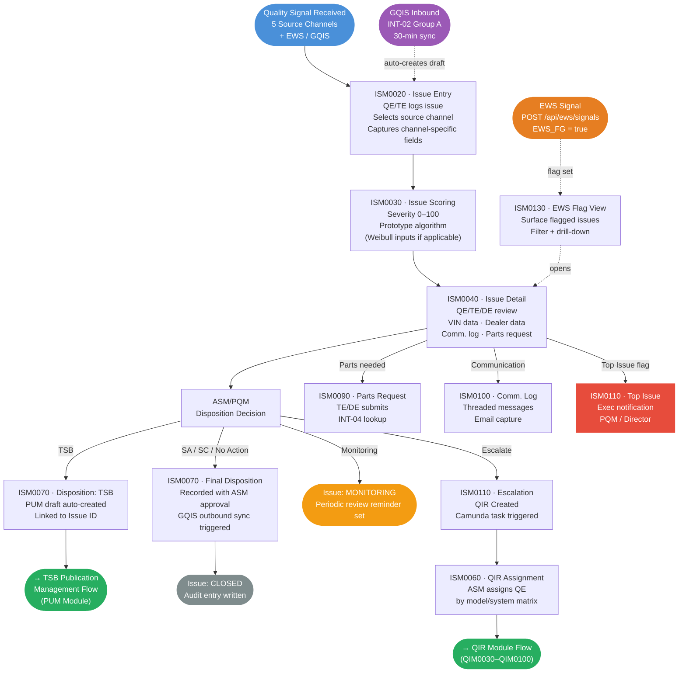
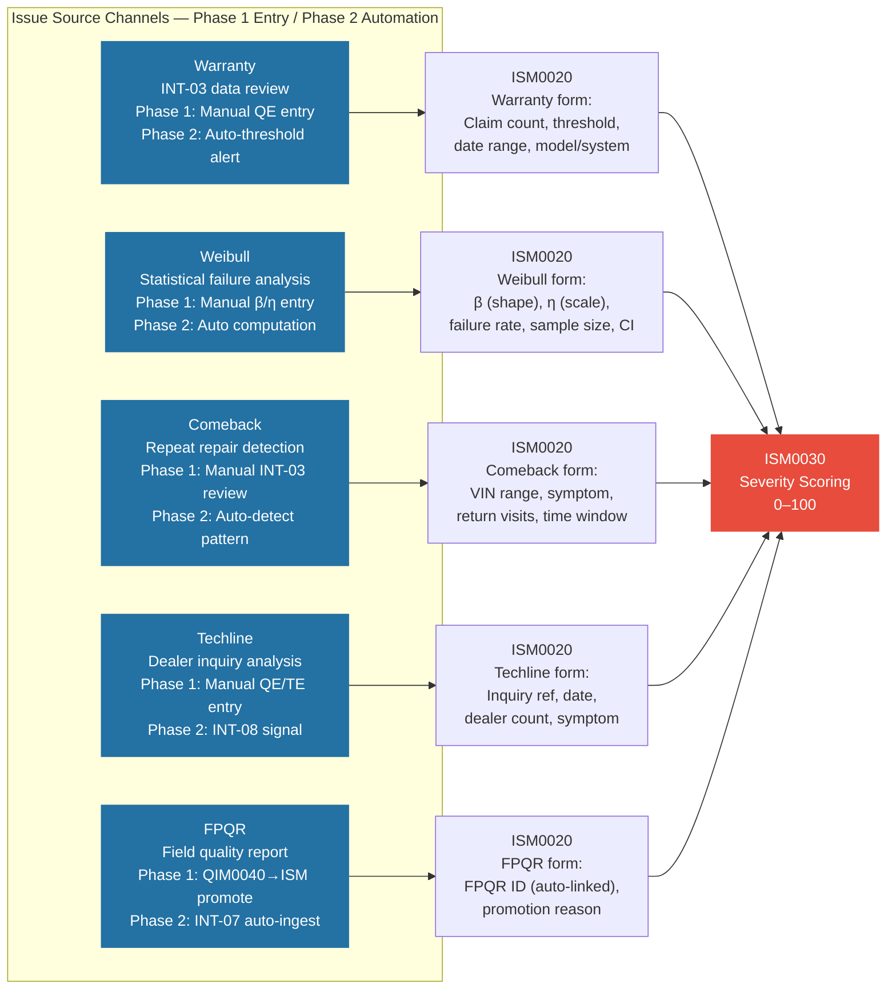

# N-PQMS — Issue Management (ISM) Detailed Requirements Document

**Document ID:** KPQMS-ISM-DRD-v1.0  
**Module:** Issue Management (ISM) — 14 Screens  
**Reference BRD:** KPQMS-BRD-P1-v1.1 §7  
**Project:** KUS PQMS Re-Platform — Phase 1  
**Author:** Joon Sung Yoo, HAEA PM  
**Date:** June 2026  
**Go-Live:** December 18, 2026

---

## Table of Contents

1. [Module Overview](#1-module-overview)
2. [Role Access Matrix](#2-role-access-matrix)
3. [ISM Lifecycle State Machine](#3-ism-lifecycle-state-machine)
4. [Master User Flow](#4-master-user-flow)
5. [Issue Source Channel Flows](#5-issue-source-channel-flows)
6. [Screen: ISM0010 — Issue List](#6-ism0010--issue-list)
7. [Screen: ISM0020 — Issue Entry](#7-ism0020--issue-entry)
8. [Screen: ISM0030 — Issue Scoring](#8-ism0030--issue-scoring)
9. [Screen: ISM0040 — Issue Detail](#9-ism0040--issue-detail)
10. [Screen: ISM0050 — QIR Creation](#10-ism0050--qir-creation)
11. [Screen: ISM0060 — QIR Assignment](#11-ism0060--qir-assignment)
12. [Screen: ISM0070 — Issue Disposition](#12-ism0070--issue-disposition)
13. [Screen: ISM0080 — Issue Tracking](#13-ism0080--issue-tracking)
14. [Screen: ISM0090 — Parts Request](#14-ism0090--parts-request)
15. [Screen: ISM0100 — Communication Log](#15-ism0100--communication-log)
16. [Screen: ISM0110 — Escalation Management](#16-ism0110--escalation-management)
17. [Screen: ISM0120 — Cross-Org Visibility](#17-ism0120--cross-org-visibility)
18. [Screen: ISM0130 — EWS Flag View](#18-ism0130--ews-flag-view)
19. [Screen: ISM0140 — Issue Admin / Batch](#19-ism0140--issue-admin--batch)
20. [Data Model Summary](#20-data-model-summary)
21. [API Endpoints (ISM)](#21-api-endpoints-ism)

---

## 1. Module Overview

The Issue Management (ISM) module is the core quality issue lifecycle engine of N-PQMS. It captures quality signals from five primary source channels, scores them for severity, routes them through disposition decisions, and escalates to QIR when required.

| Attribute | Detail |
|-----------|--------|
| Screen Count | 14 screens (ISM0010–ISM0140) |
| Usage Share | ~24.4% of total KPQMS usage |
| Tier | Tier 1 — Critical |
| Primary Roles | QE (creator/scorer), ASM (approver/dispositioner), PQM (final authority) |
| Workflow Engine | Camunda BPM (state transitions, assignment, escalation) |
| Key Integrations | INT-01 (VIN/model), INT-02 (GQIS sync), INT-03 (warranty/dealer), INT-04 (parts), EWS writeback |
| Issue Sources | Warranty · Weibull · Comeback · Techline · FPQR · EWS · GQIS · Manual |

### Issue Severity Scale

| Score | Band | Color | Meaning |
|-------|------|-------|---------|
| 80–100 | Critical | Red | Potential safety/recall risk; immediate escalation |
| 60–79 | High | Orange | Significant warranty impact; expedited review |
| 40–59 | Medium | Yellow | Moderate frequency; standard review cycle |
| 20–39 | Low | Green | Low warranty exposure; monitor |
| 0–19 | Informational | Gray | Single occurrences; watchlist only |

---

## 2. Role Access Matrix

| Screen | QE | TE | DE | CE | ASM | DM | PQM | Admin |
|--------|----|----|----|----|-----|----|-----|-------|
| ISM0010 Issue List | R/W | R/W | R | R | R/W | R | R/W | R/W |
| ISM0020 Issue Entry | R/W | R/W | R | — | R/W | — | R/W | R/W |
| ISM0030 Issue Scoring | R/W | R | R | — | Edit* | — | Edit* | R |
| ISM0040 Issue Detail | R/W | R/W | R/W | R | R/W | R | R/W | R/W |
| ISM0050 QIR Creation | R/W | R/W | — | — | R/W | — | R/W | R |
| ISM0060 QIR Assignment | — | — | — | — | R/W | — | R/W | R |
| ISM0070 Issue Disposition | R (propose) | R | R | — | Approve | — | Approve | R |
| ISM0080 Issue Tracking | R | R | R | R | R | R | R | R |
| ISM0090 Parts Request | — | R/W | R/W | — | Approve | — | R | R |
| ISM0100 Comm. Log | R/W | R/W | R/W | R | R/W | R | R/W | R/W |
| ISM0110 Escalation | R/W | R/W | — | — | R/W | — | R/W | R |
| ISM0120 Cross-Org | — | — | — | — | R/W | — | R/W | R |
| ISM0130 EWS Flag View | R | R | R | R | R | R | R | R |
| ISM0140 Issue Admin | — | — | — | — | — | — | — | R/W |

> *Edit = score override with mandatory justification; logged in audit trail.*  
> R = Read · R/W = Read + Write · — = No Access

---

## 3. ISM Lifecycle State Machine

```
                    ┌──────────────────────────────────────────────────┐
                    │           ISSUE STATES                           │
                    └──────────────────────────────────────────────────┘

  [DRAFT] ──── Submit ────► [OPEN / SCORING] ────► [IN REVIEW]
     ▲                              │                    │
     │                              ▼                    ▼
     │                       Score assigned        Disposition
     │                              │              Decision
     │                              │         ┌────────────────┐
     │                              │         │  TSB / SA / SC │──► [DISPOSED]──► [CLOSED]
     │                              │         │  No Action     │──► [CLOSED]
     │                              │         │  Monitoring    │──► [MONITORING]
     │                              │         └────────────────┘
     │                              │
     │                              │         ┌──────────────────┐
     │                              └────────►│  ESCALATED (QIR) │──► QIM module
     │                                        └──────────────────┘
     │
     └── ASM/PQM reject ◄─── [PENDING APPROVAL]


  State Transition Rules (Camunda BPM enforced):
  ┌────────────────────┬──────────────────────┬───────────────────┐
  │ From               │ To                   │ Role Required     │
  ├────────────────────┼──────────────────────┼───────────────────┤
  │ Draft              │ Open                 │ QE/TE             │
  │ Open               │ In Review            │ QE/TE (auto)      │
  │ In Review          │ Pending Approval     │ QE (propose disp.)│
  │ Pending Approval   │ Disposed / Closed    │ ASM / PQM         │
  │ Pending Approval   │ In Review            │ ASM / PQM (reject)│
  │ In Review          │ Escalated            │ QE/ASM            │
  │ Any open state     │ Monitoring           │ ASM / PQM         │
  └────────────────────┴──────────────────────┴───────────────────┘
```

---

## 4. Master User Flow



---

## 5. Issue Source Channel Flows



---

## 6. ISM0010 — Issue List

**Purpose:** Primary landing screen for Issue Management. Lists all quality issues with filter, sort, and bulk actions. Entry point to all other ISM screens.  
**Tier:** 1 — Critical | **Primary Role:** QE | **Approx. Usage Rank:** Top 10

### 6.1 User Story

> As a **Quality Engineer**, I need to see all active quality issues in a sortable, filterable list so I can prioritize my work by severity, source, and model, and quickly navigate to any issue for review or entry.

> As an **ASM**, I need to see issues pending my disposition approval highlighted at the top of the list so I do not miss escalation deadlines.

### 6.2 Detailed Functional Requirements

| ID | Requirement | Priority |
|----|------------|---------|
| ISM0010-FR-001 | Page load shall complete within 2 seconds at 10 concurrent users (DEV); 1.5 seconds at 50 concurrent users (Staging) | P1 |
| ISM0010-FR-002 | Default view: all open issues sorted by severity score descending; user's last filter state persisted in browser session | P1 |
| ISM0010-FR-003 | Filter panel shall include: Source Channel (multi-select), Model (multi-select from INT-01), Severity Band (multi-select), Status (multi-select), Owner (role or user), Date Reported (range picker), EWS Flag (yes/no) | P1 |
| ISM0010-FR-004 | Issue table columns: Issue ID, Title (truncated at 60 chars), Source Channel badge, Model/MY, Severity Score (bar + number), Status badge (color-coded), Owner, Days Open | P1 |
| ISM0010-FR-005 | EWS-flagged issues shall display a warning indicator (⚠) in the leftmost column; column is filterable | P1 |
| ISM0010-FR-006 | Severity score shall render as a filled bar colored per the severity band (Critical=Red, High=Orange, Medium=Yellow, Low=Green, Info=Gray) alongside the numeric score | P1 |
| ISM0010-FR-007 | Status badge colors: Draft=Gray, Open=Blue, In Review=Purple, Pending Approval=Orange, Disposed=Teal, Closed=Dark Gray, Monitoring=Yellow, Escalated=Red | P1 |
| ISM0010-FR-008 | Clicking any row opens ISM0040 (Issue Detail) in the same tab | P1 |
| ISM0010-FR-009 | "New Issue" button (QE/TE/ASM/PQM roles only) opens ISM0020 | P1 |
| ISM0010-FR-010 | Bulk select via checkbox column; bulk actions: Assign to role, Change status, Export selected to XLSX | P2 |
| ISM0010-FR-011 | Pagination: 20 rows per page default; configurable to 50/100 | P1 |
| ISM0010-FR-012 | Column header click sorts ascending/descending; sort state persisted in session | P1 |
| ISM0010-FR-013 | "My Issues" quick-filter tab shows only issues assigned to the logged-in user | P1 |
| ISM0010-FR-014 | "Pending My Action" tab shows issues where the logged-in user's role has an outstanding action (disposition approval, assignment, etc.) | P1 |
| ISM0010-FR-015 | Total issue count and count per severity band displayed in a summary bar above the table | P2 |

### 6.3 Business Rules

- Issues in MONITORING status are included in the list but visually de-emphasized (italicized row)
- CLOSED issues are hidden by default; "Show Closed" toggle reveals them
- Admin role sees all issues across all org units; other roles see issues within their org unit + cross-org shared issues they've been granted access to
- Source channel filter displays: Warranty · Weibull · Comeback · Techline · FPQR · EWS · GQIS · Manual

### 6.4 Mockup — ISM0010 Issue List

```
┌──────────────────────────────────────────────────────────────────────────────────┐
│  N-PQMS                               [QE: John Kim ▾]  [🔔 3]  [?]  [Logout] │
├──────────────────────────────────────────────────────────────────────────────────┤
│  Issue Management  >  Issue List (ISM0010)                                       │
├──────────────────────────────────────────────────────────────────────────────────┤
│  [All Issues] [My Issues] [Pending My Action]                    [+ New Issue]  │
├──────────────────────────────────────────────────────────────────────────────────┤
│  FILTERS                                                          [Clear Filters]│
│  Source: [Warranty][Weibull][Comeback][Techline][FPQR][EWS][GQIS][Manual]       │
│  Model:  [All ▾]   Status: [Open ▾]   Severity: [All ▾]   Owner: [All ▾]       │
│  Date:   [From ____] to [____]    EWS Flag: [All ▾]           [🔍 Apply Filter] │
├───────────────────────────────────────────────────────────────────────────────────┤
│  Showing 38 issues  │  Critical: 4  │  High: 11  │  Medium: 15  │  Low: 8       │
├───┬──────┬──────────────────────┬──────────┬───────┬───────────┬──────────┬─────┤
│   │  ID  │ Title                │ Source   │ Model │  Severity │ Status   │Days │
├───┼──────┼──────────────────────┼──────────┼───────┼───────────┼──────────┼─────┤
│ ⚠ │ 0042 │ EV Battery Rapid..   │ Warranty │ EV6   │ ████ 84   │ IN REVW  │  12 │
│   │ 0041 │ 6AT Slip at Cold..   │ Comeback │ K5    │ ███  71   │ IN REVW  │   5 │
│   │ 0039 │ Front Strut Creak    │ Weibull  │ Telle │ ██   53   │ SCORING  │   2 │
│   │ 0038 │ HVAC Fan Noise 2k+   │ Techline │ Sorto │ ██   48   │ PENDING  │  17 │
│   │ 0037 │ Brake Squeal HV..    │ FPQR     │ EV9   │ █    34   │ IN REVW  │  22 │
│   │ 0036 │ Sunroof Drain Clo..  │ Manual   │ K9    │ █    21   │ DRAFT    │   1 │
│   │ 0033 │ GQIS: Wiper Blade..  │ GQIS     │ Sorto │ █    18   │ MONIT.   │  65 │
│   │ ...  │ ...                  │ ...      │ ...   │ ...       │ ...      │ ... │
├───┴──────┴──────────────────────┴──────────┴───────┴───────────┴──────────┴─────┤
│  « 1  [2]  3  4  »    Rows per page: [20 ▾]                  [Export to XLSX]   │
└──────────────────────────────────────────────────────────────────────────────────┘
```

---

## 7. ISM0020 — Issue Entry

**Purpose:** Create a new quality issue. Captures all baseline metadata plus channel-specific structured fields. The source channel selection dynamically reveals the correct input form.  
**Tier:** 1 — Critical | **Primary Role:** QE/TE | **NFR:** Submit response ≤ 3s

### 7.1 User Story

> As a **Quality Engineer**, I want to log a new quality issue by selecting its source channel (Warranty, Weibull, Comeback, Techline, or FPQR) so the system guides me through the correct structured data fields for that channel, ensuring consistent, complete data that the scoring algorithm can use.

> As a **TE (Test Engineer)**, when I identify a comeback pattern during a dealer review, I want to quickly enter the issue with VIN range, symptom code, and return-visit count so that QE can proceed to scoring without having to ask me for additional data.

### 7.2 Detailed Functional Requirements

| ID | Requirement | Priority |
|----|------------|---------|
| ISM0020-FR-001 | Screen loads in a two-column layout: left = core issue fields; right = source-specific dynamic panel | P1 |
| ISM0020-FR-002 | **Issue Source** (mandatory dropdown) must be selected first; selecting source reveals the corresponding dynamic panel and collapses all other channel panels | P1 |
| ISM0020-FR-003 | Core fields (always visible): Issue Title (max 120 chars), Description (max 2,000 chars, rich text), Model (dropdown from INT-01), Model Year (multi-select from INT-01 for chosen model), System (dropdown from ADM0200 master), Subsystem (dependent dropdown), Symptom Code (from ADM0200), Affected VIN Range (free text + VIN lookup button), Reported Date (date picker, defaults to today) | P1 |
| ISM0020-FR-004 | "Lookup VIN" button calls INT-01 and populates: Model, Model Year, Plant, Production Date in read-only fields below the VIN range field | P1 |
| ISM0020-FR-005 | Dealer auto-populate: if dealer code entered, call INT-03 to populate: Dealer Name, Region, Open Repair Orders count | P1 |
| ISM0020-FR-006 | **Warranty dynamic panel**: Warranty Claim Count (integer), Threshold Value Crossed (decimal, e.g. 2.5%), Date Range of Claims (from/to), Link to INT-03 Claims View (button), Claim Baseline Description (optional text) | P1 |
| ISM0020-FR-007 | **Weibull dynamic panel**: Shape Parameter β (decimal, required), Scale Parameter η (decimal, required, labeled "Characteristic Life"), Failure Rate at Current Mileage/Time (decimal, %), Sample Population Size (integer), Confidence Interval (dropdown: 90% / 95% / 99%), Analysis Baseline (textarea) | P1 |
| ISM0020-FR-008 | **Comeback dynamic panel**: VIN Range with Repeat Repairs (text), Symptom Code (from ADM0200 master), Number of Return Visits (integer, min 2), Time Window (integer, days), Dealer Region (multi-select), Repair Order Reference (optional) | P1 |
| ISM0020-FR-009 | **Techline dynamic panel**: Inquiry Reference ID (free text), Inquiry Date (date picker), Symptom Description (textarea, max 500 chars), Affected Model/System (pre-filled from core fields), Number of Dealers Reporting Same Issue (integer), Techline Category (dropdown: Electrical / Mechanical / Software / NVH / Other) | P1 |
| ISM0020-FR-010 | **FPQR dynamic panel**: FPQR ID (read-only, auto-linked from QIM0040 promotion), Linked FPQR Date, Promotion Reason (textarea), FPQR Count (number of FPQRs linked), Link to FPQR record (button) | P1 |
| ISM0020-FR-011 | File attachments: PDF, DOCX, XLSX, JPEG, PNG; max 25 MB per file; max 10 attachments per issue | P1 |
| ISM0020-FR-012 | "Save Draft" saves without validation except Issue Title; "Submit" triggers full validation and transitions issue to OPEN state via Camunda | P1 |
| ISM0020-FR-013 | Auto-save every 5 minutes while form is open; unsaved indicator shown in page header | P2 |
| ISM0020-FR-014 | On Submit: system triggers ISM0030 scoring calculation asynchronously; user is redirected to ISM0040 with a "Scoring in progress" indicator | P1 |
| ISM0020-FR-015 | When source = GQIS (inbound auto-created draft), the form opens pre-populated with GQIS data; the source field is locked to GQIS; QE can edit all other fields | P1 |
| ISM0020-FR-016 | Issue Source field becomes immutable after Submit (except ASM/PQM with justification) | P1 |

### 7.3 Field Validation Rules

| Field | Rule |
|-------|------|
| Issue Title | Required, 5–120 chars |
| Issue Source | Required, must select before other fields are enabled |
| Model | Required, must be from INT-01 list |
| System | Required, from ADM0200 master |
| Reported Date | Required, cannot be future date |
| Weibull β | Required if source=Weibull; decimal > 0; typical range 0.5–5.0 |
| Weibull η | Required if source=Weibull; decimal > 0 |
| Failure Rate | Required if source=Weibull; 0.0001–99.9999% |
| Sample Population | Required if source=Weibull; integer ≥ 10 |
| Return Visits | Required if source=Comeback; integer ≥ 2 |
| Time Window | Required if source=Comeback; 1–365 days |
| FPQR ID | Auto-populated when source=FPQR; not editable by user |

### 7.4 Mockup — ISM0020 Issue Entry (Warranty Source Selected)

```
┌──────────────────────────────────────────────────────────────────────────────────┐
│  N-PQMS                               [QE: John Kim ▾]  [🔔 3]  [?]  [Logout] │
├──────────────────────────────────────────────────────────────────────────────────┤
│  Issue Management  >  Issue List  >  New Issue Entry (ISM0020)     [AUTO-SAVE ✓]│
├────────────────────────────────────────┬─────────────────────────────────────────┤
│  CORE ISSUE INFORMATION                │  SOURCE CHANNEL DETAILS                 │
│                                        │                                         │
│  Issue Source * ────────────────────── │  ┌─ Warranty ───────────────────────┐  │
│  [Warranty              ▾]             │  │                                  │  │
│                                        │  │  Warranty Claim Count *          │  │
│  Issue Title *                         │  │  [  324              ]           │  │
│  [EV Battery Rapid Capacity Drain...] │  │                                  │  │
│                                        │  │  Threshold Crossed (%) *         │  │
│  Description *                         │  │  [  3.20             ]           │  │
│  ┌────────────────────────────────┐    │  │                                  │  │
│  │ Multiple reports of EV battery │    │  │  Date Range of Claims *          │  │
│  │ losing >20% capacity within 12 │    │  │  From [2026-01-01] To [2026-05-31│  │
│  │ months / 15,000 miles. Cross-  │    │  │                                  │  │
│  │ checked against INT-03 Siebel  │    │  │  Claim Baseline                  │  │
│  │ dealer RO data showing repeat  │    │  │  [2.1% baseline Q1 2025...    ]  │  │
│  └────────────────────────────────┘    │  │                                  │  │
│                                        │  │  [View INT-03 Warranty Claims]   │  │
│  Model *        Model Year *           │  └──────────────────────────────────┘  │
│  [EV6     ▾]   [2024 ▾] [2025 ▾]      │                                         │
│                                        │  AFFECTED VIN RANGE                     │
│  System *                              │  [KNAGN41B_P5000001 to _5000450   ]    │
│  [Electrical & Electronics  ▾]         │  [Lookup VIN]  → Plant: Hwasung-si     │
│                                        │     Model: EV6 · MY: 2024             │
│  Subsystem *                           │     Prod Date: 2023-09-12             │
│  [High-Voltage Battery System  ▾]      │                                         │
│                                        │  REPORTED DATE *                        │
│  Symptom Code *                        │  [2026-06-08          ]                 │
│  [B-0042 · Premature Capacity Loss ▾]  │                                         │
│                                        │  ATTACHMENTS                            │
│  Dealer (optional)                     │  [📎 Add Files]  Max 25MB, 10 files     │
│  [                    ] [Lookup]       │  • INT03_EV6_Battery_Claims.xlsx  ✓     │
│                                        │                                         │
├────────────────────────────────────────┴─────────────────────────────────────────┤
│                     [Save Draft]      [Cancel]       [Submit Issue →]            │
└──────────────────────────────────────────────────────────────────────────────────┘
```

### 7.5 Mockup — ISM0020 Dynamic Panel: Weibull Source

```
│  SOURCE CHANNEL DETAILS                                                          │
│  ┌─ Weibull ──────────────────────────────────────────────────────────────────┐  │
│  │                                                                            │  │
│  │  Shape Parameter β *              Scale Parameter η (Char. Life) *        │  │
│  │  [  1.85           ]              [  62,500 miles           ]             │  │
│  │  Typical range: 0.5–5.0           Unit: miles / months                    │  │
│  │                                                                            │  │
│  │  Failure Rate at Current Mileage *    Sample Population Size *            │  │
│  │  [  4.32  ] %                         [  1,847              ]             │  │
│  │                                                                            │  │
│  │  Confidence Interval *                                                     │  │
│  │  [95%  ▾]                                                                  │  │
│  │                                                                            │  │
│  │  Analysis Baseline                                                         │  │
│  │  [Weibull B10 life at 4.32% FR exceeds acceptable threshold of 2.0%...]   │  │
│  │                                                                            │  │
│  └────────────────────────────────────────────────────────────────────────────┘  │
│  ⓘ Weibull parameters will be fed to the severity scoring algorithm (ISM0030)   │
```

---

## 8. ISM0030 — Issue Scoring

**Purpose:** Displays the calculated severity score (0–100) for an issue. QE reviews inputs; ASM/PQM can override with justification.  
**Tier:** 1 — Critical | **Primary Roles:** QE (review), ASM/PQM (override)

### 8.1 User Story

> As a **Quality Engineer**, after submitting an issue I need to see a transparent severity score with a breakdown of what inputs drove it, so I can understand the risk level and decide whether to escalate, propose a disposition, or request a score override.

> As an **ASM**, I need to override a severity score that is obviously miscalculated by entering a justification, so I can properly prioritize the issue for my team without waiting for a Phase 2 AI retraining cycle.

### 8.2 Detailed Functional Requirements

| ID | Requirement | Priority |
|----|------------|---------|
| ISM0030-FR-001 | Severity score is computed asynchronously on Submit in ISM0020; ISM0030 shows "Calculating…" spinner until result is ready (max 10 seconds) | P1 |
| ISM0030-FR-002 | Score displayed as: large numeric (0–100), severity band label (Critical/High/Medium/Low/Info), and color-coded gauge bar | P1 |
| ISM0030-FR-003 | Score breakdown section shows weighted input factors: Field Frequency (% of score), Repair Cost Index (% of score), Warranty Claims Count (% of score) | P1 |
| ISM0030-FR-004 | For Weibull-source issues: additional breakdown row shows Weibull inputs (β, η, failure rate, population) and their combined weight in the score | P1 |
| ISM0030-FR-005 | Score history panel: shows all score values over time with: calculated date, algorithm version, previous score, new score, changed by (system or user), reason | P1 |
| ISM0030-FR-006 | **Score Override (ASM/PQM only)**: "Override Score" button reveals a form: New Score (0–100), Override Reason (mandatory, min 20 chars). On save, override is logged in audit trail and score history | P1 |
| ISM0030-FR-007 | Override reason and overriding user are displayed inline below the score with a "Manually Overridden" label | P1 |
| ISM0030-FR-008 | If INT-03 data is unavailable at scoring time, score is calculated with available data and flagged "Partial — Siebel data unavailable; rescore pending" | P1 |
| ISM0030-FR-009 | "Request Rescore" button available to QE; triggers score recalculation using current INT-01/INT-03 data | P2 |
| ISM0030-FR-010 | Scoring algorithm version (e.g., v1.2.0) is displayed for traceability; Phase 2 replaces with AI scoring engine | P1 |

### 8.3 Scoring Algorithm — Phase 1 Prototype

```
Score = (Claim_Frequency × 0.35) + (Repair_Cost_Index × 0.30) + (Claims_Count × 0.20) + (Weibull_Adj × 0.15)

Where:
  Claim_Frequency = (issues per 1,000 vehicles in affected VIN range) normalized 0–100
  Repair_Cost_Index = (avg repair cost from INT-03) / (system-max cost) × 100
  Claims_Count = (total claims in date range) / (volume threshold) × 100
  Weibull_Adj = (failure rate / acceptable threshold) × 100 [Weibull-source only; otherwise 0 → weight redistributed]

Capped at 100. All inputs from INT-01 + INT-03 at time of scoring.
```

### 8.4 Mockup — ISM0030 Issue Scoring

```
┌──────────────────────────────────────────────────────────────────────────────────┐
│  N-PQMS                               [QE: John Kim ▾]  [🔔 3]  [?]  [Logout] │
├──────────────────────────────────────────────────────────────────────────────────┤
│  Issue Management  >  #0042 EV Battery Rapid Capacity Drain  >  Scoring (ISM0030)│
├──────────────────────────────────────────────────────────────────────────────────┤
│                                                                                  │
│   SEVERITY SCORE                              SCORE BREAKDOWN                    │
│   ┌─────────────────────────┐                 ┌────────────────────────────────┐ │
│   │                         │                 │ Factor          Weight  Points │ │
│   │          84             │                 │ ─────────────────────────────  │ │
│   │        ██████           │                 │ Field Frequency  35%    31.5   │ │
│   │     ██████████          │                 │ Repair Cost      30%    24.0   │ │
│   │   CRITICAL              │                 │ Claims Count     20%    16.8   │ │
│   │                         │                 │ Weibull Adj      15%    11.7   │ │
│   │  ████████████████████   │                 │ ─────────────────────────────  │ │
│   │  0─────────────────100  │                 │ TOTAL            100%   84.0   │ │
│   │          ↑              │                 └────────────────────────────────┘ │
│   │        Score            │                 Algorithm Version: v1.0.3         │
│   └─────────────────────────┘                 Scored: 2026-06-08 09:14 UTC      │
│                                                                                  │
│   WEIBULL INPUTS (Weibull-source)                                                │
│   β = 1.85  │  η = 62,500 mi  │  FR = 4.32%  │  Pop = 1,847  │  CI = 95%       │
│   Acceptable FR Threshold: 2.0%  →  Weibull Adj = 4.32/2.0 × 100 = 100 (capped)│
│                                                                                  │
│   INT-03 DATA USED                                                               │
│   Claims in range: 324  │  Avg Repair Cost: $1,847  │  Data as of: 2026-06-07  │
│                                                                                  │
├──────────────────────────────────────────────────────────────────────────────────┤
│   SCORE HISTORY                                                                  │
│   ┌──────────────┬─────┬────────────────────────────────────────────────────┐   │
│   │ Date         │Score│ Note                                               │   │
│   ├──────────────┼─────┼────────────────────────────────────────────────────┤   │
│   │ 2026-06-08   │  84 │ Initial auto-score (v1.0.3)                        │   │
│   └──────────────┴─────┴────────────────────────────────────────────────────┘   │
│                                                                                  │
│   ─────── ASM / PQM ONLY ──────────────────────────────────────────────────── │
│   [Override Score]                                                               │
├──────────────────────────────────────────────────────────────────────────────────┤
│         [← Back to Issue List]          [View Issue Detail →]                   │
└──────────────────────────────────────────────────────────────────────────────────┘
```

---

## 9. ISM0040 — Issue Detail

**Purpose:** Master view of a quality issue. Aggregates all issue data, VIN info, dealer info, linked QIR/FPQR, communication log, and action buttons. Central hub for QE/TE/DE/ASM collaboration.  
**Tier:** 1 — Critical | **Primary Roles:** QE, TE, DE, ASM

### 9.1 User Story

> As a **QE**, I want a single screen that shows me everything about an issue — the score, the VIN/dealer data, the communication thread, and any linked QIR or FPQR — so I do not need to navigate multiple screens during an investigation.

> As a **DE (Design Engineer)**, I need to see the issue's technical detail (symptom, system, VIN production data) alongside the communication thread so I can contribute analysis without reprocessing the same information each time.

### 9.2 Detailed Functional Requirements

| ID | Requirement | Priority |
|----|------------|---------|
| ISM0040-FR-001 | Screen uses a tabbed layout: [Overview] [VIN & Vehicle Data] [Dealer & Warranty] [Communication Log] [Parts Requests] [Documents] [History / Audit] | P1 |
| ISM0040-FR-002 | **Header bar** (always visible regardless of tab): Issue ID, Title, Source Channel badge, Severity Score badge, Status badge, Days Open, Owner, EWS flag indicator | P1 |
| ISM0040-FR-003 | **Overview tab**: all core issue fields (read-only), source channel summary panel (read-only), scoring summary (score + band), linked QIR count, linked FPQR count, disposition record (if any), action buttons panel | P1 |
| ISM0040-FR-004 | **Action buttons** in overview (role-dependent): [Edit Issue] (QE/TE if DRAFT/OPEN) · [Score Issue] (opens ISM0030) · [Request Parts] (TE/DE) · [Escalate to QIR] (QE/ASM) · [Flag Top Issue] (ASM/PQM) · [Propose Disposition] (QE) · [Share Org] (ASM/PQM) | P1 |
| ISM0040-FR-005 | **VIN & Vehicle Data tab**: VIN range display, INT-01 vehicle data table (Model, MY, Plant, Production Date, Options, Recall history), [Refresh from INT-01] button | P1 |
| ISM0040-FR-006 | **Dealer & Warranty tab**: INT-03 dealer data (Dealer Code, Name, Region, Region Mgr), Repair Order list (RO#, Date, Symptom, Repair Cost), Warranty Claims summary chart (claims per month), [Refresh from INT-03] button | P1 |
| ISM0040-FR-007 | **Communication Log tab**: same view as ISM0100 but embedded; quick-compose field at bottom | P1 |
| ISM0040-FR-008 | **Parts Requests tab**: same view as ISM0090 but embedded; [+ New Request] button for TE/DE | P1 |
| ISM0040-FR-009 | **Documents tab**: lists all attachments with: filename, uploaded by, date, size, download link; [+ Upload] button | P1 |
| ISM0040-FR-010 | **History / Audit tab**: immutable chronological log of all state changes, field edits, score changes, user actions with role, timestamp, and delta | P1 |
| ISM0040-FR-011 | If issue has a linked QIR, a banner at top of Overview tab shows QIR ID and status with a link to QIM0020 | P1 |
| ISM0040-FR-012 | Screen navigation: previous/next issue buttons in header to move through the current ISM0010 list without returning to list | P2 |

### 9.3 Mockup — ISM0040 Issue Detail

```
┌──────────────────────────────────────────────────────────────────────────────────┐
│  N-PQMS                               [QE: John Kim ▾]  [🔔 3]  [?]  [Logout] │
├──────────────────────────────────────────────────────────────────────────────────┤
│  Issue Management  >  Issue List  >  Issue #0042 (ISM0040)             [← →]   │
├──────────────────────────────────────────────────────────────────────────────────┤
│  ⚠ #0042 · EV Battery Rapid Capacity Drain                                       │
│  [Warranty]  Score: ████ 84 CRITICAL  Status: [IN REVIEW]  Owner: J. Kim  12d  │
│  ─────────────────────────────────────────────────────────────────────────────── │
│  [Overview] [VIN & Vehicle Data] [Dealer & Warranty] [Comm. Log] [Parts] [Audit]│
├──────────────────────────────────────────────────────────────────────────────────┤
│  OVERVIEW                          │  ACTIONS                                    │
│                                    │  ┌────────────────────────────────────┐    │
│  Source:     Warranty              │  │  [Edit Issue]    (OPEN state)      │    │
│  Model:      EV6 / 2024, 2025      │  │  [View Score]                      │    │
│  System:     Elec & Electronics    │  │  [Request Parts]                   │    │
│  Subsystem:  HV Battery System     │  │  [Propose Disposition]             │    │
│  Symptom:    B-0042 Premature      │  │  [Escalate to QIR]                 │    │
│              Capacity Loss         │  │  [Flag as Top Issue]               │    │
│  VIN Range:  KNAGN41B_P5000001..   │  └────────────────────────────────────┘    │
│  Reported:   2026-06-08            │                                             │
│  Created by: John Kim (QE)         │  LINKED RECORDS                             │
│                                    │  QIR:  None                                 │
│  WARRANTY SOURCE SUMMARY           │  FPQR: None                                 │
│  Claims: 324                       │  TSB:  None                                 │
│  Threshold: 3.20%                  │                                             │
│  Period: Jan–May 2026              │  DISPOSITION                                │
│                                    │  Not yet recorded                           │
│                                    │                                             │
├──────────────────────────────────────────────────────────────────────────────────┤
│                              [← Back to Issue List]                              │
└──────────────────────────────────────────────────────────────────────────────────┘
```

---

## 10. ISM0050 — QIR Creation

**Purpose:** Initiate a Quality Issue Report from a scored and reviewed issue. Pre-populates QIR fields from the linked issue.  
**Tier:** 1 — Critical | **Primary Roles:** QE, TE, ASM

### 10.1 User Story

> As a **QE**, when an issue is scored and has sufficient evidence, I want to create a QIR pre-filled with the issue data so I do not have to re-enter everything, and the QIR is automatically linked to the originating issue ID.

### 10.2 Detailed Functional Requirements

| ID | Requirement | Priority |
|----|------------|---------|
| ISM0050-FR-001 | QIR Creation form is accessible from ISM0040 [Escalate to QIR] button | P1 |
| ISM0050-FR-002 | Form pre-populates: QIR Title (from issue title), Severity Score, Model, Model Year, System, Subsystem, Symptom Code, Affected VIN Range, Source Channel, Source Evidence summary | P1 |
| ISM0050-FR-003 | QE must provide: Investigation Summary (textarea, required), Root Cause Hypothesis (textarea), Priority Level (dropdown: Urgent / High / Normal), Target Close Date (date picker) | P1 |
| ISM0050-FR-004 | All attachments from the source issue are automatically linked to the QIR; QE can add additional files | P1 |
| ISM0050-FR-005 | On Submit: QIR record is created in QIM module with status = Draft; Camunda triggers ISM0060 QIR Assignment task for ASM role; issue status updates to ESCALATED | P1 |
| ISM0050-FR-006 | Confirmation screen shows QIR ID and link to QIM0020 (QIR Detail) | P1 |
| ISM0050-FR-007 | A QIR can only be created from an issue in OPEN or IN REVIEW state with a severity score present | P1 |

### 10.3 Mockup — ISM0050 QIR Creation

```
┌──────────────────────────────────────────────────────────────────────────────────┐
│  N-PQMS                               [QE: John Kim ▾]  [🔔 3]  [?]  [Logout] │
├──────────────────────────────────────────────────────────────────────────────────┤
│  Issue Management  >  #0042  >  Create QIR (ISM0050)                            │
├──────────────────────────────────────────────────────────────────────────────────┤
│  PRE-FILLED FROM ISSUE #0042 (read-only)                                         │
│  ┌────────────────────────────────────────────────────────────────────────────┐  │
│  │ Title:  EV Battery Rapid Capacity Drain        Source: Warranty            │  │
│  │ Model:  EV6 / 2024–2025     System: Elec & Electronics / HV Battery        │  │
│  │ Score:  84 (CRITICAL)       VIN Range: KNAGN41B_P5000001–5000450           │  │
│  └────────────────────────────────────────────────────────────────────────────┘  │
│                                                                                  │
│  QIR-SPECIFIC FIELDS                                                             │
│  Investigation Summary *                                                         │
│  ┌────────────────────────────────────────────────────────────────────────────┐  │
│  │ 324 warranty claims identified for EV6 MY24/25 HV battery capacity loss.   │  │
│  │ Field frequency 3.2% exceeds 2.0% threshold. Weibull B10 life at 4.32%    │  │
│  └────────────────────────────────────────────────────────────────────────────┘  │
│                                                                                  │
│  Root Cause Hypothesis (optional)                                                │
│  [Battery cell degradation accelerated by thermal cycling in cold climates...]   │
│                                                                                  │
│  Priority Level *          Target Close Date *                                   │
│  [Urgent     ▾]            [2026-07-15          ]                               │
│                                                                                  │
│  Attachments: 1 file from Issue #0042 auto-linked   [+ Add Files]               │
│                                                                                  │
├──────────────────────────────────────────────────────────────────────────────────┤
│            [Cancel]                  [Submit — Create QIR →]                    │
└──────────────────────────────────────────────────────────────────────────────────┘
```

---

## 11. ISM0060 — QIR Assignment

**Purpose:** ASM assigns a QIR to a specific QE using the model/system affinity matrix. Camunda BPM task form.  
**Tier:** 1 — Critical | **Primary Roles:** ASM, PQM

### 11.1 User Story

> As an **ASM**, when a new QIR assignment task appears in my Camunda queue, I need to assign it to the right QE based on their model/system expertise, with the system suggesting the best match from the affinity matrix, so the most qualified engineer picks it up immediately.

### 11.2 Detailed Functional Requirements

| ID | Requirement | Priority |
|----|------------|---------|
| ISM0060-FR-001 | Screen presents as a Camunda BPM task form; accessible from ASM's task inbox (Camunda) or directly from ISM0040 action panel | P1 |
| ISM0060-FR-002 | System suggests assignee based on the model/system affinity matrix (configured in ADM0120); top 3 suggestions displayed with match score | P1 |
| ISM0060-FR-003 | ASM can accept a suggestion or select a different QE from the full QE list; selection is mandatory | P1 |
| ISM0060-FR-004 | Optional note to assignee (textarea, max 500 chars) | P1 |
| ISM0060-FR-005 | On assign: Camunda creates a QE review task in QIM0030; QE receives email notification; QIR status → Under Review | P1 |
| ISM0060-FR-006 | Target review date auto-calculated from SLA config (ADM0130); shown to ASM during assignment | P1 |
| ISM0060-FR-007 | ASM can override SLA deadline with justification | P2 |

### 11.3 Mockup — ISM0060 QIR Assignment

```
┌──────────────────────────────────────────────────────────────────────────────────┐
│  N-PQMS  [Camunda Task]        [ASM: Park Soo-jin ▾]  [🔔 7]  [?]  [Logout]   │
├──────────────────────────────────────────────────────────────────────────────────┤
│  QIR Assignment (ISM0060)  ·  QIR-2026-0089  ·  EV Battery Rapid Capacity Drain │
├──────────────────────────────────────────────────────────────────────────────────┤
│  QIR SUMMARY                                                                     │
│  Model: EV6  │  System: HV Battery  │  Score: 84 CRITICAL  │  Priority: Urgent  │
│                                                                                  │
│  SUGGESTED ASSIGNEES (by affinity matrix — EV6 / Electrical & Electronics)      │
│  ┌──────────────────────────────────────────────────────────────────────────┐   │
│  │  ◉ Lee Jun-ho (QE)     ·  EV6 / Electrical — 47 cases resolved         │   │
│  │     Match: ████████ 92%    Current load: 3 open QIRs                    │   │
│  │                                                                          │   │
│  │  ○ Choi Min-seo (QE)   ·  EV / Battery specialist — 31 cases           │   │
│  │     Match: ███████  81%    Current load: 1 open QIR                     │   │
│  │                                                                          │   │
│  │  ○ Kim Yeon-ji (QE)    ·  Electrical generalist — 22 cases             │   │
│  │     Match: █████    65%    Current load: 5 open QIRs                    │   │
│  └──────────────────────────────────────────────────────────────────────────┘   │
│                                                                                  │
│  Or select other: [Search QE by name...                ▾]                       │
│                                                                                  │
│  Note to assignee (optional)                                                     │
│  [Focus on cold-climate VIN population first per warranty data...]               │
│                                                                                  │
│  SLA Review Deadline: 2026-06-22 (10 business days per Critical SLA config)     │
│                                                                                  │
├──────────────────────────────────────────────────────────────────────────────────┤
│          [Defer / Re-queue]              [Assign QIR →]                         │
└──────────────────────────────────────────────────────────────────────────────────┘
```

---

## 12. ISM0070 — Issue Disposition

**Purpose:** Record the final disposition decision for an issue. Requires ASM/PQM approval. TSB disposition auto-creates a PUM draft. GQIS outbound sync triggered on close.  
**Tier:** 1 — Critical | **Primary Roles:** QE (propose), ASM/PQM (approve)

### 12.1 User Story

> As a **QE**, after completing my investigation I want to propose a disposition (TSB, SA, SC, No Action, or Monitoring) so the ASM can review and formally close the issue with a documented decision in the audit trail.

> As an **ASM**, I want to approve or reject the proposed disposition, and if I select TSB, I want the system to automatically create a linked PUM draft so we do not have to start from scratch in the publication module.

### 12.2 Detailed Functional Requirements

| ID | Requirement | Priority |
|----|------------|---------|
| ISM0070-FR-001 | Disposition options: **TSB** (Technical Service Bulletin) · **SA** (Service Action) · **SC** (Safety Campaign) · **No Action** · **Monitoring** | P1 |
| ISM0070-FR-002 | QE/TE can propose a disposition; proposal is saved as PENDING APPROVAL and a Camunda task is created for ASM | P1 |
| ISM0070-FR-003 | ASM/PQM approves or rejects the proposed disposition; rejection returns issue to IN REVIEW with rejection reason | P1 |
| ISM0070-FR-004 | On ASM approval of TSB disposition: system auto-creates a PUM draft with issue ID, title, model, system, symptom pre-filled; link to PUM draft shown immediately | P1 |
| ISM0070-FR-005 | On approval of SA/SC disposition: system sets issue status = DISPOSED; GQIS outbound sync (INT-02 Group B) is triggered within 5 minutes | P1 |
| ISM0070-FR-006 | No Action disposition requires mandatory justification (min 30 chars) | P1 |
| ISM0070-FR-007 | Monitoring disposition requires: review frequency (dropdown: Weekly / Biweekly / Monthly), next review date (auto-calculated), monitoring criteria (textarea) | P1 |
| ISM0070-FR-008 | Disposition record is immutable after ASM approval; visible in ISM0040 Overview tab and ISM0080 timeline | P1 |
| ISM0070-FR-009 | SC (Safety Campaign) disposition triggers an additional notification to PQM and Director roles | P1 |

### 12.3 Mockup — ISM0070 Issue Disposition

```
┌──────────────────────────────────────────────────────────────────────────────────┐
│  N-PQMS                               [QE: John Kim ▾]  [🔔 3]  [?]  [Logout] │
├──────────────────────────────────────────────────────────────────────────────────┤
│  Issue Management  >  #0042  >  Disposition (ISM0070)                           │
│  ⚠ #0042 · EV Battery Rapid Capacity Drain ·  Score: ████ 84  ·  IN REVIEW    │
├──────────────────────────────────────────────────────────────────────────────────┤
│                                                                                  │
│  PROPOSE DISPOSITION                                                             │
│                                                                                  │
│  Disposition Type *                                                              │
│  ┌──────────────────────────────────────────────────────────────────────────┐   │
│  │  ○ TSB   — Technical Service Bulletin (system will create PUM draft)     │   │
│  │  ○ SA    — Service Action                                                │   │
│  │  ○ SC    — Safety Campaign  ⚠ (PQM/Director notification triggered)     │   │
│  │  ◉ TSB   ← selected                                                      │   │
│  │  ○ No Action  — Requires justification (min 30 chars)                    │   │
│  │  ○ Monitoring — Requires review schedule                                  │   │
│  └──────────────────────────────────────────────────────────────────────────┘   │
│                                                                                  │
│  Disposition Rationale *                                                         │
│  [324 warranty claims at 3.2% field frequency. Investigation confirms...      ]  │
│                                                                                  │
│  ── On ASM Approval, the following PUM draft will be auto-created: ──────────── │
│  Title:    EV Battery Rapid Capacity Drain — TSB                                 │
│  Model:    EV6 / 2024, 2025                                                     │
│  System:   Electrical & Electronics / HV Battery System                          │
│  Symptom:  B-0042 Premature Capacity Loss                                        │
│  Status:   DRAFT (linked to Issue #0042)                                         │
│                                                                                  │
├──────────────────────────────────────────────────────────────────────────────────┤
│         [Cancel]         [Save Proposal]       [Submit for ASM Approval →]      │
└──────────────────────────────────────────────────────────────────────────────────┘
```

---

## 13. ISM0080 — Issue Tracking

**Purpose:** Visual timeline showing the full lifecycle of an issue, all state transitions, and days-open tracking.  
**Tier:** 1 | **Primary Roles:** All roles (read-only)

### 13.1 Detailed Functional Requirements

| ID | Requirement | Priority |
|----|------------|---------|
| ISM0080-FR-001 | Horizontal timeline visual showing: issue open date → scoring date → review start → disposition proposed → disposition approved / QIR created → closed. Each milestone shows date and actor. | P1 |
| ISM0080-FR-002 | Days Open counter prominently displayed; color shifts to orange at 30 days, red at 60 days | P1 |
| ISM0080-FR-003 | SLA status per lifecycle stage: On Track (green), At Risk (orange), Overdue (red) | P1 |
| ISM0080-FR-004 | State transition history table below timeline: From State, To State, Triggered By (user/role/system), Date, Notes | P1 |
| ISM0080-FR-005 | Exportable to PDF for regulatory or management reporting | P2 |

### 13.2 Mockup — ISM0080 Issue Tracking

```
┌──────────────────────────────────────────────────────────────────────────────────┐
│  N-PQMS                               [QE: John Kim ▾]  [🔔 3]  [?]  [Logout] │
├──────────────────────────────────────────────────────────────────────────────────┤
│  Issue Management  >  #0042  >  Issue Tracking (ISM0080)                        │
│  ⚠ #0042 · EV Battery Rapid Capacity Drain ·  12 DAYS OPEN                     │
├──────────────────────────────────────────────────────────────────────────────────┤
│                                                                                  │
│  LIFECYCLE TIMELINE                                                              │
│                                                                                  │
│  Jun 8        Jun 8        Jun 9         [pending]     [pending]     [pending]  │
│  ●────────────●────────────●─────────────○─────────────○─────────────○          │
│  OPEN         SCORING      IN REVIEW     DISPOSITION   QIR / CLOSE   GQIS SYNC  │
│  09:02        09:14        10:31                                                  │
│  J. Kim (QE)  System       S. Park (ASM)                                         │
│               ✓ On track   ✓ On track    ⚠ 5 days left  ○ Pending    ○ Pending  │
│                                                                                  │
│  Days Open: 12   │  SLA Status: [ON TRACK]   │  Severity: CRITICAL              │
│                                                                                  │
│  STATE TRANSITION HISTORY                                                        │
│  ┌─────────────────┬──────────┬──────────────────┬────────────┬────────────────┐ │
│  │ From            │ To       │ Triggered By      │ Date/Time  │ Notes          │ │
│  ├─────────────────┼──────────┼──────────────────┼────────────┼────────────────┤ │
│  │ —               │ Draft    │ J. Kim (QE)       │ Jun 8 8:55 │ Issue created  │ │
│  │ Draft           │ Open     │ J. Kim (QE)       │ Jun 8 9:02 │ Submitted      │ │
│  │ Open            │ Scoring  │ System (auto)     │ Jun 8 9:02 │ Auto-scored 84 │ │
│  │ Scoring         │ In Review│ S. Park (ASM)     │ Jun 8 9:14 │ Assigned       │ │
│  └─────────────────┴──────────┴──────────────────┴────────────┴────────────────┘ │
│                                                                [Export PDF]      │
└──────────────────────────────────────────────────────────────────────────────────┘
```

---

## 14. ISM0090 — Parts Request

**Purpose:** TE/DE can submit a parts request tied to an issue for investigation purposes; ASM approves.  
**Tier:** 1 | **Primary Roles:** TE, DE (create), ASM (approve)

### 14.1 Detailed Functional Requirements

| ID | Requirement | Priority |
|----|------------|---------|
| ISM0090-FR-001 | Part number search calls INT-04 (SAP BW) parts master; returns: part description, SAP material number, current cost | P1 |
| ISM0090-FR-002 | Request fields: Part Number (INT-04 lookup), Part Description (auto-filled), Quantity (integer), Urgency (dropdown: Routine / Priority / Emergency), Investigation Purpose (textarea), Needed By Date | P1 |
| ISM0090-FR-003 | Request status lifecycle: Submitted → Approved → Ordered → Received | P1 |
| ISM0090-FR-004 | ASM approval required for Urgency = Priority or Emergency; Routine requests auto-approved within 24 hours | P2 |
| ISM0090-FR-005 | Multiple part requests per issue; listed in a table in ISM0090 and in ISM0040 Parts tab | P1 |

### 14.2 Mockup — ISM0090 Parts Request

```
┌──────────────────────────────────────────────────────────────────────────────────┐
│  Issue Management  >  #0042  >  Parts Request (ISM0090)                         │
├──────────────────────────────────────────────────────────────────────────────────┤
│  NEW PARTS REQUEST                                                               │
│  Part Number *         [37501-GI010     ]  [Search INT-04]                      │
│  Description:           High Voltage Battery Assembly — EV6 2024                 │
│  SAP Material #:        4500012847                                               │
│                                                                                  │
│  Quantity *: [2]    Urgency *: [Priority ▾]    Needed By: [2026-06-20]          │
│  Purpose *: [Investigation of cell degradation pattern in cold-climate VINs]    │
│                                       [Add Request →]                            │
├──────────────────────────────────────────────────────────────────────────────────┤
│  PARTS REQUESTS FOR ISSUE #0042                                                  │
│  ┌──────────────┬──────────────────────┬─────┬───────────┬──────────┬─────────┐ │
│  │ Part #       │ Description          │ Qty │ Urgency   │ Status   │ Action  │ │
│  ├──────────────┼──────────────────────┼─────┼───────────┼──────────┼─────────┤ │
│  │ 37501-GI010  │ HV Battery Assy EV6  │  2  │ Priority  │ APPROVED │ Track   │ │
│  │ 37511-GI020  │ BMS Control Module   │  1  │ Routine   │ ORDERED  │ Track   │ │
│  └──────────────┴──────────────────────┴─────┴───────────┴──────────┴─────────┘ │
└──────────────────────────────────────────────────────────────────────────────────┘
```

---

## 15. ISM0100 — Communication Log

**Purpose:** Threaded communication log per issue. Captures internal comments, email correspondence, and cross-org messages. Role-stamped and immutable.  
**Tier:** 1 | **Primary Roles:** All roles

### 15.1 Detailed Functional Requirements

| ID | Requirement | Priority |
|----|------------|---------|
| ISM0100-FR-001 | Messages displayed in reverse-chronological order; each entry shows: role/name badge, timestamp, message body, any attachments | P1 |
| ISM0100-FR-002 | Message types: Internal Comment (all roles) · External (shared with cross-org users) · Email (auto-captured outbound from N-PQMS) | P1 |
| ISM0100-FR-003 | Compose panel at bottom: type selector, rich text body (bold/italic/bullets), optional file attachment, [Post] button | P1 |
| ISM0100-FR-004 | Entries cannot be deleted; Admin can soft-hide (message body replaced with "[Hidden by Admin]") | P1 |
| ISM0100-FR-005 | @mention a user by name in a comment triggers an email notification to that user with a link to the issue | P2 |
| ISM0100-FR-006 | Filter by message type (Internal / External / Email) | P2 |

### 15.2 Mockup — ISM0100 Communication Log

```
┌──────────────────────────────────────────────────────────────────────────────────┐
│  Issue Management  >  #0042  >  Communication Log (ISM0100)                     │
├──────────────────────────────────────────────────────────────────────────────────┤
│  Filter: [All ▾]                                                                 │
│                                                                                  │
│  ┌────────────────────────────────────────────────────────────────────────────┐  │
│  │ [ASM]  Park Soo-jin                              Jun 9, 2026  10:31        │  │
│  │ Issue reviewed and confirmed Critical priority. Assigned to QIR process.   │  │
│  │ Please focus on cold-climate VIN population first.      [INTERNAL]         │  │
│  └────────────────────────────────────────────────────────────────────────────┘  │
│  ┌────────────────────────────────────────────────────────────────────────────┐  │
│  │ [QE]   John Kim                                  Jun 8, 2026  14:22        │  │
│  │ INT-03 data confirms 324 claims. @Lee Jun-ho please review the Weibull     │  │
│  │ analysis attached — B10 life is below spec.     [INTERNAL]  📎 weibull.xlsx│  │
│  └────────────────────────────────────────────────────────────────────────────┘  │
│  ┌────────────────────────────────────────────────────────────────────────────┐  │
│  │ [SYS]  System                                    Jun 8, 2026  09:02        │  │
│  │ Issue #0042 created by John Kim (QE). Source: Warranty. Score: 84.         │  │
│  └────────────────────────────────────────────────────────────────────────────┘  │
│                                                                                  │
│  COMPOSE                                                                         │
│  Type: [Internal ▾]                                                             │
│  ┌────────────────────────────────────────────────────────────────────────────┐  │
│  │ [Write a comment... @mention to notify a user]                             │  │
│  │                                                                            │  │
│  └────────────────────────────────────────────────────────────────────────────┘  │
│  [📎 Attach File]                                                [Post →]       │
└──────────────────────────────────────────────────────────────────────────────────┘
```

---

## 16. ISM0110 — Escalation Management

**Purpose:** Escalate an issue to QIR status (creates a QIM record via Camunda) or to Top Issue status (executive notification to PQM/Director).  
**Tier:** 1 | **Primary Roles:** QE/ASM (QIR escalation), ASM/PQM (Top Issue)

### 16.1 Detailed Functional Requirements

| ID | Requirement | Priority |
|----|------------|---------|
| ISM0110-FR-001 | Two escalation paths: **Escalate to QIR** and **Flag as Top Issue**; these are independent actions | P1 |
| ISM0110-FR-002 | Escalate to QIR: requires mandatory escalation reason (min 20 chars); creates QIR record in QIM module; triggers ISM0060 assignment Camunda task | P1 |
| ISM0110-FR-003 | Flag as Top Issue: requires justification; immediately sends notification to PQM and Director roles via SMTP; sets Top Issue flag on issue record | P1 |
| ISM0110-FR-004 | Top Issue flag is visible on ISM0010 (issue list) as a crown or star indicator | P2 |
| ISM0110-FR-005 | Escalation history is visible in the ISM0040 History tab and ISM0080 timeline | P1 |
| ISM0110-FR-006 | De-escalation (remove Top Issue flag) requires PQM role and mandatory justification | P1 |

---

## 17. ISM0120 — Cross-Org Visibility

**Purpose:** Grant read-only issue visibility to non-KUS organizational units (e.g., Korea HQ, supplier teams).  
**Tier:** 1 | **Primary Roles:** ASM, PQM

### 17.1 Detailed Functional Requirements

| ID | Requirement | Priority |
|----|------------|---------|
| ISM0120-FR-001 | ASM/PQM can toggle "Cross-Org Shared" on any issue; shared issues are visible to org units granted access | P1 |
| ISM0120-FR-002 | Org unit selector: multi-select from a configured list (managed in ADM0100) | P1 |
| ISM0120-FR-003 | External org users see the issue in ISM0010 in read-only mode; they cannot edit any field or add internal comments | P1 |
| ISM0120-FR-004 | External users can add External-type comments in ISM0100 | P1 |
| ISM0120-FR-005 | Sharing grants and revocations are logged in the issue audit trail | P1 |

---

## 18. ISM0130 — EWS Flag View

**Purpose:** Dedicated view of all issues carrying an EWS alert flag (`EWS_FG = true`), surfaced from SAS/QC via `POST /api/ews/signals`.  
**Tier:** 1 | **Primary Roles:** QE, ASM, PQM (read)

### 18.1 Detailed Functional Requirements

| ID | Requirement | Priority |
|----|------------|---------|
| ISM0130-FR-001 | Filtered version of ISM0010 showing only EWS-flagged issues; pre-applied filter cannot be removed | P1 |
| ISM0130-FR-002 | Additional column: EWS Signal Date (when `EWS_FG` was set), EWS Signal ID | P1 |
| ISM0130-FR-003 | EWS signal history panel: all `POST /api/ews/signals` calls for the issue with payload summary, received timestamp, processed status | P1 |
| ISM0130-FR-004 | Row click navigates to ISM0040 issue detail | P1 |
| ISM0130-FR-005 | Summary count: total EWS-flagged issues, new since last login | P2 |

---

## 19. ISM0140 — Issue Admin / Batch

**Purpose:** Admin-only screen for ISM module administration: batch job control, scoring parameter config, module-level settings.  
**Tier:** 1 | **Primary Roles:** Admin

### 19.1 Detailed Functional Requirements

| ID | Requirement | Priority |
|----|------------|---------|
| ISM0140-FR-001 | Batch job panel: shows all ISM scheduled jobs (GQIS sync, EWS signal processing, issue auto-close, overdue reminders) with status, last-run, next-run | P1 |
| ISM0140-FR-002 | Admin can trigger manual run of any ISM batch job | P1 |
| ISM0140-FR-003 | Scoring parameter config (Phase 1 prototype): weight sliders for Claim_Frequency, Repair_Cost_Index, Claims_Count; saved values take effect on next score calculation | P2 |
| ISM0140-FR-004 | Overdue reminder settings: configure days-open thresholds for each reminder notification | P2 |
| ISM0140-FR-005 | Source channel enable/disable toggle: Admin can disable a source channel globally (e.g., disable FPQR until QIM module is ready); disabled channels do not appear in ISM0020 source dropdown | P1 |
| ISM0140-FR-006 | All admin changes logged in the module audit trail | P1 |

---

## 20. Data Model Summary

### Core `ISSUE` Table

```sql
ISSUE (
  issue_id          VARCHAR(20) PRIMARY KEY,        -- e.g., ISM-2026-0042
  title             VARCHAR(120) NOT NULL,
  description       TEXT,
  issue_source      VARCHAR(20) NOT NULL,           -- Warranty/Weibull/Comeback/Techline/FPQR/EWS/GQIS/Manual
  status            VARCHAR(30) NOT NULL,            -- Draft/Open/InReview/PendingApproval/Disposed/Closed/Monitoring/Escalated
  model_code        VARCHAR(10),                    -- INT-01 reference
  model_year        VARCHAR(4),
  system_code       VARCHAR(20),                    -- ADM0200 master
  subsystem_code    VARCHAR(20),
  symptom_code      VARCHAR(20),                    -- ADM0200 master
  severity_score    INTEGER,                        -- 0–100
  severity_band     VARCHAR(20),                    -- Critical/High/Medium/Low/Info
  ews_flag          BOOLEAN DEFAULT FALSE,
  top_issue_flag    BOOLEAN DEFAULT FALSE,
  cross_org_shared  BOOLEAN DEFAULT FALSE,
  owner_user_id     VARCHAR(50),
  created_by        VARCHAR(50),
  created_at        TIMESTAMP,
  updated_at        TIMESTAMP,
  reported_date     DATE,
  closed_at         TIMESTAMP,
  days_open         INTEGER                         -- computed or stored
)

ISSUE_SOURCE_WARRANTY (
  issue_id          VARCHAR(20) FK ISSUE,
  claim_count       INTEGER,
  threshold_pct     DECIMAL(5,2),
  claims_from_date  DATE,
  claims_to_date    DATE,
  baseline_notes    TEXT
)

ISSUE_SOURCE_WEIBULL (
  issue_id          VARCHAR(20) FK ISSUE,
  beta              DECIMAL(8,4),                  -- Shape parameter
  eta               DECIMAL(12,2),                 -- Scale parameter (miles/months)
  failure_rate_pct  DECIMAL(8,4),
  sample_size       INTEGER,
  confidence_interval VARCHAR(5),                  -- 90/95/99
  analysis_notes    TEXT
)

ISSUE_SOURCE_COMEBACK (
  issue_id          VARCHAR(20) FK ISSUE,
  vin_range_text    TEXT,
  symptom_code      VARCHAR(20),
  return_visits     INTEGER,
  time_window_days  INTEGER,
  dealer_regions    TEXT                            -- JSON array
)

ISSUE_SOURCE_TECHLINE (
  issue_id          VARCHAR(20) FK ISSUE,
  inquiry_ref_id    VARCHAR(50),
  inquiry_date      DATE,
  symptom_desc      TEXT,
  dealer_count      INTEGER,
  techline_category VARCHAR(30)
)

ISSUE_SOURCE_FPQR (
  issue_id          VARCHAR(20) FK ISSUE,
  fpqr_id           VARCHAR(20) FK FPQR,
  fpqr_count        INTEGER,
  promotion_reason  TEXT
)

ISSUE_SCORE_HISTORY (
  score_id          SERIAL PRIMARY KEY,
  issue_id          VARCHAR(20) FK ISSUE,
  score             INTEGER,
  algorithm_version VARCHAR(20),
  scored_at         TIMESTAMP,
  scored_by         VARCHAR(50),                   -- 'SYSTEM' or user_id
  override_reason   TEXT                           -- NULL if auto-scored
)

ISSUE_DISPOSITION (
  disposition_id    SERIAL PRIMARY KEY,
  issue_id          VARCHAR(20) FK ISSUE,
  disposition_type  VARCHAR(20),                   -- TSB/SA/SC/NoAction/Monitoring
  rationale         TEXT,
  proposed_by       VARCHAR(50),
  proposed_at       TIMESTAMP,
  approved_by       VARCHAR(50),
  approved_at       TIMESTAMP,
  linked_tsb_id     VARCHAR(20),                   -- PUM module FK, nullable
  monitoring_freq   VARCHAR(20),                   -- if Monitoring type
  next_review_date  DATE
)
```

---

## 21. API Endpoints (ISM)

| Method | Path | Description | Auth |
|--------|------|-------------|------|
| GET | `/api/v1/issues` | List issues with filter/sort/pagination | JWT |
| POST | `/api/v1/issues` | Create new issue (submit) | QE/TE/ASM/PQM |
| POST | `/api/v1/issues/draft` | Save issue as draft | QE/TE |
| GET | `/api/v1/issues/{id}` | Get full issue detail | JWT |
| PUT | `/api/v1/issues/{id}` | Update issue (DRAFT/OPEN state only) | QE/TE |
| GET | `/api/v1/issues/{id}/score` | Get severity score + breakdown | JWT |
| POST | `/api/v1/issues/{id}/score/override` | Override score with justification | ASM/PQM |
| POST | `/api/v1/issues/{id}/score/recalculate` | Trigger rescore | QE |
| POST | `/api/v1/issues/{id}/disposition` | Propose disposition | QE |
| PUT | `/api/v1/issues/{id}/disposition/{dispId}/approve` | ASM/PQM approve disposition | ASM/PQM |
| PUT | `/api/v1/issues/{id}/disposition/{dispId}/reject` | Reject disposition with reason | ASM/PQM |
| POST | `/api/v1/issues/{id}/escalate` | Escalate to QIR | QE/ASM |
| POST | `/api/v1/issues/{id}/top-issue` | Flag as Top Issue | ASM/PQM |
| DELETE | `/api/v1/issues/{id}/top-issue` | Remove Top Issue flag | PQM |
| POST | `/api/v1/issues/{id}/parts-requests` | Create parts request | TE/DE |
| GET | `/api/v1/issues/{id}/parts-requests` | List parts requests | JWT |
| GET | `/api/v1/issues/{id}/communications` | Get communication log | JWT |
| POST | `/api/v1/issues/{id}/communications` | Post a communication entry | JWT |
| PUT | `/api/v1/issues/{id}/cross-org` | Grant/revoke cross-org sharing | ASM/PQM |
| GET | `/api/v1/issues/{id}/history` | Get full audit history | JWT |
| GET | `/api/v1/issues/ews-flagged` | Get EWS-flagged issues | JWT |
| **POST** | **`/api/ews/signals`** | **Receive EWS signal (external writeback)** | **Service JWT** |
| GET | `/api/v1/issues/{id}/tracking` | Get lifecycle timeline | JWT |

---

*Reference: KPQMS-BRD-P1-v1.1 §7 · N-PQMS_Flow_Diagrams.md Diagram 2*  
*Phase 1 Go-Live: December 18, 2026 · Document: KPQMS-ISM-DRD-v1.0*
