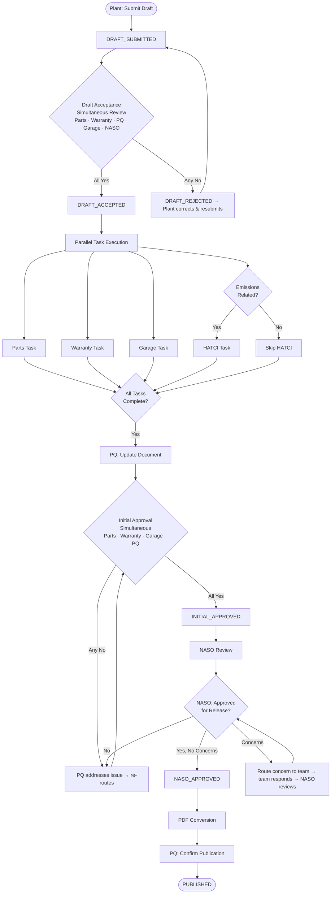

# N-PQMS Technical Service Bulletin (TSB) Module — Detailed Requirements Document

**Document ID:** KPQMS-TSB-DRD-v1.0  
**Version:** 1.0  
**Date:** 2026-06-10  
**Status:** Draft  
**Author:** Business Analysis Team  
**References:**  
- TSB Redesign Process and Tool 9-2024 v2 (Insoo / Terry comments)  
- TSB Requirement Field and Layout 12-2024  
- N-PQMS Phase 1 BRD v1.1 (KPQMS-BRD-P1-v1.1)

---

## Table of Contents

1. [Module Overview](#1-module-overview)
2. [Roles and Access](#2-roles-and-access)
3. [TSB Lifecycle](#3-tsb-lifecycle)
4. [Process Flow](#4-process-flow)
5. [Functional Requirements — TSB Draft Submission](#5-functional-requirements--tsb-draft-submission)
6. [Functional Requirements — Draft Acceptance](#6-functional-requirements--draft-acceptance)
7. [Functional Requirements — Parts Team Task](#7-functional-requirements--parts-team-task)
8. [Functional Requirements — Warranty Team Task](#8-functional-requirements--warranty-team-task)
9. [Functional Requirements — Garage Team Task](#9-functional-requirements--garage-team-task)
10. [Functional Requirements — HATCI Emissions Task](#10-functional-requirements--hatci-emissions-task)
11. [Functional Requirements — PQ Document Update](#11-functional-requirements--pq-document-update)
12. [Functional Requirements — Initial Approval](#12-functional-requirements--initial-approval)
13. [Functional Requirements — NASO Final Approval](#13-functional-requirements--naso-final-approval)
14. [Functional Requirements — Publication](#14-functional-requirements--publication)
15. [Functional Requirements — Cross-Cutting](#15-functional-requirements--cross-cutting)
16. [Data Model](#16-data-model)
17. [API Endpoints](#17-api-endpoints)
18. [Business Rules Reference](#18-business-rules-reference)
19. [Phase 1 Acceptance Criteria](#19-phase-1-acceptance-criteria)

---

## 1. Module Overview

The TSB module manages the end-to-end authoring, review, approval, and publication of Technical Service Bulletins for KIA North America. The redesigned process replaces the legacy PQMS TSB workflow with a cloud-native, multi-team parallel workflow engine built on Camunda BPM.

### 1.1 Scope

| Item | Detail |
|---|---|
| Module Code | TSB |
| Phase | 1 (Phase 1 Go-Live: December 18, 2026) |
| Priority | Tier 1 |
| Owning Team | PQ (Product Quality) |
| Submitting Teams | Plant (KaGA, KMX), PQ |
| Task Teams | Parts, Warranty, Garage, HATCI |
| Approval Teams | PQ, NASO |
| Reviewer Teams | KiaHQ, KaGA, KMX |

### 1.2 Design Principles

- **Team isolation:** Each task team can only view and act on their own task section. Teams cannot modify or approve other teams' sections.
- **Parallel task execution:** Parts, Warranty, and Garage tasks execute concurrently — no sequential dependency between them.
- **Conditional Complete:** The "Complete" action on each task section is locked by explicit field-level validation rules; it cannot be triggered unless all required conditions are satisfied.
- **Escalation-first:** Conflicts and non-responses automatically escalate; the system does not silently block.
- **Scalable team structure:** The workflow engine must support adding new task teams without code changes — team configuration is data-driven.

---

## 2. Roles and Access

### 2.1 Role Definitions

| Role Code | Role Name | Description |
|---|---|---|
| PLANT | Plant Submitter | KaGA or KMX plant team member submitting a TSB draft |
| PQ | PQ Team | Product Quality team — process orchestrator, document owner |
| PARTS | Parts Team | Validates part availability and inventory for the repair |
| WARRANTY | Warranty Team | Validates opcodes, causal parts, warranty tables, and warranty bulletins |
| GARAGE | Garage Team | Validates time study, LTS match, and additional parts |
| HATCI | HATCI Team | Validates emissions compliance and EDIR submission |
| NASO | NASO Reviewer | Final approver; has read access to all task team sections |
| NASO-R | NASO Reviewer (Observer) | Read-only access to all sections; can request feedback |
| ADMIN | System Administrator | User/role management; distribution list management |

### 2.2 Access Matrix by Process Step

| Step | PLANT | PQ | PARTS | WARRANTY | GARAGE | HATCI | NASO |
|---|---|---|---|---|---|---|---|
| Draft Submission | **Submit** | View | — | — | — | — | — |
| Draft Acceptance | View | **Approve** | **Approve** | **Approve** | **Approve** | View | **Approve** |
| Parts Task | — | View | **Edit/Complete** | — | — | — | View |
| Warranty Task | — | View | — | **Edit/Complete** | — | — | View |
| Garage Task | — | View | — | — | **Edit/Complete** | — | View |
| HATCI Task | — | View | — | — | — | **Edit/Complete** | View |
| PQ Document Update | View | **Edit** | — | — | — | — | View |
| Initial Approval | — | **Approve** | **Approve** | **Approve** | **Approve** | — | View |
| NASO Final Approval | — | View | — | — | — | — | **Approve** |
| Publication | — | **Confirm** | — | — | — | — | View |

---

## 3. TSB Lifecycle

### 3.1 Status Definitions

| Status | Code | Description | Triggered By |
|---|---|---|---|
| Draft Submitted | DRAFT_SUBMITTED | Plant has submitted initial draft; awaiting acceptance review | Plant: Submit |
| Draft Under Review | DRAFT_REVIEW | Draft Acceptance routing active; teams reviewing simultaneously | System: auto on submit |
| Draft Accepted | DRAFT_ACCEPTED | All acceptance teams have approved; task execution begins | All teams: Yes |
| Draft Rejected | DRAFT_REJECTED | One or more acceptance teams rejected; returned to plant | Any team: No |
| In Progress | IN_PROGRESS | One or more task teams actively executing their tasks | System: on acceptance |
| Tasks Complete | TASKS_COMPLETE | All task teams (Parts/Warranty/Garage/HATCI) have marked Complete | System: all tasks done |
| Document Updated | DOC_UPDATED | PQ has finalized the draft document for approval routing | PQ: Complete |
| Initial Approval | INITIAL_APPROVAL | Approval routing sent to all teams simultaneously | System: on doc update |
| Initial Approved | INITIAL_APPROVED | All teams approved; ready for NASO review | All teams: Yes |
| NASO Review | NASO_REVIEW | Submitted to NASO for final approval | System: on initial approval |
| NASO Approved | NASO_APPROVED | NASO has approved for release | NASO: Approved for Release = Yes |
| Converting | CONVERTING | PDF conversion in progress | System: on NASO approval |
| Published | PUBLISHED | TSB published and distribution list notified | PQ: Publish Confirmed |
| Revision Requested | REVISION | Revision of a published TSB initiated | PQ/NASO: Revision request |
| Cancelled | CANCELLED | TSB cancelled before publication | PQ/Admin |

### 3.2 Lifecycle Diagram

```
[Plant Submits Draft]
         │
         ▼
 DRAFT_SUBMITTED
         │ Auto-route to all acceptance teams
         ▼
 DRAFT_REVIEW ◄──────────────────────────────────────┐
         │ All teams: Yes                              │ Any team: No → plant corrects
         ▼                                             │
 DRAFT_ACCEPTED ──────────────────────────────────────┘
         │ Parallel tasks begin
         ├──► [Parts Task]  ──► Task Complete
         ├──► [Warranty Task] ► Task Complete
         ├──► [Garage Task]  ──► Task Complete
         └──► [HATCI Task, if emissions] ──► Task Complete
                                              │ All tasks complete
                                              ▼
                                      TASKS_COMPLETE
                                              │ PQ updates document
                                              ▼
                                      DOC_UPDATED
                                              │ Route for initial approval
                                              ▼
                                   INITIAL_APPROVAL ◄── Any No → PQ re-routes
                                              │ All Yes
                                              ▼
                                    INITIAL_APPROVED
                                              │
                                              ▼
                                       NASO_REVIEW ◄── Concerns raised → teams respond
                                              │ Approved for Release = Yes, concerns resolved
                                              ▼
                                      NASO_APPROVED
                                              │
                                              ▼
                                        CONVERTING
                                              │ PDF ready
                                              ▼
                                        PUBLISHED
```

---

## 4. Process Flow



---

## 5. Functional Requirements — TSB Draft Submission

### 5.1 User Story

> **As a Plant Team member (KaGA or KMX),**  
> I want to submit a TSB draft directly in N-PQMS with all required initial information,  
> so that the PQ and task teams can begin their review immediately without back-and-forth email.

### 5.2 Functional Requirements

| FR ID | Requirement | Priority | Notes |
|---|---|---|---|
| TSB-FR-001 | The system shall provide a TSB Draft Submission form accessible to users with the PLANT role. | Must | |
| TSB-FR-002 | The submission form shall capture the following fields: **Subject** (document title), **Symptom** (issue description), **Cause** (root cause of concern), **Countermeasure** (proposed fix), **Type** (TSB type dropdown), **Model** (multi-select), **Model Year**, **Period** (date range of concern), **Affected Region**, **Clean Point** (VIN or body number from plant), **Op Code** (initial information), **Comments** (free text, max 200 characters). | Must | Matches Plant Team sheet |
| TSB-FR-003 | The **Type** field shall be a dropdown containing: TSB, Service Action, Customer Car Service Action, Service Campaign, Other. When "Other" is selected, a free-text detail field shall appear. | Must | Per 12-2024 field spec |
| TSB-FR-004 | The **Model** field shall support multi-selection for TSBs that affect multiple models. | Must | Single plant can produce TSBs affecting multiple models |
| TSB-FR-005 | The **Affected Region** field shall support selection of country, state/province, and conditions (e.g., salt/non-salt state designation). | Should | |
| TSB-FR-006 | On submission, the system shall assign a unique TSB Request ID (format: TSB-YYYY-NNNN), set status to DRAFT_SUBMITTED, record the submitter and timestamp, and auto-route the draft to all Draft Acceptance reviewers simultaneously. | Must | |
| TSB-FR-007 | The system shall allow the plant to save a draft before final submission; a saved draft shall have status DRAFT (pre-submit) and shall not trigger acceptance routing. | Should | |
| TSB-FR-008 | A plant team member may submit a draft on behalf of their plant only; they cannot submit on behalf of a different plant. | Must | Role-scoped submission |
| TSB-FR-009 | After submission, the plant team member shall receive a confirmation notification (in-app and email) containing the assigned TSB Request ID and expected next step. | Must | |
| TSB-FR-010 | If a submitted draft is rejected during Draft Acceptance, the plant team member shall receive a notification listing the specific team(s) that rejected, the rejection reason(s), and a direct link to update and resubmit. | Must | |

### 5.3 Field-Level Validation Rules

| Field | Validation |
|---|---|
| Subject | Required; max 200 characters |
| Symptom | Required; max 1,000 characters |
| Cause | Required; max 1,000 characters |
| Countermeasure | Required; max 1,000 characters |
| Type | Required; dropdown selection |
| Model | Required; at least one model selected |
| Model Year | Required; valid 4-digit year |
| Period | Required; valid date range; end date ≥ start date |
| Affected Region | Required; at least one region selected |
| Clean Point | Optional; if provided, must match VIN/body number format |
| Op Code | Optional at submission; required before Approval |
| Comments | Optional; max 200 characters |

---

## 6. Functional Requirements — Draft Acceptance

### 6.1 User Story

> **As a reviewer on the Parts, Warranty, PQ, Garage, or NASO team,**  
> I want to review the plant's submitted TSB draft and indicate whether the information provided is sufficient to proceed,  
> so that task execution only begins when all teams agree the draft is actionable.

### 6.2 Functional Requirements

| FR ID | Requirement | Priority | Notes |
|---|---|---|---|
| TSB-FR-011 | On transition to DRAFT_REVIEW, the system shall simultaneously notify and route the draft to: Parts Team, Warranty Team, PQ Team, Garage Team, and NASO Team for acceptance review. | Must | Parallel routing |
| TSB-FR-012 | Each acceptance team shall see a read-only view of the plant-submitted draft fields, their own team's Yes/No approval field, and a Comments field (max 200 characters). | Must | |
| TSB-FR-013 | Each team may only approve (Yes) or reject (No) their own team's acceptance decision; they cannot modify another team's decision. | Must | Team-isolated access |
| TSB-FR-014 | A team selecting "No" shall be required to provide a rejection reason in the Comments field before their decision is saved; the Comments field becomes mandatory when "No" is selected. | Must | |
| TSB-FR-015 | The final "Complete" (proceed) action shall be enabled only after the PQ Team has selected "Yes"; the PQ decision is the gate for overall acceptance. | Must | Per 12-2024 field spec |
| TSB-FR-016 | If all acceptance teams select "Yes," the system shall transition the TSB to DRAFT_ACCEPTED and auto-initiate parallel task execution for Parts, Warranty, Garage, and PQ teams. | Must | |
| TSB-FR-017 | If any acceptance team selects "No," the system shall transition the TSB to DRAFT_REJECTED, aggregate all rejection reasons, and route the draft back to the originating plant team with the consolidated rejection summary. | Must | |
| TSB-FR-018 | The plant team may update the draft fields based on rejection reasons and resubmit; resubmission restarts the Draft Acceptance routing for all teams from the beginning. | Must | |
| TSB-FR-019 | The system shall display the real-time acceptance status of all teams (Pending / Approved / Rejected) to PQ team members as a dashboard during the Draft Acceptance phase. | Should | |
| TSB-FR-020 | Each acceptance decision (Yes/No, team, timestamp, comments) shall be permanently recorded in the TSB audit history. | Must | |

---

## 7. Functional Requirements — Parts Team Task

### 7.1 User Story

> **As a Parts Team member,**  
> I want to enter and track the parts required for the repair, verify inventory availability against launch requirements,  
> and mark the task complete only when inventory is confirmed sufficient,  
> so that the TSB does not proceed to publication without confirmed part availability.

### 7.2 Functional Requirements

| FR ID | Requirement | Priority | Notes |
|---|---|---|---|
| TSB-FR-021 | The Parts task section shall be accessible only to users with the PARTS role and to PQ/NASO as read-only observers. | Must | |
| TSB-FR-022 | The Parts task section shall display a data table with the following columns: **Part Number**, **Part Description**, **Count Required** (per repair), **Inventory Required for Launch** (total count needed), **Inventory Available for Launch** (actual available), **Status** (calculated). | Must | |
| TSB-FR-023 | The **Status** column shall be calculated automatically: display Green if Inventory Available ≥ Inventory Required; display Red if Inventory Available < Inventory Required. | Must | Visual indicator — no manual override |
| TSB-FR-024 | The form shall initially display 5 part rows. The user shall be able to add additional rows dynamically; the user may specify the number of rows to add at once. | Must | |
| TSB-FR-025 | A Comments field (max 200 characters) shall be available at the bottom of the Parts task section for additional notes. | Must | |
| TSB-FR-026 | The **Complete** button shall be disabled (grayed out) if any part row has a Status of Red (Inventory Available < Inventory Required). The Parts task tab indicator shall display Red while any part has insufficient inventory. | Must | Enforces inventory gate |
| TSB-FR-027 | When the Parts task is marked Complete, the system shall record the completing user, timestamp, and snapshot of all part data at the time of completion in the TSB audit history. | Must | |
| TSB-FR-028 | Consumable parts shall be managed within the Parts Team section using the same part data fields. | Must | Per process doc: consumables included in Parts Team scope |
| TSB-FR-029 | The system shall notify the Parts Team member when their task is assigned (TSB moves to IN_PROGRESS) and when an approaching time limit is reached. | Must | |

---

## 8. Functional Requirements — Warranty Team Task

### 8.1 User Story

> **As a Warranty Team member,**  
> I want to record causal part numbers, opcodes, and confirm that the warranty table is complete and a warranty bulletin is filed if needed,  
> so that warranty processing is ready to support the TSB repair procedure at the time of publication.

### 8.2 Functional Requirements

| FR ID | Requirement | Priority | Notes |
|---|---|---|---|
| TSB-FR-030 | The Warranty task section shall be accessible only to users with the WARRANTY role and to PQ/NASO as read-only observers. | Must | |
| TSB-FR-031 | The Warranty task section shall capture: **Opcodes table** (Opcode Number, Opcode Description, Causal Part Number, Causal Part Description — per row), **Warranty Table Complete** (Yes/No), **Warranty Bulletin** (Yes/No), **Warranty Bulletin Number** (text, required if Warranty Bulletin = Yes), **Comments** (max 200 characters). | Must | |
| TSB-FR-032 | The Opcodes/Causal Parts table shall initially display 5 rows. The user shall be able to add additional rows dynamically and specify the number of rows to add at once. | Must | |
| TSB-FR-033 | The **Complete** button shall be disabled if **Warranty Table Complete** is not "Yes." | Must | Per 12-2024 field spec |
| TSB-FR-034 | If **Warranty Bulletin** is set to "Yes," the **Warranty Bulletin Number** field shall become mandatory before the Complete button is enabled. | Must | |
| TSB-FR-035 | At least one Opcode row must be populated (Opcode Number and Opcode Description are required on the first row) before the Complete button is enabled. | Must | |
| TSB-FR-036 | When the Warranty task is marked Complete, the system shall record the completing user, timestamp, and a snapshot of all warranty data in the TSB audit history. | Must | |
| TSB-FR-037 | The system shall notify the Warranty Team member when their task is assigned and when an approaching time limit is reached. | Must | |

---

## 9. Functional Requirements — Garage Team Task

### 9.1 User Story

> **As a Garage Team member,**  
> I want to record the time study results and confirm they align with the existing LTS, and list any additional parts needed for the repair,  
> so that the published TSB contains a verified, accurate repair procedure with correct labor time.

### 9.2 Functional Requirements

| FR ID | Requirement | Priority | Notes |
|---|---|---|---|
| TSB-FR-038 | The Garage task section shall be accessible only to users with the GARAGE role and to PQ/NASO as read-only observers. | Must | |
| TSB-FR-039 | The Garage task section shall capture: **Existing LTS** (Yes/No), **Time Study Complete** (Yes/No/NA), **Time Study Results** (numeric value + units: minutes or manhours), **Time Study Matches LTS** (Yes/No/NA), **Additional Parts table** (Additional Part Number, Additional Part Description), **Comments** (max 200 characters). | Must | |
| TSB-FR-040 | The **Units** field for Time Study Results shall be a dropdown: Minutes, Manhours. | Must | |
| TSB-FR-041 | If **Time Study Complete** is "Yes," the **Time Study Results** field (value and units) shall be mandatory. | Must | |
| TSB-FR-042 | The Additional Parts table shall initially display 5 rows; the user shall be able to add additional rows dynamically. | Must | |
| TSB-FR-043 | The **Complete** button shall be disabled if **Time Study Complete** is "No" AND **Time Study Matches LTS** is "No." The Complete button shall be enabled when either: Time Study Complete is "Yes" (and results entered), or Time Study Matches LTS is "Yes" or "NA," or Existing LTS is "No" and Time Study Complete is "NA." | Must | Per 12-2024 field spec |
| TSB-FR-044 | If **Time Study Matches LTS** is "No," the system shall automatically send the time study information to the Parts team and the Plant team as a notification requiring their review. | Must | Per process doc: Garage routes to parts/plant when mismatch |
| TSB-FR-045 | When the Garage task is marked Complete, the system shall record the completing user, timestamp, and a snapshot of all time study data in the TSB audit history. | Must | |
| TSB-FR-046 | The system shall notify the Garage Team member when their task is assigned and when an approaching time limit is reached. | Must | |

---

## 10. Functional Requirements — HATCI Emissions Task

### 10.1 User Story

> **As a HATCI Team member,**  
> I want to review whether the TSB repair procedure has emissions compliance implications, submit an EDIR if required, and confirm certification is received,  
> so that no TSB is published that violates emissions regulatory requirements.

### 10.2 Functional Requirements

| FR ID | Requirement | Priority | Notes |
|---|---|---|---|
| TSB-FR-047 | The HATCI task section shall be routed to the HATCI team only when the TSB is flagged as emissions-related; it shall be skipped (set to NA) otherwise. | Must | Conditional task |
| TSB-FR-048 | The PQ Team shall be responsible for marking a TSB as emissions-related during PQ Document Update; this flag triggers HATCI task routing. | Must | PQ is the gate for HATCI routing |
| TSB-FR-049 | The HATCI task section shall capture: **Is Emissions Compliance Required** (Yes/No), **Submit EDIR** (Yes/No), **EDIR Number** (text, required if Submit EDIR = Yes), **Emissions Certification Received** (Yes/No/NA), **Comments** (max 200 characters). | Must | |
| TSB-FR-050 | The **Complete** button shall be disabled if **Is Emissions Compliance Required** is "Yes" AND **Emissions Certification Received** is "No." | Must | Per 12-2024 field spec |
| TSB-FR-051 | When **Submit EDIR** is "Yes," the **EDIR Number** field shall become mandatory before the Complete button is enabled. | Must | |
| TSB-FR-052 | When the HATCI task is marked Complete, the system shall record the completing user, timestamp, and a snapshot of all emissions data in the TSB audit history. | Must | |
| TSB-FR-053 | The system shall notify the HATCI Team member when their task is assigned and when an approaching time limit is reached. | Must | |

---

## 11. Functional Requirements — PQ Document Update

### 11.1 User Story

> **As a PQ Team member,**  
> I want to compile all task team inputs into a final TSB document draft and route it for initial approval by all teams,  
> so that the document going to NASO accurately reflects the validated inputs from every team.

### 11.2 Functional Requirements

| FR ID | Requirement | Priority | Notes |
|---|---|---|---|
| TSB-FR-054 | The PQ Document Update step shall become available to the PQ Team only after all mandatory task teams (Parts, Warranty, Garage, and HATCI if applicable) have marked their tasks Complete. | Must | Gate: all tasks done |
| TSB-FR-055 | The PQ Team shall be able to view all submitted task data (Parts, Warranty, Garage, HATCI) in a consolidated read-only summary view to assist in drafting the final document. | Must | |
| TSB-FR-056 | The PQ Team shall be able to attach the finalized TSB document (PDF, DOCX, or structured text) to the TSB record at this step. | Must | |
| TSB-FR-057 | The PQ Team shall be able to mark the TSB as emissions-related at this step, which triggers HATCI task routing if not already done. | Must | |
| TSB-FR-058 | Upon PQ marking the document update Complete, the system shall transition the TSB to DOC_UPDATED and auto-initiate Initial Approval routing to all teams simultaneously. | Must | |
| TSB-FR-059 | The PQ Team shall be able to route the draft for initial review by KiaHQ, KaGA, and KMX as part of the document update step; this routing is separate from the formal Initial Approval chain. | Should | Per process slide 9 |
| TSB-FR-060 | All PQ edits to the document at this step shall be version-tracked and visible in the TSB audit history. | Must | |

---

## 12. Functional Requirements — Initial Approval

### 12.1 User Story

> **As a reviewer on the Parts, Warranty, Garage, or PQ team,**  
> I want to confirm that the finalized TSB document is accurate, complete, and has no outstanding concerns,  
> so that only a verified document is submitted to NASO for final release approval.

### 12.2 Functional Requirements

| FR ID | Requirement | Priority | Notes |
|---|---|---|---|
| TSB-FR-061 | On entry to INITIAL_APPROVAL, the system shall simultaneously notify and route the document to: Parts Team, Warranty Team, Garage Team, and PQ Team for approval. | Must | Parallel routing |
| TSB-FR-062 | Each approving team shall see: the finalized TSB document, their own team's Yes/No approval field, and a Comments field (max 200 characters). Teams cannot modify another team's approval. | Must | |
| TSB-FR-063 | The **Complete** (proceed to NASO) action shall be enabled only after the PQ Team has selected "Yes"; PQ approval is the final gate. | Must | Per 12-2024 field spec |
| TSB-FR-064 | If any team selects "No," the system shall route the issue back to the PQ Team with the rejection reasons; PQ shall address the concern and re-route for approval. All teams that previously approved shall retain their "Yes" status; only teams who rejected must re-approve. | Should | Prevents full restart on minor issues |
| TSB-FR-065 | Once all teams have selected "Yes" and PQ has completed, the system shall transition to INITIAL_APPROVED and route the TSB to NASO for final review. | Must | |
| TSB-FR-066 | All initial approval decisions (team, Yes/No, timestamp, comments) shall be recorded in the TSB audit history. | Must | |

---

## 13. Functional Requirements — NASO Final Approval

### 13.1 User Story

> **As a NASO Team member,**  
> I want to review the complete TSB, raise concerns for any team to address, and provide final approval for release,  
> so that KIA North America publishes only TSBs that meet NASO quality and compliance standards.

### 13.2 Functional Requirements

| FR ID | Requirement | Priority | Notes |
|---|---|---|---|
| TSB-FR-067 | The NASO approval section shall be accessible only to users with the NASO role; NASO-R (reviewer) role has read-only access to all sections. | Must | |
| TSB-FR-068 | The NASO section shall capture: **All Information Reviewed** (Yes/No), **Approved for Release** (Yes/No), a **Concerns table** (Concern Description, Concern Team, Concern Addressed Yes/No, NASO Approved Yes/No — per row), **Comments** (max 200 characters). | Must | |
| TSB-FR-069 | The Concerns table shall initially display 5 rows; NASO shall be able to add additional rows dynamically. | Must | |
| TSB-FR-070 | The **Concern Team** column in the Concerns table shall be a dropdown listing all task teams (Parts, Warranty, Garage, HATCI, PQ, Plant). | Must | |
| TSB-FR-071 | When a concern is entered and a Concern Team is selected, the system shall automatically route a notification to that team's members with the concern text and a direct link to respond. | Must | |
| TSB-FR-072 | The assigned Concern Team shall populate the **Concern Addressed** field (Yes/No) with their response; this response is visible to NASO. | Must | |
| TSB-FR-073 | NASO shall then review the team's response and mark **NASO Approved** (Yes/No) on that concern row. | Must | |
| TSB-FR-074 | The **Complete** (publish) button shall be disabled until **Approved for Release** is "Yes" AND all concern rows have NASO Approved = "Yes." | Must | Per 12-2024 field spec |
| TSB-FR-075 | If NASO selects **Approved for Release** = "No," the system shall route the TSB back to the PQ Team with NASO's comments for resolution before re-routing to NASO. | Must | |
| TSB-FR-076 | NASO shall have read access to all task team sections (Parts, Warranty, Garage, HATCI, PQ document) during their review. | Must | Per process doc: NASO reviewer role |
| TSB-FR-077 | All NASO approval decisions, concerns raised, team responses, and NASO-approved decisions shall be permanently recorded in the TSB audit history. | Must | |

---

## 14. Functional Requirements — Publication

### 14.1 User Story

> **As a PQ Team member,**  
> I want to convert the approved TSB to PDF and publish it to the distribution list,  
> so that dealers and field teams receive the finalized TSB without delay upon NASO approval.

### 14.2 Functional Requirements

| FR ID | Requirement | Priority | Notes |
|---|---|---|---|
| TSB-FR-078 | Upon NASO approval, the system shall automatically initiate PDF conversion of the TSB document and transition the TSB status to CONVERTING. | Must | |
| TSB-FR-079 | The PQ Team shall be notified when PDF conversion is complete and shall review the converted PDF for formatting errors before confirming publication. | Must | Per process slide 10: PQ confirms no issues |
| TSB-FR-080 | The PQ Team shall confirm publication; upon confirmation, the system shall transition to PUBLISHED, assign a final TSB Publication Number, and record the publication date and time. | Must | |
| TSB-FR-081 | Upon publication, the system shall send a notification to all members of the configured Distribution List for that TSB, including the PDF attachment or a direct download link. | Must | |
| TSB-FR-082 | The Distribution List shall be configurable per TSB by PQ Team members with Admin rights; members can be added or removed before publication. | Must | Per process doc: distribution list management |
| TSB-FR-083 | The system shall support a global base Distribution List (managed by Admin) that is pre-populated for each new TSB and can be adjusted per-TSB as needed. | Should | |
| TSB-FR-084 | After publication, the TSB record shall become read-only. Revisions shall be managed via a separate Revision process that creates a new TSB version linked to the original. | Must | |
| TSB-FR-085 | The published TSB PDF and all associated task data shall be retained in the system for audit purposes with no expiration. | Must | |

---

## 15. Functional Requirements — Cross-Cutting

### 15.1 Task Time Limits and Automatic Reminders

**User Story:**
> **As a PQ Team manager,**  
> I want each task team to have assigned time limits with automatic reminders and escalation,  
> so that TSBs are completed within the target launch date without requiring manual follow-up.

| FR ID | Requirement | Priority | Notes |
|---|---|---|---|
| TSB-FR-086 | Each task step shall have a configurable time limit (in business days) set at the TSB level by the PQ Team at the time of draft acceptance. | Must | Per process doc: target day assignment by task level |
| TSB-FR-087 | The system shall send an automatic reminder notification to the responsible team member(s) when 50% of the task time limit has elapsed. | Must | |
| TSB-FR-088 | The system shall send a second reminder when 80% of the task time limit has elapsed. | Must | |
| TSB-FR-089 | If a task time limit is exceeded without completion, the system shall automatically escalate to the responsible team's manager (as configured in user management) and notify the PQ Team. | Must | |
| TSB-FR-090 | The escalation chain shall be configurable: Level 1 = Team Lead, Level 2 = Manager, Level 3 = Senior Manager. Each level has a configured escalation delay (in hours). | Should | |

### 15.2 Risk Meter

**User Story:**
> **As a PQ Team member,**  
> I want to see a visual risk indicator showing the likelihood of completing the TSB by its target launch date,  
> so that I can proactively intervene before the TSB falls behind schedule.

| FR ID | Requirement | Priority | Notes |
|---|---|---|---|
| TSB-FR-091 | Each TSB shall have a **Target Launch Date** field set at the time of draft submission or acceptance. | Must | Per process doc: risk meter proposal |
| TSB-FR-092 | The system shall display a **Risk Meter** (Green / Yellow / Red) on the TSB detail view calculated from: elapsed time vs. remaining steps, task completion status, and number of open concerns or rejections. | Must | |
| TSB-FR-093 | Risk Meter logic: **Green** = on track (> 30% buffer remaining); **Yellow** = at risk (10–30% buffer); **Red** = behind (< 10% buffer or any step overdue). | Must | Thresholds configurable by Admin |

### 15.3 Visual Status Indicators

| FR ID | Requirement | Priority | Notes |
|---|---|---|---|
| TSB-FR-094 | Each task team's section/tab shall display a color indicator: **Green** = Complete, **Yellow** = In Progress, **Red** = Overdue or Blocked. | Must | Per process doc and UI concept |
| TSB-FR-095 | The TSB list view shall display each TSB's overall risk color and current status badge alongside the TSB ID, subject, and type. | Must | |

### 15.4 Feedback / Circulation Routing

**User Story:**
> **As a task team member executing my task,**  
> I want to request input or feedback from another team without leaving my task section,  
> so that I can resolve questions and complete my task without creating parallel email threads.

| FR ID | Requirement | Priority | Notes |
|---|---|---|---|
| TSB-FR-096 | Each task section shall include a **Request Feedback** action that allows the team member to select a target team, enter a question (max 500 characters), and send a routed notification. | Must | Per process doc: feedback/circulation routing |
| TSB-FR-097 | The receiving team shall see the feedback request in their notification center and within the relevant TSB record, and shall be able to respond in-system. | Must | |
| TSB-FR-098 | Feedback requests and responses shall be recorded in the TSB audit history with sender, recipient team, timestamp, question, and response. | Must | |
| TSB-FR-099 | A feedback request shall not block the requesting team's task completion; it is informational routing only. | Must | |

### 15.5 Audit History

| FR ID | Requirement | Priority | Notes |
|---|---|---|---|
| TSB-FR-100 | Every status change, approval decision, rejection reason, task completion, feedback request/response, escalation event, and field edit (with old/new values) shall be recorded in a permanent, tamper-proof TSB audit history. | Must | |
| TSB-FR-101 | The audit history shall display: timestamp (UTC), actor (user display name + role), action type, and details. | Must | |
| TSB-FR-102 | The audit history shall be visible in a dedicated History tab on the TSB detail view to all users with access to that TSB. | Must | |

### 15.6 Revision Process

| FR ID | Requirement | Priority | Notes |
|---|---|---|---|
| TSB-FR-103 | A published TSB may be revised by creating a new revision record linked to the original TSB Publication Number. | Must | Per process doc: revision process |
| TSB-FR-104 | A TSB revision shall follow the same workflow as a new TSB (Draft → Tasks → Initial Approval → NASO → Publish) with the original record visible as reference throughout. | Must | |
| TSB-FR-105 | The revision record shall clearly display its parent TSB ID and revision number (e.g., TSB-2024-0047 Rev 2). | Must | |
| TSB-FR-106 | Data migration: TSBs from the legacy PQMS system that require revision in the new system shall be importable as a starting revision record with their historical data mapped to the new status schema. | Should | Per process doc: data migration concern |

### 15.7 Scalability

| FR ID | Requirement | Priority | Notes |
|---|---|---|---|
| TSB-FR-107 | The task team configuration shall be data-driven. Adding a new task team (e.g., an additional regional reviewer) shall not require a code deployment — it shall be configurable through the Admin UI. | Must | Per process doc: scalability requirement |
| TSB-FR-108 | The routing rules for parallel task execution (which teams receive which tasks) shall be configurable by TSB Type; different TSB types may route to different task team combinations. | Should | |

### 15.8 Reporting

| FR ID | Requirement | Priority | Notes |
|---|---|---|---|
| TSB-FR-109 | The system shall provide a TSB Process Report showing, for each completed TSB: total elapsed time, elapsed time per step, team, and whether each step was completed on time or overdue. | Must | Per process doc: time-in-step reports |
| TSB-FR-110 | The system shall provide a TSB Volume Report showing TSBs by Type, Model, Model Year, Status, and time period. | Should | |
| TSB-FR-111 | The system shall provide a Team Performance Report showing average task completion time per team, number of escalations, and number of rejection/rework cycles per team. | Should | |

### 15.9 Notifications (Summary)

| Trigger Event | Recipient | Channel |
|---|---|---|
| Draft submitted | Draft Acceptance teams | In-app + Email |
| Draft accepted | Plant submitter, PQ, task teams | In-app + Email |
| Draft rejected | Plant submitter | In-app + Email (with rejection summary) |
| Task assigned | Task team members | In-app + Email |
| Task reminder (50% elapsed) | Task team members | In-app + Email |
| Task reminder (80% elapsed) | Task team members | In-app + Email |
| Task overdue | Task team members + Team Lead (L1 escalation) | In-app + Email |
| Task overdue +N hours | Manager (L2/L3 escalation) | In-app + Email |
| Initial Approval routed | All approval teams | In-app + Email |
| NASO concern raised | Concern team members | In-app + Email |
| NASO approved | PQ Team | In-app + Email |
| PDF ready for review | PQ Team | In-app + Email |
| TSB published | Distribution List | Email + PDF attachment |
| Feedback request received | Target team members | In-app + Email |

---

## 16. Data Model

### 16.1 Core Tables

```sql
TSB (
  tsb_id              VARCHAR(20) PRIMARY KEY,     -- e.g., TSB-2024-0047
  tsb_request_id      VARCHAR(20),                 -- assigned at Draft Submitted
  tsb_pub_number      VARCHAR(30),                 -- assigned at Publication
  revision_number     INTEGER DEFAULT 1,
  parent_tsb_id       VARCHAR(20),                 -- populated if revision
  subject             VARCHAR(200) NOT NULL,
  symptom             TEXT,
  cause               TEXT,
  countermeasure      TEXT,
  tsb_type            VARCHAR(50) NOT NULL,         -- TSB/Service Action/etc.
  tsb_type_other      VARCHAR(200),
  emissions_related   BOOLEAN DEFAULT FALSE,
  status              VARCHAR(30) NOT NULL,         -- see lifecycle statuses
  target_launch_date  DATE,
  risk_level          VARCHAR(10),                  -- Green/Yellow/Red (calculated)
  plant_code          VARCHAR(10),                  -- KaGA/KMX
  submitted_by        VARCHAR(50),
  submitted_at        TIMESTAMP,
  published_at        TIMESTAMP,
  pdf_url             VARCHAR(500),
  created_at          TIMESTAMP,
  updated_at          TIMESTAMP
)

TSB_MODEL (
  id          SERIAL PRIMARY KEY,
  tsb_id      VARCHAR(20) REFERENCES TSB(tsb_id),
  model_code  VARCHAR(10) NOT NULL,
  model_year  VARCHAR(4)
)

TSB_AFFECTED_REGION (
  id              SERIAL PRIMARY KEY,
  tsb_id          VARCHAR(20) REFERENCES TSB(tsb_id),
  country         VARCHAR(50),
  region_detail   VARCHAR(200)           -- state, salt/non-salt, etc.
)

TSB_DRAFT_FIELDS (
  tsb_id          VARCHAR(20) PRIMARY KEY REFERENCES TSB(tsb_id),
  period_start    DATE,
  period_end      DATE,
  clean_point     VARCHAR(200),
  op_code_initial VARCHAR(100),
  comments        VARCHAR(200)
)

TSB_TASK_STATUS (
  tsb_id      VARCHAR(20) REFERENCES TSB(tsb_id),
  team_code   VARCHAR(20),               -- PARTS/WARRANTY/GARAGE/HATCI
  status      VARCHAR(30),               -- PENDING/IN_PROGRESS/COMPLETE/NA
  completed_by VARCHAR(50),
  completed_at TIMESTAMP,
  comments    VARCHAR(200),
  PRIMARY KEY (tsb_id, team_code)
)

TSB_ACCEPTANCE (
  tsb_id      VARCHAR(20) REFERENCES TSB(tsb_id),
  team_code   VARCHAR(20),               -- PARTS/WARRANTY/PQ/GARAGE/NASO
  decision    VARCHAR(3),                -- Yes/No
  comments    VARCHAR(200),
  decided_by  VARCHAR(50),
  decided_at  TIMESTAMP,
  round       INTEGER DEFAULT 1,         -- increments on resubmission
  PRIMARY KEY (tsb_id, team_code, round)
)

TSB_INITIAL_APPROVAL (
  tsb_id      VARCHAR(20) REFERENCES TSB(tsb_id),
  team_code   VARCHAR(20),               -- PARTS/WARRANTY/GARAGE/PQ
  decision    VARCHAR(3),                -- Yes/No
  comments    VARCHAR(200),
  decided_by  VARCHAR(50),
  decided_at  TIMESTAMP,
  round       INTEGER DEFAULT 1,
  PRIMARY KEY (tsb_id, team_code, round)
)

TSB_PARTS (
  id                          SERIAL PRIMARY KEY,
  tsb_id                      VARCHAR(20) REFERENCES TSB(tsb_id),
  sort_order                  INTEGER,
  part_number                 VARCHAR(50),
  part_description            VARCHAR(200),
  count_required              INTEGER,
  inventory_required_launch   INTEGER,
  inventory_available_launch  INTEGER,
  status_color                VARCHAR(5)  -- Green/Red (calculated)
)

TSB_WARRANTY (
  id                  SERIAL PRIMARY KEY,
  tsb_id              VARCHAR(20) REFERENCES TSB(tsb_id),
  sort_order          INTEGER,
  opcode_number       VARCHAR(50),
  opcode_description  VARCHAR(200),
  causal_part_number  VARCHAR(50),
  causal_part_desc    VARCHAR(200)
)

TSB_WARRANTY_META (
  tsb_id                  VARCHAR(20) PRIMARY KEY REFERENCES TSB(tsb_id),
  warranty_table_complete VARCHAR(3),    -- Yes/No
  warranty_bulletin       VARCHAR(3),    -- Yes/No
  warranty_bulletin_number VARCHAR(50),
  comments                VARCHAR(200)
)

TSB_GARAGE (
  id                      SERIAL PRIMARY KEY,
  tsb_id                  VARCHAR(20) REFERENCES TSB(tsb_id),
  existing_lts            VARCHAR(3),    -- Yes/No
  time_study_complete     VARCHAR(3),    -- Yes/No/NA
  time_study_result       DECIMAL(8,2),
  time_study_units        VARCHAR(20),   -- Minutes/Manhours
  time_study_matches_lts  VARCHAR(3),    -- Yes/No/NA
  comments                VARCHAR(200)
)

TSB_GARAGE_PARTS (
  id                  SERIAL PRIMARY KEY,
  tsb_id              VARCHAR(20) REFERENCES TSB(tsb_id),
  sort_order          INTEGER,
  part_number         VARCHAR(50),
  part_description    VARCHAR(200)
)

TSB_HATCI (
  tsb_id                        VARCHAR(20) PRIMARY KEY REFERENCES TSB(tsb_id),
  emissions_compliance_required VARCHAR(3),   -- Yes/No
  submit_edir                   VARCHAR(3),   -- Yes/No
  edir_number                   VARCHAR(50),
  emissions_cert_received       VARCHAR(3),   -- Yes/No/NA
  comments                      VARCHAR(200)
)

TSB_NASO (
  tsb_id                VARCHAR(20) PRIMARY KEY REFERENCES TSB(tsb_id),
  all_info_reviewed     VARCHAR(3),   -- Yes/No
  approved_for_release  VARCHAR(3),   -- Yes/No
  comments              VARCHAR(200),
  reviewed_by           VARCHAR(50),
  reviewed_at           TIMESTAMP
)

TSB_NASO_CONCERN (
  id                  SERIAL PRIMARY KEY,
  tsb_id              VARCHAR(20) REFERENCES TSB(tsb_id),
  sort_order          INTEGER,
  concern_text        TEXT NOT NULL,
  concern_team        VARCHAR(20),
  concern_addressed   VARCHAR(3),    -- Yes/No (filled by concern team)
  addressed_by        VARCHAR(50),
  addressed_at        TIMESTAMP,
  naso_approved       VARCHAR(3),    -- Yes/No (NASO decision on response)
  naso_approved_at    TIMESTAMP
)

TSB_FEEDBACK (
  id              SERIAL PRIMARY KEY,
  tsb_id          VARCHAR(20) REFERENCES TSB(tsb_id),
  from_team       VARCHAR(20),
  to_team         VARCHAR(20),
  question        TEXT NOT NULL,      -- max 500 chars
  response        TEXT,
  requested_by    VARCHAR(50),
  requested_at    TIMESTAMP,
  responded_by    VARCHAR(50),
  responded_at    TIMESTAMP
)

TSB_AUDIT (
  id          SERIAL PRIMARY KEY,
  tsb_id      VARCHAR(20) REFERENCES TSB(tsb_id),
  actor_id    VARCHAR(50),
  actor_name  VARCHAR(100),
  actor_role  VARCHAR(20),
  action_type VARCHAR(50),
  action_detail TEXT,
  field_name  VARCHAR(100),
  old_value   TEXT,
  new_value   TEXT,
  occurred_at TIMESTAMP NOT NULL
)

TSB_DISTRIBUTION (
  id          SERIAL PRIMARY KEY,
  tsb_id      VARCHAR(20) REFERENCES TSB(tsb_id),
  email       VARCHAR(200) NOT NULL,
  display_name VARCHAR(100),
  source      VARCHAR(20)   -- GLOBAL/MANUAL
)

TSB_TIME_LIMIT (
  id          SERIAL PRIMARY KEY,
  tsb_id      VARCHAR(20) REFERENCES TSB(tsb_id),
  step_code   VARCHAR(30),   -- DRAFT_ACCEPTANCE/PARTS_TASK/etc.
  limit_days  INTEGER,
  start_at    TIMESTAMP,
  due_at      TIMESTAMP,
  completed_at TIMESTAMP
)
```

---

## 17. API Endpoints

| Method | Endpoint | Description | Roles |
|---|---|---|---|
| POST | `/api/v1/tsb` | Create new TSB draft | PLANT, PQ |
| POST | `/api/v1/tsb/draft` | Save pre-submission draft | PLANT, PQ |
| GET | `/api/v1/tsb` | List TSBs with filter/sort/pagination | All |
| GET | `/api/v1/tsb/{id}` | Get full TSB detail | All with access |
| PUT | `/api/v1/tsb/{id}` | Update TSB core fields | PLANT (pre-submit), PQ |
| POST | `/api/v1/tsb/{id}/submit` | Submit draft for acceptance | PLANT |
| GET | `/api/v1/tsb/{id}/acceptance` | Get acceptance status all teams | PQ, NASO |
| PUT | `/api/v1/tsb/{id}/acceptance/{team}` | Record acceptance decision (Yes/No) | Team-scoped |
| PUT | `/api/v1/tsb/{id}/tasks/parts` | Update Parts task data | PARTS |
| POST | `/api/v1/tsb/{id}/tasks/parts/complete` | Mark Parts task Complete | PARTS |
| PUT | `/api/v1/tsb/{id}/tasks/warranty` | Update Warranty task data | WARRANTY |
| POST | `/api/v1/tsb/{id}/tasks/warranty/complete` | Mark Warranty task Complete | WARRANTY |
| PUT | `/api/v1/tsb/{id}/tasks/garage` | Update Garage task data | GARAGE |
| POST | `/api/v1/tsb/{id}/tasks/garage/complete` | Mark Garage task Complete | GARAGE |
| PUT | `/api/v1/tsb/{id}/tasks/hatci` | Update HATCI task data | HATCI |
| POST | `/api/v1/tsb/{id}/tasks/hatci/complete` | Mark HATCI task Complete | HATCI |
| POST | `/api/v1/tsb/{id}/document/complete` | PQ marks document update complete | PQ |
| PUT | `/api/v1/tsb/{id}/approval/initial/{team}` | Record initial approval decision | Team-scoped |
| GET | `/api/v1/tsb/{id}/approval/initial` | Get initial approval status | All with access |
| PUT | `/api/v1/tsb/{id}/naso` | Update NASO review section | NASO |
| POST | `/api/v1/tsb/{id}/naso/concerns` | Add NASO concern | NASO |
| PUT | `/api/v1/tsb/{id}/naso/concerns/{cid}/respond` | Team responds to concern | Team-scoped |
| PUT | `/api/v1/tsb/{id}/naso/concerns/{cid}/approve` | NASO approves concern response | NASO |
| POST | `/api/v1/tsb/{id}/naso/complete` | NASO final approval | NASO |
| POST | `/api/v1/tsb/{id}/publish` | PQ confirms publication | PQ |
| GET | `/api/v1/tsb/{id}/audit` | Retrieve audit history | All with access |
| POST | `/api/v1/tsb/{id}/feedback` | Send feedback request | Any team |
| PUT | `/api/v1/tsb/{id}/feedback/{fid}/respond` | Respond to feedback request | Target team |
| GET | `/api/v1/tsb/{id}/risk` | Get current risk meter value | All with access |
| POST | `/api/v1/tsb/{id}/revision` | Initiate revision of published TSB | PQ, NASO |
| GET | `/api/v1/tsb/reports/process-time` | TSB process time report | PQ, Admin |
| GET | `/api/v1/tsb/reports/volume` | TSB volume report | PQ, Admin |

---

## 18. Business Rules Reference

| Rule ID | Rule | Applies To |
|---|---|---|
| TSB-BR-001 | Parts task "Complete" is disabled if any part row has Inventory Available < Inventory Required. | Parts Task |
| TSB-BR-002 | Warranty task "Complete" is disabled if Warranty Table Complete ≠ "Yes." | Warranty Task |
| TSB-BR-003 | Warranty task "Complete" is disabled if Warranty Bulletin = "Yes" AND Warranty Bulletin Number is blank. | Warranty Task |
| TSB-BR-004 | Warranty task "Complete" is disabled if no Opcode rows are populated. | Warranty Task |
| TSB-BR-005 | Garage task "Complete" is disabled if Time Study Complete = "No" AND Time Study Matches LTS = "No." | Garage Task |
| TSB-BR-006 | Garage task: if Time Study Complete = "Yes," Time Study Result (value + units) is mandatory. | Garage Task |
| TSB-BR-007 | HATCI task "Complete" is disabled if Emissions Compliance Required = "Yes" AND Emissions Certification Received = "No." | HATCI Task |
| TSB-BR-008 | HATCI task "Complete" is disabled if Submit EDIR = "Yes" AND EDIR Number is blank. | HATCI Task |
| TSB-BR-009 | Draft Acceptance "Proceed" is disabled until PQ Team = "Yes." | Draft Acceptance |
| TSB-BR-010 | Any acceptance team selecting "No" requires a non-empty Comments entry. | Draft Acceptance |
| TSB-BR-011 | Initial Approval "Proceed" is disabled until PQ Team = "Yes." | Initial Approval |
| TSB-BR-012 | NASO "Complete" is disabled until Approved for Release = "Yes" AND all concern rows have NASO Approved = "Yes." | NASO Approval |
| TSB-BR-013 | A team may only approve/edit their own section; team-scoped access is enforced at API level, not only UI. | All steps |
| TSB-BR-014 | Garage time study mismatch (Time Study Matches LTS = "No") auto-notifies Parts Team and Plant Team. | Garage Task |
| TSB-BR-015 | PQ Document Update step is blocked until ALL mandatory task steps are in status COMPLETE (or NA for HATCI). | PQ Doc Update |
| TSB-BR-016 | Published TSBs are read-only. Edits require creating a revision record. | Publication |
| TSB-BR-017 | Draft resubmission after rejection restarts acceptance routing from Round N+1; all teams must re-approve. | Draft Acceptance |
| TSB-BR-018 | Concern routing: concern is not resolved until both Concern Addressed = "Yes" by the team AND NASO Approved = "Yes." | NASO Approval |
| TSB-BR-019 | Risk Meter is recalculated on every status change and on every task complete event. | Cross-cutting |
| TSB-BR-020 | Distribution List entries marked as GLOBAL cannot be removed from individual TSBs by non-Admin users. | Publication |

---

## 19. Phase 1 Acceptance Criteria

The following must pass before the TSB module is accepted for Phase 1 go-live (December 18, 2026):

### Milestone M1 — Draft Submission and Acceptance

- [ ] Plant role can submit a TSB draft with all 12 required fields; validation enforced per §5.3
- [ ] TSB Request ID auto-assigned on submission in format TSB-YYYY-NNNN
- [ ] Simultaneous Draft Acceptance routing to all 5 teams (Parts, Warranty, PQ, Garage, NASO) confirmed
- [ ] Team-isolated access enforced: each team can only approve their own section
- [ ] Rejection with mandatory comment returns TSB to plant with consolidated rejection summary
- [ ] Acceptance proceeds only when PQ Team = "Yes" (PQ gate enforced)
- [ ] Draft auto-save functional

### Milestone M2 — Task Execution

- [ ] Parts, Warranty, and Garage tasks execute in parallel after draft acceptance
- [ ] Parts task: dynamic row addition functional; Complete button disabled on any Red inventory status
- [ ] Warranty task: Complete button disabled when Warranty Table Complete ≠ Yes
- [ ] Garage task: Complete button disabled per BR-005; LTS mismatch auto-notifies Parts/Plant
- [ ] HATCI task: routing conditional on emissions flag; Complete button gated per BR-007
- [ ] Feedback request routing (§15.4) functional between task teams
- [ ] All task completions recorded in audit history with user, timestamp, and data snapshot

### Milestone M3 — Approvals and Publication

- [ ] PQ Document Update step blocked until all tasks Complete; PQ document attach functional
- [ ] Initial Approval: simultaneous routing to all 4 teams; PQ gate enforced
- [ ] NASO concern table: concern routing to teams, team response, NASO approve-concern all functional
- [ ] NASO Complete blocked until Approved for Release = Yes and all concerns resolved
- [ ] PDF conversion triggers automatically on NASO approval
- [ ] Publication sends email to Distribution List with PDF
- [ ] Published TSB is read-only; revision flow creates linked revision record

### Milestone M4 — Cross-Cutting

- [ ] Time limits configurable per task step; 50% and 80% reminders fire on schedule
- [ ] Auto-escalation to Team Lead triggers on task overdue
- [ ] Risk Meter (Green/Yellow/Red) displays and updates correctly on TSB detail view
- [ ] Green/Yellow/Red tab indicators display per task section
- [ ] Audit history complete and immutable for all events listed in §15.5
- [ ] Reports: TSB Process Time and TSB Volume reports return correct data
- [ ] Role enforcement tested: no team can access or modify another team's section (API-level test)
- [ ] Adding a new task team via Admin UI does not require code deployment

---

*Document end — KPQMS-TSB-DRD-v1.0*
