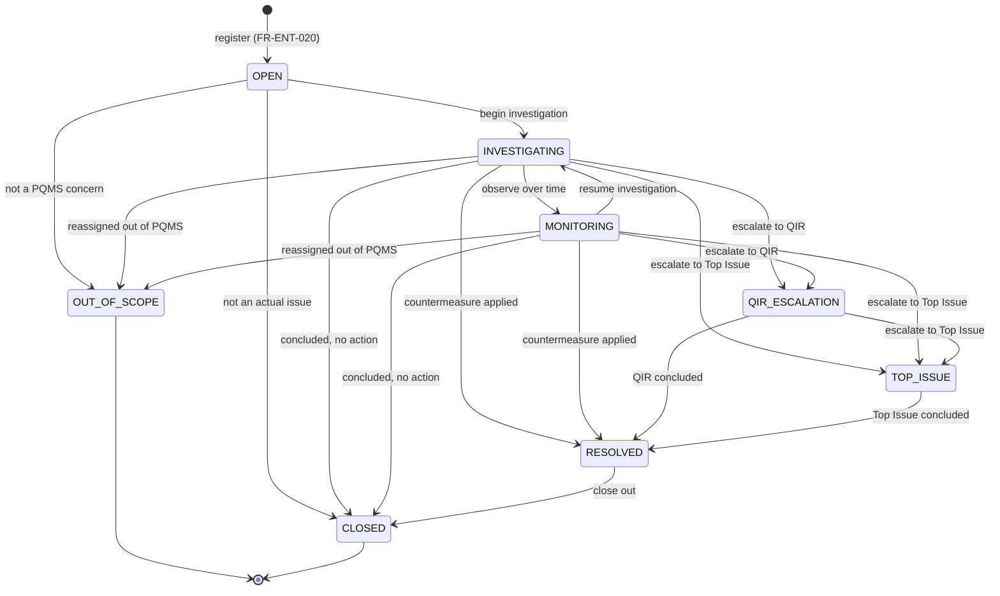
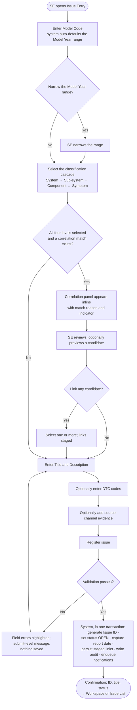
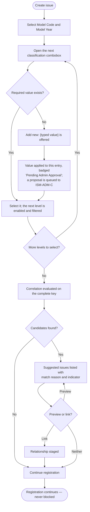
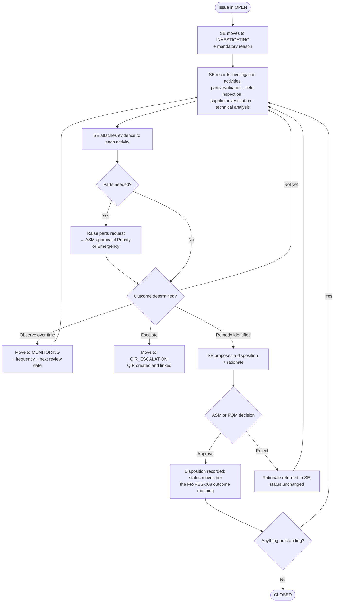
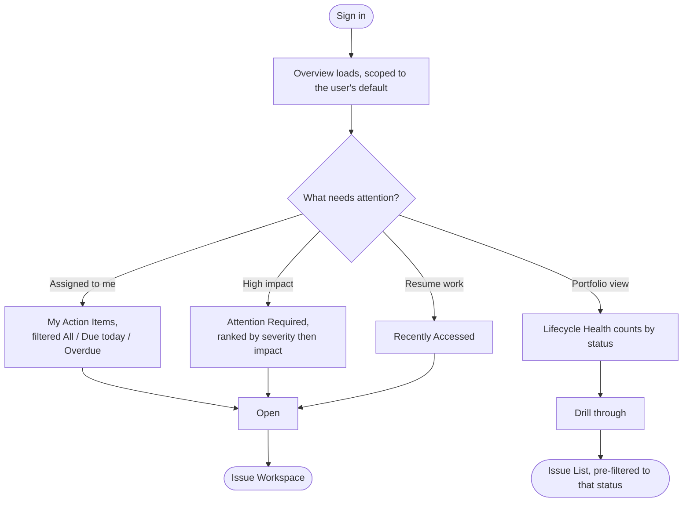
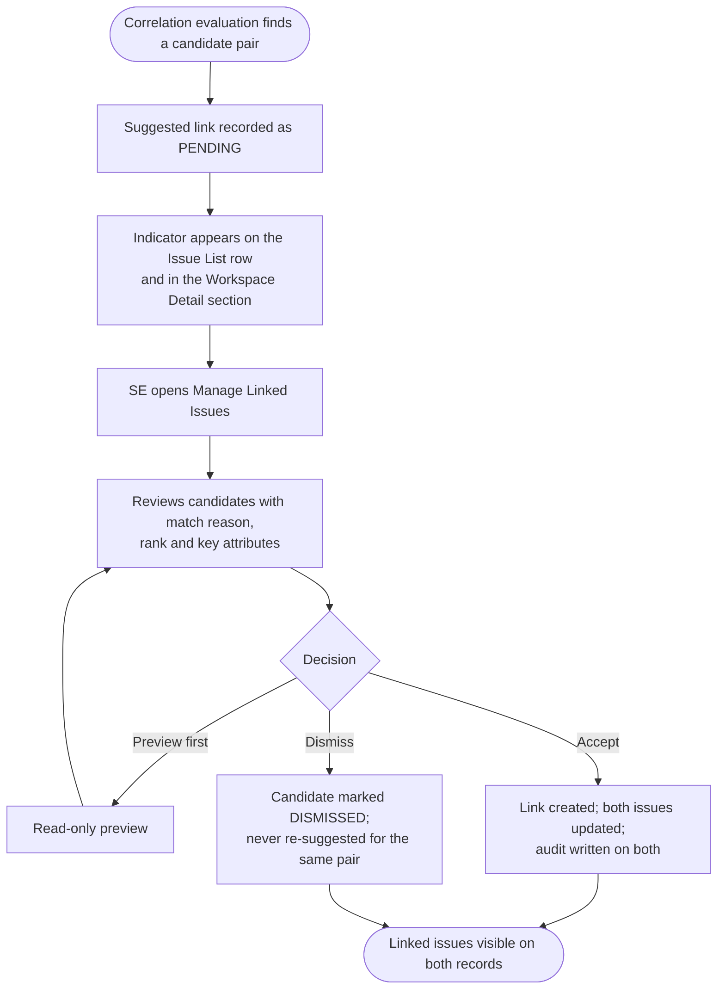
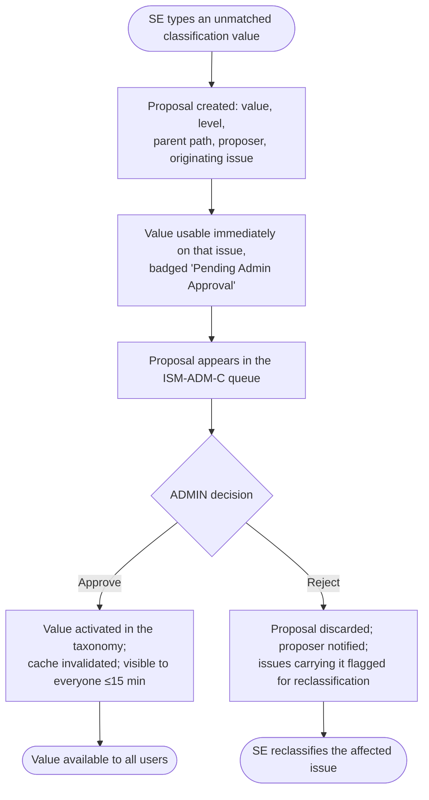
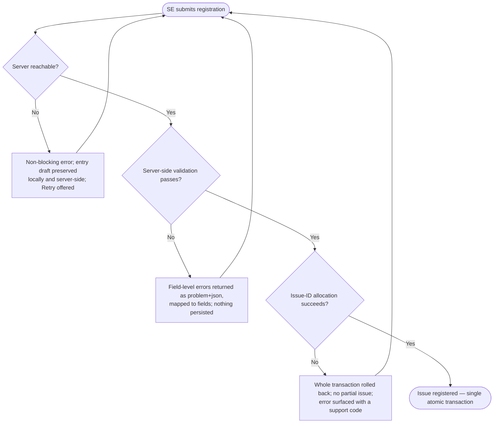
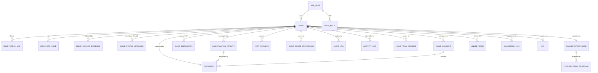

# N-PQMS ISM Module — Consolidated Business Requirements Document

| Field | Value |
|---|---|
| **Document ID** | KPQMS-ISM-BRD-C1.0 |
| **Title** | N-PQMS Issue Management (ISM) Module — Consolidated & Buildable Business Requirements |
| **Module** | ISM — Issue Management, plus the enabling platform slices ISM cannot stand alone without |
| **Status** | Draft for ratification |
| **Version** | C1.0 (Consolidated baseline) |
| **Date** | 2026-08-20 |
| **Author** | Prisilla Ghadi |
| **Reviewers** | Joon Sung Yoo (HAEA PM) · Robert Nguyen (KIA NA, Business Owner) · PQ Management · Winston (System Architect) · Murat (Test Architect) |
| **Consolidates** | `KPQMS-ISM-BRD-v1.5` (business contract) + `KPQMS-ISM-GF-BRD-v1.0` (buildable greenfield baseline) |
| **Supersedes** | Both of the above, **on ratification**. Until then both remain in force and this document is the reconciliation proposal. |
| **Phase** | Phase 1 — Core ISM. Programme go-live target **2026-12-18** |
| **Module tier** | Tier 1 Critical — 24.4% of total KPQMS usage |

---

## 0. Document Control

### 0.1 Why this document exists

The ISM requirement set existed in two documents that were each incomplete in the other's dimension:

- **BRD v1.5** carried the *signed business intent* — objectives, business requirements, the eight-status lifecycle
  vocabulary, the organisational role model, and the ISM0010 / ISM0020 / ISM0040 / ADM0200 screen scope. It was not
  buildable as written: it contained a dangling `BR-ISM-015`, missing NFR IDs `005` and `013`, missing dependency IDs
  `AD-ISM-012` and `AD-ISM-013`, unquantified performance targets, four promised user flows that were absent, no
  per-role transition matrix, no data dictionary, no validation rules, no business-rule register, no API contract, and
  acceptance criteria on only a sampled subset of stories.
- **Greenfield BRD v1.0** closed every one of those defects and added the rigour a from-scratch build needs, but bound
  the whole requirement set to an unratified architecture decision (`DEC-00`, a greenfield rebuild). If the business
  declines the rebuild, the requirement repairs would be discarded along with it.

**This document separates the two concerns.** The business contract and its engineering-grade detail live here and hold
regardless of build strategy. Architecture appears only in §19, is explicitly labelled *constraint context*, and is the
only section whose content is contingent on `DEC-00`.

### 0.2 Source-of-truth header

Every document produced from this point carries this block. It exists because the single largest defect in the ISM
documentation set was that three requirement baselines drifted apart with no propagation discipline.

| Concern | Traces to | Last propagation |
|---|---|---|
| Business intent, objectives, scope | `docs/brd/NPQMS-ISM-BRD-v1.5.md` — **authoritative for business intent** | 2026-08-20 |
| Buildable decomposition, NFR quantification, data & API contract | `docs/greenfield/N-PQMS_ISM_Greenfield_BRD_v1.0.md` | 2026-08-20 |
| Lifecycle vocabulary | v1.5 §6.3 — **ratified unchanged** (§9.1, DEC-01) | 2026-08-20 |
| Role & capability model | Prototype role model, mapped to v1.5 organisational roles (§7, DEC-02, Appendix B.1) | 2026-08-20 |
| Screen behaviour, field-level interaction | Approved N-PQMS UI prototype and screen captures — **behavioural tie-breaker** where prose is ambiguous | 2026-08-20 |
| Logical data model | `DM-001-NPQMS HLD Part03 Datamodel v1.0`, hardened in §15 | 2026-08-20 |
| Functional decomposition, API surface | `DES-002-NPQMS HLD Part02 M1 ISM Functional v1.0`, re-shaped in §16 | 2026-08-20 |

**Version-propagation gate.** Any change to this document's version triggers a mandatory delta pass into (a) the
solution design, (b) the epic and story backlog, and (c) the traceability matrix in §25 — *before* affected stories move
past `ready-for-dev`. This rule exists because a v1.3 → v1.5 bump sat un-propagated for weeks and produced the
three-baseline split this document closes.

### 0.3 Revision history

| Version | Date | Author | Summary |
|---|---|---|---|
| 1.0 | 2026-06-17 | PQ Systems Team | Initial ISM enhancement draft — multi-source adaptive entry, classification hierarchy, cross-model and cross-engineer correlation, issue linking |
| 1.1 | *(not issued)* | — | Number reserved and never issued. Recorded so the sequence is contiguous. |
| 1.2 | 2026-06-22 | PQ Systems Team | Added user flows and user-story subsections throughout the FR groups |
| 1.3 | 2026-06-24 | PQ Systems Team | Prototype-driven updates — Issue ID format, DTC capture, chronology tab, mandatory status-change comment, attention banners |
| 1.4 | 2026-07-07 | PQ Systems Team | Overview navigation, Issue List default views and columns, simplified registration, Model Code as primary identifier, Phase 1/2 boundary |
| 1.5 | 2026-07-10 | PQ Systems Team | Issue List usability, suggested-issue review, Workspace redesign into five sections, rationale capture, history management, document upload |
| GF-1.0 | 2026-08-20 | Prisilla Ghadi | Parallel greenfield baseline — quantified NFRs, per-role transition matrix, data dictionary, twelve ratified decisions |
| **C1.0** | **2026-08-20** | **Prisilla Ghadi** | **Consolidated baseline.** Merges v1.5 and GF-1.0. Repairs all identifier defects (§0.7); resolves nine internal contradictions (§0.6); adds acceptance criteria to every FR; adds business rules, validation rules, data requirements, API and integration requirements, scheduled work, a notification event catalogue, bidirectional traceability, a decision register and an open-question register. Architecture separated into a clearly-marked constraint section. |

### 0.4 Reference documents

| Ref | Document | Role here |
|---|---|---|
| R-01 | `docs/brd/NPQMS-ISM-BRD-v1.5.md` | Business-intent baseline. Every `BR-ISM-*` traces to it. |
| R-02 | `docs/greenfield/N-PQMS_ISM_Greenfield_BRD_v1.0.md` | Buildable decomposition baseline. |
| R-03 | `N-PQMS_Phase1_BRD_v1.1` (customer) | Programme context — milestones, integrations, cross-module scope. |
| R-04 | `DES-001-NPQMS HLD Part 01`, `DES-002-NPQMS HLD Part02 M1 ISM Functional v1.0` | Functional decomposition, used at conceptual altitude. |
| R-05 | `DM-001-NPQMS HLD Part03 Datamodel v1.0` | Logical entity set, used at conceptual altitude. |
| R-06 | N-PQMS UI Prototype and approved screen captures | Behavioural specification; tie-breaker on interaction detail. |
| R-07 | Design-token set and component specification | The visual contract the UI must consume unchanged. |
| R-08 | `N-PQMS_ISM_DRD_v1.1` | Prior detailed requirements; superseded by §12–§15 here. |
| R-09 | ISM BRD/HLD improvement assessment and drift audits | The defect register this document is written to close. |

### 0.5 Reading conventions

| Convention | Meaning |
|---|---|
| **shall** | Mandatory. A requirement using "shall" is testable and gated. |
| **should** | Recommended. Its absence is a review finding, not an acceptance failure. |
| **P1** | Phase-1 mandatory. A go-live blocker. |
| **P2** | Phase-1 desirable. Descopable at the cut gate in §24.1 without failing acceptance. |
| **P3** | Phase 2 or later. Stated here only where it clarifies a Phase-1 boundary. |
| Identifier stability | `BR-*`, `FR-*`, `NFR-*`, `VR-*`, `DQ-*`, `DM-*`, `DEC-*` and `Q-*` identifiers are permanent. They are cited by epics, stories, tests and §25, and are **never renumbered**. |
| Reserved numbering | Each FR subsection owns a reserved block. Unused numbers between one subsection's last ID and the next subsection's first are deliberate headroom, not omissions. Duplicates are never permitted. |
| Empty values | A requirement is never satisfied by rendering a blank. Absent data renders an em dash or a specific "not recorded" state. |
| Where rules conflict | A business rule (§13) beats a functional requirement (§12). A functional requirement beats the prototype on *business rule*; the prototype beats prose on *interaction detail*. Any conflict discovered is logged in §23, not resolved informally. |

### 0.6 Contradictions resolved in this consolidation

Nine internal contradictions existed across the two source documents. Each is closed here, with the resolution recorded
so it can be challenged rather than rediscovered.

| # | Contradiction | Resolution |
|---|---|---|
| X-1 | Two lifecycle vocabularies — v1.5 §6.3 ratified eight statuses, while `FR-ISMOVE-009` drove the Lifecycle Health panel off five undefined ones (`Open, Investigation, Review, Escalated, Closed`). | The eight statuses in §9.1 are the **only** lifecycle vocabulary. The Lifecycle Health panel renders all eight (FR-OVW-008). "Review" and "Escalated" are retired as terms. |
| X-2 | Three role vocabularies — organisational job titles in v1.5 §2.1, an authorization matrix over a different set, and "PQM / Quality Engineer / Authorized User" in the user stories. The `Y*` asterisk in the v1.5 matrix was never defined. | One **capability role model** (§7.2) with a normative organisational-role mapping (Appendix B.1). Every requirement in §12 names capability roles only. The undefined `Y*` is replaced by the explicit rules FR-WSP-014 and FR-WSP-015. |
| X-3 | v1.5's executive summary promised source-channel entry, a 7-level vehicle hierarchy, ISM0010 attention banners and an "Assigned to me" filter — none of which had a single FR. | Source channels: FR-ENT-008/009 and Appendix C. Attention banners and "Assigned to me": FR-LST-008/009. The "7-level" phrase referred to the **vehicle** hierarchy, not classification; it is retired as ambiguous and vehicle identification is specified in FR-ENT-003. |
| X-4 | v1.5 stated grouping was "supported in Phase 1 from ISM0020 and ISM0040" while defining no grouping requirement, and listed a group screen as Phase 2. | **Phase 1 grouping is linking.** A distinct `ISSUE_GROUP` entity and its management screen are Phase 2 (§6.3). Stated plainly rather than implied. |
| X-5 | Classification depth stated as three levels (v1.5 §5), four (`FR-ISM020-004`) and seven (executive summary). | **Four levels**: System → Sub-system → Component → Symptom (DEC-09, BR-C01). |
| X-6 | A P1 requirement depended on P2 work — `FR-ISM010-014` (P1) required Critical/High/Medium/Low/Info counts while all severity scoring was P2. | Severity **computation, tiering and display** are promoted to **P1** (FR-SCR-001, 002, 003, 006). **Re-score, override and configuration** remain P2 (FR-SCR-004, 005, 007, FR-ADM-011). Recorded as **DEC-13**. |
| X-7 | Disposition conflated remedy with lifecycle state — `Monitoring / No Issue / Escalate to QIR / Closed`, three of which are statuses. | Disposition is the **remedy**: a six-value vocabulary (FR-RES-003, DEC-04). Escalation and closure are **statuses**. Appendix B.3 carries the reconciliation. |
| X-8 | Risk mitigations referenced SLA monitoring and automated escalation notifications, and `AD-ISM-008` assumed SLA tracking, but no notification or aging requirement existed anywhere. | Notifications are specified in §12.14, the event catalogue in §16.4, and the aging and review-date jobs in §16.5 (FR-JOB-002, FR-JOB-003). |
| X-9 | `AD-ISM-001` assumed VIN-based vehicle identification while `FR-ISM020-003` made Model Code the only identifier. | **Model Code is primary; VIN is optional and never blocks any action** (DEC-03, BR-V01). AD-01 is restated accordingly. |

### 0.7 Identifier and structural defects repaired

| Defect in v1.5 | Repair |
|---|---|
| `BR-ISM-015` cited by `FR-ISM020-021` but never defined | Defined in §5: correlation shall never block capture. |
| `NFR-ISM-005` and `NFR-ISM-013` missing from the sequence | The NFR set is renumbered into a contiguous, categorised scheme (§17). |
| `AD-ISM-012` and `AD-ISM-013` missing | The assumption and dependency set is renumbered contiguously (§20). |
| Revision 1.1 missing from the history | Recorded as reserved-and-never-issued (§0.3). |
| Header date (2026-07-17) disagreed with the v1.5 revision row (2026-07-10) | Both recorded accurately in §0.3; this document carries one date. |
| Malformed table rows — `FR-ISM020-023`, `FR-ISM020-037`, `FR-ISM040-032`, `US-ISM040-012`, the reference-document header, and the v1.5 revision row | Every table here is well-formed; every FR has exactly one priority cell, one BR cell and one acceptance-criteria cell. |
| `FR-ISMOVE-*` and `FR-ADM-001..004` carried no BR trace; `FR-ISM010-014..018` had empty BR cells | Every FR in §12 carries at least one parent BR, and §25.1 is bidirectional. |
| Broken table-of-contents anchors; malformed `## 7-Functional-Requirements` heading | All headings and anchors are consistent. |
| `US-ISM040-014` cited a scoring FR for investigation activities | The user-story set is regenerated from §12 and verified in §25.3. |
| Nine of 37 Issue Entry FRs described the same confirmation screen | Consolidated with no capability lost; mapped in §25.2. |

### 0.8 Table of contents

| § | Section |
|---|---|
| 0 | [Document Control](#0-document-control) |
| 1 | [Executive Summary](#1-executive-summary) |
| 2 | [Business Context & Problem Statement](#2-business-context--problem-statement) |
| 3 | [Business Objectives](#3-business-objectives) |
| 4 | [Stakeholders & RACI](#4-stakeholders--raci) |
| 5 | [Business Requirements](#5-business-requirements) |
| 6 | [Scope Boundary](#6-scope-boundary) |
| 7 | [Roles, Capabilities & Authorization](#7-roles-capabilities--authorization) |
| 8 | [Screen Inventory & Navigation Model](#8-screen-inventory--navigation-model) |
| 9 | [Issue Lifecycle & State Machine](#9-issue-lifecycle--state-machine) |
| 10 | [User Flows](#10-user-flows) |
| 11 | [User Stories](#11-user-stories) |
| 12 | [Functional Requirements](#12-functional-requirements) |
| 13 | [Business Rules](#13-business-rules) |
| 14 | [Validation Rules](#14-validation-rules) |
| 15 | [Data Requirements](#15-data-requirements) |
| 16 | [API, Integration & Scheduled Work](#16-api-integration--scheduled-work) |
| 17 | [Non-Functional Requirements](#17-non-functional-requirements) |
| 18 | [Security, Privacy & Compliance](#18-security-privacy--compliance) |
| 19 | [Solution Architecture Context](#19-solution-architecture-context) |
| 20 | [Assumptions & Dependencies](#20-assumptions--dependencies) |
| 21 | [Risks & Mitigations](#21-risks--mitigations) |
| 22 | [Decision Register](#22-decision-register) |
| 23 | [Open Questions](#23-open-questions) |
| 24 | [Delivery Plan & Acceptance Gates](#24-delivery-plan--acceptance-gates) |
| 25 | [Traceability](#25-traceability) |
| 26 | [Approvals & Change Control](#26-approvals--change-control) |
| A | [Glossary](#appendix-a--glossary) |
| B | [Mapping tables](#appendix-b--mapping-tables) |
| C | [Source-channel evidence field sets](#appendix-c--source-channel-evidence-field-sets) |
| D | [Worked severity calculation](#appendix-d--worked-severity-calculation) |
| E | [Error code catalogue](#appendix-e--error-code-catalogue) |

---

## 1. Executive Summary

| Item | Detail |
|---|---|
| **Problem statement** | The legacy KPQMS issue-entry form is source-agnostic and single-vehicle-level. Engineers cannot capture source-specific evidence efficiently, cannot classify structurally enough for correlation, and are never told that a colleague has already filed the same defect on a different model. Quality signals are siloed per engineer and per model. Status changes carry no recorded reason, there is no chronological activity trail an auditor can follow, issue identifiers carry no system coding, DTCs are not captured at entry, and an engineer logging in has no at-a-glance view of what needs their attention. |
| **Proposed solution** | Deliver ISM as a role-aware application comprising: (1) an **Overview** landing page surfacing action items, attention-required records, recently accessed records and lifecycle health; (2) an **Issue List** with role-based default views, search, filtering, per-user column configuration, saved state, attention banners, bulk actions and export; (3) a **simplified Issue Entry** requiring only Model Code, a four-level classification, Title and Description, with optional DTC capture and source-channel evidence; (4) **real-time correlation detection during entry** and **post-submission link suggestions**, so duplicate investigation is caught before it starts; (5) an **Issue Workspace** organised as Detail · Investigation · Resolution · Communication · History; (6) a **mandatory-reason gate** on every status, classification, disposition and score change, written to an append-only audit trail; (7) **severity scoring** with a transparent factor breakdown; and (8) **classification master-data administration** with a propose-and-approve queue so the taxonomy grows without an engineering deployment. |
| **Business value** | Cuts duplicate investigation effort by surfacing correlations at the point of entry rather than at retrospective review; accelerates cross-model root-cause convergence; makes every status change defensible under audit; gives each engineer a prioritised action list on login; and lets the classification taxonomy keep pace with emerging quality signals. |
| **In scope** | Overview · Issue List · Issue Entry · Issue Workspace (five sections) · Severity scoring · Classification Administration · plus the enabling platform slices ISM cannot stand alone without: authentication and RBAC, notification dispatch, document management, audit and activity logging, export, and master-data read and caching. Detail in §6.1–§6.2. |
| **Out of scope** | QIR and TSB module internals (read-only seams only), AI/ML similarity scoring, cross-module correlation, EWS/GQIS ingestion pipeline implementation, issue reopen, a distinct issue-group entity and screen, reporting and BI beyond on-screen KPIs and XLSX export, mobile layouts, and languages other than en-US. Detail in §6.3. |
| **Phase & tier** | Phase 1 — Core ISM. Go-live target **2026-12-18**. ISM is **Tier 1 Critical**, 24.4% of total KPQMS usage. |
| **What is new in this consolidation** | Every functional requirement carries acceptance criteria. Every non-functional requirement carries a number, a measurement method and a verifying gate. A per-role status transition matrix closes the largest specification gap in the prior set. A field-level data dictionary, a validation-rule register, an API contract, a notification event catalogue and a scheduled-work register make the document buildable without a second interpretation pass. Thirteen decisions are recorded with rationale and reversal cost; twelve open questions are recorded with an owner, a deadline and a working assumption, so no question blocks work silently. |

---

## 2. Business Context & Problem Statement

### 2.1 The operating problem

| # | Problem | Consequence today |
|---|---|---|
| P-1 | Issue capture is source-agnostic. A warranty-driven signal, a Techline case and a field inspection all enter through the same undifferentiated form. | Source-specific evidence is either lost or recorded as unstructured prose, so it cannot be scored, filtered or analysed. |
| P-2 | Classification is too shallow and inconsistently applied to support correlation. | Two engineers describing the same defect produce records that no query can associate. |
| P-3 | There is no correlation capability at all. | Duplicate investigations run in parallel across models and regions; the duplication is usually discovered at retrospective review, after the cost is sunk. |
| P-4 | Status changes carry no recorded reason. | An auditor cannot reconstruct why an issue moved, and neither can the next engineer to pick it up. |
| P-5 | There is no chronological activity trail. | Investigation knowledge lives in individuals and in email. |
| P-6 | Issue identifiers carry no system coding. | An identifier communicates nothing; engineers cannot triage from an ID alone. |
| P-7 | An engineer logging in sees an undifferentiated list. | Time-to-first-action on overdue and approval-pending work is long and highly variable. |
| P-8 | The taxonomy can only be extended by an engineering deployment. | Emerging quality signals are either mis-classified into an existing bucket or wait weeks for a release. |

### 2.2 What good looks like

An engineer registers an issue in under two minutes with only the fields that genuinely matter; sees, before submitting,
that a colleague in another region filed the same defect three weeks ago; links the two in one action; and works the
resulting record through a workspace where every decision is captured with its reason, every document is retained, and
every state change is defensible a decade later.

### 2.3 Constraints the solution must respect

| ID | Constraint | Source |
|---|---|---|
| CON-01 | Go-live is **2026-12-18**. The date is set by the programme and is not re-planned by this document. | R-03 |
| CON-02 | ISM is Tier 1 Critical. Its availability and audit obligations are the strictest in the programme. | R-01 |
| CON-03 | The lifecycle vocabulary is the customer's signed business language. It may be mapped, never paraphrased. | R-01 §6.3 |
| CON-04 | Quality records are subject to a records-retention obligation and to legal hold. Nothing may be hard-deleted. | Compliance |
| CON-05 | The user population is desktop-based field and office quality engineering. Desktop-first is a deliberate fit, not an omission. | R-06 |
| CON-06 | Identity, master data, warranty, GQIS and EWS are owned by other systems. ISM consumes; it does not author. | R-03 |

---

## 3. Business Objectives

Each objective states a measurable success criterion, the instrument that measures it, and the baseline it is measured
against. An objective without all three is not gate-able and is therefore not an objective.

| # | Objective | Success measure | Measured by | Baseline |
|---|---|---|---|---|
| BO-01 | Improve quality-issue management efficiency | Median elapsed time from registration to first recorded investigation activity reduced **≥ 30%** | Activity-log timestamps, monthly cohort | Legacy KPQMS median, captured during the UAT dry run |
| BO-02 | Improve traceability and auditability | **100%** of status changes, classification changes and disposition decisions carry a user-authored reason and appear in the audit trail within the same session | Audit-log completeness query, run weekly | 0% — legacy captures no reason |
| BO-03 | Reduce duplicate investigations | **≥ 60%** of registrations that have a true duplicate surface it in the correlation panel *before* submit, measured on a labelled 200-issue evaluation set | Correlation-engine recall report | No correlation capability today |
| BO-04 | Enhance cross-team collaboration | **≥ 80%** of issues that reach `INVESTIGATING` carry at least one communication entry or linked record | Issue-level aggregate query | Not measured today |
| BO-05 | Support informed business decision-making | Overview lifecycle-health counts reconcile exactly with the Issue List's counts for the same scope, verified nightly | Automated reconciliation job | Not applicable |
| BO-06 | Let the classification taxonomy grow with emerging quality signals | An Administrator can add or approve a System, Sub-system, Component or Symptom value with no engineering deployment; approved values appear in comboboxes within **15 minutes** | Cache-refresh telemetry | Code change plus a release |
| BO-07 | Ensure every status change is documented | **100%** of status-change events carry a reason of at least 10 characters, visible in the Workspace History section within the same session | Audit query | 0% |
| BO-08 | Give each engineer immediate visibility of priority actions on login | Median time-to-first-action on overdue and action-required items reduced **≥ 40%** versus legacy | UAT stopwatch protocol, 12 scripted scenarios | Legacy UAT baseline |
| BO-09 | Establish one requirement baseline that downstream artifacts demonstrably trace to | **100%** of epics and stories cite an FR ID from §12; zero orphan stories at each sprint gate | Sprint-planning readiness check | Three divergent baselines today |
| BO-10 | Reduce total cost of ownership of the ISM scope | Production deployable units for the ISM scope reduced to the minimum the load profile justifies (§19) | Deployment manifest count | 9 units today |

> **Note on BO-06.** BRD v1.5 specified "within 24 hours of admin approval." This document tightens it to 15 minutes
> because the implementing mechanism is a cache TTL, and a 24-hour figure would imply a batch job the design does not
> need. Tightening a target is nonetheless a change to the business contract, and is recorded as **DEC-11**.

---

## 4. Stakeholders & RACI

### 4.1 Stakeholders

| Role | Name / team | Interest |
|---|---|---|
| Business Owner | Robert Nguyen (KIA NA) | Final authority on N-PQMS scope and acceptance |
| Programme Manager | Joon Sung Yoo (HAEA) | Delivery, milestone gates, go-live sign-off |
| Product Quality Manager (PQM) | PQ Management team | Final authority on disposition, escalation and cross-team escalation |
| After-Sales / Service Engineer Manager (ASM) | Regional service management | Approves dispositions and score overrides; owns regional quality outcomes |
| Service Engineer (SE) | Field quality engineering | Primary user — registers, investigates, proposes |
| System Administrator | PQ Systems Team | Classification taxonomy, source-channel configuration, user and role administration |
| PQ Department Head | KUS | Read-only oversight across all functional areas except administration |
| System Architect | Winston | Solution design, ADRs, module boundary contract |
| Frontend Lead | Prisilla Ghadi | UI implementation, design-system parity, coverage gate |
| Backend Lead | *(unassigned — see Q7)* | Data model, API contract, service-layer enforcement |
| Test Architect | Murat | Test strategy, traceability, NFR evidence |
| NAQC | External technical team | Read-only visibility into escalated issues (see Q8) |
| Compliance / Records Management | KIA NA Legal | Retention policy, audit-record immutability, personal-data rulings |
| PQ Systems Team | N-PQMS development | Implementation, integration and release |

### 4.2 RACI for the key decisions and deliverables

| Deliverable / decision | Business Owner | PM | PQM | Architect | FE Lead | BE Lead | Test Architect |
|---|---|---|---|---|---|---|---|
| This BRD | **A** | R | C | C | **R** | C | C |
| Business objectives & success measures (§3) | **A** | R | C | I | I | I | C |
| Scope boundary (§6) | **A** | R | C | C | C | C | I |
| Role & permission model (§7) | A | C | R | C | C | **R** | I |
| Lifecycle & transition matrix (§9) | A | C | **R** | C | I | C | C |
| Functional requirements (§12) | A | C | **R** | C | R | R | C |
| Business & validation rules (§13, §14) | A | I | **R** | C | C | R | C |
| Data model (§15) | I | I | C | A | I | **R** | C |
| API contract (§16) | I | I | I | A | R | **R** | C |
| NFR targets (§17) | C | **A** | I | R | C | C | **R** |
| Security & privacy (§18) | A | C | C | R | I | **R** | C |
| Solution architecture (§19) | I | C | I | **A/R** | C | R | I |
| Disposition vocabulary (DEC-04) | **A** | C | R | I | I | C | I |
| Severity factor weights (DEC-05) | A | C | **R** | C | I | C | I |
| Retention & PII classification (§18.4) | A | C | C | R | I | **R** | C |
| Acceptance gate sign-off (§24.2) | **A** | R | C | C | C | C | R |

*R = Responsible · A = Accountable · C = Consulted · I = Informed*

---

## 5. Business Requirements

Business requirements state *what the business needs*. Each decomposes into functional requirements in §12 and is traced
bidirectionally in §25.1. Priority definitions are in §0.5.

| BR-ID | Pri | Business requirement | Origin |
|---|---|---|---|
| BR-ISM-001 | P1 | The system shall enable users to register, investigate, track and resolve quality issues throughout their lifecycle. | v1.5 |
| BR-ISM-002 | P1 | The system shall provide role-based access and personalised default views to support efficient issue management and monitoring. | v1.5 |
| BR-ISM-003 | P1 | The system shall support vehicle identification and structured issue classification to enable tracking, investigation and analysis. | v1.5 |
| BR-ISM-004 | P1 | The system shall provide a centralised workspace for issue investigation, collaboration, resolution and historical tracking. | v1.5 |
| BR-ISM-005 | P1 | The system shall enable users to identify, correlate and manage related or duplicate issues, to reduce duplicate investigation and promote knowledge reuse. | v1.5 |
| BR-ISM-006 | P1 | The system shall provide complete, append-only traceability of issue activities, status changes, decisions and administrative actions. | v1.5 |
| BR-ISM-007 | P1 | The system shall support integration and information sharing between Issue Management and QIR Management. | v1.5 |
| BR-ISM-008 | P2 | The system shall provide a configurable framework — statuses, transitions, classifications, thresholds and business rules — that supports future requirements without a code change. | v1.5 |
| BR-ISM-009 | P2 | The system shall improve user efficiency through streamlined workflows and intuitive navigation. | v1.5 |
| BR-ISM-010 | P1 | The system shall enable users to search, filter and locate issues using business-relevant criteria. | v1.5 |
| BR-ISM-011 | P1 | The system shall enable authorised users to create, view, update and manage issue records. | v1.5 |
| BR-ISM-012 | P1 | The system shall support issue lifecycle management through configurable statuses, governed transitions and business outcomes. | v1.5 |
| BR-ISM-013 | P2 | The system shall provide reporting and data-export capabilities to support business analysis. | v1.5 |
| BR-ISM-014 | P1 | The system shall support issue disposition management, recording the business outcome of an investigation. | v1.5 |
| BR-ISM-015 | P1 | The system shall allow issue registration to complete whether or not a suggested correlation is accepted — correlation shall never block capture. | **Repairs** the dangling reference cited by v1.5 `FR-ISM020-021` but never defined. |
| BR-ISM-016 | P1 | The system shall attach, retain and control access to supporting evidence documents throughout the issue lifecycle. | **New.** v1.5 stated this only at FR level with no BR parent. |
| BR-ISM-017 | P1 | The system shall notify the right people at the right time about issues requiring their attention. | **New.** v1.5 assumed notification in its dependency list but stated no requirement, leaving two risk mitigations unbacked. |
| BR-ISM-018 | P1 | The system shall authenticate users through the enterprise identity provider and authorise every action server-side. | **New.** v1.5 stated this only as an NFR; it is a functional obligation. |
| BR-ISM-019 | P1 | The system shall compute, display and audit an issue severity score derived from configured factors and thresholds, with an auditable override path. | **New.** Reconciles v1.5's single P2 line with the Issue List's P1 dependency on severity (X-6, DEC-13). |
| BR-ISM-020 | P1 | The system shall be deliverable, operable and observable with the minimum production footprint its load profile justifies. | **New.** The obligation behind BO-10. |

---

## 6. Scope Boundary

### 6.1 In scope — ISM core

| Capability | Screen | Pri |
|---|---|---|
| Role-aware Overview: action items, attention required, recently accessed, lifecycle health, module summary | ISM-OVW | P1 |
| Issue List: role-based default views, search, filter, sort, column configuration, saved state, attention banners, pagination, bulk actions, export | ISM-LST (ISM0010) | P1 |
| Issue Entry: simplified registration, four-level classification, Model Code and year, DTC capture, source-channel evidence, correlation panel, issue preview, manual linking | ISM-ENT (ISM0020) | P1 |
| Issue Workspace — Detail section | ISM-WSP-D (ISM0040) | P1 |
| Issue Workspace — Investigation section: activities, evidence, parts requests, hypothesis and suspected root cause | ISM-WSP-I | P1 |
| Issue Workspace — Resolution section: disposition, QIR link, root cause, countermeasures, closure | ISM-WSP-R | P1 |
| Issue Workspace — Communication section: comments, document sharing | ISM-WSP-C | P1 |
| Issue Workspace — History section: activity history and audit history | ISM-WSP-H | P1 |
| Severity scoring: computation, factor breakdown, composite and tier display | ISM-WSP-S | P1 |
| Severity scoring: re-score request, manual override with justification | ISM-WSP-S | P2 |
| Classification Administration: taxonomy CRUD, cascade structure, proposal approval queue | ISM-ADM-C (ADM0200) | P1 |
| Scoring configuration: factor weights and tier thresholds | ISM-ADM-S | P2 |
| Transition-matrix configuration | ISM-ADM-T | P2 |

### 6.2 In scope — enabling platform slices

These are in scope **because ISM cannot stand alone without them**. Each is scoped to exactly what ISM needs, and each
states what it explicitly does *not* include — because an open-ended platform slice is how scope grows silently.

| Slice | In scope | Explicitly not |
|---|---|---|
| **Authentication** | OIDC sign-in and sign-out, token refresh, session timeout, Terms & Conditions acceptance capture | User self-registration; MFA policy authoring — the identity provider owns it |
| **Authorization / RBAC** | Role assignment, the §7.3 matrix, server-side enforcement, a permission-resolution endpoint | Feature-element-level permission granularity — Phase 2 |
| **User administration** | Create, edit and deactivate a user; assign and revoke roles; role expiry | User hierarchy, expert groups, bulk CSV role load |
| **Notification** | Trigger rules for the §16.4 events, in-app notification centre with unread count, email dispatch, template rendering | SMS and push channels; a template-authoring UI — templates are seeded configuration in Phase 1 |
| **Document management** | Upload, download, list, soft delete, type and size validation, virus-scan hook, object-store persistence | Versioning, check-in/check-out, full-text search inside document contents |
| **Audit & activity logging** | Append-only audit of every mutation with before and after values; the activity chronology; search and date filtering | Cross-module audit aggregation UI; SIEM export — Phase 2 |
| **Master data (read and cache)** | Model, model year, DTC code, dealer and part lookups, read and cached from their systems of record, with a fallback fixture set | Master-data *authoring* for Model, Dealer or Part — the source systems own it |
| **Export** | XLSX export of the filtered list and of a selection, honouring column configuration and data scope | Scheduled or emailed reports; PDF; BI extracts |

### 6.3 Out of scope (Phase 1)

| Item | Rationale | Where it goes |
|---|---|---|
| QIR module internals | ISM holds a read-only seam: create-and-link a QIR, display its status, root cause and countermeasures. QIR's own lifecycle is a separate BRD. | QIR BRD |
| TSB / Publication module internals | TSB consumes ISM outcomes; no ISM screen renders TSB internals. | TSB BRD |
| AI/ML or semantic similarity scoring | Phase 1 correlation is deterministic key matching (§12.4). Probabilistic matching needs a labelled corpus that does not exist yet. | Phase 2 |
| Cross-module correlation (ISM ↔ QIR ↔ TSB) | Phase 1 correlates within ISM only. | Phase 2 |
| Issue **group** entity and management screen | Phase 1 grouping is expressed as linking (X-4). A distinct group record with its own lifecycle is a separate capability. | Phase 2 |
| EWS / GQIS ingestion pipeline implementation | ISM *consumes* the structured result; building the pipeline is integration scope. | Integration BRDs |
| Issue reopen (`CLOSED → OPEN`) | Requires a records-retention ruling on whether a reopened issue is the same record or a successor (DEC-12, Q1). | Phase 2 |
| User-configurable attention-banner and notification threshold rules | Banner types and thresholds are configuration seeded by an Administrator in Phase 1, not authored by end users. | Phase 2 |
| Customisable issue source-channel *types* | The channel set is configurable by an Administrator; end-user-defined channel types are not. | Phase 2 |
| Reporting and BI | Beyond on-screen KPIs and XLSX export. | Phase 2 / CDO |
| Mobile and tablet layouts | Target is desktop workstation widths 1280–1600px. Below 1280px the application renders with horizontal scroll rather than a distinct layout. | Phase 2 |
| Localisation into additional languages | The UI is i18n-**ready** — message keys, no concatenated strings, locale-aware dates and numbers — but ships **en-US only**. | Phase 2 |
| Offline / PWA capability | No user flow requires it. | Not planned |

### 6.4 Scope-change control

Any addition to §6.1 or §6.2 after ratification requires three things together: an impact statement against the §24.3
milestone dates, a named descope of equal size, and Business-Owner approval. The change is appended to the change log in
§26.2. A scope addition without a matching descope is refused at the gate, not absorbed by the team.

---

## 7. Roles, Capabilities & Authorization

### 7.1 Two role vocabularies, one mapping

BRD v1.5 §2.1 names **organisational** roles — job titles. This document specifies **capability** roles — what a user may
do. The two are not the same thing, and conflating them was contradiction X-2. Business stakeholders reading v1.5 locate
their role here through **Appendix B.1**, which is normative, not explanatory.

### 7.2 Capability role model

| Role code | Title | Capability | Default data scope | Landing screen |
|---|---|---|---|---|
| `SE` | Service Engineer | `propose` — creates, investigates, proposes; never approves | My issues; may switch to All | Overview |
| `ASM` | After-Sales / Service Engineer Manager | `override` — approves, overrides, shares | All issues | Overview |
| `PQM` | Product Quality Manager | `override` — approves, overrides, shares; final disposition authority | All issues | Overview |
| `ADMIN` | System Administrator | `administer` — full configuration and user management | All issues | Overview |
| `VIEWER` | Read-only stakeholder — PQ Department Head, NAQC, auditor | `view` | All issues, read-only | Overview |

**Capability semantics.** A capability is a coarse gate; individual actions are still checked against §7.3. A role never
acquires an action by virtue of a "higher" capability — **the matrix is authoritative, the capability ordering is not**.

### 7.3 Authorization matrix

| Action | SE | ASM | PQM | ADMIN | VIEWER | Enforced by |
|---|---|---|---|---|---|---|
| View Overview | ✓ | ✓ | ✓ | ✓ | ✓ | FR-OVW-001 |
| View Issue List — own scope | ✓ | ✓ | ✓ | ✓ | ✓ | FR-LST-002 |
| View Issue List — all scope | ✓ | ✓ | ✓ | ✓ | ✓ | FR-LST-003 |
| View Issue Workspace | ✓ | ✓ | ✓ | ✓ | ✓ (read-only) | FR-WSP-001 |
| Create issue | ✓ | ✓ | ✓ | ✓ | ✗ | FR-ENT-001 |
| Edit an issue you authored, before its first status change | ✓ | ✓ | ✓ | ✓ | ✗ | FR-WSP-014 |
| Edit any issue at any non-terminal status, with justification | ✗ | ✓ | ✓ | ✓ | ✗ | FR-WSP-015 |
| Change issue status | ✓ (per §9.3) | ✓ | ✓ | ✓ | ✗ | FR-WSP-020 |
| Approve or reject a proposed status change | ✗ | ✓ | ✓ | ✓ | ✗ | FR-WSP-024 |
| Withdraw a status-change proposal you raised | ✓ | ✓ | ✓ | ✓ | ✗ | FR-WSP-024 |
| Record an investigation activity | ✓ | ✓ | ✓ | ✓ | ✗ | FR-INV-001 |
| Edit or delete your own investigation activity | ✓ | ✓ | ✓ | ✓ | ✗ | FR-INV-005 |
| Edit or delete another user's investigation activity | ✗ | ✓ | ✓ | ✓ | ✗ | FR-INV-006 |
| Raise a parts request | ✓ | ✓ | ✓ | ✗ | ✗ | FR-INV-010 |
| Approve a Priority or Emergency parts request | ✗ | ✓ | ✓ | ✗ | ✗ | FR-INV-013 |
| Propose a disposition | ✓ | ✓ | ✓ | ✗ | ✗ | FR-RES-004 |
| Approve or reject a disposition | ✗ | ✓ | ✓ | ✗ | ✗ | FR-RES-007 |
| Escalate to QIR | ✓ | ✓ | ✓ | ✗ | ✗ | FR-RES-010 |
| Request a re-score | ✓ | ✓ | ✓ | ✓ | ✗ | FR-SCR-004 |
| Apply a manual score override | ✗ | ✓ | ✓ | ✓ | ✗ | FR-SCR-005 |
| Manage linked issues | ✓ | ✓ | ✓ | ✓ | ✗ | FR-LNK-004 |
| Post an internal comment | ✓ | ✓ | ✓ | ✓ | ✗ | FR-COM-002 |
| Post an external comment | ✗ | ✓ | ✓ | ✓ | ✗ | FR-COM-003 |
| Upload a supporting document | ✓ | ✓ | ✓ | ✓ | ✗ | FR-DOC-001 |
| Download a supporting document | ✓ | ✓ | ✓ | ✓ | ✓ | FR-DOC-006 |
| Delete a document | own only | ✓ | ✓ | ✓ | ✗ | FR-DOC-005 |
| View audit and activity history | ✓ | ✓ | ✓ | ✓ | ✓ | FR-HIS-001 |
| Create a manual history entry | ✗ | ✓ | ✓ | ✓ | ✗ | FR-HIS-008 |
| Export the issue list or a selection | ✓ | ✓ | ✓ | ✓ | ✓ | FR-LST-026 |
| Bulk assign | ✓ (own team) | ✓ | ✓ | ✓ | ✗ | FR-LST-021 |
| Bulk status change | ✓ (per §9.3) | ✓ | ✓ | ✓ | ✗ | FR-LST-022 |
| Propose a new classification value | ✓ | ✓ | ✓ | ✓ | ✗ | FR-ADM-005 |
| Approve or reject a proposed classification value | ✗ | ✗ | ✗ | ✓ | ✗ | FR-ADM-006 |
| Manage classification master data | ✗ | ✗ | ✗ | ✓ | ✗ | FR-ADM-001 |
| Manage scoring weights and thresholds | ✗ | ✗ | ✗ | ✓ | ✗ | FR-ADM-011 |
| Manage the status transition matrix | ✗ | ✗ | ✗ | ✓ | ✗ | FR-ADM-012 |
| Manage users, roles and permissions | ✗ | ✗ | ✗ | ✓ | ✗ | FR-SEC-010 |
| Modify or delete an audit record | ✗ | ✗ | ✗ | ✗ | ✗ | FR-HIS-004 *(prohibition)* |

**Enforcement rule.** Every row is enforced **server-side** at the application-service layer, and mirrored client-side
only to hide or disable affordances. A UI that hides an action is a courtesy; the server refusing it is the control.
Client-only enforcement is a blocking review finding (§18.3).

### 7.4 Data-scope rules

| ID | Rule |
|---|---|
| SCOPE-01 | "My issues" means issues where the current user is the **assignee**, the **creator**, or a **named issue team member**. |
| SCOPE-02 | "All issues" means every non-deleted issue the user's role may view. No role sees soft-deleted records except `ADMIN`. |
| SCOPE-03 | `SE` defaults to "My issues" on both Overview and Issue List. `ASM`, `PQM`, `ADMIN` and `VIEWER` default to "All". |
| SCOPE-04 | The scope selection is a user preference, persisted per user and restored on next sign-in. |
| SCOPE-05 | Overview counts, Issue List rows and export contents all honour the same active scope. A discrepancy between them is a defect, not a display choice. |
| SCOPE-06 | Scope is applied as a **query predicate**, never as a post-filter over a wider result set. This is a security control, not a convenience (§18.3). |

---

## 8. Screen Inventory & Navigation Model

### 8.1 Screen inventory

| Screen ID | Legacy ID | Name | Purpose | Roles | Pri |
|---|---|---|---|---|---|
| ISM-OVW | — | Overview | Role-aware landing page — action items, attention required, recently accessed, lifecycle health, module summary | All | P1 |
| ISM-LST | ISM0010 | Issue List | The issue queue: search, filter, sort, configure columns, select, act in bulk, export | All | P1 |
| ISM-ENT | ISM0020 | Issue Entry | Register a new issue; review correlations; link related issues | SE·ASM·PQM·ADMIN | P1 |
| ISM-WSP | ISM0040 | Issue Workspace | The full issue record across five sections | All (VIEWER read-only) | P1 |
| ISM-WSP-D | — | └ Detail | Issue, vehicle, classification, source evidence, related records, scoring summary | All | P1 |
| ISM-WSP-I | — | └ Investigation | Activities, evidence, parts requests, hypothesis and suspected root cause | All | P1 |
| ISM-WSP-R | — | └ Resolution | Disposition, linked QIR, root cause, countermeasures, closure | All | P1 |
| ISM-WSP-C | — | └ Communication | Comment threads (internal and external), shared documents | All | P1 |
| ISM-WSP-H | — | └ History | Activity history and audit history, searchable and date-filtered | All | P1 |
| ISM-WSP-S | — | └ Scoring view | Composite score, factor breakdown, tier, re-score and override | All | P1 (P2 for override) |
| ISM-LNK | — | Manage Linked Issues (modal) | Search, preview, link and unlink related issues | SE·ASM·PQM·ADMIN | P1 |
| ISM-PRV | — | Issue Preview (modal) | Read-only preview of a candidate issue without leaving the current flow | All | P1 |
| ISM-NTF | — | Notifications | Full notification feed; the header bell is a condensed view of it | All | P2 |
| ISM-ADM-C | ADM0200 | Classification Administration | Taxonomy CRUD, cascade structure, proposal approval queue | ADMIN | P1 |
| ISM-ADM-S | — | Scoring Configuration | Factor weights, tier thresholds | ADMIN | P2 |
| ISM-ADM-T | — | Transition Matrix Configuration | The §9.3 matrix as configuration | ADMIN | P2 |
| ISM-ADM-U | UM0010/20 | User & Role Administration | Users, role assignment, role expiry | ADMIN | P1 |
| ISM-ADM-H | — | Integration Health | Per-integration status, last sync, error count | ADMIN | P1 |
| ISM-ERR | — | Error / Not-found / Forbidden | 403, 404, 500 and asset-load-failure recovery | All | P1 |

### 8.2 Navigation model

```
Sign in (enterprise OIDC) → Terms & Conditions acceptance (first sign-in, or on version change)
  ↓
ISM-OVW  Overview
  ├─ lifecycle-health stage ────────────────→ ISM-LST (pre-filtered to that status)
  ├─ action item / attention row ───────────→ ISM-WSP
  ├─ recently accessed row ─────────────────→ ISM-WSP
  └─ header nav ────────────────────────────→ ISM-LST · QIR · TSB

ISM-LST  Issue List
  ├─ New issue ─────────────────────────────→ ISM-ENT
  ├─ Row or ID click ───────────────────────→ ISM-WSP (Detail section)
  ├─ Linked-count chip ─────────────────────→ ISM-LNK (modal)
  ├─ Attention banner ──────────────────────→ ISM-LST, filtered to that banner's set
  ├─ Bulk bar ──────────────────────────────→ assign · change status · export
  └─ Export ────────────────────────────────→ XLSX download

ISM-ENT  Issue Entry
  ├─ Correlation panel row ─────────────────→ ISM-PRV (modal, non-destructive)
  ├─ Search & link ─────────────────────────→ ISM-LNK (modal)
  ├─ Register ──────────────────────────────→ confirmation → ISM-WSP | ISM-LST
  └─ Cancel ────────────────────────────────→ prior screen (unsaved-changes prompt)

ISM-WSP  Issue Workspace
  ├─ Section tabs: Detail · Investigation · Resolution · Communication · History
  ├─ Change status ─────────────────────────→ status dialog (reason mandatory)
  ├─ Create QIR / open linked QIR ──────────→ QIR module
  ├─ Manage linked issues ──────────────────→ ISM-LNK (modal)
  └─ Back ──────────────────────────────────→ prior screen (browser history)

Global header (every screen)
  ├─ Logo ──────────────────────────────────→ ISM-OVW
  ├─ Primary nav ───────────────────────────→ Overview · Issue Management · QIR · TSB
  ├─ Breadcrumb ────────────────────────────→ one level up
  ├─ Notifications bell ────────────────────→ dropdown → record | ISM-NTF
  ├─ Help ──────────────────────────────────→ contextual help
  └─ Profile ───────────────────────────────→ preferences · sign out
```

### 8.3 Navigation rules

| ID | Rule |
|---|---|
| NAV-01 | Every screen is addressable by URL and deep-linkable. Filter state, active section and pagination are URL-encoded, so a copied link reproduces exactly what the sender saw. |
| NAV-02 | Back is browser Back. The application maintains no separate in-app history stack. |
| NAV-03 | Navigating to a Workspace section resets scroll to the top of the scrolling region. Only the workspace body scrolls; the page itself never does. |
| NAV-04 | An unsaved Issue Entry prompts before navigation away. Nothing else does. |
| NAV-05 | A user who lacks permission for a deep-linked route sees ISM-ERR/403 stating the reason and offering a route back — never a blank screen and never a silent redirect. |
| NAV-06 | Breadcrumbs are derived from the route, not hand-maintained per screen. |
| NAV-07 | The Overview is the landing screen for every role. No role lands on a list. |

### 8.4 Presentation contract

The following are **binding**, not stylistic preferences. They exist because inconsistency in these specific things is
what makes a quality system untrustworthy to its users.

| Concern | Contract |
|---|---|
| Status colour and label | Looked up from a single status map. Never hand-coloured, never paraphrased. One hue per status, used identically on every screen. |
| Severity tier | Derived from the numeric score by the fixed thresholds in BR-S03, coloured consistently everywhere it appears. |
| Source-channel icon | One icon per channel, always the same one, across list, entry, workspace and export. |
| Identifiers and numerics | Monospace; numeric table columns right-aligned; units always shown. |
| Multi-value cells | Primary value inline, remainder behind a `+N` hover **and** keyboard-focus popover; consecutive model years collapse to a range. |
| Focus | A visible focus ring on every interactive element. Never removed. |
| Motion | Fades and short slides only, 120–240ms; `prefers-reduced-motion` honoured. |
| Content voice | Plain, precise, operational. Sentence case except short uppercase labels. No emoji, no exclamation marks. Errors name the field and the fix. Confirmations state the outcome with the record ID. |
| Density | Table rows 40px compact / 48px default; a strict 4px spacing grid; a sticky page header. |
| Timestamps | Stored in UTC, rendered in the viewer's local timezone, with the timezone shown (BR-A06). |

---

## 9. Issue Lifecycle & State Machine

### 9.1 Ratified status set

The lifecycle vocabulary is the **BRD v1.5 §6.3 set, unchanged**. It is the customer's signed business language
(DEC-01, CON-03).

| Code | Label | Definition | Terminal? |
|---|---|---|---|
| `OPEN` | Open | Newly registered issue; not yet under active investigation. | No |
| `INVESTIGATING` | Investigating | Investigation is actively in progress. | No |
| `MONITORING` | Monitoring | The condition is being observed over time rather than actively investigated. | No |
| `QIR_ESCALATION` | QIR Escalation | The issue has entered the QIR escalation process. | No |
| `TOP_ISSUE` | Top Issue | The issue has been escalated to the Top Issue process. | No |
| `RESOLVED` | Resolved | Resolved through countermeasure, publication or other corrective action. | No |
| `OUT_OF_SCOPE` | Out of Scope | Does not belong to PQMS — for example Safety, Regulatory, or another department. | **Yes** |
| `CLOSED` | Closed | Investigation concluded, or the reported condition is not an actual issue. | **Yes** |

**Three consequences the business must accept**, each with the mitigation this document adopts:

| # | Consequence | Mitigation |
|---|---|---|
| C-1 | **There is no `DRAFT` status.** An issue exists only once registered. | "Save draft" is preserved as an **Issue Entry draft** — a per-user working copy of the entry form, persisted against the user and **not** an issue record. It has no Issue ID, appears in no list, count, export or search, and is discarded on submit or explicit cancel. Specified as FR-ENT-030..034. |
| C-2 | **There is no `PENDING_APPROVAL` status.** Status changes needing approval have nowhere to sit. | Approval is a property of the **transition**, not a state. A transition is either `direct` or `approval-gated`; a gated transition creates a `PROPOSED` lifecycle record that an `override` role approves or rejects, while the issue's own status does not change until approval. §9.4. |
| C-3 | **There is no `DISPOSED` status.** | Disposition records the *remedy*; the issue's status moves to `RESOLVED`, `MONITORING` or `CLOSED` per the outcome mapping in FR-RES-008. |

**Reversal cost** if the business later prefers a different set: medium. Status is one column, one guard table and one UI
status map, plus a data migration. Estimated 3–5 developer-days. Recorded so the decision can be revisited without
re-litigating it.

### 9.2 Lifecycle diagram



### 9.3 Per-role transition matrix

This matrix is the single largest gap in the prior requirement set. Every cell states who may *initiate* the transition
and whether it is approval-gated. **A blank cell means the transition does not exist**, and the server rejects it with
`409 Conflict` and error code `ISM-LC-001`.

| From ↓ / To → | OPEN | INVESTIGATING | MONITORING | QIR_ESCALATION | TOP_ISSUE | RESOLVED | OUT_OF_SCOPE | CLOSED |
|---|---|---|---|---|---|---|---|---|
| **OPEN** | — | SE·ASM·PQM·ADMIN direct | | | | | SE gated; ASM·PQM·ADMIN direct | SE gated; ASM·PQM·ADMIN direct |
| **INVESTIGATING** | | — | SE·ASM·PQM·ADMIN direct | SE gated; ASM·PQM direct | ASM·PQM direct | SE gated; ASM·PQM·ADMIN direct | SE gated; ASM·PQM·ADMIN direct | SE gated; ASM·PQM·ADMIN direct |
| **MONITORING** | | SE·ASM·PQM·ADMIN direct | — | SE gated; ASM·PQM direct | ASM·PQM direct | SE gated; ASM·PQM·ADMIN direct | SE gated; ASM·PQM·ADMIN direct | SE gated; ASM·PQM·ADMIN direct |
| **QIR_ESCALATION** | | | | — | ASM·PQM direct | ASM·PQM·ADMIN direct | | |
| **TOP_ISSUE** | | | | | — | PQM direct | | |
| **RESOLVED** | | | | | | — | | SE·ASM·PQM·ADMIN direct |
| **OUT_OF_SCOPE** | | | | | | | — *(terminal)* | |
| **CLOSED** | | | | | | | | — *(terminal)* |

**Reading the matrix.** *direct* means the transition applies immediately on submit, subject to the mandatory-reason
gate. *gated* means submitting creates a `PROPOSED` lifecycle record and the issue's status is unchanged until an
`override` role approves. `VIEWER` initiates nothing.

### 9.4 Approval-gated transition sub-state

```mermaid
stateDiagram-v2
    direction LR
    [*] --> PROPOSED : SE submits a gated transition (+ reason)
    PROPOSED --> APPROVED : ASM/PQM approves (+ remark optional)
    PROPOSED --> REJECTED : ASM/PQM rejects (+ remark mandatory)
    PROPOSED --> WITHDRAWN : proposer withdraws
    APPROVED --> [*] : issue status advances; audit written
    REJECTED --> [*] : issue status unchanged; audit written
    WITHDRAWN --> [*] : issue status unchanged; audit written
```



### 9.5 Transition rules

| ID | Rule |
|---|---|
| LC-01 | Every transition — direct or gated — requires a reason of **at least 10 characters**, recorded against the transition and visible in the Workspace History section. |
| LC-02 | A transition to `MONITORING` additionally requires a **monitoring frequency** and a **next review date**, which must be in the future. |
| LC-03 | A transition to `OUT_OF_SCOPE` additionally requires a **receiving department**, chosen from configured values (see Q5). |
| LC-04 | A transition to `QIR_ESCALATION` requires a linked QIR to already exist or to be created within the same transaction. |
| LC-05 | `OUT_OF_SCOPE` and `CLOSED` are **terminal**. Reopen is Phase 2 (DEC-12). Until then, the correct response to "this was closed in error" is a new issue linked to the closed one. |
| LC-06 | Terminal issues are **read-only** in every section except Communication, which remains append-only so post-closure correspondence is still captured. |
| LC-07 | A gated transition may be **withdrawn** by its proposer while still `PROPOSED`. Withdrawal is audited. |
| LC-08 | A rejected gated transition leaves the issue's status unchanged and records the approver's remark, which is **mandatory** on rejection. |
| LC-09 | A bulk status change applies this matrix per issue. Issues whose transition is invalid are **skipped, reported by ID, and do not fail the batch**. |
| LC-10 | The matrix is stored as **configuration, not code**, so BR-ISM-008 is satisfiable without a deployment. Changing it is an `ADMIN` action and is audited. |
| LC-11 | A user may never approve their own proposal, in any workflow — status change, disposition or parts request (BR-L09). |

---

## 10. User Flows

BRD v1.5's revision history promised six user flows and delivered two. All six are specified here, plus the two
exception flows the prior audits found missing.

### 10.1 UF-01 — Issue registration

**Actor** SE · **Entry** ISM-ENT · **Goal** register a quality issue with correct vehicle and classification data, having
seen any correlation before committing.



### 10.2 UF-02 — Classification and correlation during entry

**Actor** SE · **Goal** classify correctly even when the taxonomy lacks the value needed.



### 10.3 UF-03 — Investigation and disposition

**Actor** SE proposes; ASM or PQM approves · **Entry** ISM-WSP.



### 10.4 UF-04 — Triage from the Overview

**Actor** any role · **Goal** get from sign-in to the right record in the fewest steps.



### 10.5 UF-05 — Post-submission correlation review

**Actor** SE · **Goal** act on a correlation the system found *after* registration.



### 10.6 UF-06 — Classification value governance

**Actor** SE proposes; ADMIN approves.



### 10.7 EF-01 — Registration failure (exception flow)



### 10.8 EF-02 — Concurrent edit (exception flow)

```mermaid
flowchart TD
    A([Two users open the same issue]) --> B[User A saves a change]
    B --> C[Version token incremented]
    C --> D[User B saves, carrying a stale token]
    D --> E[Server rejects: 409 Conflict, ISM-CC-001]
    E --> F[UI states: 'This issue was updated by {user} at {time}.'<br/>with Reload and Compare]
    F --> G{User B chooses}
    G -->|Reload| H([B's edits discarded; latest version loaded])
    G -->|Compare| I[Field-level diff of B's edits against current] --> J([B re-applies deliberately])
```

---

## 11. User Stories

User stories are the business-readable expression of §12. Every story cites the functional requirements that implement
it, and every functional requirement is cited by at least one story — verified in §25.3. Acceptance criteria live on the
functional requirements, not duplicated here.

| US-ID | Role | Story | Implemented by |
|---|---|---|---|
| US-OVW-01 | Any user | As a user, I want an Overview on sign-in so I immediately see what needs my attention. | FR-OVW-001..004, FR-OVW-006 |
| US-OVW-02 | Any user | As a user, I want my recently accessed records listed so I can resume work without searching. | FR-OVW-007 |
| US-OVW-03 | Any user | As a user, I want lifecycle health counts so I understand issue distribution and workload. | FR-OVW-008, FR-OVW-010 |
| US-OVW-04 | Any user | As a user, I want the Overview to stay useful when QIR and TSB are unavailable, rather than failing or quietly showing me a partial picture. | FR-OVW-009, FR-OVW-012, FR-OVW-013 |
| US-LST-01 | SE | As a Service Engineer, I want my own issues by default so I can focus on my work. | FR-LST-002, FR-LST-003, FR-LST-008 |
| US-LST-02 | Any user | As a user, I want to search and filter issues so I can locate records quickly. | FR-LST-010..016 |
| US-LST-03 | Any user | As a user, I want to choose my columns so the list shows what my role needs. | FR-LST-017..019 |
| US-LST-04 | Any user | As a user, I want attention banners so overdue and action-required work is visible above the list, not buried in it. | FR-LST-008, FR-LST-009 |
| US-LST-05 | Any user | As a user, I want to export the list so I can analyse offline. | FR-LST-024, FR-LST-026 |
| US-LST-06 | Any user | As a user, I want to act on several issues at once so routine reassignment is not one-at-a-time work. | FR-LST-021, FR-LST-022, FR-LST-025 |
| US-LST-07 | Any user | As a user, I want paging, breadcrumbs and predictable states so large lists stay navigable. | FR-LST-005, FR-LST-023, FR-LST-027..030 |
| US-ENT-01 | SE | As a Service Engineer, I want a short registration form so I can record a quality concern in under two minutes. | FR-ENT-001, FR-ENT-002, FR-ENT-022 |
| US-ENT-02 | SE | As a Service Engineer, I want to identify the vehicle by Model Code so I am not blocked waiting for a VIN. | FR-ENT-003 |
| US-ENT-03 | SE | As a Service Engineer, I want a guided four-level classification so issues are categorised consistently for analysis. | FR-ENT-004, FR-ENT-005 |
| US-ENT-04 | SE | As a Service Engineer, I want to record DTCs so diagnostic context travels with the issue. | FR-ENT-007 |
| US-ENT-05 | SE | As a Service Engineer, I want to record source-specific evidence so a warranty signal and a Techline case are not flattened into the same shape. | FR-ENT-008, FR-ENT-009 |
| US-ENT-06 | SE | As a Service Engineer, I want to see related issues while I am still typing so I do not open a duplicate investigation. | FR-ENT-010..012, FR-COR-001..005 |
| US-ENT-07 | SE | As a Service Engineer, I want to preview a candidate before linking so I link deliberately. | FR-ENT-013, FR-ENT-014 |
| US-ENT-08 | SE | As a Service Engineer, I want to link issues the system did not suggest so I am not limited to its matching rule. | FR-ENT-015 |
| US-ENT-09 | SE | As a Service Engineer, I want registration to succeed whether or not I link anything. | FR-ENT-016, FR-ENT-017 |
| US-ENT-10 | SE | As a Service Engineer, I want a clear confirmation with the new Issue ID so I know what was created and where to go next. | FR-ENT-020, FR-ENT-021, FR-ENT-023, FR-ENT-024 |
| US-ENT-11 | SE | As a Service Engineer, I want to save an unfinished entry and come back to it without creating a half-formed issue record. | FR-ENT-030..034 |
| US-WSP-01 | Any user | As a user, I want one workspace per issue so context is not scattered. | FR-WSP-001, FR-WSP-002 |
| US-WSP-02 | Any user | As a user, I want issue, vehicle, classification and related records in one view. | FR-WSP-003..005 |
| US-WSP-03 | VIEWER | As a read-only stakeholder, I want full visibility with no editable controls. | FR-WSP-010 |
| US-WSP-04 | ASM/PQM | As a manager, I want to correct issue information after submission, with my justification recorded. | FR-WSP-014..016 |
| US-WSP-05 | Any user | As a user, I want to be told when someone else has changed the record rather than silently overwriting them. | FR-WSP-017 |
| US-WSP-06 | Authorised user | As an authorised user, I want status changes governed, reasoned and audited. | FR-WSP-020..027 |
| US-LNK-01 | Any writer | As a user, I want to review, accept, dismiss, add and remove issue links from the workspace. | FR-LNK-001..006 |
| US-INV-01 | SE | As a Service Engineer, I want to record typed investigation activities with evidence. | FR-INV-001..004 |
| US-INV-02 | SE | As a Service Engineer, I want a chronological activity timeline I can search and filter. | FR-INV-007, FR-INV-008 |
| US-INV-03 | SE | As a Service Engineer, I want to record my working hypothesis and suspected root cause. | FR-INV-009 |
| US-INV-04 | SE | As a Service Engineer, I want to request parts, with urgent requests routed for approval. | FR-INV-010..013 |
| US-RES-01 | SE | As a Service Engineer, I want to propose a remedy with my rationale. | FR-RES-003..006, FR-RES-012 |
| US-RES-02 | ASM/PQM | As a manager, I want to approve or reject a proposed remedy, with the status moving automatically and correctly. | FR-RES-007..009 |
| US-RES-03 | Any user | As a user, I want QIR root cause and countermeasures visible without ISM being able to alter them. | FR-RES-001, FR-RES-002 |
| US-RES-04 | SE | As a Service Engineer, I want to create a QIR from the issue so escalation carries its context. | FR-RES-010 |
| US-RES-05 | Any user | As a user, I want closure information recorded on every terminal issue. | FR-RES-011 |
| US-COM-01 | Any writer | As a user, I want to discuss the issue where the issue lives. | FR-COM-001..004, FR-COM-007, FR-COM-008 |
| US-COM-02 | ASM/PQM | As a manager, I want an internal-versus-external distinction so external correspondence is deliberate. | FR-COM-003 |
| US-COM-03 | Compliance | As a compliance stakeholder, I want comments immutable and any removal to retain the original text. | FR-COM-005, FR-COM-006 |
| US-HIS-01 | Any user | As a user, I want both "what happened" and "what changed" views of the record's history. | FR-HIS-001..003, FR-HIS-005, FR-HIS-006 |
| US-HIS-02 | Compliance | As a compliance stakeholder, I want audit records that no one — including an administrator — can alter. | FR-HIS-004 |
| US-HIS-03 | ASM/PQM | As a manager, I want to record activity that happened outside the system, clearly marked as such. | FR-HIS-008 |
| US-DOC-01 | Any writer | As a user, I want to attach supporting evidence safely and find it later. | FR-DOC-001..008 |
| US-SCR-01 | Any user | As a user, I want a severity score I can understand, not an opaque number. | FR-SCR-001..003, FR-SCR-006 |
| US-SCR-02 | ASM/PQM | As a manager, I want to override a score when it is wrong, with my justification permanently attached. | FR-SCR-004, FR-SCR-005, FR-SCR-007 |
| US-ADM-01 | ADMIN | As an Administrator, I want to manage the taxonomy without an engineering release. | FR-ADM-001..004, FR-ADM-009, FR-ADM-010 |
| US-ADM-02 | SE | As a Service Engineer with no matching Symptom, I want to submit my own term immediately and have it reviewed, so emerging quality signals are never lost waiting for a taxonomy update. | FR-ADM-005 |
| US-ADM-03 | ADMIN | As an Administrator, I want a proposal queue showing each proposed value in the context of the issue it came from, so I can judge it. | FR-ADM-006..008 |
| US-ADM-04 | ADMIN | As an Administrator, I want scoring weights and transition rules to be configuration. | FR-ADM-011, FR-ADM-012 |
| US-SEC-01 | Any user | As a user, I want to sign in with my enterprise identity and never manage another password. | FR-SEC-001, FR-SEC-002, FR-SEC-006 |
| US-SEC-02 | Compliance | As a compliance stakeholder, I want every action authorised server-side and every sign-in recorded. | FR-SEC-003, FR-SEC-004, FR-SEC-008, FR-SEC-009 |
| US-SEC-03 | ADMIN | As an Administrator, I want to manage users, roles and role expiry. | FR-SEC-010, FR-SEC-012 |
| US-NTF-01 | Any user | As a user, I want to be told when something needs me, without being flooded. | FR-NTF-001..003, FR-NTF-006 |
| US-NTF-02 | Compliance | As a compliance stakeholder, I want a notification never to leak data its recipient may not see. | FR-NTF-007 |
| US-MST-01 | Any user | As a user, I want lookups to keep working when a source system is down, and to be told the data may be stale. | FR-MST-001..004 |

---

## 12. Functional Requirements

**Every functional requirement carries a priority, at least one parent business requirement, and acceptance criteria.**
The absence of acceptance criteria on any FR is a defect, not an omission to be filled later — this closes the prior
audit finding that roughly 28 requirements had none. The `BR` column cites the numeric suffix of `BR-ISM-*`.

### 12.1 Overview (ISM-OVW)

| FR-ID | Pri | Requirement | BR | Acceptance criteria |
|---|---|---|---|---|
| FR-OVW-001 | P1 | The Overview shall be the landing screen for every authenticated user, scoped to that user's default data scope. | 002 | 1. After sign-in the user lands on the Overview. 2. SE sees "my" scope; ASM, PQM, ADMIN and VIEWER see "all". 3. The active scope is stated on screen. |
| FR-OVW-002 | P1 | The Overview shall display a greeting block with the user's name, active role and last-sign-in timestamp. | 009 | 1. The role chip shows the active role. 2. Last sign-in shows the previous session start in the user's timezone, with the timezone named. |
| FR-OVW-003 | P1 | The Overview shall display a global header with primary navigation (Overview, Issue Management, QIR Management, TSB Management), breadcrumb, help, a notification bell with unread count, and the user profile. | 009 | 1. The active navigation item is visually emphasised. 2. The unread badge is hidden at zero. 3. Every element is keyboard-reachable with a visible focus ring. |
| FR-OVW-004 | P1 | The Overview shall display a "My Action Items" panel listing records awaiting the current user's action, filterable by All / Due today / Overdue, each tab carrying a count. | 002, 009 | 1. Only records where the user is the actionable party appear. 2. Each row shows title, record ID, status, due text and priority. 3. "Open" navigates to the record. 4. The empty state reads "Nothing waiting on you." |
| FR-OVW-005 | P1 | My Action Items shall be sorted by priority descending, then by due date ascending — most overdue first. | 009 | Deterministic order verified by a unit test over a fixed dataset. |
| FR-OVW-006 | P1 | The Overview shall display an "Attention Required" panel listing high-impact records with record ID, severity chip, title and the metric that triggered inclusion. | 002, 019 | 1. The inclusion rule is stated in the panel's help text. 2. Ranked by severity then impact, both descending. 3. Row click opens the record. |
| FR-OVW-007 | P1 | The Overview shall display a "Recently Accessed" panel spanning Issue, QIR and Publication record types. | 009 | 1. Shows the last 10 records the user opened, most recent first. 2. Each row shows type, ID, title, status and a relative timestamp. 3. Rows are clickable. 4. "View all" opens the full history. |
| FR-OVW-008 | P1 | The Overview shall display a "Lifecycle Health" panel showing the count of issues at each of the eight §9.1 statuses, each visually distinguished. | 002, 012 | 1. All eight statuses are represented — no other status vocabulary appears (X-1). 2. Each has a distinct, consistent colour from the status map. 3. Counts honour the active scope. 4. Clicking a status opens the Issue List filtered to it. |
| FR-OVW-009 | P2 | The Overview shall display module summary cards for Issue Management, QIR Management and Publication/TSB, each with key status counts and a link to that module's listing. | 002 | 1. Each card shows at least three counts. 2. The link opens that module's list, unfiltered. |
| FR-OVW-010 | P1 | Overview counts, action items and alerts shall reflect data no older than 60 seconds, and shall refresh when the window regains focus. | 009 | 1. Staleness never exceeds 60s while the tab is focused. 2. Refocusing a background tab triggers a refetch. 3. A stale-data indicator appears if a refetch fails. |
| FR-OVW-011 | P1 | Overview content shall be personalised by the signed-in user's role. | 002 | 1. VIEWER sees no action-items panel. 2. ADMIN additionally sees a pending-classification-proposal count. 3. Verified per role by test. |
| FR-OVW-012 | P1 | Every Overview panel shall have a defined loading, empty and error state. | 009 | 1. Loading shows skeletons, never a spinner over stale data. 2. Empty states are specific, not generic. 3. Error states offer inline retry and preserve the rest of the page. |
| FR-OVW-013 | P1 | Where QIR or TSB records are unavailable — because those modules are not yet delivered or their seam is down — the Overview shall render ISM records alone and state that other record types are unavailable. It shall not fail, and it shall not present a partial list as complete. | 007, 009 | 1. The Overview is fully functional with QIR and TSB absent. 2. The omission is stated on each affected panel. 3. Verified by a test with both seams disabled. |

> **Cross-module dependency, stated explicitly.** FR-OVW-004, FR-OVW-007 and FR-OVW-009 describe panels spanning Issue,
> QIR and Publication records while §6.3 places the QIR and TSB modules out of scope. This is a dependency, not a
> contradiction: ISM renders whatever those modules expose through their read seams (AD-06), and FR-OVW-013 defines the
> behaviour when they expose nothing. In a Phase-1 delivery where QIR and TSB are not yet live, these panels are
> ISM-only — a reduced but correct and honest Overview.

### 12.2 Issue List (ISM-LST / ISM0010)

#### 12.2.1 Display, views and attention

| FR-ID | Pri | Requirement | BR | Acceptance criteria |
|---|---|---|---|---|
| FR-LST-001 | P1 | The Issue List shall display Issue ID, Issue Title, Model Code, Classification, Status, Severity and linked-issue indicators, and shall open the Issue Workspace when a row is selected. | 002, 010 | 1. All seven default columns render. 2. Row click and ID click both open the Workspace Detail section. 3. Checkbox click selects without navigating. |
| FR-LST-002 | P1 | "My Issues" shall be the default view for SE. | 002 | Default scope on first load for an SE is "my"; verified per role. |
| FR-LST-003 | P1 | An "All Issues" view shall be available to every role. | 002 | The scope switch is present; switching refetches rows and updates the pagination total. |
| FR-LST-004 | P1 | Issue IDs shall render in the format `{SYS}-{YY}{NNNN}` — system code, two-digit year, four-digit sequence — for example `EE-260001`. | 001 | 1. Format validated by a regular expression in test. 2. Monospace rendering. 3. The full ID is always readable; truncation requires a hover and focus reveal. |
| FR-LST-005 | P1 | The list shall display a breadcrumb (Issue Management › Issue List) and support browser Back. | 001 | Breadcrumb present; Back returns to the prior screen with state restored (NAV-01, NAV-02). |
| FR-LST-006 | P1 | Where a cell holds multiple values — Source, Model, Model Year — the primary value shall render inline and the remainder behind a `+N` popover; consecutive model years shall collapse to a range. | 009 | 1. `2023, 2024, 2025` renders as `2023–2025`. 2. The popover opens on hover **and** on keyboard focus. 3. Screen readers announce the full set. |
| FR-LST-007 | P1 | The list shall support horizontal scrolling when the selected columns exceed the viewport width, with the Issue ID column pinned. | 008, 009 | 1. A horizontal scrollbar appears only when needed. 2. Issue ID remains visible while scrolling. |
| FR-LST-008 | P1 | The list shall display an "Assigned to me" quick filter with a live count badge, available to every role. | 002, 009 | 1. Toggling it filters to the current user's assigned issues. 2. The badge count matches the filtered row count. 3. The toggle combines with other filters using AND. |
| FR-LST-009 | P1 | The list shall display attention banners above the grid for **Action Required**, **SLA Overdue** and **Correlation Alert**, each stating its count and filtering the list to that set when activated. Banner thresholds are administrator-seeded configuration. | 002, 009, 017 | 1. A banner is hidden when its count is zero, never shown reading "0". 2. Activating a banner filters the grid and states the active banner. 3. Each banner states its inclusion rule in help text. 4. Thresholds change without a deployment. |

#### 12.2.2 Search, filter and sort

| FR-ID | Pri | Requirement | BR | Acceptance criteria |
|---|---|---|---|---|
| FR-LST-010 | P1 | The list shall provide free-text search across Issue ID, Title, Description, Model Code, DTC code and owner name. | 010 | 1. Case-insensitive. 2. Debounced at 300ms. 3. The searched fields are named in the input's help text. 4. Search combines with filters using AND. |
| FR-LST-011 | P1 | The list shall provide a filter panel supporting Source, Model, Model Year, Severity tier, Status, Owner, each classification level, date range and EWS-only. | 002, 010 | 1. Every filter is multi-select except date range and EWS-only. 2. Each shows a selection-count badge. 3. Applying updates the grid and the pagination total. |
| FR-LST-012 | P1 | Filter fields shall support type-ahead search within their option list. | 009 | Typing filters the option list within 100ms for lists up to 1,000 options. |
| FR-LST-013 | P1 | The panel shall provide "Apply filters" and "Clear all". | 010 | 1. Apply commits pending selections in one request. 2. Clear all resets filters, search, sort and scope to the role defaults. |
| FR-LST-014 | P1 | A date range shall reject a "To" date earlier than its "From" date. | 010 | An inline error is shown and Apply is blocked while invalid (VR-28). |
| FR-LST-015 | P1 | The list shall be sortable by Issue ID, Severity, Status, Report date and Days open. | 010 | 1. The sort indicator shows column and direction. 2. Sorting is server-side. 3. Default sort is Severity descending, then Report date descending. |
| FR-LST-016 | P1 | Filter, search, sort, scope, page size and column configuration shall persist per user across sessions and be restored on return. | 002, 009 | 1. State survives sign-out and sign-in. 2. State is URL-encoded so a copied link reproduces the view (NAV-01). |

#### 12.2.3 Columns, summary strip and pagination

| FR-ID | Pri | Requirement | BR | Acceptance criteria |
|---|---|---|---|---|
| FR-LST-017 | P1 | The list shall provide a column-configuration panel allowing optional columns to be shown or hidden over a fixed default set. | 009 | 1. Default set: Issue ID, Title, Model Code, Classification, Status, Severity, Linked. 2. Issue ID cannot be hidden. 3. Changes apply immediately. |
| FR-LST-018 | P1 | Column preferences shall persist per user across sessions. | 002, 009 | Preferences survive sign-out and sign-in, and apply to export (FR-LST-026). |
| FR-LST-019 | P2 | Role-based default column sets shall be configurable by an Administrator; a user's personal configuration overrides the role default. | 008 | 1. ADMIN can set a per-role default. 2. A user with no personal configuration sees the role default. 3. "Reset to role default" is available. |
| FR-LST-020 | P1 | The list shall display a status summary strip showing counts by status. The strip is **informational only** — non-interactive, with no drill-down, no active state and no trend delta — and its counts are **system-wide**, unchanged by any search, filter or view. | 013 | 1. Cards do not respond to click, hover-as-affordance or keyboard activation. 2. Counts are identical before and after applying any filter. 3. Verified by a test asserting count stability across filter changes. |
| FR-LST-023 | P1 | The list shall paginate with an adjustable page size of 20 (default), 50 or 100, and shall display "Showing X–Y of Z issues". | 001 | 1. Page size persists with the saved view. 2. Pagination is server-side. 3. The total reflects the active filter. |

> **Resolved conflict.** BRD v1.5 `FR-ISM010-014` specified trend indicators and drill-down on the summary strip. A
> later story amendment removed both. FR-LST-020 adopts the amendment: the strip is non-interactive with system-wide
> counts. Recorded as **Q2** so the decision is visible rather than silently applied.

#### 12.2.4 Selection, bulk actions and export

| FR-ID | Pri | Requirement | BR | Acceptance criteria |
|---|---|---|---|---|
| FR-LST-021 | P1 | The list shall support row selection by checkbox, including select-all-on-page with an indeterminate header state, and shall expose a bulk Assign action. | 011 | 1. The selected count is shown in a floating action bar. 2. SE may assign only within their own team (see Q9). 3. The success confirmation names the count and the target. |
| FR-LST-022 | P1 | The list shall expose a bulk Change Status action which requires a reason and validates every selected issue against the §9.3 matrix before processing. | 006, 012 | 1. A reason of at least 10 characters is mandatory. 2. Issues with an invalid transition are skipped and reported by ID (LC-09). 3. Valid issues are still applied. 4. One audit entry is written per issue changed. |
| FR-LST-024 | P1 | The list shall expose a bulk Export of the current selection. | 013 | The export contains exactly the selected rows, with the user's configured columns. |
| FR-LST-025 | P1 | The floating action bar shall appear when at least one row is selected and shall offer a Clear selection action. | 009 | The bar appears at one or more selections and dismisses on clear or navigation. |
| FR-LST-026 | P1 | The list shall export the current filtered result set to XLSX, honouring the active scope, filters and column configuration. | 013 | 1. The export reflects the filters, not just the visible page. 2. Column order matches the on-screen order. 3. Exports above 5,000 rows are generated asynchronously with a download notification (FR-JOB-008). 4. The export event is audited with row count and filter criteria. |

#### 12.2.5 States

| FR-ID | Pri | Requirement | BR | Acceptance criteria |
|---|---|---|---|---|
| FR-LST-027 | P1 | The list shall show a specific empty state when no issues match, offering a Clear-filters action and naming the unfiltered total. | 009 | The copy reads: "No issues match these filters. Clear filters to see all {total} issues in the queue." |
| FR-LST-028 | P1 | The list shall show an inline error state on load failure, preserving filters and offering retry. | 009 | Filters are not lost; retry re-issues the same query. |
| FR-LST-029 | P1 | The list shall show skeleton rows while loading, never a spinner over stale data. | 009 | Skeletons match the configured column count. |
| FR-LST-030 | P1 | Rows shall be keyboard-navigable: focusable, Enter or Space to open, a visible focus ring, and Space on the checkbox cell to select. | 009 | Verified by an automated accessibility assertion plus a keyboard-only test path. |

### 12.3 Issue Entry (ISM-ENT / ISM0020)

#### 12.3.1 Structure and core capture

| FR-ID | Pri | Requirement | BR | Acceptance criteria |
|---|---|---|---|---|
| FR-ENT-001 | P1 | The system shall provide a simplified Issue Entry screen capturing only the minimum required to register an issue. | 001, 009, 011 | The mandatory set is exactly: Model Code, System, Sub-system, Component, Symptom, Title, Description. Nothing else blocks submit. |
| FR-ENT-002 | P1 | Entry shall be ordered Model Code → Classification → Title → Description → DTC → optional source evidence. | 003, 014 | 1. Classification is disabled until a Model Code is chosen. 2. A completion indicator shows progress through the mandatory set. |
| FR-ENT-003 | P1 | Vehicle identification shall use **Model Code** as the primary identifier. The system shall auto-default the applicable Model Year range from the Model Code and allow the user to narrow it. | 003 | 1. Model Code is mandatory. 2. The Model Year range auto-populates. 3. The user may narrow but not widen beyond the model's valid range. 4. VIN is optional and never blocks submit (X-9, BR-V01). |
| FR-ENT-004 | P1 | Classification shall use a **four-level** cascade: System → Sub-system → Component → Symptom. | 003, 014 | 1. Each level filters the next. 2. Only valid paths are selectable. 3. All four are mandatory. 4. Changing a parent clears its descendants, with a warning first. |
| FR-ENT-005 | P1 | Classification fields shall be searchable comboboxes with type-ahead, fully keyboard-operable (arrow keys, Enter, Escape) and screen-reader accessible. | 009, 010 | An automated accessibility assertion plus a keyboard-only selection test for each of the four levels. |
| FR-ENT-006 | P1 | The system shall allow entry of an Issue Title and Description. | 001, 011 | Title ≤200 characters, mandatory. Description ≤8,000 characters, mandatory. Both display a live character counter. |
| FR-ENT-007 | P1 | The system shall allow capture of one or more DTC / trouble codes, selectable from master data or free-entered. | 003, 014 | 1. Multiple codes per issue, maximum 20. 2. Codes render as removable chips. 3. Chip rendering completes within 200ms per keystroke for up to 20 codes. 4. Unrecognised codes are accepted and marked as unverified. |
| FR-ENT-008 | P2 | The system shall allow selection of one or more issue source channels; selecting a channel shall reveal that channel's evidence panel. | 003 | 1. The panel renders within 200ms of selection. 2. Source is optional — an issue with no channel is recorded as `MANUAL`. 3. Deselecting a channel warns before discarding its entered evidence. 4. One channel may be marked primary (see Q11). |
| FR-ENT-009 | P2 | Where a source channel is selected, that channel's evidence fields shall be required for that channel. | 003 | Per-channel required sets per Appendix C, enforced both client-side and server-side. |

#### 12.3.2 Correlation and linking during entry

| FR-ID | Pri | Requirement | BR | Acceptance criteria |
|---|---|---|---|---|
| FR-ENT-010 | P1 | Once the classification key is complete, the system shall display suggested existing issues matching the selected criteria, inline and without interrupting entry. | 005, 010 | 1. The panel appears within 1s (NFR-P-004). 2. Its appearance does not move focus or scroll the form. 3. No match shows an explicit "no related issues found" state, not an empty box. |
| FR-ENT-011 | P1 | Each suggestion shall state the reason it was suggested and its match indicator — for example Exact classification match, Same model code, Shared DTC. | 005, 009 | Every suggestion row carries a reason string and a typed indicator. |
| FR-ENT-012 | P1 | Each suggestion shall display Issue ID, Title, Classification, Symptom, Status, Model Code, owner and age. | 012, 014 | All eight attributes render; a missing value shows an em dash, never a blank. |
| FR-ENT-013 | P1 | The system shall provide a read-only preview of a suggested issue, openable and closable without losing entered data. | 005, 009 | 1. The preview opens in a modal. 2. Entry state is byte-identical after close. 3. The issue can be linked directly from the preview. 4. Escape and outside-click close it. |
| FR-ENT-014 | P1 | The user shall be able to select one or more suggestions for linking. | 005, 011 | Multi-select is supported; staged selections are visible before submit. |
| FR-ENT-015 | P1 | The user shall be able to search all existing issues and link any of them, including issues not surfaced as suggestions. | 005, 010 | Search by ID, title and classification; results are linkable. |
| FR-ENT-016 | P1 | Registration shall complete whether or not any suggestion is linked. Correlation shall never block capture. | 015 | Submit succeeds with zero links; verified as an explicit test. |
| FR-ENT-017 | P1 | Links staged during entry shall be persisted atomically with the issue and recorded in the audit trail of **both** issues. | 005, 006 | 1. Same transaction as issue creation. 2. Both issues carry an audit entry. 3. A link failure rolls the whole registration back (EF-01). |

#### 12.3.3 Submission and confirmation

| FR-ID | Pri | Requirement | BR | Acceptance criteria |
|---|---|---|---|---|
| FR-ENT-020 | P1 | On successful registration the system shall, in one transaction: generate the Issue ID, set status to `OPEN`, capture the report date, persist staged links, write an audit entry and enqueue notifications. | 001, 006, 011, 012 | All six effects occur or none do; verified by a rollback test. |
| FR-ENT-021 | P1 | The Issue ID shall be unique, immutable, and follow `{SYS}-{YY}{NNNN}`, where `{SYS}` derives from the selected System. | 001, 011, 012 | 1. Uniqueness is enforced by a database constraint. 2. Concurrent registration under the same system and year produces no duplicates, load-tested at 20 concurrent. 3. The ID never changes, including if the classification is later corrected (BR-L01). |
| FR-ENT-022 | P1 | Mandatory fields shall be validated client-side before submit and re-validated server-side; server validation is authoritative. | 011 | 1. Client errors highlight the field with an inline message. 2. Server errors return `application/problem+json` with a per-field pointer. 3. Bypassing the client cannot create an invalid issue. |
| FR-ENT-023 | P1 | On success the system shall display a confirmation stating the generated Issue ID, Title and initial status, and offering navigation to the Workspace or back to the Issue List. | 001, 011 | All three values are shown; both navigation options work. |
| FR-ENT-024 | P1 | Success and failure states shall be visually distinguishable by more than colour. | 009 | Distinct colour, icon and copy. Colour alone is never the carrier (NFR-U-005). |
| FR-ENT-025 | P1 | Access to Issue Entry shall be enforced by role. | 002 | VIEWER receives 403 on both the route and the API; verified per role. |
| FR-ENT-026 | P1 | Cancelling entry shall prompt before discarding unsaved data. | 009 | The prompt appears only when the form is dirty (NAV-04). |

#### 12.3.4 Entry drafts

| FR-ID | Pri | Requirement | BR | Acceptance criteria |
|---|---|---|---|---|
| FR-ENT-030 | P2 | The system shall allow an in-progress Issue Entry to be saved as a **draft**, which is a per-user working copy of the form and **not** an issue record. | 009, 015 | 1. A draft has no Issue ID. 2. It appears in no list, count, export or search. 3. It is visible only to its author. |
| FR-ENT-031 | P2 | A draft shall require at least a Title to be saved. | 009 | Save is blocked with "Add a title to save — a draft needs at least an issue title." |
| FR-ENT-032 | P2 | The system shall auto-save a dirty draft every 30 seconds and on navigation away. | 009 | Auto-save is silent on success and surfaces a non-blocking warning on failure. |
| FR-ENT-033 | P2 | A user shall be able to resume, discard or register their draft. | 009 | Resuming restores every field, including staged links and entered evidence panels. |
| FR-ENT-034 | P2 | Drafts shall be purged 30 days after last modification, with the author warned at 7 days remaining. | 016 | The purge job is scheduled and audited (FR-JOB-007); the warning is delivered once. |

### 12.4 Correlation engine (ISM-COR)

| FR-ID | Pri | Requirement | BR | Acceptance criteria |
|---|---|---|---|---|
| FR-COR-001 | P1 | Correlation shall be deterministic key matching in Phase 1: candidates are non-terminal issues sharing the full classification key (System + Sub-system + Component + Symptom). | 005 | The rule is implemented exactly and stated in the panel's help text. |
| FR-COR-002 | P1 | Candidates shall be ranked: exact classification key with the same Model Code (highest), exact key with a different Model Code, then partial key match to Component level. | 005 | Ranking verified against a fixed fixture set. |
| FR-COR-003 | P1 | A shared DTC code shall raise a candidate's rank by one band. | 005 | Verified by test. |
| FR-COR-004 | P1 | Correlation shall exclude the issue being edited, already-linked issues, and issues in `CLOSED` or `OUT_OF_SCOPE`. | 005 | Verified by test for each exclusion. |
| FR-COR-005 | P1 | Correlation shall return at most 20 candidates, ordered by rank then recency. | 005 | The cap is enforced server-side; the UI states when results were capped. |
| FR-COR-006 | P1 | Correlation shall run again after registration and record new candidates as `PENDING` suggested links. | 005 | 1. Runs on create and on classification change. 2. Suggestions appear as an indicator on the list row and in the Workspace. |
| FR-COR-007 | P1 | A dismissed suggestion shall never be re-suggested for the same issue pair. | 005, 009 | Dismissal is persisted per pair; verified by re-running correlation. |

### 12.5 Issue Workspace — Detail (ISM-WSP-D / ISM0040)

| FR-ID | Pri | Requirement | BR | Acceptance criteria |
|---|---|---|---|---|
| FR-WSP-001 | P1 | The system shall provide a centralised Issue Workspace organised into Detail, Investigation, Resolution, Communication and History sections. | 004, 009 | 1. Exactly five sections. 2. Each is URL-addressable. 3. Sections carry count badges where they hold countable children. |
| FR-WSP-002 | P1 | A persistent workspace header shall show Issue ID, Title, current status, severity tier and score, owner and issue age, and shall remain visible while the body scrolls. | 003, 011, 014 | The header is sticky; only the body scrolls (NAV-03). |
| FR-WSP-003 | P1 | The Detail section shall display issue information, vehicle information, classification information and associated records. | 003, 011 | 1. All four groups render. 2. Group order is fixed. 3. Empty groups state "not recorded" and never render blank. |
| FR-WSP-004 | P1 | The Detail section shall display linked issues, linked QIRs, linked publications and pending suggested-link indicators. | 005, 007 | 1. Each related record shows ID, type, title and status. 2. Each is navigable. 3. Pending suggestions show a distinct indicator with a count. |
| FR-WSP-005 | P1 | The Detail section shall display the issue's source channels and each channel's captured evidence. | 003 | Each selected channel renders its panel read-only, with its own icon and label. |
| FR-WSP-006 | P1 | The Detail section shall display a scoring summary — composite score, tier and the top contributing factors — with a link to the full scoring view. | 019 | The summary shows score, tier and the top three factors by contribution. |
| FR-WSP-010 | P1 | Users without update permission shall see the entire Workspace in read-only mode. | 002, 011 | No editable control is rendered, and the API also refuses the mutation (BR-P01). |
| FR-WSP-014 | P1 | The issue's author shall be able to edit issue information while the issue remains in `OPEN` and no status change has occurred. | 011 | Edits are field-level audited; the window closes at the first status change. |
| FR-WSP-015 | P1 | ASM, PQM and ADMIN shall be able to edit issue information at any non-terminal status, with a mandatory justification. | 011 | 1. Justification of at least 10 characters. 2. It is stored with the audit entry. 3. Terminal issues remain read-only (LC-06). |
| FR-WSP-016 | P1 | A classification change shall require a rationale and shall be recorded in audit history with before and after values. | 006 | Rationale of at least 10 characters; the audit shows the full four-level path before and after. |
| FR-WSP-017 | P1 | Editing shall use optimistic concurrency; a stale write shall be rejected rather than silently overwriting. | 011 | Per EF-02: `409 Conflict`, code `ISM-CC-001`, and a UI offering Reload or Compare. |

### 12.6 Issue Workspace — Status changes and linking

| FR-ID | Pri | Requirement | BR | Acceptance criteria |
|---|---|---|---|---|
| FR-WSP-020 | P1 | An authorised user shall be able to change the issue status from the Workspace, choosing only from transitions valid for their role per §9.3. | 011, 012 | 1. The target list contains only valid transitions. 2. An invalid transition submitted directly to the API is rejected with `409 / ISM-LC-001`. |
| FR-WSP-021 | P1 | A status change shall require a reason of at least 10 characters and shall validate all required information before submission. | 006, 012 | Submit is blocked without a reason; length is enforced on both sides. |
| FR-WSP-022 | P1 | Status-change actions shall be labelled with the resulting business action, not the raw status code. | 009 | For example "Begin investigation", not "Set INVESTIGATING". |
| FR-WSP-023 | P1 | A status change shall be cancellable without effect. | 009 | Cancel leaves the issue and the audit trail untouched. |
| FR-WSP-024 | P1 | A gated transition shall create a `PROPOSED` record; an `override` role shall approve or reject it, with a mandatory remark on rejection. | 006, 012 | 1. The issue's status does not change until approval. 2. The proposer is notified of the decision. 3. The proposer may withdraw while `PROPOSED` (LC-07). 4. A user cannot approve their own proposal (LC-11). |
| FR-WSP-025 | P1 | Every status change shall create an audit record capturing previous status, new status, actor, actor role, timestamp and reason. | 006, 012 | All six fields present; verified by test. |
| FR-WSP-026 | P1 | A transition to `MONITORING` shall additionally capture a monitoring frequency and a next review date. | 012 | Both are mandatory; the review date must be in the future (VR-11). |
| FR-WSP-027 | P1 | A transition to `OUT_OF_SCOPE` shall additionally capture the receiving department. | 012 | Mandatory, chosen from configured values (VR-12, Q5). |
| FR-LNK-001 | P1 | The Workspace shall display all linked issues with ID, title, classification, status and link origin — entry, post-submission or manual. | 005 | All five attributes render for each link. |
| FR-LNK-002 | P1 | The Workspace shall display pending suggested links with their match reason and rank, for review. | 005 | The pending count is shown as a badge; each row shows reason and rank. |
| FR-LNK-003 | P1 | The user shall be able to accept or dismiss a suggested link, and to preview the candidate first. | 005, 009 | Accept creates the link on both issues; dismiss is per pair and permanent (FR-COR-007). |
| FR-LNK-004 | P1 | The user shall be able to search for and manually link any existing issue, and to unlink an existing link. | 005, 011 | 1. Unlink requires confirmation. 2. Both link and unlink are audited on both issues. |
| FR-LNK-005 | P1 | Links shall be symmetric: linking A to B makes the relationship visible from both records. | 005 | Verified from both directions by test. |
| FR-LNK-006 | P1 | An issue shall not be linkable to itself, nor duplicated as a link. | 005 | Both attempts are rejected with a specific message (VR-30). |

### 12.7 Issue Workspace — Investigation (ISM-WSP-I)

| FR-ID | Pri | Requirement | BR | Acceptance criteria |
|---|---|---|---|---|
| FR-INV-001 | P1 | An authorised user shall be able to create, update and maintain investigation activities associated with an issue. | 004 | Create, read, update and delete are available subject to §7.3. |
| FR-INV-002 | P1 | Activities shall be typed, with at least: Parts Request, Parts Evaluation, Field Inspection, Supplier Investigation, Technical Analysis, Dealer Investigation, Joint Investigation, PQ Evaluation. | 004 | The type list is configuration, not code (BR-ISM-008). |
| FR-INV-003 | P2 | The system shall capture activity-specific fields based on the selected activity type. | 008 | Field sets per type are configuration-driven and validated per type. |
| FR-INV-004 | P1 | Activities shall support attachment of supporting documents, findings, status and related investigation data. | 004, 006, 016 | Attachments are governed by §12.11. |
| FR-INV-005 | P1 | A user shall be able to edit and delete their own activities. | 004 | Edit and delete are both audited; delete is a soft delete. |
| FR-INV-006 | P1 | ASM, PQM and ADMIN shall be able to edit or delete any activity, with a mandatory justification. | 004, 006 | The justification is stored with the audit entry. |
| FR-INV-007 | P1 | Activities shall display in a timeline ordered oldest-first, with day-gap markers between non-consecutive days. | 009 | Order and markers verified against a fixture spanning a multi-day gap. |
| FR-INV-008 | P1 | The activity timeline shall support search and date-range filtering. | 010 | Search covers detail text, activity type and actor. |
| FR-INV-009 | P1 | The Investigation section shall capture a working hypothesis and a suspected root cause as free text. | 004 | Both ≤8,000 characters; edits are field-level audited. |
| FR-INV-010 | P1 | A user shall be able to raise a parts request with part number, quantity, urgency, investigation purpose and needed-by date. | 004 | Part number is mandatory; the error names the lookup source (VR-20). |
| FR-INV-011 | P1 | Part numbers shall be searchable against cached part master data, with free entry permitted when the part is not found. | 004 | Free entry is flagged as unverified on the request. |
| FR-INV-012 | P1 | Parts requests shall display in a list with status and requested-by. | 004 | Status values: Requested, Approved, Rejected, Fulfilled, Cancelled. |
| FR-INV-013 | P1 | Parts requests with urgency Priority or Emergency shall require ASM or PQM approval; Routine requests shall not. | 004 | 1. Approval routing is by urgency. 2. Rejection requires a remark. 3. Both outcomes are audited and notify the requester. |

### 12.8 Issue Workspace — Resolution (ISM-WSP-R)

| FR-ID | Pri | Requirement | BR | Acceptance criteria |
|---|---|---|---|---|
| FR-RES-001 | P1 | The Resolution section shall provide visibility of linked QIR information, root cause, countermeasures, related publications, disposition outcome and closure information. | 004, 007, 012 | All six groups render; absent data states "not yet available". |
| FR-RES-002 | P1 | Root cause and countermeasure information received from a linked QIR shall display **read-only**. | 007 | No editable control is rendered; ISM never writes QIR-owned fields (BR-D05). |
| FR-RES-003 | P1 | The disposition vocabulary shall be exactly: Field Action, Technical Service Bulletin, Service Action, Safety Campaign, Monitoring, No Action. | 014 | Exactly six values; no free text; enforced by an enumerated column (X-7, DEC-04). |
| FR-RES-004 | P1 | SE, ASM and PQM shall be able to propose a disposition with a rationale. | 014 | Rationale of at least 10 characters, or at least 30 characters for No Action (VR-16). |
| FR-RES-005 | P1 | A proposed disposition shall be visible on the issue with its proposer, rationale and timestamp, pending decision. | 006, 014 | The proposal state is visible to every role that can view the issue. |
| FR-RES-006 | P1 | Only one disposition proposal shall be open at a time; a new proposal supersedes the previous, which is retained in history. | 014 | Superseded proposals remain visible in History marked `SUPERSEDED`. |
| FR-RES-007 | P1 | ASM and PQM shall be able to approve or reject a proposed disposition; rejection requires a remark. | 014 | 1. SE cannot approve, including their own proposal (LC-11). 2. The rejection remark is mandatory. 3. Both outcomes notify the proposer. |
| FR-RES-008 | P1 | On approval, the issue status shall move per the disposition outcome mapping: Field Action / TSB / Service Action / Safety Campaign → `RESOLVED`; Monitoring → `MONITORING`; No Action → `CLOSED`. The resulting transition remains subject to §9.3 — see FR-RES-012. | 012, 014 | 1. The mapping is implemented exactly and asserted per value. 2. A mapping that would produce a transition absent from §9.3 is rejected at **proposal** time, not at approval time, so an approver is never handed an unexecutable decision. |
| FR-RES-009 | P1 | Disposition proposals, approvals and rejections shall each be recorded in audit history with actor, role, rationale and timestamp. | 006, 014 | Three distinct audit event types; all four attributes present. |
| FR-RES-010 | P1 | A user shall be able to create a QIR from the issue; the created QIR shall be linked to the originating issue and visible in the Resolution section. | 007 | 1. Issue context pre-populates the QIR. 2. The link is bidirectional. 3. QIR creation is audited on the issue. |
| FR-RES-011 | P1 | The Resolution section shall display closure information — closure date, closing actor, closure reason and final disposition — once the issue reaches a terminal status. | 012 | All four fields present for every terminal issue. |
| FR-RES-012 | P1 | A disposition may be proposed only while the issue is in `INVESTIGATING` or `MONITORING`, and only where the transition its outcome would produce exists in §9.3 for the approving role. | 012, 014 | 1. The Propose control is unavailable in `OPEN`, `QIR_ESCALATION`, `TOP_ISSUE`, `RESOLVED` and terminal statuses, with the reason stated on the disabled control. 2. Attempting it via the API returns `409 / ISM-LC-002`. 3. Rationale: `OPEN → RESOLVED`, `QIR_ESCALATION → MONITORING` and `QIR_ESCALATION → CLOSED` are not valid transitions, so a disposition proposed from those states could never be executed. |

### 12.9 Issue Workspace — Communication (ISM-WSP-C)

| FR-ID | Pri | Requirement | BR | Acceptance criteria |
|---|---|---|---|---|
| FR-COM-001 | P1 | The Communication section shall provide a centralised area for issue discussion and document sharing. | 004 | Comments and shared documents both render in this section. |
| FR-COM-002 | P1 | Any role with write access shall be able to post an internal comment. | 004 | Empty comments are rejected; the Send control is disabled while empty (VR-23). |
| FR-COM-003 | P1 | Only ASM, PQM and ADMIN shall be able to post an external comment. | 002, 004 | The channel toggle is absent for SE, and the API also refuses. |
| FR-COM-004 | P1 | Comments shall display author, author role, channel, timestamp and body, in reverse-chronological order. | 004, 006 | All five attributes render for every comment. |
| FR-COM-005 | P1 | Comments shall be immutable once posted; correction is by a new comment. | 006 | No edit control exists, and the API has no update operation (BR-A03). |
| FR-COM-006 | P2 | ADMIN shall be able to soft-hide a comment; hidden comments remain in the audit record. | 006 | 1. Hiding requires a reason. 2. The audit record retains the original text. 3. Hidden comments render as "removed by administrator" with the reason. |
| FR-COM-007 | P1 | Comments shall remain postable on terminal issues. | 004 | Verified on a `CLOSED` issue (LC-06). |
| FR-COM-008 | P2 | Comments shall support attachments, governed by §12.11. | 004, 016 | The attachment is associated with the comment, not merely with the issue. |

### 12.10 Issue Workspace — History (ISM-WSP-H)

| FR-ID | Pri | Requirement | BR | Acceptance criteria |
|---|---|---|---|---|
| FR-HIS-001 | P1 | The History section shall present two distinct views: **Activity History** (what happened, chronologically) and **Audit History** (what changed, field by field). | 006, 012 | Both views are present and each is separately addressable. |
| FR-HIS-002 | P1 | Activity History shall record issue activities, user actions, timestamps and comments, maintained automatically by the system. | 006 | No user action is required to produce an entry. |
| FR-HIS-003 | P1 | Audit History shall record status changes, ownership changes, classification changes, field edits, score changes, disposition decisions and configuration changes, each with previous value, new value, actor, actor role, timestamp, and rationale where applicable. | 006 | All seven event categories are produced; all six attributes present. |
| FR-HIS-004 | P1 | Audit records shall be **append-only**: never editable, never deletable, by any role including ADMIN. | 006 | 1. No update or delete operation exists in the API. 2. Database grants are insert-and-select only for the application role. 3. Verified by a negative test asserting the absence of the capability. |
| FR-HIS-005 | P1 | Both history views shall support free-text search and date-range filtering. | 006, 010 | Search covers actor, action, field name and value text. |
| FR-HIS-006 | P1 | History entries shall be expandable to show full detail, including before and after values for field changes. | 006 | The expansion state persists while the user remains on the section. |
| FR-HIS-007 | P2 | The History section shall optionally show consolidated activity across linked issues. | 005 | A toggle merges linked issues' activity, each entry labelled with its source issue ID. |
| FR-HIS-008 | P2 | ASM, PQM and ADMIN shall be able to record a manual history entry for activity that occurred outside the system. | 006 | 1. Manual entries are visually distinguished. 2. They carry the recording actor **and** the stated original actor and date. 3. They cannot be edited after saving. |

### 12.11 Documents (cross-section)

| FR-ID | Pri | Requirement | BR | Acceptance criteria |
|---|---|---|---|---|
| FR-DOC-001 | P1 | Users shall be able to upload supporting documents against an issue, an investigation activity or a comment. | 016 | The attachment point is recorded, not merely the issue. |
| FR-DOC-002 | P1 | The system shall accept PDF, PowerPoint, Word, Excel, CSV, PNG, JPG and email (`.msg`, `.eml`) files. The accepted list shall be configuration. | 016 | Rejected types produce a specific message naming the accepted list (VR-25). |
| FR-DOC-003 | P1 | Per-file size shall be capped at 25 MB and per-issue total at 500 MB. | 016 | Both caps are enforced server-side; the client warns before the upload starts (VR-26). |
| FR-DOC-004 | P1 | Uploaded files shall be virus-scanned before they become retrievable; infected files shall be rejected and the attempt audited. | 016 | 1. A file is not downloadable until scanning passes. 2. Rejection notifies the uploader with the reason (VR-27). |
| FR-DOC-005 | P1 | Documents shall be soft-deletable by their uploader, or by ASM, PQM or ADMIN; deletion shall be audited and the file retained per the retention policy. | 006, 016 | 1. Soft delete only — never destruction (BR-A04). 2. The audit records who deleted what and when. |
| FR-DOC-006 | P1 | Documents shall display name, type icon, size, uploader and upload timestamp, and shall be downloadable by any role with view access. | 016 | All five attributes render. |
| FR-DOC-007 | P1 | Documents shall be stored in an object store, never in the database, and shall be served through short-lived signed URLs — never a public URL. | 016, 018 | The signed-URL time-to-live is 5 minutes or less, and the object store denies public access. |
| FR-DOC-008 | P2 | The system shall warn when a file with an identical name or content hash is already attached to the same issue. | 016 | The warning is advisory; the upload may proceed. |

### 12.12 Severity scoring (ISM-WSP-S)

Scoring **computation, tiering and display** are P1 because the Issue List, the Overview and the export all depend on
severity. **Re-score, override and configuration** are P2 (X-6, DEC-13).

| FR-ID | Pri | Requirement | BR | Acceptance criteria |
|---|---|---|---|---|
| FR-SCR-001 | P1 | The system shall compute a composite severity score from 0–100 on registration and whenever the underlying source data refreshes. | 019 | The score is computed asynchronously; the UI shows a "calculating" state for up to 10 seconds before falling back to "not yet scored". |
| FR-SCR-002 | P1 | The composite shall be Σ(factor weight × factor value) / 100, rounded to the nearest integer. | 019 | Verified against the worked example in Appendix D. |
| FR-SCR-003 | P1 | The system shall display the factor breakdown — each factor's name, weight, source and value — alongside the composite and its tier. | 009, 019 | Every factor row shows all four attributes. |
| FR-SCR-004 | P2 | Any role with write access shall be able to request a re-score; the request shall be queued and audited. | 019 | Requesting is idempotent while a re-score is already queued. |
| FR-SCR-005 | P2 | ASM, PQM and ADMIN shall be able to apply a manual score override with a justification of at least 20 characters. | 006, 019 | 1. SE cannot override. 2. The override and its reason are written to the score audit. 3. An overridden score is visually marked as overridden. |
| FR-SCR-006 | P1 | Severity tiers shall be Critical ≥80, High 60–79, Medium 40–59, Low 20–39, Info <20, applied consistently everywhere severity appears. | 019 | Tier boundaries are configuration; the same lookup serves list, workspace, Overview and export. |
| FR-SCR-007 | P2 | Every score change, automatic or manual, shall be recorded with the algorithm version or the acting user, previous score, new score, reason and timestamp. | 006, 019 | All five attributes present for both change kinds. |
| FR-SCR-008 | P1 | Where a scoring factor's source data is unavailable, the composite shall be computed from the available factors and **marked partial**, naming the missing factors. | 019 | 1. A partial score never silently presents as complete. 2. The missing factors are named in the breakdown. 3. Verified by disabling each source in turn. |

### 12.13 Classification Administration (ISM-ADM-C / ADM0200)

| FR-ID | Pri | Requirement | BR | Acceptance criteria |
|---|---|---|---|---|
| FR-ADM-001 | P1 | ADMIN shall be able to view, add, edit and deactivate System, Sub-system, Component and Symptom values. | 008 | Deactivation, never hard delete; deactivated values remain readable on existing issues. |
| FR-ADM-002 | P1 | ADMIN shall be able to define the parent–child relationships across the four levels, controlling the cascade. | 008 | 1. A value has exactly one parent. 2. Re-parenting requires confirmation and is audited. 3. Cycles are impossible by construction. |
| FR-ADM-003 | P1 | Deactivating a value that is in use shall warn, state the exact number of issues affected, and require confirmation. | 008 | The affected count is exact, not estimated. |
| FR-ADM-004 | P1 | Every taxonomy change shall be audited with previous value, new value, actor and timestamp. | 006 | Verified for add, edit, deactivate and re-parent. |
| FR-ADM-005 | P1 | A user typing an unmatched classification value shall be offered "Add new: {value}", which applies the value to the current issue with a "Pending Admin Approval" badge and queues a proposal. | 008, 009 | 1. Registration is not blocked. 2. The proposal carries the value, level, parent path, proposer and originating issue. 3. The pending value is **not offered in any combobox** to other users until approved (BR-C03). |
| FR-ADM-006 | P1 | ADMIN shall have a pending-approval queue listing every proposed value with its context, and shall be able to approve or reject each. | 008 | 1. The queue shows proposer, value, level, parent path and originating issue. 2. Approve activates the value. 3. Reject discards it and notifies the proposer. |
| FR-ADM-007 | P1 | An approved value shall be available in comboboxes across all sessions within **15 minutes**. | 008 | Cache time-to-live is 15 minutes or less; approval invalidates the cache immediately where possible (BO-06, DEC-11). |
| FR-ADM-008 | P1 | Rejecting a proposal shall notify the proposer and flag issues carrying the rejected value for reclassification. | 008, 017 | Flagged issues appear in the proposer's action items until reclassified. |
| FR-ADM-009 | P1 | The taxonomy screen shall support search and filtering by level, status and parent. | 010 | Search covers code and name at every level. |
| FR-ADM-010 | P2 | ADMIN shall be able to bulk-import taxonomy values from a CSV, with a dry-run validation pass before commit. | 008 | The dry run reports every rejected row with its reason; commit is all-or-nothing. |
| FR-ADM-011 | P2 | ADMIN shall be able to configure severity factor weights and tier thresholds. | 008, 019 | 1. Weights must total exactly 100. 2. Saving with any other total is blocked with a specific message (VR-19). 3. Changes are audited with previous and new values. |
| FR-ADM-012 | P2 | ADMIN shall be able to configure the §9.3 status transition matrix without a deployment. | 008, 012 | 1. Changes take effect within one cache period. 2. Removing a transition does not invalidate issues already in that state. 3. Changes are audited (LC-10). |

### 12.14 Authentication, authorization, session and notifications

#### 12.14.1 Identity and access

| FR-ID | Pri | Requirement | BR | Acceptance criteria |
|---|---|---|---|---|
| FR-SEC-001 | P1 | Users shall authenticate via OIDC Authorization Code with PKCE against the enterprise identity provider. | 018 | No password is ever handled by the application. |
| FR-SEC-002 | P1 | The application shall validate the identity token on every request and shall reject expired, malformed or wrongly-audienced tokens. | 018 | Verified by negative tests for each rejection cause. |
| FR-SEC-003 | P1 | Roles shall be resolved from the token's claims, mapped to the §7.2 role codes, and reflected in the UI within the same session. | 002, 018 | A role change at the identity provider takes effect on the next token refresh, at most 60 minutes (BR-P05). |
| FR-SEC-004 | P1 | Every API request shall be authorised server-side against §7.3 before any business logic executes. | 018 | Authorisation failures return `403` with a stable error code and are recorded in the access log. |
| FR-SEC-005 | P1 | The session shall expire after 30 minutes of inactivity, with a warning at 25 minutes and an option to extend. | 018 | 1. The warning appears at 25 minutes. 2. Unsaved entry drafts survive expiry (FR-ENT-032). |
| FR-SEC-006 | P1 | Sign-out shall invalidate the local session and redirect to the identity provider's end-session endpoint. | 018 | Back-navigation after sign-out does not restore an authenticated view. |
| FR-SEC-007 | P1 | First sign-in shall require acceptance of the Terms & Conditions; acceptance shall be recorded with user, version and timestamp. | 006, 018 | Re-acceptance is required when the T&C version changes. |
| FR-SEC-008 | P1 | Every sign-in, sign-out, failed authentication and authorisation denial shall be recorded in the access log. | 006, 018 | Entries carry user, outcome, source IP, user agent and timestamp. |
| FR-SEC-009 | P1 | The application shall not implement, store or transmit any credential of its own. All authentication material remains with the identity provider. | 018 | 1. No password, secret-question or token-secret column exists in the schema. 2. Verified by schema review and by the secret-scanning gate (NFR-SE-004). |
| FR-SEC-010 | P1 | ADMIN shall be able to create, edit and deactivate users, and assign or revoke roles with an optional expiry date. | 018 | 1. Role expiry deactivates the assignment automatically (FR-JOB-009). 2. All changes are audited. 3. A user cannot revoke their own ADMIN role. |
| FR-SEC-011 | P1 | The application shall expose an endpoint returning the current user's identity, roles and resolved permissions, so the client renders the correct affordances. | 002, 018 | The response is the authoritative source for client-side gating and is never cached across users. |
| FR-SEC-012 | P1 | ADMIN shall be able to search and page a list of users showing name, email, status, assigned roles and role expiry. | 010, 018 | 1. Search covers name and email. 2. Filters by role and by status. 3. Server-side pagination per API-04. |

#### 12.14.2 Notifications

| FR-ID | Pri | Requirement | BR | Acceptance criteria |
|---|---|---|---|---|
| FR-NTF-001 | P1 | The system shall dispatch notifications for the events listed in §16.4, to the recipients and channels stated there. | 017 | Every listed event produces a notification; verified event by event. |
| FR-NTF-002 | P1 | The header bell shall display an unread count and a dropdown of recent notifications, categorised, each linking to its record. | 009, 017 | 1. The badge is hidden at zero. 2. "Mark all read" clears the count. 3. Clicking a row navigates and marks that item read. |
| FR-NTF-003 | P2 | A full Notifications screen shall list the user's complete notification history with search and filters. | 017 | Filter by type, date range and read state. |
| FR-NTF-004 | P1 | Notification dispatch shall be transactional with the triggering change: a notification is enqueued only if the change commits, and enqueuing shall never fail the change. | 017 | Implemented as a transactional outbox; verified by a rollback test and by a dispatcher-down test. |
| FR-NTF-005 | P1 | Email dispatch failures shall be retried with exponential backoff and shall never block the in-app notification. | 017 | Up to 5 attempts over 30 minutes; permanent failures are logged and surfaced to ADMIN. |
| FR-NTF-006 | P2 | A user shall be able to opt out of email for non-critical notification types; critical types shall not be opt-out-able. | 017 | The critical set is configuration; opt-out state is per user per type. |
| FR-NTF-007 | P1 | Notification content shall be rendered from templates and shall never include data the recipient is not authorised to see. | 017, 018 | Verified by a test sending a notification to a VIEWER about a restricted field. |

### 12.15 Master data (read and cache)

| FR-ID | Pri | Requirement | BR | Acceptance criteria |
|---|---|---|---|---|
| FR-MST-001 | P1 | The system shall provide Model, Model Year and model-variant lookups sourced from vehicle master data. | 003 | Lookups return within 300ms at the 95th percentile when served from cache. |
| FR-MST-002 | P1 | The system shall provide DTC-code, dealer and part lookups sourced from their respective systems of record. | 003, 004 | Each lookup states its source and last-sync time in the UI's help text. |
| FR-MST-003 | P1 | Master data shall be cached locally with a defined time-to-live per dataset, and shall serve stale-but-usable data when the source is unavailable, with a visible staleness indicator. | 003 | 1. ISM remains fully usable with every external system down. 2. The user is told the data may be stale. |
| FR-MST-004 | P1 | Master-data synchronisation failures shall be logged, surfaced on an ADMIN integration-health view, and shall never surface as an error to an end user mid-task. | 003, 009 | Verified by simulating each source's unavailability in turn. |

---

## 13. Business Rules

Business rules are invariants. Where a rule and a functional requirement appear to conflict, **the rule wins and the
functional requirement is a defect** (§0.5).

### 13.1 Identity and lifecycle

| ID | Rule |
|---|---|
| BR-L01 | An issue's ID is generated once, at registration, and is immutable for the life of the record — including if its classification is later corrected. |
| BR-L02 | The status set is exactly the eight values in §9.1. No paraphrase, no synonym, no additional value without a version bump to this document. |
| BR-L03 | Every status transition must appear in the §9.3 matrix. A transition absent from the matrix does not exist. |
| BR-L04 | Every status change carries a reason of at least 10 characters, authored by a human. |
| BR-L05 | `OUT_OF_SCOPE` and `CLOSED` are terminal. Reopen is not available in Phase 1. |
| BR-L06 | Terminal issues are read-only in every section except Communication, which remains append-only. |
| BR-L07 | A gated transition does not change the issue's status. Only approval does. |
| BR-L08 | Rejection of a gated transition requires an approver remark. |
| BR-L09 | A user cannot approve their own proposal — status change, disposition or parts request. |
| BR-L10 | An issue always has exactly one owner. Ownership may transfer; it may never be null. |

### 13.2 Classification and correlation

| ID | Rule |
|---|---|
| BR-C01 | Classification is exactly four levels — System → Sub-system → Component → Symptom — and all four are mandatory on every issue. |
| BR-C02 | Only valid parent-child paths are selectable. Changing a parent clears its descendants. |
| BR-C03 | A user-proposed classification value is usable immediately on the proposing issue and badged as pending wherever it appears. It is **not offered in any combobox** until approved, so no second user can select it — but it *is* visible, badged, to anyone viewing the proposing issue and to ADMIN in the approval queue. It is not hidden data. |
| BR-C04 | Correlation is deterministic in Phase 1 — exact and partial key matching, never probabilistic. |
| BR-C05 | Correlation never blocks registration. An issue may always be registered with zero links. |
| BR-C06 | A dismissed suggestion is never re-suggested for the same issue pair. |
| BR-C07 | Links are symmetric and are audited on both records. |
| BR-C08 | An issue cannot link to itself, and a pair cannot be linked twice. |
| BR-C09 | In Phase 1, "grouping" means linking. There is no separate group record (X-4). |

### 13.3 Vehicle and evidence

| ID | Rule |
|---|---|
| BR-V01 | Model Code is the primary vehicle identifier. VIN is optional and never blocks any action. |
| BR-V02 | The Model Year range defaults from the Model Code and may be narrowed by the user, never widened beyond the model's valid range. |
| BR-V03 | Selecting a source channel makes that channel's evidence fields mandatory. Deselecting warns before discarding entered evidence. |
| BR-V04 | An issue with no source channel is recorded as `MANUAL`. |
| BR-V05 | Selecting EWS as a source routes an early-warning notification to PQM on registration. |

### 13.4 Permissions and scope

| ID | Rule |
|---|---|
| BR-P01 | Every action in §7.3 is enforced server-side. Client-side gating is presentation, never control. |
| BR-P02 | SE proposes; ASM and PQM approve. SE never approves, overrides or shares. |
| BR-P03 | SE's default data scope is "my issues"; every other role defaults to "all". |
| BR-P04 | Overview counts, Issue List rows and export contents always reflect the same active scope. |
| BR-P05 | A role change at the identity provider takes effect within one token-refresh cycle, at most 60 minutes. |
| BR-P06 | Data scope is applied as a query predicate, never as a post-filter (SCOPE-06). |

### 13.5 Audit and evidence integrity

| ID | Rule |
|---|---|
| BR-A01 | Audit records are append-only. No role, including ADMIN, may edit or delete one. |
| BR-A02 | Every mutation records actor, actor role, timestamp, the affected field or entity, and the before and after values. |
| BR-A03 | Comments are immutable once posted. Correction is by a new comment; removal is a soft hide that retains the original text in the audit record. |
| BR-A04 | Documents are soft-deleted, never destroyed, and the deletion is audited. |
| BR-A05 | Manual history entries are visually distinguished and carry both the recording actor and the stated original actor and date. |
| BR-A06 | All timestamps are stored in UTC and rendered in the viewer's local timezone, with the timezone shown. |
| BR-A07 | Every mutating service operation produces an audit entry. A mutation path with no audit entry is a defect, verified by an automated test over the service layer (RISK-07). |

### 13.6 Scoring

| ID | Rule |
|---|---|
| BR-S01 | Composite severity = Σ(factor weight × factor value) / 100, rounded to the nearest integer. |
| BR-S02 | Factor weights must total exactly 100. A configuration that does not is rejected at save. |
| BR-S03 | Tiers: Critical ≥80, High 60–79, Medium 40–59, Low 20–39, Info <20. |
| BR-S04 | SE may request a re-score but never applies an override. |
| BR-S05 | A manual override requires a justification of at least 20 characters and is permanently marked as overridden. |
| BR-S06 | A score change of any kind is audited with the algorithm version or the acting user. |
| BR-S07 | A score computed from incomplete factor data is marked **partial** and names its missing factors. It is never presented as complete. |

### 13.7 Disposition

| ID | Rule |
|---|---|
| BR-D01 | The disposition vocabulary is exactly the six values in FR-RES-003. |
| BR-D02 | At most one disposition proposal is open at a time; a new proposal supersedes the previous, which is retained. |
| BR-D03 | "No Action" requires a rationale of at least 30 characters. |
| BR-D04 | Approval applies the outcome mapping in FR-RES-008. Disposition never sets a status outside that mapping. |
| BR-D05 | ISM never writes root-cause or countermeasure fields owned by QIR. It displays them read-only. |
| BR-D06 | Disposition records the **remedy**. Escalation and closure are **statuses**, not dispositions (X-7). |

### 13.8 Retention and data lifecycle

| ID | Rule |
|---|---|
| BR-R01 | Issue records, audit records, comments and lifecycle history are retained for **10 years** from closure, per Kia records-retention policy. **Requires Compliance confirmation — see Q4.** |
| BR-R02 | Documents follow the retention class of the issue they are attached to. |
| BR-R03 | Entry drafts are purged 30 days after last modification. |
| BR-R04 | Soft-deleted records remain queryable by ADMIN and by the audit trail for the full retention period. |
| BR-R05 | Personal data — name, email, employee identifier — is retained only as long as the record it evidences, subject to the pseudonymisation rules in §18.4. |
| BR-R06 | Nothing in ISM is hard-deleted. Deletion is always a state, never a removal (CON-04). |

---

## 14. Validation Rules

Every rule states its trigger, its constraint and the exact user-facing message. Messages name the field and the fix,
use sentence case, and carry no exclamation marks (§8.4).

| ID | Field / trigger | Constraint | Message |
|---|---|---|---|
| VR-01 | Issue title | Required, 1–200 characters, non-blank after trim | "Enter an issue title." |
| VR-02 | Issue description | Required, 1–8,000 characters, non-blank after trim | "Enter a description of the issue." |
| VR-03 | Model Code | Required; must exist in vehicle master | "Select a model code." |
| VR-04 | Model Year range | Within the model's valid range; From ≤ To | "Model year must be within {min}–{max} for {modelCode}." |
| VR-05 | System / Sub-system / Component / Symptom | All four required; each a valid child of its parent | "Select a {level}." |
| VR-06 | DTC code | Optional; each ≤20 characters; maximum 20 codes per issue | "DTC codes are limited to 20 per issue." |
| VR-07 | Source-channel evidence | When a channel is selected, its Appendix C required fields are mandatory | "Complete the {channel} evidence fields." |
| VR-08 | Registration submit | Blocked while any required field is invalid | "Cannot register the issue — complete the fields highlighted below." |
| VR-09 | Status change: target | A status must be selected and must be valid for the actor's role per §9.3 | "Select a new status." / "You cannot move this issue from {from} to {to}." |
| VR-10 | Status change: reason | Required, ≥10 characters | "Enter a reason of at least 10 characters." |
| VR-11 | Transition to `MONITORING` | Monitoring frequency and next review date required; the review date must be in the future | "Set a monitoring frequency and a future review date." |
| VR-12 | Transition to `OUT_OF_SCOPE` | Receiving department required | "Select the department this issue belongs to." |
| VR-13 | Gated transition rejection | Approver remark required, ≥10 characters | "Enter a reason for rejecting this change." |
| VR-14 | Classification change | Rationale required, ≥10 characters | "Enter a reason for changing the classification." |
| VR-15 | Disposition selection | Must be one of the six values | "Select a disposition." |
| VR-16 | Disposition "No Action" | Rationale required, ≥30 characters | "Explain why no action is needed (at least 30 characters)." |
| VR-17 | Disposition, other values | Rationale required, ≥10 characters | "Enter a rationale for this disposition." |
| VR-18 | Score override | Justification required, ≥20 characters | "Enter a justification of at least 20 characters." |
| VR-19 | Scoring weight configuration | Weights must total exactly 100 | "Cannot save — total weight must equal 100% (currently {total}%)." |
| VR-20 | Parts request | Part number required | "Enter a part number. Search the part master first." |
| VR-21 | Parts request quantity | Integer, 1–999 | "Enter a quantity between 1 and 999." |
| VR-22 | Parts request needed-by date | Today or later | "Needed-by date cannot be in the past." |
| VR-23 | Comment | Non-empty after trim, ≤4,000 characters | *(Send is disabled while empty)* |
| VR-24 | Investigation activity | Type and detail required; detail ≤8,000 characters | "Select an activity type and describe the activity." |
| VR-25 | Attachment type | Must be in the configured accepted list | "That file type isn't accepted. Allowed: {list}." |
| VR-26 | Attachment size | ≤25 MB per file; ≤500 MB per issue | "{filename} is {size}. The limit is 25 MB per file." |
| VR-27 | Attachment scan | Infected files rejected | "{filename} failed the security scan and was not attached." |
| VR-28 | List filter date range | To ≥ From | "The 'to' date cannot be before the 'from' date." |
| VR-29 | Bulk status change | Reason required, ≥10 characters; each issue validated per §9.3 | "Enter a reason." / "{n} of {total} issues can't make this change: {ids}." |
| VR-30 | Linked issue | Cannot link an issue to itself; cannot duplicate a link | "An issue can't be linked to itself." / "{issueId} is already linked." |
| VR-31 | Classification proposal | Value 1–250 characters; must not duplicate an existing sibling | "'{value}' already exists under {parent}." |
| VR-32 | Concurrent edit | The version token must match | "This issue was updated by {user} at {time}. Reload to see the current version." |
| VR-33 | Search input | ≤200 characters | "Search terms are limited to 200 characters." |
| VR-34 | Export size | Synchronous below 5,000 rows; asynchronous above | "Your export of {n} rows is being prepared. You'll be notified when it's ready." |
| VR-35 | Idempotency key | Required on every mutating request; a replay returns the original result | *(Not user-facing — returns the prior response.)* |
| VR-36 | Assignment | The assignee must be an active user holding a role permitted to work the issue | "{user} is inactive and cannot be assigned." |
| VR-37 | Terms & Conditions | Acceptance required before any other action on first sign-in or after a version change | "Accept the terms and conditions to continue." |

---

## 15. Data Requirements

### 15.1 Conceptual model



### 15.2 Core entity — `ISSUE`

| Field | Type | Null | Key | PII | Retention | Notes |
|---|---|---|---|---|---|---|
| `id` | uuid | N | PK | — | 10y | Surrogate key |
| `issue_id` | varchar(20) | N | UK | — | 10y | Business ID, `{SYS}-{YY}{NNNN}`, immutable (BR-L01) |
| `title` | varchar(200) | N | | — | 10y | VR-01 |
| `description` | text | N | | Possible | 10y | ≤8,000 characters. May contain customer narrative — see §18.4 |
| `status` | varchar(20) | N | IDX | — | 10y | One of the eight §9.1 values |
| `primary_source` | varchar(20) | N | IDX | — | 10y | Defaults to `MANUAL` (BR-V04) |
| `system_id` | bigint | N | FK, IDX | — | 10y | → `CLASSIFICATION_NODE` |
| `subsystem_id` | bigint | N | FK, IDX | — | 10y | → `CLASSIFICATION_NODE` |
| `component_id` | bigint | N | FK, IDX | — | 10y | → `CLASSIFICATION_NODE` |
| `symptom_id` | bigint | N | FK, IDX | — | 10y | → `CLASSIFICATION_NODE` |
| `primary_model_code` | varchar(20) | N | IDX | — | 10y | BR-V01 |
| `vin` | varchar(17) | Y | | **Yes** | 10y | Optional; indirectly identifying |
| `dealer_code` | varchar(20) | Y | FK | — | 10y | |
| `severity_score` | smallint | Y | IDX | — | 10y | 0–100; null until scored |
| `severity_band` | varchar(10) | Y | IDX | — | 10y | Derived from score (BR-S03) |
| `is_score_partial` | boolean | N | | — | 10y | True when computed from incomplete factors (BR-S07) |
| `is_score_overridden` | boolean | N | | — | 10y | Default false |
| `is_ews_flagged` | boolean | N | IDX | — | 10y | Default false |
| `owner_user_id` | varchar(100) | N | FK, IDX | **Yes** | 10y | Never null (BR-L10) |
| `assignee_user_id` | varchar(100) | Y | FK, IDX | **Yes** | 10y | |
| `working_hypothesis` | text | Y | | — | 10y | ≤8,000 characters |
| `suspected_root_cause` | text | Y | | — | 10y | ≤8,000 characters |
| `linked_qir_id` | varchar(30) | Y | IDX | — | 10y | Read-only seam to QIR |
| `reported_date` | date | N | IDX | — | 10y | System-captured at registration |
| `closed_at` | timestamptz | Y | | — | 10y | |
| `closure_reason` | text | Y | | — | 10y | |
| `legacy_identifier` | varchar(50) | Y | IDX | — | 10y | Present on migrated records (DM-07) |
| `version` | bigint | N | | — | 10y | Optimistic lock token (FR-WSP-017) |
| `is_deleted` | boolean | N | IDX | — | 10y | Soft delete, uniform across every table |
| `created_by` / `created_at` | varchar(100) / timestamptz | N | IDX(created_at) | **Yes** / — | 10y | |
| `updated_by` / `updated_at` | varchar(100) / timestamptz | N | | **Yes** / — | 10y | |

### 15.3 Supporting entities

| Entity | Purpose | Key relationships and constraints |
|---|---|---|
| `ISSUE_MODEL_MAP` | The set of (model code, model year) an issue affects | UK (`issue_id`, `model_code`, `model_year`) |
| `ISSUE_DTC_CODE` | DTC codes cited by the issue | UK (`issue_id`, `dtc_code`); maximum 20 per issue |
| `ISSUE_SOURCE_EVIDENCE` | Per-channel evidence, one row per channel, payload in a schema-validated `jsonb` column | UK (`issue_id`, `channel`). See the note below. |
| `CLASSIFICATION_NODE` | One node of the four-level taxonomy: level, code, name, parent, active flag | Self-referencing FK; UK (`level`, `parent_id`, `code`) |
| `CLASSIFICATION_PROPOSAL` | A user-proposed value awaiting an ADMIN decision | FK to proposer, originating issue and target parent |
| `LINKED_ISSUE` | A confirmed symmetric link | UK on the normalised pair (`least(a,b)`, `greatest(a,b)`) — makes BR-C08 a constraint, not a check |
| `SUGGESTED_LINK` | A correlation candidate: `PENDING`, `ACCEPTED` or `DISMISSED`, with rank and reason | Same normalised-pair UK |
| `ISSUE_STATUS_LIFECYCLE` | One row per transition: from, to, reason, proposal state, proposer, approver, remark, monitoring fields | Append-only. Closes the `ISM_STATUS_CHANGE` gap in the prior data model. |
| `ISSUE_DISPOSITION` | One row per proposal: type, rationale, proposal state, proposer, approver, remark, superseded flag | At most one open per issue (BR-D02) |
| `INVESTIGATION_ACTIVITY` | A typed timeline entry with detail, evaluation type, status and DTC reference | FK to issue; soft-deletable |
| `PART_REQUEST` | Part number, quantity, urgency, purpose, needed-by date, approval state | FK to issue |
| `ISSUE_TEAM_MEMBER` | A user named onto an issue's team. With owner, assignee and anyone who has commented or recorded an activity, this defines "issue participants" (§16.4) and the SCOPE-01 "my issues" set | UK (`issue_id`, `user_id`) |
| `ISSUE_COMMENT` | Immutable comment with channel, author, role, hidden flag and hide reason | FK to issue; append-only |
| `DOCUMENT` | Polymorphic attachment: owning entity type and id, name, type, size, object-store key, scan state | Indexed on (`entity_type`, `entity_id`) |
| `ISSUE_SCORE_BREAKDOWN` | Per-factor value, weight, contribution, availability flag and override fields | UK (`issue_id`, `factor_name`) |
| `ISSUE_SCORE_HISTORY` | Every score change with algorithm version, previous, new and reason | Append-only |
| `AUDIT_LOG` | Every field-level change: entity, entity id, field, before, after, actor, actor role, reason, timestamp | Append-only; **insert and select grants only** (FR-HIS-004) |
| `ACTIVITY_LOG` | The chronological, human-readable activity trail | Append-only |
| `NOTIFICATION_OUTBOX` | Transactional outbox: payload, recipients, channel, state, attempts, next attempt | Drains asynchronously (FR-NTF-004, FR-JOB-001) |
| `NOTIFICATION` | A delivered in-app notification with read state | FK to recipient |
| `APP_USER`, `ROLE`, `USER_ROLE` | Identity projection, role catalogue, role assignment with optional expiry | `USER_ROLE` UK (`user_id`, `role_id`) |
| `USER_PREFERENCE` | Per-user scope, column configuration, filter state, notification opt-outs | UK (`user_id`, `preference_key`) |
| `ISSUE_ENTRY_DRAFT` | Per-user working copy of the entry form, purged at 30 days | UK (`user_id`, `draft_id`) |
| `TNC_ACCEPTANCE` | Terms & Conditions acceptance: user, version, timestamp | UK (`user_id`, `tnc_version`) |
| `ACCESS_LOG` | Sign-in, sign-out, failure and denial events | Append-only |
| `CONFIG_*` | Transition matrix, scoring weights and thresholds, banner thresholds, aging thresholds, accepted file types, activity types, departments, notification rules | All versioned and audited (BR-ISM-008) |
| Master-data caches | `MODEL`, `MODEL_YEAR`, `DTC_CODE`, `DEALER`, `PART_MASTER` — each with `synced_at` and `source_system` | Read-only to business logic |

> **Deliberate departure from the prior data model.** The HLD models seven separate `ISSUE_SOURCE_*` tables, one per
> channel, each with a bespoke column set. This document collapses them into one `ISSUE_SOURCE_EVIDENCE` table with a
> schema-validated `jsonb` payload. **Rationale:** the channel set is business-configurable (BR-ISM-008), and a
> table-per-channel design makes adding a channel a schema migration rather than a configuration change; the columns are
> read as a block and never joined across channels; and seven near-empty tables produce seven nullable joins on the
> Workspace read path. **Cost accepted:** column-level constraints become JSON Schema constraints, and per-column
> indexing of evidence fields is no longer free — mitigated by a GIN index and by the fact that no requirement filters on
> an evidence field. **Reversal:** normalising a specific channel out of the payload later is a mechanical migration.
> Recorded as **DEC-10**.

### 15.4 Data quality and integrity rules

| ID | Rule |
|---|---|
| DQ-01 | Every foreign key is **declared in the schema**, not merely documented in prose. This closes the prior finding that foreign keys appeared only in ER diagrams. |
| DQ-02 | Every table carries `is_deleted`, `created_by`, `created_at`, `updated_by`, `updated_at` — uniformly, not on a subset. |
| DQ-03 | Every table carries a documented retention class and, where applicable, a PII marker. A column with neither is a review finding. |
| DQ-04 | Every query path in §12 has a supporting index, declared with the migration that creates the table. At minimum: `issue(status)`, `issue(owner_user_id)`, `issue(assignee_user_id)`, `issue(severity_band)`, `issue(reported_date)`, `issue(primary_model_code)`, the four classification foreign keys, a composite on the full classification key for correlation, and a full-text index for free-text search. |
| DQ-05 | Uniqueness that matters to the business is a database constraint, never an application check: `issue_id`, the normalised link pair, `(issue_id, model_code, model_year)`, `(issue_id, factor_name)`. |
| DQ-06 | Enumerated columns are constrained to their value set at the database level. |
| DQ-07 | Every timestamp column is timezone-aware. No naive timestamps anywhere (BR-A06). |
| DQ-08 | Monetary and rate values use exact decimal types, never floating point. |
| DQ-09 | Append-only tables are enforced by grant, not by convention: the application role holds `INSERT` and `SELECT` only. |
| DQ-10 | Every schema change ships as a forward-only, versioned migration with a tested rollback plan. Schema auto-generation never exceeds validation. |

### 15.5 Data migration

| ID | Requirement |
|---|---|
| DM-01 | Phase 1 go-live migrates **open issues only** — those not in a terminal status in the legacy system — plus their classification, ownership, status and audit history. |
| DM-02 | Closed and out-of-scope legacy issues remain in the legacy system, which stays available read-only for the retention period. Migrating them is Phase 2. |
| DM-03 | Legacy statuses map to the §9.1 set via Appendix B.2. Any legacy status with no mapping halts migration for that record and is reported, never silently defaulted. |
| DM-04 | Legacy classification values with no counterpart in the new taxonomy are created as **inactive** nodes and flagged for ADMIN review — never dropped. |
| DM-05 | Migration is idempotent and re-runnable, and produces a per-record reconciliation report: source count, migrated count, rejected count with reasons. |
| DM-06 | A migration dry run against a production-data copy is a gate for the SIT milestone (§24.2, G6). |
| DM-07 | Migrated records carry their legacy identifier so an auditor can trace a record back to its source. |
| DM-08 | Post-migration, a reconciliation query proves that every migrated issue has a valid classification path, a valid status, and exactly one owner. Failures block go-live. |

---

## 16. API, Integration & Scheduled Work

### 16.1 API principles

| ID | Principle |
|---|---|
| API-01 | One base path, versioned from day one. A breaking change is a new version, never a silent change. |
| API-02 | Resource-oriented, plural nouns, nested where the child cannot exist without the parent. |
| API-03 | Errors use a standard problem-detail media type with a stable machine-readable `code`, a human-readable `detail`, and a per-field `errors` array on validation failures. Codes are catalogued in Appendix E. |
| API-04 | Pagination uses a consistent envelope on every list endpoint: `content`, `page`, `size`, `totalElements`, `totalPages`, `sort`. Never a raw framework page object. |
| API-05 | Every mutating endpoint requires an idempotency key and returns the original response on replay (VR-35). |
| API-06 | Every response carries a correlation ID; the client sends one if it has one, and the server generates one if not. |
| API-07 | The complete surface is documented as OpenAPI 3.1, generated from the code, with every status code — including errors — declared. |
| API-08 | Authorisation is checked before any business logic. A `403` never reveals whether the resource exists. |
| API-09 | List endpoints accept filters as query parameters. The one exception is free-text search over a large criteria object, which uses a `POST /search` form and is explicitly non-mutating. |
| API-10 | No endpoint returns a field the caller is not authorised to see. Field-level redaction happens server-side. |

### 16.2 Endpoint surface (indicative)

| Area | Endpoints |
|---|---|
| Issues | `GET /issues` · `POST /issues/search` · `POST /issues` · `GET /issues/{id}` · `PUT /issues/{id}` · `GET /issues/kpi-summary` · `GET /issues/filter-options` · `GET /issues/column-options` · `GET /issues/export` · `POST /issues/export-selected` |
| Lifecycle | `GET /issues/{id}/status-transitions` · `POST /issues/{id}/status` · `POST /issues/bulk/status` · `GET /issues/{id}/lifecycle` · `POST /issues/{id}/lifecycle/{proposalId}/approve` · `…/reject` · `…/withdraw` |
| Correlation & links | `POST /issues/correlate` (pre-registration, non-mutating) · `GET /issues/{id}/suggested-links` · `POST /issues/{id}/suggested-links/{linkId}/accept` · `…/dismiss` · `GET /issues/{id}/links` · `POST /issues/{id}/links` · `DELETE /issues/{id}/links/{linkId}` |
| Investigation | `GET|POST /issues/{id}/activities` · `GET|PUT|DELETE /issues/{id}/activities/{activityId}` · `GET /activity-types` · `GET|POST /issues/{id}/part-requests` · `POST /issues/{id}/part-requests/{prId}/approve` · `…/reject` |
| Resolution | `GET|POST /issues/{id}/dispositions` · `POST /issues/{id}/dispositions/{dId}/approve` · `…/reject` · `GET /issues/{id}/qir` · `POST /issues/{id}/qir` |
| Communication | `GET|POST /issues/{id}/comments` · `PATCH /issues/{id}/comments/{cId}/hide` |
| History | `GET /issues/{id}/audit` · `GET /issues/{id}/activity-log` · `POST /issues/{id}/activity-log` (manual entry) |
| Scoring | `GET /issues/{id}/score` · `POST /issues/{id}/score/rescore` · `PUT /issues/{id}/score/override` |
| Documents | `GET|POST /documents` · `GET /documents/{id}` · `GET /documents/{id}/download` · `DELETE /documents/{id}` |
| Overview | `GET /overview/action-items` · `/attention-required` · `/recently-accessed` · `/lifecycle-health` · `/module-summary` |
| Classification | `GET /classification/nodes` · `POST|PUT|DELETE /classification/nodes/{id}` · `GET /classification/cascade` · `GET|POST /classification/proposals` · `POST /classification/proposals/{id}/approve` · `…/reject` |
| Master data | `GET /master/models` · `/models/{code}/years` · `/dtc-codes` · `/dealers` · `/parts/search` |
| Notifications | `GET /notifications` · `GET /notifications/unread-count` · `POST /notifications/mark-read` |
| Identity | `GET /me` (identity, roles, resolved permissions) · `POST /auth/tnc-accept` · `POST /auth/signout` |
| Admin | `GET|POST|PUT /admin/users` · `POST /admin/users/{id}/roles` · `GET|PUT /admin/scoring-config` · `GET|PUT /admin/transition-matrix` · `GET /admin/health/integrations` |
| Platform | `GET /health` · `/health/readiness` · `/health/liveness` · `/metrics` |

### 16.3 External integrations

| Code | System | Direction | ISM uses it for | Timeout | Retry | Circuit breaker | Degraded behaviour |
|---|---|---|---|---|---|---|---|
| INT-01 | GQIS Korea HQ | Inbound + outbound | Population-exposure factor; GQIS source evidence; outbound issue-status updates | 10s | 3, exponential (1s/4s/16s) | Opens after 5 consecutive failures, half-open at 60s | Serve cached population data with a staleness marker; queue outbound updates |
| INT-02 | EWS feed | Inbound | EWS alert evidence and the EWS flag | 10s | 3, exponential | Same | Issues remain registrable without EWS data; the flag stays false |
| INT-03 | AS400 / HISNA, Siebel / DMS | Inbound | Warranty claim counts, IPTV, repair cost, dealer master | 10s | 3, exponential | Same | Scoring factors from this source are marked unavailable; the composite is computed from available factors and marked partial (FR-SCR-008) |
| INT-04 | SAP BW / 4HANA | Inbound | Part master lookup | 15s | 2, exponential | Same | Free-text part entry, flagged unverified (FR-INV-011) |
| INT-05 | SAP ERP (fallback) | Inbound | Part master fallback | 15s | 2, exponential | Same | As INT-04 |
| INT-06 | CDO analytics store | Outbound, batch | Analytics extract | n/a (batch) | Failed batch re-runs next cycle | n/a | No user-visible effect |
| IDP | Enterprise identity provider | Inbound | Authentication and role claims | 5s | 2 | Opens after 5 | **No degraded mode** — authentication failure means the application is unavailable. This is the only hard external dependency. |
| SMTP | Corporate mail relay | Outbound | Email notifications | 10s | 5 attempts over 30 minutes | n/a | In-app notification is still delivered (FR-NTF-005) |
| OBJ | Object store | Bidirectional | Document storage | 15s | 3 | Opens after 5 | Uploads fail with a clear message; existing documents are unavailable; no other function is affected |

**IR-01.** Every integration in this table shall have a **contract-test double** that the application uses by default in
development and in continuous integration. ISM shall be fully developable, testable and demonstrable with every external
system unavailable. Verified by a CI job that runs the full test suite with all outbound network access blocked.

**IR-02.** Every integration shall surface its health, last successful sync and error count on the ADMIN
integration-health view (FR-MST-004, screen ISM-ADM-H).

### 16.4 Notification event catalogue

| Event | Recipients | Channel | Priority |
|---|---|---|---|
| Issue registered | Owner; assignee if different | In-app | Normal |
| Issue registered with EWS source | PQM | In-app + email | **Critical** (BR-V05) |
| Issue assigned to you | New assignee | In-app + email | Normal |
| Status change proposed (gated) | ASM and PQM in scope | In-app + email | Normal |
| Status change approved or rejected | Proposer | In-app + email | Normal |
| Issue status changed | Issue participants | In-app | Normal |
| Issue escalated to QIR or Top Issue | Owner; assignee; PQM | In-app + email | **Critical** |
| Suggested link found | Owner | In-app | Low |
| Disposition proposed | ASM and PQM in scope | In-app + email | Normal |
| Disposition approved or rejected | Proposer; owner | In-app + email | Normal |
| Comment added (internal) | Issue participants | In-app | Low |
| Comment added (external) | Issue participants; ASM | In-app + email | Normal |
| Parts request raised (Priority or Emergency) | ASM | In-app + email | Normal |
| Parts request approved or rejected | Requester | In-app + email | Normal |
| Classification proposal raised | ADMIN | In-app | Normal |
| Classification proposal approved or rejected | Proposer | In-app + email | Normal |
| Monitoring review date reached | Owner; assignee | In-app + email | Normal |
| Issue aging threshold breached (30 / 60 days open) | Owner and assignee at 30 days; plus ASM at 60 days | In-app + email | Normal |
| Export ready (asynchronous) | Requester | In-app | Low |
| Integration sync failure | ADMIN | In-app + email | **Critical** |

**"Issue participants"** means precisely: the issue's owner, its current assignee, every named issue team member, and
every user who has posted a comment or recorded an investigation activity on it. There is no separate subscribe or watch
feature in Phase 1 — participation is derived from what a user has actually done on the record. Team membership is the
`ISSUE_TEAM_MEMBER` relation in §15.3, the same set SCOPE-01 uses for "my issues".

**Critical** notifications are not opt-out-able (FR-NTF-006).

### 16.5 Scheduled and background work

Several requirements imply work that no user triggers. It is specified here so it is built deliberately rather than
discovered late.

| ID | Pri | Job | Schedule | Requirement | Acceptance criteria |
|---|---|---|---|---|---|
| FR-JOB-001 | P1 | **Notification outbox dispatcher** | Continuous, ≤30s lag | Drains the outbox, delivering in-app and email notifications with the FR-NTF-005 retry policy. | 1. Safe to run on multiple instances (NFR-S-003). 2. Outbox depth is a monitored metric with an alert at 1,000 (NFR-O-004). |
| FR-JOB-002 | P1 | **Monitoring review due** | Daily, 06:00 local | Notifies the owner and assignee of every issue in `MONITORING` whose next review date has been reached. | Fires once per issue per review date; re-notification requires the review date to be advanced. |
| FR-JOB-003 | P1 | **Issue aging thresholds** | Daily, 06:00 local | Notifies on issues open beyond the configured thresholds — owner and assignee at 30 days, plus ASM at 60 days (Q6). | 1. Thresholds are configuration, not code. 2. Each threshold fires once per issue. 3. Terminal issues are excluded. |
| FR-JOB-004 | P1 | **Correlation refresh** | Nightly, off-peak | Re-evaluates correlation for issues whose classification, model or DTC set changed since the last run, recording new `PENDING` suggested links. | 1. Never re-suggests a dismissed pair (FR-COR-007). 2. Completes within the off-peak window at the §17.1 headroom corpus. |
| FR-JOB-005 | P1 | **Severity re-score** | Nightly, off-peak, and on demand | Recomputes severity for issues whose source factor data changed, writing a score-history entry only when the score actually changes. | 1. Never overwrites a manual override (FR-SCR-005) without recording it. 2. No history entry on a no-op. |
| FR-JOB-006 | P1 | **Master-data sync** | Per dataset time-to-live | Refreshes cached master data from INT-01/03/04, surfacing failures per FR-MST-004. | A failed sync leaves the previous cache intact and marks it stale (FR-MST-003). |
| FR-JOB-007 | P2 | **Entry-draft purge** | Daily | Deletes entry drafts unmodified for 30 days, having warned the author at 7 days remaining. | The purge is audited; the warning is delivered once. |
| FR-JOB-008 | P1 | **Asynchronous export** | On demand | Generates exports above 5,000 rows and notifies the requester when ready (FR-LST-026, VR-34). | The generated file expires after 24 hours; the download is audited. |
| FR-JOB-009 | P1 | **Role-expiry deactivation** | Daily | Deactivates role assignments whose expiry date has passed, notifying ADMIN 14 days ahead. | Deactivation is audited; the affected user's session reflects it at next token refresh. |
| FR-JOB-010 | P1 | **Overview / list reconciliation** | Nightly | Verifies that Overview lifecycle-health counts reconcile exactly with Issue List counts for the same scope (BO-05, SCOPE-05). | A discrepancy raises an ADMIN alert and is treated as a defect, not a display variance. |

**JOB-01 (cross-cutting rule).** Every scheduled job is idempotent, safe under concurrent instances, records a run
outcome — started, completed, records processed, failures — visible on the ADMIN health view, and never surfaces a
failure to an end user mid-task.

---

## 17. Non-Functional Requirements

Every non-functional requirement is **quantified**, states **how it is measured**, and names the **gate** that verifies
it. An NFR that cannot be measured is not a requirement — it is a hope. The prior set was largely unquantified and
skipped two IDs; this set is contiguous and testable.

### 17.1 Load profile — the basis for every performance number

| Dimension | Phase 1 | Design headroom |
|---|---|---|
| Named users | ≈400 | 1,000 |
| Peak concurrent users | ≈50 | 150 |
| Peak request rate | ≈25 req/s | 100 req/s |
| Issues at go-live (migrated open issues) | ≈15,000 | — |
| Issues after 3 years | ≈100,000 | 500,000 |
| Investigation activities per issue | 5–20 | 200 |
| Documents per issue | 0–10, ≤500 MB | — |
| Correlation corpus (non-terminal issues) | ≈10,000 | 50,000 |
| Peak concurrent registrations | ≈5 | 20 |

> **Traffic mix.** Issue List 40%, Issue Workspace 30%, Issue Entry 20%, Overview 10%. This corrects the prior HLD mix,
> which summed to 110% and was therefore unusable as a load-test sizing input.

### 17.2 Performance

| NFR-ID | Requirement | Measurement | Gate |
|---|---|---|---|
| NFR-P-001 | Issue List first render ≤ **2.0s p95**, ≤ 3.5s p99, at 50 concurrent users with 100,000 issues in the corpus | Synthetic browser timing against a seeded database, from navigation to interactive | G5 |
| NFR-P-002 | Filter apply and sort ≤ **1.0s p95** | Server response time plus client re-render | G5 |
| NFR-P-003 | Issue Workspace Detail section ≤ **1.5s p95** | Same | G5 |
| NFR-P-004 | Correlation panel returns ≤ **1.0s p95** with 10,000 non-terminal issues; ≤ 2.0s p95 at 50,000 | Server response time, measured directly | G5 |
| NFR-P-005 | Classification combobox filters ≤ **200ms** per keystroke for option lists up to 1,000 | Client-side timing | G4 |
| NFR-P-006 | Source-channel evidence panel renders ≤ **200ms** of channel selection | Client-side timing | G4 |
| NFR-P-007 | DTC chip rendering ≤ **200ms** per keystroke for up to 20 codes | Client-side timing | G4 |
| NFR-P-008 | Registration commit ≤ **2.0s p95** end to end, including ID allocation and link persistence | Server timing | G5 |
| NFR-P-009 | Synchronous XLSX export of up to 5,000 rows ≤ **10s p95**; larger exports are asynchronous with notification | Server timing | G5 |
| NFR-P-010 | Master-data lookups ≤ **300ms p95** when served from cache | Server timing | G5 |
| NFR-P-011 | Overview full page ≤ **2.0s p95**; all panels load in parallel and a slow panel never blocks the others | Client timing | G5 |
| NFR-P-012 | Initial client JavaScript bundle ≤ **300 KB gzipped**; each route chunk ≤ 150 KB gzipped | Build-time budget check | G4 (build fails on breach) |

### 17.3 Scalability

| NFR-ID | Requirement | Measurement | Gate |
|---|---|---|---|
| NFR-S-001 | The system shall sustain the §17.1 headroom column — 150 concurrent users, 500,000 issues — without exceeding the p95 targets by more than 50% | Load test at headroom | G5 |
| NFR-S-002 | The application shall scale horizontally: any number of instances behind a load balancer, with no in-memory session state | Two-instance test with sticky sessions disabled | G4 |
| NFR-S-003 | Background work — correlation, scoring, notification dispatch, export — shall be safe to run on multiple instances concurrently, using database-level locking | Concurrent-instance test | G5 |
| NFR-S-004 | Database growth shall be projected and monitored, and the retention and archival strategy exercised before the corpus reaches 500,000 issues | Capacity report at each release | Ops review |

### 17.4 Availability and reliability

| NFR-ID | Requirement | Measurement | Gate |
|---|---|---|---|
| NFR-A-001 | **99.5%** availability during business hours (06:00–20:00 ET, Monday–Friday), measured monthly | Synthetic uptime probe every 60s | Ops SLO |
| NFR-A-002 | Planned maintenance occurs outside business hours and is announced at least 48 hours ahead | Change record | Ops process |
| NFR-A-003 | Recovery Time Objective **4 hours**; Recovery Point Objective **15 minutes** | Quarterly restore drill | G7 |
| NFR-A-004 | Database backups: full daily, point-in-time recovery to any moment in the last 7 days, retained 35 days, stored in a separate failure domain | Backup telemetry; restore drill | G7 |
| NFR-A-005 | No single external system's unavailability, other than the identity provider, shall make ISM unavailable | Chaos test disabling each integration in turn | G5 |
| NFR-A-006 | Data integrity shall be preserved across failure: no partial issue, no orphan link, no audit entry without its subject | Transaction-rollback tests at every mutation boundary | G4 |
| NFR-A-007 | Graceful shutdown: in-flight requests complete within 30s and no work is lost on deploy | Rolling-deploy test | G6 |

### 17.5 Security

| NFR-ID | Requirement | Gate |
|---|---|---|
| NFR-SE-001 | All traffic over TLS 1.3 (1.2 minimum); HSTS enabled | G4 |
| NFR-SE-002 | Data encrypted at rest: database, object store and backups | Ops verification |
| NFR-SE-003 | Every §7.3 action enforced server-side; client enforcement is presentation only | G4, one test per role per action |
| NFR-SE-004 | No secret in source control, in an image, or in a log. All secrets come from a managed secret store | Secret scanning in CI (fails the build) |
| NFR-SE-005 | Dependencies scanned on every build; no known Critical or High vulnerability ships | CI gate |
| NFR-SE-006 | OWASP ASVS Level 2 verification before go-live | G7 penetration test |
| NFR-SE-007 | Uploaded files virus-scanned before becoming retrievable | G4 |
| NFR-SE-008 | Security headers set: Content-Security-Policy, X-Content-Type-Options, Referrer-Policy, Permissions-Policy | G4 |
| NFR-SE-009 | Rate limiting per user and per IP on authentication, search and export endpoints | G5 |
| NFR-SE-010 | Audit records are technically immutable — insert-and-select grants only (DQ-09) | G4 negative test |

### 17.6 Usability and accessibility

| NFR-ID | Requirement | Gate |
|---|---|---|
| NFR-U-001 | **WCAG 2.2 Level AA** across every screen | Automated accessibility assertion per component and per page, plus a manual audit before go-live |
| NFR-U-002 | Every function operable by keyboard alone, with a visible focus indicator that is never suppressed | Keyboard-only test path per screen |
| NFR-U-003 | Screen-reader operable: semantic landmarks, ARIA where semantics are insufficient, live regions for asynchronous updates | Manual screen-reader pass on two readers |
| NFR-U-004 | `prefers-reduced-motion` honoured; no animation exceeds 240ms | G4 |
| NFR-U-005 | Colour is never the sole carrier of meaning; every status and severity also carries a label or icon | Design review + G4 |
| NFR-U-006 | Every error message names the field and the corrective action (§14) | Copy review |
| NFR-U-007 | Every destructive action requires confirmation stating the consequence | G4 |
| NFR-U-008 | Optimised for 1280–1600px desktop widths; usable to 1024px with horizontal scroll; no separate mobile layout in Phase 1 | Visual regression at three widths |
| NFR-U-009 | Latest two stable versions of Chrome, Edge, Firefox and Safari | Cross-browser test matrix |
| NFR-U-010 | Interface text is externalised for translation — no concatenated strings, locale-aware dates and numbers — while shipping en-US only | Lint rule + review |

### 17.7 Maintainability and quality

| NFR-ID | Requirement | Gate |
|---|---|---|
| NFR-M-001 | Client test coverage ≥ **85%** on statements, branches, functions **and** lines. Branch coverage is the binding metric | CI gate, held from day one, never phased in |
| NFR-M-002 | Server test coverage ≥ **85%** line and branch | CI gate |
| NFR-M-003 | Internal module boundaries enforced at build time; a cross-boundary import fails the build | CI architecture test |
| NFR-M-004 | Every UI component has a documented story covering each of its states | Review checklist |
| NFR-M-005 | Zero hard-coded design values; design tokens only | Lint rule, fails the build |
| NFR-M-006 | Business rules configurable without a code change wherever §12 says so: status transitions, classification taxonomy, scoring weights and thresholds, banner and aging thresholds, notification rules, accepted file types, activity types, departments | Verified by changing each in a test environment |
| NFR-M-007 | Every change ships behind a pipeline running typecheck, lint, unit, integration, architecture and accessibility tests | Pipeline definition |
| NFR-M-008 | The public API is documented as OpenAPI 3.1, generated from code, published with each release | G6 |

### 17.8 Observability

| NFR-ID | Requirement | Gate |
|---|---|---|
| NFR-O-001 | Structured JSON logs with a correlation ID propagated from the browser through to the database statement | G4 |
| NFR-O-002 | Every business-significant event emits a metric: registrations, status changes, correlation hit rate, notification dispatch, export volume, integration health | Dashboard review |
| NFR-O-003 | Health, readiness and liveness endpoints, with readiness reflecting genuine dependency state | G6 |
| NFR-O-004 | Alerting on: error rate above 1% over 5 minutes; p95 latency above target for 10 minutes; an integration circuit open; notification outbox depth above 1,000; a failed backup | Alert configuration review |
| NFR-O-005 | No log ever contains a credential, a token, or unredacted personal data | Log-scanning test in CI |

### 17.9 Compliance and data protection

| NFR-ID | Requirement | Gate |
|---|---|---|
| NFR-C-001 | Issue, audit, comment and lifecycle records retained per BR-R01 — 10 years, pending Q4 confirmation | Compliance sign-off |
| NFR-C-002 | Audit records satisfy the evidentiary standard for regulatory quality investigation: complete, attributable, timestamped, immutable | Compliance review |
| NFR-C-003 | Personal data inventoried, classified and minimised; the §18.4 rules applied | Privacy review |
| NFR-C-004 | Data residency: all data stored in the contracted region; no cross-region replication without approval | Ops verification |

---

## 18. Security, Privacy & Compliance

### 18.1 Authentication

Users authenticate with **OIDC Authorization Code + PKCE** against the enterprise identity provider — the workforce
directory for KUS staff and its external-identity counterpart for external stakeholders such as NAQC. Multi-factor
policy is owned and enforced by the identity provider; the application neither implements nor bypasses it. The
application never sees or stores a password (FR-SEC-009).

### 18.2 Authorization

Roles arrive as token claims and are mapped to the §7.2 role codes. Every request is authorised at the
application-service layer against §7.3 **before** any business logic runs. Three consequences are binding:

1. A UI that hides an action is a courtesy; the server refusing it is the control (BR-P01).
2. A `403` does not disclose whether the resource exists (API-08).
3. Field-level redaction happens server-side; a response never contains a field the caller may not see (API-10).

### 18.3 Threat model — risks specific to this module

| Threat | Control |
|---|---|
| A Service Engineer approves their own disposition or status proposal by calling the API directly | Self-approval is refused at the service layer, not merely hidden in the UI (BR-L09, LC-11). Explicit negative test. |
| A user reads issues outside their permitted scope by guessing an ID | Scope is applied as a query predicate, never as a post-filter (SCOPE-06). Verified by a test requesting another user's issue. |
| Audit records are altered to conceal an action | Append-only by database grant (DQ-09), not by application convention. Verified by a negative test asserting the capability is absent. |
| A malicious file is uploaded and later served to another user | Scan-before-retrievable (FR-DOC-004); signed URLs with a 5-minute maximum lifetime; no public object-store access (FR-DOC-007). |
| An export exfiltrates the full issue corpus | Exports honour data scope and are audited with row count and filter criteria (FR-LST-026). Volume alerting per NFR-O-004. |
| A stale token grants access after a role is revoked | Token lifetime is 60 minutes or less; revocation takes effect at refresh (BR-P05). **Accepted residual risk, stated explicitly.** |
| Injection through free-text fields reaching the correlation query or the export | Parameterised queries only; XLSX cell values written as text, never as formulas (formula-injection guard). |
| A replayed mutating request double-creates an issue or a link | An idempotency key is required on every mutation (API-05, VR-35). |
| A notification leaks data the recipient may not see | Templates render only authorised fields; verified by FR-NTF-007's negative test. |

### 18.4 Personal data

| Data | Classification | Handling |
|---|---|---|
| User name, email, employee identifier | Personal | Stored as an identity projection sourced from the identity provider. ISM is never the system of record. |
| VIN | Indirectly identifying | Stored where provided; visible to all authorised roles; included in exports; **redacted from logs**. |
| Dealer contact names | Personal | Sourced from dealer master; not editable in ISM. |
| Issue description and comments | **May contain personal data** entered as free text | Users are warned at the point of entry not to enter customer personal data. This is a control by policy and training, not by technology — stated plainly as a residual risk. |
| Access logs | Personal (activity) | Retained per BR-R01; access restricted to ADMIN and audit. |

**PD-01.** No personal data appears in any log, metric label, error message or notification subject line.
**PD-02.** A data-subject access or erasure request is served by an ADMIN procedure, not an end-user feature, and is
constrained by the legal-hold obligation on quality records. **The interaction between erasure rights and the 10-year
retention obligation requires a Legal ruling — see Q4.**

### 18.5 Disaster recovery

Backup, Recovery Time Objective and Recovery Point Objective are specified in NFR-A-003 and NFR-A-004. A restore drill
is a quarterly obligation and a go-live gate (G7). This section exists because disaster recovery and backup were
**absent entirely** from the prior design — an omission this document treats as a defect, not an oversight.

---

## 19. Solution Architecture Context

> **Altitude warning.** A BRD does not normally specify architecture. This section exists because the delivery approach
> materially changes cost, risk and schedule, and the business is being asked to fund one. It states **what the business
> is buying and why**, at constraint level only. Component design, package structure and schema DDL belong in the
> solution design and are deliberately **not** fixed here — that altitude confusion is what made the previous HLD a
> drift generator.
>
> **This section is the only part of this document contingent on DEC-00.** Sections 1–18 and 20–26 hold whether the
> programme rebuilds or reconciles incrementally.

### 19.1 Architectural requirements (business-binding)

| ID | Requirement | Pri | Rationale |
|---|---|---|---|
| AR-01 | The ISM scope shall be delivered with the **minimum number of independently-deployed units its load profile justifies**. At the §17.1 profile, that is one backend application and one browser application. | P1 | BO-10, BR-ISM-020. Reduces production units for the ISM scope from nine to two. |
| AR-02 | The backend shall enforce **internal module boundaries at build time** — a module may be called only through its published interface; reaching into another module's internals shall fail the build. | P1 | This is what makes a single deployable *modular* rather than a monolith in the pejorative sense, and it preserves the extraction option in AR-11. Verified by an architecture test (NFR-M-003). |
| AR-03 | All ISM data shall reside in **one database**, one schema per bounded context, with **no distributed transactions**. | P1 | A status change writing the issue, its lifecycle record, the audit log and the notification outbox is one atomic transaction, not a saga. This is the single largest correctness gain available. |
| AR-04 | Cross-module communication shall be **in-process** — a direct call to a published interface for synchronous needs, an in-process event for fire-and-forget. **No message broker in Phase 1.** | P1 | The load profile does not justify a broker, and the outbox pattern (FR-NTF-004) provides the durability a broker would. |
| AR-05 | The lifecycle shall be implemented as an **in-process state machine over the §9.3 guard table**. **No BPM engine.** | P1 | Eight states and nineteen transitions do not need a process engine, and the candidate engines are either end-of-life or require a separate cluster, contradicting AR-01 (DEC-06). |
| AR-06 | Authentication shall be **OIDC Authorization Code + PKCE** against the enterprise identity provider, with the token validated in-process. | P1 | DEC-07. No separate gateway is needed to validate one token for one application. |
| AR-07 | The client shall consume the design-token set **unchanged** and shall contain **zero hard-coded colours, spacing, radii or type**. | P1 | NFR-M-005. A hard-coded value is a blocking review finding. |
| AR-08 | Every mutating endpoint shall accept and honour an **idempotency key**, so a client retry is safe. | P1 | API-05. |
| AR-09 | The application shall expose **health, readiness, metrics and structured JSON logs**, with a correlation ID propagated from the client through to the database statement. | P1 | Observability was absent from the prior design entirely (§17.8). |
| AR-10 | External integrations shall be reached only through **adapter interfaces** with per-integration timeout, retry and circuit-breaker policy, and shall have a **contract-test double** so ISM can be developed and tested with every external system unavailable. | P1 | IR-01. Integration availability is the programme's largest schedule risk. |
| AR-11 | Each module shall be extractable into its own service **without changing its callers' code** — callers depend on the interface, never the implementation. | P2 | The reversal path for AR-01. Not exercised in Phase 1; the constraint that keeps it cheap. |
| AR-12 | The application shall run identically on a developer machine and in the target environment, with **no code differences between profiles**. | P1 | Onboarding cost and environment-drift defects. |

### 19.2 Technology baseline

The baseline below reflects the direction the programme has selected. Exact versions are pinned in the solution design,
not here.

| Layer | Choice |
|---|---|
| Client | React 19 + TypeScript (strict), Vite build, React Router, a server-state cache with a central query-key registry, a small client-state store |
| Styling | Utility CSS over the design-token set; tokens are the only source of visual values (AR-07) |
| Component library | A project-owned React component library built to the design specification; every component has a story, a spec and an accessibility assertion |
| Client tests | Component-level unit and integration tests plus browser end-to-end tests; coverage gate per NFR-M-001 |
| Backend | Spring Boot on a current Java LTS, one deployable |
| Persistence | JPA with versioned, forward-only migrations; schema auto-generation never exceeds validation (DQ-10) |
| Database | PostgreSQL, single database, schema per bounded context |
| Module enforcement | A build-time module-boundary check (Spring Modulith or equivalent architecture rules) — the mechanism is the architect's choice, the constraint is not |
| Object storage | S3-compatible, with a local emulator for development |
| Backend tests | Integration tests against a real database container, never an in-memory substitute |
| API documentation | OpenAPI 3.1 generated from annotated controllers |
| Observability | Metrics and tracing instrumentation with structured JSON logging |

### 19.3 What is deliberately not decided here

Package naming beyond the module split, entity-to-table mapping detail, DTO shapes, connection-pool sizing, the specific
module-enforcement library, and exact framework patch versions. These belong in the solution design. Fixing them in a
BRD is the altitude error this document exists to avoid.

---

## 20. Assumptions & Dependencies

Each entry states what happens **if it proves false**, because an assumption with no stated consequence is not managed.

| ID | Type | Statement | If it proves false |
|---|---|---|---|
| AD-01 | Dependency | Vehicle master data — Model Code, Model Year, variant — is available from an authorised source system. Model Code is the primary identifier; VIN is optional (X-9). | ISM ships with a seeded, ADMIN-maintainable model list; a manual maintenance burden is accepted. |
| AD-02 | Dependency | Classification master data can be seeded from an agreed initial taxonomy before UAT. | The taxonomy is built from the legacy value set with ADMIN curation, adding roughly 10 working days to the administration epic. |
| AD-03 | Dependency | Enterprise identity tenants and application registrations are provisioned by the identity team by the date in §24.3. | **Hard blocker.** No degraded mode exists (§16.3, IDP row). |
| AD-04 | Dependency | An object store and a corporate mail relay are available in every environment. | Document upload and email notification are unavailable; in-app notification still functions. |
| AD-05 | Dependency | Warranty, GQIS, EWS and part-master integrations are available, or their contract-test doubles are accepted for UAT. | Scoring degrades to partial (FR-SCR-008); source evidence is entered manually. |
| AD-06 | Dependency | QIR provides a create-and-link endpoint and exposes root cause and countermeasures read-only. | `QIR_ESCALATION` becomes a status with a manually-recorded external reference, and FR-RES-002 is descoped. |
| AD-07 | Dependency | Environments — development, test, SIT, UAT, production — are provisioned per the programme's obligations. | Milestone dates in §24.3 slip one-for-one. |
| AD-08 | Dependency | Workflow routing and escalation are satisfied by the in-application state machine (§9.3) and the notification catalogue (§16.4); no external workflow platform is required. | If an external platform is mandated, AR-05 is reversed and integration effort is added. |
| AD-09 | Dependency | Related QIR, publication and other integrated records are reachable through approved system interfaces for cross-process visibility. | FR-OVW-013's degraded rendering becomes the permanent Phase-1 behaviour. |
| AD-10 | Assumption | Users are trained on the lifecycle vocabulary before go-live; ISM's statuses differ from the legacy system's. | Adoption risk (RISK-02) materialises; mitigated by in-app help and the Appendix B.2 mapping. |
| AD-11 | Assumption | Classification data quality is sufficient for correlation to be useful. Correlation quality is bounded by classification discipline. | BO-03 is not met; correlation becomes advisory rather than a duplicate-prevention control. |
| AD-12 | Assumption | Issue relationship management and linking are restricted to authorised users under approved governance. | Link noise degrades correlation trust; mitigated by the §7.3 matrix and link auditing. |
| AD-13 | Assumption | Desktop-only is acceptable for Phase 1. | A responsive layer is Phase 2 work of roughly 6–8 weeks. |
| AD-14 | Assumption | English-only is acceptable for Phase 1; the interface is translation-ready (NFR-U-010). | Translation is additive, not a rewrite. |
| AD-15 | Assumption | The 10-year retention figure in BR-R01 is correct. | Storage sizing and the archival strategy change; see Q4. |
| AD-16 | Assumption | Legacy open-issue volume for migration is approximately 15,000 records with usable classification data. | DM-04's inactive-node path absorbs poor data; migration duration scales roughly linearly. |
| AD-17 | Assumption | Users responsible for registration, investigation, resolution and administration have the training and permissions their responsibilities require. | Support load rises and data quality falls; mitigated by role-based onboarding. |
| AD-18 | Assumption | The team delivering ISM is not simultaneously maintaining a parallel implementation of the same module. | Split attention is the single largest schedule risk (RISK-01). |

---

## 21. Risks & Mitigations

| ID | Risk | Likelihood | Impact | Exposure | Mitigation | Owner |
|---|---|---|---|---|---|---|
| RISK-01 | The team is split between maintaining the existing system and building the new one, and neither is delivered well. | **High** | **High** | **Critical** | Make the delivery decision explicit and dated (DEC-00). Freeze non-critical feature work on the existing system for the build window. Name a single owner per system. | PM |
| RISK-02 | The lifecycle vocabulary differs from both the legacy system and the prototype users have already been shown; adoption suffers and users mis-set statuses. | Medium | High | High | Publish the Appendix B.2 mapping; in-app help on every status control; UAT scenario coverage per status; training before go-live. | PQM |
| RISK-03 | Integrations are unavailable through development and UAT, so scoring and source evidence are never exercised against real data. | **High** | Medium | High | IR-01 contract-test doubles from day one; a dated integration-availability commitment per system; degraded-mode behaviour specified per integration (§16.3). | Architect |
| RISK-04 | The go-live date does not accommodate the full P1 scope plus the enabling platform slices. | **High** | **High** | **Critical** | §24.1 states the descope order **in advance**. P2 items are the cut list, decided at the gate rather than in a panic. If the P1 set does not fit, escalate — do not compress quality. | PM |
| RISK-05 | Correlation precision is poor because classification data is inconsistent, so engineers learn to ignore the panel. | Medium | High | High | Measure recall and precision on a labelled 200-issue set before UAT (BO-03). If precision falls below 50%, narrow the matching rule rather than shipping noise. | PQM |
| RISK-06 | Poor data quality at registration undermines every downstream analytic. | Medium | High | High | Mandatory four-level classification; validated cascades; the proposal queue so users are never forced to mis-classify (FR-ADM-005). | PQM |
| RISK-07 | Audit completeness fails a regulatory review because a mutation path was missed. | Low | **Critical** | High | Audit is written at the service layer, not per controller; an automated test asserts that every mutating service method produces an audit entry (BR-A07). | BE Lead |
| RISK-08 | Module boundaries are documented but not enforced, and the codebase degrades. | Medium | High | High | AR-02 enforced at build time (NFR-M-003). A cross-boundary import fails CI. This is the entire mitigation and it must not be waived. | Architect |
| RISK-09 | Migrating only open issues means engineers must use two systems to research history. | **High** | Medium | High | Legacy remains available read-only; the Workspace shows the legacy identifier on migrated records (DM-07); a legacy-lookup link is provided. | PM |
| RISK-10 | The coverage gate is missed under schedule pressure and is quietly lowered. | Medium | High | High | The gate is set on day one and never phased in (NFR-M-001). Lowering it is a Business-Owner decision with a written rationale, never a team decision. | FE Lead |
| RISK-11 | Identity provisioning slips and blocks all authenticated development. | Medium | High | High | A local identity provider stands in for development from day one; the interface is identical so the switch is configuration (RISK mitigation for AD-03). | Architect |
| RISK-12 | Scope grows because the enabling platform slices are open-ended. | Medium | High | High | §6.2 states what is *not* in each slice as explicitly as what is. §6.4 requires an equal-size descope for any addition. | PM |
| RISK-13 | Performance targets are missed at the 100,000-issue corpus because they were only tested at fixture scale. | Medium | High | High | The performance environment is seeded to 100,000 issues from the **first** performance gate, not the last. | Test Architect |
| RISK-14 | Document storage volume and cost are unbudgeted — 500 MB per issue across 100,000 issues is a 50 TB ceiling. | Medium | Medium | Medium | Per-issue caps enforced (FR-DOC-003); actual volume monitored from week one; the cap revisited with real data before it binds. | Ops |
| RISK-15 | Unauthorised access to issue information creates a compliance exposure. | Low | **Critical** | High | Server-side enforcement of §7.3, scope as a query predicate, full access logging, and a penetration test before go-live (NFR-SE-006). | BE Lead |
| RISK-16 | Critical issues stall because escalation is not enforced. | Medium | High | High | Aging thresholds and monitoring-review jobs (FR-JOB-002, FR-JOB-003) with escalating recipients, plus the attention banners (FR-LST-009). | PQM |
| RISK-17 | Requirements churn during build because open questions in §23 are never answered. | Medium | High | High | Every question has an owner, a deadline and a working assumption. An unanswered question at its deadline is escalated at the sprint gate, not absorbed. | PM |

---

## 22. Decision Register

Each decision states the choice, its rationale, the alternative rejected, the reversal cost, and the named owner whose
sign-off is required **before the dependent epic starts**. This register exists because the programme has a documented
history of decisions "confirmed offline" with no written basis.

| ID | Decision | Rationale | Rejected alternative | Reversal cost | Sign-off | Required by |
|---|---|---|---|---|---|---|
| **DEC-00** | The delivery strategy — greenfield rebuild versus incremental reconciliation of the existing system. **Not decided by this document.** | Sections 1–18 and 20–26 hold either way; only §19 depends on the answer. Recording it as open is honest, and it stops the requirement work from being hostage to it. | — | Total, for §19 only. | **Business Owner** | Before Epic 1 |
| DEC-01 | Lifecycle is the **BRD v1.5 eight-status set** (§9.1). No `DRAFT`, no `PENDING_APPROVAL`, no `DISPOSED`. | It is the signed business vocabulary (CON-03). Consequences C-1 to C-3 are mitigated in §9.1. | The prototype and running-code set — implemented but never business-ratified. | Medium: one column, one guard table, one UI map, plus a data migration. ~3–5 developer-days. | PQM | Before Epic 2 |
| DEC-02 | Roles are **SE / ASM / PQM / ADMIN / VIEWER** as capability roles, with the organisational-role mapping in Appendix B.1. | The prototype, design system and interaction captures are built on this vocabulary; the capability abstraction is what actually gates behaviour. | The organisational job-title list alone — organisational, not capability-shaped, and it left `Y*` undefined. | Low: a mapping table plus role constants. ~2 developer-days. | PQM + Business Owner | Before Epic 2 |
| DEC-03 | Vehicle identification is **Model Code primary, VIN optional**. | Settled by evidence: v1.5, the running code's create-issue contract and the HLD data model all agree; only the HLD's functional prose dissented (X-9). | VIN primary. | Low. | PQM | Before Epic 3 |
| DEC-04 | Disposition vocabulary is **Field Action, Technical Service Bulletin, Service Action, Safety Campaign, Monitoring, No Action**, with the outcome mapping in FR-RES-008. | Reconciles three conflicting sets. v1.5's set conflated *remedy* with *lifecycle state*; separating them removes the conflict (X-7). | The backend's five-value set; v1.5's four-value set. | Low: an enumerated column plus the mapping. | **Business Owner** + Compliance | Before Epic 6 |
| DEC-05 | Severity factors are **Field Frequency 35, Repair Cost 30, Warranty Claims 25, Population Exposure 10**, administrator-configurable, totalling 100. A Weibull adjustment factor exists but defaults to weight 0 in Phase 1. | Adopts the set the design and UI already express, while giving the backend's Weibull factor a home without changing Phase-1 behaviour. | The backend's weighting including a 15% Weibull adjustment; leaving the question open. | Very low — it is configuration (FR-ADM-011). | PQM / Quality SME | Before Epic 7 |
| DEC-06 | **No BPM engine.** The lifecycle is an in-process state machine over the §9.3 guard table. | Eight states and nineteen transitions do not need a process engine. The leading candidate is end-of-life; its successor requires a separate cluster, contradicting AR-01. | An embedded or remote BPM engine. | Medium if a genuinely complex multi-party workflow later emerges — but that is a new requirement, not a reversal. | Architect | Before Epic 2 |
| DEC-07 | Identity is the **enterprise workforce directory** plus its external-identity counterpart. | The previously-named consumer identity product is closed to new tenants; this is the supported successor and the estate is already aligned to it. | The closed product (unavailable); a self-hosted identity provider (adds a deployable, contradicting AR-01). | High — identity is a foundational integration. Decide before Epic 1. | Identity team + Architect | **Before Epic 1** |
| DEC-08 | Backend footprint is the **minimum the load profile justifies** — at §17.1, one deployable and one database (AR-01). | §17.1 load profile; BO-10; the correctness gain of AR-03. | A multi-service topology — appropriate for a materially larger load profile and team. | Designed to be low: AR-11 requires every module to be extractable without changing its callers. | Architect + PM | **Before Epic 1** |
| DEC-09 | Classification is **four levels** — System → Sub-system → Component → Symptom. | The classification key entity is four-level and v1.5's "four searchable classification key fields" agrees. The "7-level" phrase referred to the *vehicle* hierarchy (X-5). | Three, six or seven levels. | Medium — adding a level touches the cascade, the correlation key and the data model. | PQM | Before Epic 3 |
| DEC-10 | Source evidence is stored as **one table with a schema-validated JSON payload**, not seven per-channel tables. | §15.3 note: channels are business-configurable; evidence is read as a block; seven nullable joins on the hot read path is a cost with no benefit. | Seven normalised tables. | Low per channel — normalising one channel out later is a mechanical migration. | Architect + BE Lead | Before Epic 3 |
| DEC-11 | Classification cache time-to-live is **15 minutes**, tightening BO-06's original "within 24 hours". | The implementing mechanism is a cache TTL; 24 hours would imply a batch job the design does not need. Tightening a target is nonetheless a change to the business contract. | Keep 24 hours. | None. | PQM | Before Epic 10 |
| DEC-12 | **Issue reopen is out of scope for Phase 1** (LC-05). | It needs a records-retention ruling on whether a reopened issue is the same record or a successor, and neither Legal nor Compliance has been asked. Shipping the wrong answer creates an audit defect. | Implement reopen now, guessing the ruling. | Medium — the mechanism can be built in Phase 2. | Compliance + Business Owner | Before Epic 6 |
| **DEC-13** | **Severity computation, tiering and display are P1**; re-score, override and configuration remain P2. | Resolves X-6: the Issue List, Overview and export are P1 and depend on severity. A P1 requirement cannot depend on descopable work. | Leave all scoring at P2 and remove severity from the P1 list, Overview and export — a materially poorer product. | Low — it is a priority reallocation, not a design change. | PQM + PM | Before Epic 5 |

---

## 23. Open Questions

Each question names who must answer it, by when, and what this document assumes in the meantime, so that no question
blocks work silently.

| ID | Question | Owner | Needed by | Working assumption |
|---|---|---|---|---|
| Q1 | Does the business accept that Phase 1 has **no issue reopen** (DEC-12, LC-05)? The workaround is a new issue linked to the closed one. | Business Owner + Compliance | Before Epic 6 | Accepted; reopen is Phase 2. |
| Q2 | The Issue List status summary strip: v1.5 `FR-ISM010-014` required trend indicators and drill-down; a later story amendment removed both. Which governs? | PQM | Before Epic 5 | The amendment governs — non-interactive, system-wide counts, no trend (FR-LST-020). |
| Q3 | Is a **global header search** across modules required, or is list-level search sufficient? The prototype has no global search. | PQM | Before Epic 5 | List-level only in Phase 1. |
| Q4 | Confirm the **10-year retention** figure (BR-R01), and rule on how erasure requests interact with the legal-hold obligation on quality records (PD-02). | Legal + Compliance | Before Epic 1 — it affects the schema | 10 years; erasure is an ADMIN procedure constrained by legal hold. |
| Q5 | Which **departments** may receive an `OUT_OF_SCOPE` issue (VR-12, LC-03)? | PQM | Before Epic 6 | A configurable list, seeded with Safety, Regulatory, Legal, Other. |
| Q6 | Are the **aging thresholds** 30 and 60 days correct, and are they uniform or per-severity-tier (FR-JOB-003)? | PQM | Before Epic 11 | 30 and 60 days, uniform across tiers, configurable. |
| Q7 | Who is the **Backend Lead**? The role is unassigned and owns DEC-10 and the §15 data model. | PM | Before G1 | Unassigned — a G1 blocker. |
| Q8 | Should `VIEWER` — NAQC and the PQ Department Head — see **all** issues or only escalated ones? v1.5 marks NAQC's access "TBD". | Business Owner | Before Epic 2 | All issues, read-only. Narrowing later is a query predicate, not a redesign. |
| Q9 | Does the SE's **bulk assign** scope ("own team") require a team model, or is it assignment to any user? `ISSUE_TEAM_MEMBER` exists per issue, but there is no organisational team entity. | PQM | Before Epic 5 | Any active user in Phase 1; the §7.3 "own team" constraint is relaxed, and the relaxation is recorded here rather than hidden. |
| Q10 | Is **XLSX** the required export format, or is CSV acceptable? XLSX is materially more implementation work. | PQM | Before Epic 5 | XLSX, matching the prototype and the existing implementation. |
| Q11 | Should an issue support **multiple concurrent source channels**, or exactly one primary? The data model supports many; the simplified entry implies one. | PQM | Before Epic 3 | Many, with one marked primary (FR-ENT-008). |
| Q12 | Are there **cross-region data-residency** constraints beyond NFR-C-004's single-region rule — for example GQIS data returning to Korea HQ? | Legal + Architect | Before Epic 12 | Single contracted region; outbound integration payloads are minimised. |

---

## 24. Delivery Plan & Acceptance Gates

### 24.1 Epic breakdown and descope order

| Epic | Name | Delivers | Depends on | FR coverage |
|---|---|---|---|---|
| E1 | Foundation & scaffold | Application skeleton, module boundaries with the build-time check, CI with every gate live, migration baseline, local stack, sign-in end to end, `/me`, design tokens and first components | DEC-00, DEC-07, DEC-08 | FR-SEC-001..002, 006, 009, 011 |
| E2 | Identity, RBAC & shell | Role model, §7.3 enforcement, application shell, navigation, breadcrumb, error routes, T&C, session handling, user and role administration | E1; DEC-02, DEC-06 | FR-SEC-003..005, 007..008, 010, 012; NAV-01..07 |
| E3 | Issue registration | Issue Entry, classification cascade, Model Code and year, DTC, source evidence, ID generation, entry drafts | E2; DEC-03, DEC-09, DEC-10 | FR-ENT-001..009, 020..026, 030..034 |
| E4 | Correlation & linking | Correlation engine, entry-time panel, preview, manual search-and-link, post-submission suggestions, Manage Linked Issues | E3 | FR-ENT-010..017, FR-COR-001..007, FR-LNK-001..006 |
| E5 | Issue List | Grid, search, filters, sort, columns, saved state, attention banners, pagination, summary strip, bulk actions, export | E3; DEC-13 | FR-LST-001..030 |
| E6 | Workspace: Detail, lifecycle, Resolution | Workspace shell, Detail section, status changes and the gated-transition mechanic, disposition, QIR seam, closure | E3; DEC-01, DEC-04, DEC-12 | FR-WSP-001..027, FR-RES-001..012 |
| E7 | Workspace: Investigation & scoring | Activities, evidence, parts requests, hypothesis and root cause, scoring computation, breakdown, tiers, re-score, override | E6; DEC-05, DEC-13 | FR-INV-001..013, FR-SCR-001..008 |
| E8 | Workspace: Communication, History, Documents | Comments, document management, activity history, audit history, search and filtering | E6 | FR-COM-001..008, FR-HIS-001..008, FR-DOC-001..008 |
| E9 | Overview | All five panels, personalisation, drill-through, refresh behaviour, degraded cross-module rendering | E5, E6 | FR-OVW-001..013 |
| E10 | Administration | Classification administration and proposal queue, scoring configuration, transition-matrix configuration, integration health | E3; DEC-11 | FR-ADM-001..012, FR-MST-004 |
| E11 | Notifications & scheduled work | Outbox, dispatcher, in-app centre, email, event catalogue, opt-outs, aging and review-date jobs, reconciliation job | E6 | FR-NTF-001..007, FR-JOB-001..010 |
| E12 | Integrations & master data | Adapters, contract-test doubles, caching, degraded modes, health surfacing | E1 | FR-MST-001..004, IR-01, IR-02 |
| E13 | Migration | Mapping, dry run, reconciliation reporting, legacy identifiers | E3, E6 | DM-01..08 |
| E14 | Hardening | Performance, accessibility audit, penetration test, DR drill, observability, runbooks | All | §17 gates |

**Descope order, decided in advance (RISK-04).** If the P1 set does not fit the window, cut in this order and no other:
(1) FR-SCR-004, 005, 007 and FR-ADM-011 — scoring configuration and override, retaining computation and display;
(2) FR-ENT-030..034 entry drafts; (3) FR-HIS-007, 008; (4) FR-ADM-010, 012; (5) FR-NTF-003, 006; (6) FR-OVW-009;
(7) FR-COM-006, 008; (8) FR-LST-019. **Anything beyond item 8 means the P1 scope does not fit**, and the delivery
strategy must be revisited rather than the quality bar lowered.

### 24.2 Acceptance gates

| Gate | Name | Criteria | Owner |
|---|---|---|---|
| **G1** | Decision gate | DEC-00, DEC-07 and DEC-08 signed. Team named and dedicated. Environments committed with dates. Q7 answered. | Business Owner |
| **G2** | BRD ratification | This document approved. Every §22 decision either signed or explicitly deferred with an owner and a date. Every §23 question answered or accepted as a known risk. | Business Owner + PM |
| **G3** | Scaffold gate | E1 complete: the application builds and deploys, CI runs every gate, the module-boundary check fails on a deliberate violation, sign-in works end to end, and one screen renders from live data. | Architect |
| **G4** | Build quality gate (continuous) | On every pull request: typecheck, lint, unit, integration, architecture and accessibility tests pass; coverage meets NFR-M-001 and NFR-M-002; no Critical or High dependency vulnerability; no secret detected; bundle budget met. | FE + BE Leads |
| **G5** | Performance & resilience gate | Every §17.2 target met at the §17.1 headroom against a 100,000-issue corpus. Every §16.3 degraded mode demonstrated by disabling that integration. | Test Architect |
| **G6** | SIT gate | End-to-end scenarios pass across all roles. The migration dry run against a production-data copy reconciles (DM-06, DM-08). OpenAPI published. Rolling deploy demonstrated with zero lost work. | Test Architect + PM |
| **G7** | Go-live gate | UAT signed. Penetration-test findings closed or accepted in writing. DR restore drill passed. Runbooks and alerting in place. Training delivered. Rollback plan tested. | Business Owner |

### 24.3 Milestone alignment

Programme milestones are set externally and are not re-planned here. The gates map onto them as: G1 and G2 at the
Discovery/BRD gate; G3 and G4 continuously through Development and QA; G5 and G6 at the SIT milestone; G7 at UAT and
Go-Live.

**A schedule statement this document will not make.** This document does **not** assert that the full P1 scope fits
between ratification and 2026-12-18. That assessment requires the team composition and start date fixed at G1.
Producing a plan that "fits" by assuming capacity nobody has committed is how the current situation arose. The estimate
is owed at G1, from the named team, and RISK-04 stands until it exists.

---

## 25. Traceability

### 25.1 Business objective → business requirement → functional requirement

| BO | BR | FR groups |
|---|---|---|
| BO-01 | BR-ISM-001, 009, 011 | FR-ENT-001..009, FR-ENT-020..026, FR-LST-010..016, FR-WSP-001..006 |
| BO-02 | BR-ISM-006, 012 | FR-HIS-001..008, FR-WSP-021..027, FR-RES-009, FR-SCR-007, FR-SEC-008 |
| BO-03 | BR-ISM-005, 015 | FR-ENT-010..017, FR-COR-001..007, FR-LNK-001..006 |
| BO-04 | BR-ISM-004, 007, 017 | FR-COM-001..008, FR-RES-010, FR-NTF-001..007 |
| BO-05 | BR-ISM-002, 010, 013 | FR-OVW-001..013, FR-LST-020, FR-LST-026, FR-JOB-010 |
| BO-06 | BR-ISM-008 | FR-ADM-001..012 |
| BO-07 | BR-ISM-006, 012 | FR-WSP-021, FR-WSP-025, FR-LST-022, LC-01 |
| BO-08 | BR-ISM-002, 009, 017 | FR-OVW-004..008, FR-LST-002, FR-LST-008, FR-LST-009, FR-JOB-002, FR-JOB-003 |
| BO-09 | — (process objective) | §25.4 obligations; §24.2 G2 |
| BO-10 | BR-ISM-020 | AR-01..AR-04, AR-12, NFR-S-002 |
| *(cross-cutting)* | BR-ISM-003 | FR-ENT-003..004, FR-WSP-003, FR-MST-001..003 |
| *(cross-cutting)* | BR-ISM-014 | FR-RES-003..009, FR-RES-012 |
| *(cross-cutting)* | BR-ISM-016 | FR-DOC-001..008 |
| *(cross-cutting)* | BR-ISM-018 | FR-SEC-001..012 |
| *(cross-cutting)* | BR-ISM-019 | FR-SCR-001..008, FR-ADM-011 |

### 25.2 BRD v1.5 requirement → this document

| v1.5 requirement | Here | Note |
|---|---|---|
| `FR-ISMOVE-001..013` | FR-OVW-001..013 | Consolidated. v1.5's `FR-ISMOVE-011` and `-012` both said "refresh dynamically" and are merged into FR-OVW-010. The Lifecycle Health panel's five undefined statuses are replaced by the ratified eight (X-1). |
| `FR-ISM010-001..025` | FR-LST-001..030 | Expanded with attention banners and the "Assigned to me" filter that v1.5's executive summary promised but never specified (X-3). `FR-ISM010-014`'s trend indicator is superseded — see Q2. |
| `FR-ISM020-001..037` | FR-ENT-001..009, 020..026, 030..034; FR-COR-001..007 | v1.5's 37 entry requirements contained substantial overlap — nine described the same confirmation screen. Consolidated with **no capability lost**, and source-channel evidence added (X-3). |
| `FR-ISM040-001..032` | FR-WSP-001..027, FR-LNK-*, FR-DOC-*, FR-HIS-*, FR-SCR-* | Renumbered into topic-scoped ranges so a Workspace addition never collides with a scoring one. |
| `FR-ISM040-033..040` | FR-INV-001..013, FR-RES-001..012, FR-HIS-003 | Disposition vocabulary corrected per DEC-04 (X-7). |
| `FR-ADM-001..008` | FR-ADM-001..012 | Threshold configuration promoted from a Phase-2 note to a numbered P2 requirement (FR-ADM-011); transition-matrix configuration added (FR-ADM-012). |
| `NFR-ISM-001..017` | §17 in full | Every unquantified NFR is now quantified with a measurement method and a gate. The missing `NFR-ISM-005` and `NFR-ISM-013` are resolved by renumbering into a contiguous categorised scheme. |
| `BR-ISM-001..014` | BR-ISM-001..014, unchanged in intent | Plus BR-ISM-015..020, six of which are new (§5). |
| `BR-ISM-015` (dangling) | BR-ISM-015 | Now defined: correlation must never block capture. |
| `AD-ISM-001..014` | AD-01..AD-18 | Renumbered contiguously; `AD-ISM-012` and `AD-ISM-013` gaps closed; every entry now states its consequence if false. `AD-ISM-001`'s VIN assumption corrected (X-9). |
| `RISK-001..010` | RISK-01..RISK-17 | Every mitigation now traces to a requirement that implements it — closing X-8, where two mitigations had no backing requirement. |
| `UF-01`, `UF-02` | §10.1, §10.2 | Preserved, with exception paths added. |
| `UF-03..UF-06` (promised, absent) | §10.3..§10.6 | Restored, plus EF-01 and EF-02. |
| Issue status lifecycle (v1.5 §6.3) | §9.1, §9.2 | Unchanged, plus the per-role transition matrix (§9.3) and the gated-transition sub-state (§9.4) that v1.5 lacked. |
| Authorization matrix (v1.5 §2) | §7.3 | Expanded from 15 rows to 38, over capability roles, with the undefined `Y*` replaced by explicit requirements (X-2). |

### 25.3 Requirement coverage obligations

| ID | Obligation |
|---|---|
| TR-01 | Every epic cites the FR IDs it delivers. An epic with no FR reference does not enter the backlog. |
| TR-02 | Every story cites at least one FR ID and at least one acceptance criterion from it. |
| TR-03 | Every automated test names the FR, BR or NFR it verifies, in the test name or a tag. |
| TR-04 | The sprint-planning readiness check reports orphan stories (no FR) and uncovered FRs (no story). Both must be zero at each gate (BO-09). |
| TR-05 | A change to any FR triggers the §0.2 propagation gate. |
| TR-06 | Every business rule in §13 has at least one automated test asserting it. A rule with no test is not enforced. |
| TR-07 | Every validation rule in §14 has a test asserting both the constraint and the exact message. |
| TR-08 | Every risk mitigation in §21 names the requirement that implements it. A mitigation with no requirement is a plan, not a control. |

### 25.4 Document completeness self-check

Applied at G2. Each row must be verifiably true of this document before ratification.

| Check | Status |
|---|---|
| Every FR has a priority, at least one parent BR, and acceptance criteria | ✔ §12 |
| Every NFR has a number, a measurement method and a gate | ✔ §17 |
| Every identifier sequence is contiguous, or its gap is explained | ✔ §0.5 reserved-block convention; §0.7 |
| No requirement references an undefined identifier | ✔ §0.7 |
| Every promised capability has an implementing requirement | ✔ §0.6 X-3, X-4, X-8 |
| Every P1 requirement depends only on P1 work | ✔ §0.6 X-6, DEC-13 |
| One lifecycle vocabulary, one role vocabulary, one disposition vocabulary | ✔ §9.1, §7.2, FR-RES-003 |
| Every state transition is authorised by role | ✔ §9.3 |
| Every mutation is audited | ✔ BR-A07, TR-06 |
| Every external dependency has a stated degraded mode | ✔ §16.3 |
| Every risk mitigation traces to a requirement | ✔ TR-08 |
| Every open question has an owner, a date and a working assumption | ✔ §23 |
| Every decision has a rationale, a rejected alternative and a reversal cost | ✔ §22 |
| Every user flow has an exception path | ✔ §10.7, §10.8 |
| No section fixes detail below BRD altitude | ✔ §19.3 |

---

## 26. Approvals & Change Control

### 26.1 Approvals

| Role | Name | Decision scope | Status | Date | Signature |
|---|---|---|---|---|---|
| Business Owner | Robert Nguyen (KIA NA) | DEC-00, DEC-04, DEC-12; overall scope; G1, G2, G7 | Pending | | |
| Programme Manager | Joon Sung Yoo (HAEA) | Schedule, milestone alignment, NFR targets; G2, G6 | Pending | | |
| Product Quality Manager | *(PQ Management)* | DEC-01, DEC-02, DEC-03, DEC-05, DEC-09, DEC-11, DEC-13; Q2, Q3, Q5, Q6, Q9, Q10, Q11 | Pending | | |
| System Architect | Winston | DEC-06, DEC-08, DEC-10; §15, §16, §19 | Pending | | |
| Frontend Lead | Prisilla Ghadi | §8, §17.6, NFR-M-001 | Pending | | |
| Backend Lead | *(unassigned — Q7)* | §15, §16, NFR-M-002 | **Blocked** | | |
| Test Architect | Murat | §17 gates, §25.3 | Pending | | |
| Compliance / Legal | *(KIA NA)* | BR-R01, §18.4, DEC-12; Q4, Q12 | Pending | | |
| Identity Team | *(KUS)* | DEC-07, AD-03 | Pending | | |

**No decision in §22 is in force until signed here.**

### 26.2 Change log after ratification

Every post-ratification change is appended here with its date, requester, the sections touched, the impact statement,
the equal-size descope (§6.4) where scope grew, and the approver.

| Date | Requester | Sections | Impact | Descope | Approver |
|---|---|---|---|---|---|
| | | | | | |

---

## Appendix A — Glossary

| Term | Definition |
|---|---|
| **ASM** | After-Sales Manager / Service Engineer Manager. Holds the `override` capability. |
| **Attention banner** | An Issue List banner surfacing Action Required, SLA Overdue or Correlation Alert counts above the grid (FR-LST-009). |
| **Attention Required** | The Overview panel listing high-impact records ranked by severity and impact (FR-OVW-006). |
| **Classification key** | The complete four-level path System → Sub-system → Component → Symptom. The unit of correlation. |
| **Composite score** | Severity 0–100, computed as Σ(weight × factor) / 100 (BR-S01). |
| **Correlation** | Deterministic detection of existing issues sharing an issue's classification key (FR-COR-001). |
| **Direct transition** | A status change that applies immediately on submit, subject to the mandatory-reason gate. |
| **Disposition** | The chosen *remedy* for an issue. Distinct from its lifecycle status (BR-D06). |
| **DTC** | Diagnostic Trouble Code. |
| **Entry draft** | A per-user working copy of the Issue Entry form. Not an issue; has no ID; invisible to everyone else (FR-ENT-030). |
| **EWS** | Early Warning System. A source channel; an EWS-sourced registration routes an early-warning notification to PQM (BR-V05). |
| **FPQR** | Field Product Quality Report. A source channel. |
| **Gated transition** | A status change that creates a proposal for an `override` role to approve, rather than applying immediately (§9.4). |
| **GQIS** | Global Quality Information System (Kia HQ, Korea). |
| **IPTV** | Incidents Per Thousand Vehicles. |
| **Issue ID** | `{SYS}-{YY}{NNNN}`, for example `EE-260001`. Unique and immutable (BR-L01). |
| **Issue participants** | Owner, current assignee, named team members, and anyone who has commented or recorded an activity on the issue (§16.4). |
| **Linked issue** | A confirmed, symmetric relationship between two issues (BR-C07). |
| **Partial score** | A composite computed from incomplete factor data, marked as such and naming its missing factors (BR-S07). |
| **PQM** | Product Quality Manager. Holds the `override` capability and final disposition authority. |
| **QIR** | Quality Issue Report. The escalation target module. |
| **SE** | Service Engineer. Holds the `propose` capability — creates and investigates, never approves. |
| **Suggested link** | A correlation candidate awaiting accept or dismiss (FR-LNK-002). |
| **Terminal status** | `OUT_OF_SCOPE` or `CLOSED`. No outbound transition in Phase 1 (LC-05). |
| **Tier** | The severity band derived from the composite score (BR-S03). |
| **TSB** | Technical Service Bulletin. |
| **VIEWER** | Read-only stakeholder role — PQ Department Head, NAQC, auditor. |
| **Weibull** | Reliability-analysis source channel (β shape, η scale, B10 life). |

## Appendix B — Mapping tables

### B.1 Organisational role → system role *(normative)*

| BRD v1.5 organisational role | System role | Notes |
|---|---|---|
| Service Engineer | `SE` | Direct. |
| Service Engineer Manager | `ASM` | The capability equivalent: approves, overrides, defaults to team and global scope. |
| PQ Department Head | `VIEWER` | v1.5 grants read-only access across all functional areas except administration. |
| PQ Management team (disposition authority) | `PQM` | v1.5's stakeholder table: "final authority on issue disposition, group creation, cross-team escalation". |
| Administrator | `ADMIN` | Direct. |
| NAQC | `VIEWER` | v1.5 marks NAQC "TBD, expected primarily read-only" — see Q8. |
| Publication Coordinator, Publication Task Owners, KaGA, KMX, Kia HQ, HATCI | *(none)* | Publication-module roles. No ISM access. Out of scope for this document. |

### B.2 Legacy / prototype status → ratified status

| Legacy or prototype status | Ratified status (§9.1) | Migration rule |
|---|---|---|
| `DRAFT` | *(no equivalent)* | Legacy drafts become **entry drafts** owned by their author, or are discarded if older than 30 days. Reported in the DM-05 reconciliation. |
| `OPEN` | `OPEN` | Direct. |
| `IN_REVIEW` | `INVESTIGATING` | Direct. |
| `PENDING_APPROVAL` | Current status plus an open `PROPOSED` lifecycle record | The pending change is preserved as a proposal, not as a status. |
| `DISPOSED` | `RESOLVED` | Plus a disposition record carrying the legacy value mapped per B.3. |
| `MONITORING` | `MONITORING` | Direct. Monitoring frequency and next review date are defaulted and flagged for review. |
| `ESCALATED` | `QIR_ESCALATION`, or `TOP_ISSUE` where the legacy top-issue flag is set | Absent the flag, defaults to `QIR_ESCALATION` and is reported. |
| `CLOSED` | `CLOSED` | Direct. Not migrated in Phase 1 (DM-02). |
| *(none)* | `OUT_OF_SCOPE` | New. No legacy source. |

### B.3 Disposition vocabulary reconciliation

| BRD v1.5 | Backend enum | Prototype | Ratified (DEC-04) | Resulting status |
|---|---|---|---|---|
| — | — | Field Action | `FIELD_ACTION` | `RESOLVED` |
| — | `TSB` | Technical Service Bulletin | `TSB` | `RESOLVED` |
| — | `SA` | Service Action | `SERVICE_ACTION` | `RESOLVED` |
| — | `SC` | Safety Campaign | `SAFETY_CAMPAIGN` | `RESOLVED` |
| Monitoring | `MONITORING` | Monitoring | `MONITORING` | `MONITORING` |
| No Issue | `NO_ACTION` | No action | `NO_ACTION` | `CLOSED` |
| Escalate to QIR | — | — | *(not a disposition)* | `QIR_ESCALATION` — a status change, not a remedy |
| Closed | — | — | *(not a disposition)* | `CLOSED` — a status, not a remedy |

## Appendix C — Source-channel evidence field sets

Required only when the channel is selected (FR-ENT-009, BR-V03, VR-07).

| Channel | Required fields | Optional fields |
|---|---|---|
| **Warranty** | Claim count, Claims-from date, Claims-to date, IPTV rate, Dealer region | Baseline notes, threshold %, part number, average repair cost, primary dealer code |
| **Weibull** | Analysis ID, Failure rate, B10 life estimate, Confidence interval (default 95%) | β (shape), η (scale), sample size, analysis notes |
| **Comeback** | Comeback count, Comeback window (days), Primary dealer, Complaint description | VIN range, repair-order number, dealer regions, symptom code |
| **Techline** | Case number, Caller name, Caller role, Case priority, Technical summary | Inquiry date, dealer count, Techline category code |
| **FPQR** | FPQR reference, Field report date, Reporting location or market, Field engineer name, Defect count | Field engineer ID, promotion reason, attachments |
| **EWS** | Alert ID (prefilled from the feed), Threshold type, Trigger value, Alert date, Category | — |
| **GQIS** | Record ID (prefilled from the feed), Category code, Market region, Severity level | Sync date |
| **Manual** | *(none — the default when no channel is selected)* | Reporter name, reporter role, reference number, contact date, report summary |

## Appendix D — Worked severity calculation

Illustrates BR-S01 with the DEC-05 default weights, for an issue whose factors evaluate as follows.

| Factor | Weight | Factor value (0–100) | Contribution |
|---|---|---|---|
| Field Frequency Impact | 35 | 82 | 35 × 82 / 100 = 28.70 |
| Repair Cost Index | 30 | 74 | 30 × 74 / 100 = 22.20 |
| Warranty Claims Count | 25 | 91 | 25 × 91 / 100 = 22.75 |
| Population Exposure | 10 | 55 | 10 × 55 / 100 = 5.50 |
| Weibull Adjustment | 0 | 68 | 0 × 68 / 100 = 0.00 |
| **Composite** | **100** | | **79.15 → 79** |

Score 79 gives tier **High** (60–79, BR-S03) — one point below the Critical threshold. This is exactly the boundary case
the factor breakdown (FR-SCR-003) exists to make legible and the override path (FR-SCR-005) exists to correct.

Had the Warranty Claims factor been unavailable because its source system was down, the composite would be computed from
the remaining factors and **marked partial**, naming Warranty Claims as missing (FR-SCR-008, BR-S07) — never silently
presented as 56.

## Appendix E — Error code catalogue

Stable machine-readable codes returned in the problem-detail response body (API-03). Codes are permanent; their
human-readable text may change.

| Code | HTTP | Meaning | Raised by |
|---|---|---|---|
| `ISM-VAL-001` | 400 | One or more fields failed validation; see the per-field `errors` array | §14 rules |
| `ISM-AUTH-001` | 401 | Missing, expired or malformed identity token | FR-SEC-002 |
| `ISM-AUTH-002` | 403 | The action is not permitted for the caller's role | FR-SEC-004 |
| `ISM-NF-001` | 404 | The record does not exist, or the caller may not see it — the response does not distinguish | API-08 |
| `ISM-LC-001` | 409 | The requested status transition does not exist in the §9.3 matrix for this role | FR-WSP-020 |
| `ISM-LC-002` | 409 | A disposition cannot be proposed from the issue's current status | FR-RES-012 |
| `ISM-LC-003` | 409 | The issue is terminal and cannot be modified | LC-06 |
| `ISM-LC-004` | 409 | A user cannot approve their own proposal | LC-11 |
| `ISM-CC-001` | 409 | Optimistic-concurrency conflict — the record changed since it was read | FR-WSP-017 |
| `ISM-LNK-001` | 409 | An issue cannot be linked to itself, or the link already exists | FR-LNK-006 |
| `ISM-DUP-001` | 409 | A duplicate business identifier was generated — retried automatically, surfaced only on repeated failure | FR-ENT-021 |
| `ISM-DOC-001` | 415 | Unsupported file type | FR-DOC-002 |
| `ISM-DOC-002` | 413 | File or per-issue size limit exceeded | FR-DOC-003 |
| `ISM-DOC-003` | 422 | The file failed the security scan | FR-DOC-004 |
| `ISM-CFG-001` | 422 | A configuration change is invalid — for example scoring weights not totalling 100 | FR-ADM-011 |
| `ISM-RATE-001` | 429 | Rate limit exceeded | NFR-SE-009 |
| `ISM-DEP-001` | 503 | A required external dependency is unavailable and no degraded mode applies | §16.3, IDP row |
| `ISM-SYS-001` | 500 | Unexpected server error; the response carries a support correlation ID | AR-09 |

---

*End of document — KPQMS-ISM-BRD-C1.0. This is a draft for ratification; no decision in §22 is in force until signed in
§26.1.*
