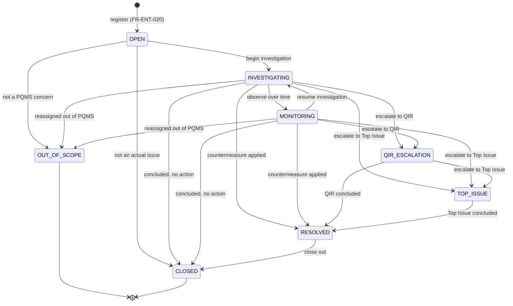
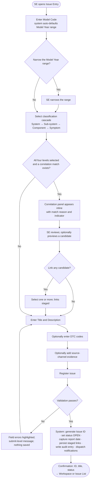
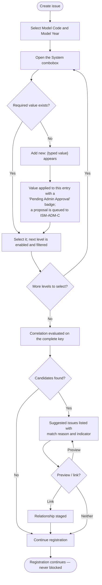
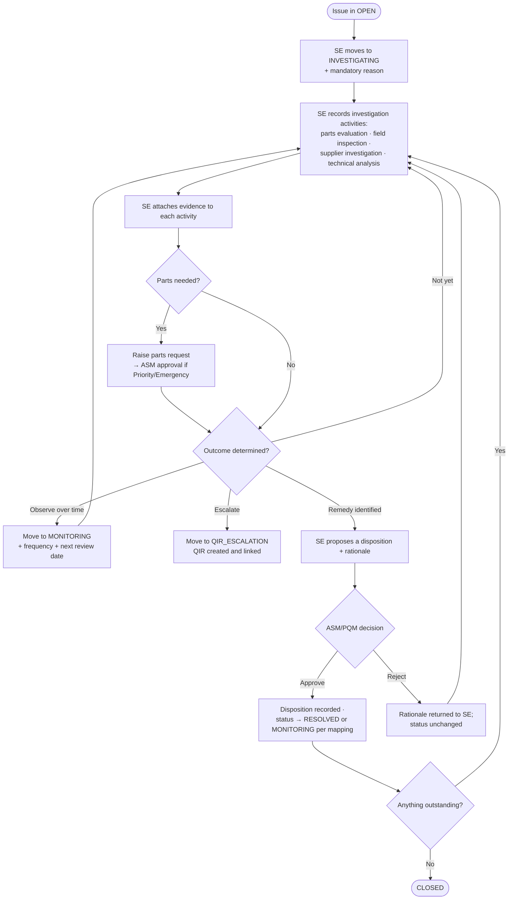
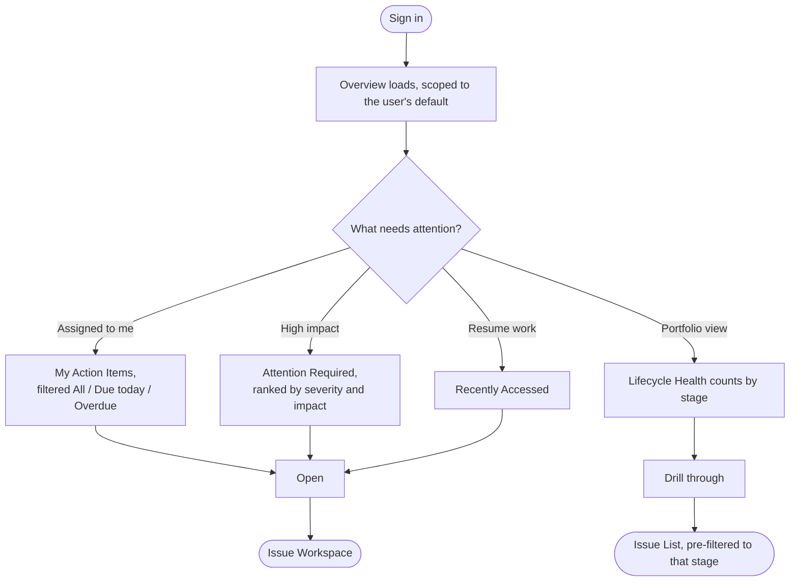
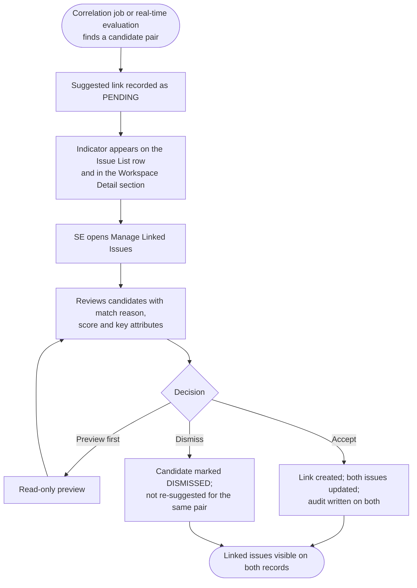
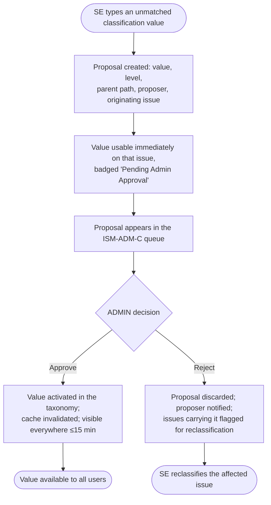
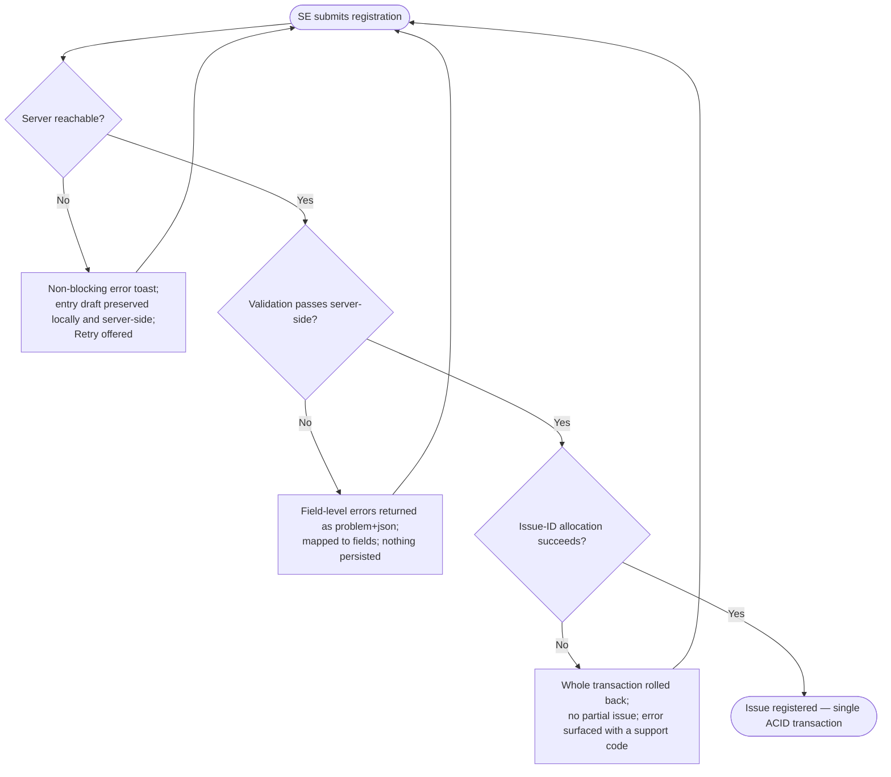
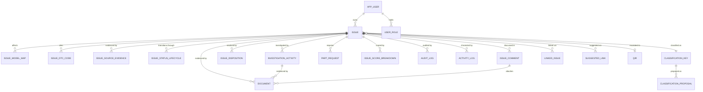

# N-PQMS ISM v2 — Business Requirements Document
## Greenfield Rebuild · React SPA + Modular Monolith Backend

| Field | Value |
|---|---|
| **Document ID** | KPQMS-ISM-GF-BRD-v1.0 |
| **Title** | N-PQMS Issue Management (ISM) Module — Greenfield Rebuild |
| **Module** | ISM — Issue Management, plus the enabling platform slices the monolith must own to stand alone |
| **Target solution** | React 19 SPA (Vite) + Spring Boot modular-monolith backend + PostgreSQL |
| **Status** | Draft for review — **not yet ratified** |
| **Version** | 1.0 |
| **Date** | 2026-08-20 |
| **Author** | Prisilla Ghadi (Frontend Lead / Architect) |
| **Reviewers** | Joon Sung Yoo (HAEA PM) · Robert Nguyen (KIA NA, Business Owner) · Winston (System Architect) |
| **Supersedes** | Nothing. This is a **parallel greenfield baseline**, not a revision of `KPQMS-ISM-BRD-v1.5`. |

---

## 0. Source-of-Truth Header

> This header exists because the single largest defect in the current ISM documentation set is that three requirement
> baselines (BRD v1.1/v1.3, BRD v1.5, and the running code) drifted apart with no propagation discipline
> (`docs/ism-brd-hld-improvement-assessment.md` §1). Every document produced from this point forward carries this block.

| Concern | This document traces to | Last propagation |
|---|---|---|
| Business rules, scope, acceptance criteria | `docs/customer-documents/N-PQMS_ISM_BRD_v1.5.md` (**authoritative for business intent**) | 2026-08-20 |
| Issue lifecycle vocabulary | BRD v1.5 §6.3 — **ratified as the baseline for this rebuild** (see §8, DEC-01) | 2026-08-20 |
| Role vocabulary & capability model | `design-artifacts/D-Design-System/pages/ISM SE Role - BRD.md` §2, §15 — **ratified** (see §6, DEC-02) | 2026-08-20 |
| Screen behaviour, field-level rules, states | Interactive prototype `design-artifacts/D-Design-System/_ds-bundle/prototype/ISM SE Role.dc.html` + `docs/requirements/ISM + QIR SE Role.dc.html` | 2026-08-20 |
| Visual language, tokens, component contract | `design-artifacts/D-Design-System/tokens/*.css`, `pages/ISM SE Role - Spec.md`, `_ds-bundle/_ds_manifest.json` | 2026-08-20 |
| Logical data model | `docs/design-documents/NPQMS-HLD-Part03-Datamodel-v1.0.md` §3.2, §3.5 (**conceptual altitude only**) | 2026-08-20 |
| Functional decomposition, API surface | `docs/design-documents/NPQMS-HLD-Part02-M1-ISM-Functional-v1.0.md` §3, §6.2 (**conceptual altitude only**) | 2026-08-20 |
| Known defects this document must not reproduce | `docs/ism-brd-hld-improvement-assessment.md` Appendix A & B | 2026-08-20 |
| Target frontend stack | `frontend/vue-to-react.md`, `frontend/react-migration-30-day-plan.md` | 2026-08-20 |
| Backend architecture antecedent | `_bmad-output/planning-artifacts/backend/architecture/pqms-backend-architecture.md` (**deliberately departed from** — see §7, DEC-08) | 2026-08-20 |

**Version-propagation gate.** Any change to this BRD's version triggers a mandatory delta pass into (a) the architecture
spine, (b) the epic/story backlog, and (c) the traceability matrix in §23 — *before* affected stories move past
`ready-for-dev`. This rule exists because a v1.3 → v1.5 bump sat un-propagated for weeks and produced the current
three-baseline split.

---

## Revision History

| Version | Date | Author | Summary |
|---|---|---|---|
| 1.0 | 2026-08-20 | Prisilla Ghadi | Initial greenfield baseline. Consolidates BRD v1.5 business intent, the SE-role prototype's screen-level behaviour, the HLD's conceptual data model, and the improvement assessment's defect register into one buildable contract for a from-scratch React + modular-monolith implementation. Ratifies 12 previously-open decisions (§21). Quantifies every NFR (§17). Adds a per-role status transition matrix (§8.3), a complete field-level data dictionary (§15), and a bidirectional traceability matrix (§23). |

---

## Reference Documents

| Ref | Document | Role in this BRD |
|---|---|---|
| R-01 | `docs/customer-documents/N-PQMS_ISM_BRD_v1.5.md` | Business-intent baseline. Every `BR-*` in §4 traces to it. |
| R-02 | `docs/customer-documents/N-PQMS_Phase1_BRD_v1.1 (By Customer).md` | Programme context — milestones, integrations, security, cross-module scope. |
| R-03 | `docs/design-documents/NPQMS-HLD-Part02-M1-ISM-Functional-v1.0.md` | Functional decomposition and API inventory, used at conceptual altitude. |
| R-04 | `docs/design-documents/NPQMS-HLD-Part03-Datamodel-v1.0.md` | Logical entity set, used at conceptual altitude. |
| R-05 | `design-artifacts/D-Design-System/pages/ISM SE Role - BRD.md` | Screen-level functional specification derived from the prototype. |
| R-06 | `design-artifacts/D-Design-System/pages/ISM SE Role - Spec.md` | Design specification — tokens, layout hierarchy, component rules, content voice. |
| R-07 | `design-artifacts/D-Design-System/_ds-bundle/prototype/ISM SE Role.dc.html` | The interactive prototype. **Behavioural tie-breaker** where prose is ambiguous. |
| R-08 | `design-artifacts/D-Design-System/tokens/{colors,typography,spacing,elevation,fonts,styles}.css` | The token contract the React design system must consume unchanged. |
| R-09 | `design-artifacts/D-Design-System/issue-management/0{1..5}-*.md` | Design analysis, navigation map, component inventory, user flows. |
| R-10 | `docs/ism-brd-hld-improvement-assessment.md` | The defect register this document is written to close. |
| R-11 | `docs/hld-vs-spec-drift-audit.md`, `docs/requirements/N-PQMS_ISM_Audit_Report.md` | Prior audits; findings folded into §21 and §23. |
| R-12 | `frontend/vue-to-react.md` + `frontend/react-migration-30-day-plan.md` | Target frontend stack, coverage bar, working agreements. |
| R-13 | `_bmad-output/planning-artifacts/backend/architecture/pqms-backend-architecture.md` | Prior microservices spine — the architecture this rebuild deliberately replaces. |
| R-14 | `docs/design-documents/images/screen/N-PQMS-Screen-*-ISM-*.png` | Approved screen captures for ISM0010 / ISM0020 / ISM0040 / ADM0200. |
| R-15 | `design-artifacts/screenshot/**` | 90+ interaction-state captures (issue detail, history, investigation, linked issues, sources). |

---

## Table of Contents

| § | Section |
|---|---|
| 1 | [Executive Summary](#1-executive-summary) |
| 2 | [Why a Greenfield Rebuild](#2-why-a-greenfield-rebuild) |
| 3 | [Business Objectives](#3-business-objectives) |
| 4 | [Business Requirements](#4-business-requirements) |
| 5 | [Stakeholders & RACI](#5-stakeholders--raci) |
| 6 | [Roles, Capabilities & Authorization](#6-roles-capabilities--authorization) |
| 7 | [Solution Architecture Context](#7-solution-architecture-context) |
| 8 | [Issue Lifecycle & State Machine](#8-issue-lifecycle--state-machine) |
| 9 | [Scope Boundary](#9-scope-boundary) |
| 10 | [Screen Inventory & Navigation Model](#10-screen-inventory--navigation-model) |
| 11 | [User Flows](#11-user-flows) |
| 12 | [Functional Requirements](#12-functional-requirements) |
| 13 | [Business Rules](#13-business-rules) |
| 14 | [Validation Rules](#14-validation-rules) |
| 15 | [Data Requirements](#15-data-requirements) |
| 16 | [API & Integration Requirements](#16-api--integration-requirements) |
| 17 | [Non-Functional Requirements](#17-non-functional-requirements) |
| 18 | [Security, Privacy & Compliance](#18-security-privacy--compliance) |
| 19 | [Assumptions & Dependencies](#19-assumptions--dependencies) |
| 20 | [Risks & Mitigations](#20-risks--mitigations) |
| 21 | [Decisions Requiring Ratification](#21-decisions-requiring-ratification) |
| 22 | [Delivery Plan & Acceptance Gates](#22-delivery-plan--acceptance-gates) |
| 23 | [Traceability Matrix](#23-traceability-matrix) |
| 24 | [Open Questions](#24-open-questions) |
| 25 | [Approvals](#25-approvals) |
| A–D | [Appendices](#appendix-a--glossary) |

---

## 1. Executive Summary

| Item | Detail |
|---|---|
| **Problem statement** | Kia's legacy KPQMS issue capture is source-agnostic and single-vehicle-level. Engineers cannot capture source-specific evidence efficiently, cannot classify structurally enough for correlation, and are never told that a colleague has already filed the same defect on a different model. Quality signals are siloed per engineer and per model, status changes carry no recorded reason, and there is no chronological activity trail an auditor can follow. Separately, the in-flight N-PQMS build has accumulated three divergent requirement baselines and a six-service distributed topology whose operational cost is not justified by its load profile. |
| **Proposed solution** | Rebuild ISM from scratch as **one React 19 single-page application** served by **one Spring Boot modular-monolith backend** over **one PostgreSQL database**. The module delivers: (1) a role-aware **Overview** landing page surfacing action items, attention-required records and lifecycle health; (2) a **simplified Issue Entry** requiring only Model Code, 4-level classification, Title and Description, with optional source-channel evidence panels and DTC capture; (3) **real-time correlation detection** during entry and **post-submission link suggestions**, so duplicate investigation is caught before it starts; (4) an **Issue List** with role-based default views, per-user column configuration, saved filter state and bulk actions; (5) an **Issue Workspace** organised as Detail · Investigation · Resolution · Communication · History; (6) a **mandatory-reason gate** on every status, classification and disposition change, written to an append-only audit trail; and (7) **classification master-data administration** with a proposal / approval queue. |
| **Architecture decision** | **Modular monolith, not microservices.** ISM's Phase-1 load profile (≈400 named users, ≈50 concurrent, ≈100k issues) does not justify six independently-deployed services, three network hops per read, distributed transactions across `issue` and `identity` data, or the Camunda dependency. One deployable unit with enforced internal module boundaries delivers the same domain separation at roughly one-fifth the operational surface, and preserves the option to extract a service later along a boundary already proven in code. Full rationale and reversal cost: §7 and DEC-08. |
| **Business value** | Cuts duplicate investigation effort by surfacing correlations at the point of entry rather than at retrospective review; accelerates cross-model root-cause convergence; makes every status change defensible under audit; gives each engineer a prioritised action list on login; and lets the classification taxonomy grow with emerging quality signals without an engineering deployment. |
| **Phase & tier** | Phase 1 — Core ISM. Programme go-live target **2026-12-18** (R-02 §20.5). ISM is **Tier 1 Critical**, 24.4% of total KPQMS usage. |
| **In scope** | Overview · Issue List · Issue Entry · Issue Workspace (5 sections) · Classification Administration · plus the enabling platform slices the monolith must own to stand alone: authentication & RBAC, notification dispatch, document management, audit & activity logging, export, and master-data read/caching. |
| **Out of scope** | QIR and TSB module internals (read-only seams only), AI/ML similarity scoring, cross-module correlation, EWS/GQIS ingestion pipeline implementation, reporting/BI beyond on-screen KPIs and XLSX export, and the Issue Group management screen. See §9.3. |
| **Ratified decisions** | 12 previously-open items are decided in this document with rationale and reversal cost (§21), including the lifecycle vocabulary, role model, disposition set, severity factor weights, issue-ID format, workflow engine, and identity provider. Each requires named sign-off before its epic starts. |

### 1.1 What makes this document different from BRD v1.5

BRD v1.5 is the business contract and remains authoritative for business intent. It is not, however, buildable as written:
it contains duplicate FR IDs, a dangling `BR-ISM-015`, missing NFR IDs, unquantified performance targets, four user flows
promised but absent, and no per-role transition matrix (R-10 Appendix A). This document closes every one of those defects
while preserving v1.5's intent, and adds the four things a scaffold-from-scratch team cannot start without:

1. **A per-role status transition matrix** over a single ratified status set (§8.3) — closes gap G-002.
2. **Quantified NFRs** with a measurement method and a test gate for each (§17) — closes Audit §10.1.10.
3. **A field-level data dictionary and logical model** with keys, nullability, PII flags, retention class and index intent (§15) — closes Audit §3.3 / G-032.
4. **Acceptance criteria on every functional requirement**, not on a sampled subset (§12) — closes Audit §8.2.

---

## 2. Why a Greenfield Rebuild

This section exists because "rebuild from scratch" is an expensive default, and the BRD should record why it was chosen
rather than assume it. A reviewer who disagrees with this section should stop here rather than review the remaining 23.

### 2.1 The case for rebuilding

| # | Driver | Evidence |
|---|---|---|
| D-1 | **Three requirement baselines have never been reconciled.** Design, specs and running code trace to different versions of the truth. Every new story compounds the drift. | R-10 §1.1: HLD traceability blocks cite only BRD 1.1 / ISM BRD 1.3 / ISM DRD 1.0 — never v1.5 — and use `ISM-FR-*` IDs rather than v1.5's `BR-ISM-*` scheme. |
| D-2 | **The frontend is mid-framework-change with no product benefit banked.** A 36-week, 3-developer, ~46k-LOC Vue→React migration is planned that ends at feature parity and nothing more. Rebuilding ISM directly in React on a clean scaffold converts that migration cost into delivery. | R-12 §0.3, §0.4 — the migration author's own counter-argument. |
| D-3 | **The distributed topology is not load-justified.** Six Spring Boot services, a Camunda engine, an API gateway and a config server, for ≈50 concurrent users. A single Issue Workspace page read touches `issue-management`, `user-management`, `master-data-management` and `pqms-notification-service`. | R-13 AD-1..AD-11; §17.1 load profile. |
| D-4 | **The chosen workflow engine has no viable version.** Camunda 7 Community shipped its final release (7.24, Oct 2025) and is off the Spring Boot 4.1 compatibility matrix; Camunda 8 is Zeebe-based with no embedded-engine model. Neither fits a monolith. | R-13 "⚠️ Needs a platform decision"; R-10 G-021. |
| D-5 | **The chosen identity product is closed to new tenants.** Azure AD B2C stopped accepting new customers on 2025-05-01. | R-10 G-035. |
| D-6 | **Known data-model debt is structural, not cosmetic.** No indexing strategy anywhere across ~900 lines of database design; FK representation inconsistent between table definitions and ER diagrams; `delete_flag` on only 7 of ~45 tables; no PII flags; no retention columns; `ISM_STATUS_CHANGE` referenced in the functional HLD but never defined in the data model. | R-10 Appendix B. |

### 2.2 What is being preserved, not discarded

A rebuild that discards the work already done would be indefensible. The following carry forward substantially intact:

| Asset | Carried forward as |
|---|---|
| **BRD v1.5 business intent** | The `BR-*` set in §4 and the FR set in §12 are a superset of v1.5's, with defects repaired and acceptance criteria added. |
| **The interactive prototype** (R-07) | The behavioural specification for every screen. Where §12 and the prototype disagree, the prototype wins on interaction detail and this document wins on business rule — every such conflict is logged in §24. |
| **The design-token set** (R-08) | Consumed unchanged. Zero framework imports; ports with no changes at all (R-12 Finding 1). |
| **The logical entity model** (R-04) | The §15 model is a hardened derivative — same entities, plus keys, nullability, PII/retention classification and index intent. |
| **The conceptual API surface** (R-03 §6.2) | The §16 surface is a re-shaped derivative: same capabilities, monolith-appropriate routing, consistent `/api/v1/**` prefixing. |
| **Framework-agnostic frontend layers** | `apiClient`, `api/`, `services/` + mappers, `shared/format`, `config/`, logger, monitoring, Excel export — ≈8,000–9,000 LOC transferring essentially verbatim (R-12 Finding 1). |
| **The existing test corpus's intent** | 125 spec files and the `automation-tests` BDD suite define behaviour worth re-asserting even where the implementation changes. |

### 2.3 The honest counter-argument

Rebuilding restarts the clock on a module that already has a running backend (11 REST controllers across six services,
five of them in `issue-management`) and a Vue frontend of 94 portal components over a 30-component library, under active development (277 commits in 90 days, R-12 Finding 3). If the programme's binding constraint is
the **2026-12-18 go-live**, and if the three-baseline drift can be closed by documentation work rather than code work —
which R-10 §3 argues is largely true, since evidence from the running code already settles three of the four headline
contradictions — then **incremental reconciliation is the cheaper path and this rebuild should not proceed.**

This BRD is written to execute well *given* the decision to rebuild. It does not assume the decision is correct.
**DEC-00 in §21 records the business driver and requires explicit sign-off before Epic 1 starts.**

---

## 3. Business Objectives

| # | Objective | Success measure | Measured by | Baseline |
|---|---|---|---|---|
| BO-01 | Improve quality-issue management efficiency | Median elapsed time from issue registration to first recorded investigation activity reduced ≥ 30% | Activity-log timestamps, monthly cohort | Legacy KPQMS median, captured during UAT dry-run |
| BO-02 | Improve traceability and auditability | 100% of status changes, classification changes and disposition decisions carry a user-authored reason and appear in the audit trail within the same session | Audit-log completeness query, run weekly | 0% (legacy captures no reason) |
| BO-03 | Reduce duplicate investigations | ≥ 60% of registrations that have a true duplicate surface it in the correlation panel *before* submit; measured on a labelled 200-issue evaluation set | Correlation-engine recall report | Legacy: no correlation capability |
| BO-04 | Enhance cross-team collaboration | ≥ 80% of issues that reach INVESTIGATING carry at least one communication entry or linked record | Issue-level aggregate query | Not measured today |
| BO-05 | Support informed decision-making | Overview lifecycle-health counts reconcile exactly with the Issue List's filtered counts for the same scope, verified nightly | Automated reconciliation job | N/A |
| BO-06 | Let the classification taxonomy grow with emerging quality signals | An Admin can add/approve a System, Sub-system, Component or Symptom value with no engineering deployment; approved values appear in comboboxes within **15 minutes** (cache TTL), not 24 hours | Cache-refresh telemetry | Legacy: code change + release |
| BO-07 | Ensure every status change is documented | 100% of status-change events carry a reason ≥ 10 characters; reason visible in the Issue Workspace History section within the same session | Audit query | 0% |
| BO-08 | Give each engineer immediate visibility of priority actions on login | Median time-to-first-action on overdue and action-required items reduced ≥ 40% versus legacy, measured in UAT scenario testing | UAT stopwatch protocol, 12 scripted scenarios | Legacy UAT baseline |
| BO-09 | Establish one requirement baseline that downstream artifacts demonstrably trace to | 100% of epics and stories cite an FR ID from §12; zero orphan stories at each sprint gate | Sprint-planning readiness check | 3 divergent baselines today |
| BO-10 | Reduce operational surface | Production deployable units for the ISM scope reduced from 6 services + gateway + config server + Camunda to **1 application + 1 database** | Deployment manifest count | 9 units |

> **Note on BO-06.** BRD v1.5 §3 (BO-06) specifies "within 24 hours of admin approval." This document tightens it to
> 15 minutes because the implementing mechanism is a cache TTL, and a 24-hour figure would imply a batch job that the
> architecture does not need. Tightening a target is a change to the business contract and is logged as **DEC-11**.

---

## 4. Business Requirements

Business requirements state *what the business needs*. Each is decomposed into functional requirements in §12 and is
traced bidirectionally in §23. Priority: **P1** = Phase-1 mandatory (go-live blocker); **P2** = Phase-1 desirable
(descopable at the Day-N cut gate without failing acceptance); **P3** = Phase 2.

| BR-ID | Priority | Business Requirement | Origin |
|---|---|---|---|
| BR-ISM-001 | P1 | The system shall enable users to register, investigate, track and resolve quality issues throughout their lifecycle. | R-01 BR-ISM-001 |
| BR-ISM-002 | P1 | The system shall provide role-based access and personalised default views to support efficient issue management and monitoring. | R-01 BR-ISM-002 |
| BR-ISM-003 | P1 | The system shall support vehicle identification and structured issue classification to enable tracking, investigation and analysis. | R-01 BR-ISM-003 |
| BR-ISM-004 | P1 | The system shall provide a centralised workspace for issue investigation, collaboration, resolution and historical tracking. | R-01 BR-ISM-004 |
| BR-ISM-005 | P1 | The system shall enable users to identify, correlate and manage related or duplicate issues, to reduce duplicate investigation and promote knowledge reuse. | R-01 BR-ISM-005 |
| BR-ISM-006 | P1 | The system shall provide complete, append-only traceability of issue activities, status changes, decisions and administrative actions. | R-01 BR-ISM-006 |
| BR-ISM-007 | P1 | The system shall support integration and information sharing between Issue Management and QIR Management. | R-01 BR-ISM-007 |
| BR-ISM-008 | P2 | The system shall provide a configurable framework — statuses, classifications, thresholds, business rules — that supports future requirements without code change. | R-01 BR-ISM-008 |
| BR-ISM-009 | P2 | The system shall improve user efficiency through streamlined workflows and intuitive navigation. | R-01 BR-ISM-009 |
| BR-ISM-010 | P1 | The system shall enable users to search, filter and locate issues using business-relevant criteria. | R-01 BR-ISM-010 |
| BR-ISM-011 | P1 | The system shall enable authorised users to create, view, update and manage issue records. | R-01 BR-ISM-011 |
| BR-ISM-012 | P1 | The system shall support issue lifecycle management through configurable statuses, governed transitions and business outcomes. | R-01 BR-ISM-012 |
| BR-ISM-013 | P2 | The system shall provide reporting and data-export capabilities to support business analysis. | R-01 BR-ISM-013 |
| BR-ISM-014 | P1 | The system shall support issue disposition management, recording the business outcome of an investigation. | R-01 BR-ISM-014 |
| BR-ISM-015 | P1 | The system shall allow issue registration to complete whether or not a suggested correlation is accepted — correlation must never block capture. | **New.** Repairs the dangling `BR-ISM-015` cited by v1.5 `FR-ISM020-023` but never defined (R-10 Appendix A). |
| BR-ISM-016 | P1 | The system shall attach, retain and control access to supporting evidence documents throughout the issue lifecycle. | **New.** v1.5 states this only at FR level (`FR-ISM040-029..031`) with no BR parent. |
| BR-ISM-017 | P1 | The system shall notify the right people at the right time about issues requiring their attention. | **New.** v1.5 assumes notification (AD-ISM-004) but states no requirement. |
| BR-ISM-018 | P1 | The system shall authenticate users through the enterprise identity provider and authorise every action server-side. | **New.** v1.5 states this only as NFR-ISM-003/004; it is a functional obligation of the monolith (§9.2). |
| BR-ISM-019 | P2 | The system shall support issue severity scoring from configured factors and thresholds, with an auditable override path. | **New.** Reconciles v1.5's single P2 line with the prototype's full scoring tab and the running code's shipped scoring (R-10 §3 item 3). |
| BR-ISM-020 | P1 | The system shall be deliverable, operable and observable as a single deployable application. | **New.** The architectural obligation this rebuild exists to satisfy (BO-10). |

---

## 5. Stakeholders & RACI

### 5.1 Stakeholders

| Role | Name / Team | Interest |
|---|---|---|
| Business Owner | Robert Nguyen (KIA NA) | Final authority on N-PQMS scope and acceptance |
| Programme Manager | Joon Sung Yoo (HAEA) | Delivery, milestone gates, go-live sign-off |
| Product Quality Manager (PQM) | PQ Management team | Final authority on disposition, escalation, grouping |
| After-Sales Manager (ASM) | Regional service management | Approves dispositions and score overrides; owns regional quality outcomes |
| Service Engineer (SE) | Field quality engineering | Primary user — registers, investigates, proposes |
| System Administrator | PQ Systems Team | Classification taxonomy, source-channel configuration, user & role administration |
| System Architect | Winston | Architecture spine, ADRs, the modular-monolith boundary contract |
| Frontend Lead | Prisilla Ghadi | React scaffold, design-system parity, coverage gate |
| Backend Lead | *(unassigned — see Q7)* | Monolith module boundaries, data model, API contract |
| Test Architect | Murat | Test strategy, traceability matrix, NFR evidence |
| NAQC | External technical team | Read-only visibility into escalated issues |
| Compliance / Records Management | KIA NA Legal | Retention policy, audit-record immutability |

### 5.2 RACI for the key decisions and deliverables

| Deliverable / Decision | Business Owner | PM | PQM | Architect | FE Lead | BE Lead | Test Architect |
|---|---|---|---|---|---|---|---|
| DEC-00 rebuild go/no-go | **A** | R | C | R | C | C | I |
| This BRD | A | R | C | C | **R** | C | C |
| Lifecycle & transition matrix (§8) | A | C | **R** | C | I | C | C |
| Role & permission model (§6) | A | C | R | C | C | **R** | I |
| Modular-monolith boundary contract (§7) | I | C | I | **A/R** | C | R | I |
| Data model (§15) | I | I | C | A | I | **R** | C |
| API contract (§16) | I | I | I | A | R | **R** | C |
| NFR targets (§17) | C | A | I | R | C | C | **R** |
| Severity factor weights (DEC-05) | A | C | **R** | C | I | C | I |
| Disposition vocabulary (DEC-04) | **A** | C | R | I | I | C | I |
| Retention & PII classification (§18) | A | C | C | R | I | **R** | C |
| Acceptance gate sign-off (§22) | **A** | R | C | C | C | C | R |

*R = Responsible · A = Accountable · C = Consulted · I = Informed*

---

## 6. Roles, Capabilities & Authorization

### 6.1 Ratified role model — DEC-02

**Decision.** This rebuild adopts the **prototype's three-role, two-capability model** (R-05 §2): **SE**, **ASM**, **PQM**,
where SE carries the `read` capability (propose, never approve) and ASM/PQM carry `override` (approve, override, share).
An **ADMIN** role is added for the platform slices in scope, and a **VIEWER** role covers read-only external stakeholders.

**Rationale.** The prototype, the design system, the component contract and 90+ interaction-state captures are all built
on this vocabulary; the capability abstraction (`read` vs `override`) is the mechanism that actually gates behaviour in
the UI, and re-deriving it from the customer's job-title list would leave the design artifacts un-implementable without
translation on every screen.

**Consequence to accept.** BRD v1.5 §2.1 uses job titles (Service Engineer, Service Engineer Manager, PQ Department Head,
Administrator, Publication Coordinator, NAQC, HATCI, plant teams). These are **organisational** roles; the system roles
below are **capability** roles. Appendix B carries the mapping. Business stakeholders reading v1.5 must use Appendix B to
locate their role here. **This mapping requires PQM sign-off before Epic 2.**

### 6.2 Role definitions

| Role code | Title | Capability | Default data scope | Landing screen |
|---|---|---|---|---|
| `SE` | Service Engineer | `read` — propose, never approve | My issues (own); may switch to All | Overview |
| `ASM` | After-Sales Manager | `override` — approve, override, share | All issues | Overview |
| `PQM` | Product Quality Manager | `override` — approve, override, share | All issues | Overview |
| `ADMIN` | System Administrator | `administer` — full configuration | All issues | Overview |
| `VIEWER` | Read-only stakeholder (NAQC, PQ Dept Head, auditor) | `view` | All issues, read-only | Overview |

**Capability semantics.** A capability is a coarse gate; individual actions are still checked against §6.3. A role never
has an action by virtue of a *higher* capability — the matrix is authoritative, not the capability ordering.

### 6.3 Authorization matrix

| Action | SE | ASM | PQM | ADMIN | VIEWER | Enforced by FR |
|---|---|---|---|---|---|---|
| View Overview | ✓ | ✓ | ✓ | ✓ | ✓ | FR-OVW-001 |
| View Issue List (own scope) | ✓ | ✓ | ✓ | ✓ | ✓ | FR-LST-002 |
| View Issue List (all scope) | ✓ | ✓ | ✓ | ✓ | ✓ | FR-LST-003 |
| View Issue Workspace | ✓ | ✓ | ✓ | ✓ | ✓ (RO) | FR-WSP-001 |
| Create issue | ✓ | ✓ | ✓ | ✓ | ✗ | FR-ENT-001 |
| Edit an issue you authored, before its first status change | ✓ | ✓ | ✓ | ✓ | ✗ | FR-WSP-014 |
| Edit any issue, at any non-terminal status (justification required) | ✗ | ✓ | ✓ | ✓ | ✗ | FR-WSP-015 |
| Withdraw a status-change proposal you raised | ✓ | ✓ | ✓ | ✓ | ✗ | FR-WSP-024 |
| Change issue status | ✓ (per §8.3) | ✓ | ✓ | ✓ | ✗ | FR-WSP-020 |
| Approve / reject a proposed status change | ✗ | ✓ | ✓ | ✓ | ✗ | FR-WSP-024 |
| Record investigation activity | ✓ | ✓ | ✓ | ✓ | ✗ | FR-INV-001 |
| Edit / delete own investigation activity | ✓ | ✓ | ✓ | ✓ | ✗ | FR-INV-005 |
| Edit / delete another user's investigation activity | ✗ | ✓ | ✓ | ✓ | ✗ | FR-INV-006 |
| Propose disposition | ✓ | ✓ | ✓ | ✗ | ✗ | FR-RES-004 |
| Approve / reject disposition | ✗ | ✓ | ✓ | ✗ | ✗ | FR-RES-007 |
| Request re-score | ✓ | ✓ | ✓ | ✓ | ✗ | FR-SCR-004 |
| Apply manual score override | ✗ | ✓ | ✓ | ✓ | ✗ | FR-SCR-005 |
| Manage linked issues | ✓ | ✓ | ✓ | ✓ | ✗ | FR-LNK-004 |
| Escalate to QIR | ✓ | ✓ | ✓ | ✗ | ✗ | FR-RES-010 |
| Request parts | ✓ | ✓ | ✓ | ✗ | ✗ | FR-INV-010 |
| Approve parts request (Priority/Emergency) | ✗ | ✓ | ✓ | ✗ | ✗ | FR-INV-013 |
| Comment — internal | ✓ | ✓ | ✓ | ✓ | ✗ | FR-COM-002 |
| Comment — external | ✗ | ✓ | ✓ | ✓ | ✗ | FR-COM-003 |
| Upload / download supporting document | ✓ | ✓ | ✓ | ✓ | download only | FR-DOC-001 |
| Delete a document | own only | ✓ | ✓ | ✓ | ✗ | FR-DOC-005 |
| View audit & activity history | ✓ | ✓ | ✓ | ✓ | ✓ | FR-HIS-001 |
| Create a manual history entry | ✗ | ✓ | ✓ | ✓ | ✗ | FR-HIS-008 |
| Export issue list / selection | ✓ | ✓ | ✓ | ✓ | ✓ | FR-LST-026 |
| Bulk assign | ✓ (own team) | ✓ | ✓ | ✓ | ✗ | FR-LST-021 |
| Bulk status change | ✓ (per §8.3) | ✓ | ✓ | ✓ | ✗ | FR-LST-022 |
| Propose a new classification value | ✓ | ✓ | ✓ | ✓ | ✗ | FR-ADM-005 |
| Approve / reject a proposed classification value | ✗ | ✗ | ✗ | ✓ | ✗ | FR-ADM-006 |
| Manage classification master data | ✗ | ✗ | ✗ | ✓ | ✗ | FR-ADM-001 |
| Manage scoring weights & thresholds | ✗ | ✗ | ✗ | ✓ | ✗ | FR-ADM-011 |
| Manage users, roles & permissions | ✗ | ✗ | ✗ | ✓ | ✗ | FR-SEC-010 |
| Modify or delete an audit record | ✗ | ✗ | ✗ | ✗ | ✗ | FR-HIS-004 (prohibition) |

**Enforcement rule.** Every row in this matrix is enforced **server-side** at the application-service layer, and mirrored
client-side only to hide or disable affordances. A UI that hides an action is a courtesy; the server refusing it is the
control. Client-only enforcement is a blocking review finding (§18.3).

### 6.4 Data-scope rules

| Rule | Definition |
|---|---|
| SCOPE-01 | "My issues" = issues where the current user is the assignee **or** the creator **or** a named team member. |
| SCOPE-02 | "All issues" = every non-deleted issue the user's role may view. No role sees deleted records except ADMIN. |
| SCOPE-03 | SE defaults to "My issues" on both Overview and Issue List; ASM, PQM, ADMIN and VIEWER default to "All". |
| SCOPE-04 | The scope selection is a user preference, persisted per user, and restored on next login. |
| SCOPE-05 | Overview counts, Issue List rows and export contents all honour the same active scope. A discrepancy between them is a defect, not a display choice. |


---

## 7. Solution Architecture Context

> A BRD does not normally specify architecture. This one does, in constrained form, because the user requirement is
> explicitly *"a new scaffold project from scratch in React and monolith in backend"* — the architecture is part of the
> business ask, not an implementation detail left to design. This section states **what the business is buying and why**,
> and the constraints that follow. Component-level design, package structure and DDL belong in the architecture spine and
> are deliberately *not* fixed here — that altitude confusion is what produced the current drift (R-10 §2).

### 7.1 Target topology

```
┌──────────────────────────────────────────────────────────────────────┐
│  Browser — React 19 SPA (Vite build, static assets on CDN/S3)        │
│  React Router 7 · TanStack Query 5 · Zustand · Tailwind v4           │
│  @pqms/design-tokens (unchanged) · @pqms/ui-react (new)              │
└───────────────────────────────┬──────────────────────────────────────┘
                                │ HTTPS · OIDC Bearer JWT · /api/v1/**
┌───────────────────────────────▼──────────────────────────────────────┐
│  N-PQMS Application — ONE Spring Boot deployable                     │
│  ┌────────────────────────────────────────────────────────────────┐  │
│  │  Web layer — REST controllers, request validation, problem+json │  │
│  ├────────────────────────────────────────────────────────────────┤  │
│  │  Modules (compile-time enforced boundaries)                     │  │
│  │   issue · classification · correlation · scoring · lifecycle    │  │
│  │   investigation · disposition · communication · document        │  │
│  │   audit · notification · identity · masterdata · export         │  │
│  ├────────────────────────────────────────────────────────────────┤  │
│  │  Shared kernel — ActorRef, PageResponse, ApiError, clock, ids   │  │
│  └────────────────────────────────────────────────────────────────┘  │
│  In-process events (Spring ApplicationEvent) — no broker in Phase 1  │
└──────┬───────────────────────────┬───────────────────┬───────────────┘
       │                           │                   │
┌──────▼──────┐          ┌─────────▼────────┐   ┌──────▼──────────────┐
│ PostgreSQL  │          │ Object store     │   │ Outbound adapters   │
│ single DB,  │          │ (S3-compatible)  │   │ Entra ID · SMTP     │
│ schema `ism`│          │ documents        │   │ INT-01..INT-06      │
└─────────────┘          └──────────────────┘   └─────────────────────┘
```

### 7.2 Architectural requirements (business-binding)

| ID | Requirement | Priority | Rationale / consequence |
|---|---|---|---|
| AR-01 | The ISM scope shall be delivered as **exactly one backend deployable unit** and **one browser application**. | P1 | BO-10. Reduces production units for the ISM scope from 9 to 2 (app + database). |
| AR-02 | The backend shall enforce **module boundaries at compile time** — a module may be called only through its published interface; reaching into another module's internals shall fail the build. | P1 | This is what makes it a *modular* monolith rather than a big ball of mud, and what preserves the extract-a-service option in AR-11. Verified by an architecture test in CI (§22 gate G4). |
| AR-03 | All ISM data shall reside in **one PostgreSQL database**, one schema per bounded context, with **no distributed transactions**. | P1 | A status change writing `issue`, `issue_status_lifecycle`, `audit_log` and `notification_outbox` is one ACID transaction — not a saga. This is the single largest correctness gain over the microservices baseline. |
| AR-04 | Cross-module communication shall be **in-process**: a direct call to a published interface for synchronous needs, a Spring `ApplicationEvent` for fire-and-forget. **No message broker in Phase 1.** | P1 | R-13 AD-3 reached the same conclusion for the distributed case; in a monolith it is simply the default. |
| AR-05 | The lifecycle shall be implemented as an **in-process state machine with an explicit guard table** (§8.3). **No BPM engine.** | P1 | DEC-06. Camunda 7 CE is EOL; Camunda 8 requires a remote Zeebe cluster, contradicting AR-01. The v1.5 lifecycle is 8 states / 19 transitions — a guard table, not a process engine. |
| AR-06 | Authentication shall be **OIDC Authorization Code + PKCE** against **Microsoft Entra ID** (workforce) with **Entra External ID** for external stakeholders. The application shall validate the JWT in-process. | P1 | DEC-07. Azure AD B2C is closed to new tenants (R-10 G-035). No separate gateway is needed to validate one token for one application. |
| AR-07 | The frontend shall consume `@pqms/design-tokens` **unchanged** and shall contain **zero hard-coded colours, spacing, radii or type**. | P1 | R-08, R-12 working agreements. A hard-coded value is a blocking review finding. |
| AR-08 | Every mutating endpoint shall accept and honour an **idempotency key**, so a client retry is safe. | P1 | Carried from R-03 §6.2 resilience defaults; still required without a broker. |
| AR-09 | The application shall expose **health, readiness, metrics and structured JSON logs** with a correlation ID propagated from the SPA through to the database statement comment. | P1 | Observability was absent from the prior design entirely (R-10 Appendix B). |
| AR-10 | External integrations (INT-01..INT-06) shall be reached only through **adapter interfaces** with timeout, retry and circuit-breaker policy configured per integration, and shall have a **contract-test double** so ISM can be developed and tested with every external system unavailable. | P1 | The programme's largest schedule risk is integration availability (RISK-03). |
| AR-11 | Each module shall be extractable into its own service **without changing its callers' code** — callers depend on the interface, never the implementation. | P2 | The reversal path for DEC-08. Not exercised in Phase 1; the constraint that keeps it cheap. |
| AR-12 | The application shall run identically on a developer laptop (`docker compose up`) and in the target environment, with **no code differences between profiles**. | P1 | Onboarding cost and environment-drift defects. |

### 7.3 Technology baseline

| Layer | Choice | Notes |
|---|---|---|
| Frontend framework | **React 19** + TypeScript 6 (strict) | Per the user requirement and R-12 §0.1 target stack. |
| Build / dev server | Vite 8 | Shared with the existing monorepo tooling. |
| Routing | React Router 7 | Data-router API; route-level code splitting. |
| Server state | TanStack Query 5 | With a central `queryKeys` registry and a global error/toast/log handler. |
| Client state | Zustand | Auth/session, UI preferences, filter state. Deliberately small. |
| Styling | Tailwind v4 + `@pqms/design-tokens` | Tokens are the only source of visual values (AR-07). |
| Component library | `@pqms/ui-react` (new) | Built to the R-06 component contract; every component has a story, a spec at ≥85%×4, and an axe assertion. |
| Frontend tests | Vitest 4 + React Testing Library; Playwright 1.61 for E2E | Coverage gate ≥85% on statements, branches, functions **and** lines. |
| Backend | **Spring Boot** (latest GA at scaffold time) on Java 21 LTS | Pin the exact version in the architecture spine, not here. |
| Persistence | Spring Data JPA + Flyway migrations | Every schema change is a versioned migration; no `ddl-auto` beyond `validate`. |
| Database | PostgreSQL 16+ | Single database; schema per bounded context. |
| Module enforcement | Spring Modulith (or ArchUnit rules) | Satisfies AR-02; the choice is the architect's, the constraint is not. |
| Object storage | S3-compatible (LocalStack for local dev) | `docs/LocalStack_Setup_Guide.md` already documents the local pattern. |
| Backend tests | JUnit 5 + Testcontainers + MockMvc + AssertJ | Integration tests run against a real PostgreSQL container, never H2. |
| API documentation | OpenAPI 3.1 generated from annotated controllers | Every endpoint documents every status code including errors. |
| Observability | Micrometer + OpenTelemetry; structured JSON logging | AR-09. |

### 7.4 Scaffold structure (indicative, not binding)

```
kus-pqms-v2/
├── frontend/                      # pnpm workspace
│   ├── apps/ism-portal/           # the React 19 SPA
│   │   └── src/{app,routes,features,api,services,shared,config,test}
│   └── packages/{design-tokens,ui-react}
├── backend/                       # single Maven/Gradle project
│   └── src/main/java/com/pqms/
│       ├── PqmsApplication.java
│       ├── shared/                # ActorRef, PageResponse, ApiError, ids, clock
│       └── modules/
│           ├── issue/  classification/  correlation/  scoring/
│           ├── lifecycle/  investigation/  disposition/  communication/
│           ├── document/  audit/  notification/  identity/
│           └── masterdata/  export/
│              └── each: api/ (published interface + DTOs) · internal/ · web/
├── db/migration/                  # Flyway
├── docs/                          # this BRD, the architecture spine, ADRs
└── compose.yaml                   # app + postgres + localstack + mailhog
```

Every module directory carries the same three-part shape: `api/` is the only package other modules may import;
`internal/` is invisible to them; `web/` holds that module's REST controllers. AR-02's build rule is expressed against
exactly this shape.

### 7.5 What is deliberately *not* decided here

Package naming beyond the module split, entity-to-table mapping detail, DTO shapes, connection-pool sizing, the choice
between Spring Modulith and hand-written ArchUnit rules, and the exact Spring Boot patch version. These belong in the
architecture spine. Fixing them in a BRD is the altitude error that made the previous HLD a drift generator (R-10 §2).

---

## 8. Issue Lifecycle & State Machine

### 8.1 Ratified status set — DEC-01

**Decision.** This rebuild adopts the **BRD v1.5 §6.3 status set**, unchanged:

| Code | Label | Definition | Terminal? |
|---|---|---|---|
| `OPEN` | Open | Newly registered issue; not yet under active investigation. | No |
| `INVESTIGATING` | Investigating | Investigation is actively in progress. | No |
| `MONITORING` | Monitoring | The condition is being observed over time rather than actively investigated. | No |
| `QIR_ESCALATION` | QIR Escalation | The issue has entered the QIR escalation process. | No |
| `TOP_ISSUE` | Top Issue | The issue has been escalated to the Top Issue process. | No |
| `RESOLVED` | Resolved | Resolved through countermeasure, publication or other corrective action. | No |
| `OUT_OF_SCOPE` | Out of Scope | Does not belong to PQMS (e.g. Safety, Regulatory, another department). | **Yes** |
| `CLOSED` | Closed | Investigation concluded, or the reported condition is not an actual issue. | **Yes** |

**Rationale.** This is the customer's signed business vocabulary. The competing set (`DRAFT, OPEN, IN_REVIEW,
PENDING_APPROVAL, DISPOSED, MONITORING, ESCALATED, CLOSED`) exists in the prototype and the running code, but it was never
ratified by the business and it encodes an approval mechanic (`PENDING_APPROVAL`) that v1.5 deliberately replaced with a
mandatory-reason gate on the transition itself.

**Three consequences the business must accept**, each with the mitigation this document adopts:

| # | Consequence | Mitigation adopted |
|---|---|---|
| C-1 | **There is no `DRAFT` status.** An issue exists only once registered. The prototype's "Save draft" has no status to map to. | Save-draft is preserved as an **Issue Entry draft** — a per-user, per-session working copy of the entry form, persisted server-side against the user, **not** an `ISSUE` record. It has no Issue ID, appears in no list, and is discarded on submit or explicit cancel. Specified as FR-ENT-030..034. |
| C-2 | **There is no `PENDING_APPROVAL` status.** Status changes that require approval have nowhere to sit. | Approval is modelled as a property of the **transition**, not a state. A transition may be `direct` or `approval-gated`; a gated transition creates a `PROPOSED` lifecycle record that an `override` role approves or rejects, while the issue's own status does not change until approval. §8.4. |
| C-3 | **There is no `DISPOSED` status.** Disposition is a decision, not a lifecycle state. | Disposition (§12.6) records the *remedy* — the issue's status moves to `RESOLVED` or `MONITORING` per DEC-04's outcome mapping. |

**Reversal cost if the business later prefers the prototype set:** medium. Status is a single column plus a guard table
plus the UI status map (one lookup object per R-06 §4). Estimated 3–5 dev-days plus a data migration. Recorded so the
decision can be revisited without re-litigating it.

### 8.2 Lifecycle diagram



### 8.3 Per-role transition matrix — closes gap G-002

Every cell states who may *initiate* the transition and whether it is approval-gated. A blank cell means the transition
does not exist and the server shall reject it with `409 Conflict` and error code `ISM-LC-001`.

| From ↓ / To → | OPEN | INVESTIGATING | MONITORING | QIR_ESCALATION | TOP_ISSUE | RESOLVED | OUT_OF_SCOPE | CLOSED |
|---|---|---|---|---|---|---|---|---|
| **OPEN** | — | SE·ASM·PQM·ADMIN — direct | | | | | SE→gated; ASM·PQM·ADMIN direct | SE→gated; ASM·PQM·ADMIN direct |
| **INVESTIGATING** | | — | SE·ASM·PQM·ADMIN — direct | SE→gated; ASM·PQM direct | ASM·PQM — direct | SE→gated; ASM·PQM·ADMIN direct | SE→gated; ASM·PQM·ADMIN direct | SE→gated; ASM·PQM·ADMIN direct |
| **MONITORING** | | SE·ASM·PQM·ADMIN — direct | — | SE→gated; ASM·PQM direct | ASM·PQM — direct | SE→gated; ASM·PQM·ADMIN direct | SE→gated; ASM·PQM·ADMIN direct | SE→gated; ASM·PQM·ADMIN direct |
| **QIR_ESCALATION** | | | | — | ASM·PQM — direct | ASM·PQM·ADMIN — direct | | |
| **TOP_ISSUE** | | | | | — | PQM — direct | | |
| **RESOLVED** | | | | | | — | | SE·ASM·PQM·ADMIN — direct |
| **OUT_OF_SCOPE** | | | | | | | — (terminal) | |
| **CLOSED** | | | | | | | | — (terminal) |

**Reading the matrix.** *direct* = the transition applies immediately on submit, subject to the mandatory-reason gate.
*gated* = submitting creates a `PROPOSED` lifecycle record; the issue's status is unchanged until an `override` role
approves. `VIEWER` initiates nothing.

**Transition rules.**

| ID | Rule |
|---|---|
| LC-01 | Every transition — direct or gated — requires a reason of **≥ 10 characters**, recorded against the transition and visible in the Workspace History section. |
| LC-02 | A transition to `MONITORING` additionally requires a **monitoring frequency** and a **next review date**. |
| LC-03 | A transition to `OUT_OF_SCOPE` additionally requires a **receiving department**. |
| LC-04 | A transition to `QIR_ESCALATION` requires a linked QIR to exist or to be created as part of the same transaction. |
| LC-05 | `OUT_OF_SCOPE` and `CLOSED` are **terminal**. Reopen is **Phase 2** (DEC-12); until then, the correct response to "this was closed in error" is a new issue linked to the closed one. |
| LC-06 | Terminal issues are **read-only** in every section except Communication, which remains append-only so that post-closure correspondence is still captured. |
| LC-07 | A gated transition may be **withdrawn** by its proposer while still `PROPOSED`. Withdrawal is audited. |
| LC-08 | A rejected gated transition returns the issue to its current status unchanged and records the approver's remark, which is **mandatory** on rejection. |
| LC-09 | A bulk status change (FR-LST-022) applies the same matrix per issue. Issues whose transition is invalid are **skipped, reported by ID, and do not fail the batch**. |
| LC-10 | The matrix is stored as configuration, not code, so BR-ISM-008 (configurability) is satisfiable without a deployment. Changing it is an ADMIN action and is audited. |

### 8.4 Approval-gated transition sub-state

```mermaid
stateDiagram-v2
    direction LR
    [*] --> PROPOSED : SE submits a gated transition (+reason)
    PROPOSED --> APPROVED : ASM/PQM approves (+remark optional)
    PROPOSED --> REJECTED : ASM/PQM rejects (+remark mandatory)
    PROPOSED --> WITHDRAWN : proposer withdraws
    APPROVED --> [*] : issue status advances; audit written
    REJECTED --> [*] : issue status unchanged; audit written
    WITHDRAWN --> [*] : issue status unchanged; audit written
```



---

## 9. Scope Boundary

### 9.1 In scope — ISM core

| Capability | Screen / area | Priority |
|---|---|---|
| Role-aware Overview with action items, attention-required, recently accessed, lifecycle health | ISM-OVW | P1 |
| Issue List: role-based default views, search, filter, sort, column configuration, saved state, pagination, bulk actions, export | ISM-LST | P1 |
| Issue Entry: simplified registration, 4-level classification, DTC capture, source-channel evidence, correlation panel, issue preview, manual linking | ISM-ENT | P1 |
| Issue Workspace — Detail section | ISM-WSP/detail | P1 |
| Issue Workspace — Investigation section (activities, evidence, parts requests) | ISM-WSP/investigation | P1 |
| Issue Workspace — Resolution section (disposition, QIR link, root cause, countermeasures, closure) | ISM-WSP/resolution | P1 |
| Issue Workspace — Communication section (comments, document sharing) | ISM-WSP/communication | P1 |
| Issue Workspace — History section (activity history + audit history) | ISM-WSP/history | P1 |
| Severity scoring: factor breakdown, composite, tier, re-score request, override with justification | ISM-WSP/scoring | P2 |
| Classification administration: taxonomy CRUD, proposal queue, approve/reject, cascade structure | ISM-ADM | P1 |
| Scoring configuration: factor weights and tier thresholds | ISM-ADM/scoring | P2 |

### 9.2 In scope — enabling platform slices

These are in scope **because the monolith cannot stand alone without them**. Each is scoped to exactly what ISM needs —
not to the full platform capability described in R-02.

| Slice | What is in scope | What is explicitly not |
|---|---|---|
| **Authentication** | OIDC login/logout, token refresh, session timeout, T&C acceptance capture | User self-registration; MFA policy authoring (Entra owns it) |
| **Authorization / RBAC** | Role assignment, the §6.3 matrix, server-side enforcement, permission resolution endpoint | Feature/feature-element granularity (R-03 §5.1.7–5.1.10) — deferred to Phase 2 |
| **User administration** | Create/edit/deactivate user, assign/revoke role, role expiry | User hierarchy, expert groups, bulk CSV role load |
| **Notification** | Trigger rules for the ISM events in §16.4, in-app notification centre with unread count, email dispatch via SMTP, template rendering | SMS/push channels; notification-template authoring UI (seeded config in Phase 1) |
| **Document management** | Upload, download, list, soft-delete, type/size validation, virus scan hook, object-store persistence | Versioning, check-in/check-out, full-text search inside documents |
| **Audit & activity logging** | Append-only audit of every mutation with before→after values; activity chronology; search and date filtering | Cross-module audit aggregation UI; SIEM export (Phase 2) |
| **Master data (read/cache)** | Model, model year, DTC code, dealer, part — read and cached from INT-01/03/04 with a fallback fixture set | Master-data authoring for Model/Dealer/Part (source systems own it) |
| **Export** | XLSX export of the filtered list and of a selection, honouring column configuration and scope | Scheduled/emailed reports; PDF; BI extracts |

### 9.3 Out of scope

| Item | Rationale | Where it goes |
|---|---|---|
| QIR module internals | ISM holds a **read-only seam**: create-and-link a QIR, display its status, root cause and countermeasures. QIR's own lifecycle is a separate BRD. | QIR BRD |
| TSB / Publication module | Consumes ISM outcomes; no ISM screen renders TSB internals. | TSB BRD (R-02 §6) |
| AI/ML similarity scoring | Phase 1 correlation is deterministic key matching on Model Code + classification (§12.3.4). Probabilistic/semantic matching needs a labelled corpus that does not yet exist. | Phase 2 |
| Cross-module correlation (ISM ↔ QIR ↔ TSB) | Phase 1 correlates within ISM only. | Phase 2 |
| Issue Group management screen | Grouping is supported from Entry and Workspace; a dedicated management screen is not. | Phase 2 |
| EWS / GQIS ingestion pipeline implementation | ISM **consumes** the structured result. Building the pipeline is INT-02/INT-03 scope. | Integration BRDs |
| Issue reopen (`CLOSED → OPEN`) | LC-05. Needs a records-retention ruling on whether the reopened issue is the same record or a successor. | Phase 2 (DEC-12) |
| Feature / feature-element permission granularity | The §6.3 action matrix is sufficient for Phase 1 and an order of magnitude cheaper. | Phase 2 |
| Reporting & BI | Beyond on-screen KPIs and XLSX export. | Phase 2 / CDO |
| Mobile and tablet layouts | Target is desktop workstation widths 1280–1600px (R-05 §12). Below 1280px the app renders with horizontal scroll rather than a distinct layout. | Phase 2 |
| Localisation into additional languages | The UI is i18n-**ready** (keys, no concatenated strings, locale-aware dates/numbers) but ships **en-US only**. | Phase 2 |
| Offline / PWA capability | Not required by any user flow. | Not planned |

### 9.4 Scope-change control

Any addition to §9.1/§9.2 after the BRD is ratified requires: an impact statement against the §22 milestone dates, a
named descope of equal size, and Business-Owner approval. Recorded in the change log appended to §25.

---

## 10. Screen Inventory & Navigation Model

### 10.1 Screen inventory

| Screen ID | Legacy ID | Name | Purpose | Roles | Priority |
|---|---|---|---|---|---|
| ISM-OVW | — | Overview | Role-aware landing page — action items, attention required, recently accessed, lifecycle health, module summary | All | P1 |
| ISM-LST | ISM0010 | Issue List | The issue queue: search, filter, sort, configure columns, select, act in bulk, export | All | P1 |
| ISM-ENT | ISM0020 | Issue Entry | Register a new issue; review correlations; link related issues | SE·ASM·PQM·ADMIN | P1 |
| ISM-WSP | ISM0040 | Issue Workspace | The full issue record across five sections | All (VIEWER read-only) | P1 |
| ISM-WSP-D | — | └ Detail section | Issue, vehicle, classification, related records, scoring summary | All | P1 |
| ISM-WSP-I | — | └ Investigation section | Activities, evidence, parts requests, technical analysis | All | P1 |
| ISM-WSP-R | — | └ Resolution section | Disposition, linked QIR, root cause, countermeasures, closure | All | P1 |
| ISM-WSP-C | — | └ Communication section | Comment threads (internal/external), shared documents | All | P1 |
| ISM-WSP-H | — | └ History section | Activity history and audit history, searchable and date-filtered | All | P1 |
| ISM-LNK | — | Manage Linked Issues (modal) | Search, preview, link and unlink related issues | SE·ASM·PQM·ADMIN | P1 |
| ISM-PRV | — | Issue Preview (modal) | Read-only preview of a candidate issue without leaving the current flow | All | P1 |
| ISM-NTF | — | Notifications | Full notification feed; the header bell is a condensed view of it | All | P2 |
| ISM-ADM-C | ADM0200 | Classification Administration | Taxonomy CRUD, cascade structure, proposal approval queue | ADMIN | P1 |
| ISM-ADM-S | — | Scoring Configuration | Factor weights, tier thresholds | ADMIN | P2 |
| ISM-ADM-U | UM0010/20 | User & Role Administration | Users, role assignment, role expiry | ADMIN | P1 |
| ISM-ERR | — | Error / Not-found / Forbidden | 403, 404, 500 and chunk-load-failure recovery | All | P1 |

### 10.2 Navigation model

```
Sign in (Entra OIDC) → T&C acceptance (first login only)
  ↓
ISM-OVW  Overview
  ├─ widget / stat drill-down ──────────────→ ISM-LST (pre-filtered)
  ├─ action item / attention row ───────────→ ISM-WSP
  ├─ recently accessed row ─────────────────→ ISM-WSP
  └─ header nav ────────────────────────────→ ISM-LST · QIR · TSB

ISM-LST  Issue List
  ├─ New issue ─────────────────────────────→ ISM-ENT
  ├─ Row / ID click ────────────────────────→ ISM-WSP (Detail section)
  ├─ Linked-count chip ─────────────────────→ ISM-LNK (modal)
  ├─ Bulk bar ──────────────────────────────→ assign · change status · export
  └─ Export ────────────────────────────────→ XLSX download

ISM-ENT  Issue Entry
  ├─ Correlation panel row ─────────────────→ ISM-PRV (modal, non-destructive)
  ├─ Search & link ─────────────────────────→ ISM-LNK (modal)
  ├─ Register ──────────────────────────────→ confirmation → ISM-WSP | ISM-LST
  └─ Cancel ────────────────────────────────→ prior screen (unsaved-changes prompt)

ISM-WSP  Issue Workspace
  ├─ Section tabs: Detail · Investigation · Resolution · Communication · History
  ├─ Change status ─────────────────────────→ status dialog (reason mandatory)
  ├─ Create QIR / open linked QIR ──────────→ QIR module
  ├─ Manage linked issues ──────────────────→ ISM-LNK (modal)
  └─ Back ──────────────────────────────────→ prior screen (history stack, depth 25)

Global header (every screen)
  ├─ Logo ──────────────────────────────────→ ISM-OVW
  ├─ Primary nav ───────────────────────────→ Overview · Issue Management · QIR · TSB
  ├─ Breadcrumb ────────────────────────────→ one level up
  ├─ Notifications bell ────────────────────→ dropdown → record | ISM-NTF
  ├─ Help ──────────────────────────────────→ contextual help
  └─ Profile ───────────────────────────────→ preferences · sign out
```

**Navigation rules.**

| ID | Rule |
|---|---|
| NAV-01 | Every screen is addressable by URL and deep-linkable. Filter state, active section and pagination are URL-encoded so a link reproduces exactly what the sender saw. |
| NAV-02 | Back is a real browser Back. The 25-deep in-app history stack in the prototype is replaced by native history — the prototype's stack was a single-page-artifact workaround. |
| NAV-03 | Navigating to a Workspace section resets scroll to the top of the scrolling region; only the workspace body scrolls, never the page. |
| NAV-04 | An unsaved Issue Entry prompts before navigation away. Nothing else does. |
| NAV-05 | A user who lacks permission for a deep-linked route sees ISM-ERR/403 with the reason and a route back — never a blank screen or a redirect that hides the failure. |
| NAV-06 | Breadcrumbs are derived from the route, not hand-maintained per screen. |

### 10.3 Design-system contract

The React implementation shall reproduce the visual and interaction language defined in R-06 exactly. The following are
**binding**, not stylistic preferences:

| Concern | Contract |
|---|---|
| Status colour & label | Looked up from a single `STATUS` map. Never hand-coloured, never paraphrased. One hue per status. |
| Severity tier | Derived from the numeric score by fixed thresholds; coloured consistently everywhere it appears. |
| Source-channel icon | One Lucide icon per channel, always the same one (Warranty `file-warning`, Weibull `activity`, Comeback `rotate-ccw`, Techline `headset`, FPQR `clipboard-list`, EWS `shield-alert`, GQIS `globe`, Manual `edit-3`). |
| IDs and numerics | Monospace; numeric table columns right-aligned; units always shown. |
| Multi-value cells | Primary value inline, remainder behind a `+N` hover/focus popover; consecutive years collapse to a range. |
| Focus | Accent focus ring on every interactive element; **never** removed. |
| Motion | Fades and short slides only, 120–240ms; `prefers-reduced-motion` honoured. |
| Content voice | Plain, precise, operational. Sentence case except short uppercase labels. No emoji, no exclamation marks. Errors name the field and the fix. Toasts state the outcome with the record ID. |
| Density | Table rows 40px compact / 48px default; strict 4px spacing grid; 60px sticky header. |

---

## 11. User Flows

BRD v1.5's revision history promises six user flows (UF-01..UF-06) but contains only two (R-10 Appendix A). All six are
specified here, plus the two exception flows the audit found missing.

### 11.1 UF-01 — Issue registration

**Actor** SE · **Entry** ISM-ENT · **Goal** register a quality issue with correct vehicle and classification data, having
seen any correlation before committing.



### 11.2 UF-02 — Classification and correlation during entry

**Actor** SE · **Goal** classify correctly even when the taxonomy lacks the needed value.



### 11.3 UF-03 — Investigation and disposition

**Actor** SE proposes, ASM/PQM approves · **Entry** ISM-WSP.



### 11.4 UF-04 — Triage from the Overview

**Actor** any role · **Goal** get from login to the right record in the fewest steps.



### 11.5 UF-05 — Post-submission correlation review

**Actor** SE · **Goal** act on a correlation the system found *after* registration.



### 11.6 UF-06 — Classification value governance

**Actor** SE proposes, ADMIN approves.



### 11.7 EF-01 — Registration failure (exception flow)



### 11.8 EF-02 — Concurrent edit (exception flow)

```mermaid
flowchart TD
    A([Two users open the same issue]) --> B[User A saves a change]
    B --> C[Version token incremented]
    C --> D[User B saves, carrying a stale token]
    D --> E[Server rejects: 409 Conflict, ISM-CC-001]
    E --> F[UI shows: 'This issue was updated by {user} at {time}.'<br/>with Reload and Compare]
    F --> G{User B chooses}
    G -->|Reload| H([B's edits discarded; latest loaded])
    G -->|Compare| I[Field-level diff of B's edits vs current] --> J([B re-applies deliberately])
```

---

## 12. Functional Requirements

**Reading conventions.** "shall" is mandatory. Every FR carries a priority, a parent BR, and acceptance criteria — the
absence of acceptance criteria on any FR is a defect, not an omission to be filled later (this closes Audit §8.2, which
found ~28 FRs with none). FR IDs are stable identifiers: they are cited by epics, stories, tests and the §23 matrix, and
are never renumbered. **Numbering convention:** each subsection is allocated a reserved block of numbers, so the unused
numbers between one subsection's last ID and the next subsection's first are deliberate headroom for later additions
within that topic, not omissions. Duplicates are never permitted. This is a different thing from BRD v1.5's skipped `NFR-ISM-005` and `NFR-ISM-013`, which
were accidental gaps in a flat sequence with no block structure to explain them.

### 12.1 Overview (ISM-OVW)

| FR-ID | Pri | Requirement | BR | Acceptance criteria |
|---|---|---|---|---|
| FR-OVW-001 | P1 | The Overview shall be the landing screen for every authenticated user, scoped to that user's default data scope. | 002 | 1. After sign-in the user lands on Overview. 2. SE sees "my" scope; ASM/PQM/ADMIN/VIEWER see "all". 3. The active scope is stated on screen. |
| FR-OVW-002 | P1 | The Overview shall display a greeting block with the user's name, role, and last-login timestamp. | 009 | 1. Greeting varies by time of day. 2. Role chip shows the active role. 3. Last-login shows the previous session start in the user's timezone. |
| FR-OVW-003 | P1 | The Overview shall display a header with global navigation (Overview, Issue Management, QIR Management, TSB Management), breadcrumb, help, notification bell with unread count, and profile. | 009 | 1. Active nav item is emphasised. 2. Unread badge is hidden at zero. 3. Every element is keyboard-reachable with a visible focus ring. |
| FR-OVW-004 | P1 | The Overview shall display a "My Action Items" panel listing records awaiting the current user's action, filterable by All / Due today / Overdue, each tab carrying a count. | 002, 009 | 1. Only records where the user is the actionable party appear. 2. Each row shows title, record ID, status, due text and priority. 3. "Open" navigates to the record. 4. Empty state reads "Nothing waiting on you." |
| FR-OVW-005 | P1 | My Action Items shall be sorted by priority descending, then by due date ascending (most overdue first). | 009 | Deterministic order verified by a unit test over a fixed dataset. |
| FR-OVW-006 | P1 | The Overview shall display an "Attention Required" panel listing high-impact records with record ID, severity chip, title and the key metric that triggered inclusion. | 002 | 1. Inclusion rule is stated in the panel's help text. 2. Ranked by severity then impact, both descending. 3. Row click opens the record. |
| FR-OVW-007 | P1 | The Overview shall display a "Recently Accessed" panel across Issue, QIR and Publication record types. | 009 | 1. Shows the last 10 records the user opened, most recent first. 2. Each row shows type, ID, title, status and a relative timestamp. 3. Rows are clickable. 4. "View all" opens the full history. |
| FR-OVW-008 | P1 | The Overview shall display a "Lifecycle Health" panel showing the count of issues at each lifecycle stage, each stage visually distinguished. | 002, 012 | 1. All eight statuses in §8.1 are represented. 2. Each has a distinct, consistent colour from the status map. 3. Counts honour the active scope. 4. Clicking a stage opens the Issue List filtered to it. |
| FR-OVW-009 | P2 | The Overview shall display module summary cards for Issue Management, QIR Management and Publication/TSB with key status counts and a link to that module's listing. | 002 | 1. Each card shows at least three counts. 2. The link opens the module's list, unfiltered. |
| FR-OVW-010 | P1 | Overview counts, action items and alerts shall reflect data no older than 60 seconds, and shall refresh on window refocus. | 009 | 1. Data staleness never exceeds 60s while the tab is focused. 2. Refocusing a background tab triggers a refetch. 3. A stale-data indicator appears if a refetch fails. |
| FR-OVW-011 | P1 | Overview content shall be personalised by the logged-in user's role. | 002 | 1. VIEWER sees no action items panel. 2. ADMIN additionally sees a pending-classification-proposals count. 3. Verified per role by test. |
| FR-OVW-012 | P1 | Every Overview panel shall have a defined loading, empty and error state. | 009 | 1. Loading shows skeletons, never a spinner over stale data. 2. Empty states are specific, not generic. 3. Error states offer inline retry and preserve the rest of the page. |
| FR-OVW-013 | P1 | Where QIR or TSB records are unavailable — because those modules are not yet delivered or their seam is down — the Overview shall render ISM records alone and state that other record types are unavailable. It shall not fail, and it shall not silently present a partial list as complete. | 009, 007 | 1. Overview is fully functional with QIR and TSB absent. 2. The omission is stated on each affected panel. 3. Verified by a test with both seams disabled. |

> **Cross-module dependency, stated explicitly.** FR-OVW-004, FR-OVW-007 and FR-OVW-009 describe panels spanning Issue,
> QIR and Publication records, while §9.3 places the QIR and TSB modules out of scope. This is not a contradiction but it
> is a dependency: ISM renders whatever those modules expose through their read seams (AD-06), and FR-OVW-013 defines the
> behaviour when they expose nothing. In a Phase-1 delivery where QIR and TSB are not yet live, these panels are
> ISM-only — a reduced but correct and honest Overview.

### 12.2 Issue List (ISM-LST)

#### 12.2.1 Display and views

| FR-ID | Pri | Requirement | BR | Acceptance criteria |
|---|---|---|---|---|
| FR-LST-001 | P1 | The Issue List shall display Issue ID, Issue Title, Model Code, Classification, Status, Severity and linked-issue indicators, and shall open the Issue Workspace when a row is selected. | 002, 010 | 1. All seven default columns render. 2. Row click and ID click both open the Workspace Detail section. 3. Checkbox click selects without navigating. |
| FR-LST-002 | P1 | "My Issues" shall be the default view for SE. | 002 | Default scope on first load for an SE is "my"; verified per role. |
| FR-LST-003 | P1 | An "All Issues" view shall be available to every role. | 002 | Scope switch is present; switching refetches and updates counts. |
| FR-LST-004 | P1 | Issue IDs shall render in the format `{SYS}-{YY}{NNNN}` (system code, two-digit year, four-digit sequence), e.g. `EE-260001`. | 001 | 1. Format validated by regex in test. 2. Monospace rendering. 3. Full ID always readable — truncation requires a hover reveal. |
| FR-LST-005 | P1 | The list shall display a breadcrumb (Issue Management › Issue List) and support browser Back. | 001 | Breadcrumb present; Back returns to the prior screen with state restored. |
| FR-LST-006 | P1 | Where a cell holds multiple values (Source, Model, Model Year), the primary value shall render inline and the remainder behind a `+N` hover/focus popover; consecutive model years shall collapse to a range. | 009 | 1. `2023, 2024, 2025` renders as `2023–2025`. 2. Popover opens on hover **and** on keyboard focus. 3. Screen readers announce the full set. |
| FR-LST-007 | P1 | The list shall support horizontal scrolling when the selected columns exceed the viewport width, with the Issue ID column pinned. | 008 | 1. Horizontal scrollbar appears only when needed. 2. Issue ID stays visible while scrolling. |

#### 12.2.2 Search, filter and sort

| FR-ID | Pri | Requirement | BR | Acceptance criteria |
|---|---|---|---|---|
| FR-LST-010 | P1 | The list shall provide free-text search across Issue ID, Title, Description, Model Code, DTC code and owner name. | 010 | 1. Case-insensitive. 2. Debounced at 300ms. 3. The searched fields are stated in the input's help text. 4. Search combines with filters using AND. |
| FR-LST-011 | P1 | The list shall provide a filter panel supporting Source, Model, Model Year, Severity tier, Status, Owner, Classification (each level), date range and EWS-only. | 002, 010 | 1. Every filter is multi-select except date range and EWS-only. 2. Each shows a selection-count badge. 3. Applying updates the grid and the pagination total. |
| FR-LST-012 | P1 | Filter fields shall support type-ahead search within their option list. | 009 | Typing filters the option list within 100ms for lists up to 1,000 options. |
| FR-LST-013 | P1 | The panel shall provide "Apply filters" and "Clear all". | 010 | 1. Apply commits pending selections in one request. 2. Clear all resets filters, search, sort and scope to role defaults. |
| FR-LST-014 | P1 | A date range shall reject a "To" date earlier than its "From" date. | 010 | Inline error; Apply is blocked while invalid. |
| FR-LST-015 | P1 | The list shall be sortable by Issue ID, Severity, Status, Report date and Days open. | 010 | 1. Sort indicator shows column and direction. 2. Sorting is server-side. 3. Default sort is Severity descending, then Report date descending. |
| FR-LST-016 | P1 | Filter, search, sort, scope, page size and column configuration shall persist per user across sessions and be restored on return. | 002, 009 | 1. State survives sign-out/sign-in. 2. State is URL-encoded so a copied link reproduces the view (NAV-01). |

#### 12.2.3 Columns, KPIs and pagination

| FR-ID | Pri | Requirement | BR | Acceptance criteria |
|---|---|---|---|---|
| FR-LST-017 | P1 | The list shall provide a column-configuration panel allowing optional columns to be shown or hidden, over a fixed default set. | 009 | 1. Default set: Issue ID, Title, Model Code, Classification, Status, Severity, Linked. 2. Issue ID cannot be hidden. 3. Changes apply immediately. |
| FR-LST-018 | P1 | Column preferences shall persist per user across sessions. | 002, 009 | Preferences survive sign-out/sign-in and apply to export (FR-LST-026). |
| FR-LST-019 | P1 | Role-based default column sets shall be configurable by an Administrator; a user's personal configuration overrides the role default. | 008 | 1. ADMIN can set a per-role default. 2. A user with no personal configuration sees the role default. 3. "Reset to role default" is available. |
| FR-LST-020 | P1 | The list shall display a status summary strip showing counts by status. The strip is **informational only** — non-interactive, with no drill-down, no active state and no trend delta — and its counts are **system-wide**, unchanged by any search, filter or view. | 013 | 1. Cards do not respond to click, hover-as-affordance or keyboard activation. 2. Counts are identical before and after applying any filter. 3. Verified by test asserting count stability across filter changes. |
| FR-LST-023 | P1 | The list shall paginate with an adjustable page size of 20 (default), 50 or 100, and shall display "Showing X–Y of Z issues". | 001 | 1. Page size persists with the saved view. 2. Server-side pagination. 3. Total reflects the active filter. |

#### 12.2.4 Selection, bulk actions and export

| FR-ID | Pri | Requirement | BR | Acceptance criteria |
|---|---|---|---|---|
| FR-LST-021 | P1 | The list shall support row selection by checkbox, including select-all-on-page with an indeterminate header state, and shall expose bulk Assign. | 011 | 1. Selected count shown in a floating action bar. 2. SE may assign only within their own team. 3. Success toast names the count and target. |
| FR-LST-022 | P1 | The list shall expose a bulk Change Status action which requires a reason and validates every selected issue against the §8.3 matrix before processing. | 006, 012 | 1. Reason ≥10 characters is mandatory. 2. Issues with an invalid transition are skipped and reported by ID (LC-09). 3. Valid issues are still applied. 4. One audit entry is written per issue changed. |
| FR-LST-024 | P1 | The list shall expose a bulk Export of the current selection. | 013 | Export contains exactly the selected rows, with the user's configured columns. |
| FR-LST-025 | P1 | The floating action bar shall appear when at least one row is selected and offer a Clear selection action. | 009 | Bar appears at ≥1 selection and dismisses on clear or navigation. |
| FR-LST-026 | P1 | The list shall export the current filtered result set to XLSX, honouring the active scope, filters and column configuration. | 013 | 1. Export reflects filters, not just the visible page. 2. Column order matches the on-screen order. 3. Exports above 5,000 rows are generated asynchronously with a download notification. 4. The export event is audited. |

#### 12.2.5 States

| FR-ID | Pri | Requirement | BR | Acceptance criteria |
|---|---|---|---|---|
| FR-LST-027 | P1 | The list shall show a specific empty state when no issues match, offering a Clear-filters action and naming the unfiltered total. | 009 | Copy reads: "No issues match these filters. Clear filters to see all {total} issues in the queue." |
| FR-LST-028 | P1 | The list shall show an inline error state on load failure, preserving filters and offering retry. | 009 | Filters are not lost; retry re-issues the same query. |
| FR-LST-029 | P1 | The list shall show skeleton rows while loading, never a spinner over stale data. | 009 | Skeletons match the configured column count. |
| FR-LST-030 | P1 | Rows shall be keyboard-navigable: focusable, Enter/Space to open, visible focus ring, and Space on the checkbox cell to select. | 009 | Verified by an axe assertion plus a keyboard-only test path. |

### 12.3 Issue Entry (ISM-ENT)

#### 12.3.1 Structure and core capture

| FR-ID | Pri | Requirement | BR | Acceptance criteria |
|---|---|---|---|---|
| FR-ENT-001 | P1 | The system shall provide a simplified Issue Entry screen capturing only the minimum required to register an issue. | 001, 009, 011 | Mandatory set is exactly: Model Code, System, Sub-system, Component, Symptom, Title, Description. Nothing else blocks submit. |
| FR-ENT-002 | P1 | Entry shall be ordered Model Code → Classification → Title → Description → DTC → (optional) source evidence. | 003, 014 | 1. Classification is disabled until a Model Code is chosen. 2. A completion rail shows progress. |
| FR-ENT-003 | P1 | Vehicle identification shall use **Model Code** as the primary identifier. The system shall auto-default the applicable Model Year range from the Model Code, and allow the user to narrow it. | 003 | 1. Model Code is mandatory. 2. Model Year range auto-populates. 3. The user may narrow but not widen beyond the model's valid range. 4. VIN is optional and never blocks submit. |
| FR-ENT-004 | P1 | Classification shall use a **four-level** cascade: System → Sub-system → Component → Symptom. | 003, 014 | 1. Each level filters the next. 2. Only valid paths are selectable. 3. All four are mandatory. 4. Changing a parent clears its descendants with a warning. |
| FR-ENT-005 | P1 | Classification fields shall be searchable comboboxes with type-ahead, keyboard-navigable (arrow keys, Enter, Escape) and screen-reader accessible with ARIA labels. | 009, 010 | Axe assertion plus a keyboard-only selection test for each of the four levels. |
| FR-ENT-006 | P1 | The system shall allow entry of an Issue Title and Description. | 001, 011 | Title ≤200 characters, mandatory. Description ≤8,000 characters, mandatory. Both counted and counter-displayed. |
| FR-ENT-007 | P2 | The system shall allow capture of one or more DTC / trouble codes, selectable from master data or free-entered. | 003, 014 | 1. Multiple codes per issue. 2. Codes render as removable chips. 3. Chip rendering completes within 200ms per keystroke for up to 20 codes. 4. Unknown codes are accepted with an "unrecognised" marker. |
| FR-ENT-008 | P2 | The system shall allow selection of one or more issue source channels; selecting a channel shall reveal that channel's evidence panel. | 003 | 1. Panel renders within 200ms of selection. 2. Source is optional in Phase 1 — an issue with no channel defaults to `MANUAL`. 3. Deselecting a channel warns before discarding its entered evidence. |
| FR-ENT-009 | P2 | Where a source channel is selected, its evidence fields shall be required for that channel. | 003 | Per-channel required sets per Appendix C; enforced client- and server-side. |

#### 12.3.2 Correlation and linking

| FR-ID | Pri | Requirement | BR | Acceptance criteria |
|---|---|---|---|---|
| FR-ENT-010 | P1 | Once the classification key is complete, the system shall display suggested existing issues matching the selected criteria, inline and without interrupting entry. | 005, 010 | 1. Panel appears within 1s (NFR-P-004). 2. Appearing does not move focus or scroll the form. 3. No match shows an explicit "no related issues found" state, not an empty box. |
| FR-ENT-011 | P1 | Each suggestion shall state the reason it was suggested and the match indicator (e.g. Exact classification match, Same model code, Shared DTC). | 005, 009 | Every suggestion row carries a reason string and a typed indicator. |
| FR-ENT-012 | P1 | Each suggestion shall display Issue ID, Title, Classification, Symptom, Status, Model Code, owner and age. | 012, 014 | All eight attributes render; missing values show an em dash, never blank. |
| FR-ENT-013 | P1 | The system shall provide a read-only preview of a suggested issue, openable and closable without losing entered data. | 005, 009 | 1. Preview opens in a modal. 2. Entry state is byte-identical after close. 3. The issue can be linked directly from the preview. 4. Escape and outside-click close it. |
| FR-ENT-014 | P1 | The user shall be able to select one or more suggestions for linking. | 005, 011 | Multi-select supported; selections are staged and visible before submit. |
| FR-ENT-015 | P1 | The user shall be able to search all existing issues and link any of them, including issues not surfaced as suggestions. | 005, 010 | Search by ID, title and classification; results are linkable. |
| FR-ENT-016 | P1 | Registration shall complete whether or not any suggestion is linked. Correlation shall never block capture. | 015 | Submit succeeds with zero links; verified as an explicit test. |
| FR-ENT-017 | P1 | Links staged during entry shall be persisted atomically with the issue and recorded in the audit trail of both issues. | 005, 006 | 1. Same transaction as issue creation. 2. Both issues carry an audit entry. 3. A link failure rolls the whole registration back (EF-01). |

#### 12.3.3 Submission and confirmation

| FR-ID | Pri | Requirement | BR | Acceptance criteria |
|---|---|---|---|---|
| FR-ENT-020 | P1 | On successful registration the system shall, in one transaction: generate the Issue ID, set status to `OPEN`, capture the report date, persist staged links, write an audit entry, and enqueue notifications. | 001, 006, 011, 012 | All six effects occur or none do; verified by a rollback test. |
| FR-ENT-021 | P1 | The Issue ID shall be unique, immutable, and follow `{SYS}-{YY}{NNNN}` where `{SYS}` derives from the selected System. | 001, 011, 012 | 1. Uniqueness enforced by a database constraint. 2. Concurrent registration under the same system and year produces no duplicates (load-tested at 20 concurrent). 3. The ID never changes, including if the classification is later corrected. |
| FR-ENT-022 | P1 | Mandatory fields shall be validated client-side before submit and re-validated server-side; server validation is authoritative. | 011 | 1. Client errors highlight the field and show an inline message. 2. Server errors return `application/problem+json` with a per-field pointer. 3. Bypassing the client cannot create an invalid issue. |
| FR-ENT-023 | P1 | On success the system shall display a confirmation stating the generated Issue ID, Title and initial status, and offering navigation to the Workspace or back to the Issue List. | 001, 011 | All three values shown; both navigation options work. |
| FR-ENT-024 | P1 | Success and failure states shall be visually distinguishable. | 009 | Distinct colour, icon and copy; not colour alone (WCAG 1.4.1). |
| FR-ENT-025 | P1 | Access to Issue Entry shall be enforced by role. | 002 | VIEWER receives 403 on both the route and the API; verified per role. |
| FR-ENT-026 | P1 | Cancelling entry shall prompt before discarding unsaved data. | 009 | Prompt appears only when the form is dirty. |

#### 12.3.4 Correlation engine rules

| FR-ID | Pri | Requirement | BR | Acceptance criteria |
|---|---|---|---|---|
| FR-COR-001 | P1 | Correlation shall be deterministic key matching in Phase 1: candidates are non-terminal issues sharing the full classification key (System + Sub-system + Component + Symptom). | 005 | Rule is implemented exactly and stated in the UI's help text. |
| FR-COR-002 | P1 | Candidates shall be ranked: exact classification key + same Model Code (highest), exact classification key + different Model Code, then partial key match to Component level. | 005 | Ranking verified against a fixed fixture set. |
| FR-COR-003 | P1 | A shared DTC code shall raise a candidate's rank by one band. | 005 | Verified by test. |
| FR-COR-004 | P1 | Correlation shall exclude the issue being edited, already-linked issues, and issues in `CLOSED` or `OUT_OF_SCOPE`. | 005 | Verified by test for each exclusion. |
| FR-COR-005 | P1 | Correlation shall return at most 20 candidates, ordered by rank then recency. | 005 | Cap enforced server-side; the UI states when results were capped. |
| FR-COR-006 | P1 | Correlation shall run again after registration and record new candidates as `PENDING` suggested links. | 005 | 1. Runs on create and on classification change. 2. Suggestions appear as an indicator on the list row and in the Workspace. |
| FR-COR-007 | P1 | A dismissed suggestion shall not be re-suggested for the same issue pair. | 005, 009 | Dismissal is persisted per pair; verified by re-running correlation. |

#### 12.3.5 Entry drafts

| FR-ID | Pri | Requirement | BR | Acceptance criteria |
|---|---|---|---|---|
| FR-ENT-030 | P2 | The system shall allow an in-progress Issue Entry to be saved as a **draft**, which is a per-user working copy of the form and **not** an issue record. | 009, 015 | 1. A draft has no Issue ID. 2. It appears in no list, count, export or search. 3. It is visible only to its author. |
| FR-ENT-031 | P2 | A draft shall be saved with at least a Title. | 009 | Save is blocked with "Add a title to save — a draft needs at least an issue title." |
| FR-ENT-032 | P2 | The system shall auto-save a dirty draft every 30 seconds and on navigation away. | 009 | Auto-save is silent on success and surfaces a non-blocking warning on failure. |
| FR-ENT-033 | P2 | A user shall be able to resume, discard or register their draft. | 009 | Resuming restores every field including staged links and unsaved evidence panels. |
| FR-ENT-034 | P2 | Drafts shall be purged 30 days after last modification. | 016 | Purge job is scheduled and audited; the user is warned at 7 days remaining. |

### 12.4 Issue Workspace — Detail (ISM-WSP-D)

| FR-ID | Pri | Requirement | BR | Acceptance criteria |
|---|---|---|---|---|
| FR-WSP-001 | P1 | The system shall provide a centralised Issue Workspace organised into Detail, Investigation, Resolution, Communication and History sections. | 004, 009 | 1. Exactly five sections. 2. Section is URL-addressable. 3. Sections carry count badges where they hold countable children. |
| FR-WSP-002 | P1 | A persistent workspace header shall show Issue ID, Title, current status, severity tier and score, owner and age, and shall remain visible while the body scrolls. | 003, 011, 014 | Header is sticky; only the body scrolls (NAV-03). |
| FR-WSP-003 | P1 | The Detail section shall display issue information, vehicle information, classification information and associated records. | 003, 011 | 1. All four groups render. 2. Group order is fixed. 3. Empty groups state "not recorded", never render blank. |
| FR-WSP-004 | P1 | The Detail section shall display linked issues, linked QIRs, linked publications and suggested-link indicators. | 005, 007 | 1. Each related record shows ID, type, title and status. 2. Each is navigable. 3. Pending suggestions show a distinct indicator with a count. |
| FR-WSP-005 | P1 | The Detail section shall display the issue's source channel(s) and each channel's captured evidence. | 003 | Each selected channel renders its panel read-only, with its own icon and label. |
| FR-WSP-006 | P2 | The Detail section shall display a scoring summary — composite score, tier, and the factors contributing to it — with a link to the full scoring view. | 019 | Summary shows score, tier and the top three factors by contribution. |
| FR-WSP-010 | P1 | Users without update permission shall see the entire Workspace in read-only mode. | 002, 011 | No editable control is rendered; the API also refuses the mutation. |
| FR-WSP-014 | P1 | The issue's author shall be able to edit issue information while the issue remains in `OPEN` and no status change has occurred. | 011 | Edits are field-level audited; the window closes at the first status change. |
| FR-WSP-015 | P1 | ASM, PQM and ADMIN shall be able to edit issue information at any non-terminal status, with a mandatory justification. | 011 | 1. Justification ≥10 characters. 2. Justification is stored with the audit entry. 3. Terminal issues remain read-only (LC-06). |
| FR-WSP-016 | P1 | A classification change shall require a rationale and shall be recorded in audit history with before and after values. | 006 | Rationale ≥10 characters; audit shows the full four-level path before and after. |
| FR-WSP-017 | P1 | Editing shall use optimistic concurrency; a stale write shall be rejected rather than silently overwriting. | 011 | Per EF-02: `409 Conflict`, code `ISM-CC-001`, and a UI offering Reload or Compare. |

### 12.5 Issue Workspace — Status changes and linking

| FR-ID | Pri | Requirement | BR | Acceptance criteria |
|---|---|---|---|---|
| FR-WSP-020 | P1 | An authorised user shall be able to change the issue status from the Workspace, choosing only from transitions valid for their role per §8.3. | 011, 012 | 1. The target list contains only valid transitions. 2. An invalid transition submitted directly is rejected with `409 / ISM-LC-001`. |
| FR-WSP-021 | P1 | A status change shall require a reason of at least 10 characters and shall validate all required information before submission. | 006, 012 | Submit is blocked without a reason; length is enforced both sides. |
| FR-WSP-022 | P1 | Status change actions shall be labelled with the resulting business action, not the raw status code. | 009 | e.g. "Begin investigation", not "Set INVESTIGATING". |
| FR-WSP-023 | P1 | A status change shall be cancellable without effect. | 009 | Cancel leaves the issue and audit trail untouched. |
| FR-WSP-024 | P1 | A gated transition shall create a `PROPOSED` record; an `override` role shall approve or reject it, with a mandatory remark on rejection. | 006, 012 | 1. The issue's status does not change until approval. 2. The proposer is notified of the decision. 3. Withdrawal by the proposer is possible while `PROPOSED` (LC-07). |
| FR-WSP-025 | P1 | Every status change shall create an audit record capturing previous status, new status, actor, actor role, timestamp and reason. | 006, 012 | All six fields present; verified by test. |
| FR-WSP-026 | P1 | A transition to `MONITORING` shall additionally capture a monitoring frequency and next review date. | 012 | Both mandatory; next review date must be in the future. |
| FR-WSP-027 | P1 | A transition to `OUT_OF_SCOPE` shall additionally capture the receiving department. | 012 | Mandatory, chosen from configured values. |
| FR-LNK-001 | P1 | The Workspace shall display all linked issues with ID, title, classification, status and link origin (entry, post-submission or manual). | 005 | All five attributes render for each link. |
| FR-LNK-002 | P1 | The Workspace shall display pending suggested links with match reason and score, for review. | 005 | Pending count shown as a badge; each row shows reason and score. |
| FR-LNK-003 | P1 | The user shall be able to accept or dismiss a suggested link, and to preview the candidate first. | 005, 009 | Accept creates the link on both issues; dismiss is per pair and permanent (FR-COR-007). |
| FR-LNK-004 | P1 | The user shall be able to search for and manually link any existing issue, and to unlink an existing link. | 005, 011 | 1. Unlink requires confirmation. 2. Both link and unlink are audited on both issues. |
| FR-LNK-005 | P1 | Links shall be symmetric: linking A to B makes the relationship visible from both records. | 005 | Verified from both directions by test. |
| FR-LNK-006 | P1 | An issue shall not be linkable to itself, nor duplicated as a link. | 005 | Both attempts rejected with a specific message. |

### 12.6 Issue Workspace — Investigation (ISM-WSP-I)

| FR-ID | Pri | Requirement | BR | Acceptance criteria |
|---|---|---|---|---|
| FR-INV-001 | P1 | An authorised user shall be able to create, update and maintain investigation activities associated with an issue. | 004 | Create, read, update and delete are all available subject to §6.3. |
| FR-INV-002 | P1 | Activities shall be typed, with at least: Parts Request, Parts Evaluation, Field Inspection, Supplier Investigation, Technical Analysis, Dealer Investigation, Joint Investigation, PQ Evaluation. | 004 | The type list is configuration, not code (BR-ISM-008). |
| FR-INV-003 | P2 | The system shall capture activity-specific fields based on the selected activity type. | 008 | Field sets per type are configuration-driven and validated per type. |
| FR-INV-004 | P1 | Activities shall support attachment of supporting documents, findings, status and related investigation data. | 004, 006 | Attachments are governed by §12.10 document rules. |
| FR-INV-005 | P1 | A user shall be able to edit and delete their own activities. | 004 | Edit and delete are both audited; delete is a soft delete. |
| FR-INV-006 | P1 | ASM, PQM and ADMIN shall be able to edit or delete any activity, with a mandatory justification. | 004, 006 | Justification stored with the audit entry. |
| FR-INV-007 | P1 | Activities shall display in a timeline ordered oldest-first, with day-gap markers between non-consecutive days. | 009 | Order and markers verified against a fixture spanning a multi-day gap. |
| FR-INV-008 | P1 | The activity timeline shall support search and date-range filtering. | 010 | Search covers detail text, activity type and actor. |
| FR-INV-009 | P1 | The Investigation section shall capture working hypothesis and suspected root cause as free text. | 004 | Both ≤8,000 characters; edits are field-level audited. |
| FR-INV-010 | P1 | A user shall be able to raise a parts request with part number, quantity, urgency, investigation purpose and needed-by date. | 004 | Part number is mandatory; the error names the lookup source. |
| FR-INV-011 | P1 | Part numbers shall be searchable against cached part master data, with free entry permitted when the part is not found. | 004 | Free entry is flagged as unverified on the request. |
| FR-INV-012 | P1 | Parts requests shall display in a list with status and requested-by. | 004 | Status values: Requested, Approved, Rejected, Fulfilled, Cancelled. |
| FR-INV-013 | P1 | Parts requests with urgency Priority or Emergency shall require ASM or PQM approval; Routine requests shall not. | 004 | 1. Approval routing is by urgency. 2. Rejection requires a remark. 3. Both outcomes are audited and notify the requester. |

### 12.7 Issue Workspace — Resolution (ISM-WSP-R)

| FR-ID | Pri | Requirement | BR | Acceptance criteria |
|---|---|---|---|---|
| FR-RES-001 | P1 | The Resolution section shall provide visibility of linked QIR information, root cause, countermeasures, related publications, disposition outcome and closure information. | 004, 007, 012 | All six groups render; absent data states "not yet available". |
| FR-RES-002 | P1 | Root cause and countermeasure information received from a linked QIR shall display **read-only**. | 007 | No editable control is rendered; ISM never writes QIR-owned fields. |
| FR-RES-003 | P1 | The disposition vocabulary shall be exactly: Field Action, Technical Service Bulletin, Service Action, Safety Campaign, Monitoring, No Action. | 014 | Exactly six values; no free text; enforced by an enumerated column. |
| FR-RES-004 | P1 | SE, ASM and PQM shall be able to propose a disposition with a rationale. | 014 | Rationale ≥10 characters, or ≥30 characters for No Action (VR-16). |
| FR-RES-005 | P1 | A proposed disposition shall be visible on the issue with its proposer, rationale and timestamp, pending decision. | 014, 006 | Proposal state is visible to every role that can view the issue. |
| FR-RES-006 | P1 | Only one disposition proposal shall be open at a time; a new proposal supersedes the previous, which is retained in history. | 014 | Superseded proposals remain visible in History with their outcome marked `SUPERSEDED`. |
| FR-RES-007 | P1 | ASM and PQM shall be able to approve or reject a proposed disposition; rejection requires a remark. | 014 | 1. SE cannot approve, including their own proposal. 2. Rejection remark is mandatory. 3. Both outcomes notify the proposer. |
| FR-RES-008 | P1 | On approval, the issue status shall move per the disposition outcome mapping: Field Action / TSB / Service Action / Safety Campaign → `RESOLVED`; Monitoring → `MONITORING`; No Action → `CLOSED`. The resulting transition is still subject to §8.3 — see FR-RES-012. | 012, 014 | 1. Mapping is implemented exactly and asserted per value. 2. A mapping that would produce a transition absent from §8.3 is rejected at **proposal** time, not at approval time, so an approver is never handed an unexecutable decision. |
| FR-RES-012 | P1 | A disposition may be proposed only while the issue is in `INVESTIGATING` or `MONITORING`, and only when the transition its outcome would produce exists in §8.3 for the approving role. | 012, 014 | 1. The Propose control is unavailable in `OPEN`, `QIR_ESCALATION`, `TOP_ISSUE`, `RESOLVED` and terminal statuses, with the reason stated on the disabled control. 2. Attempting it via the API returns `409 / ISM-LC-002`. 3. Rationale: `OPEN → RESOLVED`, `QIR_ESCALATION → MONITORING` and `QIR_ESCALATION → CLOSED` are not valid transitions, so a disposition proposed from those states could never be executed. |
| FR-RES-009 | P1 | Disposition proposals, approvals and rejections shall each be recorded in audit history with actor, role, rationale and timestamp. | 006, 014 | Three distinct audit event types; all four fields present. |
| FR-RES-010 | P1 | A user shall be able to create a QIR from the issue; the created QIR shall be linked to the originating issue and visible in the Resolution section. | 007 | 1. Issue context pre-populates the QIR. 2. The link is bidirectional. 3. QIR creation is audited on the issue. |
| FR-RES-011 | P1 | The Resolution section shall display closure information — closure date, closing actor, closure reason and final disposition — once the issue reaches a terminal status. | 012 | All four fields present for every terminal issue. |

### 12.8 Issue Workspace — Communication (ISM-WSP-C)

| FR-ID | Pri | Requirement | BR | Acceptance criteria |
|---|---|---|---|---|
| FR-COM-001 | P1 | The Communication section shall provide a centralised area for issue discussion and document sharing. | 004 | Comments and shared documents both render in this section. |
| FR-COM-002 | P1 | Any role with write access shall be able to post an internal comment. | 004 | Empty comments are rejected; the Send control is disabled while empty. |
| FR-COM-003 | P1 | Only ASM, PQM and ADMIN shall be able to post an external comment. | 002, 004 | The channel toggle is absent for SE; the API also refuses. |
| FR-COM-004 | P1 | Comments shall display author, author role, channel, timestamp and body, in reverse-chronological order. | 004, 006 | All five attributes render for every comment. |
| FR-COM-005 | P1 | Comments shall be immutable once posted; correction is by a new comment. | 006 | No edit control exists; the API has no update operation. |
| FR-COM-006 | P2 | ADMIN shall be able to soft-hide a comment; hidden comments remain in the audit record. | 006 | 1. Hiding requires a reason. 2. The audit record retains the original text. 3. Hidden comments render as "removed by administrator" with the reason. |
| FR-COM-007 | P1 | Comments shall remain postable on terminal issues (LC-06). | 004 | Verified on a `CLOSED` issue. |
| FR-COM-008 | P2 | Comments shall support attachments, governed by §12.10. | 004 | Attachment is associated with the comment, not just the issue. |

### 12.9 Issue Workspace — History (ISM-WSP-H)

| FR-ID | Pri | Requirement | BR | Acceptance criteria |
|---|---|---|---|---|
| FR-HIS-001 | P1 | The History section shall present two distinct views: **Activity History** (what happened, chronologically) and **Audit History** (what changed, field by field). | 006, 012 | Both views present; each is separately addressable. |
| FR-HIS-002 | P1 | Activity History shall record issue activities, user actions, timestamps and comments, maintained automatically by the system. | 006 | No user action is required to produce an entry. |
| FR-HIS-003 | P1 | Audit History shall record status changes, ownership changes, classification changes, field edits, score changes, disposition decisions and configuration changes, each with previous value, new value, actor, actor role, timestamp and rationale where applicable. | 006 | All seven event categories are produced; all six attributes present. |
| FR-HIS-004 | P1 | Audit records shall be **append-only**: never editable, never deletable, by any role including ADMIN. | 006 | 1. No update or delete operation exists in the API. 2. Database grants are insert-and-select only for the application role. 3. Verified by a negative test asserting the absence of the capability. |
| FR-HIS-005 | P1 | Both history views shall support free-text search and date-range filtering. | 006, 010 | Search covers actor, action, field name and value text. |
| FR-HIS-006 | P1 | History entries shall be expandable to show full detail, including before and after values for field changes. | 006 | Expansion state persists while the user remains on the section. |
| FR-HIS-007 | P2 | The History section shall optionally show consolidated activity across linked issues. | 005 | A toggle merges linked issues' activity, each entry labelled with its source issue ID. |
| FR-HIS-008 | P2 | ASM, PQM and ADMIN shall be able to record a manual history entry for activity that occurred outside the system. | 006 | 1. Manual entries are visually distinguished. 2. They carry the recording actor **and** the stated original actor and date. 3. They cannot be edited after saving. |

### 12.10 Documents (cross-section)

| FR-ID | Pri | Requirement | BR | Acceptance criteria |
|---|---|---|---|---|
| FR-DOC-001 | P1 | Users shall be able to upload supporting documents against an issue, an investigation activity or a comment. | 016 | The attachment point is recorded, not just the issue. |
| FR-DOC-002 | P1 | The system shall accept PDF, PowerPoint, Word, Excel, CSV, PNG, JPG, and email (.msg/.eml) files. The accepted list shall be configuration. | 016 | Rejected types produce a specific message naming the accepted list. |
| FR-DOC-003 | P1 | Per-file size shall be capped at 25 MB and per-issue total at 500 MB. | 016 | Both caps enforced server-side; the client warns before upload starts. |
| FR-DOC-004 | P1 | Uploaded files shall be virus-scanned before they become retrievable; infected files shall be rejected and the attempt audited. | 016 | 1. A file is not downloadable until scanning passes. 2. Rejection notifies the uploader with the reason. |
| FR-DOC-005 | P1 | Documents shall be soft-deletable by their uploader, or by ASM/PQM/ADMIN; deletion shall be audited and the file retained per the retention policy. | 016, 006 | 1. Soft delete only. 2. Audit records who deleted what and when. |
| FR-DOC-006 | P1 | Documents shall display name, type icon, size, uploader and upload timestamp, and shall be downloadable by any role with view access. | 016 | All five attributes render. |
| FR-DOC-007 | P1 | Documents shall be stored in an object store, never in the database, and shall be served through short-lived signed URLs — never a public URL. | 016, 018 | Signed URL TTL ≤5 minutes; the object store bucket denies public access. |
| FR-DOC-008 | P2 | The system shall warn when a file with an identical name or content hash is already attached to the same issue. | 016 | The warning is advisory; the upload may proceed. |

### 12.11 Severity scoring (ISM-WSP scoring view)

| FR-ID | Pri | Requirement | BR | Acceptance criteria |
|---|---|---|---|---|
| FR-SCR-001 | P2 | The system shall compute a composite severity score from 0–100 on registration and on refresh of the underlying source data. | 019 | Score is computed asynchronously; the UI shows a "calculating" state for up to 10 seconds before falling back to "not yet scored". |
| FR-SCR-002 | P2 | The composite shall be Σ(factor weight × factor value) / 100, rounded to the nearest integer. | 019 | Verified against a worked example in Appendix D. |
| FR-SCR-003 | P2 | The system shall display the factor breakdown — each factor's name, weight, source and value — alongside the composite and its tier. | 019, 009 | Every factor row shows all four attributes. |
| FR-SCR-004 | P2 | Any role with write access shall be able to request a re-score; the request shall be queued and audited. | 019 | Requesting is idempotent while a re-score is already queued. |
| FR-SCR-005 | P2 | ASM, PQM and ADMIN shall be able to apply a manual score override with a justification of at least 20 characters. | 019, 006 | 1. SE cannot override. 2. Override and reason are written to the score audit. 3. An overridden score is visually marked as overridden. |
| FR-SCR-006 | P2 | Severity tiers shall be Critical ≥80, High 60–79, Medium 40–59, Low 20–39, Info <20, applied consistently everywhere severity appears. | 019 | Tier boundaries are configuration; the same lookup is used by list, workspace and export. |
| FR-SCR-007 | P2 | Every score change, automatic or manual, shall be recorded with algorithm version or actor, previous score, new score, reason and timestamp. | 006, 019 | All five attributes present for both change kinds. |

### 12.12 Classification Administration (ISM-ADM-C)

| FR-ID | Pri | Requirement | BR | Acceptance criteria |
|---|---|---|---|---|
| FR-ADM-001 | P1 | ADMIN shall be able to view, add, edit and deactivate System, Sub-system, Component and Symptom values. | 008 | Deactivation, never hard delete; deactivated values remain readable on existing issues. |
| FR-ADM-002 | P1 | ADMIN shall be able to define the parent–child relationships across the four levels, controlling the cascade. | 008 | 1. A value may have exactly one parent. 2. Re-parenting requires confirmation and is audited. 3. Cycles are impossible by construction. |
| FR-ADM-003 | P1 | Deactivating a value in use shall warn, state the number of issues affected, and require confirmation. | 008 | The affected count is exact, not estimated. |
| FR-ADM-004 | P1 | Every taxonomy change shall be audited with previous value, new value, actor and timestamp. | 006 | Verified for add, edit, deactivate and re-parent. |
| FR-ADM-005 | P1 | A user typing an unmatched classification value shall be offered "Add new: {value}", which applies the value to the current issue with a "Pending Admin Approval" badge and queues a proposal. | 008, 009 | 1. Registration is not blocked. 2. The proposal carries the value, level, parent path, proposer and originating issue. |
| FR-ADM-006 | P1 | ADMIN shall have a pending-approval queue listing every proposed value with its context, and shall be able to approve or reject each. | 008 | 1. Queue shows proposer, value, level, parent path and originating issue. 2. Approve activates the value. 3. Reject discards it and notifies the proposer. |
| FR-ADM-007 | P1 | An approved value shall be available in comboboxes across all sessions within 15 minutes. | 008 | Cache TTL ≤15 minutes; approval invalidates the cache immediately where possible. |
| FR-ADM-008 | P1 | Rejecting a proposal shall notify the proposer and flag issues carrying the rejected value for reclassification. | 008, 017 | Flagged issues appear in the proposer's action items until reclassified. |
| FR-ADM-009 | P1 | The taxonomy screen shall support search and filtering by level, status and parent. | 010 | Search covers code and name at every level. |
| FR-ADM-010 | P2 | ADMIN shall be able to bulk-import taxonomy values from a CSV, with a dry-run validation pass before commit. | 008 | Dry run reports every rejected row with its reason; commit is all-or-nothing. |
| FR-ADM-011 | P2 | ADMIN shall be able to configure severity factor weights and tier thresholds. | 008, 019 | 1. Weights must total exactly 100. 2. Saving with any other total is blocked with a specific message. 3. Changes are audited with previous and new values. |
| FR-ADM-012 | P2 | ADMIN shall be able to configure the status transition matrix (§8.3) without a deployment. | 008, 012 | 1. Changes take effect within one cache TTL. 2. Removing a transition does not invalidate issues already in that state. 3. Changes are audited. |

### 12.13 Authentication, authorization and session

| FR-ID | Pri | Requirement | BR | Acceptance criteria |
|---|---|---|---|---|
| FR-SEC-001 | P1 | Users shall authenticate via OIDC Authorization Code with PKCE against the enterprise identity provider. | 018 | No password is ever handled by the application. |
| FR-SEC-002 | P1 | The application shall validate the identity token in-process on every request, and shall reject expired, malformed or wrongly-audienced tokens. | 018 | Verified by negative tests for each rejection cause. |
| FR-SEC-003 | P1 | Roles shall be resolved from the token's claims, mapped to the §6.2 role codes, and reflected in the UI within the same session. | 002, 018 | A role change at the IdP takes effect on next token refresh, at most 60 minutes. |
| FR-SEC-004 | P1 | Every API request shall be authorised server-side against §6.3 before any business logic executes. | 018 | Authorisation failures return `403` with a stable error code and are audited. |
| FR-SEC-005 | P1 | The session shall expire after 30 minutes of inactivity, with a warning at 25 minutes and an option to extend. | 018 | 1. Warning appears at 25 minutes. 2. Unsaved entry drafts survive expiry (FR-ENT-032). |
| FR-SEC-006 | P1 | Sign-out shall invalidate the local session and redirect to the identity provider's end-session endpoint. | 018 | Back-navigation after sign-out does not restore an authenticated view. |
| FR-SEC-007 | P1 | First sign-in shall require acceptance of the Terms & Conditions; acceptance shall be recorded with user, version and timestamp. | 018, 006 | Re-acceptance is required when the T&C version changes. |
| FR-SEC-008 | P1 | Every sign-in, sign-out, failed authentication and authorisation denial shall be recorded in the access log. | 006, 018 | Log entries carry user, outcome, source IP, user agent and timestamp. |
| FR-SEC-009 | P1 | The application shall not implement, store or transmit any credential of its own. All authentication material remains with the identity provider. | 018 | 1. No password, secret question or token-secret column exists in the schema. 2. Verified by a schema review and by the secret-scanning gate (NFR-SE-004). |
| FR-SEC-010 | P1 | ADMIN shall be able to create, edit and deactivate users, and assign or revoke roles with an optional expiry date. | 018 | 1. Role expiry deactivates the assignment automatically (FR-JOB-009). 2. All changes are audited. 3. A user cannot revoke their own ADMIN role. |
| FR-SEC-012 | P1 | ADMIN shall be able to search and page a list of users showing name, email, status, assigned roles and role expiry. | 018, 010 | 1. Search covers name and email. 2. Filter by role and by status. 3. Server-side pagination per API-04. |
| FR-SEC-011 | P1 | The application shall expose an endpoint returning the current user's identity, roles and resolved permissions, so the SPA can render the correct affordances. | 002, 018 | The response is the authoritative source for client-side gating and is never cached across users. |

### 12.14 Notifications

| FR-ID | Pri | Requirement | BR | Acceptance criteria |
|---|---|---|---|---|
| FR-NTF-001 | P1 | The system shall dispatch notifications for the events listed in §16.4, to the recipients and channels stated there. | 017 | Every listed event produces a notification; verified event by event. |
| FR-NTF-002 | P1 | The header bell shall display an unread count and a dropdown of recent notifications, categorised, each linking to its record. | 017, 009 | 1. Badge hidden at zero. 2. "Mark all read" clears the count. 3. Clicking a row navigates and marks that item read. |
| FR-NTF-003 | P2 | A full Notifications screen shall list the user's complete notification history with search and filters. | 017 | Filter by type, date range and read state. |
| FR-NTF-004 | P1 | Notification dispatch shall be transactional with the triggering change: a notification is enqueued only if the change commits, and enqueuing shall never fail the change. | 017 | Implemented as a transactional outbox; verified by a rollback test and by a dispatcher-down test. |
| FR-NTF-005 | P1 | Email dispatch failures shall be retried with exponential backoff and shall never block the in-app notification. | 017 | Up to 5 attempts over 30 minutes; permanent failures are logged and surfaced to ADMIN. |
| FR-NTF-006 | P2 | A user shall be able to opt out of email for non-critical notification types; critical types are not opt-out-able. | 017 | The critical set is configuration; opt-out state is per user per type. |
| FR-NTF-007 | P1 | Notification content shall be rendered from templates, and shall never include data the recipient is not authorised to see. | 017, 018 | Verified by a test sending a notification to a VIEWER about a restricted field. |

### 12.15 Master data (read and cache)

| FR-ID | Pri | Requirement | BR | Acceptance criteria |
|---|---|---|---|---|
| FR-MST-001 | P1 | The system shall provide Model, Model Year and Model-Variant lookups sourced from vehicle master data. | 003 | Lookups return within 300ms p95 when served from cache. |
| FR-MST-002 | P1 | The system shall provide DTC-code, dealer and part lookups sourced from their respective systems of record. | 003, 004 | Each lookup states its source and last-sync time in the UI's help text. |
| FR-MST-003 | P1 | Master data shall be cached locally with a defined TTL per dataset, and shall serve stale-but-usable data when the source is unavailable, with a visible staleness indicator. | 003 | 1. ISM remains fully usable with every external system down (AR-10). 2. The user is told the data may be stale. |
| FR-MST-004 | P1 | Master-data synchronisation failures shall be logged, surfaced on an ADMIN health view, and shall never surface as an error to an end user mid-task. | 003, 009 | Verified by simulating each source's unavailability. |

---

## 13. Business Rules

Business rules are invariants. Where a rule and a functional requirement appear to conflict, the rule wins and the FR is
a defect.

### 13.1 Identity and lifecycle

| ID | Rule |
|---|---|
| BR-L01 | An issue's ID is generated once, at registration, and is immutable for the life of the record — including if its classification is later corrected. |
| BR-L02 | The status set is exactly the eight values in §8.1. No paraphrase, no synonym, no additional value without a version bump to this BRD. |
| BR-L03 | Every status transition must appear in the §8.3 matrix. A transition absent from the matrix does not exist. |
| BR-L04 | Every status change carries a reason of at least 10 characters, authored by a human. |
| BR-L05 | `OUT_OF_SCOPE` and `CLOSED` are terminal. Reopen is not available in Phase 1. |
| BR-L06 | Terminal issues are read-only in every section except Communication, which remains append-only. |
| BR-L07 | A gated transition does not change the issue's status. Only approval does. |
| BR-L08 | Rejection of a gated transition requires an approver remark. |
| BR-L09 | A user cannot approve their own proposal — status change, disposition or otherwise. |

### 13.2 Classification and correlation

| ID | Rule |
|---|---|
| BR-C01 | Classification is exactly four levels: System → Sub-system → Component → Symptom. All four are mandatory on every issue. |
| BR-C02 | Only valid parent-child paths are selectable. Changing a parent clears its descendants. |
| BR-C03 | A classification value proposed by a user is usable immediately on the proposing issue and is badged as pending wherever it appears. It is **not offered in any combobox** until approved, so no second user can select it — but it *is* visible, badged, to anyone viewing the proposing issue and to ADMIN in the approval queue. It is not hidden data. |
| BR-C04 | Correlation is deterministic in Phase 1 — exact and partial key matching, never probabilistic (§12.3.4). |
| BR-C05 | Correlation never blocks registration. An issue may always be registered with zero links. |
| BR-C06 | A dismissed suggestion is never re-suggested for the same issue pair. |
| BR-C07 | Links are symmetric and are audited on both records. |
| BR-C08 | An issue cannot link to itself, and a pair cannot be linked twice. |

### 13.3 Vehicle and evidence

| ID | Rule |
|---|---|
| BR-V01 | Model Code is the primary vehicle identifier. VIN is optional and never blocks any action. |
| BR-V02 | The Model Year range defaults from the Model Code and may be narrowed by the user, never widened beyond the model's valid range. |
| BR-V03 | Selecting a source channel makes that channel's evidence fields mandatory. Deselecting warns before discarding entered evidence. |
| BR-V04 | An issue with no source channel is recorded as `MANUAL`. |
| BR-V05 | Selecting EWS as a source routes an early-warning notification to PQM on registration. |

### 13.4 Permissions and scope

| ID | Rule |
|---|---|
| BR-P01 | Every action in §6.3 is enforced server-side. Client-side gating is presentation, never control. |
| BR-P02 | SE proposes; ASM and PQM approve. SE never approves, overrides or shares. |
| BR-P03 | SE's default data scope is "my issues"; every other role defaults to "all". |
| BR-P04 | Overview counts, Issue List rows and export contents always reflect the same active scope. |
| BR-P05 | A role change at the identity provider takes effect within one token-refresh cycle, at most 60 minutes. |

### 13.5 Audit and evidence integrity

| ID | Rule |
|---|---|
| BR-A01 | Audit records are append-only. No role, including ADMIN, may edit or delete one. |
| BR-A02 | Every mutation records actor, actor role, timestamp, the affected field or entity, and the before and after values. |
| BR-A03 | Comments are immutable once posted. Correction is by a new comment; removal is a soft hide that retains the original text in the audit record. |
| BR-A04 | Documents are soft-deleted, never destroyed, and the deletion is audited. |
| BR-A05 | Manual history entries are visually distinguished and carry both the recording actor and the stated original actor and date. |
| BR-A06 | All timestamps are stored in UTC and rendered in the viewer's local timezone, with the timezone shown. |

### 13.6 Scoring

| ID | Rule |
|---|---|
| BR-S01 | Composite severity = Σ(factor weight × factor value) / 100, rounded to the nearest integer. |
| BR-S02 | Factor weights must total exactly 100. A configuration that does not is rejected at save. |
| BR-S03 | Tiers: Critical ≥80, High 60–79, Medium 40–59, Low 20–39, Info <20. |
| BR-S04 | SE may request a re-score but never applies an override. |
| BR-S05 | A manual override requires a justification of at least 20 characters and is permanently marked as overridden. |
| BR-S06 | A score change of any kind is audited with the algorithm version or the acting user. |

### 13.7 Disposition

| ID | Rule |
|---|---|
| BR-D01 | The disposition vocabulary is exactly six values (FR-RES-003). |
| BR-D02 | At most one disposition proposal is open at a time; a new proposal supersedes the previous, which is retained. |
| BR-D03 | "No Action" requires a rationale of at least 30 characters. |
| BR-D04 | Approval applies the outcome mapping in FR-RES-008. Disposition never sets a status outside that mapping. |
| BR-D05 | ISM never writes root-cause or countermeasure fields owned by QIR. It displays them read-only. |

### 13.8 Retention and data lifecycle

| ID | Rule |
|---|---|
| BR-R01 | Issue records, audit records, comments and lifecycle history are retained for **10 years** from closure, per Kia records-retention policy. **Requires Compliance confirmation — see Q4.** |
| BR-R02 | Documents follow the retention class of the issue they are attached to. |
| BR-R03 | Entry drafts are purged 30 days after last modification. |
| BR-R04 | Soft-deleted records remain queryable by ADMIN and by the audit trail for the full retention period. |
| BR-R05 | Personal data (name, email, employee identifier) is retained only as long as the record it evidences, and is subject to the pseudonymisation rule in §18.4. |

---

## 14. Validation Rules

Every rule states the trigger, the constraint and the user-facing message. Messages follow the R-06 content voice: they
name the field and the fix, use sentence case, and carry no exclamation marks.

| ID | Field / trigger | Constraint | Message |
|---|---|---|---|
| VR-01 | Issue title | Required, 1–200 characters, non-blank after trim | "Enter an issue title." |
| VR-02 | Issue description | Required, 1–8,000 characters, non-blank after trim | "Enter a description of the issue." |
| VR-03 | Model Code | Required; must exist in vehicle master | "Select a model code." |
| VR-04 | Model Year range | Within the model's valid range; From ≤ To | "Model year must be within {min}–{max} for {modelCode}." |
| VR-05 | System / Sub-system / Component / Symptom | All four required; each must be a valid child of its parent | "Select a {level}." |
| VR-06 | DTC code | Optional; each ≤20 characters; maximum 20 codes | "DTC codes are limited to 20 per issue." |
| VR-07 | Source channel evidence | When a channel is selected, its required fields per Appendix C are mandatory | "Complete the {channel} evidence fields." |
| VR-08 | Registration submit | Blocked while any required field is invalid | "Cannot register the issue — complete the fields highlighted below." |
| VR-09 | Status change: target | A status must be selected, and must be valid for the actor's role per §8.3 | "Select a new status." / "You cannot move this issue from {from} to {to}." |
| VR-10 | Status change: reason | Required, ≥10 characters | "Enter a reason of at least 10 characters." |
| VR-11 | Transition to `MONITORING` | Monitoring frequency and next review date required; review date must be in the future | "Set a monitoring frequency and a future review date." |
| VR-12 | Transition to `OUT_OF_SCOPE` | Receiving department required | "Select the department this issue belongs to." |
| VR-13 | Gated transition rejection | Approver remark required, ≥10 characters | "Enter a reason for rejecting this change." |
| VR-14 | Classification change | Rationale required, ≥10 characters | "Enter a reason for changing the classification." |
| VR-15 | Disposition selection | A disposition must be chosen from the six values | "Select a disposition." |
| VR-16 | Disposition "No Action" | Rationale required, ≥30 characters | "Explain why no action is needed (at least 30 characters)." |
| VR-17 | Disposition (other values) | Rationale required, ≥10 characters | "Enter a rationale for this disposition." |
| VR-18 | Score override | Justification required, ≥20 characters | "Enter a justification of at least 20 characters." |
| VR-19 | Scoring weight configuration | Weights must total exactly 100 | "Cannot save — total weight must equal 100% (currently {total}%)." |
| VR-20 | Parts request | Part number required | "Enter a part number. Search the part master first." |
| VR-21 | Parts request quantity | Integer ≥1, ≤999 | "Enter a quantity between 1 and 999." |
| VR-22 | Parts request needed-by date | Must be today or later | "Needed-by date cannot be in the past." |
| VR-23 | Comment | Non-empty after trim, ≤4,000 characters | *(Send disabled while empty)* |
| VR-24 | Investigation activity | Type and detail required; detail ≤8,000 characters | "Select an activity type and describe the activity." |
| VR-25 | Attachment type | Must be in the configured accepted list | "That file type isn't accepted. Allowed: {list}." |
| VR-26 | Attachment size | ≤25 MB per file; ≤500 MB per issue | "{filename} is {size}. The limit is 25 MB per file." |
| VR-27 | Attachment scan | Infected files rejected | "{filename} failed the security scan and was not attached." |
| VR-28 | List filter date range | To ≥ From | "The 'to' date cannot be before the 'from' date." |
| VR-29 | Bulk status change | Reason required, ≥10 characters; each issue validated per §8.3 | "Enter a reason." / "{n} of {total} issues can't make this change: {ids}." |
| VR-30 | Linked issue | Cannot link an issue to itself; cannot duplicate a link | "An issue can't be linked to itself." / "{issueId} is already linked." |
| VR-31 | Classification proposal | Value 1–250 characters; must not duplicate an existing sibling | "'{value}' already exists under {parent}." |
| VR-32 | Concurrent edit | Version token must match | "This issue was updated by {user} at {time}. Reload to see the current version." |
| VR-33 | Search input | ≤200 characters | "Search terms are limited to 200 characters." |
| VR-34 | Export size | Synchronous below 5,000 rows; asynchronous above | "Your export of {n} rows is being prepared. You'll be notified when it's ready." |
| VR-35 | Idempotency key | Required on every mutating request; a replay returns the original result | *(Not user-facing; returns the prior response.)* |

---

## 15. Data Requirements

### 15.1 Conceptual model



### 15.2 Core entity — `ISSUE`

| Field | Type | Null | Key | PII | Retention | Notes |
|---|---|---|---|---|---|---|
| `id` | uuid | N | PK | — | 10y | Surrogate key, `gen_random_uuid()` |
| `issue_id` | varchar(20) | N | UK | — | 10y | Business ID, `{SYS}-{YY}{NNNN}`, immutable (BR-L01) |
| `title` | varchar(200) | N | | — | 10y | VR-01 |
| `description` | text | N | | Possible | 10y | ≤8,000 chars. May contain customer narrative — see §18.4 |
| `status` | varchar(20) | N | IDX | — | 10y | One of the eight §8.1 values |
| `primary_source` | varchar(20) | N | IDX | — | 10y | Defaults to `MANUAL` (BR-V04) |
| `system_id` | bigint | N | FK, IDX | — | 10y | → `CLASSIFICATION_NODE` |
| `subsystem_id` | bigint | N | FK, IDX | — | 10y | → `CLASSIFICATION_NODE` |
| `component_id` | bigint | N | FK, IDX | — | 10y | → `CLASSIFICATION_NODE` |
| `symptom_id` | bigint | N | FK, IDX | — | 10y | → `CLASSIFICATION_NODE` |
| `primary_model_code` | varchar(20) | N | IDX | — | 10y | BR-V01 |
| `vin` | varchar(17) | Y | | **Yes** | 10y | Optional; indirectly identifying |
| `dealer_code` | varchar(20) | Y | FK | — | 10y | |
| `severity_score` | smallint | Y | IDX | — | 10y | 0–100; null until scored |
| `severity_band` | varchar(10) | Y | IDX | — | 10y | Derived from score (BR-S03) |
| `is_score_overridden` | boolean | N | | — | 10y | Default false |
| `is_ews_flagged` | boolean | N | IDX | — | 10y | Default false |
| `owner_user_id` | varchar(100) | N | FK, IDX | **Yes** | 10y | Issue owner |
| `assignee_user_id` | varchar(100) | Y | FK, IDX | **Yes** | 10y | |
| `working_hypothesis` | text | Y | | — | 10y | |
| `suspected_root_cause` | text | Y | | — | 10y | |
| `linked_qir_id` | varchar(30) | Y | IDX | — | 10y | Read-only seam to QIR |
| `reported_date` | date | N | IDX | — | 10y | System-captured at registration |
| `closed_at` | timestamptz | Y | | — | 10y | |
| `closure_reason` | text | Y | | — | 10y | |
| `version` | bigint | N | | — | 10y | Optimistic lock token (FR-WSP-017) |
| `is_deleted` | boolean | N | IDX | — | 10y | Soft delete, uniform across every table |
| `tenant_id` | bigint | Y | | — | 10y | Nullable discriminator; not enforced in Phase 1 |
| `created_by` / `created_at` | varchar(100) / timestamptz | N | IDX(created_at) | **Yes** / — | 10y | |
| `updated_by` / `updated_at` | varchar(100) / timestamptz | N | | **Yes** / — | 10y | |

### 15.3 Supporting entities

| Entity | Purpose | Key relationships |
|---|---|---|
| `ISSUE_MODEL_MAP` | The set of (model code, model year) an issue affects | UK (`issue_id`, `model_code`, `model_year`) |
| `ISSUE_DTC_CODE` | DTC codes cited by the issue | UK (`issue_id`, `dtc_code`); max 20 per issue |
| `ISSUE_SOURCE_EVIDENCE` | Per-channel evidence, one row per channel, payload in a validated `jsonb` column against a per-channel JSON Schema | UK (`issue_id`, `channel`). **Replaces the seven separate `ISSUE_SOURCE_*` tables in R-04** — see the note below |
| `CLASSIFICATION_NODE` | One node of the four-level taxonomy: level, code, name, parent, active flag | Self-referencing FK; UK (`level`, `parent_id`, `code`) |
| `CLASSIFICATION_PROPOSAL` | A user-proposed value awaiting ADMIN decision | FK to proposer, originating issue, target parent |
| `LINKED_ISSUE` | A confirmed symmetric link | UK on the normalised pair (`least(a,b)`, `greatest(a,b)`) — makes BR-C08 a constraint, not a check |
| `SUGGESTED_LINK` | A correlation candidate: `PENDING`, `ACCEPTED`, `DISMISSED`, with score and reason | Same normalised-pair UK |
| `ISSUE_STATUS_LIFECYCLE` | One row per transition: from, to, reason, proposal state, proposer, approver, remark, monitoring fields | Append-only. **Closes the `ISM_STATUS_CHANGE` gap in R-10 Appendix B** |
| `ISSUE_DISPOSITION` | One row per proposal: type, rationale, proposal state, proposer, approver, remark, superseded flag | At most one open per issue (BR-D02) |
| `INVESTIGATION_ACTIVITY` | A typed timeline entry with detail, evaluation type, status, DTC reference | FK to issue; soft-deletable |
| `PART_REQUEST` | Part number, quantity, urgency, purpose, needed-by, approval state | FK to issue |
| `ISSUE_TEAM_MEMBER` | A user named onto an issue's team. Together with owner, assignee and anyone who has commented or recorded an activity, this defines "issue participants" (§16.4) and the SCOPE-01 "my issues" set | UK (`issue_id`, `user_id`) |
| `ISSUE_COMMENT` | Immutable comment with channel, author, role, hidden flag and hide reason | FK to issue; append-only |
| `DOCUMENT` | Polymorphic attachment: owning entity type and id, name, type, size, object-store key, scan state | Indexed on (`entity_type`, `entity_id`) |
| `ISSUE_SCORE_BREAKDOWN` | Per-factor value, weight, contribution, and override fields | UK (`issue_id`, `factor_name`) |
| `ISSUE_SCORE_HISTORY` | Every score change with algorithm version, previous, new, reason | Append-only |
| `AUDIT_LOG` | Every field-level change: entity, entity id, field, before, after, actor, actor role, reason, timestamp | Append-only; **insert and select grants only** (FR-HIS-004) |
| `ACTIVITY_LOG` | The chronological human-readable activity trail | Append-only |
| `NOTIFICATION_OUTBOX` | Transactional outbox: payload, recipients, channel, state, attempts, next attempt | Drains asynchronously (FR-NTF-004) |
| `NOTIFICATION` | A delivered in-app notification with read state | FK to recipient |
| `APP_USER`, `ROLE`, `USER_ROLE` | Identity projection, role catalogue, role assignment with optional expiry | `USER_ROLE` UK (`user_id`, `role_id`) |
| `USER_PREFERENCE` | Per-user scope, column configuration, filter state, notification opt-outs | UK (`user_id`, `preference_key`) |
| `ISSUE_ENTRY_DRAFT` | Per-user working copy of the entry form, purged at 30 days | UK (`user_id`, `draft_id`) |
| `ACCESS_LOG` | Sign-in, sign-out, failure and denial events | Append-only |
| Master-data caches | `MODEL`, `MODEL_YEAR`, `DTC_CODE`, `DEALER`, `PART_MASTER` — each with a `synced_at` and `source_system` | Read-only to the application's business logic |

> **Departure from R-04, recorded deliberately.** The HLD models seven separate `ISSUE_SOURCE_*` tables, one per channel,
> each with a bespoke column set. This document collapses them into one `ISSUE_SOURCE_EVIDENCE` table with a
> schema-validated `jsonb` payload. **Rationale:** the channel set is business-configurable (BR-ISM-008), and a
> table-per-channel design makes adding a channel a schema migration rather than a configuration change; the columns are
> read as a block and never joined across channels; and seven near-empty tables produce seven nullable joins on the
> Workspace read path. **Cost accepted:** column-level constraints become JSON Schema constraints, and per-column
> indexing of evidence fields is no longer free — mitigated by a GIN index and by the fact that no requirement filters on
> an evidence field. **Reversal:** normalising a specific channel out of the jsonb later is a mechanical migration.
> Logged as **DEC-10**.

### 15.4 Data quality and integrity rules

| ID | Rule |
|---|---|
| DQ-01 | Every foreign key is **declared in the schema**, not merely documented in prose. This closes R-10 Appendix B's finding that FKs appeared only in ER diagrams. |
| DQ-02 | Every table carries `is_deleted`, `created_by`, `created_at`, `updated_by`, `updated_at`. Uniformly — not on 7 of 45 tables. |
| DQ-03 | Every table carries a documented retention class and, where applicable, a PII marker. A column with neither is a review finding. |
| DQ-04 | Every query path in §12 has a supporting index, declared with the migration that creates the table. At minimum: `issue(status)`, `issue(owner_user_id)`, `issue(assignee_user_id)`, `issue(severity_band)`, `issue(reported_date)`, `issue(primary_model_code)`, the four classification FKs, a composite on the full classification key for correlation, and a GIN index for free-text search. |
| DQ-05 | Uniqueness that matters to the business is a database constraint, never an application check: `issue_id`, the normalised link pair, `(issue_id, model_code, model_year)`, `(issue_id, factor_name)`. |
| DQ-06 | Enumerated columns are constrained to their value set at the database level. |
| DQ-07 | Every timestamp column is `timestamptz`. No naive timestamps anywhere. |
| DQ-08 | Monetary and rate values use `numeric`, never floating point. |
| DQ-09 | Append-only tables are enforced by grant, not by convention: the application role holds `INSERT` and `SELECT` only. |
| DQ-10 | Every schema change ships as a forward-only Flyway migration with a tested rollback plan. `ddl-auto` never exceeds `validate`. |

### 15.5 Data migration

| ID | Requirement |
|---|---|
| DM-01 | Phase 1 go-live migrates **open issues only** — those not in a terminal status in the legacy system — plus their classification, ownership, status and audit history. |
| DM-02 | Closed and out-of-scope legacy issues remain in the legacy system, which stays available read-only for the retention period. Migrating them is Phase 2. |
| DM-03 | Legacy statuses map to the §8.1 set via the table in Appendix B. Any legacy status with no mapping halts the migration for that record and is reported, never silently defaulted. |
| DM-04 | Legacy classification values that have no counterpart in the new taxonomy are created as **inactive** nodes and flagged for ADMIN review — never dropped. |
| DM-05 | Migration is idempotent and re-runnable, and produces a per-record reconciliation report: source count, migrated count, rejected count with reasons. |
| DM-06 | A migration dry-run against a production-data copy is a gate for the SIT milestone (§22, G6). |
| DM-07 | Migrated records are marked with their legacy identifier so an auditor can trace a record back to its source. |

---

## 16. API & Integration Requirements

### 16.1 API principles

| ID | Principle |
|---|---|
| API-01 | One base path: `/api/v1/**`. Versioned from day one; a breaking change is a new version, never a silent change. |
| API-02 | Resource-oriented, plural nouns, nested where the child cannot exist without the parent. |
| API-03 | Errors are `application/problem+json` (RFC 9457) with a stable machine-readable `code`, a human `detail`, and a per-field `errors` array on validation failures. |
| API-04 | Pagination is a consistent envelope on every list endpoint: `content`, `page`, `size`, `totalElements`, `totalPages`, `sort`. Never a raw framework page object. |
| API-05 | Every mutating endpoint requires an `Idempotency-Key` header and returns the original response on replay (AR-08, VR-35). |
| API-06 | Every response carries a correlation ID; the client sends one if it has one, and the server generates one if not. |
| API-07 | The complete surface is documented as OpenAPI 3.1, generated from the code, with every status code — including errors — declared. |
| API-08 | Authorisation is checked before any business logic. A `403` never reveals whether the resource exists. |
| API-09 | List endpoints accept filters as query parameters and never require a POST-as-GET, except free-text search over a large criteria object, which uses `POST /search` and is explicitly non-mutating. |
| API-10 | No endpoint returns a field the caller is not authorised to see. Field-level redaction happens server-side. |

### 16.2 Endpoint surface (indicative)

| Area | Endpoints |
|---|---|
| Issues | `GET /issues` · `POST /issues/search` · `POST /issues` · `GET /issues/{id}` · `PUT /issues/{id}` · `GET /issues/kpi-summary` · `GET /issues/filter-options` · `GET /issues/column-options` · `GET /issues/export` · `POST /issues/export-selected` |
| Lifecycle | `GET /issues/{id}/status-transitions` · `POST /issues/{id}/status` · `POST /issues/bulk/status` · `GET /issues/{id}/lifecycle` · `POST /issues/{id}/lifecycle/{proposalId}/approve` · `.../reject` · `.../withdraw` |
| Correlation & links | `POST /issues/correlate` (pre-registration, non-mutating) · `GET /issues/{id}/suggested-links` · `POST /issues/{id}/suggested-links/{linkId}/accept` · `.../dismiss` · `GET /issues/{id}/links` · `POST /issues/{id}/links` · `DELETE /issues/{id}/links/{linkId}` |
| Investigation | `GET|POST /issues/{id}/activities` · `GET|PUT|DELETE /issues/{id}/activities/{activityId}` · `GET /activity-types` · `GET|POST /issues/{id}/part-requests` · `POST /issues/{id}/part-requests/{prId}/approve` · `.../reject` |
| Resolution | `GET|POST /issues/{id}/dispositions` · `POST /issues/{id}/dispositions/{dId}/approve` · `.../reject` · `GET /issues/{id}/qir` · `POST /issues/{id}/qir` |
| Communication | `GET|POST /issues/{id}/comments` · `PATCH /issues/{id}/comments/{cId}/hide` |
| History | `GET /issues/{id}/audit` · `GET /issues/{id}/activity-log` · `POST /issues/{id}/activity-log` (manual entry) |
| Scoring | `GET /issues/{id}/score` · `POST /issues/{id}/score/rescore` · `PUT /issues/{id}/score/override` |
| Documents | `GET|POST /documents` · `GET /documents/{id}` · `GET /documents/{id}/download` · `DELETE /documents/{id}` |
| Overview | `GET /overview/action-items` · `GET /overview/attention-required` · `GET /overview/recently-accessed` · `GET /overview/lifecycle-health` · `GET /overview/module-summary` |
| Classification | `GET /classification/nodes` · `POST|PUT|DELETE /classification/nodes/{id}` · `GET /classification/cascade` · `GET|POST /classification/proposals` · `POST /classification/proposals/{id}/approve` · `.../reject` |
| Master data | `GET /master/models` · `/models/{code}/years` · `/dtc-codes` · `/dealers` · `/parts/search` |
| Notifications | `GET /notifications` · `GET /notifications/unread-count` · `POST /notifications/mark-read` |
| Identity | `GET /me` (identity, roles, resolved permissions) · `POST /auth/tnc-accept` · `POST /auth/signout` |
| Admin | `GET|POST|PUT /admin/users` · `POST /admin/users/{id}/roles` · `GET|PUT /admin/scoring-config` · `GET|PUT /admin/transition-matrix` · `GET /admin/health/integrations` |
| Platform | `GET /actuator/health` · `/health/readiness` · `/health/liveness` · `/metrics` |

### 16.3 External integrations

| Code | System | Direction | ISM uses it for | Timeout | Retry | Circuit breaker | Degraded behaviour |
|---|---|---|---|---|---|---|---|
| INT-01 | GQIS Korea HQ | Inbound + outbound | Population exposure factor; GQIS source evidence; outbound issue-status updates | 10s | 3, exponential (1s/4s/16s) | Opens after 5 consecutive failures, half-open at 60s | Serve cached population data with a staleness marker; queue outbound updates |
| INT-02 | EWS feed | Inbound | EWS alert evidence and the EWS flag | 10s | 3, exponential | Same | Issues are registrable without EWS data; the flag stays false |
| INT-03 | AS400 / HISNA, Siebel / DMS | Inbound | Warranty claim counts, IPTV, repair cost, dealer master | 10s | 3, exponential | Same | Scoring factors sourced from INT-03 are marked unavailable; the composite is computed from available factors and marked partial |
| INT-04 | SAP BW / 4HANA | Inbound | Part master lookup | 15s | 2, exponential | Same | Free-text part entry, flagged unverified (FR-INV-011) |
| INT-05 | SAP ERP (fallback) | Inbound | Part master fallback | 15s | 2, exponential | Same | As INT-04 |
| INT-06 | CDO (Redshift) | Outbound, batch | Analytics extract | n/a (batch) | Failed batch re-runs next cycle | n/a | No user-visible effect |
| IDP | Microsoft Entra ID / External ID | Inbound | Authentication, role claims | 5s | 2 | Opens after 5 | **No degraded mode** — authentication failure means the application is unavailable. This is the only hard external dependency. |
| SMTP | Corporate mail relay | Outbound | Email notifications | 10s | 5 attempts over 30 min | n/a | In-app notification still delivered (FR-NTF-005) |
| OBJ | S3-compatible object store | Bidirectional | Document storage | 15s | 3 | Opens after 5 | Uploads fail with a clear message; existing documents are unavailable; no other function is affected |

**Integration requirement IR-01.** Every integration in this table shall have a **contract-test double** that the
application uses by default in development and in CI. ISM shall be fully developable, testable and demonstrable with
every external system unavailable. Verified by a CI job that runs the full test suite with all outbound network access
blocked.

**Integration requirement IR-02.** Every integration shall surface its health, last successful sync and error count on
the ADMIN integration-health view (FR-MST-004).

### 16.4 Notification event catalogue

| Event | Recipients | Channel | Priority |
|---|---|---|---|
| Issue registered | Owner; assignee if different | In-app | Normal |
| Issue registered with EWS source | PQM | In-app + email | **Critical** (BR-V05) |
| Issue assigned to you | New assignee | In-app + email | Normal |
| Status change proposed (gated) | ASM and PQM in scope | In-app + email | Normal |
| Status change approved / rejected | Proposer | In-app + email | Normal |
| Issue status changed | Issue participants | In-app | Normal |
| Issue escalated to QIR / Top Issue | Owner; assignee; PQM | In-app + email | **Critical** |
| Suggested link found | Owner | In-app | Low |
| Disposition proposed | ASM and PQM in scope | In-app + email | Normal |
| Disposition approved / rejected | Proposer; owner | In-app + email | Normal |
| Comment added (internal) | Issue participants | In-app | Low |
| Comment added (external) | Issue participants; ASM | In-app + email | Normal |
| Parts request raised (Priority / Emergency) | ASM | In-app + email | Normal |
| Parts request approved / rejected | Requester | In-app + email | Normal |
| Classification proposal raised | ADMIN | In-app | Normal |
| Classification proposal approved / rejected | Proposer | In-app + email | Normal |
| Monitoring review date reached | Owner; assignee | In-app + email | Normal |
| Issue aging threshold breached (30 / 60 days open) | Owner; assignee at 30d, plus ASM at 60d | In-app + email | Normal |
| Export ready (asynchronous) | Requester | In-app | Low |
| Integration sync failure | ADMIN | In-app + email | **Critical** |

**"Issue participants"** means, precisely: the issue's owner, its current assignee, every named issue team member, and
every user who has posted a comment or recorded an investigation activity on it. There is no separate subscribe/watch
feature in Phase 1 — participation is derived from what a user has actually done on the record. Team membership is the
`ISSUE_TEAM_MEMBER` relation in §15.3 and is the same set SCOPE-01 uses for "my issues".

**Critical** notifications are not opt-out-able (FR-NTF-006).

### 16.5 Scheduled and background work

Several requirements above imply work that no user triggers. It is specified here so it is built deliberately rather
than discovered late.

| ID | Pri | Job | Schedule | Requirement | Acceptance criteria |
|---|---|---|---|---|---|
| FR-JOB-001 | P1 | **Notification outbox dispatcher** | Continuous, ≤30s lag | Drains `NOTIFICATION_OUTBOX`, delivering in-app and email notifications with the retry policy in FR-NTF-005. | 1. Safe to run on multiple instances (NFR-S-003). 2. Outbox depth is a monitored metric with an alert at 1,000 (NFR-O-004). |
| FR-JOB-002 | P1 | **Monitoring review due** | Daily, 06:00 local | Notifies the owner and assignee of every issue in `MONITORING` whose next review date has been reached. | Fires once per issue per review date; re-notification requires the review date to be advanced. |
| FR-JOB-003 | P1 | **Issue aging thresholds** | Daily, 06:00 local | Notifies on issues open beyond the configured thresholds — owner and assignee at 30 days, plus ASM at 60 days (see Q6). | 1. Thresholds are configuration, not code. 2. Each threshold fires once per issue. 3. Terminal issues are excluded. |
| FR-JOB-004 | P1 | **Correlation refresh** | Nightly, off-peak | Re-evaluates correlation for issues whose classification, model or DTC set changed since the last run, recording new `PENDING` suggested links. | 1. Never re-suggests a dismissed pair (FR-COR-007). 2. Completes within the off-peak window at the §17.1 headroom corpus. |
| FR-JOB-005 | P2 | **Severity re-score** | Nightly, off-peak, and on demand | Recomputes severity for issues whose source factor data changed, writing a score-history entry only when the score actually changes. | 1. Never overwrites a manual override (FR-SCR-005) without recording it. 2. No history entry on a no-op. |
| FR-JOB-006 | P1 | **Master-data sync** | Per dataset TTL | Refreshes cached master data from INT-01/03/04, surfacing failures per FR-MST-004. | A failed sync leaves the previous cache intact and marks it stale (FR-MST-003). |
| FR-JOB-007 | P2 | **Entry-draft purge** | Daily | Deletes entry drafts unmodified for 30 days, having warned the author at 7 days remaining (FR-ENT-034). | Purge is audited; the warning is delivered once. |
| FR-JOB-008 | P1 | **Asynchronous export** | On demand | Generates exports above 5,000 rows and notifies the requester when ready (FR-LST-026, VR-34). | The generated file expires after 24 hours; the download is audited. |
| FR-JOB-009 | P1 | **Role-expiry deactivation** | Daily | Deactivates role assignments whose expiry date has passed, notifying ADMIN 14 days ahead. | Deactivation is audited; the affected user's session reflects it at next token refresh. |

**JOB-01 (cross-cutting rule).** Every scheduled job is idempotent, safe under concurrent instances, records a run
outcome (started, completed, records processed, failures) visible on the ADMIN health view, and never surfaces a failure
to an end user mid-task.

---

## 17. Non-Functional Requirements

Every NFR below is **quantified**, states **how it is measured**, and names the **gate** that verifies it. BRD v1.5's
NFR set was largely unquantified and skipped IDs 005 and 013 (R-10 Appendix A); this set is contiguous and testable.

### 17.1 Load profile (the basis for every performance number)

| Dimension | Phase 1 | Design headroom |
|---|---|---|
| Named users | ≈400 | 1,000 |
| Peak concurrent users | ≈50 | 150 |
| Peak request rate | ≈25 req/s | 100 req/s |
| Issues at go-live (migrated open issues) | ≈15,000 | — |
| Issues after 3 years | ≈100,000 | 500,000 |
| Investigation activities per issue | 5–20 | 200 |
| Documents per issue | 0–10, ≤500 MB | — |
| Correlation corpus (non-terminal issues) | ≈10,000 | 50,000 |
| Peak concurrent registrations | ≈5 | 20 |

> **Traffic mix.** Issue List 40%, Issue Workspace 30%, Issue Entry 20%, Overview 10%. This corrects the HLD's mix,
> which summed to 110% (R-10 Appendix B) and was therefore unusable as a load-test sizing input.

### 17.2 Performance

| NFR-ID | Requirement | Measurement | Gate |
|---|---|---|---|
| NFR-P-001 | Issue List first render ≤ **2.0s p95**, ≤ 3.5s p99, at 50 concurrent users with 100,000 issues in the corpus | Synthetic Playwright timing against a seeded database, largest-contentful-paint to interactive | G5 performance test |
| NFR-P-002 | Filter apply and sort ≤ **1.0s p95** | Server response time plus client re-render | G5 |
| NFR-P-003 | Issue Workspace Detail section ≤ **1.5s p95** | Same | G5 |
| NFR-P-004 | Correlation panel returns ≤ **1.0s p95** with 10,000 non-terminal issues; ≤ 2.0s p95 at 50,000 | Server response time, measured directly | G5 |
| NFR-P-005 | Classification combobox filters ≤ **200ms** per keystroke for option lists up to 1,000 | Client-side timing | G4 unit test |
| NFR-P-006 | Source-channel evidence panel renders ≤ **200ms** of channel selection | Client-side timing | G4 |
| NFR-P-007 | DTC chip rendering ≤ **200ms** per keystroke for up to 20 codes | Client-side timing | G4 |
| NFR-P-008 | Registration commit ≤ **2.0s p95** end to end, including ID allocation and link persistence | Server timing | G5 |
| NFR-P-009 | Synchronous XLSX export (≤5,000 rows) ≤ **10s p95**; larger exports are asynchronous with notification | Server timing | G5 |
| NFR-P-010 | Master-data lookups ≤ **300ms p95** when served from cache | Server timing | G5 |
| NFR-P-011 | Overview full page ≤ **2.0s p95**; all panels load in parallel, and a slow panel never blocks the others | Client timing | G5 |
| NFR-P-012 | Initial SPA JavaScript bundle ≤ **300 KB gzipped**; each route chunk ≤ 150 KB gzipped | Build-time budget check | G4 (build fails on breach) |

### 17.3 Scalability

| NFR-ID | Requirement | Measurement | Gate |
|---|---|---|---|
| NFR-S-001 | The system shall sustain the §17.1 headroom column (150 concurrent, 500,000 issues) without exceeding p95 targets by more than 50% | Load test at headroom | G5 |
| NFR-S-002 | The application shall scale horizontally: any number of instances behind a load balancer, with no in-memory session state | Verified by a two-instance test with sticky sessions disabled | G4 architecture test |
| NFR-S-003 | Background work (correlation, scoring, notification dispatch, export) shall be safe to run on multiple instances concurrently, using database-level locking | Verified by a concurrent-instance test | G5 |
| NFR-S-004 | Database growth shall be projected and monitored; the retention and archival strategy shall be exercised before the corpus reaches 500,000 issues | Capacity report at each release | Ops review |

### 17.4 Availability and reliability

| NFR-ID | Requirement | Measurement | Gate |
|---|---|---|---|
| NFR-A-001 | **99.5%** availability during business hours (06:00–20:00 ET, Mon–Fri), measured monthly | Synthetic uptime probe every 60s | Ops SLO |
| NFR-A-002 | Planned maintenance occurs outside business hours and is announced ≥48 hours ahead | Change record | Ops process |
| NFR-A-003 | Recovery Time Objective **4 hours**; Recovery Point Objective **15 minutes** | Quarterly restore drill | G7 DR drill |
| NFR-A-004 | Database backups: full daily, point-in-time recovery to any moment in the last 7 days, retained 35 days, stored in a separate failure domain | Backup job telemetry; restore drill | G7 |
| NFR-A-005 | No single external system's unavailability, other than the identity provider, shall make ISM unavailable | Chaos test disabling each integration in turn | G5 |
| NFR-A-006 | Data integrity shall be preserved across failure: no partial issue, no orphan link, no audit entry without its subject | Verified by transaction-rollback tests at every mutation boundary | G4 |
| NFR-A-007 | Graceful shutdown: in-flight requests complete within 30s; no work is lost on deploy | Rolling-deploy test | G6 |

### 17.5 Security

| NFR-ID | Requirement | Gate |
|---|---|---|
| NFR-SE-001 | All traffic over TLS 1.3 (1.2 minimum); HSTS enabled | G4 config test |
| NFR-SE-002 | Data encrypted at rest: database, object store and backups | Ops verification |
| NFR-SE-003 | Every §6.3 action enforced server-side; client enforcement is presentation only | G4 test per role per action |
| NFR-SE-004 | No secret in source control, in an image, or in a log. All secrets from a managed secret store | Secret-scanning in CI (fails the build) |
| NFR-SE-005 | Dependencies scanned on every build; no known Critical or High vulnerability ships | CI gate |
| NFR-SE-006 | OWASP ASVS Level 2 verification before go-live | G7 penetration test |
| NFR-SE-007 | Uploaded files virus-scanned before becoming retrievable | G4 integration test |
| NFR-SE-008 | Security headers set: CSP, X-Content-Type-Options, Referrer-Policy, Permissions-Policy | G4 |
| NFR-SE-009 | Rate limiting per user and per IP on authentication and search endpoints | G5 |
| NFR-SE-010 | Audit records are technically immutable — insert-and-select grants only (DQ-09) | G4 negative test |

### 17.6 Usability and accessibility

| NFR-ID | Requirement | Gate |
|---|---|---|
| NFR-U-001 | **WCAG 2.2 Level AA** across every screen | Automated axe assertion per component and per page, plus a manual audit before go-live |
| NFR-U-002 | Every function operable by keyboard alone, with a visible focus indicator that is never suppressed | Keyboard-only test path per screen |
| NFR-U-003 | Screen-reader operable: semantic landmarks, ARIA where semantics are insufficient, live regions for async updates | Manual NVDA and VoiceOver pass |
| NFR-U-004 | `prefers-reduced-motion` honoured; no animation exceeds 240ms | G4 |
| NFR-U-005 | Colour is never the sole carrier of meaning; every status and severity also carries a label or icon | Design review + G4 |
| NFR-U-006 | Every error message names the field and the corrective action (§14) | Copy review |
| NFR-U-007 | Every destructive action requires confirmation stating the consequence | G4 |
| NFR-U-008 | Optimised for 1280–1600px desktop widths; usable to 1024px with horizontal scroll; no separate mobile layout in Phase 1 | Visual regression at three widths |
| NFR-U-009 | Latest two stable versions of Chrome, Edge, Firefox and Safari | Playwright cross-browser matrix |

### 17.7 Maintainability and quality

| NFR-ID | Requirement | Gate |
|---|---|---|
| NFR-M-001 | Frontend test coverage ≥ **85%** on statements, branches, functions **and** lines. Branch coverage is the binding metric | CI gate, held from day one, never phased in |
| NFR-M-002 | Backend test coverage ≥ **85%** line and branch | CI gate |
| NFR-M-003 | Module boundaries enforced at build time; a cross-boundary import fails the build (AR-02) | CI architecture test |
| NFR-M-004 | Every component has a Storybook story covering each of its states | Review checklist |
| NFR-M-005 | Zero hard-coded design values; tokens only (AR-07) | Lint rule, fails the build |
| NFR-M-006 | Business rules configurable without code change where §12 says so: status transitions, classification taxonomy, scoring weights and thresholds, notification rules, accepted file types, activity types | Verified by changing each in a test environment |
| NFR-M-007 | Every change ships behind a CI pipeline that runs typecheck, lint, unit, integration, architecture and accessibility tests | Pipeline definition |
| NFR-M-008 | Public API documented as OpenAPI 3.1, generated from code, published with each release | G6 |

### 17.8 Observability

| NFR-ID | Requirement | Gate |
|---|---|---|
| NFR-O-001 | Structured JSON logs with a correlation ID propagated from browser to database statement | G4 |
| NFR-O-002 | Every business-significant event emits a metric: registrations, status changes, correlation hit rate, notification dispatch, export volume, integration health | Dashboard review |
| NFR-O-003 | Health, readiness and liveness endpoints, with readiness reflecting genuine dependency state | G6 |
| NFR-O-004 | Alerting on: error rate >1% over 5 min, p95 latency above target for 10 min, integration circuit open, notification outbox depth >1,000, failed backup | Alert configuration review |
| NFR-O-005 | No log ever contains a credential, token, or unredacted personal data | Log-scanning test in CI |

### 17.9 Compliance and data protection

| NFR-ID | Requirement | Gate |
|---|---|---|
| NFR-C-001 | Issue, audit, comment and lifecycle records retained per BR-R01 (10 years, pending Q4 confirmation) | Compliance sign-off |
| NFR-C-002 | Audit records satisfy the evidentiary standard for regulatory quality investigation: complete, attributable, timestamped, immutable | Compliance review |
| NFR-C-003 | Personal data inventoried, classified and minimised; §18.4 rules applied | Privacy review |
| NFR-C-004 | Data residency: all data stored in the contracted region; no cross-region replication without approval | Ops verification |

---

## 18. Security, Privacy & Compliance

### 18.1 Authentication

Users authenticate with **OIDC Authorization Code + PKCE** against **Microsoft Entra ID** (KUS workforce) and **Microsoft
Entra External ID** (external stakeholders such as NAQC). Azure AD B2C, named in the earlier design, is closed to new
tenants as of 2025-05-01 and is not an option (DEC-07). MFA policy is owned and enforced by the identity provider; the
application neither implements nor bypasses it. The application never sees or stores a password.

### 18.2 Authorization

Roles arrive as token claims and are mapped to the §6.2 role codes. Every request is authorised at the application-service
layer against §6.3 **before** any business logic runs. Three consequences are binding:

1. A UI that hides an action is a courtesy; the server refusing it is the control (BR-P01).
2. A `403` does not disclose whether the resource exists (API-08).
3. Field-level redaction happens server-side; a response never contains a field the caller may not see (API-10).

### 18.3 Threat model — the risks specific to this module

| Threat | Control |
|---|---|
| An SE approves their own disposition or status proposal by calling the API directly | Self-approval is refused at the service layer, not merely hidden in the UI (BR-L09). Explicit negative test. |
| A user reads issues outside their permitted scope by guessing an ID | Scope is applied as a query predicate, never as a post-filter. Verified by a test that requests another user's issue. |
| Audit records are altered to hide an action | Append-only by database grant (DQ-09), not by application convention. Verified by a negative test asserting the capability is absent. |
| A malicious file is uploaded and later served to another user | Scan-before-retrievable (FR-DOC-004); signed URLs with ≤5-minute TTL; no public bucket access (FR-DOC-007). |
| An export exfiltrates the full issue corpus | Exports honour scope and are audited with row count and filter criteria (FR-LST-026). Volume alerting per NFR-O-004. |
| A stale token grants access after a role is revoked | Token lifetime ≤60 minutes; revocation takes effect at refresh (BR-P05). Accepted residual risk, stated explicitly. |
| Injection through free-text fields reaching the correlation query or export | Parameterised queries only; XLSX cell values written as text, never as formulas (formula-injection guard). |
| A replayed mutating request double-creates an issue or a link | Idempotency key required on every mutation (AR-08). |

### 18.4 Personal data

| Data | Classification | Handling |
|---|---|---|
| User name, email, employee identifier | Personal | Stored as an identity projection; sourced from the IdP; never the system of record. |
| VIN | Indirectly identifying | Stored where provided; visible to all authorised roles; included in exports; **redacted from logs**. |
| Dealer contact names | Personal | Sourced from dealer master; not editable in ISM. |
| Issue description and comments | **May contain personal data** entered as free text | Users are warned at the point of entry not to enter customer personal data. This is a control by policy and training, not by technology — stated plainly as a residual risk. |
| Access logs | Personal (activity) | Retained per BR-R01; access restricted to ADMIN and audit. |

**PD-01.** No personal data appears in any log, metric label, error message or notification subject line.
**PD-02.** A data-subject access or erasure request is served by an ADMIN procedure, not an end-user feature, and is
constrained by the legal-hold obligation on quality records. **The interaction between erasure rights and the 10-year
retention obligation requires a Legal ruling — see Q4.**

### 18.5 Disaster recovery

Backup, RTO and RPO are specified in NFR-A-003 and NFR-A-004. A restore drill is a quarterly obligation and a go-live
gate (G7). This section exists because disaster recovery and backup were **absent entirely** from the prior design
(R-10 Appendix B) — an omission this document treats as a defect, not an oversight.

---

## 19. Assumptions & Dependencies

| ID | Type | Statement | If it proves false |
|---|---|---|---|
| AD-01 | Dependency | Vehicle master data (Model Code, Model Year, variant) is available from an authorised source system. | ISM ships with a seeded, ADMIN-maintainable model list; a manual maintenance burden is accepted. |
| AD-02 | Dependency | Classification master data can be seeded from an agreed initial taxonomy before UAT. | The taxonomy is built from the legacy value set with ADMIN curation; adds ~10 working days to the Epic 5 path. |
| AD-03 | Dependency | Microsoft Entra ID / External ID tenants and app registrations are provisioned by the KUS identity team by the date in §22. | **Hard blocker.** No degraded mode exists (§16.3). |
| AD-04 | Dependency | An S3-compatible object store and a corporate SMTP relay are available in every environment. | Document upload and email notification are unavailable; in-app notification still functions. |
| AD-05 | Dependency | Warranty, GQIS, EWS and part-master integrations are available, or their contract test doubles are accepted for UAT. | Scoring degrades to partial (§16.3); source evidence is entered manually. |
| AD-06 | Dependency | QIR provides a create-and-link endpoint and exposes root cause and countermeasure read-only. | `QIR_ESCALATION` becomes a status with a manually-recorded external reference; FR-RES-002 is descoped. |
| AD-07 | Dependency | Environments (dev, test, SIT, UAT, prod) are provisioned per the HAEA obligations in R-02 §18.3. | Milestone dates in §22 slip one-for-one. |
| AD-08 | Assumption | Users are trained on the new lifecycle vocabulary before go-live; ISM's statuses differ from the legacy system's. | Adoption risk (RISK-02) materialises; mitigate with in-app help and the Appendix B mapping. |
| AD-09 | Assumption | Classification data quality is sufficient for correlation to be useful. Correlation quality is bounded by classification discipline. | BO-03 is not met; correlation becomes advisory rather than a duplicate-prevention control. |
| AD-10 | Assumption | Desktop-only is acceptable for Phase 1. | A responsive layer is Phase 2 work of roughly 6–8 weeks. |
| AD-11 | Assumption | English-only is acceptable for Phase 1; the UI is i18n-ready. | Translation is additive, not a rewrite, given AD-11's readiness constraint. |
| AD-12 | Assumption | The 10-year retention figure in BR-R01 is correct. | Storage sizing and the archival strategy change; see Q4. |
| AD-13 | Assumption | The rebuild decision (DEC-00) is taken by the date in §22, and the greenfield team is not also maintaining the existing Vue application. | Split attention is the single largest schedule risk (RISK-01). |
| AD-14 | Assumption | Legacy open-issue volume for migration is ≈15,000 records with usable classification data. | DM-04's inactive-node path absorbs poor data; migration duration scales roughly linearly. |

---

## 20. Risks & Mitigations

| ID | Risk | Likelihood | Impact | Exposure | Mitigation | Owner |
|---|---|---|---|---|---|---|
| RISK-01 | The team is split between maintaining the existing Vue/microservices system and building the greenfield one, and neither is delivered well. | **High** | **High** | **Critical** | Make DEC-00 explicit and dated. Freeze non-critical feature work on the existing system for the rebuild window. Name a single owner per system. | PM |
| RISK-02 | The lifecycle vocabulary differs from both the legacy system and the prototype users have already been shown; adoption suffers and users mis-set statuses. | Medium | High | High | Appendix B mapping published; in-app help on every status control; UAT scenario coverage per status; training before go-live. | PQM |
| RISK-03 | Integrations are unavailable through development and UAT, so scoring and source evidence are never exercised against real data. | **High** | Medium | High | IR-01 contract-test doubles from day one; a dated integration-availability commitment per system; degraded-mode behaviour specified per integration (§16.3). | Architect |
| RISK-04 | The 2026-12-18 go-live does not accommodate a from-scratch rebuild of a Tier-1 module plus its enabling platform slices. | **High** | **High** | **Critical** | §22 states the descope order in advance. P2 items are the cut list; they are decided at the gate, not in a panic. If the P1 set does not fit, the honest answer is that DEC-00 was wrong — escalate, do not compress quality. | PM |
| RISK-05 | Correlation precision is poor because classification data is inconsistent, so engineers learn to ignore the panel. | Medium | High | High | Measure recall and precision on a labelled 200-issue set before UAT (BO-03). If precision is below 50%, narrow the matching rule rather than shipping noise. | PQM |
| RISK-06 | Poor data quality at registration undermines every downstream analytic. | Medium | High | High | Mandatory four-level classification; validated cascades; the proposal queue so users are never forced to mis-classify (FR-ADM-005). | PQM |
| RISK-07 | Audit completeness fails a regulatory review because a mutation path was missed. | Low | **Critical** | High | Audit is written at the service layer, not per controller; a test asserts that every mutating service method produces an audit entry. | BE Lead |
| RISK-08 | The monolith becomes a big ball of mud because module boundaries are documented but not enforced. | Medium | High | High | AR-02 enforced at build time (NFR-M-003). A cross-boundary import fails CI. This is the entire mitigation and it must not be waived. | Architect |
| RISK-09 | Migrating only open issues means engineers must use two systems to research history. | **High** | Medium | High | Legacy remains available read-only; the Issue Workspace shows the legacy identifier on migrated records (DM-07); a legacy-lookup link is provided. | PM |
| RISK-10 | The 85%×4 coverage gate is missed under schedule pressure and is quietly lowered. | Medium | High | High | The gate is set on day one and never phased in (NFR-M-001). Lowering it is a Business-Owner decision with a written rationale, not a team decision. | FE Lead |
| RISK-11 | Entra tenant provisioning slips and blocks all authenticated development. | Medium | High | High | A local OIDC provider stands in for development from day one; the interface is identical so the switch is configuration. | Architect |
| RISK-12 | Scope grows because the enabling platform slices (§9.2) are open-ended. | Medium | High | High | §9.2 states what is *not* in each slice as explicitly as what is. §9.4 requires an equal-size descope for any addition. | PM |
| RISK-13 | Performance targets are missed at the 100,000-issue corpus because they were only ever tested at fixture scale. | Medium | High | High | The performance environment is seeded to 100,000 issues from the first performance gate, not the last. | Test Architect |
| RISK-14 | Document storage costs and volumes are unbudgeted (500 MB per issue × 100,000 issues is a 50 TB ceiling). | Medium | Medium | Medium | Per-issue caps enforced (FR-DOC-003); actual volume monitored from week one; the cap is revisited with real data before it binds. | Ops |

---

## 21. Decisions Requiring Ratification

Each decision states the choice, the rationale, the alternatives rejected, the reversal cost, and the named owner whose
sign-off is required **before the dependent epic starts**. This section exists because the programme has a documented
history of "confirmed offline" decisions with no written basis (R-10 §5.3).

| ID | Decision | Rationale | Rejected alternative | Reversal cost | Sign-off | Required by |
|---|---|---|---|---|---|---|
| **DEC-00** | **Proceed with a greenfield rebuild** rather than incremental reconciliation of the existing system. | §2.1 drivers D-1..D-6. | Incremental reconciliation — cheaper and lower-risk against the go-live date (§2.3). | **Total.** Everything below depends on it. | **Business Owner** | Before Epic 1 |
| DEC-01 | Lifecycle = the **BRD v1.5 eight-status set** (§8.1). No `DRAFT`, no `PENDING_APPROVAL`, no `DISPOSED`. | It is the signed business vocabulary. Consequences C-1..C-3 are mitigated in §8.1. | The prototype/code set — implemented but never business-ratified. | Medium: one column, one guard table, one UI map, plus a data migration. ~3–5 dev-days. | PQM | Before Epic 2 |
| DEC-02 | Roles = **SE / ASM / PQM / ADMIN / VIEWER** with `read` / `override` capabilities (§6.2). | The prototype, design system and 90+ interaction captures are all built on this vocabulary. | The customer's job-title list in BRD v1.5 §2.1 — organisational, not capability-shaped. | Low: a mapping table plus role-name constants. ~2 dev-days. | PQM + Business Owner | Before Epic 2 |
| DEC-03 | Vehicle identification = **Model Code primary**, VIN optional. | Settled by evidence: BRD v1.5, the running code's `CreateIssueRequest`, and the HLD's own data model all agree; only the HLD's functional prose dissents (R-10 §3 item 1). | VIN + nameplate/variant primary. | Low. | PQM | Before Epic 3 |
| DEC-04 | Disposition vocabulary = **Field Action, TSB, Service Action, Safety Campaign, Monitoring, No Action** (six values), with the outcome mapping in FR-RES-008. | Reconciles three conflicting sets. BRD v1.5's "Monitoring / No Issue / Escalate to QIR / Closed" conflates *remedy* with *lifecycle state*; separating them removes the conflict. The prototype's six values are the remedy set; escalation and closure are statuses. | The backend's five-value set (no Field Action); v1.5's four-value set. | Low: an enumerated column plus the mapping. | **Business Owner** + Compliance | Before Epic 6 |
| DEC-05 | Severity factors = **Field Frequency 35, Repair Cost 30, Warranty Claims 25, Population Exposure 10**, admin-configurable, must total 100. A Weibull adjustment factor exists but defaults to weight 0 in Phase 1. | Adopts the prototype's set, which the design and UI already express, while giving the backend's `WEIBULL_ADJ` a home without changing Phase-1 behaviour. | The backend's weighting including WEIBULL_ADJ 15%; leaving G-003 open. | Very low — it is configuration (FR-ADM-011). | PQM / Quality SME | Before Epic 7 |
| DEC-06 | **No BPM engine.** The lifecycle is an in-process state machine over the §8.3 guard table. | Camunda 7 CE is EOL and off the Spring Boot 4.1 matrix; Camunda 8 requires a remote Zeebe cluster, contradicting the single-deployable requirement (AR-01). Eight states and 19 transitions do not need a process engine. | Camunda 7 (no future patches); Camunda 8 (contradicts AR-01). | Medium if a genuinely complex multi-party workflow later emerges — but that is a new requirement, not a reversal. | Architect | Before Epic 2 |
| DEC-07 | Identity = **Microsoft Entra ID** (workforce) + **Entra External ID** (external). | Azure AD B2C closed to new tenants 2025-05-01. Entra is the supported successor and the KUS estate is already Microsoft-based. | Azure AD B2C (unavailable); a self-hosted IdP (adds a deployable, contradicting AR-01). | High — identity is a foundational integration. Decide before Epic 1. | Identity team + Architect | **Before Epic 1** |
| DEC-08 | Backend = **modular monolith**, one deployable, one database. | §7.2 AR-01..AR-04; §2.1 driver D-3; BO-10. | The six-service microservices spine (R-13) — appropriate for a much larger load profile and team. | Designed to be low: AR-11 requires every module to be extractable without changing its callers. Extracting one module ≈ 2–3 weeks. | Architect + PM | **Before Epic 1** |
| DEC-09 | Classification = **four levels** (System → Sub-system → Component → Symptom). | The `CLASSIFICATION_KEY` entity is four-level; BRD v1.5's "four searchable classification key fields" agrees. The "7-level" phrase in v1.5's executive summary refers to the *vehicle* hierarchy, not classification — resolving the 4-vs-6-vs-7 confusion the audit flagged. | Six or seven levels. | Medium — adding a level touches the cascade, the correlation key and the data model. | PQM | Before Epic 3 |
| DEC-10 | Source evidence stored as **one table with a schema-validated `jsonb` payload**, not seven per-channel tables. | §15.3 note: channels are business-configurable; evidence is read as a block; seven nullable joins on the hot read path is a cost with no benefit. | Seven normalised tables per R-04. | Low per channel — normalising one channel out later is a mechanical migration. | Architect + BE Lead | Before Epic 3 |
| DEC-11 | Classification cache TTL = **15 minutes**, tightening BRD v1.5 BO-06's "within 24 hours". | The implementing mechanism is a cache TTL; 24 hours would imply a batch job the architecture does not need. Tightening a target is nonetheless a change to the business contract. | Keep 24 hours. | None. | PQM | Before Epic 8 |
| DEC-12 | **Issue reopen is out of scope for Phase 1** (LC-05). | It needs a records-retention ruling on whether a reopened issue is the same record or a successor, and neither Legal nor Compliance has been asked. Shipping the wrong answer creates an audit defect. | Implement reopen with the HLD's copy-to-history mechanism, guessing the ruling. | Medium — the history-copy mechanism exists in the HLD and can be built in Phase 2. | Compliance + Business Owner | Before Epic 4 |

---

## 22. Delivery Plan & Acceptance Gates

### 22.1 Epic breakdown

| Epic | Name | Delivers | Depends on | FR coverage |
|---|---|---|---|---|
| E1 | Foundation & scaffold | React app + monolith skeleton, module boundaries with the build-time check, CI with all gates live, Flyway baseline, local `compose` stack, OIDC login end to end, `/me` endpoint, design tokens + first UI components | DEC-00, DEC-07, DEC-08 | FR-SEC-001..006, 011 |
| E2 | Identity, RBAC & shell | Role model, authorization matrix enforcement, app shell, navigation, breadcrumb, error routes, T&C, session handling, user & role administration | E1; DEC-02 | FR-SEC-003..012, FR-JOB-009, NAV-01..06 |
| E3 | Issue registration | Issue Entry, classification cascade, Model Code and year, DTC, source evidence, ID generation, entry drafts | E2; DEC-03, DEC-09, DEC-10 | FR-ENT-001..009, 020..026, 030..034 |
| E4 | Correlation & linking | Correlation engine, entry-time panel, preview, manual search-and-link, post-submission suggestions, Manage Linked Issues | E3 | FR-ENT-010..017, FR-COR-001..007, FR-LNK-001..006 |
| E5 | Issue List | Grid, search, filters, sort, columns, saved state, pagination, summary strip, bulk actions, export | E3 | FR-LST-001..030 |
| E6 | Workspace: Detail, lifecycle, Resolution | Workspace shell, Detail section, status changes and the gated-transition mechanic, disposition, QIR seam, closure | E3; DEC-01, DEC-04, DEC-06, DEC-12 | FR-WSP-001..027, FR-RES-001..012, FR-JOB-002 |
| E7 | Workspace: Investigation & scoring | Activities, evidence, parts requests, hypothesis and root cause, scoring view, re-score, override | E6; DEC-05 | FR-INV-001..013, FR-SCR-001..007 |
| E8 | Workspace: Communication, History, Documents | Comments, document management, activity history, audit history, search and filtering | E6 | FR-COM-001..008, FR-HIS-001..008, FR-DOC-001..008 |
| E9 | Overview | All five panels, personalisation, drill-through, refresh behaviour, cross-module degraded rendering | E5, E6 | FR-OVW-001..013 |
| E10 | Administration | Classification administration and proposal queue, scoring configuration, transition-matrix configuration, integration health | E3; DEC-11 | FR-ADM-001..012, FR-MST-004 |
| E11 | Notifications & scheduled work | Outbox, dispatcher, in-app centre, email, event catalogue, opt-outs, aging and review-date jobs | E6 | FR-NTF-001..007, FR-JOB-001..008, JOB-01 |
| E12 | Integrations & master data | Adapters, contract test doubles, caching, degraded modes, health surfacing | E1 | FR-MST-001..004, IR-01, IR-02 |
| E13 | Migration | Mapping, dry run, reconciliation reporting, legacy identifiers | E3, E6 | DM-01..07 |
| E14 | Hardening | Performance, accessibility audit, penetration test, DR drill, observability, runbooks | All | §17 gates |

**Descope order, decided in advance (RISK-04).** If the P1 set does not fit the window, cut in this order and no other:
(1) E7 scoring — FR-SCR-*; (2) FR-ENT-030..034 entry drafts; (3) FR-HIS-007..008; (4) FR-ADM-010..012; (5) FR-NTF-003,
006; (6) FR-OVW-009; (7) FR-COM-006, 008; (8) FR-LST-019. Anything beyond item 8 means the P1 scope does not fit and
DEC-00 must be revisited.

### 22.2 Acceptance gates

| Gate | Name | Criteria | Owner |
|---|---|---|---|
| **G1** | Decision gate | DEC-00, DEC-07, DEC-08 signed. Team named and dedicated. Environments committed with dates. | Business Owner |
| **G2** | BRD ratification | This document approved. Every §21 decision either signed or explicitly deferred with an owner and a date. Every §24 question answered or accepted as a known risk. | Business Owner + PM |
| **G3** | Scaffold gate | E1 complete: both applications build and deploy, CI runs every gate, the module-boundary check fails on a deliberate violation, OIDC login works end to end, one screen renders from live data. | Architect |
| **G4** | Build quality gate (continuous) | On every pull request: typecheck, lint, unit, integration, architecture and accessibility tests pass; coverage ≥85%×4; no Critical or High dependency vulnerability; no secret detected; bundle budget met. | FE + BE Leads |
| **G5** | Performance & resilience gate | Every §17.2 target met at the §17.1 headroom, against a 100,000-issue corpus. Every §16.3 degraded mode demonstrated by disabling that integration. | Test Architect |
| **G6** | SIT gate | End-to-end scenarios pass across all roles. Migration dry run against a production-data copy reconciles. OpenAPI published. Rolling deploy demonstrated with zero lost work. | Test Architect + PM |
| **G7** | Go-live gate | UAT signed. Penetration test findings closed or accepted in writing. DR restore drill passed. Runbooks and alerting in place. Training delivered. Rollback plan tested. | Business Owner |

### 22.3 Milestone alignment

Programme milestones are set by R-02 §20 and are not re-planned here. The gates above map onto them as: G1–G2 at the
Discovery/BRD gate; G3–G4 continuous through Dev & QA; G5–G6 at the SIT milestone; G7 at UAT & Go-Live.

**A schedule statement this BRD will not make.** This document does not assert that the full P1 scope fits between the
ratification date and 2026-12-18. That assessment requires the team composition and start date fixed by G1. Producing a
plan that "fits" by assuming capacity nobody has committed is how the current situation arose. The estimate is owed at
G1, from the named team, and RISK-04 stands until it exists.

---

## 23. Traceability Matrix

### 23.1 Business objective → business requirement → functional requirement

| BO | BR | FR groups |
|---|---|---|
| BO-01 | BR-ISM-001, 009, 011 | FR-ENT-001..009, FR-ENT-020..026, FR-LST-010..016, FR-WSP-001..006 |
| BO-02 | BR-ISM-006, 012 | FR-HIS-001..008, FR-WSP-021..027, FR-RES-009, FR-SCR-007, FR-SEC-008 |
| BO-03 | BR-ISM-005, 015 | FR-ENT-010..017, FR-COR-001..007, FR-LNK-001..006 |
| BO-04 | BR-ISM-004, 007, 017 | FR-COM-001..008, FR-RES-010, FR-NTF-001..007 |
| BO-05 | BR-ISM-002, 010, 013 | FR-OVW-001..012, FR-LST-020, FR-LST-026 |
| BO-06 | BR-ISM-008 | FR-ADM-001..012 |
| BO-07 | BR-ISM-006, 012 | FR-WSP-021, FR-WSP-025, FR-LST-022, LC-01 |
| BO-08 | BR-ISM-002, 009 | FR-OVW-004..008, FR-LST-002 |
| BO-09 | — (process objective) | §23.3 gate; §22 G2 |
| BO-10 | BR-ISM-020 | AR-01..AR-04, AR-12, NFR-S-002 |

### 23.2 BRD v1.5 requirement → this document

| v1.5 requirement | Here | Note |
|---|---|---|
| `FR-ISMOVE-001..013` | FR-OVW-001..012 | Consolidated; FR-ISMOVE-011/012 merged into FR-OVW-010 (both stated "refresh dynamically") |
| `FR-ISM010-001..025` | FR-LST-001..030 | FR-ISM010-014's trend-indicator requirement is **superseded** by the Story-2.16 amendment (R-05 §4): the strip is non-interactive with no trend delta. See Q2 |
| `FR-ISM020-001..037` | FR-ENT-001..026, FR-COR-001..007 | v1.5's 37 entry FRs contain substantial overlap (nine separate FRs describe the confirmation screen); consolidated to 26 with no capability lost |
| `FR-ISM040-001..032` | FR-WSP-001..027, FR-LNK-*, FR-DOC-*, FR-HIS-* | The duplicate `FR-ISM040-041` and the misplaced `FR-ISM040-040..044` block (R-10 Appendix A) are resolved by renumbering into topic-scoped ranges |
| `FR-ISM040-033..040` | FR-INV-001..013, FR-RES-001..011, FR-HIS-003 | |
| `FR-ADM-001..008` | FR-ADM-001..012 | Threshold configuration promoted from a Phase-2 note to FR-ADM-011 at P2 |
| `NFR-ISM-001..017` | §17 in full | Every unquantified NFR is now quantified; the missing `NFR-ISM-005` and `NFR-ISM-013` gaps are closed by renumbering into a contiguous categorised scheme |
| `BR-ISM-001..014` | BR-ISM-001..014, unchanged | Plus BR-ISM-015..020, six of which are new (§4) |
| `BR-ISM-015` (dangling) | BR-ISM-015 | Now defined: correlation must never block capture |
| `UF-01, UF-02` | §11.1, §11.2 | Preserved, with exception paths added |
| `UF-03..UF-06` (promised, absent) | §11.3..§11.6 | Restored, plus EF-01 and EF-02 |

### 23.3 Traceability obligations (process)

| ID | Obligation |
|---|---|
| TR-01 | Every epic cites the FR IDs it delivers. An epic with no FR reference does not enter the backlog. |
| TR-02 | Every story cites at least one FR ID and at least one acceptance criterion from it. |
| TR-03 | Every automated test names the FR or BR it verifies, in the test name or a tag. |
| TR-04 | The sprint-planning readiness check reports orphan stories (no FR) and uncovered FRs (no story). Both must be zero at each gate. |
| TR-05 | A change to any FR triggers the §0 propagation gate. |

---

## 24. Open Questions

Each question names who must answer it, by when, and what this document assumes in the meantime so work is not blocked.

| ID | Question | Owner | Needed by | Working assumption |
|---|---|---|---|---|
| Q1 | Does the business accept that Phase 1 has **no issue reopen** (DEC-12, LC-05)? The workaround is a new issue linked to the closed one. | Business Owner + Compliance | Before E4 | Accepted; reopen is Phase 2. |
| Q2 | The Issue List status strip: BRD v1.5 FR-ISM010-014 requires trend indicators and drill-down; the 2026-07-16 Story-2.16 amendment removed both. Which governs? | PQM | Before E5 | The amendment governs — non-interactive, system-wide counts, no trend (FR-LST-020). |
| Q3 | Is a **global header search** across modules required, or is list-level search sufficient? The prototype has no global search. | PQM | Before E5 | List-level only in Phase 1. |
| Q4 | Confirm the **10-year retention** figure (BR-R01), and rule on how erasure requests interact with the legal-hold obligation on quality records (PD-02). | Legal + Compliance | Before E1 (it affects the schema) | 10 years; erasure is an ADMIN procedure constrained by legal hold. |
| Q5 | Which **departments** may receive an `OUT_OF_SCOPE` issue (VR-12)? | PQM | Before E6 | A configurable list, seeded with Safety, Regulatory, Legal, Other. |
| Q6 | Are the **aging thresholds** 30 and 60 days correct, and are they per-issue or per-severity-tier? | PQM | Before E11 | 30 and 60 days, uniform across tiers, configurable. |
| Q7 | Who is the **Backend Lead**? The role is unassigned and owns DEC-10 and the §15 data model. | PM | Before G1 | Unassigned — a G1 blocker. |
| Q8 | Should `VIEWER` (NAQC, PQ Department Head) see **all** issues or only escalated ones? BRD v1.5 marks NAQC's access "TBD". | Business Owner | Before E2 | All issues, read-only. Narrowing later is a query predicate, not a redesign. |
| Q9 | Does the SE's **bulk assign** scope ("own team") require a team model, or is it assignment to any user? There is no team entity in scope. | PQM | Before E5 | Any user in Phase 1; the §6.3 "own team" constraint is relaxed and the relaxation is recorded here rather than hidden. |
| Q10 | Is **XLSX** the required export format, or is CSV acceptable? XLSX is materially more implementation work. | PQM | Before E5 | XLSX, matching the prototype and the existing implementation. |
| Q11 | Should an issue support **multiple concurrent source channels**, or exactly one primary? The data model supports many; the simplified v1.5 entry implies one. | PQM | Before E3 | Many, with one marked primary. |
| Q12 | Are there **cross-region data-residency** constraints beyond NFR-C-004's single-region rule (e.g. GQIS data returning to Korea HQ)? | Legal + Architect | Before E12 | Single contracted region; outbound integration payloads are minimised. |

---

## 25. Approvals

| Role | Name | Decision scope | Status | Date | Signature |
|---|---|---|---|---|---|
| Business Owner | Robert Nguyen (KIA NA) | DEC-00, DEC-04, DEC-12, overall scope, G1/G2/G7 | Pending | | |
| Programme Manager | Joon Sung Yoo (HAEA) | Schedule, milestone alignment, G2/G6 | Pending | | |
| Product Quality Manager | *(PQ Management)* | DEC-01, DEC-02, DEC-03, DEC-05, DEC-09, DEC-11; Q2, Q3, Q5, Q6, Q9, Q10, Q11 | Pending | | |
| System Architect | Winston | DEC-06, DEC-08, DEC-10; §7, §15, §16 | Pending | | |
| Frontend Lead | Prisilla Ghadi | §10, §17.6, NFR-M-001 | Pending | | |
| Backend Lead | *(unassigned — Q7)* | §15, §16, NFR-M-002 | Blocked | | |
| Test Architect | Murat | §17 gates, §23.3 | Pending | | |
| Compliance / Legal | *(KIA NA)* | BR-R01, §18.4, DEC-12, Q4, Q12 | Pending | | |
| Identity Team | *(KUS)* | DEC-07, AD-03 | Pending | | |

**Change log after ratification.** Every post-ratification change is appended here with date, requester, the sections
touched, the impact statement, the equal-size descope (§9.4) where scope grew, and the approver.

| Date | Requester | Sections | Impact | Descope | Approver |
|---|---|---|---|---|---|
| | | | | | |

---

## Appendix A — Glossary

| Term | Definition |
|---|---|
| **ASM** | After-Sales Manager. `override` capability. |
| **Attention Required** | Overview panel listing high-impact records ranked by severity and impact. |
| **Classification key** | The complete four-level path System → Sub-system → Component → Symptom. The unit of correlation. |
| **Composite score** | Severity 0–100 computed as Σ(weight × factor)/100. |
| **Correlation** | Deterministic detection of existing issues sharing an issue's classification key. |
| **Disposition** | The chosen *remedy* for an issue. Distinct from its lifecycle status. |
| **DTC** | Diagnostic Trouble Code. |
| **Entry draft** | A per-user working copy of the Issue Entry form. Not an issue; has no ID; invisible to everyone else. |
| **EWS** | Early Warning System. A source channel; an EWS-sourced registration routes an early-warning notification to PQM. |
| **FPQR** | Field Product Quality Report. A source channel. |
| **Gated transition** | A status change that creates a proposal for `override`-role approval rather than applying immediately. |
| **GQIS** | Global Quality Information System (Kia HQ, Korea). |
| **IPTV** | Incidents Per Thousand Vehicles. |
| **Issue ID** | `{SYS}-{YY}{NNNN}`, e.g. `EE-260001`. Immutable. |
| **Linked issue** | A confirmed, symmetric relationship between two issues. |
| **Modular monolith** | One deployable application with compile-time-enforced internal module boundaries. |
| **PQM** | Product Quality Manager. `override` capability. |
| **QIR** | Quality Issue Report. The escalation target module. |
| **SE** | Service Engineer. `read` capability — proposes, never approves. |
| **Suggested link** | A correlation candidate awaiting accept or dismiss. |
| **Terminal status** | `OUT_OF_SCOPE` or `CLOSED`. No outbound transition in Phase 1. |
| **Tier** | The severity band derived from the composite score. |
| **TSB** | Technical Service Bulletin. |
| **Weibull** | Reliability analysis source channel (β shape, η scale, B10 life). |

## Appendix B — Mapping tables

### B.1 Organisational role → system role

| BRD v1.5 organisational role | System role here | Notes |
|---|---|---|
| Service Engineer | `SE` | Direct. |
| Service Engineer Manager | `ASM` | The prototype's ASM is the SEM's capability equivalent: approves, overrides, sees team/global scope by default. |
| PQ Department Head | `VIEWER` | v1.5 §2.1 grants read-only across all functional areas except administration. |
| PQ Management team (disposition authority) | `PQM` | The v1.5 stakeholder table's "PQM — final authority on disposition, group creation, cross-team escalation". |
| Administrator | `ADMIN` | Direct. |
| NAQC | `VIEWER` | v1.5 marks NAQC "TBD, expected primarily read-only" — see Q8. |
| Publication Coordinator, Publication Task Owners, KaGA, KMX, HQ, HATCI | *(none)* | Publication-module roles. No ISM access. Out of scope. |

### B.2 Legacy / prototype status → ratified status

| Prototype & running-code status | Ratified status (§8.1) | Migration rule |
|---|---|---|
| `DRAFT` | *(no equivalent)* | Legacy drafts become **entry drafts** owned by their author, or are discarded if older than 30 days. Reported in the DM-05 reconciliation. |
| `OPEN` | `OPEN` | Direct. |
| `IN_REVIEW` | `INVESTIGATING` | Direct. |
| `PENDING_APPROVAL` | Current status + an open `PROPOSED` lifecycle record | The pending change is preserved as a proposal, not as a status. |
| `DISPOSED` | `RESOLVED` | Plus a disposition record carrying the legacy disposition value mapped per B.3. |
| `MONITORING` | `MONITORING` | Direct. Monitoring frequency and next review date defaulted and flagged for review. |
| `ESCALATED` | `QIR_ESCALATION`, or `TOP_ISSUE` where the legacy `is_top_issue` flag is set | Requires the flag; absent it, defaults to `QIR_ESCALATION` and is reported. |
| `CLOSED` | `CLOSED` | Direct. Not migrated in Phase 1 (DM-02). |
| *(none)* | `OUT_OF_SCOPE` | New. No legacy source. |

### B.3 Disposition vocabulary reconciliation

| BRD v1.5 | Backend enum | Prototype | Ratified (DEC-04) | Resulting status |
|---|---|---|---|---|
| — | — | Field Action | `FIELD_ACTION` | `RESOLVED` |
| — | `TSB` | Technical Service Bulletin | `TSB` | `RESOLVED` |
| — | `SA` | Service Action | `SERVICE_ACTION` | `RESOLVED` |
| — | `SC` | Safety Campaign | `SAFETY_CAMPAIGN` | `RESOLVED` |
| Monitoring | `MONITORING` | Monitoring | `MONITORING` | `MONITORING` |
| No Issue | `NO_ACTION` | No action | `NO_ACTION` | `CLOSED` |
| Escalate to QIR | — | — | *(not a disposition)* | `QIR_ESCALATION` — a status change, not a remedy |
| Closed | — | — | *(not a disposition)* | `CLOSED` — a status, not a remedy |

## Appendix C — Source-channel evidence field sets

Required only when the channel is selected (FR-ENT-009, BR-V03).

| Channel | Required fields | Optional fields |
|---|---|---|
| **Warranty** | Claim count, Claims-from date, Claims-to date, IPTV rate, Dealer region | Baseline notes, threshold %, part number, average repair cost, primary dealer code |
| **Weibull** | Analysis ID, Failure rate, B10 life estimate, Confidence interval (default 95%) | β (shape), η (scale), sample size, analysis notes |
| **Comeback** | Comeback count, Comeback window (days), Primary dealer, Complaint description | VIN range, repair-order number, dealer regions, symptom code |
| **Techline** | Case number, Caller name, Caller role, Case priority, Technical summary | Inquiry date, dealer count, Techline category code |
| **FPQR** | FPQR reference, Field report date, Reporting location / market, Field engineer name, Defect count | Field engineer ID, promotion reason, attachments |
| **EWS** | Alert ID (prefilled from feed), Threshold type, Trigger value, Alert date, Category | — |
| **GQIS** | Record ID (prefilled from feed), Category code, Market region, Severity level | Sync date |
| **Manual** | *(none — this is the default when no channel is selected)* | Reporter name, reporter role, reference number, contact date, report summary |

## Appendix D — Worked severity calculation

Illustrates BR-S01 with the DEC-05 default weights, for an issue whose factors evaluate to:

| Factor | Weight | Factor value (0–100) | Contribution |
|---|---|---|---|
| Field Frequency Impact | 35 | 82 | 35 × 82 / 100 = 28.70 |
| Repair Cost Index | 30 | 74 | 30 × 74 / 100 = 22.20 |
| Warranty Claims Count | 25 | 91 | 25 × 91 / 100 = 22.75 |
| Population Exposure | 10 | 55 | 10 × 55 / 100 = 5.50 |
| Weibull Adjustment | 0 | 68 | 0 × 68 / 100 = 0.00 |
| **Composite** | **100** | | **79.15 → 79** |

Score 79 → tier **High** (60–79, BR-S03). One point below the Critical threshold, which is exactly the kind of boundary
case the score-breakdown view (FR-SCR-003) exists to make legible and the override path (FR-SCR-005) exists to correct.

---

*End of document — KPQMS-ISM-GF-BRD-v1.0. This document is a draft for review; no decision in §21 is in force until signed in §25.*
