# N-PQMS High Level Design (HLD) — Consolidated

**Document ID:** NPQMS-ISM-HLD-v1.5
**Module:** Issue Management (ISM)
**Project:** KUS PQMS Re-Platform — Phase 1

This document consolidates the following three HLD documents into a single file, each preserved as-is under its own section:

- Section 1: Overall Architecture & Design
- Section 2: ISM Module Functional Design
- Section 3: Datamodel Design

---

# SECTION 1: OVERALL ARCHITECTURE & DESIGN

---

# 1. Table of Contents

- [1. Table of Contents](#1-table-of-contents)
- [2. Introduction : Architecture \& Design](#2-introduction--architecture--design)
  - [2.1. Reference document](#21-reference-document)
  - [2.2. PQMS Overview](#22-pqms-overview)
    - [2.2.1. Business Background](#221-business-background)
    - [2.2.2. Application Background](#222-application-background)
- [3. Architecture \& Design](#3-architecture--design)
  - [3.1. Key Architecture \& Design Principle](#31-key-architecture--design-principle)
  - [3.2. Functional Building Blocks](#32-functional-building-blocks)
  - [3.3. End to End Quality Issue Investigation Process](#33-end-to-end-quality-issue-investigation-process)
  - [3.4. Domain/Sub-domains based microapplication identification](#34-domainsub-domains-based-microapplication-identification)
  - [3.5. PQMS System Architecture](#35-pqms-system-architecture)
    - [3.5.1. PQMS System Architecture (Standardized)](#351-pqms-system-architecture-standardized)
    - [3.5.2. PQMS System Architecture (AWS)](#352-pqms-system-architecture-aws)
  - [3.6. PQMS Integration Architecture](#36-pqms-integration-architecture)
    - [3.6.1. Functional Integration Architecture Diagram](#361-functional-integration-architecture-diagram)
    - [3.6.2. Integration List](#362-integration-list)
    - [3.6.3. Technical Integration Architecture Diagram](#363-technical-integration-architecture-diagram)
  - [3.7. Technology Stack](#37-technology-stack)
    - [3.7.1. Development](#371-development)
      - [3.7.1.1. Frontend](#3711-frontend)
      - [3.7.1.2. Backend](#3712-backend)
      - [3.7.1.3. Database](#3713-database)
    - [3.7.2. Deployment](#372-deployment)
    - [3.7.3. AI / ML](#373-ai--ml)
- [4. Data Migration Strategy](#4-data-migration-strategy)
- [5. Performance Strategy](#5-performance-strategy)
- [6. Environment Strategy](#6-environment-strategy)
- [7. Security \& NFR](#7-security--nfr)
  - [7.1. Security Guidelines](#71-security-guidelines)
  - [7.2. External User Authentication \& Authorization](#72-external-user-authentication--authorization)
  - [7.3. Employee (Internal) User Authentication \& Authorization](#73-employee-internal-user-authentication--authorization)
  - [7.4. Non-Functional Requirements (NFR)](#74-non-functional-requirements-nfr)
  - [7.5. Volumetric](#75-volumetric)
- [8. Appendix](#8-appendix)

---

**Module:** Issue Management (ISM)  
**Project:** KUS PQMS Re-Platform — Phase 1  
**Author:** Rajesh Verma  
**Date:** July 2026  

---

**Document Version**

| Version | Date | Author | Change remark |
|---|---|---|---|
| 0.1 | 8-July-2026 | Rajesh Verma | Design based on BRD 1.3 version |
| 0.2 | 22-July-2026 | Rajesh Verma | Design based on BRD 1.4, 1.5|
| 1.0 | 0k7-Aug-2026 | Rajesh Verma | Design based on BRD 1.6 (Issue hierarchy & Issue Reopen)|

---

# 2. Introduction : Architecture & Design

This document describes the Overall Architecture & Design for N-PQMS application.

## 2.1. Reference document

1) Main BRD document (version 1.1)
2) ISM DRD document (version 1.0)
3) ISM BRD document (version 1.3)

4) NPQMS-HLD-02-2-QIR-Functional-v1.0 : (Solution design approach for required system function of QIR module)
5) NPQMS-HLD-02-3-TSB-Functional-v1.0 : (Solution design approach for required system function of TSB module)

## 2.2. PQMS Overview
 
### 2.2.1. Business Background
 
N-PQMS ("Next-generation PQMS") is a re-platform of KUS's existing Product Quality Management System. It gives Quality Engineering and quality-management roles a single system of engagement for identifying, scoring, and resolving vehicle quality issues from the earliest field or statistical signal through investigation, disposition, and, where warranted, publication of corrective guidance to the dealer network.
 
The business problem N-PQMS addresses is the timely correlation and disposition of quality signals (issues) that today arrive from disconnected channels, so that emerging defect trends can be caught and acted on before they escalate into large-scale warranty exposure, safety campaigns, or repeat customer complaints. Signals reach the system from five primary business channels:
 
| Channel | What it captures | Primary source |
|---|---|---|
| Warranty | Warranty claim counts crossing a defined threshold | Siebel/DMS (INT-03) |
| Weibull | Statistical reliability analysis (shape/scale parameters, failure rate, sample size, confidence interval) | Engineering analysis, INT-03/INT-04 |
| Comeback | Repeat-repair patterns on the same VIN/symptom | Siebel/DMS (INT-03) |
| Techline | Dealer technical-support inquiries | Dealer network / Techline |
| FPQR | Field Product Quality Reports promoted from the QIR module | Field engineers |
 
Additional signals (issues) arrive via an Early Warning System (EWS) feed and directly from GQIS, KUS's Korea Headquarters quality system. Each issue is scored for severity (0–100), reviewed by Quality Engineering, and driven to a disposition — Technical Service Bulletin (TSB), Service Action (SA), Safety Campaign (SC), monitoring, or escalation into formal Quality Issue Resolution (QIR) — with the disposition, where a TSB is required, carried through to publication for dealer consumption. Cross-org visibility rules allow selected issues to be shared read-only with non-KUS organizational units, and all disposition and status changes are recorded in a tamper-evident audit trail to support compliance, investigation, and executive (Top Issue) escalation.
 
Phase 1 of the re-platform prioritizes replacing the legacy issue-management workflow together with its supporting master-data, user-access, notification, and reporting capabilities. Deeper automation of signal (issue) detection itself — auto-computed Weibull parameters, auto-drafted issues from warranty/comeback thresholds, AI-assisted severity scoring — is explicitly scoped for Phase 2; Phase 1 issue intake across all five channels is manual, entered by QE/TE from source-system review.
 
### 2.2.2. Application Background
 
N-PQMS is organized into three business modules, built on a shared set of supporting capabilities:
 
- **Issue Management (ISM)** — captures, correlates, scores, tracks, and dispositions quality issues from the five source channels above, plus EWS and GQIS signals.
- **Quality Issue Resolution (QIR)** — the formal investigation module for issues escalated out of ISM: QIR creation, priority, lifecycle review/approval/escalation, and synchronization with GQIS Korea HQ.
- **Publication Management (TSB)** — manages Technical Service Bulletin creation, task assignment/tracking, and publication once ISM or QIR disposition calls for one.
These are supported by capabilities reused across all three modules: Admin & Master Data Management, User & Access Management (SSO-based authentication with Role → Feature → Feature-Element authorization), Notification Management, Activity & Audit Logging, Reports/Query/BI Analytics, Scheduled Batch Jobs, History Data & Purging, and Observability.
 
Architecturally, N-PQMS is an AWS-hosted, API-first application (OpenAPI/Swagger-documented contracts) with a headless single-page-application frontend and Camunda BPM providing workflow/state orchestration for issue, QIR, and publication lifecycles. The database is designed per functional domain — Issue, QIR, TSB, and Admin-Master schemas — with a read-write/read-only node split for application versus reporting traffic, and a cache layer in front of frequently-read reference data. Security follows an SSO/OAuth2/OIDC plus MFA model for both internal (KUS employee) and external (dealer, cross-org, partner-system) users, per the architecture & design principles in [Chapter : Key Architecture & Design Principles].
 
N-PQMS integrates with six peripheral systems, detailed in [Chapter : PQMS Integration Architecture] AS400/HISNA (vehicle, model, plant, dealer, and parts master data), GQIS Korea HQ (bi-directional QIR header/failure/solution/comment and disposition-status synchronization), Siebel/DMS (dealer master, repair orders, warranty claims, and K-Support cases), SAP BW/4HANA and SAP ERP (parts master and warranty cost data, with ERP as fallback source), and CDO (Redshift) (batch export of Issue, QIR, TSB, warranty, VIN/dealer master, and user-activity data for enterprise analytics and BI).

# 3. Architecture & Design

## 3.1. Key Architecture & Design Principle

| # | Principle       | Description                      | Remark                 |
|---|-----------------|----------------------------------|------------------------|
|1	|	Robustness	    | The system should continue to function correctly and maintain data integrity under adverse conditions such as partial failures, high load, invalid inputs, or dependency unavailability; recovering automatically without manual intervention. | Realized via AWS multi-AZ deployment, EKS auto-healing, and Camunda-managed retry/compensation for workflow steps. |
|2	|	Scalability	    | The system should be capable to handle growing workloads e.g. users, data volume, transaction throughput; by adding resources horizontally or vertically without requiring architectural redesign. | EKS horizontal pod auto-scaling, RDS read-replica scaling, ElastiCache for read-heavy reference data. |
|3	|	High availability |The system should remain continuously operational with minimal downtime, eliminating single points of failure through redundancy, automatic failover, and zero-downtime deployment strategies. | Multi-AZ active-active setup across EKS, RDS, and ElastiCache — no single point of failure. |
|4	|	Extendibility	| The system is structured so that new features, modules, data sources, or integrations can be added with minimal impact on existing components; through configuration, plug-in patterns, or independent service addition. | New source channels, disposition types, or modules (QIR/TSB) added via configuration and independent domain services, not core rewrites. |
|5	|	Observability	| The system should provide full internal visibility through structured logs, metrics, and distributed traces; enabling operators to understand system behavior, detect anomalies, and diagnose issues without requiring code changes. | Realized via AWS CloudWatch (metrics/traces/logs) with a correlation-id per request. |
|6	|	Activity Log	| Every significant user action and system event is recorded in a tamper-evident, structured audit trail; capturing who did what, on which object, and when to support compliance, investigation & analysis, and operational review.| Realized via ACTIVITY_LOG/ACTIVITY_LOG_RULE and AUDIT_LOG/AUDIT_LOG_RULE entities (polymorphic, predefined attributes). | 
|7	|	Multi-tenancy (Global level) | The system architecture should logically isolate data and configuration across multiple organizations, regions, or business units within a single deployment; ensuring data segregation, independent governance, and shared infrastructure efficiency. | Cross-org visibility (read-only sharing) satisfies this for Phase 1; full multi-tenant isolation (org_id/org_bu_id) is a datamodel-level design statement. |
|8	|	Localization & internationalization	|Not applicable| Not applicable for Phase 1 (English-only, single region). |
|9	|	API First principle | Every system capability is designed and documented as a versioned API contract before implementation begins; ensuring all functions are consistently accessible, testable, and consumable by any authorized client or integration. PQMS API would comply Open API (aka Swagger) specification | All backend capabilities documented as OpenAPI/Swagger contracts before implementation (see functional docs' API Inventory). |
|10	|	Security First principle | Security controls i.e. authentication, authorization, encryption, input validation, and vulnerability scanning, are embedded at every architectural layer from design time. System should comply industry standrad OWASP security guidelines| Realized via SSO/OAuth2/OIDC/MFA, KMS-based secrets, and CI/CD security gates (Principle #17). |
|11	|	Decoupled Architecture	| System components interact through well-defined interfaces or event contracts rather than direct dependencies; allowing each component to evolve, scale, fail, and be deployed independently without impacting others.| Domain services (Issue/QIR/TSB/Admin-Master) interact via APIs and async queues (SQS), not direct DB coupling. |
|12	|	Headless architecture	| The presentation layer is fully separated from the backend, consuming data exclusively through APIs with no server-side rendering or UI-business logic coupling — enabling any frontend client to be built, replaced, or extended independently. | SPA frontend consumes backend exclusively via OpenAPI-documented REST endpoints. |
|13	|	Cache layer for frequent data access	| Frequently read, rarely changing data, such as reference masters, configuration, and lookup values; is served from an in-memory cache layer rather than hitting the primary database on every request, reducing latency and database load at scale. | Realized via ElastiCache for reference/master data (models, classification keys, ID-type values). |
|14	|	Databased architecture (Read-Write & Readonly DB nodes) | Application's READ & WRITE traffic on READ-WRITE node and Report's READ traffic on READONLY node   | Realized via RDS (PostgreSQL) primary plus read-replica split. |
|15	|	Databased design : Single DB instance instead of having per domain (microservice)   | Issue, QIR, TSB & ADMIN-MASTER are domain for PQMS application. Because of low data volume and less application transactions, database for entire PQMS will be single DB instance | Confirmed decision; revisit only if volume/transaction growth (§7.5 Volumetric) exceeds single-instance capacity. |
|16	|	Authentication & Authorization	| A&A is one of part of big architecture, system will implement access management for user, feature & feature-elements, authentication mechanism including Oauth, MFA approach, JWT Token, API level security, etc.  | PQMS will implement SSO based authentication & authorization for internal & external users |
|17 | Code & Test coverage     | Unit test coverage should have 100% coverage and Code Quality coverage upto 90% | In case of any overhead, Code quality covergae on case basis we may discuss |
|18 | SPA Design     | The frontend is delivered as a single HTML entry point where navigation, rendering, and state transitions are managed client-side — eliminating full-page reloads, reducing server round-trips, and enabling a fast, app-like user experience.| Same headless frontend realized across all PQMS modules (ISM/QIR/TSB), single entry point. |
|19 | Soft-delete     | Deleting any record in the database will be marked “logical deleted”, but not physically deleted.| Realized via delete_flag column, consistent across all core entities in the data model. |
|20 | Pagination      | UI will follow standard pagination rule i.e. fetch MAX-PER-PAGE records on any list page.| Realized via page/size query parameters on all list-search APIs. |
|21 | Issue Tracking  | An issue should be trackable by issue-ref-id till issue closure| Realized via issue_ref_id as the immutable business key, referenced across ISM/QIR/TSB and all activity/audit logs. |
|22 | Foreign Key Constraint | PQMS database will not have any foreign-key reference, instead validation will be done application layer whereever applicable  | Referential integrity enforced at the application/service layer, not via DB-level FK constraints — supports the single-DB, low-latency design. |
|23 | Secrets & Key Management | All secret keys shall be managed via ConfigMap; actual key material stored in AWS KMS — application never holds raw secrets. | Realized via AWS KMS + ConfigMap-based secret references (see §7.1 Security Guidelines). |

## 3.2. Functional Building Blocks 

## 3.3. End to End Quality Issue Investigation Process

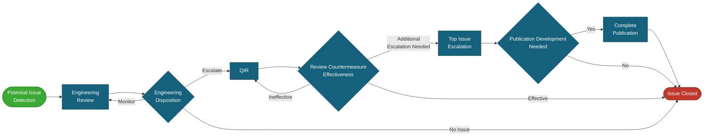
```mermaid
flowchart LR
    START(["Potential Issue<br/>Detection"]):::startNode
    ER["Engineering<br/>Review"]:::proc
    ED{"Engineering<br/>Disposition"}:::decision
    QIR["QIR"]:::proc
    RCE{"Review Countermeasure<br/>Effectiveness"}:::decision
    TIE["Top Issue<br/>Escalation"]:::proc
    PDN{"Publication Development<br/>Needed"}:::decision
    CP["Complete<br/>Publication"]:::proc
    CLOSED(["Issue Closed"]):::endNode

    START --> ER
    ER --> ED
    ED -->|Monitor| ER
    ED -->|Escalate| QIR
    QIR --> RCE
    RCE -->|Ineffective| QIR
    RCE -->|Additional<br/>Escalation Needed| TIE
    TIE --> PDN
    PDN -->|Yes| CP
    CP --> CLOSED

    ED -->|No Issue| CLOSED
    RCE -->|Effective| CLOSED
    PDN -->|No| CLOSED

    classDef startNode fill:#3aaa35,stroke:#2c8429,color:#ffffff
    classDef proc fill:#15607a,stroke:#0f4a5e,color:#ffffff
    classDef decision fill:#15607a,stroke:#0f4a5e,color:#ffffff
    classDef endNode fill:#c0392b,stroke:#962d22,color:#ffffff
```

## 3.4. Domain/Sub-domains based microapplication identification 

**List of Microservices**

| Seq | Domain /Sub-domain Name | Domain Context | Purpose                                   |
|-----|-------------------------|----------------| ------------------------------------------|
| 1   |Issue Management         | /ism/          | To have microservice API related to issue entry, issue listing, issue edit, status life cycle, issue group, issue correlation , etc.           |
| 2   |QIR   Management         | /qir/          | To have microservice API related to QIR entry, issue to QIR, QIR count summary, manage priority, affected VIN, Linked FPQR, symptons, rca, countermeasures, etc.|
| 3   |TSB   Management         | /tsb/          | To have operations related to publication management.|
| 4   |User  Management         | /um/           | To have microservice APIs related to user & access management |
| 5   |Master data mgt.         | /mst/          | To have microservice APIs related to master data e.g. model,vehicle, etc. It may be the wrapper API over external API from SAS|
| 6   |Notification Manager     | /nm/           | To have microservice APIs related to notification manager|
| 7   |Audit & activity log     | /aal/          | To have microservice APIs related to operation like audit log, activity log, user access log, etc.|
| 8   |Document Management      | /dm/           | To have microservice APIs related to operation on document like  create document with upload, list document, etc.  |

## 3.5. PQMS System Architecture  

### 3.5.1. PQMS System Architecture (Standardized) 

**Diagram**

**Description**

| Seq | Component Name | Purpose |
|---|---|---|
| 1 | Load Balancer | Distributes incoming traffic across application instances for high availability |
| 2 | API Gateway | Single entry point for client and system-to-system calls; authentication/token validation |
| 3 | Web Server | Serves the headless SPA static assets and reverse-proxies to backend APIs |
| 4 | Queue Layer | Async message queueing (e.g. notifications, batch triggers) for decoupled processing |
| 5 | Application Layer | Backend domain services (Issue/QIR/TSB/Admin-Master) plus Camunda BPM workflow orchestration |
| 6 | Cache Layer | Serves frequently-read, rarely-changing reference/master data, reducing DB load |
| 7 | LLM Layer | (Phase 2) AI-assisted capabilities — not in Phase 1 scope |
| 8 | AI/ML Layer | (Phase 2) Auto-computed Weibull parameters, AI-assisted severity scoring, auto-drafted issues — explicitly deferred per §2.2.1 |
| 9 | Database Layer | Read-write / read-only node split for transactional vs. reporting traffic |
| 10 | Observability Layer | Metrics, traces, logs, correlation-id tracing across all backend APIs |

### 3.5.2. PQMS System Architecture (AWS) 

**Diagram**

**Network Diagram**

**Description**

| Seq | AWS Service | Purpose | Assurance for (HA & Scalability) |
|---|---|---|---|
| 1 | VPC / Security Groups / IAM | Network isolation and access control across environments | Per-environment isolation; no single shared perimeter |
| 2 | KMS | Encryption at rest, secret-key storage | Managed key rotation, no raw secrets in application |
| 3 | API Gateway | Token validation, external/system-to-system entry point | Regional multi-AZ endpoint, auto-scaling |
| 4 | CloudWatch | Metrics, traces, logs, correlation-id tracing | N/A (observability, not a runtime dependency) |
| 5 | EKS | Hosts the headless SPA backend APIs and Camunda BPM | Multi-AZ node groups, horizontal auto-scaling |
| 6 | RDS (PostgreSQL) | Read-write / read-only node split (app vs. reporting traffic) | Multi-AZ with automated failover; read-replica scaling |
| 7 | ElastiCache | Cache layer for frequently-read reference/master data | Multi-AZ replication, reduces primary DB load |
| 8 | S3 | Batch data staging (e.g. Parquet exports to CDO/Redshift) | 11-nines durability, cross-AZ by default |
| 9 | SQS | Notification payload queueing (async delivery buffer) | Managed multi-AZ, no single point of failure |
| 10 | SNS | SMS notification delivery | Managed multi-AZ, no single point of failure |
| 11 | SES | Email notification delivery | Managed multi-AZ, no single point of failure |
| 12 | Camunda BPM (on VM) | Workflow/state orchestration for issue, QIR, and publication lifecycles | Clustered deployment across multi-AZ VM node groups for HA |

**Per-Tier Redundancy for High-Availability**

| Tier | AZ Count | Redundancy Model | Failover Behavior |
|---|---|---|---|
| Load Balancer | 2+ AZs | Active-active | Automatic, no manual intervention |
| API Gateway | Regional (multi-AZ by default) | Active-active | Automatic, managed by AWS |
| Application (EKS) | 2+ AZs | Active-active node groups | Pod rescheduling on node/AZ failure |
| Database (RDS PostgreSQL) | 2 AZs | Active-standby (primary + standby) | Automatic failover to standby |
| Cache (ElastiCache) | 2+ AZs | Active-replica | Automatic promotion of replica on primary failure |
| Queue (SQS) | Regional (multi-AZ by default) | N/A (fully managed) | No customer-managed failover needed |

## 3.6. PQMS Integration Architecture

### 3.6.1. Functional Integration Architecture Diagram 

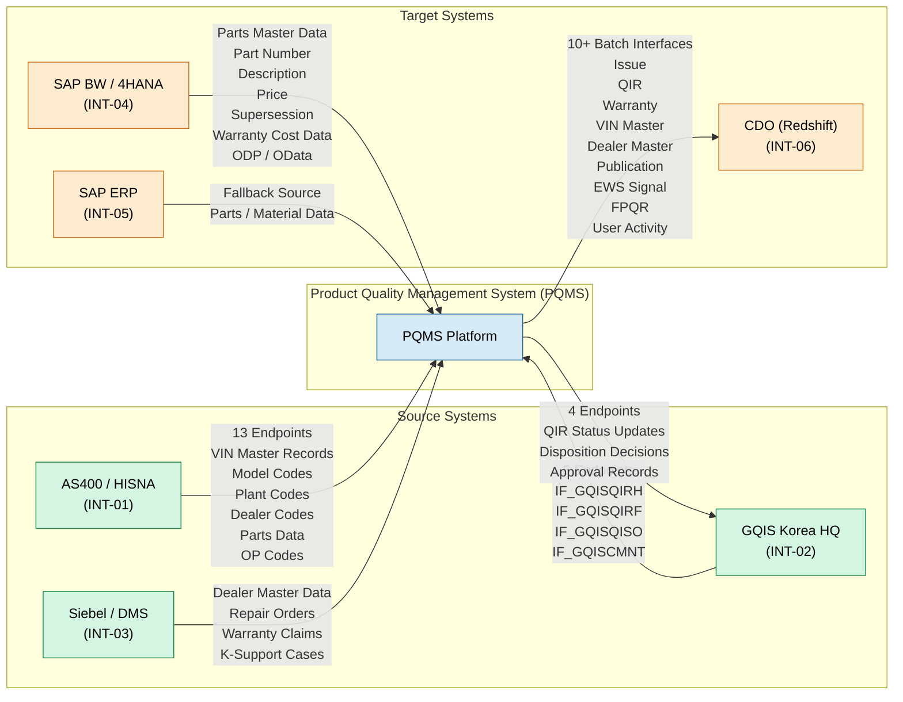
```mermaid
flowchart LR

    %% =====================================================
    %% External Systems
    %% =====================================================

    subgraph SRC["Source Systems"]
        AS400["AS400 / HISNA<br/>(INT-01)"]
        GQIS["GQIS Korea HQ<br/>(INT-02)"]
        SIEBEL["Siebel / DMS<br/>(INT-03)"]
    end

    subgraph PQMS["Product Quality Management System (PQMS)"]
        APP["PQMS Platform"]
    end

    subgraph TGT["Target Systems"]
        BW["SAP BW / 4HANA<br/>(INT-04)"]
        ERP["SAP ERP<br/>(INT-05)"]
        CDO["CDO (Redshift)<br/>(INT-06)"]
    end


    %% =====================================================
    %% Inbound Integrations
    %% =====================================================

    AS400 -->|13 Endpoints<br/>VIN Master Records<br/>Model Codes<br/>Plant Codes<br/>Dealer Codes<br/>Parts Data<br/>OP Codes| APP

    GQIS -->|5 Endpoints<br/>IF_GQISQIRH<br/>IF_GQISQIRF<br/>IF_GQISQISO<br/>IF_GQISCMNT| APP

    APP -->|4 Endpoints<br/>QIR Status Updates<br/>Disposition Decisions<br/>Approval Records| GQIS

    SIEBEL -->|Dealer Master Data<br/>Repair Orders<br/>Warranty Claims<br/>K-Support Cases| APP


    %% =====================================================
    %% Outbound Integrations
    %% =====================================================

    BW -->|Parts Master Data<br/>Part Number<br/>Description<br/>Price<br/>Supersession<br/>Warranty Cost Data<br/>ODP / OData| APP

    ERP -->|Fallback Source<br/>Parts / Material Data| APP

    APP -->|10+ Batch Interfaces<br/>Issue<br/>QIR<br/>Warranty<br/>VIN Master<br/>Dealer Master<br/>Publication<br/>EWS Signal<br/>FPQR<br/>User Activity| CDO


    %% =====================================================
    %% Styling
    %% =====================================================

    classDef source fill:#d5f5e3,stroke:#1e8449,color:#000;
    classDef pqms fill:#d6eaf8,stroke:#21618c,color:#000;
    classDef target fill:#fdebd0,stroke:#ca6f1e,color:#000;

    class AS400,GQIS,SIEBEL source;
    class APP pqms;
    class BW,ERP,CDO target;
```

### 3.6.2. Integration List

|	Seq	|	Source / Provider	|	Target / Consumer	|	Connectivity Type	|	Data Object Name	|	Data Parameters	|
|	--	|	--	|	--	|	--	|	--	|	--	|
|	1	|	AS400 / HISNA	|	PQMS	|	REST Adapter	|	VIN Master	|	VIN, Model Code, Model Year, Engine Code, Transmission Code, Plant Code	|
|	2	|	AS400 / HISNA	|	PQMS	|	REST Adapter	|	Model Master	|	Model Code, Model Name, Model Line, Vehicle Type	|
|	3	|	AS400 / HISNA	|	PQMS	|	REST Adapter	|	Plant Master	|	Plant Code, Plant Name, Country, Region	|
|	4	|	AS400 / HISNA	|	PQMS	|	REST Adapter	|	Dealer Master	|	Dealer Code, Dealer Name, Region, Status	|
|	5	|	AS400 / HISNA	|	PQMS	|	REST Adapter	|	Parts Master	|	Part Number, Description, Part Category, Status	|
|	6	|	AS400 / HISNA	|	PQMS	|	REST Adapter	|	Operation Code Master	|	Op Code, Op Description, Labor Time	|
|	7	|	GQIS Korea HQ	|	PQMS	|	REST API	|	QIR Header (IF_GQISQIRH)	|	QIR No, VIN, Model, Issue Type, Severity, Status	|
|	8	|	GQIS Korea HQ	|	PQMS	|	REST API	|	QIR Failure Details (IF_GQISQIRF)	|	Failure Code, Symptom Code, Cause Code	|
|	9	|	GQIS Korea HQ	|	PQMS	|	REST API	|	QIR Solution Details (IF_GQISQISO)	|	Disposition, Corrective Action, Resolution	|
|	10	|	GQIS Korea HQ	|	PQMS	|	REST API	|	QIR Comments (IF_GQISCMNT)	|	Comment ID, Author, Comment Text, Timestamp	|
|	11	|	PQMS	|	GQIS Korea HQ	|	REST API	|	QIR Status Update	|	QIR No, Status, Updated By, Updated Date	|
|	12	|	PQMS	|	GQIS Korea HQ	|	REST API	|	Disposition Decision	|	QIR No, Decision, Decision Date, Owner	|
|	13	|	PQMS	|	GQIS Korea HQ	|	REST API	|	Approval Record	|	QIR No, Approval Status, Approver, Approval Date	|
|	14	|	PQMS	|	GQIS Korea HQ	|	REST API	|	Workflow Update	|	Task Status, Workflow State, Completion Date	|
|	15	|	Siebel / DMS	|	PQMS	|	REST Adapter	|	Dealer Master	|	Dealer Code, Dealer Name, Region, Contact Person, Phone, Email	|
|	16	|	Siebel / DMS	|	PQMS	|	REST Adapter	|	Repair Orders	|	RO Number, VIN, Dealer Code, Repair Date, Op Code	|
|	17	|	Siebel / DMS	|	PQMS	|	REST Adapter	|	Warranty Claims	|	Claim No, VIN, Part Number, Claim Amount, Claim Date	|
|	18	|	Siebel / DMS	|	PQMS	|	REST Adapter	|	K-Support Cases	|	Case ID, VIN, Case Type, Issue Description, Resolution	|
|	19	|	Siebel / DMS (WPC FixedOps)	|	PQMS	|	REST API	|	Repair Orders	|	RO Number, VIN, Labor Hours, Dealer Code	|
|	20	|	Siebel / DMS (WPC FixedOps)	|	PQMS	|	REST API	|	Parts Usage	|	Part Number, Quantity, Cost, RO Number	|
|	21	|	SAP BW / 4HANA	|	PQMS	|	ODP / OData REST	|	Parts Master	|	Part Number, Description, Part Type, Price	|
|	22	|	SAP BW / 4HANA	|	PQMS	|	ODP / OData REST	|	Part Supersession	|	Old Part Number, New Part Number, Effective Date	|
|	23	|	SAP BW / 4HANA	|	PQMS	|	ODP / OData REST	|	Warranty Cost Data	|	Claim Number, Cost Amount, Cost Category, Currency	|
|	24	|	SAP ERP	|	PQMS	|	BAPI / RFC REST	|	Parts Master (Fallback)	|	Part Number, Description, Price	|
|	25	|	SAP ERP	|	PQMS	|	BAPI / RFC REST	|	Material Master (Fallback)	|	Material Number, Material Description, Material Type	|
|	26	|	PQMS	|	CDO (Redshift)	|	Batch (Parquet/S3)	|	QIR Data (QIR)	|	QIR Number, Status, Severity, Disposition	|
|	27	|	PQMS	|	CDO (Redshift)	|	Batch (Parquet/S3)	|	Warranty Claims (WARRANTY_CLAIM)	|	Claim Number, VIN, Part Number, Claim Amount	|
|	28	|	PQMS	|	CDO (Redshift)	|	Batch (Parquet/S3)	|	VIN Master (VIN_MASTER)	|	VIN, Model, Engine, Plant	|
|	29	|	PQMS	|	CDO (Redshift)	|	Batch (Parquet/S3)	|	Dealer Master (DEALER_MASTER)	|	Dealer Code, Dealer Name, Region	|
|	30	|	PQMS	|	CDO (Redshift)	|	Batch (Parquet/S3)	|	TSB Data (TSB (Publication))	|	TSB Number, Publication Type, Status	|
|	31	|	PQMS	|	CDO (Redshift)	|	Batch (Parquet/S3)	|	Issue Data (ISSUE)	|	Issue ID, Severity, Risk Score, Status	|
|	32	|	PQMS	|	CDO (Redshift)	|	Batch (Parquet/S3)	|	EWS Signals (EWS_SIGNAL)	|	Signal ID, Source, Severity, Created Date	|
|	33	|	PQMS	|	CDO (Redshift)	|	Batch (Parquet/S3)	|	FPQR Data (ISSUE_FPQR)	|	FPQR Number, VIN, Issue Type, Status	|
|	34	|	PQMS	|	CDO (Redshift)	|	Batch (Parquet/S3)	|	User Activity (T_USER_ACTIVITY)	|	User ID, Action Type, Screen Name, Timestamp	|

### 3.6.3. Technical Integration Architecture Diagram 

---

## 3.7. Technology Stack
 
This section defines the high-level technology stack for N-PQMS, aligned to the RFP-recommended stack and the architecture principles in §3.1 (API-first, headless SPA, cache layer, read-write/read-only DB split, decoupled architecture).
 
### 3.7.1. Development
 
#### 3.7.1.1. Frontend
 
| Seq | Component | Technology | Remark |
|---|---|---|---|
| 1 | Framework | Vue.js + TypeScript | SPA, headless — per Principles #12, #18 |
| 2 | State Management | Pinia | |
| 3 | Unit Testing | Vitest | Supports Principle #17 coverage target |
| 4 | Code Quality / Lint | SonarLint | |
 
#### 3.7.1.2. Backend
 
| Seq | Component | Technology | Remark |
|---|---|---|---|
| 1 | Language / Framework | Java, Spring Boot + Hibernate | Core application services |
| 2 | Scripting / Automation | Python | Batch jobs, file processing, ML/data-pipeline, For phase 2 items |
| 3 | API Contract | Swagger / OpenAPI | Per Principle #9 (API-first) |
| 4 | Workflow / BPM | Camunda | Enforces state transitions |
| 5 | Unit Testing | JUnit | Supports Principle #17 coverage target |
 
#### 3.7.1.3. Database
 
| Seq | Component | Technology | Remark |
|---|---|---|---|
| 1 | RDBMS | AWS RDS — PostgreSQL v17/18 | Read-Write + Read-Only replica nodes — Principle #14 |
| 2 | In-Memory Cache | AWS ElastiCache (Redis) | Reference/master data cache — Principle #13 |
| 3 | DB Admin Tool | pgAdmin 4 | Developer tooling |
 
### 3.7.2. Deployment
 
| Seq | Layer | Technology | Remark |
|---|---|---|---|
| 1 | Cloud Platform | AWS | |
| 2 | Compute / Container Runtime | EC2, EKS, Fargate | Containerized microservices |
| 3 | Operating System | Amazon Linux | |
| 4 | Messaging / Queue | Amazon SQS, Amazon SNS | Async processing (e.g., issue-submit queue, notification dispatch) |
| 5 | Observability | AWS CloudWatch, ELK Stack | CloudWatch is the platform-wide observability tool (§6.4) |
| 6 | CI/CD & Source Control | GitLab, Jenkins, Git, SonarQube | Build/test/quality gates — Principle #17 |
| 7 | Container Orchestration | Docker, Kubernetes | |
| 8 | Developer IDE & Tooling | Visual Studio Code, pgAdmin 4 | |
| 9 | Story / Work Management | Jira | Existing tool, reused |
| 10 | Development Acceleration | Claude | SDLC acceleration |
 
### 3.7.3. AI / ML
 
| Seq | Component | Technology | Remark |
|---|---|---|---|
| 1 | Generative AI / Foundation Models | Amazon Bedrock | Candidate enabler for Phase 2 AI-assisted severity scoring (ISM-FR-011) and other GenAI features |
| 2 | ML Model Training & Hosting | Amazon SageMaker | Candidate for predictive analytics (e.g., Weibull-based failure prediction, EWS/comeback pattern detection) |
| 3 | LLM & Orchestration | Claude, GPT-5.2, LangFlow | As a foundation for future in-app AI orchestration |

---

# 4. Data Migration Strategy

High level data migration strategy would be as follows

1) Datamodels for PQMS application will be shared with module-wise design artifacts. Datamodel for issue-management and supporting modules like user-management, notification-manager or so, are being shared with ISM (issue management) design artifacts.
2) PQMS application has two types of database entities
   1) Reference master data which will not change on daily basis e.g. source-system, model, vehicle master and so on.
   2) Transaction data which will be captured in form of Issue, QIR or TSB.

3) Migration approach for [Reference master data]
   1) [Reference master data] data would be mandatory candidates of data-migration
   2) Eligible DB entities under [Reference master data] being identified for each module.
   3) Team will collect information of identified master DB entities on Legacy system
   4) Team shall analysis and prepare migration script to move data from legacy to N-PQMS and from older structure into new structure.

4) Migration approach for [Transaction data]
   1) Issue, QIR & TSB are esample of Transaction data
   2) Once requirement and design approach for all modules are aligned
      1) [Transaction DB entities] would be assessed
      2) Amount of data, source of data, data-redundancy, data-enrichment, and other migration perspective shall be aligned.
   3) Team will collect information of identified transaction DB entities on Legacy system
   4) Team shall analysis and prepare migration script to move data from legacy to N-PQMS and from older structure into new structure.

5) Key notes
   1) Automation of migration-script shall be assessed based on amount of migration data.
   2) Need of STAGE DB shall be assessed after data analysis as N-PQMS data need and business expectation.
   3) Strategy to migrate data on PROD environment shall be assessed after all module understanding
   4) Cutover checklist shall be prepared for smooth data migration and legacy to N-PQMS system cutover.

5) Open Item / Query
   1) Migration expectation
      1) Is it needed to migrate all transaction data? or N-PQMS start with just fresh transactional data and required master data.
      2) If all transactional data is migrated into N-PQMS, is it safe to assume that N-PQMS database will not have any garbage data?

   2) Strategy on INFLIGHT order (Issue, QIR, TSB)
      1) Option-1 : Migration all date prior to cutover and delta on/before cutover day
      2) Option-2 : Entire data migration in an outage window on the day of cutover

   3) Post cutover scenario
      1) Option - 1 : Parallel Run i.e. both systems are running in parallel.
      2) Option - 2 : Legacy is stopped and N-PQMS will takeover
      3) Strategcy to opt between option-1 and option-2 will be decided collectively.

---

# 5. Performance Strategy

This section describes “Performance engineering approach” of “N-PQMS” application which shall include
   - Performance strategy
   - Target KPIs
   - Handling of high throughput
   - Scalability of technical layer
   - Test data readiness strategy
   - Performance test (PT) execution
   - PT result analysis
   - Tuning of relevant parameters & application-based PT result analysis

While defining the [Performance strategy], the following activities would be aligned.

1) Functional process identification which will contribute to high usage transactions e.g. Issue Entry, Issue List, QIR update, TSB create, TSB Edit, Report & query etc.
2) Traffic load would be identified for all processes contributing to high usage transactions e.g.20% Issue Entry, 35% Issue List, 10% QIR update, 5% TSB create, 5% TSB Edit, 25% Report & query etc.
3) “N-PQMS” application-level target traffic load would be arrived by accumulation of process level traffic loads.
4) Different types of performance test i.e. Stress test, Load test, Soak test, Spike test would be planned in term of available time slot, human resources and environment
5) Test data setup strategy would be planned to include responsible owner and type of data.
6) The load script would be prepared for each function process considered in strategy, ready inout from CSV files for bulk operations.
7) Environment readiness would be planned, before planned PT execution which may require log file cleansing, removing previous test data, date range check etc.
8) Execution schedule would be planned considering PT execution duration, resources availability and business hours.
9) Assumption: Performance benchmark which will be discovered via multiple PT execution rounds, will be benchmark for “N-PQMS”, however some resources like external system & network calls with them (e.g. GQIS, AS400, etc.) which are not in N-PQMS control, so discovered benchmark would not be true “performance benchmark” of “N-PQMS” application.

---

# 6. Environment Strategy
 
This section describes the environment strategy for the PQMS IT platform. The platform uses **seven environments** — five non-production environments, one CI/CD setup, and one production environment.
 

*Figure : PQMS Environment Strategy (Non-Prod, CI/CD Infra, Production).*  

**Availability & Cost**
 
The Production environment is always active, while non-production environments can run with availability lower than 24 x 7 (for example, ~16 hours on weekdays, or only when needed):
 
1. **Production** — 24 x 7
2. **Development** — 24 x 7 or less
3. **SIT, UAT, PT, Pre-prod** — On-demand
4. **CI/CD Infra** — On-demand / business hours
Because the platform is cloud-hosted, environment cost is incurred only while an environment is powered **ON** — so on-demand environments are billed only for the time they run.
 
**Security Posture**
 
The Production environment is the most secure and highly available environment and must satisfy **all** mandatory security and compliance controls.
 
Non-production environments may operate with **relaxed** controls to reduce cost and effort — for example, full high-availability and some hardening may be waived. However, controls are relaxed, **not removed**: authentication and access control remain enabled in every environment, and non-production environments must **not** hold unmasked production or CII/PII data (such data must be masked or synthesized).
 
**CI/CD Infrastructure**
 
The CI/CD environment can be set up in one of two ways:
 
- **Cloud-agnostic tooling** — GitHub (code repository), Jenkins (build & deploy), and supporting tools such as Maven, SonarQube, JUnit and Veracode.
- **AWS-native services** — CodeCommit, CodeBuild, CodePipeline and CodeDeploy.
For PQMS, **AWS-managed CI/CD infrastructure is the recommended approach**.
 
**Multiple Environments**
 
The need for separate environments follows from the fundamental SDLC process:
 
1. **Development** : For any business requirement, code is written or changed, configuration is added/changed, and database scripts are written/changed. All these changes must be verified before hand-off to the testing team, so the **Development environment** is used for the developer's unit testing.
2. **SIT** : Once development code is ready, it is deployed to the **test (non-production) environments** and validated by different stakeholders so that issues are caught before reaching live customers on Production. First, the post-unit-test changes are tested by the QA team for end-to-end functionality and correct integration/data exchange with peripheral systems, so the **SIT environment** is used for functional testing before business acceptance.
3. **UAT** : After functional testing and once SIT defects are resolved to the agreed limit, the changes are deployed to the **UAT environment** and offered to business users with support from the QA team and Product Owners. This is also called **CVT (Customer Validation Test)**.
4. **PT** : A **Performance Test** validates that the application is robust and scalable on the target Production sizing and can absorb spikes in traffic. See the *Performance Engineering* section for detail.
5. **Pre-prod** : A production-like environment used for final staging, release validation and go-live (cutover) rehearsal before promoting changes to Production.
6. **Production** : Once UAT sign-off is received (and Pre-prod validation is complete), the application changes are deployed to the **Production environment**.

*Figure : Testing & Deployment Strategy: environment, test phase and owning team.*

# 7. Security & NFR

## 7.1. Security Guidelines

| Seq | Security Type | Description | Realization |
|---|---|---|---|
| 1 | Infrastructure-level security | AWS VPC, Security Groups, IAM/RAM isolate PQMS infra (app tier, DB, cache, queue, Camunda) per environment. | AWS native controls (VPC, IAM, KMS). |
| 2 | Application-level security | PQMS is fully authenticated — no public or guest access. Internal users (QE/TE/ASM/PQM/DE/Director/Admin) and external users (Dealer, cross-org, partner systems) all authenticate before access. Access scope resolved via Role → Feature → Feature-Element mapping (already modeled: ROLE, FEATURE, FEATURE_ELEMENT, USER_ROLE_MAP, ROLE_FEATURE_MAP). | SSO / enterprise IdP (OAuth2/OIDC) per Architecture Principle #16. |
| 3 | Access tokens | User tokens for UI sessions (role/feature scoped, issued post-SSO). System tokens for machine-to-machine calls from integrated systems (AS400/HISNA, GQIS, Siebel, SAP BW/ERP, CDO) via client-credential / mTLS — no end-user credential involved. | IdP (OAuth2/OIDC) + API Gateway token validation. |
| 4 | Data at rest | DB accessed only via managed connector, never embedded credentials. PII (user contact info, dealer/field-engineer names) encrypted at rest, masked in logs/observability. Sensitive fields (e.g. severity override, justification) restricted by role, not just by screen. | Encryption at rest (KMS) + role-based field exposure. |
| 5 | Secure environment access | Prod / non-prod / CI-CD environments restricted to authorized accounts; no direct prod DB access outside the pipeline. | AWS account/IAM-based environment segregation. |
| 6 | Safe coding & deployment | CI/CD enforces review, static scan, and test-coverage gates (Principle #17: 100% unit test / 90% code quality) before promotion. | CI/CD pipeline with quality gates. |
| 7 | Secrets & key management | All secret keys shall be managed via ConfigMap; actual key material stored in AWS KMS and AWS Secrets Manager, application never holds raw secrets. Keys and secrets are rotated on a 90-day automatic cycle. | AWS KMS + AWS Secrets Manager + ConfigMap-based secret references, 90-day rotation policy. |

**OWASP Compliance : Key Control Mapping**

| OWASP 2021 Category | PQMS Control |
|---|---|
| A01 Broken Access Control | Role > Feature > Feature-Element RBAC model |
| A02 Cryptographic Failures | Encryption at rest (KMS), TLS in transit |
| A03 Injection | Parameterized queries/ORM, input validation, CI/CD static scan gates |
| A04 Insecure Design | API-First and Security-First architecture principles |
| A05 Security Misconfiguration | Environment segregation, CI/CD quality gates |
| A06 Vulnerable & Outdated Components | CI/CD dependency/static scanning |
| A07 Identification & Authentication Failures | SSO/OAuth2/OIDC/MFA delegated to Azure AD |
| A08 Software & Data Integrity Failures | CI/CD signed builds, ACTIVITY_LOG/AUDIT_LOG tamper-evident trail |
| A09 Security Logging & Monitoring Failures | CloudWatch observability + Activity/Audit Log |
| A10 Server-Side Request Forgery (SSRF) | Outbound integration calls (AS400/GQIS/Siebel/SAP/CDO) target fixed, hardcoded endpoints only — no user- or payload-supplied URL is ever used to construct an outbound request. Egress restricted via Security Groups/Network-Access-Control-list(NACLs) to known integration endpoints. IMDSv2 (hop-limit=1) enforced on EKS/EC2 nodes to prevent metadata-service credential theft. |

**About IMDv2 & IMDv1**
Every AWS EC2/EKS server can query a special internal-only address, 169.254.169.254, called the Instance Metadata Service (IMDS) — it hands out useful info about the machine, including temporary AWS credentials for whatever IAM role the server is running as.

1) IMDSv1 (the older version) will answer that query from anywhere that can reach it — including, critically, from a request that's been forwarded/proxied by the vulnerable server itself. This is a classic real-world SSRF payoff: trick the server into fetching http://169.254.169.254/... on the attacker's behalf, and you walk away with the server's AWS credentials.

2) IMDSv2 requires an extra secret token step before it'll answer, and — this is the key part — that token exchange is tied to a hop-limit. Setting hop-limit=1 means the request must originate directly from the instance itself, with zero network hops/proxying in between. A forwarded/proxied SSRF request has already used up that one hop, so IMDSv2 refuses to respond to it.

Net effect: even if an SSRF bug let an attacker make the server fetch an arbitrary internal URL, they can't use it to steal the server's cloud credentials via the metadata service.

## 7.2. External User Authentication & Authorization

PQMS has no consumer-facing surface. "External" covers Dealer users, cross-org (non-KUS) read-only users (per ISM-FR-080/081), and partner-system service accounts (GQIS, AS400, Siebel, SAP, CDO).

- Human external users authenticate through the same SSO/IdP as internal users; visibility is governed by role, not a separate access model (e.g., cross-org defaults to read-only).
- System-to-system integrations authenticate via service tokens (OAuth2 client-credentials / mTLS) at the API Gateway — never user credentials.
- No anonymous or unauthenticated link-based access pattern exists in PQMS.

## 7.3. Employee (Internal) User Authentication & Authorization

Internal roles per Role master: QE, TE, ASM, PQM, DE, Admin.

- SSO-based login, MFA-enabled, per Architecture Principle #16.
- Authorization resolved via the existing Role → Feature → Feature-Element model (ROLE, FEATURE, FEATURE_ELEMENT, ROLE_FEATURE_MAP, USER_ROLE_MAP) — no separate authorization engine required.
- Role assignments support optional expiry; deactivation is handled by a scheduled job (ref. §6.2.4/6.2.5).

## 7.4. Non-Functional Requirements (NFR)

| Seq | NFR | Description | Realization |
|---|---|---|---|
| 1 | Observability | Metrics, traces, and logs across all backend APIs, correlated by a co-relation-id per request. | AWS CloudWatch. |
| 2 | Activity & Audit Log | Already modeled as first-class entities (ACTIVITY_LOG / ACTIVITY_LOG_RULE, AUDIT_LOG / AUDIT_LOG_RULE) — polymorphic by entity type, predefined attributes only (not full field-diff). | Native DB design + CloudWatch for operational logs. |
| 3 | Authentication & Authorization | Covered under Sections 2 & 3 above. | SSO/IdP + role-scoped JWT. |
| 4 | Generic reusable capability | Cross-module capabilities are built once and reused — e.g. the Notification Engine Framework (§7.2) serves all trigger scenarios (issue created, escalation, publication approval, etc.) rather than one-off notification logic per module. | Solution design decision at implementation. |
| 5 | CI/CD & DevOps | Automated build, test-gate, and deployment pipeline. | CI/CD tooling. |
| 6 | Secure data access (wire & rest) | Data in transit over TLS; PII/CII masked in logs; sensitive fields exposed per role, not by default. | Design-time data classification + encryption. |
| 7 | Robustness, Scalability, High Availability | Already defined under Architecture Principles §2.1 (#1–#3); this section inherits those, no separate definition needed here. | AWS multi-AZ, clustering, horizontal scaling. |

## 7.5. Volumetric 

**Current volume**

- User base : 100 (~50-70 internal KUS users + ~30-50 external users)
- Transaction per year : 10,000

**Projection by 10% YoY growth (standard)**
**Table - 1**
|Volume Type        | YoY %  | Year 1 | Year 2  | Year 3 | Year 4 | Year 5 |
|-------------------|--------|--------|-------- |--------|--------|--------|
|User base	        |10%	 |100	  |110	    |121	 |133	  |146     |
|Transaction Count	|10%	 |10000	  |11000    |12100	 |13310	  |14641   |

**Projection by 15% YoY growth (standard)**
**Table - 2**
|Volume Type        | YoY %  | Year 1 | Year 2  | Year 3 | Year 4 | Year 5 |
|-------------------|--------|--------|-------- |--------|--------|--------|
|User base	        |15%	 |100	  |115	    |127	 |139	  |153     |
|Transaction Count	|15%	 |10000	  |11500	|12650	 |13915	  |15307   |

---

# 8. Appendix

None
---

# SECTION 2: ISM MODULE FUNCTIONAL DESIGN

---

# 1. Table of Contents

- [1. Table of Contents](#1-table-of-contents)
- [2. Introduction : Function Design](#2-introduction--function-design)
  - [2.1. Reference document](#21-reference-document)
- [3. Module : Issue Management](#3-module--issue-management)
  - [3.1. Preread](#31-preread)
    - [3.1.1. Overview](#311-overview)
    - [3.1.2. Issue Management Process Flow](#312-issue-management-process-flow)
    - [3.1.3. Issue Source Channel Flows](#313-issue-source-channel-flows)
    - [3.1.4. High Level ER Diagram](#314-high-level-er-diagram)
    - [3.1.5. Issue Status Lifecycle](#315-issue-status-lifecycle)
  - [3.2. Issue Management System Functions](#32-issue-management-system-functions)
    - [3.2.1. Potential Issue Detection (Module: NA, UI-ID: NA, DONE)](#321-potential-issue-detection-module-na-ui-id-na-done)
    - [3.2.2. ISM0310 - Potential Issue Loading (Module: ISM, DONE)](#322-ism0310---potential-issue-loading-module-ism-done)
      - [3.2.2.1. Purpose](#3221-purpose)
      - [3.2.2.2. Requirement Traceability](#3222-requirement-traceability)
      - [3.2.2.3. Navigation \& Prototype reference](#3223-navigation--prototype-reference)
      - [3.2.2.4. Solution Approach](#3224-solution-approach)
        - [3.2.2.4.1. Design Description](#32241-design-description)
        - [3.2.2.4.2. Design Notes](#32242-design-notes)
        - [3.2.2.4.3. Actor](#32243-actor)
        - [3.2.2.4.4. Sequence Flow](#32244-sequence-flow)
        - [3.2.2.4.5. Frontend](#32245-frontend)
        - [3.2.2.4.6. Backend](#32246-backend)
        - [3.2.2.4.7. Database](#32247-database)
      - [3.2.2.5. Notes, Issue \& Assumption](#3225-notes-issue--assumption)
    - [3.2.3. ISM0020 - Issue Entry (Module: ISM, DONE)](#323-ism0020---issue-entry-module-ism-done)
      - [3.2.3.1. Purpose](#3231-purpose)
      - [3.2.3.2. Requirement Traceability](#3232-requirement-traceability)
      - [3.2.3.3. Navigation \& Prototype reference](#3233-navigation--prototype-reference)
      - [3.2.3.4. Solution Approach](#3234-solution-approach)
        - [3.2.3.4.1. Design Description](#32341-design-description)
        - [3.2.3.4.2. Design Notes](#32342-design-notes)
        - [3.2.3.4.3. Actor](#32343-actor)
        - [3.2.3.4.4. Sequence Flow](#32344-sequence-flow)
        - [3.2.3.4.5. Frontend](#32345-frontend)
        - [3.2.3.4.6. Backend](#32346-backend)
        - [3.2.3.4.7. Database](#32347-database)
      - [3.2.3.5. Notes, Issue \& Assumption](#3235-notes-issue--assumption)
    - [3.2.4. ISM0010 - Issue Listing (Module: ISM, DONE)](#324-ism0010---issue-listing-module-ism-done)
      - [3.2.4.1. Purpose](#3241-purpose)
      - [3.2.4.2. Requirement Traceability](#3242-requirement-traceability)
      - [3.2.4.3. Navigation \& Prototype reference](#3243-navigation--prototype-reference)
      - [3.2.4.4. Solution Approach](#3244-solution-approach)
        - [3.2.4.4.1. Design Description](#32441-design-description)
        - [3.2.4.4.2. Design Notes](#32442-design-notes)
        - [3.2.4.4.3. Actor](#32443-actor)
        - [3.2.4.4.4. Sequence Flow](#32444-sequence-flow)
        - [3.2.4.4.5. Frontend](#32445-frontend)
        - [3.2.4.4.6. Backend](#32446-backend)
        - [3.2.4.4.7. Database](#32447-database)
      - [3.2.4.5. Notes, Issue \& Assumption](#3245-notes-issue--assumption)
    - [3.2.5. ISM0040 - Issue Workspace (Detail/Edit) (Module: ISM, DONE)](#325-ism0040---issue-workspace-detailedit-module-ism-done)
      - [3.2.5.1. Purpose](#3251-purpose)
      - [3.2.5.2. Requirement Traceability](#3252-requirement-traceability)
      - [3.2.5.3. Navigation \& Prototype reference](#3253-navigation--prototype-reference)
      - [3.2.5.4. Solution Approach](#3254-solution-approach)
        - [3.2.5.4.1. Design Description](#32541-design-description)
        - [3.2.5.4.2. Design Notes](#32542-design-notes)
        - [3.2.5.4.3. Actor](#32543-actor)
        - [3.2.5.4.4. Sequence Flow](#32544-sequence-flow)
        - [3.2.5.4.5. Frontend](#32545-frontend)
        - [3.2.5.4.6. Backend](#32546-backend)
        - [3.2.5.4.7. Database](#32547-database)
      - [3.2.5.5. Notes, Issue \& Assumption](#3255-notes-issue--assumption)
    - [3.2.6. ISM0030 - Issue Score (Module: ISM, DONE)](#326-ism0030---issue-score-module-ism-done)
      - [3.2.6.1. Purpose](#3261-purpose)
      - [3.2.6.2. Requirement Traceability](#3262-requirement-traceability)
      - [3.2.6.3. Navigation \& Prototype reference](#3263-navigation--prototype-reference)
      - [3.2.6.4. Solution Approach](#3264-solution-approach)
        - [3.2.6.4.1. Design Description](#32641-design-description)
        - [3.2.6.4.2. Design Notes](#32642-design-notes)
        - [3.2.6.4.3. Actor](#32643-actor)
        - [3.2.6.4.4. Sequence Flow](#32644-sequence-flow)
        - [3.2.6.4.5. Frontend](#32645-frontend)
        - [3.2.6.4.6. Backend](#32646-backend)
        - [3.2.6.4.7. Database](#32647-database)
      - [3.2.6.5. Notes, Issue \& Assumption](#3265-notes-issue--assumption)
    - [3.2.7. ISM0330 - Manage Issue Group (Module: ISM, DONE)](#327-ism0330---manage-issue-group-module-ism-done)
      - [3.2.7.1. Purpose](#3271-purpose)
      - [3.2.7.2. Requirement Traceability](#3272-requirement-traceability)
      - [3.2.7.3. Navigation \& Prototype reference](#3273-navigation--prototype-reference)
      - [3.2.7.4. Solution Approach](#3274-solution-approach)
        - [3.2.7.4.1. Design Description](#32741-design-description)
        - [3.2.7.4.2. Design Notes](#32742-design-notes)
        - [3.2.7.4.3. Actor](#32743-actor)
        - [3.2.7.4.4. Sequence Flow](#32744-sequence-flow)
        - [3.2.7.4.5. Frontend](#32745-frontend)
        - [3.2.7.4.6. Backend](#32746-backend)
        - [3.2.7.4.7. Database](#32747-database)
      - [3.2.7.5. Notes, Issue \& Assumption](#3275-notes-issue--assumption)
    - [3.2.8. JOB0100 - Issue Correlation Realtime or Batch job](#328-job0100---issue-correlation-realtime-or-batch-job)
    - [3.2.9. ISM0070 - Manage Issue Lifecycle (Module: ISM, DONE)](#329-ism0070---manage-issue-lifecycle-module-ism-done)
      - [3.2.9.1. Purpose](#3291-purpose)
      - [3.2.9.2. Requirement Traceability](#3292-requirement-traceability)
      - [3.2.9.3. Navigation \& Prototype reference](#3293-navigation--prototype-reference)
      - [3.2.9.4. Solution Approach](#3294-solution-approach)
        - [3.2.9.4.1. Design Description](#32941-design-description)
        - [3.2.9.4.2. Design Notes](#32942-design-notes)
        - [3.2.9.4.3. Actor](#32943-actor)
        - [3.2.9.4.4. Sequence Flow](#32944-sequence-flow)
        - [3.2.9.4.5. Frontend](#32945-frontend)
        - [3.2.9.4.6. Backend](#32946-backend)
        - [3.2.9.4.7. Database](#32947-database)
      - [3.2.9.5. Notes, Issue \& Assumption](#3295-notes-issue--assumption)
    - [3.2.10. ISM0350 - Re/Assign Engineer (Module: ISM, DONE/Hold)](#3210-ism0350---reassign-engineer-module-ism-donehold)
      - [3.2.10.1. Purpose](#32101-purpose)
      - [3.2.10.2. Requirement Traceability](#32102-requirement-traceability)
      - [3.2.10.3. Navigation \& Prototype reference](#32103-navigation--prototype-reference)
      - [3.2.10.4. Solution Approach](#32104-solution-approach)
        - [3.2.10.4.1. Design Description](#321041-design-description)
        - [3.2.10.4.2. Design Notes](#321042-design-notes)
        - [3.2.10.4.3. Actor](#321043-actor)
        - [3.2.10.4.4. Sequence Flow](#321044-sequence-flow)
        - [3.2.10.4.5. Frontend](#321045-frontend)
        - [3.2.10.4.6. Backend](#321046-backend)
        - [3.2.10.4.7. Database](#321047-database)
      - [3.2.10.5. Notes, Issue \& Assumption](#32105-notes-issue--assumption)
    - [3.2.11. ISM0090 - Manage Parts Request (Module: ISM, DONE)](#3211-ism0090---manage-parts-request-module-ism-done)
      - [3.2.11.1. Purpose](#32111-purpose)
      - [3.2.11.2. Requirement Traceability](#32112-requirement-traceability)
      - [3.2.11.3. Navigation \& Prototype reference](#32113-navigation--prototype-reference)
      - [3.2.11.4. Solution Approach](#32114-solution-approach)
        - [3.2.11.4.1. Design Description](#321141-design-description)
        - [3.2.11.4.2. Design Notes](#321142-design-notes)
        - [3.2.11.4.3. Actor](#321143-actor)
        - [3.2.11.4.4. Sequence Flow](#321144-sequence-flow)
        - [3.2.11.4.5. Frontend](#321145-frontend)
        - [3.2.11.4.6. Backend](#321146-backend)
        - [3.2.11.4.7. Database](#321147-database)
      - [3.2.11.5. Notes, Issue \& Assumption](#32115-notes-issue--assumption)
    - [3.2.12. ISM0100 - Communication Log (Module: ISM, DONE)](#3212-ism0100---communication-log-module-ism-done)
      - [3.2.12.1. Purpose](#32121-purpose)
      - [3.2.12.2. Requirement Traceability](#32122-requirement-traceability)
      - [3.2.12.3. Navigation \& Prototype reference](#32123-navigation--prototype-reference)
      - [3.2.12.4. Solution Approach](#32124-solution-approach)
        - [3.2.12.4.1. Design Description](#321241-design-description)
        - [3.2.12.4.2. Design Notes](#321242-design-notes)
        - [3.2.12.4.3. Actor](#321243-actor)
        - [3.2.12.4.4. Sequence Flow](#321244-sequence-flow)
        - [3.2.12.4.5. Frontend](#321245-frontend)
        - [3.2.12.4.6. Backend](#321246-backend)
        - [3.2.12.4.7. Database](#321247-database)
      - [3.2.12.5. Notes, Issue \& Assumption](#32125-notes-issue--assumption)
    - [3.2.13. Issue Hierarchy Management (Cross-cutting, AR#1)](#3213-issue-hierarchy-management-cross-cutting-ar1)
      - [3.2.13.1. Purpose](#32131-purpose)
      - [3.2.13.2. Design Description](#32132-design-description)
      - [3.2.13.3. Impacted Functions](#32133-impacted-functions)
      - [3.2.13.4. Database](#32134-database)
      - [3.2.13.5. Notes, Issue \& Assumption](#32135-notes-issue--assumption)
    - [3.2.14. Issue Reopen (Soft-Close Lifecycle, AR#2)](#3214-issue-reopen-soft-close-lifecycle-ar2)
      - [3.2.14.1. Purpose](#32141-purpose)
      - [3.2.14.2. Design Description](#32142-design-description)
      - [3.2.14.3. Impacted Functions](#32143-impacted-functions)
      - [3.2.14.4. Database](#32144-database)
      - [3.2.14.5. Notes, Issue \& Assumption](#32145-notes-issue--assumption)
  - [3.3. PQMS Overview (Dashboard)](#33-pqms-overview-dashboard)
    - [3.3.1. PQMS Overview (Dashboard) (Module : ISM, DONE)](#331-pqms-overview-dashboard-module--ism-done)
      - [3.3.1.1. Purpose](#3311-purpose)
      - [3.3.1.2. Requirement Traceability](#3312-requirement-traceability)
      - [3.3.1.3. Navigation \& Prototype reference](#3313-navigation--prototype-reference)
      - [3.3.1.4. Solution Approach](#3314-solution-approach)
        - [3.3.1.4.1. Design Description](#33141-design-description)
        - [3.3.1.4.2. Design Notes](#33142-design-notes)
        - [3.3.1.4.3. Actor](#33143-actor)
        - [3.3.1.4.4. Sequence Flow](#33144-sequence-flow)
        - [3.3.1.4.5. Frontend](#33145-frontend)
        - [3.3.1.4.6. Backend](#33146-backend)
        - [3.3.1.4.7. Database](#33147-database)
      - [3.3.1.5. Notes, Issue \& Assumption](#3315-notes-issue--assumption)
- [4. Module : Admin functions \& Master Data](#4-module--admin-functions--master-data)
  - [4.1. Admin Functions](#41-admin-functions)
  - [4.2. Master Data](#42-master-data)
    - [4.2.1. ISM0200 - Manage Classification Fields (Module: Master Data, DONE)](#421-ism0200---manage-classification-fields-module-master-data-done)
      - [4.2.1.1. Purpose](#4211-purpose)
      - [4.2.1.2. Requirement Traceability](#4212-requirement-traceability)
      - [4.2.1.3. Navigation \& Prototype reference](#4213-navigation--prototype-reference)
      - [4.2.1.4. Solution Approach](#4214-solution-approach)
        - [4.2.1.4.1. Design Description](#42141-design-description)
        - [4.2.1.4.2. Design Notes](#42142-design-notes)
        - [4.2.1.4.3. Actor](#42143-actor)
        - [4.2.1.4.4. Sequence Flow](#42144-sequence-flow)
        - [4.2.1.4.5. Frontend](#42145-frontend)
        - [4.2.1.4.6. Backend](#42146-backend)
        - [4.2.1.4.7. Database](#42147-database)
      - [4.2.1.5. Notes, Issue \& Assumption](#4215-notes-issue--assumption)
    - [4.2.2. ISM0360 - Manage Model Master](#422-ism0360---manage-model-master)
      - [4.2.2.1. Purpose](#4221-purpose)
      - [4.2.2.2. Requirement Traceability](#4222-requirement-traceability)
      - [4.2.2.3. Navigation \& Prototype reference](#4223-navigation--prototype-reference)
      - [4.2.2.4. Solution Approach](#4224-solution-approach)
        - [4.2.2.4.1. Design Description](#42241-design-description)
        - [4.2.2.4.2. Design Notes](#42242-design-notes)
        - [4.2.2.4.3. Actor](#42243-actor)
        - [4.2.2.4.4. Sequence Flow](#42244-sequence-flow)
        - [4.2.2.4.5. Frontend](#42245-frontend)
        - [4.2.2.4.6. Backend](#42246-backend)
        - [4.2.2.4.7. Database](#42247-database)
      - [4.2.2.5. Notes, Issue \& Assumption](#4225-notes-issue--assumption)
    - [4.2.3. ISM0370 - Manage Valid Values](#423-ism0370---manage-valid-values)
      - [4.2.3.1. Purpose](#4231-purpose)
      - [4.2.3.2. Requirement Traceability](#4232-requirement-traceability)
      - [4.2.3.3. Navigation \& Prototype reference](#4233-navigation--prototype-reference)
      - [4.2.3.4. Solution Approach](#4234-solution-approach)
        - [4.2.3.4.1. Design Description](#42341-design-description)
        - [4.2.3.4.2. Design Notes](#42342-design-notes)
        - [4.2.3.4.3. Actor](#42343-actor)
        - [4.2.3.4.4. Sequence Flow](#42344-sequence-flow)
        - [4.2.3.4.5. Frontend](#42345-frontend)
        - [4.2.3.4.6. Backend](#42346-backend)
        - [4.2.3.4.7. Database](#42347-database)
      - [4.2.3.5. Notes, Issue \& Assumption](#4235-notes-issue--assumption)
- [5. Supporting Non-functional Modules](#5-supporting-non-functional-modules)
  - [5.1. User \& Access Management](#51-user--access-management)
    - [5.1.1. UM0010 - Manage User](#511-um0010---manage-user)
      - [5.1.1.1. Purpose](#5111-purpose)
      - [5.1.1.2. Requirement Traceability](#5112-requirement-traceability)
      - [5.1.1.3. Navigation \& Prototype reference](#5113-navigation--prototype-reference)
      - [5.1.1.4. Solution Approach](#5114-solution-approach)
        - [5.1.1.4.1. Design Description](#51141-design-description)
        - [5.1.1.4.2. Design Notes](#51142-design-notes)
        - [5.1.1.4.3. Actor](#51143-actor)
        - [5.1.1.4.4. Sequence Flow](#51144-sequence-flow)
        - [5.1.1.4.5. Frontend](#51145-frontend)
        - [5.1.1.4.6. Backend](#51146-backend)
        - [5.1.1.4.7. Database](#51147-database)
      - [5.1.1.5. Notes, Issue \& Assumption](#5115-notes-issue--assumption)
    - [5.1.2. UM0020 - Add/Remove User Role](#512-um0020---addremove-user-role)
      - [5.1.2.1. Purpose](#5121-purpose)
      - [5.1.2.2. Requirement Traceability](#5122-requirement-traceability)
      - [5.1.2.3. Navigation \& Prototype reference](#5123-navigation--prototype-reference)
      - [5.1.2.4. Solution Approach](#5124-solution-approach)
        - [5.1.2.4.1. Design Description](#51241-design-description)
        - [5.1.2.4.2. Design Notes](#51242-design-notes)
        - [5.1.2.4.3. Actor](#51243-actor)
        - [5.1.2.4.4. Sequence Flow](#51244-sequence-flow)
        - [5.1.2.4.5. Frontend](#51245-frontend)
        - [5.1.2.4.6. Backend](#51246-backend)
        - [5.1.2.4.7. Database](#51247-database)
      - [5.1.2.5. Notes, Issue \& Assumption](#5125-notes-issue--assumption)
    - [5.1.3. UM0030 - Manage Role (Master)](#513-um0030---manage-role-master)
      - [5.1.3.1. Purpose](#5131-purpose)
      - [5.1.3.2. Requirement Traceability](#5132-requirement-traceability)
      - [5.1.3.3. Navigation \& Prototype reference](#5133-navigation--prototype-reference)
      - [5.1.3.4. Solution Approach](#5134-solution-approach)
        - [5.1.3.4.1. Design Description](#51341-design-description)
        - [5.1.3.4.2. Design Notes](#51342-design-notes)
        - [5.1.3.4.3. Actor](#51343-actor)
        - [5.1.3.4.4. Sequence Flow](#51344-sequence-flow)
        - [5.1.3.4.5. Frontend](#51345-frontend)
        - [5.1.3.4.6. Backend](#51346-backend)
        - [5.1.3.4.7. Database](#51347-database)
      - [5.1.3.5. Notes, Issue \& Assumption](#5135-notes-issue--assumption)
    - [5.1.4. UM0030 - Manage User Role Expiry (Internal users, Role Deactivation Job)](#514-um0030---manage-user-role-expiry-internal-users-role-deactivation-job)
      - [5.1.4.1. Purpose](#5141-purpose)
      - [5.1.4.2. Requirement Traceability](#5142-requirement-traceability)
      - [5.1.4.3. Navigation \& Prototype reference](#5143-navigation--prototype-reference)
      - [5.1.4.4. Solution Approach](#5144-solution-approach)
        - [5.1.4.4.1. Design Description](#51441-design-description)
        - [5.1.4.4.2. Design Notes](#51442-design-notes)
        - [5.1.4.4.3. Actor](#51443-actor)
        - [5.1.4.4.4. Sequence Flow](#51444-sequence-flow)
        - [5.1.4.4.5. Frontend](#51445-frontend)
        - [5.1.4.4.6. Backend](#51446-backend)
        - [5.1.4.4.7. Database](#51447-database)
      - [5.1.4.5. Notes, Issue \& Assumption](#5145-notes-issue--assumption)
    - [5.1.5. UM0030 - Manage User Role Expiry (External users, Role Deactivation Job)](#515-um0030---manage-user-role-expiry-external-users-role-deactivation-job)
      - [5.1.5.1. Purpose](#5151-purpose)
      - [5.1.5.2. Requirement Traceability](#5152-requirement-traceability)
      - [5.1.5.3. Navigation \& Prototype reference](#5153-navigation--prototype-reference)
      - [5.1.5.4. Solution Approach](#5154-solution-approach)
        - [5.1.5.4.1. Design Description](#51541-design-description)
        - [5.1.5.4.2. Design Notes](#51542-design-notes)
        - [5.1.5.4.3. Actor](#51543-actor)
        - [5.1.5.4.4. Sequence Flow](#51544-sequence-flow)
        - [5.1.5.4.5. Frontend](#51545-frontend)
        - [5.1.5.4.6. Backend](#51546-backend)
        - [5.1.5.4.7. Database](#51547-database)
      - [5.1.5.5. Notes, Issue \& Assumption](#5155-notes-issue--assumption)
    - [5.1.6. UM0040 - Manage User's Access Log](#516-um0040---manage-users-access-log)
      - [5.1.6.1. Purpose](#5161-purpose)
      - [5.1.6.2. Requirement Traceability](#5162-requirement-traceability)
      - [5.1.6.3. Navigation \& Prototype reference](#5163-navigation--prototype-reference)
      - [5.1.6.4. Solution Approach](#5164-solution-approach)
        - [5.1.6.4.1. Design Description](#51641-design-description)
        - [5.1.6.4.2. Design Notes](#51642-design-notes)
        - [5.1.6.4.3. Actor](#51643-actor)
        - [5.1.6.4.4. Sequence Flow](#51644-sequence-flow)
        - [5.1.6.4.5. Frontend](#51645-frontend)
        - [5.1.6.4.6. Backend](#51646-backend)
        - [5.1.6.4.7. Database](#51647-database)
      - [5.1.6.5. Notes, Issue \& Assumption](#5165-notes-issue--assumption)
    - [5.1.7. UM0050 - Manage Feature](#517-um0050---manage-feature)
      - [5.1.7.1. Purpose](#5171-purpose)
      - [5.1.7.2. Requirement Traceability](#5172-requirement-traceability)
      - [5.1.7.3. Navigation \& Prototype reference](#5173-navigation--prototype-reference)
      - [5.1.7.4. Solution Approach](#5174-solution-approach)
        - [5.1.7.4.1. Design Description](#51741-design-description)
        - [5.1.7.4.2. Design Notes](#51742-design-notes)
        - [5.1.7.4.3. Actor](#51743-actor)
        - [5.1.7.4.4. Sequence Flow](#51744-sequence-flow)
        - [5.1.7.4.5. Frontend](#51745-frontend)
        - [5.1.7.4.6. Backend](#51746-backend)
        - [5.1.7.4.7. Database](#51747-database)
      - [5.1.7.5. Notes, Issue \& Assumption](#5175-notes-issue--assumption)
    - [5.1.8. UM0050 - Manage Feature Element](#518-um0050---manage-feature-element)
      - [5.1.8.1. Purpose](#5181-purpose)
      - [5.1.8.2. Requirement Traceability](#5182-requirement-traceability)
      - [5.1.8.3. Navigation \& Prototype reference](#5183-navigation--prototype-reference)
      - [5.1.8.4. Solution Approach](#5184-solution-approach)
        - [5.1.8.4.1. Design Description](#51841-design-description)
        - [5.1.8.4.2. Design Notes](#51842-design-notes)
        - [5.1.8.4.3. Actor](#51843-actor)
        - [5.1.8.4.4. Sequence Flow](#51844-sequence-flow)
        - [5.1.8.4.5. Frontend](#51845-frontend)
        - [5.1.8.4.6. Backend](#51846-backend)
        - [5.1.8.4.7. Database](#51847-database)
      - [5.1.8.5. Notes, Issue \& Assumption](#5185-notes-issue--assumption)
    - [5.1.9. UM0060 - Manage Role level Features](#519-um0060---manage-role-level-features)
      - [5.1.9.1. Purpose](#5191-purpose)
      - [5.1.9.2. Requirement Traceability](#5192-requirement-traceability)
      - [5.1.9.3. Navigation \& Prototype reference](#5193-navigation--prototype-reference)
      - [5.1.9.4. Solution Approach](#5194-solution-approach)
        - [5.1.9.4.1. Design Description](#51941-design-description)
        - [5.1.9.4.2. Design Notes](#51942-design-notes)
        - [5.1.9.4.3. Actor](#51943-actor)
        - [5.1.9.4.4. Sequence Flow](#51944-sequence-flow)
        - [5.1.9.4.5. Frontend](#51945-frontend)
        - [5.1.9.4.6. Backend](#51946-backend)
        - [5.1.9.4.7. Database](#51947-database)
      - [5.1.9.5. Notes, Issue \& Assumption](#5195-notes-issue--assumption)
    - [5.1.10. UM0070 - Manage Role Level Feature Element](#5110-um0070---manage-role-level-feature-element)
      - [5.1.10.1. Purpose](#51101-purpose)
      - [5.1.10.2. Requirement Traceability](#51102-requirement-traceability)
      - [5.1.10.3. Navigation \& Prototype reference](#51103-navigation--prototype-reference)
      - [5.1.10.4. Solution Approach](#51104-solution-approach)
        - [5.1.10.4.1. Design Description](#511041-design-description)
        - [5.1.10.4.2. Design Notes](#511042-design-notes)
        - [5.1.10.4.3. Actor](#511043-actor)
        - [5.1.10.4.4. Sequence Flow](#511044-sequence-flow)
        - [5.1.10.4.5. Frontend](#511045-frontend)
        - [5.1.10.4.6. Backend](#511046-backend)
        - [5.1.10.4.7. Database](#511047-database)
      - [5.1.10.5. Notes, Issue \& Assumption](#51105-notes-issue--assumption)
    - [5.1.11. UM0010 - Manage Expert (User) Group (Module: UM, Phase2)](#5111-um0010---manage-expert-user-group-module-um-phase2)
  - [5.2. User Authentication \& Authorization](#52-user-authentication--authorization)
    - [5.2.1. Sign-in](#521-sign-in)
      - [5.2.1.1. Purpose](#5211-purpose)
      - [5.2.1.2. Requirement Traceability](#5212-requirement-traceability)
      - [5.2.1.3. Navigation \& Prototype reference](#5213-navigation--prototype-reference)
      - [5.2.1.4. Solution Approach](#5214-solution-approach)
        - [5.2.1.4.1. Design Description](#52141-design-description)
        - [5.2.1.4.2. Design Notes](#52142-design-notes)
        - [5.2.1.4.3. Actor](#52143-actor)
        - [5.2.1.4.4. Sequence Flow](#52144-sequence-flow)
        - [5.2.1.4.5. Frontend](#52145-frontend)
        - [5.2.1.4.6. Backend](#52146-backend)
        - [5.2.1.4.7. Database](#52147-database)
      - [5.2.1.5. Notes, Issue \& Assumption](#5215-notes-issue--assumption)
    - [5.2.2. Sign-out](#522-sign-out)
      - [5.2.2.1. Purpose](#5221-purpose)
      - [5.2.2.2. Requirement Traceability](#5222-requirement-traceability)
      - [5.2.2.3. Navigation \& Prototype reference](#5223-navigation--prototype-reference)
      - [5.2.2.4. Solution Approach](#5224-solution-approach)
        - [5.2.2.4.1. Design Description](#52241-design-description)
        - [5.2.2.4.2. Design Notes](#52242-design-notes)
        - [5.2.2.4.3. Actor](#52243-actor)
        - [5.2.2.4.4. Sequence Flow](#52244-sequence-flow)
        - [5.2.2.4.5. Frontend](#52245-frontend)
        - [5.2.2.4.6. Backend](#52246-backend)
        - [5.2.2.4.7. Database](#52247-database)
      - [5.2.2.5. Notes, Issue \& Assumption](#5225-notes-issue--assumption)
    - [5.2.3. Change Password](#523-change-password)
      - [5.2.3.1. Purpose](#5231-purpose)
      - [5.2.3.2. Requirement Traceability](#5232-requirement-traceability)
      - [5.2.3.3. Navigation \& Prototype reference](#5233-navigation--prototype-reference)
      - [5.2.3.4. Solution Approach](#5234-solution-approach)
        - [5.2.3.4.1. Design Description](#52341-design-description)
        - [5.2.3.4.2. Design Notes](#52342-design-notes)
        - [5.2.3.4.3. Actor](#52343-actor)
        - [5.2.3.4.4. Sequence Flow](#52344-sequence-flow)
        - [5.2.3.4.5. Frontend](#52345-frontend)
        - [5.2.3.4.6. Backend](#52346-backend)
        - [5.2.3.4.7. Database](#52347-database)
      - [5.2.3.5. Notes, Issue \& Assumption](#5235-notes-issue--assumption)
    - [5.2.4. Forgot Password](#524-forgot-password)
      - [5.2.4.1. Purpose](#5241-purpose)
      - [5.2.4.2. Requirement Traceability](#5242-requirement-traceability)
      - [5.2.4.3. Navigation \& Prototype reference](#5243-navigation--prototype-reference)
      - [5.2.4.4. Solution Approach](#5244-solution-approach)
        - [5.2.4.4.1. Design Description](#52441-design-description)
        - [5.2.4.4.2. Design Notes](#52442-design-notes)
        - [5.2.4.4.3. Actor](#52443-actor)
        - [5.2.4.4.4. Sequence Flow](#52444-sequence-flow)
        - [5.2.4.4.5. Frontend](#52445-frontend)
        - [5.2.4.4.6. Backend](#52446-backend)
        - [5.2.4.4.7. Database](#52447-database)
      - [5.2.4.5. Notes, Issue \& Assumption](#5245-notes-issue--assumption)
  - [5.3. Module : Notification Management (NM)](#53-module--notification-management-nm)
    - [5.3.1. Notification Engine Framework (Module: NM, UI\_ID: NA, DONE)](#531-notification-engine-framework-module-nm-ui_id-na-done)
      - [5.3.1.1. Purpose](#5311-purpose)
      - [5.3.1.2. Requirement Traceability](#5312-requirement-traceability)
      - [5.3.1.3. Navigation \& Prototype reference](#5313-navigation--prototype-reference)
      - [5.3.1.4. Solution Approach](#5314-solution-approach)
        - [5.3.1.4.1. Design Description](#53141-design-description)
        - [5.3.1.4.2. Design Notes](#53142-design-notes)
        - [5.3.1.4.3. Actor](#53143-actor)
        - [5.3.1.4.4. Sequence Flow](#53144-sequence-flow)
        - [5.3.1.4.5. Frontend](#53145-frontend)
        - [5.3.1.4.6. Backend](#53146-backend)
        - [5.3.1.4.7. Database](#53147-database)
      - [5.3.1.5. Notes, Issue \& Assumption](#5315-notes-issue--assumption)
    - [5.3.2. Show Notification History \& Count Summary (Module: NM, UI\_ID: NA, DONE)](#532-show-notification-history--count-summary-module-nm-ui_id-na-done)
      - [5.3.2.1. Purpose](#5321-purpose)
      - [5.3.2.2. Requirement Traceability](#5322-requirement-traceability)
      - [5.3.2.3. Navigation \& Prototype reference](#5323-navigation--prototype-reference)
      - [5.3.2.4. Solution Approach](#5324-solution-approach)
        - [5.3.2.4.1. Design Description](#53241-design-description)
        - [5.3.2.4.2. Design Notes](#53242-design-notes)
        - [5.3.2.4.3. Actor](#53243-actor)
        - [5.3.2.4.4. Sequence Flow](#53244-sequence-flow)
        - [5.3.2.4.5. Frontend](#53245-frontend)
        - [5.3.2.4.6. Backend](#53246-backend)
        - [5.3.2.4.7. Database](#53247-database)
      - [5.3.2.5. Notes, Issue \& Assumption](#5325-notes-issue--assumption)
  - [5.4. Module : Document Management](#54-module--document-management)
    - [5.4.1. DM0010 - Manage Document (Module: DM, DONE)](#541-dm0010---manage-document-module-dm-done)
      - [5.4.1.1. Purpose](#5411-purpose)
      - [5.4.1.2. Requirement Traceability](#5412-requirement-traceability)
      - [5.4.1.3. Navigation \& Prototype reference](#5413-navigation--prototype-reference)
      - [5.4.1.4. Solution Approach](#5414-solution-approach)
        - [5.4.1.4.1. Design Description](#54141-design-description)
        - [5.4.1.4.2. Design Notes](#54142-design-notes)
        - [5.4.1.4.3. Actor](#54143-actor)
        - [5.4.1.4.4. Sequence Flow](#54144-sequence-flow)
        - [5.4.1.4.5. Frontend](#54145-frontend)
        - [5.4.1.4.6. Backend](#54146-backend)
        - [5.4.1.4.7. Database](#54147-database)
      - [5.4.1.5. Notes, Issue \& Assumption](#5415-notes-issue--assumption)
- [6. NFR Summary \& API Inventory](#6-nfr-summary--api-inventory)
  - [6.1. NFR Summary](#61-nfr-summary)
  - [6.2. API Inventory](#62-api-inventory)
- [7. Appendix](#7-appendix)
  - [7.1. System Function Design Template](#71-system-function-design-template)
    - [7.1.1. Name of system functions](#711-name-of-system-functions)
      - [7.1.1.1. Purpose](#7111-purpose)
      - [7.1.1.2. Requirement Traceability](#7112-requirement-traceability)
      - [7.1.1.3. Navigation \& Prototype reference](#7113-navigation--prototype-reference)
      - [7.1.1.4. Solution Approach](#7114-solution-approach)
        - [7.1.1.4.1. Design Description](#71141-design-description)
        - [7.1.1.4.2. Design Notes](#71142-design-notes)
        - [7.1.1.4.3. Actor](#71143-actor)
        - [7.1.1.4.4. Sequence Flow](#71144-sequence-flow)
        - [7.1.1.4.5. Frontend](#71145-frontend)
        - [7.1.1.4.6. Backend](#71146-backend)
        - [7.1.1.4.7. Database](#71147-database)
      - [7.1.1.5. Notes, Issue \& Assumption](#7115-notes-issue--assumption)

---

**Module:** Issue Management (ISM)  
**Project:** KUS PQMS Re-Platform — Phase 1  
**Author:** Rajesh Verma  
**Date:** July 2026  

---

**Document Version**

| Version | Date | Author | Change remark |
|---|---|---|---|
| 0.1 | 8-July-2026 | Rajesh Verma | Design based on BRD 1.3 version |
| 0.2 | 22-July-2026 | Rajesh Verma | Design based on BRD 1.4, 1.5|
| 1.0 | 0k7-Aug-2026 | Rajesh Verma | Design based on BRD 1.6 (Issue hierarchy & Issue Reopen)|

---

# 2. Introduction : Function Design

This document describes the high-level solution approach for applicatione system-functions for [Issue Management] module.

## 2.1. Reference document

**Requirement documents**
1) Main BRD document (version 1.1)
2) ISM DRD document (version 1.0)
3) ISM BRD document (version 1.3)

**Design documents**
4) NPQMS-HLD-Part02-M2-QIR-Functional-v1.0 : (Solution design approach for required system function of QIR module)
5) NPQMS-HLD-Part02-M3-TSB-Functional-v1.0 : (Solution design approach for required system function of TSB module)

# 3. Module : Issue Management

## 3.1. Preread

### 3.1.1. Overview

### 3.1.2. Issue Management Process Flow

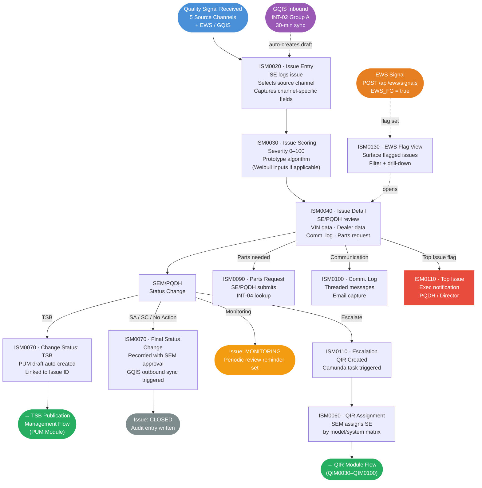
```mermaid
flowchart TD
    SIGNAL(["Quality Signal Received\n5 Source Channels\n+ EWS / GQIS"])

    SIGNAL --> ISM0020["ISM0020 · Issue Entry\nSE logs issue\nSelects source channel\nCaptures channel-specific fields"]

    ISM0020 --> ISM0030["ISM0030 · Issue Scoring\nSeverity 0–100\nPrototype algorithm\n(Weibull inputs if applicable)"]

    ISM0030 --> ISM0040["ISM0040 · Issue Detail\nSE/PQDH review\nVIN data · Dealer data\nComm. log · Parts request"]

    ISM0040 --> DISP_REVIEW["SEM/PQDH\nStatus Change"]

    DISP_REVIEW -->|TSB| ISM0070_TSB["ISM0070 · Change Status: TSB\nPUM draft auto-created\nLinked to Issue ID"]
    ISM0070_TSB --> PUM(["→ TSB Publication\nManagement Flow\n(PUM Module)"])

    DISP_REVIEW -->|SA / SC / No Action| ISM0070_FINAL["ISM0070 · Final Status Change\nRecorded with SEM approval\nGQIS outbound sync triggered"]
    ISM0070_FINAL --> CLOSED(["Issue: CLOSED\nAudit entry written"])

    DISP_REVIEW -->|Monitoring| MONITOR(["Issue: MONITORING\nPeriodic review reminder set"])

    DISP_REVIEW -->|Escalate| ISM0110["ISM0110 · Escalation\nQIR Created\nCamunda task triggered"]
    ISM0110 --> ISM0060["ISM0060 · QIR Assignment\nSEM assigns SE\nby model/system matrix"]
    ISM0060 --> QIM(["→ QIR Module Flow\n(QIM0030–QIM0100)"])

    ISM0040 -->|Parts needed| ISM0090["ISM0090 · Parts Request\nSE/PQDH submits\nINT-04 lookup"]

    ISM0040 -->|Communication| ISM0100["ISM0100 · Comm. Log\nThreaded messages\nEmail capture"]

    ISM0040 -->|Top Issue flag| ISM0110_TOP["ISM0110 · Top Issue\nExec notification\nPQDH / Director"]

    EWS_SRC(["EWS Signal\nPOST /api/ews/signals\nEWS_FG = true"]) -. "flag set" .-> ISM0130["ISM0130 · EWS Flag View\nSurface flagged issues\nFilter + drill-down"]
    ISM0130 -. "opens" .-> ISM0040

    GQIS_IN(["GQIS Inbound\nINT-02 Group A\n30-min sync"]) -. "auto-creates draft" .-> ISM0020

    style SIGNAL fill:#4A90D9,color:#fff,stroke:none
    style CLOSED fill:#7F8C8D,color:#fff,stroke:none
    style MONITOR fill:#F39C12,color:#fff,stroke:none
    style PUM fill:#27AE60,color:#fff,stroke:none
    style QIM fill:#27AE60,color:#fff,stroke:none
    style ISM0110_TOP fill:#E74C3C,color:#fff,stroke:none
    style EWS_SRC fill:#E67E22,color:#fff,stroke:none
    style GQIS_IN fill:#9B59B6,color:#fff,stroke:none
```

### 3.1.3. Issue Source Channel Flows

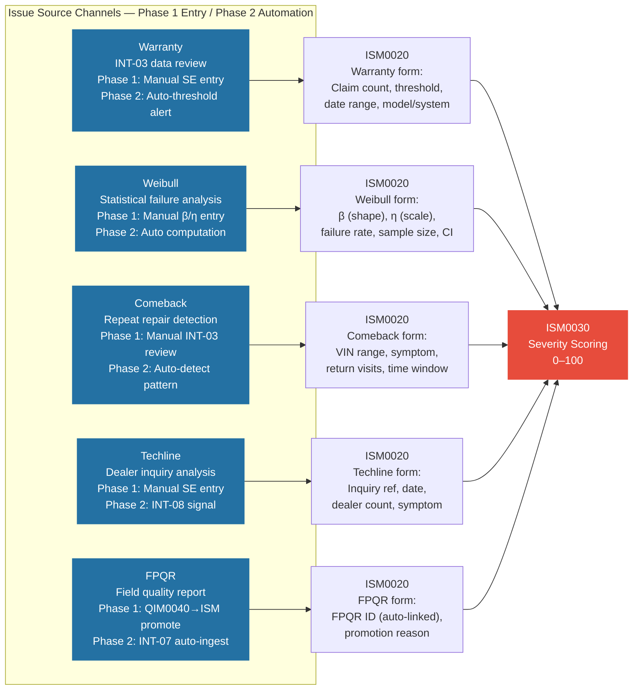
```mermaid
flowchart LR
    subgraph CHANNELS["Issue Source Channels — Phase 1 Entry / Phase 2 Automation"]
        direction TB

        W["Warranty\nINT-03 data review\nPhase 1: Manual SE entry\nPhase 2: Auto-threshold alert"]
        WB["Weibull\nStatistical failure analysis\nPhase 1: Manual β/η entry\nPhase 2: Auto computation"]
        CB["Comeback\nRepeat repair detection\nPhase 1: Manual INT-03 review\nPhase 2: Auto-detect pattern"]
        TL["Techline\nDealer inquiry analysis\nPhase 1: Manual SE entry\nPhase 2: INT-08 signal"]
        FP["FPQR\nField quality report\nPhase 1: QIM0040→ISM promote\nPhase 2: INT-07 auto-ingest"]
    end

    W --> ISM0020_W["ISM0020\nWarranty form:\nClaim count, threshold,\ndate range, model/system"]
    WB --> ISM0020_WB["ISM0020\nWeibull form:\nβ (shape), η (scale),\nfailure rate, sample size, CI"]
    CB --> ISM0020_CB["ISM0020\nComeback form:\nVIN range, symptom,\nreturn visits, time window"]
    TL --> ISM0020_TL["ISM0020\nTechline form:\nInquiry ref, date,\ndealer count, symptom"]
    FP --> ISM0020_FP["ISM0020\nFPQR form:\nFPQR ID (auto-linked),\npromotion reason"]

    ISM0020_W & ISM0020_WB & ISM0020_CB & ISM0020_TL & ISM0020_FP --> SCORE["ISM0030\nSeverity Scoring\n0–100"]

    style W fill:#2471A3,color:#fff,stroke:none
    style WB fill:#2471A3,color:#fff,stroke:none
    style CB fill:#2471A3,color:#fff,stroke:none
    style TL fill:#2471A3,color:#fff,stroke:none
    style FP fill:#2471A3,color:#fff,stroke:none
    style SCORE fill:#E74C3C,color:#fff,stroke:none
```

### 3.1.4. High Level ER Diagram

Please refer datamodel document

### 3.1.5. Issue Status Lifecycle

Please refer BRD document

---

## 3.2. Issue Management System Functions

### 3.2.1. Potential Issue Detection (Module: NA, UI-ID: NA, DONE)

Purpose : To identify potential issues at source system

**Key Feature**  

- Issue data analysis & flag as issue

Delivery phase : None (Not in PQMS scope)

**Note** : This process will happen outside PQMS

---

### 3.2.2. ISM0310 - Potential Issue Loading (Module: ISM, DONE)

#### 3.2.2.1. Purpose

To load issues via CSV files generated from various source systems (Refer : BRD Section - 7.2 Issue Source Channels); including **Key Features :**  Bulk issue loading automatic & Bulk issue loading manual.

**Delivery Phase** : Phase 2

#### 3.2.2.2. Requirement Traceability

**Main BRD 1.1 Reference**

- Chapter : 7.2 Issue Source Channels
  - ISM-FR-CH-001
  - ISM-FR-CH-002
  - ISM-FR-CH-003
  - ISM-FR-CH-004
  - ISM-FR-CH-005
  - ISM-FR-CH-006
  
- Chapter : 7.3 Issue Entry & Scoring
  - ISM-FR-001
  - ISM-FR-002
  - ISM-FR-003
  - ISM-FR-004

**ISM DRD 1.0 Reference**
- Chapter : 6. ISM0010 — Issue List

#### 3.2.2.3. Navigation & Prototype reference

**Navigation**

Issue Management > Issue Loading

**Prototype**

Reference to UX design pattern

***Recently Received New Issue File Log***

***Processed Issue File Log***

***Records from Processed Issue File Log***

#### 3.2.2.4. Solution Approach

##### 3.2.2.4.1. Design Description

The "Issue Loader" function will load issues in PQMS DB automatically via CRON job and manually from UI by authorized user

1) Potential Issues will be available in CSV file format at respective source-channel system
2) **[Auto Issue Loading]** is the process which will perfrom  
   1) Issue file polling
   2) Issue file processing (Issue data reading & loading)
  
3) **[File Poller Job]**  
   1) [File Poller Job] will poll CSV files (Potential Issues) from pre-defined source location at respective source-channel system
   2) On occurrance of any new file event at source-channel, [File Poller Job] will pick the file and place at designated target location at PQMS system
   3) TARGET_FILE_PATH = [/pqms/issuefiles/(source-channel-name)]
   4) [File Poller Job] will create a file log entry in [ISSUE_FILE_LOG DB] with [STATUS=NEW]

4) **[File Processor Job]**  
   1) [File Processor Job] will load records from [ISSUE_FILE_LOG DB entity] with [STATUS=NEW or REPUSH]
   2) [File Processor Job] will call function [processFile(issueFileWithPath)] to process CSV file mentioned in each record of [ISSUE_FILE_LOG DB entity]
   3) [File Processor Job] will read CSV file and will call [processRecord(issueFileRecord)] for each file record
   4) [File Processor Job] will load CSV file format definition of respective source-channel 
   5) [File Processor Job] will read FIRST-RECORD as HEADER record and validate with [CSV file format definition]
   6) [File Processor Job] will terminate if MISMATCH-FORMAT-DEFINITION found
   7) [File Processor Job] will manage COUNTERs for TOTAL_RECORD, PROCESSED_RECORD, SUCCESS_RECORD, FAILED_RECORD, REPUSH_COUNT
   8) [File Processor Job] will process each record one-by-one and manages COUNTERs

5) **[Process Issue File Record Function]**  
   1) [processRecord()] will parse issueFileRecord as per fromat definition
   2) [processRecord()] will apply required validation & transformation.
   3) [processRecord()] will create issue-record in [ISSUE DB entity] with [STATUS=Open]
   4) [processRecord()] will terminate in case of failure
   5) [processRecord()] will update respective COUNTERs before exiting.

6)  **[Manual Issue Loading]** is the process which will perfrom  
    1) Display files which are polled PQMS target folder from source-channels.
    2) [Manual Issue Loading] will show records from [ISSUE_FILE_LOG DB entity] for [STATUS=NEW]
    3) [Manual Issue Loading] will have provision to select multiple issue-file-records and action button [Process Issue Files] to perform issue-file-processing for selected issue files.

    4) [Manual Issue Loading] will call function [processFile(issueFileWithPath)] to process CSV file mentioned in each record of [ISSUE_FILE_LOG DB entity]
    5) [processFile(issueFileWithPath)] is common for both manual & auto issue loading.
    6) [processRecord(issueFileRecord)] is common for each file record processing in manual & auto

7)  ISSUE_FILE_LOG key DB fields : FILE_ID, FILE_TYPE (CSV), SOURCE_SYSTEM (Channels), SOURCE_PATH, TARGET_SYSTEM (PQMS), TARGET_PATH, FILE_RECEIVED_DATE, FILE_CREATE_DATE, FILE_STATUS, FILE_STATUS_DATE, FAIL_REASON_CD, TOTAL_RECORD, PROCESSED_RECORD, SUCCESS_RECORD, FAILED_RECORD, REPUSH_COUNT and AUDIT-Fields (created by & date, updated by & date)
8)  ISSUE_FILE_STATUS = NEW (at target), REPUSH (after filure is fixed), INPROGRESS, PROCESSED, FAILED, PARTIAL-PROCESSED, ARCHIVED, PURGED.
9)  ISSUE_FILE_STATUS life cycle : [NEW | REPUSH] > INPROGRESS > [PROCESSED | FAILED | PARTIAL-PROCESSED] > ARCHIVED.

##### 3.2.2.4.2. Design Notes
- TBD : Issue file archiving and Issue file & records purging
- TBD : REPUSH job is FAILED processes to be reprocessed.

##### 3.2.2.4.3. Actor

- System (CRON Scheduler) — automatic loading
- SE / SEM (authorized user) — manual loading trigger

##### 3.2.2.4.4. Sequence Flow

**Automatic Loading**

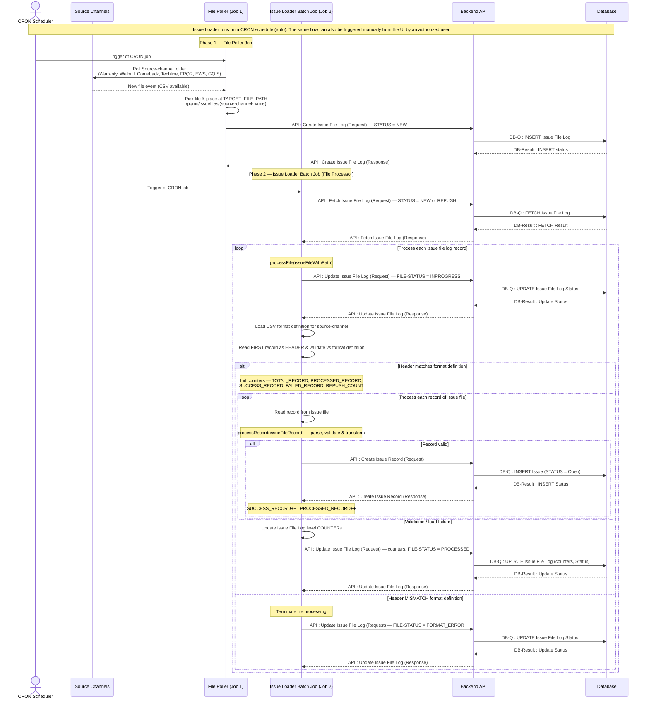
```mermaid
sequenceDiagram
    actor CRON as CRON Scheduler
    participant SRC as Source Channels
    participant Poller as File Poller (Job 1)
    participant Proc as Issue Loader Batch Job (Job 2)
    participant API as Backend API
    participant DB as Database

    note over CRON,DB: Issue Loader runs on a CRON schedule (auto). The same flow can also be triggered manually from the UI by an authorized user

    note over Poller: Phase 1 — File Poller Job
    CRON->>Poller: Trigger of CRON job
    Poller->>SRC: Poll Source-channel folder<br/>(Warranty, Weibull, Comeback, Techline, FPQR, EWS, GQIS)
    SRC-->>Poller: New file event (CSV available)
    Poller->>Poller: Pick file & place at TARGET_FILE_PATH<br/>/pqms/issuefiles/(source-channel-name)
    Poller->>API: API : Create Issue File Log (Request) — STATUS = NEW
    API->>DB: DB-Q : INSERT Issue File Log
    DB-->>API: DB-Result : INSERT status
    API-->>Poller: API : Create Issue File Log (Response)

    note over Proc: Phase 2 — Issue Loader Batch Job (File Processor)
    CRON->>Proc: Trigger of CRON job
    Proc->>API: API : Fetch Issue File Log (Request) — STATUS = NEW or REPUSH
    API->>DB: DB-Q : FETCH Issue File Log
    DB-->>API: DB-Result : FETCH Result
    API-->>Proc: API : Fetch Issue File Log (Response)

    loop Process each issue file log record
        note over Proc: processFile(issueFileWithPath)
        Proc->>API: API : Update Issue File Log (Request) — FILE-STATUS = INPROGRESS
        API->>DB: DB-Q : UPDATE Issue File Log Status
        DB-->>API: DB-Result : Update Status
        API-->>Proc: API : Update Issue File Log (Response)

        Proc->>Proc: Load CSV format definition for source-channel
        Proc->>Proc: Read FIRST record as HEADER & validate vs format definition
        alt Header matches format definition
            note over Proc: Init counters — TOTAL_RECORD, PROCESSED_RECORD,<br/>SUCCESS_RECORD, FAILED_RECORD, REPUSH_COUNT
            loop Process each record of issue file
                Proc->>Proc: Read record from issue file
                note over Proc: processRecord(issueFileRecord) — parse, validate & transform
                alt Record valid
                    Proc->>API: API : Create Issue Record (Request)
                    API->>DB: DB-Q : INSERT Issue (STATUS = Open)
                    DB-->>API: DB-Result : INSERT Status
                    API-->>Proc: API : Create Issue Record (Response)
                    note over Proc: SUCCESS_RECORD++ , PROCESSED_RECORD++
                else Validation / load failure
                    #note over Proc: FAILED_RECORD++ , PROCESSED_RECORD++<br/>(terminate this record, continue with next)
                end
            end
            Proc->>Proc: Update Issue File Log level COUNTERs
            Proc->>API: API : Update Issue File Log (Request) — counters, FILE-STATUS = PROCESSED
            API->>DB: DB-Q : UPDATE Issue File Log (counters, Status)
            DB-->>API: DB-Result : Update Status
            API-->>Proc: API : Update Issue File Log (Response)
        else Header MISMATCH format definition
            note over Proc: Terminate file processing
            Proc->>API: API : Update Issue File Log (Request) — FILE-STATUS = FORMAT_ERROR
            API->>DB: DB-Q : UPDATE Issue File Log Status
            DB-->>API: DB-Result : Update Status
            API-->>Proc: API : Update Issue File Log (Response)
        end
    end
```

**Manual Loading**

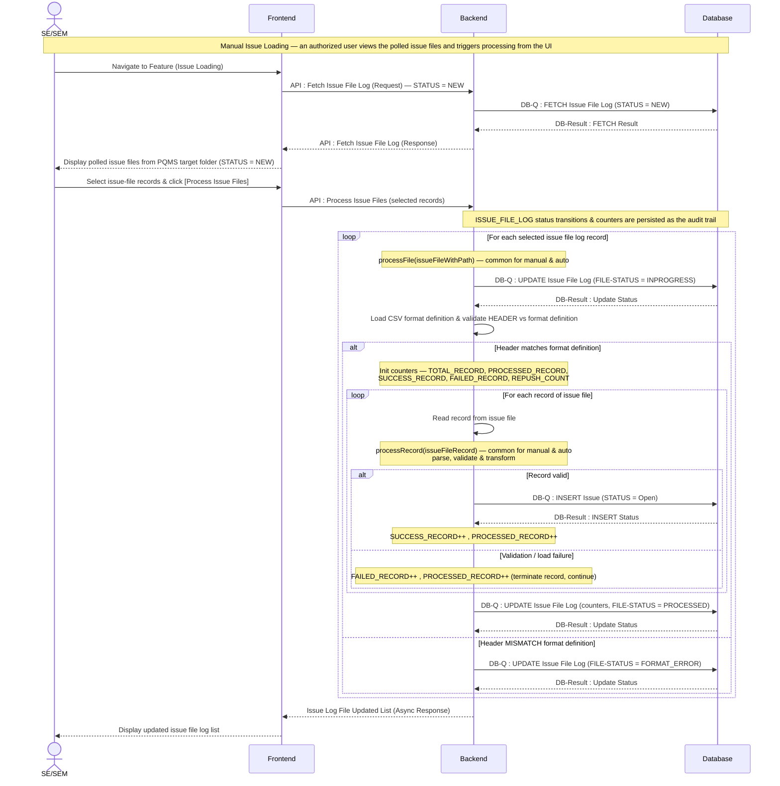
```mermaid
sequenceDiagram
    actor User as SE/SEM
    participant FE as Frontend
    participant API as Backend
    participant DB as Database

    note over User,DB: Manual Issue Loading — an authorized user views the polled issue files and triggers processing from the UI

    User->>FE: Navigate to Feature (Issue Loading)
    FE->>API: API : Fetch Issue File Log (Request) — STATUS = NEW
    API->>DB: DB-Q : FETCH Issue File Log (STATUS = NEW)
    DB-->>API: DB-Result : FETCH Result
    API-->>FE: API : Fetch Issue File Log (Response)
    FE-->>User: Display polled issue files from PQMS target folder (STATUS = NEW)

    User->>FE: Select issue-file records & click [Process Issue Files]
    FE->>API: API : Process Issue Files (selected records)
    note over API,DB: ISSUE_FILE_LOG status transitions & counters are persisted as the audit trail

    loop For each selected issue file log record
        note over API: processFile(issueFileWithPath) — common for manual & auto
        API->>DB: DB-Q : UPDATE Issue File Log (FILE-STATUS = INPROGRESS)
        DB-->>API: DB-Result : Update Status
        API->>API: Load CSV format definition & validate HEADER vs format definition
        alt Header matches format definition
            note over API: Init counters — TOTAL_RECORD, PROCESSED_RECORD,<br/>SUCCESS_RECORD, FAILED_RECORD, REPUSH_COUNT
            loop For each record of issue file
                API->>API: Read record from issue file
                note over API: processRecord(issueFileRecord) — common for manual & auto<br/>parse, validate & transform
                alt Record valid
                    API->>DB: DB-Q : INSERT Issue (STATUS = Open)
                    DB-->>API: DB-Result : INSERT Status
                    note over API: SUCCESS_RECORD++ , PROCESSED_RECORD++
                else Validation / load failure
                    note over API: FAILED_RECORD++ , PROCESSED_RECORD++ (terminate record, continue)
                end
            end
            API->>DB: DB-Q : UPDATE Issue File Log (counters, FILE-STATUS = PROCESSED)
            DB-->>API: DB-Result : Update Status
        else Header MISMATCH format definition
            API->>DB: DB-Q : UPDATE Issue File Log (FILE-STATUS = FORMAT_ERROR)
            DB-->>API: DB-Result : Update Status
        end
    end

    API-->>FE: Issue Log File Updated List (Async Response)
    FE-->>User: Display updated issue file log list
```

##### 3.2.2.4.5. Frontend

- **Recently Received New Issue File Log** grid: files with STATUS=NEW awaiting processing (File ID, Source Channel, Received Date, Status); multi-select + [Process Issue Files] action
- **Processed Issue File Log** grid: already-processed files (File ID, Source Channel, Processed Date, Status, counters — Total/Success/Failed/Repush)
- Drill-down from a processed file row shows **Records from Processed Issue File Log** (per-record status, fail reason for failed records)

##### 3.2.2.4.6. Backend

Manual & Auto Issue Loading as explained in sequence flow

- Scheduler : ISSUE-FILE-POLLER (To create issue file log in database)
- Scheduler : Issue File Processor ( To create issue record and update issue-file-log status in database)

- API : POST /ism/issuefilelog {issueFileLog} (Purpose : To create issue file log entry)
- API : GET /ism/issuefilelog {fetchCriteria} (Purpose : To fetch issue file log entries)
- API : PUT /ism/issuefilelog/{file-id} {issueFileLog} (Purpose : To update issue file log status/counters)
- API : POST /ism/issue {issue request} (Purpose : To create issue record from file — reuses ISM0020's save-issue endpoint)

##### 3.2.2.4.7. Database
- ISSUE_FILE_LOG
- ISSUE (add `source_file_id` reference to ISSUE_FILE_LOG, for load-audit traceability which issues came from which file)

#### 3.2.2.5. Notes, Issue & Assumption

- Note : Manual & Auto Issue Loading as explained in sequence flow in phase-2

---

### 3.2.3. ISM0020 - Issue Entry (Module: ISM, DONE)

#### 3.2.3.1. Purpose

To register a new issue manually by authorized users, or via automated GQIS-initiated inbound submission.

#### 3.2.3.2. Requirement Traceability

**Main BRD 1.1 Reference**

- Chapter : 7.3 Issue Entry & Scoring
  - ISM-FR-010
  - ISM-FR-011
  - ISM-FR-012
  - ISM-FR-013
  - ISM-FR-014
  - ISM-FR-041

**ISM DRD 1.0 Reference**

- Chapter : 7. ISM0020 — Issue Entry
  - 7.1 User Story
  - 7.2 Detailed Functional Requirements
  - 7.4 Mockup — ISM0020 Issue Entry (Warranty Source Selected)
  - 7.5 Mockup — ISM0020 Dynamic Panel: Weibull Source

**ISM BRD 1.3 Reference**
- Chapter : 5.1 UF-01 — Issue Entry End-to-End
- Chapter : 5.2 UF-02 — Classification & Correlation Detection (During Entry)
- Chapter : 6.1 ISM0020 — Enhanced Issue Entry (Multi-Source Adaptive Form)
- Chapter : 6.2 Vehicle Classification Hierarchy (6-Level Cascade)
- Chapter : 6.3 System Classification Keys — Searchable Combobox with Master Data
- Chapter : 6.4 Cross-Model Correlation Detection (During Issue Entry)

**ISM BRD 1.5 Reference**
- Chapter : 6.3 ISM0020 — Issue Entry
  - FR-ISM020-001 to FR-ISM020-037

#### 3.2.3.3. Navigation & Prototype reference

**Navigation**

Issue Management > New Issue

**Prototype** (Reference to UX design pattern)  

**New Issue**  

**New Classification Key (System Code)**  

#### 3.2.3.4. Solution Approach

##### 3.2.3.4.1. Design Description

The [New Issue] function will enable users to perform/work with following activities/sections

1) Issue Information
2) Diagnostic Trouble Code (DTC)
3) Vehicle Information
4) System Classification
5) Request New System Classification 
6) Same existing issues
7) Search & Link another issue
8) Register Issue

**Issue Information**

1) This section will capture [Issue Title & Description]
2) [Issue Title & Description] shall be persisted in [ISSUE DB Entity]

**Diagnostic Trouble Code (DTC)**

1) This section captures the DTC Code from dropdown.
2) User will select one or more DTC-Code from dropdown.
3) DTC-Code for dropdown will be prepopulated via API.
   1) [API : GET /master/dtc-codes (Purpose : Get the DTC Code list)]
   2) [DB Entity : DTC_CODE]

4) [DTC Code] shall be persisted in [ISSUE DB Entity], [ISSUE DB entity] will have provision to keep multiple DTC_CODEs delimited by comma
5) Color-scheme for DTC-Code : P-prefix = Powertrain (blue), B-prefix = Body (purple), C-prefix = Chassis (green), U-prefix = Network/Communication (orange). Unrecognized prefixes are rendered in grey.

**Vehicle Information**

1) This section captures **Model Code** as the primary vehicle identifier, from a searchable dropdown.
2) [Model-Code & Model Year Range] for dropdown will be prepopulated via API.
   1) [API : GET /master/models (Purpose : Get the Model list)]
   2) [DB Entity : MODEL]
3) On Model Code selection, system displays all model-years in the range for user selection.

**System Classification**

1) This section captures the Classification Keys from dropdown.
3) Classification Keys dropdown will be prepopulated via API.
   1) [API : GET /master/classificationkey/systems; 
   /master/classificationkey/{system-code}/subsystems;
   /master/classificationkey/{system-code}/{sub-system}/components;
   /master/classificationkey/{system-code}/{sub-system-code}/{component-code}/symptoms;(Purpose : To fetch system, sub-system, component, symptoms)] 
   2) [DB Entity : CLASSIFICATION_KEY]
4) Note : [System, Subsustem & Symptom code, Dealer Info] data will be collected in PQMS through integration (INT-03)

**Request New System Classification**

1) This popup captures the new Classification Keys which will pass through the approval workflow.
2) Classification Keys shall be captured via API.
   1) [API : POST /master/classificationkey/systems; 
   /master/classificationkey/{system-code}/subsystems;
   /master/classificationkey/{system-code}/{sub-system}/components;
   /master/classificationkey/{system-code}/{sub-system-code}/{component-code}/symptoms;(Purpose : To save system, sub-system, component, symptoms)] 
   2) [DB Entity : CLASSIFICATION_KEY]
3) New system-code will be submitted for approval workflow on workflow queue.  

**Similar existing issues**

1) Similar existing issues shall be fetched by API
   1) [API : POST /ism/issues {search criteria} (Purpose : To fetch issue-list by classification search-criteria)]
   2) [API : GET /ism/issue/linkedissues/suggested {issue-ref-id} (Purpose : To fetch list of suggested linked issue information)]
   2) [API : GET /ism/issue/linkedissues/approved {issue-ref-id} (Purpose : To fetch list of approved linked issue information)]
   3) DB Entity : [ISSUE, SUGGESTED_LINKED_ISSUE, LINKED_ISSUE]

**Search & Link another issue**

1) Issues can be search by other criteria to be linked.
   1) [API : POST /ism/issues {search criteria} (Purpose : To fetch issue-list by classification search-criteria)]
   2) DB Entity : [ISSUE]
   3) Search criteria for [Seach by Keywords] : [keyword-list = :value-list]

3) On-click of [Link Selected Issue], Issues shall be saved in SUGGESTED_LINKED_ISSUE via API.
   1) [API : POST /ism/issue/linkedissue/suggest {list of suggested linked issue request} (Purpose : To create entry of linked issue for apprroval)]
   2) [API : POST /ism/issue/linkedissue/approve {list of suggested linked issue request} (Purpose : To approve suggested linked issue information)]
   3) DB Entity : [ISSUE, SUGGESTED_LINKED_ISSUE, LINKED_ISSUE]

4) Note : If linked-isssues are removed, records will soft-deleted i.e. delete-flag=Y.
5) Note : Selected issues for linking will have information about link pending or linked. 

**Register Issue**

1) On-click of [Register Issue], Issues shall be registered with minimal information via API.
   1) [API : POST /ism/issue {issue request} (Purpose : To save issue information)]
   2) DB Entity : [ISSUE]

##### 3.2.3.4.2. Design Notes

   1) Auto-save capability every 5 minutes, UI will trigger [Save API : /im/issue] asynchronously so that user working on Issue UI should not be blocked.
   2) MAX-ATTACHMENT-COUNT in ConfigMap and attachement-count validation at UI / Backend on Issue Save.
   3) UI field level validation as per [DRD Section : 7.3 Field Validation Rules]
   4) Issue Identity pattern : [system code + "-" + YY + 4 digit sequence number]

##### 3.2.3.4.3. Actor

**Primary (create/edit before submit)**
SE : Service Engineer

**Post-submit edit only (with mandatory JUSTIFICATION)**
SEM : Service Engineer Manager
PQDH : PQ Department Head (also covers prior read-only review)

**Administrative**
OPSADM : Operation Admin (per Role × Feature access matrix, §6.2.9)

##### 3.2.3.4.4. Sequence Flow

```mermaid
sequenceDiagram
    actor U as User
    participant UI as New Issue (UI)
    participant ISM as ISM API
    participant MST as Master API
    participant DB as DB

    opt Login
        U->>UI: Login
        note over U,DB: User authenticated, PQMS landing page available
    end

    U->>UI: Navigate to Feature (New Issue)

    note over UI,DB: New Issue Entry

    U->>UI: Open New Issue form
    Note over UI: Auto-save timer starts (every 5 min, async)

    %% Issue Information
    U->>UI: Enter Issue Title & Description

    %% DTC
    UI->>MST: GET /master/dtc-codes
    MST->>DB: Query DTC_CODE
    DB-->>MST: DTC code list
    MST-->>UI: DTC dropdown (color-coded by prefix)
    U->>UI: Select one or more DTC Codes

    %% Vehicle Information
    UI->>MST: GET /master/models
    MST->>DB: Query MODEL
    DB-->>MST: Model list
    MST-->>UI: Model Code dropdown
    U->>UI: Select Model Code
    UI->>UI: Auto-default Model Year range
    opt Narrow range
        U->>UI: Adjust Model Year range
    end

    %% System Classification
    UI->>MST: GET /master/classificationkey/systems
    MST->>DB: Query CLASSIFICATION_KEY
    DB-->>MST: System list
    MST-->>UI: System dropdown
    U->>UI: Select System
    UI->>MST: GET /master/classificationkey/{system-code}/subsystems
    MST->>DB: Query CLASSIFICATION_KEY
    DB-->>MST: Sub-system list
    MST-->>UI: Sub-system dropdown
    U->>UI: Select Sub-system
    UI->>MST: GET /master/classificationkey/{system-code}/{sub-system}/components
    MST->>DB: Query CLASSIFICATION_KEY
    DB-->>MST: Component list
    MST-->>UI: Component dropdown
    U->>UI: Select Component
    UI->>MST: GET /master/classificationkey/{system-code}/{sub-system-code}/{component-code}/symptoms
    MST->>DB: Query CLASSIFICATION_KEY
    DB-->>MST: Symptom list
    MST-->>UI: Symptom dropdown
    U->>UI: Select Symptom

    %% Request New System
    opt Classification key not found
        U->>UI: Click "Request New System"
        UI->>MST: POST /master/classificationkey/systems (+subsystems/components/symptoms)
        MST->>DB: Insert CLASSIFICATION_KEY (pending approval)
        DB-->>MST: Ack
        MST-->>UI: Submitted for approval workflow
    end

    %% Similar existing issues
    UI->>ISM: POST /ism/issues {classification search criteria}
    ISM->>DB: Query ISSUE
    DB-->>ISM: Matching issues
    ISM-->>UI: Similar existing issues list
    UI->>ISM: GET /ism/issue/linkedissues/suggested {issue-ref-id}
    ISM->>DB: Query SUGGESTED_LINKED_ISSUE
    DB-->>ISM: Suggested linked issues
    ISM-->>UI: Suggested linked issues
    UI->>ISM: GET /ism/issue/linkedissues/approved {issue-ref-id}
    ISM->>DB: Query LINKED_ISSUE
    DB-->>ISM: Approved linked issues
    ISM-->>UI: Approved linked issues

    %% Search & Link another issue
    opt Link another issue
        U->>UI: Enter keyword(s) to search
        UI->>ISM: POST /ism/issues {keyword-list}
        ISM->>DB: Query ISSUE
        DB-->>ISM: Matching issues
        ISM-->>UI: Search results
        U->>UI: Select issue & click "Link Selected Issue"
        UI->>ISM: POST /ism/issue/linkedissue/suggest {suggested link request}
        ISM->>DB: Insert SUGGESTED_LINKED_ISSUE
        DB-->>ISM: Ack
        ISM-->>UI: Suggested link created (pending approval)
        opt Approve
            U->>UI: Approve suggested link
            UI->>ISM: POST /ism/issue/linkedissue/approve {suggested link request}
            ISM->>DB: Insert LINKED_ISSUE / update SUGGESTED_LINKED_ISSUE
            DB-->>ISM: Ack
            ISM-->>UI: Link approved
        end
        opt Remove link
            U->>UI: Remove linked issue
            UI->>ISM: Soft-delete request
            ISM->>DB: Update LINKED_ISSUE (delete-flag=Y)
            DB-->>ISM: Ack
            ISM-->>UI: Link removed
        end
    end

    %% Auto-save
    loop Every 5 minutes
        UI->>ISM: POST /ism/issue (async auto-save)
        ISM->>DB: Upsert ISSUE (draft)
        DB-->>ISM: Ack
        ISM-->>UI: Auto-save confirmed (non-blocking)
    end

    %% Register Issue
    U->>UI: Click "Register Issue"
    UI->>UI: Field-level validation (DRD §7.3)
    UI->>ISM: POST /ism/issue {issue request}
    ISM->>DB: Insert/Update ISSUE
    DB-->>ISM: Ack
    ISM-->>UI: Issue registered confirmation
```

##### 3.2.3.4.5. Frontend

1) ~~Multi-source adaptive form (SPA, headless per architecture principles): Source-Channel selector renders first; selecting a channel reveals its structured panel and collapses/hides panels for non-selected channels.~~

2) Vehicle Classification breadcrumb component spans the full form width, updates in real time as each cascade level is selected, and greys out levels not yet selectable.

3) Searchable combobox component (System / Sub-system / Component / Symptom), shows live issue-count, and exposes the inline "Add new: [value]".

4) Correlation Detection Panel is embedded directly in this screen, is rendered as a non-blocking advisory panel showing matches once a Symptom is selected.

5) DTC-code multi-select renders comma-separated values as color-coded chips.

6) Attachment widget enforces MAX-ATTACHMENT-COUNT=10 and file-type/size limits client-side & server-side.

7) Save Draft triggers an async, non-blocking call every 5 minutes and on manual Save; Submit performs full client-side field validation before calling the Create Issue API.

8)  Post-submit: form renders read-only for all roles except SEM/PQDH, who see an editable JUSTIFICATION field alongside any edited value.

##### 3.2.3.4.6. Backend

1) ~~Composite endpoint `POST /ism/issue` accepts the full payload (core + selected source-channel object + link/group info) and orchestrates the upsert across `ISSUE` and the relevant `ISSUE_SOURCE_*` table in a single transaction; the independent per-channel endpoints (§4.1) exist for partial/incremental saves (e.g., Save Draft).~~

2) On Submit: validates required fields per DRD §7.3 (server-side is authoritative even where client-side validation also runs), checks attachment count/size/type, then persists with `STATUS=OPEN` and publishes the `calculate-severity-score` message to the async queue.

3) Classification "Add new" submissions write to a pending-approval queue (routed to ADM0200) rather than blocking the transaction — the issue submission proceeds independently of classification-value approval status.

4) Correlation check queries `ISSUE_COUNT_SUMMARY` by the classification-key fields and on match, exposes candidate issues to the frontend for the advisory panel (Tie / Group / File Separately actions call their own endpoints, e.g. `POST /ism/issuesuggested`).

5) Enforces Issue Source immutability post-submit: only SEM/PQDH roles may call the update path, and only with a non-empty JUSTIFICATION value, which is written to the audit trail.

6) Initiates the Camunda BPM workflow instance (state=OPEN) synchronously as part of the Submit transaction, per ISM-FR-041.

##### 3.2.3.4.7. Database

| Entity Name                | Purpose               |
|----------------------------|-----------------------|
| ISSUE                      | To hold issue core information  |
| MODEL      | To keep vehicle's model master data |
| DTC_CODE      | To keep DTC master data |
| CLASSIFICATION_KEY  | To keep master valid combinations of System / Sub-system / Component / Symptom |
| LINKED_ISSUE | To keep information of linked/tied issues |
| SUGGESTED_LINKED_ISSUE | To keep information of suggest linked issues |

#### 3.2.3.5. Notes, Issue & Assumption  

1) Q : How GQIS data is integrated with PQMS i.e. feed, async-queue or API. (Noted It is REST-API integration in requirement-id [INT02-FR-005, BRD Chapter 14.3 INT-02 — GQIS Korea HQ (Groups A + B, 9 endpoints))
2) Q : Core field & source-channel fields should be horizontally stacked grid or tabbed grid for each source system. (Noted we will continue with horizontally stacked grid)
3) Q : Supported FILE-TYPEs during file attachement (Noted we will continue with PDF, CSV, JPEG, PNG, other popular format)
4) Q : Supported MAX-SIZE-PER-FILE during file attachement? is it 250 MB per file or 250 MB/10 files = 25 MB per file? (We are considering 25MB per file the MAX_FILE_SIZE)
5) Q : If INT-03 data is not available, issue-severity-score would be flagged "Partial". Similarly what is expected in case INT-01 data (i.e. Model data) is not available.
6) Q : How the issue-severity-score is defined (e.g. score (v1.0.3))
7) Q : Dynamic panel for all source-channels should be made available after UX discussion
8) Dependency : Classification "Add new" approval workflow routes to ADM0200 [see ISM0200 Manage Classification Fields. (AD-ISM-003)]

---

### 3.2.4. ISM0010 - Issue Listing (Module: ISM, DONE)

#### 3.2.4.1. Purpose

To display list of all quality issues to the authorized user.

#### 3.2.4.2. Requirement Traceability

**Main BRD 1.1 Reference**
- Chapter : 7.1 Issue Identification & Listing
  - ISM-FR-001
  - ISM-FR-002
  - ISM-FR-003
  - ISM-FR-004

**ISM DRD 1.0 Reference**

- Chapter : 6. ISM0010 — Issue List

**ISM BRD 1.5 Reference**
- Chapter : 7.2 ISM0010 — Issue List (FR-ISM010-001 to FR-ISM010-025)

#### 3.2.4.3. Navigation & Prototype reference

**Navigation**

Issue Management > Issue List

**Prototype** (Reference to UX design pattern)  

**Issue Listing**  

**Linked Issue**  

**Change Issue Status**  

**Issue Listing - Column Selection**  

**Issue Listing - Filter**  

#### 3.2.4.4. Solution Approach

##### 3.2.4.4.1. Design Description

The "Issue Listing" function will enable users to perform/work with following activities/sections

1) Issue Count Summary (count by issue-life-cycle-status)
2) Issue List (segregated by My-issue/all-issue)
3) Seach by keywords 
4) Filter Panel
5) Column Selection Panel
6) Link to [Linked Issues]
7) Link to [Issue Detail]
8) Link to [New Issue]
9) Link to [Change Status]

**Issue Count Summary**

1) Count summary information is the issue-count group by displayable issue-status.
2) Count summary information shall be fetched from shared or dedicated DB entity via respective API.
3) Shared API & DB Entity
   1) [API : GET /ism/pqicountsummary {module name / all} (Purpose : To fetch count by module name or all)]
   2) DB Entity : [PQI_COUNT_SUMMARY]

4) --------- OR -----------

5) Dedicate API & DB Entities
   1) [API : GET /ism/issuecountsummary (Purpose : To fetch count for ISM module)]
   2) [API : GET /ism/qircountsummary (Purpose : To fetch count for QIR module)]
   3) [API : GET /ism/tsbcountsummary (Purpose : To fetch count for TSB module)]
   4) DB Entity : [ISSUE_COUNT_SUMMARY, QIR_COUNT_SUMMARY & TSB_COUNT_SUMMARY]

6) Decision to go with [PQI_COUNT_SUMMARY DB entity] due to reusability, simplicity & low-volume. If in future data grows heavily, [PQI_COUNT_SUMMARY DB entity] can be broken into module-wise DB entities.

**Issue List (segregated by My-issue/all-issue)**

1) Issue-list information is the tabular issue-list as [My-issue] [All issue]
2) [My-issue] will show all issues assigned to me
3) [All issue] will show all issues assigned to my team (Manager role)
4) Issue-list information shall be fetched via API.
   1) [API : POST /ism/issues {search criteria} (Purpose : To fetch issue-list by given search-criteria)]
   2) DB Entity : [ISSUE]

5) Search criteria for [My-issue] : [created_by = :login-user, status = :not-closed/:not-inactive]
6) Search criteria for [All-issue] : [created_by = team of :login-user, status = :not-closed/:not-inactive]
7) In case of manager, provision to fetch user-id of team-members via API.
   1) [API : /um/user/{myteam} (Purpose : Get my team's user list by my user-id)]
   2) DB Entity : [USER_HIERARCHY]
8. Double click on any row, user will be redirected to [UI : Issue Detail] on the same page.

**Seach by Keywords**

1) Same as [**Issue List (segregated by My-issue/all-issue)**]
2) Same API & DB Entity as explained in [Issue-List]
3) Search criteria for [**Seach by Keywords**] : [keyword-list = :value-list]

**Filter Panel**

1) Filter-Panel is the UI panel with filter criteria fields.
2) Filter-Panel fields :
   1) Vehicle fields
   2) Classification fields
   3) Issue fields
4) Filter-Panel shall be rendered dynamically, Filter-Panel fields shall be fetched via ID_TYPE API
   1) [API : GET /master/idtypevalues/{id_type_code=ISSUE_FILTER_PANEL_FIELDS} (Purpose : To get list of issue-filter-panel fields by ID_TYPE_CODE = ISSUE_FILTER_PANEL_FIELDS)]
   2) [ISSUE_FILTER_PANEL_FIELDS = {{vehicle-field-list}, {classification-field-list}, {issue-field-list}}]   
   3) DB Entity : [ID_TYPE_CODE_VALUE] [Cached]

5) On [Apply], Issue-list information shall be fetched via API.
   1) [API : POST /ism/issues {search criteria} (Purpose : To fetch issue-list by given search-criteria)]
   2) DB Entity : [ISSUE]

**Column Selection Panel**

1) Column-list information is the list of columns which are table header names of tabular issue-list.
2) Column-list has two type of columns a) default column-list and b) additional selectable column-list
3) Issue-List's table headers shall be fetched via ID_TYPE API
   1) [API : GET /master/idtypevalues/{id_type_code=ISSUE_LIST_TABLE_HEADERS} (Purpose : Get list of issue-list-table's header fields by ID_TYPE_CODE = ISSUE_LIST_TABLE_HEADERS)]
   2) [ISSUE_LIST_TABLE_HEADERS = {{default-column-list},{additional-column-list}}]   
   3) DB Entity : [ID_TYPE_CODE_VALUE] [Cached]

4) Selected column-list shall be cached at client (UI) side, so that user need not to make column selection everytime.
   1) On [Apply], selected column-list shall be cached and Issue-list information shall be fetched via API as per the filter criteria.
   2) On [Restore], selected column-list shall be uncached.

**Link to [Linked Issues] (List & Link)**

1) The [Linked Issues] function allows users to open [Linked Issues] popup. 
2) The [Linked Issues] popup has provision to add new linked-issue and to list existing list-issues
3) On-click of link [Linked Issue] of the issue row, linked-issues shall be fetched via API
   1) [API : GET /ism/issue/linkedissue/ {issue-ref-id} (Purpose : To fetch linked-issue-list by issue-ref-id)]
   2) DB Entity : [LINKED_ISSUE, SUGGESTED_LINKED_ISSUE]

4) On-click of [Link] button, 
  - User shall be able to link selected issue with input issue-ref-id. 
  - Linked issue should be validation of classification-key correlation.

**Link to [Issue Detail]**

1) This is the shortcut link to open [Issue Detail] page.
2) [Issue Detail] UI shall be opened on [on-click] of issue row.
3) Chapter [Issue Detail] shall explain the [Issue-Detail] in detail

**Link to [New Issue]**

1) This is the shortcut link to trigger new issue registration.
2) [New Issue] UI element shall be enabled only for authorized users.

**Link to [Change Status]**

1) The [Change Status] function allows users to change status of [Selected Issues]. 
2) On-click of link [Change Status], popup shall be displayed with provision to provide [target status & remark]
3) [target status] is dropdown, which shall be populated via ID_TYPE API.
   1) [API : GET /master/idtypevalues/{id_type_code = ISSUE_STATUS_CODE_LIST} (Purpose : Get list of issue-list-table's header fields by ID_TYPE_CODE = ISSUE_STATUS_CODE_LIST)]
   2) DB Entity : [ID_TYPE_CODE_VALUE] [Cached]

4) On-click of [Update Status] button, 
   1) User shall be able to update issue-status of selected issue-ref-ids with input issue-status. 
   2) Issue status for selected issue-ref-ids shall be updated via API.
      1) [API : post /ism/issue/ {list issue-status request} (Purpose : Update issue status for selected issue-ref-id)]
      2) DB Entity : [ISSUE]

##### 3.2.4.4.2. Design Notes

- Issued in "OPEN" status default display
- Valid values of issue status explained in BRD chapter [Issue Status Life Cycle]
- Default sorting key & order : Severity score & Descending
- [UI : Issue Detail] will show core issue fields only, on-click of issue row source-channel specific fields shall be displayed on [Issue Detail] page.

##### 3.2.4.4.3. Actor

Per Role × Feature access matrix (§6.2.9):

**Read/Write**
- SE : Service Engineer
- SEM : Service Engineer Manager
- PQDH : PQ Department Head (also covers prior read-only review)
- OPSADM : Operation Admin

**Read-only**
- PUBCOO : Publication Coordinator

##### 3.2.4.4.4. Sequence Flow

**Issue Listing**

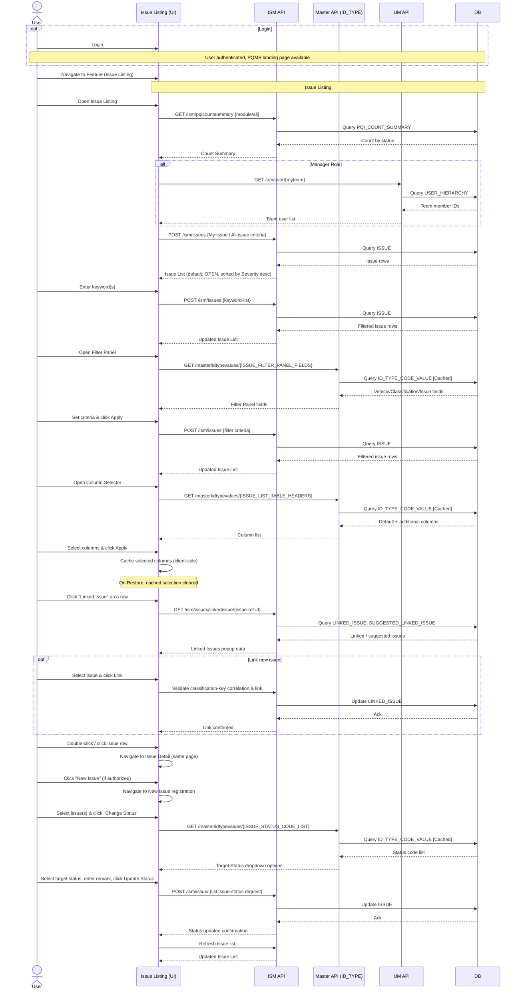
```mermaid
sequenceDiagram
    actor U as User
    participant UI as Issue Listing (UI)
    participant ISM as ISM API
    participant MST as Master API (ID_TYPE)
    participant UM as UM API
    participant DB as DB

    opt Login
        U->>UI: Login
        note over U,DB: User authenticated, PQMS landing page available
    end

    U->>UI: Navigate to Feature (Issue Listing)

    note over UI,DB: Issue Listing

    %% Page Load
    U->>UI: Open Issue Listing
    UI->>ISM: GET /ism/pqicountsummary {module/all}
    ISM->>DB: Query PQI_COUNT_SUMMARY
    DB-->>ISM: Count by status
    ISM-->>UI: Count Summary

    alt Manager Role
        UI->>UM: GET /um/user/{myteam}
        UM->>DB: Query USER_HIERARCHY
        DB-->>UM: Team member IDs
        UM-->>UI: Team user list
    end

    UI->>ISM: POST /ism/issues {My-issue / All-issue criteria}
    ISM->>DB: Query ISSUE
    DB-->>ISM: Issue rows
    ISM-->>UI: Issue List (default: OPEN, sorted by Severity desc)

    %% Search by Keyword
    U->>UI: Enter keyword(s)
    UI->>ISM: POST /ism/issues {keyword-list}
    ISM->>DB: Query ISSUE
    DB-->>ISM: Filtered issue rows
    ISM-->>UI: Updated Issue List

    %% Filter Panel
    U->>UI: Open Filter Panel
    UI->>MST: GET /master/idtypevalues/{ISSUE_FILTER_PANEL_FIELDS}
    MST->>DB: Query ID_TYPE_CODE_VALUE [Cached]
    DB-->>MST: Vehicle/Classification/Issue fields
    MST-->>UI: Filter Panel fields
    U->>UI: Set criteria & click Apply
    UI->>ISM: POST /ism/issues {filter criteria}
    ISM->>DB: Query ISSUE
    DB-->>ISM: Filtered issue rows
    ISM-->>UI: Updated Issue List

    %% Grid Column Selection
    U->>UI: Open Column Selector
    UI->>MST: GET /master/idtypevalues/{ISSUE_LIST_TABLE_HEADERS}
    MST->>DB: Query ID_TYPE_CODE_VALUE [Cached]
    DB-->>MST: Default + additional columns
    MST-->>UI: Column list
    U->>UI: Select columns & click Apply
    UI->>UI: Cache selected columns (client-side)
    Note over UI: On Restore, cached selection cleared

    %% Linked Issues
    U->>UI: Click "Linked Issue" on a row
    UI->>ISM: GET /ism/issues/linkedissue/{issue-ref-id}
    ISM->>DB: Query LINKED_ISSUE, SUGGESTED_LINKED_ISSUE
    DB-->>ISM: Linked / suggested issues
    ISM-->>UI: Linked Issues popup data
    opt Link new issue
        U->>UI: Select issue & click Link
        UI->>ISM: Validate classification-key correlation & link
        ISM->>DB: Update LINKED_ISSUE
        DB-->>ISM: Ack
        ISM-->>UI: Link confirmed
    end

    %% Navigate to Issue Detail
    U->>UI: Double-click / click issue row
    UI->>UI: Navigate to Issue Detail (same page)

    %% New Issue
    U->>UI: Click "New Issue" (if authorized)
    UI->>UI: Navigate to New Issue registration

    %% Change Status
    U->>UI: Select issue(s) & click "Change Status"
    UI->>MST: GET /master/idtypevalues/{ISSUE_STATUS_CODE_LIST}
    MST->>DB: Query ID_TYPE_CODE_VALUE [Cached]
    DB-->>MST: Status code list
    MST-->>UI: Target Status dropdown options
    U->>UI: Select target status, enter remark, click Update Status
    UI->>ISM: POST /ism/issue/ {list issue-status request}
    ISM->>DB: Update ISSUE
    DB-->>ISM: Ack
    ISM-->>UI: Status updated confirmation
    UI->>ISM: Refresh issue list
    ISM-->>UI: Updated Issue List
```

##### 3.2.4.4.5. Frontend

1) Attention banners render above or side of the list, sourced from the attention-items API on page load;
2) Default list view applies DEFAULT_SOURCE_SYSTEM=Warranty, STATUS=OPEN, sorted by Severity Score descending, with CLOSED hidden — before any user filter interaction.
3) Filter panel supports multi-select (Source Channel, Model, Severity Band, Status), single-select (Owner), a date range picker (Date Reported), and toggle/checkbox filters (EWS Flag, Has Pending Links, Assigned to Me, Hide/Show Closed).
4) Quick-filter tabs (All Issues / My Issues / Pending) sit alongside — not instead of — the filter panel and checkbox filters; both can be combined.
5) Row rendering: MONITORING-status rows in italic; "👤 Mine" and "🔗 N links" badges rendered inline per row where applicable.
6) Free-text search box matches against the full Issue ID string.
7) Double-click on a row navigates to ISM0040 (Issue Detail) on the same page (client-side route, no full reload).
8) Manager view: a team-member picker (via `myteam` API) is shown only when the login-user has direct reports in USER_HIERARCHY.

##### 3.2.4.4.6. Backend

1) `POST /ism/issues` is the single search endpoint for the default view, filtered search, and all three quick-filter tabs — the tab/filter state is expressed in the searchRequest payload (e.g. `user-id`, `status=pending`), not via separate endpoints.
2) Server-side validates all searchRequest fields (Source-System, Model, Model-Year, EWS-Flag, User, Date range) before querying `ISSUE`; invalid values are rejected rather than silently ignored.
3) For the "All Issues" quick-filter tab and the manager team-picker, the backend resolves the requesting user's span of control via `USER_HIERARCHY` before querying, so a manager's "All Issues" view is scoped to their own reporting line, not the whole system.
4) "Has Pending Links" filter joins against `SUGGESTED_LINKED_ISSUE` (unactioned records only); link-count badge aggregates `ISSUE_LINK` + open `SUGGESTED_LINKED_ISSUE` rows per issue.
5) Attention-items endpoint (`GET /api/users/{userId}/attention-items`) computes the three banner categories server-side per login-user — Action Required and Correlation Alert are ownership-scoped; SLA Overdue additionally requires a join to the issue's linked QIR's SLA schedule.
6) Pagination is server-side (page/size params on `POST /ism/issues`), consistent with the architecture doc's mandatory-pagination constraint.

7) Bulk status update: `POST /ism/issue/` accepts selected issue-ref-ids + target status + mandatory remark, updates `ISSUE.STATUS` for each.

##### 3.2.4.4.7. Database

- ISSUE
- SOURCE_CHANNEL
- CLASSIFICATION_KEY
- LINKED_ISSUE
- SUGGESTED_LINKED_ISSUE
- USER_HIERARCHY (USER_ID, PARENT_USER_ID)
- ID_TYPE_CODE_VALUE
- PQI_COUNT_SUMMARY / ISSUE_COUNT_SUMMARY
- ~~ISSUE_SOURCE_WARRANTY | ISSUE_SOURCE_WEIBULL | ISSUE_SOURCE_COMEBACK | ISSUE_SOURCE_TECHLINE | ISSUE_SOURCE_FPQR | ISSUE_SOURCE_GQIS | ISSUE_SOURCE_EWS |ISSUE_SCORE_HISTORY | ISSUE_DISPOSITION~~

#### 3.2.4.5. Notes, Issue & Assumption

- Assumption : Default issue listing will show only core issue field and source-channel specific fields shall be displayed in issue detail page.

---

### 3.2.5. ISM0040 - Issue Workspace (Detail/Edit) (Module: ISM, DONE)

#### 3.2.5.1. Purpose

To display aggregated information of a quality-issue — Issue Detail (core/vehicle/classification/source-channel/linked issues), Investigation, Resolution (Related QIR), Communication log and History — to the authorized user.

#### 3.2.5.2. Requirement Traceability

**Main BRD 1.1 Reference**

- Chapter : 7.3 Issue Entry & Scoring
  - ISM-FR-012 (severity score visibility/edit)
- Chapter : 7.6 Issue Tracking & Lifecycle
  - ISM-FR-040, ISM-FR-041, ISM-FR-042
- Chapter : 7.7 Parts Request
  - ISM-FR-050
- Chapter : 7.8 Communication Log
  - ISM-FR-060, ISM-FR-061

*(Corrected — previously cited ISM-FR-001 to 004, which belong to ISM0010 Issue Listing, not this function.)*

**ISM DRD 1.0 Reference**

- Chapter : 9. ISM0040 — Issue Detail

**ISM BRD 1.3 Reference**
- Chapter : 7.4 ISM0040 — Issue Workspace
- Chapter : 7.5 ISM0040 — Issue Investigation and Resolution

#### 3.2.5.3. Navigation & Prototype reference

**Navigation**  

Issue Management > Issue List > Issue Detail

**Prototype** (Reference to UX design pattern)  

#### 3.2.5.4. Solution Approach

##### 3.2.5.4.1. Design Description 

The [Issue Detail] function will enable users to perform/work with following activities/sections in query or edit mode.

1) Tab : Issue Detail
   1) Issue Information
   2) Vehicle Information
   3) System Classification
   4) Issue Source
      1) Issue Source - Warranty
      2) Issue Source - Weibull
      3) Issue Source - Comeback
      4) Issue Source - Techline
      5) Issue Source - FPQR
      6) Issue Source - EWS
      7) Issue Source - GQIS
   5) Same & Linked Issues
2) Tab : Investigation
   1) Investigation Activities
      1) Add Activity
      2) Activity Timeline
      3) Attach documents
   2) Part Request
      1) Raise Part Request
      2) Part Request History
      3) Attach document
3) Tab : Resolution
   1) Related QIR
   2) Countermeasure
   3) Related Publication
4) Tab : Communication
5) Tab : History
   1) All
   2) Lifecycle
   3) Audit Log

**Issue Detail : Issue Information**

**Query mode**
1) This section will show [Issue Title, Description & DTC Code]
2) [Issue Title, Description, DTC Code] shall be fetched via API.
   1) [API : GET /ism/issue {issue-ref-id} (Purpose : To get issue information by issue-ref-id)]
   2) [DB Entity : ISSUE]
3) Color-scheme for DTC-Code : P-prefix = Powertrain (blue), B-prefix = Body (purple), C-prefix = Chassis (green), U-prefix = Network/Communication (orange). Unrecognized prefixes are rendered in grey.

**Edit mode**
4) This section will allow user to edit [Issue Title, Description & DTC Code]
5) [Issue Title, Description, DTC Code] shall be updated via API.
   1) [API : POST/PUT /ism/issue {issue-ref-id} (Purpose : To update issue information by issue-ref-id)]
   2) [DB Entity : ISSUE]

**Issue Detail : Vehicle Information**

**Query mode**
1) This section will show vehicle's model information.
2) Vehicle's model information shall be fetched via API.
   1) [API : GET /ism/issue (Purpose : To get the vehicle's model information of an issue by issue-ref-id)]
   2) [DB Entity : ISSUE]

**Edit mode**
1) This section will allow user to edit vehicle's model information.
2) Vehicle's model information shall be updated via API.
   1) [API : POST/PUT /ism/issue (Purpose : To update the vehicle's model information of an issue by issue-ref-id)]
   2) [DB Entity : ISSUE]

**Issue Detail : System Classification**

**Query mode**
1) This section will show system classification information.
2) System classification information shall be fetched via API.
   1) [API : GET /ism/issue (Purpose : To get the system classification information of an issue by issue-ref-id)]
   2) [DB Entity : ISSUE]

**Edit mode**
1) This section will allow user to edit system classification information.
2) System classification information shall be updated via API.
   1) [API : POST/PUT /ism/issue (Purpose : To update the vehicle's model information of an issue by issue-ref-id)]
   2) [DB Entity : ISSUE]

**Note : Master data of system classification shall be managed by function "Manage System Classification Key"**

**Issue Detail : Issue Source - (Warranty | Weibull | Comeback | Techline | FPQR | EWS | GQIS)**

**Query mode**
1) This section will show source channel information.
2) Source channel information shall be fetched via API.
   1) [API : GET /ism/issue (Purpose : To get the source channel information of an issue by issue-ref-id)]
   1) [API : GET /ism/issue/warranty (Purpose : To get warranty information by issue-ref-id)]
   2) [API : GET /ism/issue/weibull (Purpose : To get weibull information by issue-ref-id)]
   3) [API : GET /ism/issue/comeback (Purpose : To get comeback information by issue-ref-id)]
   4) [API : GET /ism/issue/techline (Purpose : To get techline information by issue-ref-id)]
   5) [API : GET /ism/issue/fpqr (Purpose : To get fpqr information by issue-ref-id)]
   6) [API : GET /ism/issue/gqis (Purpose : To get gqis information by issue-ref-id)]
   7) [API : GET /ism/issue/ews (Purpose : To get ews information by issue-ref-id)]
   9)  Alternative composite Issue API : [API : GET /ism/issue/composite (Purpose : To get all source-channel information by issue-ref-id from DB entities ISSUE & SOURCE_CHANNEL_XXX)]

   10) [DB Entity : ISSUE, ISSUE_SOURCE_WARRANTY, ISSUE_SOURCE_WEIBULL, ISSUE_SOURCE_COMEBACK, ISSUE_SOURCE_TECHLINE, ISSUE_SOURCE_FPQR, ISSUE_SOURCE_GQIS, ISSUE_SOURCE_EWS]

**Edit mode**
1) This section will allow user to edit source channel information.
2) Source channel information shall be updated via API.
   1) [API : POST /ism/issue/warranty (Purpose : upsert data in ISSUE_SOURCE_WARRANTY DB entity)]
   2) [API : POST /ism/issue/weibull (Purpose : upsert data in ISSUE_SOURCE_WEIBULL DB entity)]
   3) [API : POST /ism/issue/comeback (Purpose : upsert data in ISSUE_SOURCE_COMEBACK DB entity)]
   4) [API : POST /ism/issue/techline (Purpose : upsert data in ISSUE_SOURCE_TECHLINE DB entity)]
   5) [API : POST /ism/issue/fpqr (Purpose : upsert data in ISSUE_SOURCE_FPQR DB entity)]
   6) [API : POST /ism/issue/gqis (Purpose : upsert data in ISSUE_SOURCE_GQIS DB entity)]
   7) [API : POST /ism/issue/ews (Purpose : upsert data in ISSUE_SOURCE_EWS DB entity)]
   8) Alternative composite Issue API : [API : POST /ism/issue/composite (Purpose : upsert data in DB entities ISSUE & SOURCE_CHANNEL_XXX)]

   10) [DB Entity : ISSUE_SOURCE_WARRANTY, ISSUE_SOURCE_WEIBULL, ISSUE_SOURCE_COMEBACK, ISSUE_SOURCE_TECHLINE, ISSUE_SOURCE_FPQR, ISSUE_SOURCE_GQIS, ISSUE_SOURCE_EWS]

**Issue Detail : Linked Issues**

**Query mode**
1) This section/popup will show list of linked-issue (suggested, approved) information.
2) The popup will be shown on-click of "Managed Linked Issues".
3) Linked-issue information shall be fetched via API.
   1) [API : POST /ism/issues {search criteria} (Purpose : To fetch issue-list by classification search-criteria)]
   2) [API : GET /ism/issue/linkedissues/suggested {issue-ref-id} (Purpose : To fetch list of suggested linked issue information)]
   3) [API : GET /ism/issue/linkedissues/approved {issue-ref-id} (Purpose : To fetch list of approved linked issue information)]
   4) DB Entity : [ISSUE, SUGGESTED_LINKED_ISSUE, LINKED_ISSUE]

**Edit mode**
1) This section/popup will allow user to add/remove linked-issue (suggested, approved) information.
2) Linked-issue (suggested, approved) information shall be added/removed via API.
   1) [API : POST /ism/issue/linkedissue/suggest {list of suggested linked issue request} (Purpose : To upsert entry of linked issue for apprroval)]
   2) [API : POST /ism/issue/linkedissue/approve {list of suggested linked issue request} (Purpose : To approve suggested linked issue information)]
   3) DB Entity : [ISSUE, SUGGESTED_LINKED_ISSUE, LINKED_ISSUE]
3) On-click of "Link Issue", input issue-ref-id will be linked with the issue
4) On-click of "Save Changes", selected/deselected issued will be linked/unlinked with the issue. (Unlink = delete-flag=Y)

5) Note : If linked-isssues are removed, records will soft-deleted i.e. delete-flag=Y.

**Investigation : Manage Part Request**

Same as explained in [Chapter : ISM0090 - Manage Parts Request]

**Investigation : Investigation Activities (Add Activity | Timeline)**

This section has following sub-sections
1) Add investigation activity
4) Upload optional attachment with add activity
2) Investigation Activity Timeline (List)
3) Request update (show & edit)
5) Add evidence (upload) per activity

This section will be supported by the function [**Manage Investigation Activity**]. The function [**Manage Investigation Activity**] will enable users to perform following CRUD operations

1) Add new investigation activity
2) Search & List investigation activities
3) View investigation activity
4) Edit investigation activity
5) Delete investigation activity
6) Each operation will be supported via API.
   1) [API : POST /ism/investigationactivities/{issue-ref-id} (Purpose : To add investigation-activities for an issue-ref-id)]
   2) [API : PUT /ism/investigationactivities/{issue-ref-id} (Purpose : To update investigation-activities for an issue-ref-id)]
   3) [API : GET /ism/investigationactivities/{issue-ref-id} (Purpose : To get list of investigation-activities by issue-ref-id)]
   4) [API : GET /ism/investigationactivities/{issue-ref-id}/{investigation-activity-id} (Purpose : To view investigation-activities by investigation-activity-id)]
   5) [API : DELETE /ism/investigationactivities/{issue-ref-id}/{investigation-activity-id} (Purpose : To view investigation-activities by investigation-activity-id)]
   6) [DB Entity : INVESTIGATION_ACTIVITY]
7) Attachemnt for every investigation-activity shall be supported by the function [Manage Document]

**Investigation : Part Request - Attach document**
**Investigation : Activities - Attach documents**

Same as explained in [Chapter : DM0010 - Manage Document]

**Resolution : Related QIR**

QIR shall be created against an issue on [Issue Lifecycle Status = QIR Escalation]. Any information for a QIR shall be managed under QIR management module. One QIR will always have one issue, but one issue may have multiple QIRs.

**Query mode**
1) This section will show QIR information.
2) QIR information shall be fetched via API.
   1) [API : GET /qir/qir/{issue-ref-id} (Purpose : To get the QIR information of an issue by issue-ref-id)]
   2) [DB Entity : QIR]

**Edit mode**
1) This section will allow user to edit QIR information.
2) QIR information shall be updated via API.
   1) [API : POST/PUT /qir/qir (Purpose : To update the QIR information of an issue by issue-ref-id)]
   2) [DB Entity : QIR]

**Resolution : Countermeasure**

Shall be explained in module [QIR Management]

**Resolution : Related Publication**

Shall be explained in module [TSB Management]

**Communication**

Same as explained in [Chapter : ISM0100 - Communication Log]

**History (All | Lifecycle | Audit Log)**

The [History] tab shall maanage two sections
1) Lifecycle (Activity log)
2) Search activity log
3) Audit Log (important field change)
4) Search audit log

**History : Lifecycle (Chronological activity log)**

*Fetch acivity-log* : The tab will show activity-log information associated with the issue via API. The activity log will be applicable for [Issue/QIR/TSB]
   1) [API : GET /pqms/admin/activitylog/issue/{issue-ref-id} (Purpose : To get activity-log by issue-ref-id)]
   2) Similarly [API : GET /pqms/admin/activitylog/qir/{qir-ref-id} (Purpose : To get activity-log by qir-ref-id)]
   3) Similarly [API : GET /pqms/admin/activitylog/tsb/{tsb-ref-id} (Purpose : To get activity-log by tsb-ref-id)]
   4) [DB Entity : ACTIVITY_LOG, ACTIVITY_LOG_RULE]

*Capture acivity-log* : Activity-log information shall be captured for [Issue/QIR/TSB] as per activity-rule via API. User activities shall be preconfigured in [ACTIVITY_LOG_RULE DB entity]
   5) [API : POST /pqms/admin/activitylog/issue/{issue-ref-id} (Purpose : To get activity-log by issue-ref-id)]
   6) Similarly [API : POST /pqms/admin/activitylog/qir/{qir-ref-id} (Purpose : To get activity-log by qir-ref-id)]
   7) Similarly [API : POST /pqms/admin/activitylog/tsb/{tsb-ref-id} (Purpose : To get activity-log by tsb-ref-id)]
   8) [DB Entity : ACTIVITY_LOG, ACTIVITY_LOG_RULE]

**History : Audit Log**

The tab will show audit-log history i.e. chronological log of all state changes, field edits, score changes, user actions with role, timestamp, and delta

*Fetch audit-log*
   1) [API : GET /pqms/admin/auditlog/{issue-ref-id} (Purpose : To get audit log info by issue-ref-id)]
   2) DB Entity : AUDIT_LOG

*Capture audit-log*
   1) [API : POST /pqms/admin/auditlog/{issue-ref-id} (Purpose : To capture audit log info by issue-ref-id)]
   2) [Request : issueRefId | Response : field_name, old_value, new_value, old_status, new_status, score_old, score_new, delta_summary, change_reason and other relevant parameters]

##### 3.2.5.4.2. Design Notes

1) Issue Detail tab loads on open; all other tabs lazy-load their data on first click.
2) Readonly vs. Edit mode is resolved as two different screen, based on the role-permission payload.
3) Evidence & Attachments reuses the same DOCUMENT-entity pattern established in ISM0020 — no separate upload mechanism for this screen.

##### 3.2.5.4.3. Actor

Per Role × Feature access matrix (§6.2.9):

**Read/Write**
- SE : Service Engineer
- PQDH : PQ Department Head
- SEM : Service Engineer Manager
- OPSADM : Operation Admin

**Read-only**
- PUBCOO : Publication Coordinator

##### 3.2.5.4.4. Sequence Flow

**Issue Detail**

```mermaid
sequenceDiagram
    actor U as User
    participant UI as Issue Detail (UI)
    participant ISM as ISM API
    participant QIR as QIR API
    participant ADM as Admin API (Activity/Audit)
    participant DB as DB

    opt Login
        U->>UI: Login
        note over U,DB: User authenticated, PQMS landing page available
    end

    U->>UI: Navigate to Feature (Issue Detail)

    note over UI,DB: Issue Detail

    U->>UI: Open Issue Detail (issue-ref-id)

    %% Tab 1: Issue Detail (loads on open)
    UI->>ISM: GET /ism/issue {issue-ref-id}
    ISM->>DB: Query ISSUE
    DB-->>ISM: Issue Info, Vehicle Info, System Classification
    ISM-->>UI: Render Issue/Vehicle/Classification (Query mode)

    UI->>ISM: GET /ism/issue/composite {issue-ref-id}
    ISM->>DB: Query ISSUE, ISSUE_SOURCE_WARRANTY/WEIBULL/COMEBACK/TECHLINE/FPQR/GQIS/EWS
    DB-->>ISM: Source-channel details
    ISM-->>UI: Render Issue Source panel(s)

    opt Edit mode - Issue/Vehicle/Classification
        U->>UI: Edit fields & Save
        UI->>ISM: POST/PUT /ism/issue {issue-ref-id}
        ISM->>DB: Update ISSUE
        DB-->>ISM: Ack
        ISM-->>UI: Save confirmed
    end

    opt Edit mode - Issue Source
        U->>UI: Edit source-channel fields & Save
        UI->>ISM: POST /ism/issue/{warranty|weibull|comeback|techline|fpqr|gqis|ews}
        ISM->>DB: Upsert ISSUE_SOURCE_XXX
        DB-->>ISM: Ack
        ISM-->>UI: Save confirmed
    end

    opt Manage Linked Issues
        U->>UI: Click "Manage Linked Issues"
        UI->>ISM: POST /ism/issues {search criteria}
        ISM->>DB: Query ISSUE
        DB-->>ISM: Candidate issues
        ISM-->>UI: Search results
        UI->>ISM: GET /ism/issue/linkedissues/suggested {issue-ref-id}
        ISM->>DB: Query SUGGESTED_LINKED_ISSUE
        DB-->>ISM: Suggested links
        ISM-->>UI: Suggested Links list
        UI->>ISM: GET /ism/issue/linkedissues/approved {issue-ref-id}
        ISM->>DB: Query LINKED_ISSUE
        DB-->>ISM: Approved links
        ISM-->>UI: Approved Links list
        U->>UI: Link Issue / Save Changes
        UI->>ISM: POST /ism/issue/linkedissue/suggest {request}
        ISM->>DB: Upsert SUGGESTED_LINKED_ISSUE
        DB-->>ISM: Ack
        UI->>ISM: POST /ism/issue/linkedissue/approve {request}
        ISM->>DB: Upsert LINKED_ISSUE / soft-delete on unlink
        DB-->>ISM: Ack
        ISM-->>UI: Linked Issues updated
    end

    %% Tab 2: Investigation (lazy-loaded)
    opt User clicks "Investigation" tab
        U->>UI: Open Investigation tab
        Note over UI,ISM: Part Request handled per ISM0090 (Manage Parts Request)
        UI->>ISM: GET /ism/investigationactivities/{issue-ref-id}
        ISM->>DB: Query INVESTIGATION_ACTIVITY
        DB-->>ISM: Activity list
        ISM-->>UI: Investigation Activity Timeline

        opt Add Activity
            U->>UI: Add Activity (+ optional attachment)
            UI->>ISM: POST /ism/investigationactivities/{issue-ref-id}
            ISM->>DB: Insert INVESTIGATION_ACTIVITY
            Note over ISM,DB: Attachment handled via DM0010 Manage Document
            DB-->>ISM: Ack
            ISM-->>UI: Activity added
        end

        opt View/Edit Activity
            U->>UI: Select activity
            UI->>ISM: GET /ism/investigationactivities/{issue-ref-id}/{activity-id}
            ISM->>DB: Query INVESTIGATION_ACTIVITY
            DB-->>ISM: Activity detail
            ISM-->>UI: Show activity (view/edit)
            opt Update
                U->>UI: Edit & Save
                UI->>ISM: PUT /ism/investigationactivities/{issue-ref-id}
                ISM->>DB: Update INVESTIGATION_ACTIVITY
                DB-->>ISM: Ack
                ISM-->>UI: Activity updated
            end
            opt Delete
                U->>UI: Delete activity
                UI->>ISM: DELETE /ism/investigationactivities/{issue-ref-id}/{activity-id}
                ISM->>DB: Delete INVESTIGATION_ACTIVITY
                DB-->>ISM: Ack
                ISM-->>UI: Activity removed
            end
        end
    end

    %% Tab 3: Resolution (lazy-loaded)
    opt User clicks "Resolution" tab
        U->>UI: Open Resolution tab
        UI->>QIR: GET /qir/qir/{issue-ref-id}
        QIR->>DB: Query QIR
        DB-->>QIR: Related QIR info
        QIR-->>UI: Render Related QIR (Query mode)
        Note over UI,QIR: Countermeasure -> QIR Management module
        Note over UI,QIR: Related Publication -> TSB Management module
        opt Edit QIR (Issue Lifecycle Status = QIR Escalation)
            U->>UI: Edit QIR fields & Save
            UI->>QIR: POST/PUT /qir/qir
            QIR->>DB: Update QIR
            DB-->>QIR: Ack
            QIR-->>UI: Save confirmed
        end
    end

    %% Tab 4: Communication (lazy-loaded)
    opt User clicks "Communication" tab
        U->>UI: Open Communication tab
        Note over UI,ISM: Handled per ISM0100 - Communication Log
    end

    %% Tab 5: History (lazy-loaded)
    opt User clicks "History" tab
        U->>UI: Open History tab

        alt Lifecycle sub-tab
            UI->>ADM: GET /pqms/admin/activitylog/issue/{issue-ref-id}
            ADM->>DB: Query ACTIVITY_LOG, ACTIVITY_LOG_RULE
            DB-->>ADM: Activity log entries
            ADM-->>UI: Render Lifecycle activity log
            Note over ADM,DB: Activity captured per ACTIVITY_LOG_RULE on qualifying actions
        else Audit Log sub-tab
            UI->>ADM: GET /pqms/admin/auditlog/{issue-ref-id}
            ADM->>DB: Query AUDIT_LOG
            DB-->>ADM: field_name, old/new value, old/new status, score delta, change_reason
            ADM-->>UI: Render Audit Log
        end
    end
```

##### 3.2.5.4.5. Frontend

1) Tabbed layout: Issue Detail loads eagerly; Investigation, Resolution, Communication, History all lazy-load on first click.
2) Header persists across tabs: Issue ID, Title, Status, Owner.
3) Issue Source panel renders per available/selected source channel; DTC chips reuse ISM0020's color-coding.
4) Linked Issues popup: suggested vs. approved sections, "Link Issue" and "Save Changes" actions.
5) Investigation Activities: add/view/edit/delete with inline attachment upload (reuses DM0010).
6) Field-level readonly/edit rendering is driven by the same role-permission payload.

##### 3.2.5.4.6. Backend

1) Each tab's data is served by its own dedicated GET endpoint rather than one large composite payload; supports the lazy-load pattern.
2) Investigation Activities: full CRUD via `/ism/investigationactivities/{issue-ref-id}[/{investigation-activity-id}]`; attachments delegate to DM0010.
3) Linked Issues: suggest/approve endpoints upsert `SUGGESTED_LINKED_ISSUE`/`LINKED_ISSUE`; unlink is a soft-delete (delete-flag=Y).
4) Resolution tab reads/writes `QIR` only for Related QIR; Countermeasure and Related Publication are out of scope here (owned by QIR/TSB modules).
5) History tab: Lifecycle via `/pqms/admin/activitylog/issue/{issue-ref-id}`; Audit via `/pqms/admin/auditlog/{issue-ref-id}`.

##### 3.2.5.4.7. Database

- ISSUE
- ISSUE_SOURCE_WARRANTY | WEIBULL | COMEBACK | TECHLINE | FPQR | GQIS | EWS
- SUGGESTED_LINKED_ISSUE, LINKED_ISSUE
- INVESTIGATION_ACTIVITY
- QIR
- ACTIVITY_LOG, ACTIVITY_LOG_RULE
- AUDIT_LOG, AUDIT_LOG_RULE
- MODEL
- CLASSIFICATION_KEY
- DOCUMENT

#### 3.2.5.5. Notes, Issue & Assumption

- Open item: is [PART_MASTER DB Entity] a real locally-cached table, or should Parts data on this screen be sourced live via SAP BW/4HANA (INT-04) without a local master table? Needs confirmation before Parts Request's Database section is finalized here or in ISM0090.

---

### 3.2.6. ISM0030 - Issue Score (Module: ISM, DONE)

#### 3.2.6.1. Purpose

The [Issue-Score] function will display the calculated severity score (0–100) for an issue along with [score-breakdown] and [score-history].

Users with SE role can review calculated score, while SEM/PQDH can override with justification.

Delivery phase : Phase 2

#### 3.2.6.2. Requirement Traceability

**Main BRD 1.1 Reference**

- Chapter : 7.3 Issue Entry & Scoring
  - ISM-FR-011
  - ISM-FR-012

**ISM DRD 1.0 Reference**

- Chapter : 8. ISM0030 — Issue Scoring

**ISM BRD 1.3 Reference**

*Covered under Issue Entry and Issue Detail for calculation & display*

#### 3.2.6.3. Navigation & Prototype reference

**Navigation**

Issue Management > Issue Score 

**Prototype**

Reference to UX design pattern

#### 3.2.6.4. Solution Approach

##### 3.2.6.4.1. Design Description

The [Issue-Score] function will enable users to perform following activities

**Score Dispay to regular role (SE, and read-only for PQDH/OPSADM)**

1) [Issue-severity-score] is already calculated via system function [Issue Entry (ISM0020) / Issue Detail (ISM0040)] in a asynchronous mode.
2) [Issue-severity-score-calculation] step in function [Issue Entry (ISM0020)] has prepared the [total-score] and [score-breakdown] in respective DB entities. 
3. The [Issue-Score] function will show the pre-calculated [issue-severity-score] and [score-breakdown] via API
4. **Severity band display** (per ISM DRD 1.0 §8): the numeric score (0–100) is rendered alongside a band label and color gauge:
   - 80–100 : Critical (Red)
   - 60–79 : High (Orange)
   - 40–59 : Medium (Yellow)
   - 20–39 : Low (Green)
   - 0–19 : Informational (Gray)

5. **Algorithm version display**: the scoring formula version is shown in the BRD document. Phase 2 replaces this with an AI-assisted scoring engine, at which point the version display switches accordingly.
6. **Partial-score flag**: if INT-03 (Siebel) data was unavailable at calculation time, the score displays "Partial — Siebel data unavailable; rescore pending" (set at calculation time in ISM0020, surfaced here for review).
7. **Score history panel**: lists, per prior scoring event — date, algorithm version, previous score, new score, changed-by (SYSTEM or user), and reason (for overrides).
8. **[Request Rescore]** action (SE, P2): re-queues the `calculate-severity-score` message for this issue — used e.g. after the Partial flag clears once INT-03 data becomes available.
9. [API : GET /ism/issuescore/{issue-ref-id} (Purpose : Get score total and score breakdown by issue-ref-id)] 
   1. The API shall be called by consumer (e.g. on click of [View issue score] link from [Issue Detail (ISM0040)] page)
   2. API will validate values passed through issueScoreRequest i.e. valid issue-ref-id.
   3. After successful validation of issueScoreRequest, API will fetch score-detail & score-breakdown from [ISSUE_SCORE_HISTORY & ISSUE_SCORE_BREAKDOWN DB entities]
   4. Fetched issue-score-breakdown shall be returned to consumer as issueScoreRespone
   5. Reference structutre issue score respone  
      {  
        score-detail {  
          issue-ref-id :   
          severity-score :  
          algorithm_version :
          partial_flag :
          date fields ...  
        },  
        score-breakdown [  
        { break-down record-1 },  
        **  
        { break-down record-n },  
        ]  
      }  

**Score Dispay to approving role (SEM/PQDH)**

1. [Issue-score-display] to [approving-role] is same like [regular-role], including severity band, algorithm version, Partial flag, and history panel.
2. [Score] number shall be editable in [score-total] & [score-breakdown]
3. Validation shall be applied [score-total = sum of scores in breakdown] on frontend & backend 
4. **Override reason is mandatory and must be at least 20 characters** on frontend and backend. Once overridden, the score displays an inline **"Manually Overridden"** tag showing the overriding user and timestamp, alongside the override reason.

##### 3.2.6.4.2. Design Notes

1) This function is display + override only — the actual score calculation happens asynchronously during Issue Entry (ISM0020), not here.
2) Weightings behind the score (0.35/0.30/0.20/0.15 in score formula) are Admin-configurable and new weightings will apply prospectively to future calculations only, not retroactively to already-scored issues.
3) Severity band thresholds and colors should stay consistent with however Issue-Listing renders the Severity Band filter/column, to avoid two different color mappings existing in the product.

##### 3.2.6.4.3. Actor

Per Role × Feature access matrix:

**Read-only (review)**
- SE : Service Engineer
- OPSADM : Operation Admin

**Edit (override, with mandatory justification ≥20 characters)**
- SEM : Service Engineer Manager
- PQDH : PQ Department Head (also covers prior read-only review)

##### 3.2.6.4.4. Sequence Flow

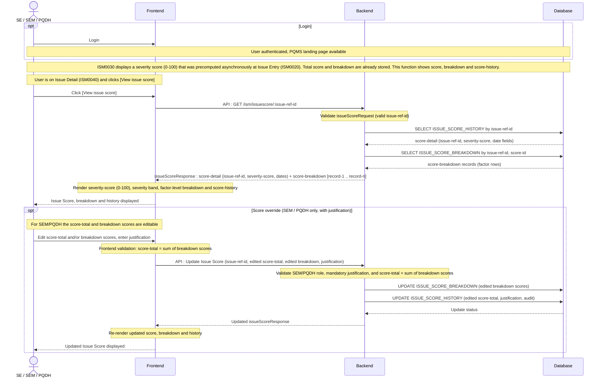
```mermaid
sequenceDiagram
    actor User as SE / SEM / PQDH
    participant FE as Frontend
    participant BE as Backend
    participant DB as Database

    opt Login
        User->>FE: Login
        note over User,DB: User authenticated, PQMS landing page available
    end

    note over User,DB: ISM0030 displays a severity score (0-100) that was precomputed asynchronously at Issue Entry (ISM0020). Total score and breakdown are already stored. This function shows score, breakdown and score-history.

    note over User,FE: User is on Issue Detail (ISM0040) and clicks [View issue score]
    User->>FE: Click [View issue score]
    FE->>BE: API : GET /ism/issuescore/:issue-ref-id
    note over BE: Validate issueScoreRequest (valid issue-ref-id)
    BE->>DB: SELECT ISSUE_SCORE_HISTORY by issue-ref-id
    DB-->>BE: score-detail (issue-ref-id, severity-score, date fields)
    BE->>DB: SELECT ISSUE_SCORE_BREAKDOWN by issue-ref-id, score-id
    DB-->>BE: score-breakdown records (factor rows)
    BE-->>FE: issueScoreResponse : score-detail (issue-ref-id, severity-score, dates) + score-breakdown [record-1 .. record-n]
    note over FE: Render severity-score (0-100), severity band, factor-level breakdown and score-history
    FE-->>User: Issue Score, breakdown and history displayed

    opt Score override (SEM / PQDH only, with justification)
        note over User,FE: For SEM/PQDH the score-total and breakdown scores are editable
        User->>FE: Edit score-total and/or breakdown scores, enter justification
        note over FE: Frontend validation: score-total = sum of breakdown scores
        FE->>BE: API : Update Issue Score (issue-ref-id, edited score-total, edited breakdown, justification)
        note over BE: Validate SEM/PQDH role, mandatory justification, and score-total = sum of breakdown scores
        BE->>DB: UPDATE ISSUE_SCORE_BREAKDOWN (edited breakdown scores)
        BE->>DB: UPDATE ISSUE_SCORE_HISTORY (edited score-total, justification, audit)
        DB-->>BE: Update status
        BE-->>FE: Updated issueScoreResponse
        note over FE: Re-render updated score, breakdown and history
        FE-->>User: Updated Issue Score displayed
    end
```

##### 3.2.6.4.5. Frontend

1) Score display: numeric gauge (0–100) with band color, band label, algorithm version tag, and Partial-flag banner when applicable.
2) Score history panel rendered as a reverse-chronological list (most recent first): date, algorithm version, previous > new score, changed-by, reason.
3) Edit mode (SEM/PQDH only): score-total and each breakdown factor become editable inputs; a required Override Reason appears alongside; Save disabled until score-total equals the sum of breakdown values.
4) [Request Rescore] button visible only when the Partial flag is set.
5) "Manually Overridden" tag rendered inline once an override exists, showing overriding user + timestamp on hover/click.

##### 3.2.6.4.6. Backend

1) [API : GET /ism/issuescore/{issue-ref-id} (Purpose : returns score-detail (including algorithm_version, partial_flag) + full breakdown)].
2) Update-score endpoint enforces: (a) caller has SEM or PQDH role, (b) override reason is non-empty and ≥20 characters, (c) score-total equals the sum of submitted breakdown values at server-side, independent of client-side checks.
3) On successful override: writes [ISSUE_SCORE_HISTORY DB Entity] (new row, not an in-place update, to preserve history) with `scored_by` = the overriding user, `override_reason`, and timestamp; writes corresponding [ISSUE_SCORE_BREAKDOWN DB Entity] rows; updates [ISSUE.SEVERITY_SCORE].
4) [Request Rescore] re-publishes the `calculate-severity-score` message (same queue used by ISM0020) for the given issue-ref-id.

##### 3.2.6.4.7. Database

- **ISSUE_SCORE_HISTORY**  
  (issue_ref_id, score_id, score_datetime, algorithm_version, partial_flag, scored_by, score_override_datetime, override_reason, audit-fields)

- **ISSUE_SCORE_BREAKDOWN**  
  (issue_ref_id, score_id, factor_name, factor_value, weightage, factor_level_score, override_weightage, override_factor_level_score, score_override_datetime, override_reason, audit-fields)

- ISSUE (SEVERITY_SCORE field, updated on each calculation/override)

- ISSUE_SOURCE_WEIBULL

#### 3.2.6.5. Notes, Issue & Assumption

1) Note : Decided to have DB entity for SCORE_BREAKDOWN instead of configuration & in-memory calculation, so that score-edits by SEM with reason can be audited.
2) Note : Score override to be provisioned on UX
3) Weibull Inputs should be fetched from [ISSUE_SOURCE_WEIBULL DB Entity].

---

### 3.2.7. ISM0330 - Manage Issue Group (Module: ISM, DONE)

#### 3.2.7.1. Purpose

The function [Manage Issue Group] will allow user to manage new group and add or remove existing issue-ref-id under a group.

#### 3.2.7.2. Requirement Traceability

**Main BRD 1.1 Reference**

- *No standalone FR-ID identified.* Issue grouping is not mentioned in the Main BRD explicitely.

**ISM DRD 1.0 Reference**

- *Not explicitly cited in source as a separate chapter.* Group-creation flow described under Issue Entry (ISM0020, item 7 "Issue Correlation Fields & LIVE Counter").

**ISM BRD 1.3 Reference**
- Chapter : 6.6 Issue Linking & Grouping Data Model (FR-LINK-001 to 007)

#### 3.2.7.3. Navigation & Prototype reference

**Navigation**

Issue Management > Issue Group 

**Prototype**

Reference to UX design pattern

#### 3.2.7.4. Solution Approach

##### 3.2.7.4.1. Design Description

Following features to be incorporated in [Manage Issue Group]
- Create New Issue Group
- Add New Issue-ref-id to a issue-group
- Remove New Issue-ref-id to a issue-group
- View Issue-Group List
- Approve / Reject New [Issue-group]
- Approve / Reject added issue-ref-id from a [Issue-group]

**Scope clarification :** this function covers the **Issue Group** side of correlation only i.e. issue-group is an N-issue cluster with its own status/owner. The separate **Issue Tie** structure (no ownership change) is created/managed from ISM0020 (entry-time) and the ISM0040 Suggested Links tab (post-submission).

**Cardinality rule :** an issue may belong to **0-or-1+** issue-group at a time (it may separately have any number of ties, which are independent of group membership). Adding an issue that's already a member of another group should be blocked or allowed with prompt message to the user.

**Group ownership :** a new issue-group is assigned a **PQDH-manager as owner**, The "approving role" for group approval is the assigned PQDH/SEM owner, not an arbitrary approver.

**Issue Group Activities**  

   1) An [issue-group] will be created by user having normal role
   2) The [issue-group] will be approved or rejected with remark by user having approving role
   3) [issue-group] data will be saved as [Draft or Submit] by normal role user
   4) On submit of [issue-group], initiating user & approving user will be notified as [Sender & Receiver]; additionally, per ISM BRD 1.3 §6.6, **all assigned SEs of every member issue** are notified when a group is created.
   5) Notification-Type=NEW_ISSUE_GROUP_CREATED_FOR_APPROVAL
   6) **Deletion safeguard (per ISM BRD 1.3, NFR-07):** removing an issue that is a group member requires explicit user confirmation and notifies the group owner. And deleteion applies to the "Remove issue" activity, not the whole-group deletion.

   7) Approving User will see the [notification-alert] update on [notification-bell] icon via API [API : GET /nm/notification/pendingcount (Purpose : Get pending notification count on notification bell)]
   8) Approving User will view the list of pending [issue-group] via API [API : GET /ism/issuegroups (Purpose : Get list of issue-groups with provision to filter by status)]
   9) Approving User will review the [issue-group] one-by-one via API [API : GET /ism/issuegroup/{issuegroupid} (Purpose : Get issue-group info)]
   10) Approving User will approve [issue-group] with comment in remark via API [API : PUT/POST : /ism/issuegroup (Purpose : Update issue-group for status=approve and remark)]
   11) Approving User will reject [issue-group] with comment in remark via API [API : PUT/POST : /ism/issuegroup (Purpose : Update issue-group for status=reject and remark)]

**Add/Remove Issue under a Issue Group Activities**  

   1) SE engineer will view or search list of [issue-group] via API [Explained]
   2) SE engineer will add existing issue under an [issue-group] via API [API : POST /ism/issuegroup/{issue-group-id}/{issue-ref-id, remark} (Purpose : Add existing issue under a given issue-group)]
   3) SE engineer will reject existing issue from an [issue-group] via API [API : POST /ism/issuegroup/{issue-group-id}/{issue-ref-id, remark} (Purpose : Delete existing issue under a given issue-group)]
   4) Approving user will view or search list of [issue-group] via API [Explained]
   5) Approving user will add existing issue under an [issue-group] via API [API : POST /ism/issuegroup/{issue-group-id}/{issue-ref-id, remark} (Purpose : Mark status=approve for existing issue with remark under a given issue-group)]
   6) Approving user will reject existing issue from an [issue-group] via API [API : POST /ism/issuegroup/{issue-group-id}/{issue-ref-id, remark} (Purpose : Mark status=reject for existing issue with remark under a given issue-group)]

##### 3.2.7.4.2. Design Notes

1) Group status is independent of individual member & issue statuses — approving/rejecting the group itself does not change any member issue's own status (per ISM BRD 1.3, §6.6).
2) New screen ID `ISM0330` assigned to the function [Manage Issue Group].

##### 3.2.7.4.3. Actor

- SE : For issue-group create & add/remove issues
- PQDH/SEM : For approve or reject for issue-group & added-issues.

##### 3.2.7.4.4. Sequence Flow

```mermaid
sequenceDiagram
    actor User as SE / PQDH / SEM
    participant FE as Frontend
    participant BE as Backend
    participant DB as Database

    opt Login
        User->>FE: Login
        note over User,DB: User authenticated, PQMS landing page available
    end

    note over User,DB: Manage Issue Group (ISM0330). SE creates groups and adds/removes issues, PQDH/SEM approves or rejects the group and the added issues.

    opt Create Issue Group (SE)
        User->>FE: Open Manage Issue Group, enter group details
        User->>FE: Save as Draft or Submit
        FE->>BE: API : POST /ism/issuegroup (status = Draft or Submit)
        note over BE: Validate group payload and SE role
        BE->>DB: INSERT / UPDATE ISSUE_GROUP (status = Draft or Submit)
        DB-->>BE: Saved (issue-group-id)
        opt On Submit
            note over BE: Notification-Type = NEW_ISSUE_GROUP_CREATED_FOR_APPROVAL
            BE->>DB: INSERT NOTIFICATION_TXN for initiating user (Sender) and approving user (Receiver)
            DB-->>BE: Notifications queued
        end
        BE-->>FE: Response (issue-group-id, status)
        FE-->>User: Issue Group saved
    end

    opt Approve or Reject Issue Group (PQDH / SEM)
        User->>FE: View notification bell
        FE->>BE: API : GET /nm/notification/pendingcount
        BE->>DB: SELECT pending count from NOTIFICATION_TXN (receiver = user)
        DB-->>BE: Pending count
        BE-->>FE: pendingCountResponse
        note over FE: Show alert badge on notification bell

        User->>FE: Open pending Issue Group list
        FE->>BE: API : GET /ism/issuegroups (filter by status)
        BE->>DB: SELECT from ISSUE_GROUP by status
        DB-->>BE: Issue-group list
        BE-->>FE: issueGroupListResponse
        FE-->>User: Pending issue-groups displayed

        User->>FE: Open one issue-group
        FE->>BE: API : GET /ism/issuegroup/:issuegroupid
        BE->>DB: SELECT ISSUE_GROUP and its issues by issue-group-id
        DB-->>BE: Issue-group detail
        BE-->>FE: issueGroupResponse
        FE-->>User: Issue-group detail displayed

        User->>FE: Approve or Reject with remark
        FE->>BE: API : PUT/POST /ism/issuegroup (status = approve or reject, remark)
        note over BE: Validate PQDH/SEM role and mandatory remark
        BE->>DB: UPDATE ISSUE_GROUP (status, remark, audit)
        DB-->>BE: Update status
        BE-->>FE: Response (updated status)
        FE-->>User: Issue-group approved or rejected
    end

    opt Add or Remove Issue under a Group
        User->>FE: View or search Issue Group list
        FE->>BE: API : GET /ism/issuegroups (filter by status)
        BE->>DB: SELECT from ISSUE_GROUP by criteria
        DB-->>BE: Issue-group list
        BE-->>FE: issueGroupListResponse
        FE-->>User: Issue-groups displayed

        alt SE - add existing issue
            User->>FE: Add existing issue-ref-id with remark
            note over BE: Validate cardinality — issue must not already belong to another group (FR-LINK-001)
            FE->>BE: API : POST /ism/issuegroup/:issue-group-id/:issue-ref-id (remark, action = add)
            note over BE: Validate SE role, issue-group-id and issue-ref-id
            BE->>DB: INSERT ISSUE_GROUP_MEMBER (issue-group-id, issue-ref-id, remark, status = pending)
            DB-->>BE: Added
            BE-->>FE: Response
            FE-->>User: Issue added to group
        else SE - remove existing issue
            User->>FE: Remove existing issue-ref-id with remark
            FE->>FE: Confirm removal (deletion safeguard, NFR-07)
            FE->>BE: API : POST /ism/issuegroup/:issue-group-id/:issue-ref-id (remark, action = delete)
            note over BE: Validate SE role
            BE->>DB: DELETE (or soft-delete) ISSUE_GROUP_MEMBER (issue-group-id, issue-ref-id)
            BE->>DB: Notify group owner of removal (NOTIFICATION_TXN)
            DB-->>BE: Removed
            BE-->>FE: Response
            FE-->>User: Issue removed from group
        else PQDH/SEM - approve added issue
            User->>FE: Approve added issue-ref-id with remark
            FE->>BE: API : POST /ism/issuegroup/:issue-group-id/:issue-ref-id (remark, status = approve)
            note over BE: Validate PQDH/SEM role and mandatory remark
            BE->>DB: UPDATE ISSUE_GROUP_MEMBER (status = approve, remark, audit)
            DB-->>BE: Update status
            BE-->>FE: Response
            FE-->>User: Added issue approved
        else PQDH/SEM - reject added issue
            User->>FE: Reject added issue-ref-id with remark
            FE->>BE: API : POST /ism/issuegroup/:issue-group-id/:issue-ref-id (remark, status = reject)
            note over BE: Validate PQDH/SEM role and mandatory remark
            BE->>DB: UPDATE ISSUE_GROUP_MEMBER (status = reject, remark, audit)
            DB-->>BE: Update status
            BE-->>FE: Response
            FE-->>User: Added issue rejected
        end
    end
```

##### 3.2.7.4.5. Frontend

1) Standard CRUD Frontend UI including provision for approval & reject with remark.
2) A remove-member action prompts a confirmation dialog before calling the backend (deletion safeguard, NFR-07).
3) Add-member flow surfaces a blocking or warning message if the selected issue already belongs to another group (cardinality rule, FR-LINK-001).

##### 3.2.7.4.6. Backend

1) Standard CRUD REST API including provision for approval & reject with remark.
2) Add-member endpoint validates the 0-or-1 group cardinality rule server-side before insert, independent of any client-side check.
3) Remove-member endpoint triggers a notification to the group owner (`NOTIFICATION_TXN`) in addition to the delete/soft-delete.

##### 3.2.7.4.7. Database

- ISSUE_GROUP
- ISSUE_GROUP_MEMBER
- ISSUE (issue-ref-id is the foreign key target for group membership)
- NOTIFICATION_TXN (group-created-for-approval, member-removed notifications)

#### 3.2.7.5. Notes, Issue & Assumption

None

---

### 3.2.8. JOB0100 - Issue Correlation Realtime or Batch job

Explained in Chapter [Issue Entry]

**Design description**

- When correlated issues are linked by user, current issue & suggested issue are kept [SUGGESTED_LINKED_ISSUE DB Entity]
- [Suggested-issue-link request] shall be posted on [issue-correlation-queue]
- Queue listener shall process the [Suggested-issue-link request] and notify owners of both issues via [Suggested-issue-link notification].
- On receipt of [Suggested-issue-link notification], existing issue owner will review the issue and approve / reject the issue linking.

---

### 3.2.9. ISM0070 - Manage Issue Lifecycle (Module: ISM, DONE)

#### 3.2.9.1. Purpose

The [Manage Issue Lifecycle] function will allow authorized users to progress an issue through its full lifecycle status (Open > Investigating > Monitoring / QIR Escalation / Top Issue / Resolved / NASO / Closed), from the [Issue Detail (ISM0040)] function.

**Status lifecycle transition in different entities**

**ISSUE DB entity**

|	issue id	|	status	|
|	--	|	--	|
|	123	|	Monitoring < Investigation < Open	|
|	456	|	Closed < Investigation < Open	|
|	789	|	ReOpen	< Closed < Investigation < Open|

**ISSUE_LIFECYCLE_STATUS DB entity**

|	issue id	|	current status	|	prev status	|	create date	|	update date	|		
|	--	|	--	|	--	|	--	|	--	|		
|	123	|	Open	|		|	01-Jan-2026	|		|		
|	123	|	Investigation	|	Open	|	02-Jan-2026	|		|		
|	123	|	Monitoring	|	Investigation	|	05-Jan-2026	|		|		
|	456	|	Open	|		|	01-Jan-2026	|		|		
|	456	|	Investigation	|	Open	|	02-Jan-2026	|		|		
|	456	|	Closed	|	Investigation	|	05-Jan-2026	|		|		
|	789	|	ReOpen	|		|	01-Jan-2026	|		|		
												
**ISSUE_LIFECYCLE_STATUS_HISTORY DB entity**

|	issue id	|	history date	|	current status	|	prev status	|	create date	|	update date	|
|	--	|	--	|	--	|	--	|	--	|	--	|
|	789	|	15-Jul-2026	|	Open	|		|	01-Jan-2026	|		|
|	789	|	15-Jul-2026	|	Investigation	|	Open	|	02-Jan-2026	|		|
|	789	|	15-Jul-2026	|	Closed	|	Investigation	|	05-Jan-2026	|		|

#### 3.2.9.2. Requirement Traceability

**Main BRD 1.1 Reference**

- Chapter : 7.5 Issue Status Lifecycle
  - ISM-FR-030 — superseded; disposition-code vocabulary replaced by the 8-state issue lifecycle
  - ISM-FR-032 (SEM/PQDH approval requirement — still applies to lifecycle-status transitions)
  - ISM-FR-033 — superseded, no longer applicable
- Chapter : 7.6 Issue Tracking & Lifecycle
  - ISM-FR-041 (Camunda-enforced valid state transitions — now the core mechanism for this function)

**ISM DRD 1.0 Reference**

- Chapter : 12. ISM0070 — Issue Status Lifecycle

**ISM BRD 1.3 Reference**

None

#### 3.2.9.3. Navigation & Prototype reference

**Navigation**

Issue Management > Issue Detail > Change Status

**Prototype**

Reference to UX design pattern

#### 3.2.9.4. Solution Approach

##### 3.2.9.4.1. Design Description

The [Manage Issue Lifecycle] function enables users to progress an issue through its full lifecycle status, replacing the narrower disposition-code model.

**Issue Lifecycle Statuses**

| Status | Business Meaning |
|---|---|
| Open | Newly registered issue |
| Investigating | Investigation is actively in progress |
| Monitoring | The issue is being monitored |
| QIR Escalation | Issue has entered the QIR escalation process (covers QIR pending, created, and completed) |
| Top Issue | Issue has been escalated to the Top Issue process |
| Resolved | Issue has been successfully resolved through countermeasures, publications, or other corrective actions |
| NASO | Issue does not belong to PQMS (e.g., Safety, Regulatory, or another department) |
| Closed | Investigation concluded that this is not an actual issue at all |
| ReOpen | Issue can be reopened after closed status |

1) Open is the system-set initial status on issue registration (ISM0020) — not user-selectable.
2) SE moves an issue from Open to Investigating to begin active investigation — no approval required.
3) From Investigating (or Monitoring), SE proposes a lifecycle-status change to one of [Monitoring, QIR Escalation, Top Issue, Resolved, NASO, Closed] with a mandatory rationale.
4) SEM/PQDH reviews and approves or rejects the proposed status change with approver_remark.
5) On [Status = Monitoring], system (UI) asks monitoring parameters (e.g. MAX-COUNT-OF-ISSUE-OCCURANCE, monitoring_freq, next_review_date).
6) On [Status = QIR Escalation], once approved, directly triggers QIR creation and a Camunda task assigned to SEM — same escalation mechanism as before, no separate ISM0110 (Escalation Management) screen.
7) On [Status = Top Issue], once approved, flags the issue for org-wide Top Issue visibility/priority tracking (full detail TBD, may be covered under QIR Management per earlier decision).
8) [Resolved / NASO] are terminal statuses; [Closed] can be reopened at any time thereafter — see §3.2.14 (Issue Reopen).
9) All status transitions are Camunda-governed — the BPM workflow is published/synced with this state model; only valid transitions per the workflow are allowed.
10) Every transition — proposed, approved, or rejected — is recorded as a new row in [ISSUE_STATUS_LIFECYCLE DB entity], preserving full history (not an in-place update).
11) On [Status = ReOpen], all status records shall be moved into HISTORY entity and main entity will keep fresh record as lifecycle progresses.

##### 3.2.9.4.2. Design Notes

1) Camunda BPM governs and enforces valid lifecycle-state transitions — resolves the earlier open question of whether BPM was necessary; it now is, since transitions must be validated against the state machine.

2) [ISSUE_STATUS_LIFECYCLE DB Entity], one row per transition (full audit trail, not an in-place update).

##### 3.2.9.4.3. Actor

Per Role × Feature access matrix:

**Read/Write**
- SE : Service Engineer (also covers prior read-only review)

**Read-only**
- OPSADM : Operation Admin

**Approve**
- SEM : Service Engineer Manager
- PQDH : PQ Department Head (also covers prior read-only review)

##### 3.2.9.4.4. Sequence Flow

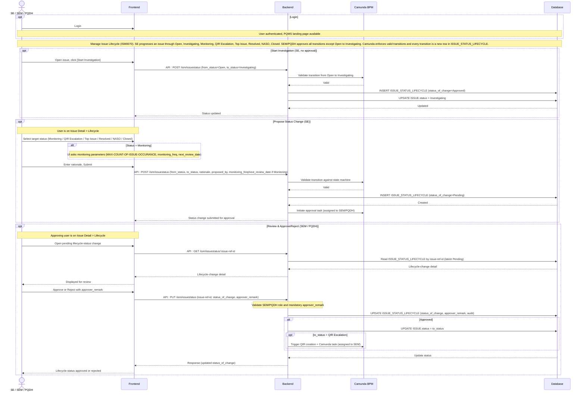
```mermaid
sequenceDiagram
    actor User as SE / SEM / PQDH
    participant FE as Frontend
    participant BE as Backend
    participant CAM as Camunda BPM
    participant DB as Database

    opt Login
        User->>FE: Login
        note over User,DB: User authenticated, PQMS landing page available
    end

    note over User,DB: Manage Issue Lifecycle (ISM0070). SE progresses an issue through Open, Investigating, Monitoring, QIR Escalation, Top Issue, Resolved, NASO, Closed. SEM/PQDH approves all transitions except Open to Investigating. Camunda enforces valid transitions and every transition is a new row in ISSUE_STATUS_LIFECYCLE.

    opt Start Investigation (SE, no approval)
        User->>FE: Open issue, click [Start Investigation]
        FE->>BE: API : POST /ism/issuestatus  (from_status=Open, to_status=Investigating)
        BE->>CAM: Validate transition from Open to Investigating
        CAM-->>BE: Valid
        BE->>DB: INSERT ISSUE_STATUS_LIFECYCLE (status_of_change=Approved)
        BE->>DB: UPDATE ISSUE.status = Investigating
        DB-->>BE: Updated
        BE-->>FE: Status updated
    end

    opt Propose Status Change (SE)
        note over User,FE: User is on Issue Detail > Lifecycle
        User->>FE: Select target status (Monitoring / QIR Escalation / Top Issue / Resolved / NASO / Closed)
        alt Status = Monitoring
            note over FE: UI asks monitoring parameters (MAX-COUNT-OF-ISSUE-OCCURANCE, monitoring_freq, next_review_date)
        end
        User->>FE: Enter rationale, Submit
        FE->>BE: API : POST /ism/issuestatus  (from_status, to_status, rationale, proposed_by, monitoring_freq/next_review_date if Monitoring)
        BE->>CAM: Validate transition against state machine
        CAM-->>BE: Valid
        BE->>DB: INSERT ISSUE_STATUS_LIFECYCLE (status_of_change=Pending)
        DB-->>BE: Created
        BE->>CAM: Initiate approval task (assigned to SEM/PQDH)
        BE-->>FE: Status change submitted for approval
    end

    opt Review & Approve/Reject (SEM / PQDH)
        note over User,FE: Approving user is on Issue Detail > Lifecycle
        User->>FE: Open pending lifecycle-status change
        FE->>BE: API : GET /ism/issuestatus/:issue-ref-id
        BE->>DB: Read ISSUE_STATUS_LIFECYCLE by issue-ref-id (latest Pending)
        DB-->>BE: Lifecycle-change detail
        BE-->>FE: Lifecycle-change detail
        FE-->>User: Displayed for review

        User->>FE: Approve or Reject with approver_remark
        FE->>BE: API : PUT /ism/issuestatus  (issue-ref-id, status_of_change, approver_remark)
        note over BE: Validate SEM/PQDH role and mandatory approver_remark
        BE->>DB: UPDATE ISSUE_STATUS_LIFECYCLE (status_of_change, approver_remark, audit)
        alt Approved
            BE->>DB: UPDATE ISSUE.status = to_status
            opt to_status = QIR Escalation
                BE->>CAM: Trigger QIR creation + Camunda task (assigned to SEM)
            end
        end
        DB-->>BE: Update status
        BE-->>FE: Response (updated status_of_change)
        FE-->>User: Lifecycle status approved or rejected
    end
```

##### 3.2.9.4.5. Frontend

1) Lifecycle-status action i.e. Change-Status buttons (Monitoring / QIR Escalation / Top Issue / Resolved / NASO / Closed) shown per current status's valid next-transitions (Camunda-driven), plus a one-click [Start Investigation] for Open > Investigating.
2) Monitoring selection reveals monitoring-parameter fields (MAX-COUNT-OF-ISSUE-OCCURANCE, frequency, next review date) inline before submission.
3) All non-Investigating transitions require a rationale field before submission.
4) Approving-role view (SEM/PQDH) shows the pending lifecycle-change detail, plus Approve/Reject actions with a mandatory approver-remark field.
5) Once approved, the lifecycle-change record renders read-only; current ISSUE.status reflects the new state.

##### 3.2.9.4.6. Backend

1) Propose-transition endpoint validates the requested transition against the Camunda state machine before creating a Pending ISSUE_STATUS_LIFECYCLE row, invalid transitions (e.g. Resolved > Investigating) are rejected.
2) Open > Investigating is auto-approved (no SEM/PQDH task) since no approval is required for that transition.
3) Approve/Reject endpoint validates caller has SEM or PQDH role and a non-empty approver_remark before updating status_of_change; on Approved, updates ISSUE.status to the new lifecycle status.
4) On approved transition to QIR Escalation, directly triggers QIR creation and a Camunda task assigned to SEM, this is the escalation mechanism. There is no separate ISM0110 (Escalation Management) screen/function; escalation to QIR is handled entirely through this lifecycle workflow, confirmed with the author.
5) On approved transition to Top Issue, flags the issue for org-wide visibility (implementation TBD).

##### 3.2.9.4.7. Database

- ISSUE_STATUS_LIFECYCLE
- ISSUE

#### 3.2.9.5. Notes, Issue & Assumption

1) [Issue Lifecycle Status] set is [Open, Investigating, Monitoring, QIR Escalation, Top Issue, Resolved, NASO, Closed], supersedes the earlier disposition-code model entirely (no more ~~No-Issue/Monitor/Escalate-to-QIR/Escalate-to-TSB~~ vocabulary).
2) `status_of_change` enumerated values [Pending, Approved, Rejected].
3) Open item: exact Camunda state-transition graph (which statuses can transition to which) needs formal definition, draft assumption above has Investigating as the hub state, with Monitoring able to re-enter Investigating; needs confirmation.
4) Open item: "Top Issue" flagging mechanism (org-wide visibility) full detail TBD, likely covered when QIR Management module is detailed.

---

### 3.2.10. ISM0350 - Re/Assign Engineer (Module: ISM, DONE/Hold)

#### 3.2.10.1. Purpose

The function [Re/Assign Engineer] will enable authorized user to assign or reassign the engineer (Assignee) currently responsible for an issue.

**Delivery phase** : Phase 2.

**Note** : [ISM0350 - Re/Assign Engineer] on hold as business says anybody can login in PQMS and work on Issue/QIR/TSB, so no Re/Assignment needed.

#### 3.2.10.2. Requirement Traceability

**Main BRD 1.1 Reference**

*No standalone FR-ID identified.* Assignment logic is embedded within Issue Entry's Assignee field, backed by [ISSUE_ALLOCATION_RULE DB entity for (group/team routing)] and [ISSUE_ASSIGNMENT_RULE DB entity for (individual workload capping)].

**ISM DRD 1.0 Reference**

*Not explicitly cited in source as a separate chapter* — same pattern as ISM0330. Only the "ISSUE-REASSIGNED" activity-log business rule is stated.

**ISM BRD 1.3 Reference**

*(None found.)*

#### 3.2.10.3. Navigation & Prototype reference

**Navigation**

Issue Management > Issue Detail > Reassign Engineer

**Prototype**

Reference to UX design pattern

#### 3.2.10.4. Solution Approach

##### 3.2.10.4.1. Design Description

The function [Re/Assign Engineer] is embedded with [Issue Detail] function.

1. Available as a capability within ISM0040's Issue Detail tab, not a separate screen — documented in its own chapter here because it's an important step in the issue lifecycle.

2. Reuses the existing Assignee lookup [API : GET /ism/assignee, (Purpose : To fetch list of engineers) already used at Issue Entry — ISM0020] to search/select the new assignee by skill, current load, and classification match.

3. A reason/remark field will be considered optionally, consistent with other override-style actions in this document (Score Override, Disposition, Escalation).

4. Reassignment must respect [ISSUE_ASSIGNMENT_RULE DB Entity] i.e. user's workload-cap logic (same as initial auto-assignment) or is a free manual override that can exceed it.

5. Reassignment should trigger a notification to the old and/or new assignee. Activity-log will be create [Activity-Type : ISSUE-REASSIGNED on Issue#issue-ref-id].

6. Reassignment should trigger as notification to manager on overassignment of [Issue/QIR/TSB] to an individual user. 
   1. [IGNORE_TASK_OVERLOAD_FLAG=Y/N] is the switch to ON/OFF the assignment after overload.
   2. [IGNORE_TASK_OVERLOAD_FLAG=Y/N] shall be configured in [ID_TYPE_CODE_VALUE DB Entity]

##### 3.2.10.4.2. Design Notes

- On reassign of any engineer, activity-log will be created as "ISSUE-REASSIGNED"
- Authorized roles should be able to perform [Issue-Reassignment].

##### 3.2.10.4.3. Actor

- SE : Service Engineer (within own team i.e. issue transfer)

- SEM : Service Engineer Manager (broader reassignment authority)
- PQDH : PQ Department Head (broader reassignment authority)

##### 3.2.10.4.4. Sequence Flow

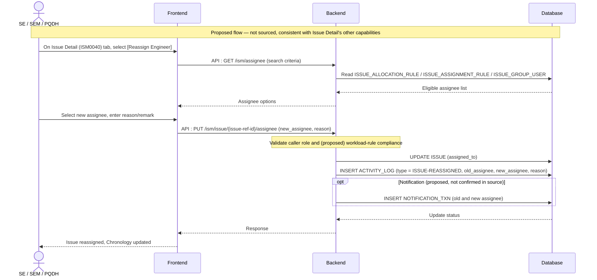
```mermaid
sequenceDiagram
    actor User as SE / SEM / PQDH
    participant FE as Frontend
    participant BE as Backend
    participant DB as Database

    note over User,DB: Proposed flow — not sourced, consistent with Issue Detail's other capabilities

    User->>FE: On Issue Detail (ISM0040) tab, select [Reassign Engineer]
    FE->>BE: API : GET /ism/assignee (search criteria)
    BE->>DB: Read ISSUE_ALLOCATION_RULE / ISSUE_ASSIGNMENT_RULE / ISSUE_GROUP_USER
    DB-->>BE: Eligible assignee list
    BE-->>FE: Assignee options
    User->>FE: Select new assignee, enter reason/remark
    FE->>BE: API : PUT /ism/issue/{issue-ref-id}/assignee (new_assignee, reason)
    note over BE: Validate caller role and (proposed) workload-rule compliance
    BE->>DB: UPDATE ISSUE (assigned_to)
    BE->>DB: INSERT ACTIVITY_LOG (type = ISSUE-REASSIGNED, old_assignee, new_assignee, reason)
    opt Notification (proposed, not confirmed in source)
        BE->>DB: INSERT NOTIFICATION_TXN (old and new assignee)
    end
    DB-->>BE: Update status
    BE-->>FE: Response
    FE-->>User: Issue reassigned, Chronology updated
```

##### 3.2.10.4.5. Frontend

**[Proposed]** Reassign action available within the Issue Detail tab; opens a modal with the assignee search/select control and a required reason field.

##### 3.2.10.4.6. Backend

**[Proposed]** `PUT /ism/issue/{issue-ref-id}/assignee` validates caller role, updates `ISSUE.assigned_to`, and writes the `ISSUE-REASSIGNED` entry to `ACTIVITY_LOG` — the one behavior actually specified in source.

##### 3.2.10.4.7. Database

- ISSUE (assigned_to field)
- ACTIVITY_LOG (ISSUE-REASSIGNED entries — sourced requirement)
- ISSUE_ALLOCATION_RULE, ISSUE_ASSIGNMENT_RULE, ISSUE_GROUP_USER (proposed — reused from ISM0020's assignment logic)
- NOTIFICATION_TXN (proposed, not confirmed)

#### 3.2.10.5. Notes, Issue & Assumption

- This function's source material is limited to two facts: it's embedded in Issue Detail, and it writes an "ISSUE-REASSIGNED" activity-log entry. Everything else in this section (Actor, Sequence Flow, Frontend, Backend, most of Database) is a proposed default design pattern.

---

### 3.2.11. ISM0090 - Manage Parts Request (Module: ISM, DONE)

#### 3.2.11.1. Purpose

To allow authorized users (SE/PQDH) to submit and track spare-part requests linked to a quality issue, with part data sourced from SAP BW/4HANA (INT-04) and an urgency-based approval workflow.

#### 3.2.11.2. Requirement Traceability

**Main BRD 1.1 Reference**

- Chapter : 7.7 Parts Request
  - ISM-FR-050 (submission, part lookup via INT-04)
  - ISM-FR-051 (status lifecycle via Camunda)

**ISM DRD 1.0 Reference**

- Chapter : ISM0090 — Parts Request;

**ISM BRD 1.3 Reference**

*(None found — ISM BRD 1.3's dedicated sections cover ISM0010/0020/0040 only.)*

#### 3.2.11.3. Navigation & Prototype reference

**Navigation**

Issue Management > Issue Detail > Parts Request

**Prototype**

Reference to UX design pattern

#### 3.2.11.4. Solution Approach

##### 3.2.11.4.1. Design Description

1) User submits a parts request linked to an issue with details Part Number (searched via INT-04 SAP BW), Description (auto-populated), SAP Material Number (auto-populated), Current Cost (auto-populated), Quantity, Urgency (Routine / Priority / Emergency), Investigation Purpose, Needed By Date.

2) User will search Part Number from SAP BW/4HANA (INT-04) live and gets description, SAP material number, and current cost for the requester to confirm before submitting.

3) **Approval rule** 
   1) Priority and Emergency urgency requests require SEM approval before proceeding. 
   2) Routine urgency requests are **auto-approved within 24 hours**, no SEM action required, though the request still passes through the same status lifecycle.

4) **Status lifecycle (Camunda driven)**
   1) Submitted > Approved > Ordered > Received. 
   2) For Routine requests, "Approved" is set automatically by the 24-hour auto-approval job rather than by a SEM action.

5) PRIORITY field is the dropdown field, which shall be populated via ID_TYPE API.

6) Multiple part-requests are allowed per issue. The function [ISM0090 - Manage Part Request] is standard CRUD operation, which allows to search & list request, create or edit part-request via API.
   1) [API : GET /ism/{issue-ref-id}/parts {search criteria} (Purpose : To get part requests by issue-ref-id or other search criteria)]
   2) [API : POST /ism/{issue-ref-id}/part {..} (Purpose : To create new part request with issue-ref-id)]
   3) [API : PUT /ism/{issue-ref-id}/part {..} (Purpose : To update existing part request with issue-ref-id & part_req_id)]
   4) [API : DELETE /ism/{issue-ref-id}/part {..} (Purpose : To delete part request by issue-ref-id)]
   5) [DB Entity : PART_REQUEST, PART_MASTER]

##### 3.2.11.4.2. Design Notes

1) N-PQMS will performs a live lookup at request time and stores only a point-in-time snapshot of part number/description/cost directly on [PART_REQUEST]. 
2) Parts master data (description, SAP material number, cost) is owned by SAP BW/4HANA (INT-04) as the system of record; [PART_MASTER] is a locally-synced lookup copy for search, not the system of record.
3) 24-hour Routine auto-approval job shall be implemented on Camunda server (schedule, batch vs. per-request timer).

##### 3.2.11.4.3. Actor

Per Role × Feature access matrix (§6.2.9):

- SE : Service Engineer (Read/Write — submit)
- PQDH : PQ Department Head (Read/Write — submit; also covers prior read-only review)
- SEM : Service Engineer Manager (Approve — Priority/Emergency only)
- OPSADM : Operation Admin (Read-only)

##### 3.2.11.4.4. Sequence Flow

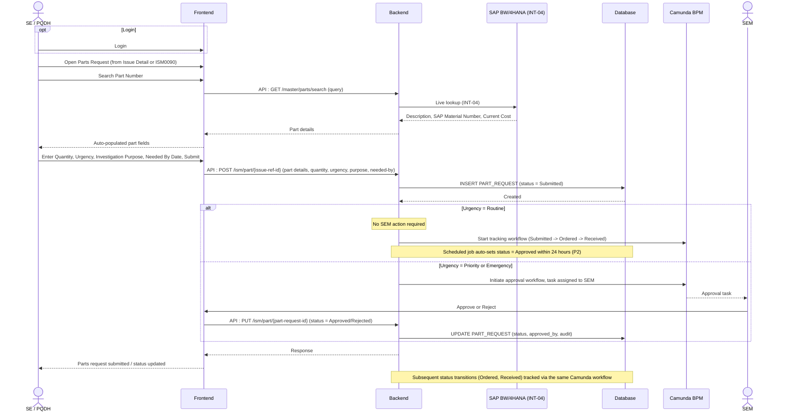
```mermaid
sequenceDiagram
    actor User as SE / PQDH
    participant FE as Frontend
    participant BE as Backend
    participant INT04 as SAP BW/4HANA (INT-04)
    participant DB as Database
    participant CAM as Camunda BPM
    actor SEM as SEM

    opt Login
        User->>FE: Login
    end

    User->>FE: Open Parts Request (from Issue Detail or ISM0090)
    User->>FE: Search Part Number
    FE->>BE: API : GET /master/parts/search (query)
    BE->>INT04: Live lookup (INT-04)
    INT04-->>BE: Description, SAP Material Number, Current Cost
    BE-->>FE: Part details
    FE-->>User: Auto-populated part fields

    User->>FE: Enter Quantity, Urgency, Investigation Purpose, Needed By Date, Submit
    FE->>BE: API : POST /ism/part/{issue-ref-id} (part details, quantity, urgency, purpose, needed-by)
    BE->>DB: INSERT PART_REQUEST (status = Submitted)
    DB-->>BE: Created

    alt Urgency = Routine
        note over BE: No SEM action required
        BE->>CAM: Start tracking workflow (Submitted -> Ordered -> Received)
        note over BE,DB: Scheduled job auto-sets status = Approved within 24 hours (P2)
    else Urgency = Priority or Emergency
        BE->>CAM: Initiate approval workflow, task assigned to SEM
        CAM-->>SEM: Approval task
        SEM->>FE: Approve or Reject
        FE->>BE: API : PUT /ism/part/{part-request-id} (status = Approved/Rejected)
        BE->>DB: UPDATE PART_REQUEST (status, approved_by, audit)
    end

    BE-->>FE: Response
    FE-->>User: Parts request submitted / status updated

    note over BE,DB: Subsequent status transitions (Ordered, Received) tracked via the same Camunda workflow
```

##### 3.2.11.4.5. Frontend

1) Part Number field with live search-as-you-type against INT-04; selecting a result will auto-populate Description, SAP Material Number, Current Cost (read-only, sourced live).
2) Urgency selector (Routine / Priority / Emergency), selecting Priority/Emergency will surface a note that SEM approval is required, while Routine will surface a note of auto-approve within 24 hours.
3) List/manage view (ISM0090) will show all parts requests across issues (scoped by role); while Issue Detail's Parts tab shows only the requests for that specific issue.
4) Status badge reflects the 4-stage lifecycle (Submitted / Approved / Ordered / Received) consistently across both views.

##### 3.2.11.4.6. Backend

1) [API : GET /master/parts {serach criteria} (Purpose : performs a live INT-04 lookup to get PART record)]
2) [API : POST /ism/part/{issue-ref-id} creates the request with `status = Submitted`]; for Routine urgency, also registers the request with the 24-hour auto-approval job; for Priority/Emergency, initiates the Camunda approval workflow with a SEM task.
3) Approval endpoint will validate SEM role before updating `status = Approved` (or `Rejected`) for Priority/Emergency requests.
4) Subsequent status transitions (Ordered, Received) are tracked via the same Camunda workflow instance for both urgency paths.

##### 3.2.11.4.7. Database

1) PART_REQUEST 
2) PART_MASTER
3) ISSUE

#### 3.2.11.5. Notes, Issue & Assumption

---

### 3.2.12. ISM0100 - Communication Log (Module: ISM, DONE)

#### 3.2.12.1. Purpose

To maintain a full threaded communication log per issue i.e. internal comments, cross-org (external) messages, and auto-captured outbound emails with rich text, attachments, and mention support. 

Distinct from Notification (email alerts on system events) — see the existing clarification under Notification Engine Framework, "Notification is just related to email-notification, while communication-log is comments & follows captured by user on any issue."

#### 3.2.12.2. Requirement Traceability

**Main BRD 1.1 Reference**

- Chapter : 7.8 Communication Log
  - ISM-FR-060 (threaded log: internal comments, email correspondence, cross-org messages)
  - ISM-FR-061 (role-stamped, timestamped, no deletion — soft-hide by Admin only)
  - ISM-FR-062 (P2 — auto-capture outbound emails)

**ISM DRD 1.0 Reference**

- Chapter : ISM0100 — Communication Log (6 FRs) — exact chapter number not captured in extraction.

**ISM BRD 1.3 Reference**

*(None found — ISM BRD 1.3's dedicated sections cover ISM0010/0020/0040 only.)*

#### 3.2.12.3. Navigation & Prototype reference

**Navigation**

Issue Management > Issue Detail > Communication Log

**Prototype**

Reference to UX design pattern

#### 3.2.12.4. Solution Approach

##### 3.2.12.4.1. Design Description

1) **[ISM0100 - Communication Log]** function will allow users to perform following activities
   1) Add comment/remark with an [Issue/QIR/TSB]
   2) Show comment/remark list in chronological order
   3) Trigger notification for comment/remarks having [@mention for userid or teamid]. [@mention for userid or teamid] should be validation before comment/remark is posted.

2) **[ISM0100 - Communication Log]** function displays the comments/remarks captured recarding the single issue.

3) **Comminication Log entries** will be shown in reverse-chronological order with role/name badge, timestamp, body (rich text), attachments.

4) **Comminication Log types:** **Internal Comment** (KUS-internal visibility), **External** (cross-org — visible), **Email** (auto-captured outbound/inbound correspondence).

5) **Compose panel:** message-type selector, rich text editor, attachment upload, Post button.

6) **Immutability rule:** entries cannot be deleted by any role.

7) **@mention:** mentioning a user in a comment triggers an email notification to that user, fired through the Notification Engine Framework; the mention is content within the comment body, the notification is a side effect of posting it.

8)  External-type comments are only postable by users with cross-org visibility on the issue, or by internal SEM/PQDH on their behalf — exact cross-org access rule is TBD (Cross-Org Visibility was scoped out as a separate chapter).

9)  Attachments reuse the same [DOCUMENT DB entity] established in ISM0020.

##### 3.2.12.4.2. Design Notes

None

##### 3.2.12.4.3. Actor

Per Role × Feature access matrix:

**Read/Write**
- SE : Service Engineer
- PQDH : PQ Department Head
- SEM : Service Engineer Manager
- OPSADM : Operation Admin

**Read-only**
- PUBCOO : Publication Coordinator

##### 3.2.12.4.4. Sequence Flow

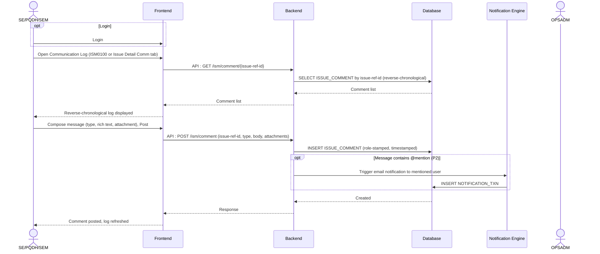
```mermaid
sequenceDiagram
    actor User as SE/PQDH/SEM
    participant FE as Frontend
    participant BE as Backend
    participant DB as Database
    participant NM as Notification Engine
    actor OPSADM as OPSADM

    opt Login
        User->>FE: Login
    end

    User->>FE: Open Communication Log (ISM0100 or Issue Detail Comm tab)
    FE->>BE: API : GET /ism/comment/{issue-ref-id}
    BE->>DB: SELECT ISSUE_COMMENT by issue-ref-id (reverse-chronological)
    DB-->>BE: Comment list
    BE-->>FE: Comment list
    FE-->>User: Reverse-chronological log displayed

    User->>FE: Compose message (type, rich text, attachment), Post
    FE->>BE: API : POST /ism/comment (issue-ref-id, type, body, attachments)
    BE->>DB: INSERT ISSUE_COMMENT (role-stamped, timestamped)
    opt Message contains @mention (P2)
        BE->>NM: Trigger email notification to mentioned user
        NM->>DB: INSERT NOTIFICATION_TXN
    end
    DB-->>BE: Created
    BE-->>FE: Response
    FE-->>User: Comment posted, log refreshed

```

##### 3.2.12.4.5. Frontend

1) Reverse-chronological list with role/name badge, timestamp, rich-text body, attachment previews.

2) Compose panel with message-type selector (Internal / External / Email is auto-only, not user-selectable), rich text editor, attachment upload.

3) Filter by message type.

4) Same component reused between the standalone ISM0100 screen and the embedded ISM0040 Communication tab.

##### 3.2.12.4.6. Backend

1) [API : GET /ism/comment/{issue-ref-id} (Purpose : To fetch reverse-chronological comment log entry list)].
2) [API : POST /ism/comment (Purpose : creates a role-stamped, timestamped comment log entry)].

##### 3.2.12.4.7. Database

- ISSUE_COMMENT (comment_id, issue_ref_id, comment_type [Internal/External/Email], body, author, author_role, hidden flag, audit-fields)
- DOCUMENT (attachments)
- NOTIFICATION_TXN (mention-triggered notifications)

#### 3.2.12.5. Notes, Issue & Assumption

None

---

### 3.2.13. Issue Hierarchy Management (Cross-cutting, AR#1)

#### 3.2.13.1. Purpose

All issues under the same classification form a tree — a root issue connected through parent-child edges down to every leaf issue. This chapter defines how the full hierarchy (not just immediate ties) is maintained and exposed, on top of the existing Linked/Suggested Issue mechanism (ISM0020, ISM0040).

**Option-1 : Simple 1 level parent-child issue tree**

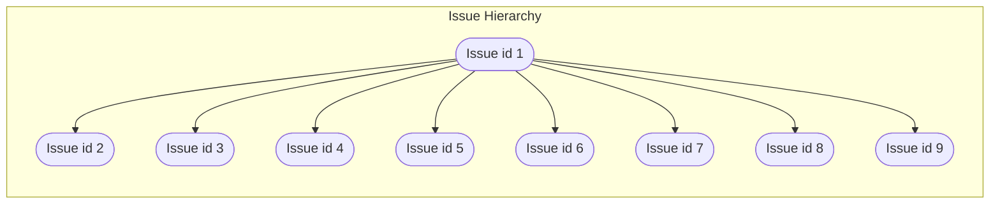
```mermaid
flowchart TB
    subgraph HIER["Issue Hierarchy"]
        direction TB
        I1(["Issue id 1"])
        I2(["Issue id 2"])
        I3(["Issue id 3"])
        I4(["Issue id 4"])
        I5(["Issue id 5"])
        I6(["Issue id 6"])
        I7(["Issue id 7"])
        I8(["Issue id 8"])
        I9(["Issue id 9"])

        I1 --> I2
        I1 --> I3
        I1 --> I4
        I1 --> I5
        I1 --> I6
        I1 --> I7
        I1 --> I8
        I1 --> I9
    end
```

**Option-2 : Nested N level parent-child issue hierarchy**

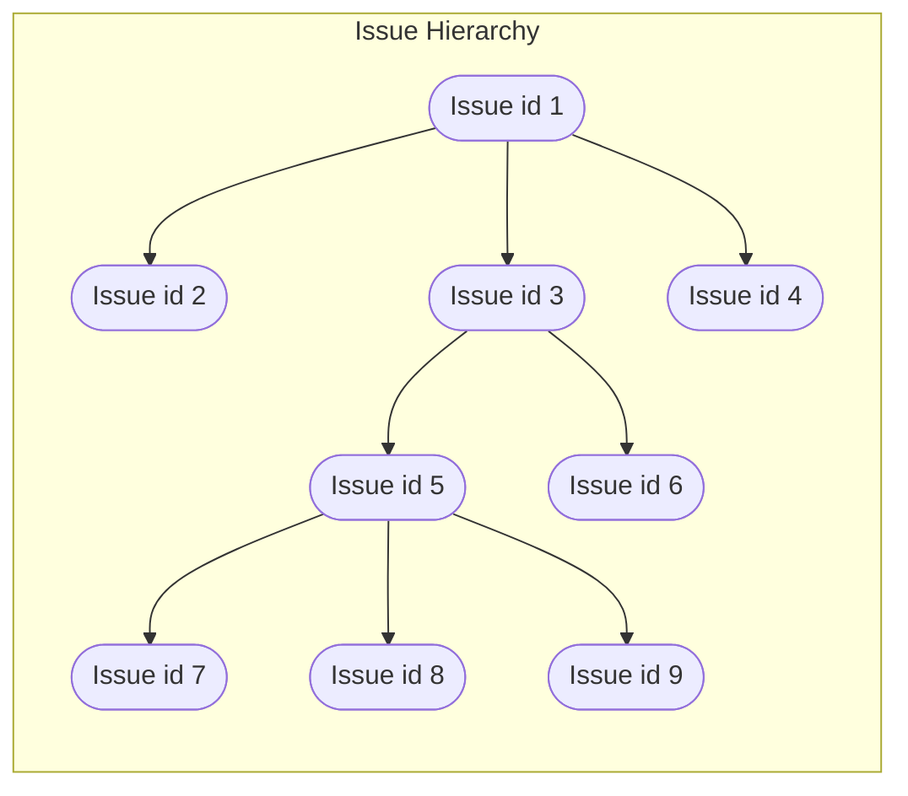
```mermaid
flowchart TB
    subgraph HIER["Issue Hierarchy"]
        direction TB
        I1(["Issue id 1"])
        I2(["Issue id 2"])
        I3(["Issue id 3"])
        I4(["Issue id 4"])
        I5(["Issue id 5"])
        I6(["Issue id 6"])
        I7(["Issue id 7"])
        I8(["Issue id 8"])
        I9(["Issue id 9"])

        I1 --> I2
        I1 --> I3
        I1 --> I4

        I3 --> I5
        I3 --> I6

        I5 --> I7
        I5 --> I8
        I5 --> I9
    end
```

**Conclusion 1-Level vs N-Level Hierarchy**
During experience design discussion, it is confirmed by business that N-Level hierarchy is not the relevant case or very rare case, so system shall have 1-Level of issue hierarchy. However this chapter will have future provision ready in database to incorporate N-Level issue hierarchy i.e. issue_id_root will remain available for future use purpose.

#### 3.2.13.2. Design Description

1) `LINKED_ISSUE` and `SUGGESTED_LINK_ISSUE` (Part03 §3.2.4/3.2.5) carry `issue_id_child`, `issue_id_parent`, `issue_id_root` — immediate parent-child edge plus the tree's root, on both entities.
2) At link/suggest time (ISM0020 entry-time tie, ISM0040 Linked/Suggested Issues tab): `issue_id_parent` = the issue being linked to; `issue_id_root` = that issue's own `issue_id_root` if it already has one, else its own `issue_id` (it is already root).
3) [Get Issue List API] (`POST /ism/issues`, API Inventory #33) gains `issue_id_root` as a search-criteria field; response returns `issue_id_child`, `issue_id_parent`, `issue_id_root` per row.
4) **Activities on linking a issue**
   1) Whenever first issue is being added from the search result by given criteria (classification & model). new reported issue will become child and existing issue being linked will become parent. very same time, a issue-group will be created silently having members (parent & child issues)
   2) Whenever, another new issue is reported and try to link with same linked-issue from result of same above criteria (classification & model), the new reported issue will become another child of same existing issue. and same new issue will be added as new issue-group member silently. So the group will have members (parent + 2 child)
   3) While LINK-Button, if classification of reported-issue and classification issue being linked are not matching, system will show alert of classification mismatch and service-engineer will take conscious decision before linking.
   4) If a new reported issue is being linked with issue from search result by same classification but different model detail, this is complete new family & group, no connection with above existing family & group.

#### 3.2.13.3. Impacted Functions

ISM0020, ISM0010 (Get Issue List API), ISM0040 (Linked/Suggested Issues tab)

#### 3.2.13.4. Database

- LINKED_ISSUE
- SUGGESTED_LINK_ISSUE

#### 3.2.13.5. Notes, Issue & Assumption

1) BRD/DRD and HTML prototype updates for this requirement are pending from stakeholders — this chapter reflects functional design only.
2) Open item: flat filtered list (search by root) vs. tree/graph UI — no mock yet.

---

### 3.2.14. Issue Reopen (Soft-Close Lifecycle, AR#2)

#### 3.2.14.1. Purpose

Closed is a soft-close, not a hard-terminating state — a closed issue may be reopened any time after closure. This chapter layers onto ISM0070's existing propose/approve lifecycle pattern.

#### 3.2.14.2. Design Description

1) Reopen follows the same governance as any other lifecycle transition (ISM0070): SE proposes Closed → Open with mandatory rationale; SEM/PQDH reviews and approves/rejects.
2) On approval:
   a) Current ISSUE row (incl. QIR/TSB reference fields held on ISSUE) is copied into `ISSUE_HISTORY` (Part03 §3.2.2), keyed by `issue_id` + `history_datetime`.
   b) All existing `ISSUE_STATUS_LIFECYCLE` rows (the prior lifecycle round, through Closed) move into `ISSUE_STATUS_LIFECYCLE_HISTORY` (Part03 §3.2.22).
   c) `ISSUE.status` is set to Open; the approved Closed→Open transition becomes the first row of the fresh lifecycle round.
3) Two new APIs perform steps 2a/2b as part of the backend's approve-transition flow for Closed→Open — not a separate user-facing action:
   a) `POST /ism/issue/createhistory` — copies ISSUE into ISSUE_HISTORY (step 2a).
   b) `POST /ism/issuestatus/createhistory` — moves ISSUE_STATUS_LIFECYCLE rows into ISSUE_STATUS_LIFECYCLE_HISTORY (step 2b).

#### 3.2.14.3. Impacted Functions

ISM0070 (Closed no longer terminal; Closed→Open added as a valid Camunda transition), ISM0040 (Reopen surfaces as a Change-Status target when status = Closed), History tab (must surface pre-reopen history)

#### 3.2.14.4. Database

- ISSUE_HISTORY
- ISSUE_STATUS_LIFECYCLE_HISTORY

#### 3.2.14.5. Notes, Issue & Assumption

1) BRD/DRD and HTML prototype updates for this requirement are pending from stakeholders — this chapter reflects functional design only.
2) Cross-reference: ISM0070 §3.2.9.4.1 item 8 updated in the same pass to reflect Closed is reopenable.

---

## 3.3. PQMS Overview (Dashboard) 

### 3.3.1. PQMS Overview (Dashboard) (Module : ISM, DONE)

#### 3.3.1.1. Purpose

To provide a centralized landing page showing the logged-in user's action items, attention-required issues, recently accessed records, and module-wise count/health summary across Issue, QIR, and Publication management.

#### 3.3.1.2. Requirement Traceability

**Main BRD 1.1 Reference**

- *No standalone chapter identified — §13 Reporting & Dashboard is a separate KPI/analytics dashboard for SEM/PUBCOO/PQDH/OPSADM, not this landing page.*

**ISM DRD 1.0 Reference**

- *Not explicitly cited in source.*

**ISM BRD 1.5 Reference**
- Chapter : 7.1 NPQMS — Overview (FR-ISMOVE-001 to 013)

#### 3.3.1.3. Navigation & Prototype reference

**Navigation**

Landing page of PQMS EP URL

**Prototype** (Reference to UX design pattern)  

#### 3.3.1.4. Solution Approach

##### 3.3.1.4.1. Design Description

**Following features to be incorporated in [Dashboard] function**
1) Login user information
2) Notification Bell with Count Summary
3) Grid for [Module wise count summary] for issues, QIRs & Publications
4) Grid for [My-Action] segregated by due-today or overdue 
5) Grid for [Attention Required]
6) Grid for [Recently accessed issues]
7) Grid for [Life Cycle Health]
8) Links
   1) Listing page on click of [Issue/QIR/TSB] summary card
   2) Listing page on click of [View all]
   3) Detail detail page on click of [Issue/QIR/TSB] row.

**Login user information**  

1) Post successfull login, [user] & [access] information shall be cached throughout the session
2) [user] & [access] shall be used to show relevant user & role information on [Dashboard] page

**Notification Bell with Count Summary**

1) Notification count summary shall be fetched by respective API
   1) [API : GET /nm/notification/count/unread (criteria unread, date-range) (Purpose : To fetch notification count in given date-range for unread status)]
   2) [API : POST /nm/notification/count/unread (criteria unread, date-range) (Purpose : To mark notification unread status to read status)]

**Module wise count summary**  

1) All key modules [Issue Management], [QIR Management] & [Publication Management] shall maintain [Transaction-Count-Summary] in respective PQMS aggregation DB entity
   1) Dedicated [COUNT-SUMMARY] DB entities 
      1) [ISSUE_COUNT_SUMMARY DB entity] : to keep Issue count summary
      2) [QIR_COUNT_SUMMARY DB entity] : to keep QIR count summary
      3) [TSB_COUNT_SUMMARY DB entity] : to keep Publication count summary
   2) Shared [COUNT-SUMMARY] DB entities
      1) [PQI_COUNT_SUMMARY DB entity] : to keep count summary for all modules
      2) PQI : Publication, QIR, Issue management modules
   3) Decision to go with [PQI_COUNT_SUMMARY DB entity] due to reusability, simplicity & low-volume. If in future data grows heavily, [PQI_COUNT_SUMMARY DB entity] can be broken into module-wise DB entities.

2) [PQI_COUNT_SUMMARY] or [ISSUE_COUNT_SUMMARY, QIR_COUNT_SUMMARY & TSB_COUNT_SUMMARY] shall be updated by respective API via respective entry/registration functions 
   1) [API : POST /ism/pqicountsummary {issue/qir/publication count update request} (Purpose : To update count of PQI on entry or status update) in [PQI_COUNT_SUMMARY DB entity]]

   2)          --------- OR -----------

   3) [API : POST /ism/issuecountsummary {issue request} (Purpose : To update issue count on entry or status update) in [ISSUE_COUNT_SUMMARY DB entity]]
   4) [API : POST /qir/qircountsummary {qir request} (Purpose : To update qir count on entry or status update) in [QIR_COUNT_SUMMARY DB entity]]
   5) [API : POST /tsb/tsbcountsummary {tsb request} (Purpose : To update tsb count on entry or status update) in [TSB_COUNT_SUMMARY DB entity]]

3) Count summary information shall be fetched from [PQI_COUNT_SUMMARY] or [ISSUE_COUNT_SUMMARY, QIR_COUNT_SUMMARY & TSB_COUNT_SUMMARY] DB enties via respective API
   1) [API : GET /ism/pqicountsummary {module name / all} (Purpose : To fetch count by module name or all) from [PQI_COUNT_SUMMARY DB entity]]

   2)          --------- OR -----------

   3) [API : GET /ism/issuecountsummary (Purpose : To fetch count for ISM module)]
   4) [API : GET /ism/issuecountsummary (Purpose : To fetch count for QIR module)]
   5) [API : GET /ism/issuecountsummary (Purpose : To fetch count for TSB module)]

**[My-Action] segregated by due-today or overdue (across PQI)**  

**Issue**  

1) [Issue-list] will be displayed via API [API : GET /ism/issues {search criteria : user-id, status, date-range} (Purpose : To get ISSUEs list by given criteria)]
2) On click of [All | Due today | Overdue], API shall be called with revised serach criteria
3) On click of [Open] @ each row, user shall be redirected to respective [Issue Detail] page

**QIR**

1) [qir-list] will be displayed via API [API : GET /qir/qirs {search criteria : user-id, status, date-range} (Purpose : To get QIRs list by given criteria)]
2) On click of [All | Due today | Overdue], API shall be called with revised serach criteria
3) On click of [Open] @ each row, user shall be redirected to respective [QIR Detail] page

**TSB**  

1) [tsb-list] will be displayed via API [API : GET /tsb/tsbs {search criteria : user-id, status, date-range} (Purpose : To get TSBs list by given criteria)]
2) On click of [All | Due today | Overdue], API shall be called with revised serach criteria
3) On click of [Open] @ each row, user shall be redirected to respective [TSB Detail] page

**Consolidation of [My Action] for modules Issue/QIR/TSB (BFF API)**  

1) [API : GET /ism/allactions {search criteria : user-id, status, date-range} (Purpose : To get consolidated list of Issue/QIR/TSB by given criteria)]
2) On click of [All | Due today | Overdue], API shall be called with revised serach criteria
3) On click of [Open] @ each row, user shall be redirected to respective [Issue/QIR/TSB Detail] page

**Attention Required**  

- Same as data in [My-Action] grid with different criteria marked by system assessment.
- Note : what will be the search criteria to identify High-impact records to investigate or monitor from [Issue | QIR | TSB]?

**Recently accessed issues**  

- Same as data in [My-Action] grid with different search criteria marked by system assessment.
- Search criteria for recently accessed : {user_id, created_datetime or updated_datetime < current_datetime - 2}
- Configuration for RECENT_DAYS_COUNT = 2 (Proposed).

**Life Cycle Health**  

- Same as data in [Module wise count summary] grid with different criteria marked by system assessment.

##### 3.3.1.4.2. Design Notes

None

##### 3.3.1.4.3. Actor

All user roles

##### 3.3.1.4.4. Sequence Flow

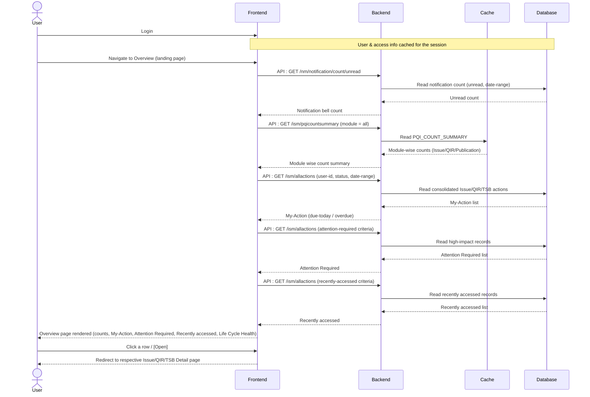
```mermaid
sequenceDiagram
    actor User
    participant FE as Frontend
    participant BE as Backend
    participant Cache as Cache
    participant DB as Database

    User->>FE: Login
    note over FE,DB: User & access info cached for the session

    User->>FE: Navigate to Overview (landing page)

    FE->>BE: API : GET /nm/notification/count/unread
    BE->>DB: Read notification count (unread, date-range)
    DB-->>BE: Unread count
    BE-->>FE: Notification bell count

    FE->>BE: API : GET /ism/pqicountsummary (module = all)
    BE->>Cache: Read PQI_COUNT_SUMMARY
    Cache-->>BE: Module-wise counts (Issue/QIR/Publication)
    BE-->>FE: Module wise count summary

    FE->>BE: API : GET /ism/allactions (user-id, status, date-range)
    BE->>DB: Read consolidated Issue/QIR/TSB actions
    DB-->>BE: My-Action list
    BE-->>FE: My-Action (due-today / overdue)

    FE->>BE: API : GET /ism/allactions (attention-required criteria)
    BE->>DB: Read high-impact records
    DB-->>BE: Attention Required list
    BE-->>FE: Attention Required

    FE->>BE: API : GET /ism/allactions (recently-accessed criteria)
    BE->>DB: Read recently accessed records
    DB-->>BE: Recently accessed list
    BE-->>FE: Recently accessed

    FE-->>User: Overview page rendered (counts, My-Action, Attention Required, Recently accessed, Life Cycle Health)

    User->>FE: Click a row / [Open]
    FE-->>User: Redirect to respective Issue/QIR/TSB Detail page
```

##### 3.3.1.4.5. Frontend

User interface development as per UX Prototype 

##### 3.3.1.4.6. Backend

Backend API explained in [Design Description] section

##### 3.3.1.4.7. Database

Cache for personalized grid location preference

#### 3.3.1.5. Notes, Issue & Assumption

---

# 4. Module : Admin functions & Master Data

## 4.1. Admin Functions 

## 4.2. Master Data

### 4.2.1. ISM0200 - Manage Classification Fields (Module: Master Data, DONE)

#### 4.2.1.1. Purpose

This ADM0200 screen manages master data for **System, Sub-system, Component, and Symptom** — the 4 PQMS-native classification fields that lack an external system of record. 

#### 4.2.1.2. Requirement Traceability

**Main BRD 1.1 Reference**

*No standalone FR-ID identified for classification-field.*

**ISM DRD 1.0 Reference**

*Not explicitly cited in source as a separate chapter.* 

**ISM BRD 1.3 Reference**
- Chapter : 6.2 Vehicle Classification Hierarchy (6-Level Cascade)
- Chapter : 6.3 System Classification Keys — Searchable Combobox with Master Data (FR-CBX-001 to 011, FR-ADM-001 to 004)

#### 4.2.1.3. Navigation & Prototype reference

**Navigation**

Master data > Classification Fields 

**Prototype** (Reference to UX design pattern)  

**New Classification Key (System Code)**  

#### 4.2.1.4. Solution Approach

##### 4.2.1.4.1. Design Description

[Manage Classification Fields] is function that will maintain 4 classification fields which shall be used for issue search which issue-entry and issue-listing. [Manage Classification Fields] is a standard CRUD operation based UI function. Authorized used [PQDH/SEM] shall approve the new value added to classification fields

   1) PQMS classifies the issue under 7 correlation/classification fields [Model Year > Model > Variant > System > Sub-system > Component > Sympton]
   2) 4 classification fields [System, Subsustem, Component & Symptom code] will be dropdown fields, for which data will be populated via respective APIs 
      1) [API : GET /master/classificationkey; 
          GET /master/classificationkey/{system-code}/subsystems; 
          GET /master/classificationkey/{system-code}/{sub-system}/component; 
          GET /master/classificationkey/{system-code}/{sub-system-code}/{component-code}/symptoms; 
          (Purpose : To fetch system, sub-system, component, symptoms)]  
      2) [DB Entity : CLASSIFICATION_KEY]
      3) CLASSIFICATION_KEY key fiels : [system_code, sub_system_code, component_code, symptom_code, description field for each code].

   3) SE engineer will perform CRUD operation before sending for approval i.e. user shall be able to perform below action
      1) Add values via API [API : POST /master/classificationkey (Purpose : Add new values)]
      2) Edit values via API [API : PUT /master/classificationkey (Purpose : Update new values)]
      3) Get values via API [API : GET /master/classificationkey (Purpose : Fetch values)]
      4) Delete values via API [API : DELETE /master/classificationkey (Purpose : Delete values)]
      5) Search & List values via API [API : POST /master/classificationkey {search fields} (Purpose : Search & fetch result)]

   4) PQDH/SEM will perfrom approval or reject operation 
      1) View list of pending value via API [API : POST /master/classificationkey {search fields} (Purpose : Search & fetch result)]
      2) View value details via API [API : GET /master/classificationkey (Purpose : Fetch values)]
      3) Approve values via API [API : PUT /master/classificationkey (Purpose : Update new values)]
      4) Reject values with remark via API [API : PUT /master/classificationkey (Purpose : Update new values)]

   5) **OPSADM (IT-admin capacity, per ISM BRD 1.3 FR-ADM series):** separately handles value deactivation and defines parent-child relationships between classification levels (P2) — distinct from the SE-propose / PQDH-SEM-approve workflow above.

##### 4.2.1.4.2. Design Notes

None

##### 4.2.1.4.3. Actor

- SE : for value addition
- PQDH/SEM : for value approval (business-admin capacity)
- OPSADM : for deactivation and parent-child hierarchy configuration (IT-admin capacity)

##### 4.2.1.4.4. Sequence Flow

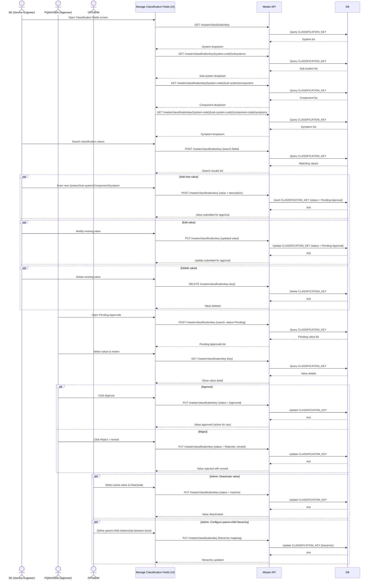
```mermaid
sequenceDiagram
    actor SE as SE (Service Engineer)
    actor APR as PQDH/SEM (Approver)
    actor ADM as OPSADM
    participant UI as Manage Classification Fields (UI)
    participant MST as Master API
    participant DB as DB

    %% Dropdown population (cascade)
    SE->>UI: Open Classification Fields screen
    UI->>MST: GET /master/classificationkey
    MST->>DB: Query CLASSIFICATION_KEY
    DB-->>MST: System list
    MST-->>UI: System dropdown
    UI->>MST: GET /master/classificationkey/{system-code}/subsystems
    MST->>DB: Query CLASSIFICATION_KEY
    DB-->>MST: Sub-system list
    MST-->>UI: Sub-system dropdown
    UI->>MST: GET /master/classificationkey/{system-code}/{sub-system}/component
    MST->>DB: Query CLASSIFICATION_KEY
    DB-->>MST: Component list
    MST-->>UI: Component dropdown
    UI->>MST: GET /master/classificationkey/{system-code}/{sub-system-code}/{component-code}/symptoms
    MST->>DB: Query CLASSIFICATION_KEY
    DB-->>MST: Symptom list
    MST-->>UI: Symptom dropdown

    %% SE - Search & List
    SE->>UI: Search classification values
    UI->>MST: POST /master/classificationkey {search fields}
    MST->>DB: Query CLASSIFICATION_KEY
    DB-->>MST: Matching values
    MST-->>UI: Search results list

    %% SE - Add
    opt Add new value
        SE->>UI: Enter new System/Sub-system/Component/Symptom
        UI->>MST: POST /master/classificationkey {value + description}
        MST->>DB: Insert CLASSIFICATION_KEY (status = Pending Approval)
        DB-->>MST: Ack
        MST-->>UI: Value submitted for approval
    end

    %% SE - Edit
    opt Edit value
        SE->>UI: Modify existing value
        UI->>MST: PUT /master/classificationkey {updated value}
        MST->>DB: Update CLASSIFICATION_KEY (status = Pending Approval)
        DB-->>MST: Ack
        MST-->>UI: Update submitted for approval
    end

    %% SE - Delete
    opt Delete value
        SE->>UI: Delete existing value
        UI->>MST: DELETE /master/classificationkey {key}
        MST->>DB: Delete CLASSIFICATION_KEY
        DB-->>MST: Ack
        MST-->>UI: Value deleted
    end

    %% PQDH/SEM - Approval workflow
    APR->>UI: Open Pending Approvals
    UI->>MST: POST /master/classificationkey {search: status=Pending}
    MST->>DB: Query CLASSIFICATION_KEY
    DB-->>MST: Pending value list
    MST-->>UI: Pending Approvals list
    APR->>UI: Select value to review
    UI->>MST: GET /master/classificationkey {key}
    MST->>DB: Query CLASSIFICATION_KEY
    DB-->>MST: Value details
    MST-->>UI: Show value detail

    alt Approve
        APR->>UI: Click Approve
        UI->>MST: PUT /master/classificationkey {status = Approved}
        MST->>DB: Update CLASSIFICATION_KEY
        DB-->>MST: Ack
        MST-->>UI: Value approved (active for use)
    else Reject
        APR->>UI: Click Reject + remark
        UI->>MST: PUT /master/classificationkey {status = Rejected, remark}
        MST->>DB: Update CLASSIFICATION_KEY
        DB-->>MST: Ack
        MST-->>UI: Value rejected with remark
    end

    %% Admin - Deactivation & hierarchy configuration (P2)
    opt Admin: Deactivate value
        ADM->>UI: Select active value & Deactivate
        UI->>MST: PUT /master/classificationkey {status = Inactive}
        MST->>DB: Update CLASSIFICATION_KEY
        DB-->>MST: Ack
        MST-->>UI: Value deactivated
    end

    opt Admin: Configure parent-child hierarchy
        ADM->>UI: Define parent-child relationship between levels
        UI->>MST: PUT /master/classificationkey {hierarchy mapping}
        MST->>DB: Update CLASSIFICATION_KEY (hierarchy)
        DB-->>MST: Ack
        MST-->>UI: Hierarchy updated
    end
```

##### 4.2.1.4.5. Frontend

1) Standard CRUD Frontend UI including provision for approval & reject with remark.
2) Cascading dropdowns (System > Sub-system > Component > Symptom) for browsing/searching existing values, consistent with the combobox pattern used at Issue Entry (ISM0020).
3) Pending-approval queue view for PQDH/SEM, filterable by status.

##### 4.2.1.4.6. Backend

1) Standard CRUD REST API including provision for approval & reject with remark.
2) Approved values become selectable system-wide within 24 hours (per ISM BRD 1.3 §6.3), whether approved here or via the same underlying workflow.
3) If not approved within 24 hours, a reminder notification for approval shall be sent to required user [Notification Type = CLASSIFICATION-FIELD-APPROVAL-REMINDER] 

##### 4.2.1.4.7. Database

- CLASSIFICATION_KEY key fields : [system_code, sub_system_code, component_code, symptom_code, description fields for each]

#### 4.2.1.5. Notes, Issue & Assumption

None

---

### 4.2.2. ISM0360 - Manage Model Master

#### 4.2.2.1. Purpose

To manage MODEL master data (model code, name, year, variant) used for vehicle information at Issue Entry and across ISM/QIM/TSB.

#### 4.2.2.2. Requirement Traceability

**Main BRD 1.1 Reference**

- Chapter : 9.3 Master Data Management
  - ADM-FR-030 (source/sync-status display for INT-01 master data)
  - ADM-FR-032 (Manual — Not from Source override flagging + audit)

**ISM DRD 1.0 Reference**

None

**ISM BRD 1.5 Reference**

- AD-ISM-002 (Vehicle master data, including Model Codes and Model Years, is maintained by an authorized source system)

#### 4.2.2.3. Navigation & Prototype reference

**Navigation**

*System > Master Data > Model Master*

**Prototype**

Reference to UX design pattern

#### 4.2.2.4. Solution Approach

##### 4.2.2.4.1. Design Description

The "Manage Model Master" function will enable users to perform following activities
1. Create New Model
2. Search & List Model
3. View Model Detail
4. Edit Model
5. Activate Model
6. Deactivate Model
7. Delete Model

##### 4.2.2.4.2. Design Notes

1) Filter criteria in search grid : model_code, name, year, variant, status.
2) Model master is primarily synced from INT-01 (AS400); manual CRUD here serves as an override/fallback path, flagged "Manual — Not from Source" per ADM-FR-032.

##### 4.2.2.4.3. Actor

- SEM/PQDH (Admin roles)

##### 4.2.2.4.4. Sequence Flow

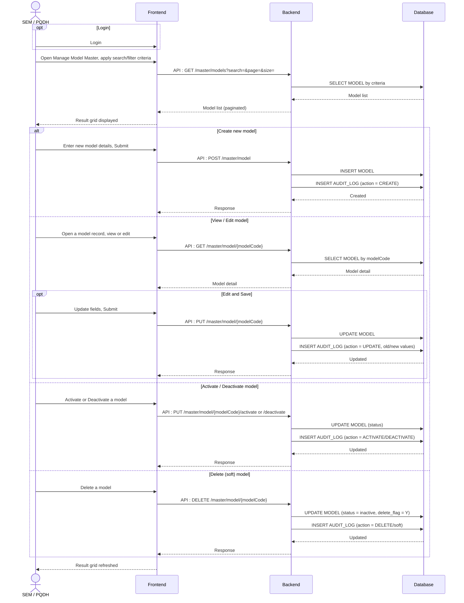
```mermaid
sequenceDiagram
    actor User as SEM / PQDH
    participant FE as Frontend
    participant BE as Backend
    participant DB as Database

    opt Login
        User->>FE: Login
    end

    User->>FE: Open Manage Model Master, apply search/filter criteria
    FE->>BE: API : GET /master/models?search=&page=&size=
    BE->>DB: SELECT MODEL by criteria
    DB-->>BE: Model list
    BE-->>FE: Model list (paginated)
    FE-->>User: Result grid displayed

    alt Create new model
        User->>FE: Enter new model details, Submit
        FE->>BE: API : POST /master/model
        BE->>DB: INSERT MODEL
        BE->>DB: INSERT AUDIT_LOG (action = CREATE)
        DB-->>BE: Created
        BE-->>FE: Response
    else View / Edit model
        User->>FE: Open a model record, view or edit
        FE->>BE: API : GET /master/model/{modelCode}
        BE->>DB: SELECT MODEL by modelCode
        DB-->>BE: Model detail
        BE-->>FE: Model detail
        opt Edit and Save
            User->>FE: Update fields, Submit
            FE->>BE: API : PUT /master/model/{modelCode}
            BE->>DB: UPDATE MODEL
            BE->>DB: INSERT AUDIT_LOG (action = UPDATE, old/new values)
            DB-->>BE: Updated
            BE-->>FE: Response
        end
    else Activate / Deactivate model
        User->>FE: Activate or Deactivate a model
        FE->>BE: API : PUT /master/model/{modelCode}/activate or /deactivate
        BE->>DB: UPDATE MODEL (status)
        BE->>DB: INSERT AUDIT_LOG (action = ACTIVATE/DEACTIVATE)
        DB-->>BE: Updated
        BE-->>FE: Response
    else Delete (soft) model
        User->>FE: Delete a model
        FE->>BE: API : DELETE /master/model/{modelCode}
        BE->>DB: UPDATE MODEL (status = inactive, delete_flag = Y)
        BE->>DB: INSERT AUDIT_LOG (action = DELETE/soft)
        DB-->>BE: Updated
        BE-->>FE: Response
    end
    FE-->>User: Result grid refreshed
```

##### 4.2.2.4.5. Frontend

Following the "navigation link", UI will show default "Search" grid and "New model" link on the page.
- Search event by given filter criteria, UI will list models in result grid
- Each row in result, will have provision to show brief information like [model_code, name, year, variant, status]
- Each row in result will have provision to perform further action like
  - View model
  - Edit model
  - Delete model (soft-delete)
  - Activate model
  - Deactivate model

##### 4.2.2.4.6. Backend

**API Details**

| # | API Name | EP URL | Purpose |
|---|----------|--------|---------|
| 1 | Create new model | POST /master/model | Receive data from consumer; performs required attribute level validation; create model in database; sends response back to consumer |
| 2 | Edit a model | PUT /master/model/{modelCode} | Receive data from consumer; performs required attribute level validation; update model in database; sends response back to consumer |
| 3 | View a single model | GET /master/model/{modelCode} | Receive model_code from consumer; get model information from database; prepares response for model info; sends response back to consumer |
| 4 | Delete a model | DELETE /master/model/{modelCode} | Receive model_code from consumer; validate model_code; delete model from database i.e. update model status to inactive & delete-flag=Y; sends response back to consumer |
| 5 | Search & List Models | GET /master/models?search={keyword}&page={n}&size={n} | Receive search criteria from consumer; get model list information from database for given criteria; prepares response for model list info; sends response back to consumer |
| 6 | Activate a model | PUT /master/model/{modelCode}/activate | Receive model_code from consumer; validate model exists; update model status = active; sends response back to consumer |
| 7 | Deactivate a model | PUT /master/model/{modelCode}/deactivate | Receive model_code from consumer; validate model exists; update model status = inactive; sends response back to consumer |

##### 4.2.2.4.7. Database

**Table Name**
1. MODEL (model_code, name, year, variant, status, audit-fields)

#### 4.2.2.5. Notes, Issue & Assumption

None

---

### 4.2.3. ISM0370 - Manage Valid Values

#### 4.2.3.1. Purpose

To manage Valid-Values master data (Key fields : ID Type, ID Type Value Code, ID Type Value Description) used to show valid values across N-PQMS system in different UI elements like dropdown, selection panel or so.

Examples of Valid-Values : Issue status, Fields in filter panel, Fields in column select panel, DTC Code valid values etc.

**Example of Issue Status Valid values**

|	id_type	|	id_type_code	|	id_type_value	|	id_type_value_desc	|	disp-seq	|
|---------|---------------|---------------|---------------------|-----------|
|	ISSUE_STATUS	|	100	|	Open	|	Open	|	4	|
|	ISSUE_STATUS	|	200	|	Investigating	|	Investigating	|	3	|
|	ISSUE_STATUS	|	300	|	Monitoring	|	Monitoring	|	5	|
|	ISSUE_STATUS	|	400	|	QIR	|	QIR	|	2	|
|	ISSUE_STATUS	|	500	|	Top Issue	|	Top Issue	|	1	|
|	ISSUE_STATUS	|	600	|	Resolved	|	Resolved	|	6	|
|	ISSUE_STATUS	|	700	|	NASO	|	NASO	|	7	|
|	ISSUE_STATUS	|	800	|	Closed	|	Closed	|	8	|
|	ISSUE_STATUS	|	900	|	Reopen	|	Reopen	|	4	|

#### 4.2.3.2. Requirement Traceability

None

#### 4.2.3.3. Navigation & Prototype reference

**Navigation**

*System > Master Data > Valid Values*

**Prototype**

Reference to UX design pattern

#### 4.2.3.4. Solution Approach

##### 4.2.3.4.1. Design Description

The "Manage Valid Value" function will enable users to perform following activities
1. Create New Valid-Value
2. Search & List Valid-Value
3. View Valid-Value Detail
4. Edit Valid-Value
5. Activate Valid-Value
6. Deactivate Valid-Value
7. Delete Valid-Value

##### 4.2.3.4.2. Design Notes

1) Filter criteria in search grid : id_type_code, name, year, variant, status.
2) Display sequence column will be used for sorting or display order purpose of valid-values on UI.

##### 4.2.3.4.3. Actor

- SEM/PQDH (Admin roles)

##### 4.2.3.4.4. Sequence Flow

```mermaid
sequenceDiagram
    actor User as SEM / PQDH
    participant FE as Frontend
    participant BE as Backend
    participant DB as Database

    opt Login
        User->>FE: Login
    end

    User->>FE: Open Manage Valid-Value Master, apply search/filter criteria
    FE->>BE: API : GET /master/validvalues?search=&page=&size=
    BE->>DB: SELECT ID_TYPE_CODE_VALUE by criteria
    DB-->>BE: Valid-Value list
    BE-->>FE: Valid-Value list (paginated)
    FE-->>User: Result grid displayed

    alt Create new valid-value
        User->>FE: Enter new valid-value details, Submit
        FE->>BE: API : POST /master/validvalue
        BE->>DB: INSERT ID_TYPE_CODE_VALUE
        BE->>DB: INSERT AUDIT_LOG (action = CREATE)
        DB-->>BE: Created
        BE-->>FE: Response
    else View / Edit valid-value
        User->>FE: Open a valid-value record, view or edit
        FE->>BE: API : GET /master/validvalue/{idTypeCode}
        BE->>DB: SELECT ID_TYPE_CODE_VALUE by idTypeCode
        DB-->>BE: Valid-Value detail
        BE-->>FE: Valid-Value detail
        opt Edit and Save
            User->>FE: Update fields, Submit
            FE->>BE: API : PUT /master/validvalue/{idTypeCode}
            BE->>DB: UPDATE ID_TYPE_CODE_VALUE
            BE->>DB: INSERT AUDIT_LOG (action = UPDATE, old/new values)
            DB-->>BE: Updated
            BE-->>FE: Response
        end
    else Activate / Deactivate valid-value
        User->>FE: Activate or Deactivate a valid-value
        FE->>BE: API : PUT /master/validvalue/{idTypeCode}/activate or /deactivate
        BE->>DB: UPDATE ID_TYPE_CODE_VALUE (status)
        BE->>DB: INSERT AUDIT_LOG (action = ACTIVATE/DEACTIVATE)
        DB-->>BE: Updated
        BE-->>FE: Response
    else Delete (soft) valid-value
        User->>FE: Delete a valid-value
        FE->>BE: API : DELETE /master/valuevalue/{idTypeCode}
        BE->>DB: UPDATE ID_TYPE_CODE_VALUE (status = inactive, delete_flag = Y)
        BE->>DB: INSERT AUDIT_LOG (action = DELETE/soft)
        DB-->>BE: Updated
        BE-->>FE: Response
    end
    FE-->>User: Result grid refreshed
```

##### 4.2.3.4.5. Frontend

Following the "navigation link", UI will show default "Search" grid and "New Valid-Value" link on the page.
- Search event by given filter criteria, UI will list Valid-Values in result grid
- Each row in result, will have provision to show brief information like [id_type_code, id_type_value_code, id_type_value_desc]
- Each row in result will have provision to perform further action like
  - View Valid-Value
  - Edit Valid-Value
  - Delete Valid-Value (soft-delete)
  - Activate Valid-Value
  - Deactivate Valid-Value

##### 4.2.3.4.6. Backend

**API Details**

| # | API Name | EP URL | Purpose |
|---|----------|--------|---------|
| 1 | Create new Valid-Value | POST /master/validvalue | Receive data from consumer; performs required attribute level validation; create Valid-Value in database; sends response back to consumer |
| 2 | Edit a Valid-Value | PUT /master/validvalue/{idTypeCode} | Receive data from consumer; performs required attribute level validation; update Valid-Value in database; sends response back to consumer |
| 3 | View a single Valid-Value | GET /master/validvalue/{idTypeCode} | Receive id_type_value_code from consumer; get Valid-Value information from database; prepares response for Valid-Value info; sends response back to consumer |
| 4 | Delete a Valid-Value | DELETE /master/validvalue/{idTypeCode} | Receive id_type_value_code from consumer; validate id_type_value_code; delete ID_TYPE_CODE_VALUE from database i.e. update ID_TYPE_CODE_VALUE status to inactive & delete-flag=Y; sends response back to consumer |
| 5 | Search & List Models | GET /master/validvalues?search={keyword}&page={n}&size={n} | Receive search criteria from consumer; get model list information from database for given criteria; prepares response for Valid-Value list info; sends response back to consumer |
| 6 | Activate a Valid-Value | PUT /master/validvalue/{idTypeCode}/activate | Receive id_type_value_code from consumer; validate valid-value exists; update ID_TYPE_CODE_VALUE status = active; sends response back to consumer |
| 7 | Deactivate a model | PUT /master/validvalue/{idTypeCode}/deactivate | Receive id_type_value_code from consumer; validate valid-value exists; update ID_TYPE_CODE_VALUE status = inactive; sends response back to consumer |

##### 4.2.3.4.7. Database

**Table Name**
1. ID_TYPE_CODE_VALUE

#### 4.2.3.5. Notes, Issue & Assumption

None

---

# 5. Supporting Non-functional Modules 

## 5.1. User & Access Management

**Overview**

"User & Access Management" is responsible to manage role, feature & user master data including feature access at role level and one or more roles association with a user.

**Requirement Traceability**

| ID | Requirement / Screen Description | Priority | System Function | Actor |
| ---|----------------------------------|----------|-----------------|-------|
| ADM-FR-001 | ADM0010 shall list all users with filter by: role, status (active/inactive/expired), org unit, last login date | P1 | Manage Users (Search) | OPSADM |
| ADM-FR-002 | ADM0020 shall allow OPSADM to create, edit, activate, deactivate, and delete user accounts; all changes logged in audit trail | P1 | Manage Users (CRUD)| OPSADM |
| ADM-FR-003 | ADM0030 shall allow OPSADM to assign and revoke RBAC roles per user; bulk assignment via XLSX import with validation | P1 | Add/Remove User Role / Bulk Add/Remove User Role | OPSADM / OPSADM |
| ADM-FR-004 | External user accounts (ADM0050) shall enforce an access expiry date; the system shall auto-deactivate accounts 24 hours after expiry with a notification to OPSADM | P1 | Add/Remove User Role / Add access expiry (external user) / Notification of Auto-deactivation / Auto-deactivate external user | OPSADM / OPSADM / Cron-job / Cron-job |
| ADM-FR-005 | ADM0040 access audit log shall be read-only, immutable, exportable to PDF/XLSX; accessible to OPSADM and PQDH roles only | P1 | View Access Log / Add Access Log provision with all system-functions | OPSADM / Auto logging |
| ADM-FR-006 | OPSADM shall be able to force-expire a user's JWT session (effective within 1 token refresh cycle, maximum 30 minutes) | P1 | User Authentication | System |
| ADM-FR-007 | ADM0010 shall surface users with roles expiring within 14 days as a highlighted alert to OPSADM | P2 | Add access expiry (internal user) / Notification of Auto-deactivation / Auto-deactivate external user | OPSADM / Cron-job / Cron-job |

---

### 5.1.1. UM0010 - Manage User

#### 5.1.1.1. Purpose

To manage application level users in the system.

#### 5.1.1.2. Requirement Traceability

**Main BRD 1.1 Reference**

- Chapter : 9.1 User & Access Management
  - ADM-FR-001 (list/filter by role, status, org unit, last login date)
  - ADM-FR-002 (create/edit/activate/deactivate/delete; audit-logged)

**ISM DRD 1.0 Reference**

None

**ISM BRD 1.3 Reference**

None

#### 5.1.1.3. Navigation & Prototype reference

**Navigation**

*System > Admin > User*

**Prototype**

Reference to UX design pattern

#### 5.1.1.4. Solution Approach

##### 5.1.1.4.1. Design Description

The "Manage User" function will enable users to perform following activities
1. Create New User
2. Search & List User
3. View User Profile
4. Edit User Profile
5. Activate User
6. Deactivate User
7. Delete User

##### 5.1.1.4.2. Design Notes

1) Filter criteria in search grid : role, status (active/inactive/expired), org unit.

##### 5.1.1.4.3. Actor

- OPSADM : System Administrator (sole actor — per Main BRD, user management is OPSADM-only across ADM-FR-001/002)

##### 5.1.1.4.4. Sequence Flow

```mermaid
sequenceDiagram
    actor OPSADM
    participant FE as Frontend
    participant BE as Backend
    participant DB as Database

    opt Login
        OPSADM->>FE: Login
    end

    OPSADM->>FE: Open Manage User, apply search/filter criteria
    FE->>BE: API : GET /api/v1/um/users?search=&page=&size=
    BE->>DB: SELECT USER by criteria
    DB-->>BE: User list
    BE-->>FE: User list (paginated)
    FE-->>OPSADM: Result grid displayed

    alt Create new user
        OPSADM->>FE: Enter new user details, Submit
        FE->>BE: API : POST /api/v1/um/user
        BE->>DB: INSERT USER
        BE->>DB: INSERT AUDIT_LOG (action = CREATE)
        DB-->>BE: Created
        BE-->>FE: Response
    else View / Edit user
        OPSADM->>FE: Open a user record, view or edit
        FE->>BE: API : GET /api/v1/um/user/{userId}
        BE->>DB: SELECT USER by userId
        DB-->>BE: User detail
        BE-->>FE: User detail
        opt Edit and Save
            OPSADM->>FE: Update fields (incl. Activate/Deactivate via status), Submit
            FE->>BE: API : PUT /api/v1/um/user/{userId}
            BE->>DB: UPDATE USER
            BE->>DB: INSERT AUDIT_LOG (action = UPDATE, old/new values)
            DB-->>BE: Updated
            BE-->>FE: Response
        end
    else Delete (soft) user
        OPSADM->>FE: Delete a user
        FE->>BE: API : DELETE /api/v1/um/user/{userId}
        BE->>DB: UPDATE USER (status = inactive, delete_flag = Y)
        BE->>DB: INSERT AUDIT_LOG (action = DELETE/soft)
        DB-->>BE: Updated
        BE-->>FE: Response
    end
    FE-->>OPSADM: Result grid refreshed
```

##### 5.1.1.4.5. Frontend

Following the "navigation link", UI will show default "Search" grid and "New user" link on the page.
- Search event by given filter criteria, UI will list users in result grid
- Each row in result, will have provision to show brief information like [user-id, name, onboarding date, status]
- Each row in result will have provision to perform further action like
  - View user
  - Edit user
  - Delete user (soft-delete)
  - Activate user
  - Deactivate user

##### 5.1.1.4.6. Backend  

**API Details**

| # | API Name | EP URL | Purpose |
|---|----------|--------|---------|
| 1 | Create new user | POST/api/v1/um/user |  Receive data from consumer; performs required attribute level validation; create user in database; sends response back to consumer |
| 2 | Edit a user     | PUT /api/v1/um/user/{userId} | Receive data from consumer; performs required attribute level validation; update user in database; sends response back to consumer |
| 3 | View a single user | GET /api/v1/um/user/{userId} | Receive use-id from consumer; Get user information from database; Prepares response for user info; sends response back to consumer|
| 4 | Delete a user | DELETE /api/v1/um/user/{userId} | Receive use-id from consumer; Validate user-id; Delete user from database i.e. update user status to inactive & delete-flag=Y; sends response back to consumer|
| 5 | Search & List Users | GET /api/v1/um/users?search={keyword}&page={n}&size={n} | Receive search criteria from consumer; Get user list information from database for given criteria; Prepares response for user list info; sends response back to consumer |
| 6 | Activate a user | PUT /api/v1/um/user/{userId}/activate | Receive user-id from consumer; validate user exists; update user status = active; sends response back to consumer |
| 7 | Deactivate a user | PUT /api/v1/um/user/{userId}/deactivate | Receive user-id from consumer; validate user exists; update user status = inactive; sends response back to consumer |

##### 5.1.1.4.7. Database

**Table Name**
1. USER

#### 5.1.1.5. Notes, Issue & Assumption

---

### 5.1.2. UM0020 - Add/Remove User Role

#### 5.1.2.1. Purpose

To add or remove roles to/from an application users in the system.

#### 5.1.2.2. Requirement Traceability

**Main BRD 1.1 Reference**

- Chapter : 9.1 User & Access Management
  - ADM-FR-003 (assign/revoke RBAC roles; bulk assignment via CSV)
  - ADM-FR-004 (partial i.e. role level expiry_days)

**ISM DRD 1.0 Reference**

None

**ISM BRD 1.3 Reference**

None

#### 5.1.2.3. Navigation & Prototype reference

**Navigation**

*System > Admin > User Role*

**Prototype**

Reference to UX design pattern

#### 5.1.2.4. Solution Approach

##### 5.1.2.4.1. Design Description

The "Add/Remove User Role" function will enable user to perform following activities
1. Add a new role to a user including role-expiry-days
2. Remove role from a user
3. Bulk Add via CSV upload including role-expiry-days
4. Bulk Remove via CSV Upload

##### 5.1.2.4.2. Design Notes

- While add new role, default role-expiry-days shall be displayed with override option
- CSV format (Add Role) : user-id, role-id, role-expiry-days, Add
- CSV format (Remove Role) : user-id, role-id, 0, Remove
- CSV file should not contain records more than MAX-NUM (e.g. 50)
- ROLE-EXPIRY-DAYS shall be configured in ROLE & USER master
- **Bulk Add or Bulk Remove can be single or two different operations

##### 5.1.2.4.3. Actor

OPSADM (only)

##### 5.1.2.4.4. Sequence Flow

```mermaid
sequenceDiagram
    actor OPSADM
    participant FE as Frontend
    participant BE as Backend
    participant DB as Database

    OPSADM->>FE: Open user's role popup
    FE->>BE: GET userroles?search=user-id
    BE->>DB: SELECT USER_ROLE_MAP
    DB-->>FE: Existing roles

    alt Add/Remove
        OPSADM->>FE: Select role, Add or Remove
        FE->>BE: POST /userrole (action)
        BE->>DB: Insert/Update USER_ROLE_MAP
    else Bulk (CSV)
        OPSADM->>FE: Upload CSV
        FE->>BE: POST /userrolebulk
        BE->>DB: Validate & apply each row
    end
    DB-->>BE: Result
    BE-->>FE: Response
    FE-->>OPSADM: Role list refreshed
```

##### 5.1.2.4.5. Frontend

Following the "navigation link", UI will show default "Search" grid on the page.
- Search event by given filter criteria, UI will list users in result grid
- Each row in result will have link "User Role", to show existing role list with role-expiry-days in a popup with provision to multi select.
- Popup will have action buttons to perform [Add / Remove] operations on selected users
- "Bulk Add" or "Bulk Remove" event will enable user to upload "CSV File" in a given format.
- On successful upload,
  - CSV content will be validated
  - User roles will added or removed to/from a user as per action given

##### 5.1.2.4.6. Backend

**API Details**

| # | API Name | EP URL | Purpose |
|---|----------|--------|---------|
| 1 | Add user role | POST/api/v1/um/userrole | Receive data from consumer; performs  existing role validation and existing user validation; create user role record in database; sends response back to consumer |
| 2 | Remove user role | POST/api/v1/um/userrole | Receive use-id, role-id from consumer; Validate user-id & role-id; Delete user-role record from database i.e. update user-role status to inactive & delete-flag=Y; sends response back to consumer|
| 3 | Bulk Add/Remove user role | POST/api/v1/um/userrolebulk | Received list of roles from consumer; Depending upon action-type i.e. Bulk-Add or Bulk-Remove, user-role will be added/removed from database; sends response back to consumer|
| 4 | Search & List User Roles | GET /api/v1/um/userroles?search={keyword}&page={n}&size={n} | Receive search criteria (i.e. user-id) from UI; Get user-role list information from database for given criteria; Prepares response for user-role list info; sends response back to consumer|

##### 5.1.2.4.7. Database

**Table Name**

1. USER_ROLE_MAP (WRITE)
2. USER (for validation)
3. ROLE (for validation)

#### 5.1.2.5. Notes, Issue & Assumption

---

### 5.1.3. UM0030 - Manage Role (Master)

#### 5.1.3.1. Purpose

To define application level user roles and system roles in the system

**Role List**

|	Seq	|	Role Id	|	Role Name	             | Role Type  | Role Description**	 |
|-------|-----------|----------------------------|------------|----------------------|
|  1    |SE         | Service Engineer           |   KUS      | Evaluation of parts collected which can include structured test drives                     |
|  2    |SEM        | Service Engineer Manager   |   KUS      | Investigation of specific vehicles at dealerships                     |
|  3    |PQDH       | PQ Department Head         |   KUS      | Investigation held between PQ and Suppliers/Plants/NAQC/HATCI                     |
|  4    |OPSADM     | Operation Admin            |   KUS      | Category to catch other activities that are not classified yet.  Similar to the classification process, users should have the ability to request admins to review new activity categories to be included.                     |
|  5    |PUBCOO     | Publication Coordinator    |   KUS      |                      |
|  6    |PUBTO      | Publication Task Owners    |   KUS      | This will likely be separated into different roles.  For example: Warranty, Service Operations, Service Garage, Safety Office, Legal, Parts, MPA                     |
|  7    |EXTKGA     | Kia Georgia (KaGA)         |   EXT      | Plant team member                     |
|  8    |EXTKMX     | Kia Mexico (KMX)           |   EXT      | Plant team member                     |
|  9    |EXTKHQ     | HQ (Kia HQ)                |   EXT      | Plant team member                     |
|  10   |EXTNAQ     | NAQC                       |   EXT      | Technical role that will potentially support Top Issue escalations.                     |
|  11   |EXTHAT     | HATCI                      |   EXT      | Technical role that currently only supports EDIR Publication Management task.                     |

#### 5.1.3.2. Requirement Traceability

**Main BRD 1.1 Reference**

- Chapter : 9.1 User & Access Management
  - ADM-FR-001
  - ADM-FR-002
  - ADM-FR-003
  - ADM-FR-004

**ISM DRD 1.0 Reference**

None

**ISM BRD 1.3 Reference**

None

#### 5.1.3.3. Navigation & Prototype reference

**Navigation**

System > Admin > Role

**Prototype**

Reference to UX design pattern

#### 5.1.3.4. Solution Approach

##### 5.1.3.4.1. Design Description

The "Manage Role" function will enable users to perform following activities
- Create new role & description
- Search & List Role
- View role
- Edit Role
- Delete Role

##### 5.1.3.4.2. Design Notes

##### 5.1.3.4.3. Actor

OPSADM (only)

##### 5.1.3.4.4. Sequence Flow

```mermaid
sequenceDiagram
    actor OPSADM
    participant FE as Frontend
    participant BE as Backend
    participant DB as Database

    OPSADM->>FE: Search/List roles
    FE->>BE: GET /roles?search=
    BE->>DB: SELECT ROLE
    DB-->>FE: Role list

    alt Create/Edit/Delete
        OPSADM->>FE: Create, edit, or delete a role
        FE->>BE: POST/PUT/DELETE /role
        BE->>DB: Insert/Update/Soft-delete ROLE
        DB-->>BE: Result
    end
    BE-->>FE: Response
    FE-->>OPSADM: Grid refreshed
```

##### 5.1.3.4.5. Frontend

Following the "navigation link", UI will show default "Search" grid and "New role" link on the page.
- Search event by given filter criteria, UI will list roles in result grid
- Each row in result, will have provision to show brief information like [role-id, name, description, effective date, status]
- Each row in result will have provision to perform further action like
  - View role
  - Edit role
  - Delete role (soft-delete)

##### 5.1.3.4.6. Backend

**API Details**

| # | API Name | EP URL | Purpose |
|---|----------|--------|---------|
| 1 | Create new role | POST/api/v1/um/role|  Receive data from consumer; performs required attribute level validation; create role in database; sends response back to consumer |
| 2 | Edit a role     | PUT /api/v1/um/role/{roleId} | Receive data from consumer; performs required attribute level validation; update role in database; sends response back to consumer |
| 3 | View a single role | GET /api/v1/um/role/{roleId} | Receive role-id from consumer; Get role information from database; Prepares response for role info; sends response back to consumer|
| 4 | Delete a role | DELETE /api/v1/um/role/{roleId} | Receive role-id from consumer; Validate role-id; Delete role from database i.e. update role status to inactive & delete-flag=Y; sends response back to consumer|
| 5 | Search & List Roles | GET /api/v1/um/roles?search={keyword}&page={n}&size={n} | Receive search criteria from consumer; Get role list information from database for given criteria; Prepares response for role list info; sends response back to consumer |

##### 5.1.3.4.7. Database

**Table Name**

1. ROLE

#### 5.1.3.5. Notes, Issue & Assumption

---

### 5.1.4. UM0030 - Manage User Role Expiry (Internal users, Role Deactivation Job)

#### 5.1.4.1. Purpose

To define expiry at role level for each application users in the system and notify OPSADM before role deactivation.

#### 5.1.4.2. Requirement Traceability

**Main BRD 1.1 Reference**

- Chapter : 9.1 User & Access Management
  - ADM-FR-007

**ISM DRD 1.0 Reference**

None

**ISM BRD 1.3 Reference**

None

#### 5.1.4.3. Navigation & Prototype reference

**Navigation**

System > Admin > Role

**Prototype**

Reference to UX design pattern

#### 5.1.4.4. Solution Approach

##### 5.1.4.4.1. Design Description

1. To manage role-expiry-days at role level for internal users, "Add/Remove User Role" function will be reused . Please refer chapter "Add/Remove User Role" for more detail.
2. System will have a CRON-JOB "AUTO-ROLE-DEACTIVATION" Apart from defining role-expiry-days
3. System will notify OPSADM user as [NOTIFY-ROLE-EXPIRY-PERIOD, NOTIFY-ROLE-EXPIRY-PERIOD-TYPE] before ROLE-DEACTIVATION event.

##### 5.1.4.4.2. Design Notes

- ROLE-EXPIRY-DAYS shall be configured in ROLE & USER master
- NOTIFY-ROLE-EXPIRY-PERIOD, NOTIFY-ROLE-EXPIRY-PERIOD-TYPE (Hours, Days) shall be configured NOTIFICATION_TXN

##### 5.1.4.4.3. Actor

System (Cron); OPSADM (notified)

##### 5.1.4.4.4. Sequence Flow

```mermaid
sequenceDiagram
    participant CRON as Cron
    participant BE as Backend
    participant DB as Database
    actor OPSADM

    CRON->>BE: Alert job (T-14 days)
    BE->>DB: Find roles expiring in 14 days
    BE->>OPSADM: Notify (email)

    CRON->>BE: Deactivation job (on expiry date)
    BE->>DB: UPDATE USER_ROLE_MAP (status = inactive)
```

##### 5.1.4.4.5. Frontend

NA

##### 5.1.4.4.6. Backend

**CRON-JOB Details**

| # | Job Name | Cron rule | Trigger Rule |Purpose |
|---|----------|-----------|--------------|--------|
| 1 | Deactivate role | 0 23 * * * |  @ROLE-EXPIRY-DATE |To deactivate user as per business rule |
| 2 | Alert before deactivate role | 0 22 * * * | @ROLE-EXPIRY-DATE - 14 | Notify OPSADM of upcoming role expiry |

**API Details**

| # | API Name | EP URL | Purpose |
|---|----------|--------|---------|
| 1 | Deactivate role | POST/api/v1/um/userrole?action={deactivation} | Receive role-id from consumer; Validate role-id; Deactivate role from database i.e. update role status to inactive; sends response back to consumer |
| 2 | Notify on deactivate role | POST/api/notification/v1/send | Receive notification-template & variable parameters in KV format from consumer; Prepare final deliverable notification-text; instantiate email object; send email notification; send response back to consumer |

##### 5.1.4.4.7. Database

**Table Name**

1. USER_ROLE_MAP (WRITE)
2. USER (for validation)
3. ROLE (for validation)

#### 5.1.4.5. Notes, Issue & Assumption

---

### 5.1.5. UM0030 - Manage User Role Expiry (External users, Role Deactivation Job)

#### 5.1.5.1. Purpose

To define expiry at role level for each application external users in the system and notify OPSADM before role deactivation.

#### 5.1.5.2. Requirement Traceability

**Main BRD 1.1 Reference**

- Chapter : 9.1 User & Access Management
  - ADM-FR-004

**ISM DRD 1.0 Reference**

None

**ISM BRD 1.3 Reference**

None

#### 5.1.5.3. Navigation & Prototype reference

**Navigation**

System > Admin > Role

**Prototype**

Reference to UX design pattern

#### 5.1.5.4. Solution Approach

##### 5.1.5.4.1. Design Description

1. System will have a CRON-JOB "AUTO-ROLE-DEACTIVATION-EXTERNAL" to deactive role after role-expiry-days
2. System will notify OPSADM user as [NOTIFY-ROLE-EXPIRY-PERIOD, NOTIFY-ROLE-EXPIRY-PERIOD-TYPE] before ROLE-DEACTIVATION event.

##### 5.1.5.4.2. Design Notes

- EXTERNAL-ROLE-EXPIRY-DAYS shall be configured in EXT_ROLE & EXT_USER master
- EXT-NOTIFY-ROLE-EXPIRY-PERIOD, EXT-NOTIFY-ROLE-EXPIRY-PERIOD-TYPE (Hours, Days) shall be configured NOTIFICATION_TXN

##### 5.1.5.4.3. Actor

System (Cron); OPSADM (notified)

##### 5.1.5.4.4. Sequence Flow

```mermaid
sequenceDiagram
    participant CRON as Cron
    participant BE as Backend
    participant DB as Database
    actor OPSADM

    CRON->>BE: Alert job (T-14 days)
    BE->>DB: Find external roles expiring in 14 days
    BE->>OPSADM: Notify (email)

    CRON->>BE: Deactivation job (expiry + 24h)
    BE->>DB: UPDATE EXT_USER_ROLE_MAP (status = inactive)
```

##### 5.1.5.4.5. Frontend

NA

##### 5.1.5.4.6. Backend

**CRON-JOB Details**

| # | Job Name | Cron rule | Trigger Rule |Purpose |
|---|----------|-----------|--------------|--------|
| 1 | Deactivate role for external users| 0 23 * * * |  @ROLE-EXPIRY-DATE + 24h |To deactivate user as per business rule |
| 2 | Alert before deactivate role of external user | 0 22 * * * | @ROLE-EXPIRY-DATE - 14 | Notify OPSADM of upcoming role expiry |

**API Details**

| # | API Name | EP URL | Purpose |
|---|----------|--------|---------|
| 1 | Deactivate role | POST/api/v1/um/userrole?action={deactivation-ext} | Receive role-id from consumer; Validate role-id; Deactivate role of external user from database i.e. update role status to inactive; sends response back to consumer |
| 2 | Notify on deactivate role | POST/api/notification/v1/send | Receive notification-template & variable parameters in KV format from consumer; Prepare final deliverable notification-text; instantiate email object; send email notification; send response back to consumer |

##### 5.1.5.4.7. Database

**Table Name**

1. EXT_USER_ROLE_MAP (WRITE)
2. EXT_USER (for validation)
3. EXT_ROLE (for validation)

#### 5.1.5.5. Notes, Issue & Assumption

---

### 5.1.6. UM0040 - Manage User's Access Log

#### 5.1.6.1. Purpose

To capture access event log of users upon accessing any UI functions and enable authorized user to view the access log.

#### 5.1.6.2. Requirement Traceability

**Main BRD 1.1 Reference**

- Chapter : 9.1 User & Access Management
  - ADM-FR-005

**ISM DRD 1.0 Reference**

None

**ISM BRD 1.3 Reference**

None

#### 5.1.6.3. Navigation & Prototype reference

**Navigation**  

*System > Admin > Access Log*

**Prototype**  

Reference to UX design pattern

#### 5.1.6.4. Solution Approach

##### 5.1.6.4.1. Design Description

The "Manage User's Access Log" function will enable system to perform following activities
- Capture "access-event-log" on click of UI resources e.g. menu-option, function-link, button & likewise.
- Search & List access log by authorized user

##### 5.1.6.4.2. Design Notes

Accessible to OPSADM and PQDH only (ADM-FR-005)

##### 5.1.6.4.3. Actor

OPSADM, PQDH

##### 5.1.6.4.4. Sequence Flow

```mermaid
sequenceDiagram
    actor User
    participant FE as Frontend
    participant BE as Backend
    participant DB as Database
    actor OpsadmPqdh as OPSADM/PQDH

    User->>FE: Click any UI resource
    FE->>BE: POST /accesslog (event)
    BE->>DB: INSERT PQMS_ACTIVITY_LOG

    OpsadmPqdh->>FE: Search access log
    FE->>BE: GET /accesslogs?search=
    BE->>DB: SELECT PQMS_ACTIVITY_LOG
    DB-->>FE: Result (export to PDF/XLSX available)
```

##### 5.1.6.4.5. Frontend

Following the "navigation link", UI will show default "Search" grid on the page.
- Search event by given filter criteria, UI will list features in result grid
- Each row in result, will have provision to show brief information like [access-date-time, user-id, user-name, feature-id, feature-name, description]
- Each row in result will have provision to perform further action like
  - View detail (if applicable to show additional info)

##### 5.1.6.4.6. Backend  

**API Details** 
| # | API Name | EP URL | Purpose |
|---|----------|--------|---------|
| 1 | Add access log (UI resources) | POST /api/activitylog/v1/accesslog | Receive access-log information from consumer; Perform hygene check, create access-log record in database; sends response back to consumer |
| 2 | Search & List Access-log | GET /api/v1/um/accesslogs?search={keyword}&page={n}&size={n} | Receive search criteria from consumer; Get access-log list information from database for given criteria; Prepares response for access-log list info; sends response back to consumer |

##### 5.1.6.4.7. Database

**Table Name**
1. PQMS_ACTIVITY_LOG (WRITE)

#### 5.1.6.5. Notes, Issue & Assumption

---

### 5.1.7. UM0050 - Manage Feature

#### 5.1.7.1. Purpose

To define application level features in the system

**Scenario / Examples : Feature List**

| Feature Id | Feature Name      | 
|------------|-------------------|
| ISM0010    | Issue List        | 
| ISM0020    | Issue Entry       | 
| ISM0030    | Issue Scoring     | 
| ISM0040    | Issue Detail      | 
| ISM0050    | QIR Creation      | 
| ISM0060    | QIR Assignment    | 
| ISM0070    | Manage Issue Lifecycle | 
| ISM0080    | Issue Tracking    | 
| ISM0090    | Parts Request     | 
| ISM0100    | Comm. Log         | 

#### 5.1.7.2. Requirement Traceability

**Main BRD 1.1 Reference**

- Chapter : 9.1 User & Access Management
  - ADM-FR-003

**ISM DRD 1.0 Reference**

None

**ISM BRD 1.3 Reference**

None

#### 5.1.7.3. Navigation & Prototype reference

**Navigation**

System > Admin > Feature

**Prototype**

Reference to UX design pattern

#### 5.1.7.4. Solution Approach

##### 5.1.7.4.1. Design Description

The "Manage Feature" function will enable users to perform following activities
- Create new feature & description
- Search & List Feature
- View Feature
- Edit Feature
- Delete Feature

##### 5.1.7.4.2. Design Notes

##### 5.1.7.4.3. Actor

OPSADM (only)

##### 5.1.7.4.4. Sequence Flow

```mermaid
sequenceDiagram
    actor OPSADM
    participant FE as Frontend
    participant BE as Backend
    participant DB as Database

    OPSADM->>FE: Search/List features
    FE->>BE: GET /features?search=
    BE->>DB: SELECT FEATURE
    DB-->>FE: Feature list

    alt Create/Edit/Delete
        OPSADM->>FE: Create, edit, or delete a feature
        FE->>BE: POST/PUT/DELETE /feature
        BE->>DB: Insert/Update/Soft-delete FEATURE
        DB-->>BE: Result
    end
    BE-->>FE: Response
    FE-->>OPSADM: Grid refreshed
```

##### 5.1.7.4.5. Frontend

Following the "navigation link", UI will show default "Search" grid and "New feature" link on the page.
- Search event by given filter criteria, UI will list features in result grid
- Each row in result, will have provision to show brief information like [feature-id, name, description, effective date, status]
- Each row in result will have provision to perform further action like
  - View feature
  - Edit feature
  - Delete feature (soft-delete)

##### 5.1.7.4.6. Backend

**API Details**

| # | API Name | EP URL | Purpose |
|---|----------|--------|---------|
| 1 | Create new feature | POST/api/v1/um/feature|  Receive data from consumer; performs required attribute level validation; create feature in database; sends response back to consumer |
| 2 | Edit a feature     | PUT /api/v1/um/feature/{featureId} | Receive data from consumer; performs required attribute level validation; update feature in database; sends response back to consumer |
| 3 | View a single feature | GET /api/v1/um/feature/{featureId} | Receive feature-id from consumer; Get feature information from database; Prepares response for feature info; sends response back to consumer|
| 4 | Delete a feature | DELETE /api/v1/um/feature/{featureId} | Receive feature-id from consumer; Validate feature-id; Delete feature from database i.e. update feature status to inactive & delete-flag=Y; sends response back to consumer|
| 5 | Search & List Features | GET /api/v1/um/features?search={keyword}&page={n}&size={n} | Receive search criteria from consumer; Get feature list information from database for given criteria; Prepares response for feature list info; sends response back to consumer |

##### 5.1.7.4.7. Database

**Table Name**

1. FEATURE

#### 5.1.7.5. Notes, Issue & Assumption

---

### 5.1.8. UM0050 - Manage Feature Element

#### 5.1.8.1. Purpose

To define feature-elements (button/field/action) within a feature, for fine-grained role-based permissioning (Architecture Principle: role-based access down to feature-element level).

#### 5.1.8.2. Requirement Traceability

**Main BRD 1.1 Reference**

- Chapter : 9.1 User & Access Management (fine-grained permissioning — no dedicated FR-ID; implied by RBAC architecture principle)

**ISM DRD 1.0 Reference**

None

**ISM BRD 1.3 Reference**

None

#### 5.1.8.3. Navigation & Prototype reference

**Navigation**

*System > Admin > Feature Element* 

**Prototype**

Reference to UX design pattern

#### 5.1.8.4. Solution Approach

##### 5.1.8.4.1. Design Description

The "Manage Feature Element" function will enable users to perform following activities
- Create new feature-element under a parent Feature
- Search & List Feature Elements (by Feature)
- View / Edit / Delete Feature Element

##### 5.1.8.4.2. Design Notes

##### 5.1.8.4.3. Actor

OPSADM (only)

##### 5.1.8.4.4. Sequence Flow

```mermaid
sequenceDiagram
    actor OPSADM
    participant FE as Frontend
    participant BE as Backend
    participant DB as Database

    OPSADM->>FE: Select a Feature, search/list its elements
    FE->>BE: GET /featureelements?featureId=
    BE->>DB: SELECT FEATURE_ELEMENT
    DB-->>FE: Element list

    alt Create/Edit/Delete
        OPSADM->>FE: Create, edit, or delete an element
        FE->>BE: POST/PUT/DELETE /featureelement
        BE->>DB: Insert/Update/Soft-delete FEATURE_ELEMENT
        DB-->>BE: Result
    end
    BE-->>FE: Response
    FE-->>OPSADM: Grid refreshed
```

##### 5.1.8.4.5. Frontend

Following the "navigation link", UI will show default "Search" grid (filterable by parent Feature) and "New feature element" link.

##### 5.1.8.4.6. Backend

**API Details**

| # | API Name | EP URL | Purpose |
|---|----------|--------|---------|
| 1 | Create new feature element | POST /api/v1/um/featureelement | Create feature-element under a Feature |
| 2 | Edit a feature element | PUT /api/v1/um/featureelement/{elementId} | Update feature-element |
| 3 | View a single feature element | GET /api/v1/um/featureelement/{elementId} | Get feature-element detail |
| 4 | Delete a feature element | DELETE /api/v1/um/featureelement/{elementId} | Soft-delete feature-element |
| 5 | Search & List Feature Elements | GET /api/v1/um/featureelements?featureId={id}&search={keyword} | Get feature-element list by Feature |

##### 5.1.8.4.7. Database

**Table Name**
1. FEATURE_ELEMENT
2. FEATURE (for validation)

#### 5.1.8.5. Notes, Issue & Assumption

---

### 5.1.9. UM0060 - Manage Role level Features

#### 5.1.9.1. Purpose  

To add or remove features to/from a user role in the system.

**Scenario / Example : Role x feature matrix**

| Screen | SE | PQDH | SEM | PUBCOO | OPSADM |
|--------|----|----|----|----|----|
| ISM0010 Issue List | R/W | R/W | R/W | R | R/W |
| ISM0020 Issue Entry | R/W | R/W | R/W | — | R/W |
| ISM0030 Issue Scoring | R/W | Edit* | Edit* | — | R |
| ISM0040 Issue Detail | R/W | R/W | R/W | R | R/W |
| ISM0070 Issue Lifecycle | R (propose) | Approve | Approve | — | R |
| ISM0090 Parts Request | R/W | R/W | Approve | — | R |
| ISM0100 Comm. Log | R/W | R/W | R/W | R | R/W |

> *Edit = score override with mandatory justification; logged in audit trail.*  
> R = Read · R/W = Read + Write · — = No Access

#### 5.1.9.2. Requirement Traceability

**Main BRD 1.1 Reference**

- Chapter : 9.1 User & Access Management
  - ADM-FR-003

**ISM DRD 1.0 Reference**

None

**ISM BRD 1.3 Reference**

None

#### 5.1.9.3. Navigation & Prototype reference

**Navigation**

*System > Admin > Role level Feature*

**Prototype**

Reference to UX design pattern

#### 5.1.9.4. Solution Approach

##### 5.1.9.4.1. Design Description

The "Manage Role level Features" function will enable user to perform following activities
1. Add a new feature to a user-role
2. Remove a feature from the user-role

##### 5.1.9.4.2. Design Notes

NA

##### 5.1.9.4.3. Actor

OPSADM (only)

##### 5.1.9.4.4. Sequence Flow

```mermaid
sequenceDiagram
    actor OPSADM
    participant FE as Frontend
    participant BE as Backend
    participant DB as Database

    OPSADM->>FE: Open a role, view its features
    FE->>BE: GET /rolefeatures?search=role-id
    BE->>DB: SELECT ROLE_FEATURE_MAP
    DB-->>FE: Feature list for role

    alt Add/Remove
        OPSADM->>FE: Select feature, Add or Remove
        FE->>BE: POST /rolefeature (action)
        BE->>DB: Insert/Update ROLE_FEATURE_MAP
    end
    BE-->>FE: Response
    FE-->>OPSADM: List refreshed
```

##### 5.1.9.4.5. Frontend

Following the "navigation link", UI will show default "Search" grid on the page.
- Search event by given filter criteria, UI will list user-roles in result grid
- Each row in result will have link "Features", to show existing role level features.
- Popup will have action buttons to perform [Add / Remove] operations on selected role-features

##### 5.1.9.4.6. Backend

**API Details**

| # | API Name | EP URL | Purpose |
|---|----------|--------|---------|
| 1 | Add role level feature | POST/api/v1/um/rolefeature | Receive data from consumer; performs  existing feature validation and existing user-role validation; create role-feature record in database; sends response back to consumer |
| 2 | Remove role level feature | POST/api/v1/um/rolefeature | Receive role-id, feature-id from consumer; Validate role-id & feature-id; Delete role-feature record from database i.e. update role-feature status to inactive & delete-flag=Y; sends response back to consumer|
| 3 | Search & List Role Features | GET /api/v1/um/rolefeatures?search={keyword}&page={n}&size={n} | Receive search criteria (i.e. role-id) from consumer; Get role-feature list information from database for given criteria; Prepares response for role-feature list info; sends response back to consumer|

##### 5.1.9.4.7. Database

**Table Name**

1. ROLE_FEATURE_MAP (WRITE)
2. ROLE (for validation)
3. FEATURE (for validation)

#### 5.1.9.5. Notes, Issue & Assumption

---

### 5.1.10. UM0070 - Manage Role Level Feature Element

#### 5.1.10.1. Purpose

To grant/revoke specific feature-elements (button/field/action) within a feature to a role, the finest-grained permission level (`element_ids` stored as JSON on `ROLE_FEATURE_MAP`).

#### 5.1.10.2. Requirement Traceability

**Main BRD 1.1 Reference**

- Chapter : 9.1 User & Access Management (fine-grained permissioning; implied by RBAC architecture principle)

**ISM DRD 1.0 Reference**

None

**ISM BRD 1.3 Reference**

None

#### 5.1.10.3. Navigation & Prototype reference

**Navigation**

*System > Admin > Role level Feature Element*

**Prototype**

Reference to UX design pattern

#### 5.1.10.4. Solution Approach

##### 5.1.10.4.1. Design Description

The "Manage Role Level Feature Element" function will enable user to perform following activities
1. Add feature-element(s) to an existing role-feature grant
2. Remove feature-element(s) from an existing role-feature grant

##### 5.1.10.4.2. Design Notes

NA

##### 5.1.10.4.3. Actor

OPSADM (only)

##### 5.1.10.4.4. Sequence Flow

```mermaid
sequenceDiagram
    actor OPSADM
    participant FE as Frontend
    participant BE as Backend
    participant DB as Database

    OPSADM->>FE: Open a role-feature grant, view elements
    FE->>BE: GET /rolefeatureelements?search=role-id,feature-id
    BE->>DB: SELECT ROLE_FEATURE_MAP (element_ids)
    DB-->>FE: Element list

    alt Add/Remove
        OPSADM->>FE: Select element, Add or Remove
        FE->>BE: POST /rolefeatureelement (action)
        BE->>DB: UPDATE ROLE_FEATURE_MAP (element_ids)
    end
    BE-->>FE: Response
    FE-->>OPSADM: List refreshed
```

##### 5.1.10.4.5. Frontend

Following the "navigation link", UI will show default "Search" grid on the page.
- Each row (role-feature grant) will have link "Elements", to show/select feature-elements within that feature
- Popup will have action buttons to perform [Add / Remove] operations on selected elements

##### 5.1.10.4.6. Backend

**API Details**

| # | API Name | EP URL | Purpose |
|---|----------|--------|---------|
| 1 | Add role-level feature element | POST /api/v1/um/rolefeatureelement | Add element-id to ROLE_FEATURE_MAP.element_ids |
| 2 | Remove role-level feature element | POST /api/v1/um/rolefeatureelement | Remove element-id from ROLE_FEATURE_MAP.element_ids |
| 3 | Search & List Role Feature Elements | GET /api/v1/um/rolefeatureelements?search={keyword} | Get element grants by role/feature |

##### 5.1.10.4.7. Database

**Table Name**
1. ROLE_FEATURE_MAP (element_ids field)
2. FEATURE_ELEMENT (for validation)

#### 5.1.10.5. Notes, Issue & Assumption

---

### 5.1.11. UM0010 - Manage Expert (User) Group (Module: UM, Phase2)

**Purpose & Description**

The function [Manage Expert (User) Group] creates expert user group and add/remove expert in the user groups.

USER_GROUP & USER_GROUP_MEMBER are two DB Entities which will hold expert-user-groups and experts belonging to the expert-groups.

USER_GROUP & USER_GROUP_MEMBER will be used in auto-issue-loading process for issue allocation to a expert-group and issue assignment to an individual. 

**Delivery phase** : Phase 2.

---

## 5.2. User Authentication & Authorization

PQMS will support internal & external user authentication. Below diagram illustrates the authentication & authorization flow for both user-types.

```mermaid
flowchart TD
    %% ── TOP USER NODES ──
    A["Internal users (KUS employees)"]
    B["External users (~30–50)"]

    %% ── AUTHENTICATION LAYER ──
    subgraph AUTH["Authentication (KDP / Azure)"]
        direction LR
        C["**Azure AD**\nCorporate SSO via KDP"]
        D["**Azure B2C**\nExternal identity via KDP"]
    end

    %% ── ONBOARDING LAYER ──
    subgraph ONBOARD["User onboarding path"]
        direction LR

        subgraph UMM["User Management module"]
            direction TB
            U1["Admin creates / manages user record"]
            U2["Role assigned (multi-role supported)"]
            U3["Team + Duty mapped to user"]
            U1 --> U2 --> U3
        end

        subgraph IBP["Invitation-based provisioning"]
            direction TB
            E1["Admin sends invitation via B2C"]
            E2["External user self-registers"]
            E3["Pre-assigned External Role applied"]
            E1 --> E2 --> E3
        end
    end

    %% ── RBAC ENGINE ──
    subgraph RBAC["RBAC engine (unified for all users)"]
        direction TB
        R1["Token claims > Role lookup > Feature permission map"]
        R2["External users > External Role > scoped feature set"]
        R1 --- R2
    end

    %% ── EXTERNAL ROLE DESIGN ──
    subgraph ERD["External Role design"]
        direction TB
        X1["Pre-defined (e.g. TSB-Reviewer, FTR)"]
        X2["Scoped by model code / factory"]
        X3["No admin screen access at all"]
        X1 --> X2 --> X3
    end

    %% ── FEATURE ACCESS ──
    subgraph FEAT["Feature-level access (same engine, different scope)"]
        direction LR
        F1["**TSB**\nread / write / approve"]
        F2["**QIR / FPQR**\nread / write / approve"]
        F3["**Search**\nread only"]
        F4["**Admin**\ninternal only — blocked"]
    end

    %% ── KEY DIFFERENCE NOTE ──
    NOTE["**Key difference**\nInternal: full User Management — admin creates users, assigns roles, teams, duties in N-PQMS\nExternal: no user record created in PQMS admin — identity lives in Azure B2C, role pre-assigned at invite time"]

    %% ── CONNECTIONS ──
    A --> C
    B --> D
    C --> UMM
    D --> IBP
    UMM --> RBAC
    IBP --> RBAC
    RBAC --> ERD
    RBAC --> FEAT
    FEAT --> NOTE

    %% ── STYLES ──
    classDef internalBox fill:#dbeafe,stroke:#3b82f6,color:#1e3a8a
    classDef externalBox fill:#d1fae5,stroke:#10b981,color:#064e3b
    classDef rbacBox fill:#ede9fe,stroke:#7c3aed,color:#3b0764
    classDef featureBox fill:#dbeafe,stroke:#3b82f6,color:#1e3a8a
    classDef adminBlock fill:#e5e7eb,stroke:#6b7280,color:#1f2937
    classDef noteBox fill:#f9fafb,stroke:#d1d5db,color:#374151
    classDef subBox fill:#f0fdf4,stroke:#6ee7b7,color:#064e3b

    class A,C,UMM,U1,U2,U3 internalBox
    class B,D,IBP,E1,E2,E3,ERD,X1,X2,X3 externalBox
    class RBAC,R1,R2 rbacBox
    class F1,F2,F3 featureBox
    class F4 adminBlock
    class NOTE noteBox
```

---

### 5.2.1. Sign-in

#### 5.2.1.1. Purpose

To authenticate the user via HAEA's enterprise SSO (Azure AD) and establish a PQMS session.

#### 5.2.1.2. Requirement Traceability

**Main BRD 1.1 Reference**

- Chapter : 10.1 Authentication
  - AUTH-FR-001 (Azure AD SSO via OAuth2/OIDC)
  - AUTH-FR-002 (JWT session, default 30-min refresh)
  - AUTH-FR-004 (KDealer Plus / Azure AD B2C federation for external dealer users)
- Chapter : 10.2 MFA
  - AUTH-FR-010, AUTH-FR-011 (MFA enforced entirely by Azure AD; PQMS consumes an MFA-passed JWT only)
- Chapter : 10.4 Terms & Conditions
  - AUTH-FR-030, AUTH-FR-031 (T&C acceptance required on first login and on any revised version; logged with user ID/version/timestamp)

#### 5.2.1.3. Navigation & Prototype reference

**Navigation**

Landing page of PQMS EP URL (unauthenticated) redirects to Azure AD login

**Prototype**

Reference to UX design pattern

#### 5.2.1.4. Solution Approach

##### 5.2.1.4.1. Design Description

1) Unauthenticated user hitting the PQMS URL is redirected to Azure AD (internal users) or Azure AD B2C via KDealer Plus federation (external dealer users).
2) Azure AD handles credential check and MFA; PQMS has no native login form and does not see the password.
3) On successful auth, Azure AD returns an OIDC token; PQMS backend exchanges/validates it and issues a JWT session (30-min refresh).
4) If T&C is unaccepted (first login) or a newer T&C version exists, user is shown the T&C screen before landing on the Overview page; acceptance is logged (user ID, version, timestamp).

##### 5.2.1.4.2. Design Notes

1) PQMS does not implement its own credential form, Sign-in is entirely a redirect + token-exchange flow.

##### 5.2.1.4.3. Actor

All user roles (internal via Azure AD, external dealer users via Azure AD B2C/KDealer Plus)

##### 5.2.1.4.4. Sequence Flow

```mermaid
sequenceDiagram
    actor User
    participant FE as Frontend
    participant BE as Backend
    participant AAD as Azure AD (B2C for external)

    User->>FE: Open PQMS URL (unauthenticated)
    FE->>AAD: Redirect to login
    User->>AAD: Enter credentials + MFA
    AAD-->>FE: OIDC token (redirect back)
    FE->>BE: API : POST /auth/token (OIDC token)
    BE->>AAD: Validate token
    AAD-->>BE: Token valid, user claims
    BE-->>FE: PQMS JWT (session)
    alt T&C not accepted / new version
        FE-->>User: Show T&C screen
        User->>FE: Accept
        FE->>BE: API : POST /auth/tnc-accept (version)
        BE-->>FE: Logged
    end
    FE-->>User: Redirect to Overview (landing page)
```

##### 5.2.1.4.5. Frontend

No native login form; shows a brief redirect/loading state while Azure AD auth completes, then the T&C screen if applicable.

##### 5.2.1.4.6. Backend

1) [API : POST /auth/token (Purpose : Exchange/validate Azure AD OIDC token, issue PQMS JWT)]
2) [API : POST /auth/tnc-accept (Purpose : Log T&C acceptance — user ID, version, timestamp — reuses PQMS_ACTIVITY_LOG, same entity as UM0040 Access Log)]

##### 5.2.1.4.7. Database

- USER (last_login_date)
- PQMS_ACTIVITY_LOG (T&C acceptance events)

#### 5.2.1.5. Notes, Issue & Assumption

- Note : Because of SSO based authentication, PQMS's own LOGIN-FORM is not required. Based on requirement LOGIN-FORM shall be developed later.
- Note : T&C detail shall be captured in user-access-log.

---

### 5.2.2. Sign-out

#### 5.2.2.1. Purpose

To end the user's PQMS session, on explicit user action or on session/token expiry.

#### 5.2.2.2. Requirement Traceability

**Main BRD 1.1 Reference**

- Chapter : 10.1 Authentication
  - AUTH-FR-003 (session expiry redirects to HAEA SSO login page; unsaved-work prompt before redirect)

#### 5.2.2.3. Navigation & Prototype reference

**Navigation**

User-profile menu > Sign out (or automatic, on session expiry)

**Prototype**

Reference to UX design pattern

#### 5.2.2.4. Solution Approach

##### 5.2.2.4.1. Design Description

1) **Explicit sign-out:** user clicks Sign out from the profile menu; PQMS invalidates the local JWT session and redirects to Azure AD's sign-out endpoint.
2) **Session/token expiry:** if the JWT's 30-min refresh window lapses without renewal, the next request fails auth; user is shown an unsaved-work prompt (if applicable) then redirected to the HAEA SSO login page.

##### 5.2.2.4.2. Design Notes

None

##### 5.2.2.4.3. Actor

All user roles

##### 5.2.2.4.4. Sequence Flow

```mermaid
sequenceDiagram
    actor User
    participant FE as Frontend
    participant BE as Backend
    participant AAD as Azure AD

    alt Explicit sign-out
        User->>FE: Click Sign out
        FE->>BE: API : POST /auth/signout
        BE->>BE: Invalidate JWT session
        BE-->>FE: Signed out
        FE->>AAD: Redirect to Azure AD sign-out endpoint
    else Session expiry
        FE->>BE: API call with expired JWT
        BE-->>FE: 401 Unauthorized
        note over FE: If unsaved work exists, prompt user before redirect
        FE-->>User: Redirect to HAEA SSO login page
    end
```

##### 5.2.2.4.5. Frontend

Prompts to save unsaved work (if any) before redirecting, on both explicit sign-out and session expiry.

##### 5.2.2.4.6. Backend

1) [API : POST /auth/signout (Purpose : Invalidate the current JWT session)]

##### 5.2.2.4.7. Database

None (session state is in the JWT itself, not persisted)

#### 5.2.2.5. Notes, Issue & Assumption

None

---

### 5.2.3. Change Password

#### 5.2.3.1. Purpose

To let the user change their password via Azure AD's self-service flow, PQMS does not store or process passwords.

#### 5.2.3.2. Requirement Traceability

**Main BRD 1.1 Reference**

- Chapter : 15 Security
  - SEC-FR-005 (User passwords are managed by Azure AD — N-PQMS shall not store or process passwords)

#### 5.2.3.3. Navigation & Prototype reference

**Navigation**

User-profile menu > Change Password (redirects out to Azure AD self-service)

**Prototype**

Reference to UX design pattern

#### 5.2.3.4. Solution Approach

##### 5.2.3.4.1. Design Description

1) User-profile menu offers a "Change Password" link.
2) PQMS has no native change-password form or API — the link redirects to Azure AD's self-service password-change page.
3) No PQMS DB entity is involved; Azure AD is the sole system of record for credentials.

##### 5.2.3.4.2. Design Notes

None

##### 5.2.3.4.3. Actor

All user roles

##### 5.2.3.4.4. Sequence Flow

```mermaid
sequenceDiagram
    actor User
    participant FE as Frontend
    participant AAD as Azure AD

    User->>FE: Click "Change Password"
    FE->>AAD: Redirect to Azure AD self-service password change
    User->>AAD: Change password
    AAD-->>FE: Redirect back to PQMS
```

##### 5.2.3.4.5. Frontend

Single link/button that redirects out to Azure AD; no in-app form.

##### 5.2.3.4.6. Backend

None — no PQMS API involved.

##### 5.2.3.4.7. Database

None.

#### 5.2.3.5. Notes, Issue & Assumption

None

---

### 5.2.4. Forgot Password

#### 5.2.4.1. Purpose

To let a user recover access via Azure AD's self-service password-reset flow, from the Sign-in page, PQMS does not store or process passwords.

#### 5.2.4.2. Requirement Traceability

**Main BRD 1.1 Reference**

- Chapter : 15 Security
  - SEC-FR-005 (User passwords are managed by Azure AD, N-PQMS shall not store or process passwords)

#### 5.2.4.3. Navigation & Prototype reference

**Navigation**

Sign-in page > Forgot Password (redirects out to Azure AD self-service)

**Prototype**

Reference to UX design pattern

#### 5.2.4.4. Solution Approach

##### 5.2.4.4.1. Design Description

1) Sign-in page offers a "Forgot Password" link.
2) PQMS has no native password-reset form or API — the link redirects to Azure AD's self-service password-reset page.
3) No PQMS DB entity is involved; Azure AD is the sole system of record for credentials.

##### 5.2.4.4.2. Design Notes

None

##### 5.2.4.4.3. Actor

All user roles

##### 5.2.4.4.4. Sequence Flow

```mermaid
sequenceDiagram
    actor User
    participant FE as Frontend
    participant AAD as Azure AD

    User->>FE: Click "Forgot Password" (Sign-in page)
    FE->>AAD: Redirect to Azure AD self-service password reset
    User->>AAD: Verify identity, set new password
    AAD-->>FE: Redirect back to Sign-in
```

##### 5.2.4.4.5. Frontend

Single link/button on the Sign-in page that redirects out to Azure AD; no in-app form.

##### 5.2.4.4.6. Backend

None — no PQMS API involved.

##### 5.2.4.4.7. Database

None.

#### 5.2.4.5. Notes, Issue & Assumption

None

---

## 5.3. Module : Notification Management (NM)

N-PQMS implements several workflows for request objects [Issue | QIR | TSB]. Authorized users review the current-state of these [request objects] and delegate to next-state as per life-cycle of [request object] inclduing capturing appropriate remark/comment.

Any change-event in these [request objects] triggers the notifications to eligible-stakeholders so that they can take further appropriate action on the [request object]. 

"Notification Management" will implement following use-cases

- Send realtime notification to eligible-stakeholders on required change-event from UI
- Deliver reminder notifications to eligible-stakeholders on meeting reminder-criteria on scheduled date & time.

### 5.3.1. Notification Engine Framework (Module: NM, UI_ID: NA, DONE)

#### 5.3.1.1. Purpose

To send notifications to users on trigger of relevant events.

#### 5.3.1.2. Requirement Traceability

**BRD Reference**

- Chapter : 12. Notifications & Alerts
  - NOTIF-FR-001
  - NOTIF-FR-002
  - NOTIF-FR-003
  - NOTIF-FR-004
  - NOTIF-FR-005
  - NOTIF-FR-006

- Chapter : 7.8 Communication Log
  - ISM-FR-060
  - ISM-FR-061
  - ISM-FR-062

**ISM DRD 1.0 Reference**

- Chapter : 15. ISM0100 — Communication Log

#### 5.3.1.3. Navigation & Prototype reference

**Navigation**

Cron job 

**Prototype**

NA

#### 5.3.1.4. Solution Approach

Notification engine architecture diagram

***SMS notification delivery method (not-in-scope)***

##### 5.3.1.4.1. Design Description

1. The ‘Notifications Engine Framework’ should have the capability to generate and deliver notifications via the following modes:
    - Portal notifications - The user will be able to receive & view notifications via the ‘Notifications Alarm bell’ icon on the PQMS portal.
    - Email notifications - The user will be able to receive notifications via email.
    - SMS notifications - Not considered in scope, however architecture of "Notification Manager" would be flexible to incorporate & implement SMS notification in future if needed.
2. The notifications generated & delivered by the ‘Notifications Engine Framework’ can be categorized into the following:
   - Real-time push notifications - This type of notification will be generated on a real-time basis, based on the completion of certain events e.g. Issue assignment, QIR assignment, etc. 
   - Batch notifications - This type of notification will be generated based on batch processing of various events in the back-end system e.g. Auto-issue loading, Auto-apply of corrective-action. 
3. Each notification will be triggered by an event and the notifications will be **deep-linked (link with notification text)** to the appropriate page / record within the PQMS portal.
4. When a new notification is generated, the notification engine should update the PQMS portal notification-bell icon as well as send an email to users as per distribution list
5. Following are high-level notification-types that should be supported by the ‘Notifications Engine’:  
     1. Issue assignment
     2. QIR Assignment
     3. Publication creation
     4. **More to be added**

7. **Notification Framework Components : Notification Source Systems / Notification Bulk Initiator**
     1. Notification source systems are the systems which are actually executing the IT processes/functions where users are required to be notified for its success/failure including information & reminder notifications. 
     2. Notifications will be sent in two modes realtime and near-realtime (batch). 
        - Realtime notifications will be sent by applicable UI functions at N-PQMS system
        - Near-realtime will be sent by backend processes at scheduled time.
     3. “Notification Bulk Initiator” will be a batch job which will be the isolated or integral steps to be executed part of IT processes which require to notify users. Various “bulk notification-types” are listed in section “Notification Scenarios”.
     4. Notification templates & dynamic placeholders : Preparation of Notification information (dynamic placeholder) required as per notification templates for each notification-type including notification receiver, sender.
     5. Notification initiation approach
        1. API based approach for realtime notification
           [send-Notification-2-Queue (REST-API)] to be consumed by Notification sending process
        2. SFTP based approach for bulk notification
           - A CSV file for each notification-type to be placed in designated [FTP location/<notification-type>/] on PQMS System.
           - Each CSV will have header information to identify the structure notification records.
           - SFTP account will be setup in PQMS environment and SFTP access shall be enabled to N-PQMS system.
     6. Notifications will be persisted in [NOTIFICATION-TXN DB]

8. **Notification Framework Components : Notification Alert Job**
     1. “Notification Alert Job” is set of “bulk-notification-processor” batch cron-jobs which will be executed on pre-configured scheduled time and interval. Ideally each notification-type will be served by one “<notification-type>-bulk-notification-processor”. In some cases there can be “<common>-bulk-notification-processor” to handle more than one “notification-type”.  
     2.  “Notification Alert Job” will fetch notification-information from [NOTIFICATION_TXN DB entity] for the given “notification-type”. “Notification Alert Job” will place the actual deliverable notification on AWS-SQS-Queue in a request payload with attributes required for AWS-SNS & SES service. 
     3.  Metadata of “Notification Batch Processor” Jobs
        1. Processor job naming convention : NOTIFICATION_<notification-type>_processor.sh
        2. Frequency / Scheduling of all Poller jobs : Daily once at night.

9.  **Notification Framework Components : Notification Sending Listener**
    1. This is CUSTOM Listener for OUT SQS Queue which will read Notification Payload and consume AWS SNS & AWS SES service.
    2. Notification Delivery by AWS Native Service layer, where AWS SNS & AWS SES services are used to send SMS and EMAIL notification respectively. Actually AWS SNS & AWS SES is acting as listener for TOPICs created for SMS & EMAIL notification payload.

##### 5.3.1.4.2. Design Notes

1. Notification scenarios

| Seq | Notification Type | Realtime / Batch | Schedule | In-app | SMS | Email | Language | Template text |
|-----|-------------------|------------------|----------|--------|-----|-------|----------|---------------|
|  1  |Issue Assignment  |   |          |        |     |       |          |               |
|  2  |QIR   Assignment   |  |          |        |     |       |          |               |
|  3  |Role Expiry External User  |  |          |        |     |       |          |               |
|  4  |Role Expiry Internal User  |  |          |        |     |       |          |               |

2. Notification CSV Files Structure 
   1. Notification Type : 24-hours-external-user-expiry-notification, 14-days-external-user-expiry-notification and others forms 
   2. Naming convention: NOTIFICATION_< notification-type >_< source-system >_< datetime >.csv
   3. Each CSV will have header information to read the notification records
   4. Frequency / Scheduling : as per Business need
   5. Structure of notification-feed
      1. NOTIFICATION_TYPE (Unique type code assigned to each notification scenario)
      2. DELIVERY_MODE (Email or ~~SMS~~.)
      3. SENDER (~~To hold short code or alias in case of SMS and~~ default email-id in case of EMAIL.)
      4. RECEIVER (~~To hold valid full-mobile-number (including country code) or~~ email id)
      5. EXPECTED_SEND_DATETIME (When the notification is expected to send. Only applicable in case of bulk (near-realtime) notifications.)
      6. NOTIFICATION_ATTRIBUTE_NAME/VALUE1 (Optional, In header field name and file record value for field)
      7. NOTIFICATION_ATTRIBUTE_NAME/VALUE2 (Optional, In header field name and file record value for field)
      8. NOTIFICATION_ATTRIBUTE_NAME/VALUE3 (Optional, In header field name and file record value for field)
      9. NOTIFICATION_ATTRIBUTE_NAME/VALUE4 (Optional, In header field name and file record value for field)
      10. NOTIFICATION_ATTRIBUTE_NAME/VALUE5 (Optional, In header field name and file record value for field)
      11. NOTIFICATION_TEXT (Optional, this text will come from notification-template database in new-portal, but can be sent by source-system if template-text needs to be overridden)

##### 5.3.1.4.3. Actor

Cron job, PQMS Workflow Users

##### 5.3.1.4.4. Sequence Flow

As explained in Notification architecture diagram

##### 5.3.1.4.5. Frontend

NA

##### 5.3.1.4.6. Backend

- API : [sendEmailNotification (REST-API)]

**Request Payload**  

| Seq | Parameter Name | Data Type & Size | M/O | Description & Remark |
|------|---------------|------------------|-----|----------------------|
| 1 | NOTIFICATION_MODE | String (20) | Y | Realtime, Near-realtime |
| 2 | NOTIFICATION_TYPE | String (50) | Y | Unique type code assigned to each notification scenario e.g. Invoice Sent, Payment Confirmation, etc. |
| 3 | DELIVERY_MODE | String (20) | Y | Email |
| 4 | EMAIL_SUBJECT | String (1000) | O | Email subject |
| 5 | EMAIL_BODY | Blob | O | Email notification text |
| 6 | NOTIFICATION_ATTRIBUTES | List of Attributes | O | Collection of key-value attributes used for dynamic placeholders |
| 7 | &nbsp;&nbsp;&nbsp;&nbsp;NOTIFICATION_ATTRIBUTE_NAME | String (100) | O | Key field for dynamic placeholder |
| 8 | &nbsp;&nbsp;&nbsp;&nbsp;NOTIFICATION_ATTRIBUTE_VALUE | String (100) | O | Value field for dynamic placeholder |
| 9 | SENDER | String (100) | M | Holds short code or alias for SMS and default email ID for Email notifications |
| 10 | RECEIVER | String (100) | M | Holds mobile number or email ID of recipient |
| 11 | SENT_DATETIME | Datetime | M | Timestamp when source system sends notification to Notification Framework |
| 12 | CORRELATION_ID | Numeric (Int) | M | Unique transaction tracking ID generated by source system (18-digit random number) |
| 13 | SOURCE_SYSTEM | String | M | Name of source system (e.g. Prodeo, NewPortal) triggering the notification |
| 14 | NOTIFICATION_PROCESS | String | M | Name of business process (e.g. Payment Module, Estimate Module) triggering the notification |

**Response Payload**  

| Seq | Parameter Name | Data Type & Size | M/O | Description & Remark |
|------|---------------|------------------|-----|----------------------|
| 1 | NOTIFICATION_TXN_ID | Numeric (Int) | M | Unique notification transaction identifier |
| 2 | CORRELATION_ID | Numeric (Int) | M | Correlation ID received from source system for end-to-end transaction tracking |
| 3 | STATUS | String (100) | M | Notification processing status (e.g. SUCCESS, FAILED, PENDING, RETRYING) |
| 4 | CREATED_DATE | Datetime | M | Date and time when the notification transaction status record was created |
| 5 | ERROR_CODE | String (100) | O | Error code returned during notification processing |
| 6 | ERROR_DESC | String (1000) | O | Detailed error description or failure reason |

##### 5.3.1.4.7. Database

- NOTIFICATION_TXN
- NOTIFICATION_TEMPLATE
- NOTIFICATION_DISTRIBUTION_RULE (Notification-type, recepient's email id, distribution-expiry-days)
- NOTIFICATION_TRIGGER_RULE (notification-type, notify-prior-days, notify-prior-hours)

#### 5.3.1.5. Notes, Issue & Assumption

- Query : Exchaustive list of notification types (TBD, Renuka)
- Note : SMS Notification not supported as not-in scope nor relevant use-case found.
- Note : OTP-feature is not supported as not-in scope nor relevant use-case found. If relevant use-case found to support OTP-feature, solution approach for OTP-Feature will be explained. 

---

### 5.3.2. Show Notification History & Count Summary (Module: NM, UI_ID: NA, DONE)

#### 5.3.2.1. Purpose

To show the notification count on notification-bell icon and notification history to login-user and admin-user.

#### 5.3.2.2. Requirement Traceability

**BRD Reference**

- Chapter : 7.8 Communication Log
  - ISM-FR-060
  - ISM-FR-061
  - ISM-FR-062

**ISM DRD 1.0 Reference**

- Chapter : 15. ISM0100 — Communication Log

#### 5.3.2.3. Navigation & Prototype reference

**Navigation**

- Notification > Notification History
- Notification Bell (on dashboard) 

**Prototype**

Reference to UX design pattern

#### 5.3.2.4. Solution Approach

##### 5.3.2.4.1. Design Description

“Notification-Framework” manages the “NOTIFICATION_TXN” database entity, which will keep all eligible notifications pending to send, or already sent or failed with some reason.

The "Show Notification History" function will enable users to perform following activities

1) [Notification-Bell] icon on dashboard page will show [Unread-notification-count] via API [API : GET /nm/notification/countsummary/{unread} (Purpose : To get notification count summary for a logged-in user by status-code)]
2) On click of [Notification-Bell], user will be redirected on [Notification-History] page
3) [Notification-History] page will fetch list of notification via API [API : GET /nm/notifications/{user_id} (Purpose : Get notification list by user-id)] 
4) OPSADM user can view [Notification-History] of other user by user-id via API. [Same API]
5) [Notification-History] page will have provision to search notifications by [search criteria e.g. Sender, Type & Sendt Date] 

##### 5.3.2.4.2. Design Notes

None

##### 5.3.2.4.3. Actor

- SE/All roles (for notification sent or received by login-users)
- PQDH/SEM/OPSADM users (for notification sent or received by any-user)

##### 5.3.2.4.4. Sequence Flow

```mermaid
sequenceDiagram
    actor User as Login / Admin / Authorized User
    participant FE as Frontend
    participant BE as Backend
    participant DB as Database

    opt Login
        User->>FE: Login
        note over User,DB: User authenticated, PQMS landing page available
    end

    note over User,DB: Notification-Framework owns NOTIFICATION_TXN (status pending-to-send / sent / failed-with-reason). Notification (email) is distinct from Communication Log (issue comments and follows).

    alt Login user - own history (on page load)
        User->>FE: Open Notification List
        note over FE: searchRequest defaults user-id to the login user
    else Admin / Authorized user - by user-id (on filter submit)
        User->>FE: Open Notification List by User, enter user-id and filters
        note over FE: searchRequest carries the input user-id
    end

    note over FE: searchRequest = user-id*, received-date From/To, sent-date From/To
    FE->>BE: API : GET GET-NOTIFICATION-LIST (searchRequest)
    note over BE: Pre-DB activities. Validate searchRequest (valid user-id) and authorization (own vs other user-id for Admin/Authorized)
    BE->>DB: SELECT from NOTIFICATION_TXN by criteria
    DB-->>BE: Matching notifications (status pending / sent / failed-with-reason)
    note over BE: Post-DB activities. Assemble notificationListResponse
    BE-->>FE: notificationListResponse (notification-txn-id, notification-text, recepient-email, sender-email, notification-sent-date)
    note over FE: Response rendering
    FE-->>User: Notification history displayed
```

##### 5.3.2.4.5. Frontend

User interface development as per UX Prototype 

##### 5.3.2.4.6. Backend

[API : FETACH-NOTIFICATION] REST API (will be enable consumers to fetch notification by given criteria.)

Request Structure :
1)	Delivery-mode 			(default EMAIL)
2)	Notification-mode		(default realtime)
3)	Notification-type 		
4)	Received-Date (From & To)	Optional
5)	Sent-Date (From & To)		Optional 
6)	Notification attribute 		Optional

Response Structure : 
1) Notification-Id
2) Notification-text
3) Notification-sent-date
4) Notification-received-date
5) Recepient-email-id
6) Sender-email-id
7) subject-line
8) Notification-txn-id

##### 5.3.2.4.7. Database

- NOTIFICATION_TXN

#### 5.3.2.5. Notes, Issue & Assumption

- Note : Notification & communication-log are two different functions
  - Notification is just related to email-nmotification
  - While communication-log is comments & follows captured by user on any issue.

---

## 5.4. Module : Document Management

### 5.4.1. DM0010 - Manage Document (Module: DM, DONE)

#### 5.4.1.1. Purpose

Upload, remove, list, and update metadata for documents/attachments linked to an Issue, QIR, or TSB.

#### 5.4.1.2. Requirement Traceability

**Main BRD 1.1 Reference**

No dedicated FR-ID; implied by attachment handling in ISM0020 and ISM0040 (Evidence & Attachments).

**ISM DRD 1.0 / BRD 1.3 Reference**

None

#### 5.4.1.3. Navigation & Prototype reference

**Navigation**

Issue Detail > Evidence & Attachments (embedded); also usable standalone.

**Prototype**

Reference to UX design pattern

#### 5.4.1.4. Solution Approach

##### 5.4.1.4.1. Design Description

1. Upload document by document-type against an event (issue/QIR/TSB) — file to S3, record in DOCUMENT.
2. Remove document (soft-delete).
3. List documents by event-type + event-id.
4. Update document metadata (type, description) without re-upload.
5. Reuses ISM0020's limits: 25MB/file, max 10 attachments, PDF/CSV/JPEG/PNG.
6. **Resolved:** canonical path is `/pqms/dm/documents/issue/{issue-ref-id}` (and `/qir/{qir-ref-id}`, `/tsb/{tsb-ref-id}`) — closes the open item raised in ISM0020/ISM0040 about two different document-API path conventions.

7. Document file will vary drastically, File-size upper cap would be 1 GB.
8. Upload of attachment will be done in background, so that user is not blocked to perform their activities.
9. Post successfull upload of attachment
   1.  User shall be notified via email.
   2.  An activity log shall be created.

##### 5.4.1.4.2. Design Notes

Open item: hard-delete vs. retain-in-S3-but-hide on Remove is not specified.

##### 5.4.1.4.3. Actor

Same as the embedding function's edit-permission roles (e.g. SE for Issue attachments).

##### 5.4.1.4.4. Sequence Flow

```mermaid
sequenceDiagram
    actor User
    participant FE as Frontend
    participant BE as Backend
    participant S3
    participant DB as Database

    User->>FE: Upload file (type, event-id)
    FE->>BE: POST /pqms/dm/documents/issue/{issue-ref-id}
    BE->>S3: Store file
    BE->>DB: INSERT DOCUMENT
    DB-->>BE: Created

    User->>FE: List / Remove / Update metadata
    FE->>BE: GET / DELETE / PUT /pqms/dm/documents/...
    BE->>DB: Select / Soft-delete / Update DOCUMENT
    DB-->>BE: Result
    BE-->>FE: Response
```

##### 5.4.1.4.5. Frontend

Upload widget (type selector, drag-drop/browse); list view with per-row Remove and Edit-metadata actions.

##### 5.4.1.4.6. Backend

**API Details**

| # | API Name | EP URL | Purpose |
|---|----------|--------|---------|
| 1 | Upload document | POST /pqms/dm/documents/issue/{issue-ref-id} (also /qir/, /tsb/) | Store file in S3, create DOCUMENT record |
| 2 | Remove document | DELETE /pqms/dm/documents/{document-id} | Soft-delete DOCUMENT record |
| 3 | List documents | GET /pqms/dm/documents/issue/{issue-ref-id} (also /qir/, /tsb/) | List documents for an Issue/QIR/TSB |
| 4 | Update document metadata | PUT /pqms/dm/documents/{document-id} | Update document-type/description |

##### 5.4.1.4.7. Database

1. DOCUMENT

#### 5.4.1.5. Notes, Issue & Assumption

See Design Notes above.

---

# 6. NFR Summary & API Inventory

## 6.1. NFR Summary

Consolidated non-functional requirements referenced across system functions. NFR detail is intentionally kept out of each function's Design Description narrative — functions reference an NFR ID (or plain-language requirement) inline; the authoritative number lives here.

| Seq | NFR ID | Category | Requirement | Applicable Function(s) | Source |
|-----|--------|----------|-------------|------------------------|--------|
| 1 | NFR-01 | Performance | Correlation check shall respond within ≤1 second for up to 10,000 active issues | ISM0020 — Correlation Detection Panel | ISM BRD 1.3, §7 |
| 2 | NFR-02 | Performance | Source-channel panel shall render within ≤200ms of channel selection | ISM0020 — Multi-source adaptive form | ISM BRD 1.3, §7 |
| 3 | NFR-03 | Performance | VIN Lookup shall return within ≤3 seconds | ISM0020 — Vehicle Classification | ISM BRD 1.3, §7 |
| 4 | NFR-08 | Accessibility | Classification combobox fields shall be keyboard-navigable (arrow keys, Enter, Escape) and screen-reader accessible with ARIA labels | ISM0020 — Classification comboboxes | ISM BRD 1.3, §7 |
| 5 | NFR-09 | Scalability | Correlation check shall scale to 50,000 active issues without degrading below NFR-01's threshold | ISM0020 — Correlation Detection Panel | ISM BRD 1.3, §7 |
| 6 | NFR-11 | Performance | DTC chip rendering shall complete within ≤200ms per keystroke, for up to 20 comma-separated codes | ISM0020 — DTC Code entry | ISM BRD 1.3, §7 |
| 7 | ISM0010-FR-001 | Performance | Issue List page load ≤2.0s at 10 concurrent users (DEV); ≤1.5s at 50 concurrent users (Staging). **Open question:** stricter (lower) time bound at higher concurrency is unusual — likely different hardware tiers between DEV/Staging, needs confirmation. | ISM0010 — Issue List | ISM DRD 1.0, §6 |
| 8 | NFR-P-002 | Performance | All Tier 1 screens (PUM + ISM, 20 screens) ≤2.0s at 10 users / ≤2.0s at 50 users | ISM0010 — Issue List, ISM0040 — Issue Detail (both Tier 1) | Phase 1 BRD, §16.1 |
| 9 | (unlabeled) | Performance | Severity score calculation displays a "Calculating…" state for up to 10 seconds before completing | ISM0030 — Issue Score | ISM DRD 1.0, §8 |
| 10 | NFR-07 | Data Integrity | Deleting an issue that is a member of an ISSUE_GROUP shall require explicit confirmation and shall notify the group owner | ISM0330 — Manage Issue Group (deletion safeguard) | ISM BRD 1.3, §7 |

---

## 6.2. API Inventory

Consolidated list of APIs referenced across system functions. Full request/response payload schemas remain in each function's Design Description where they involve composite/nested structures; this table captures the calling contract at a glance.

| Seq | API Name | Purpose | EP URL | Request (key fields) | Response (key fields) | Used By |
|-----|----------|---------|--------|-----------------------|------------------------|---------|
| 1 | Create Issue File Log | Create a file-log entry on file receipt | `POST /ism/issuefilelog` | issueFileLog{} | file-id, status | ISM0310 |
| 2 | Get Issue File Log | Fetch file-log entries (New/Processed) | `GET /ism/issuefilelog` | fetchCriteria (status, etc.) | List of file-log entries | ISM0310 |
| 3 | Update Issue File Log | Update file-log status/counters | `PUT /ism/issuefilelog/{file-id}` | issueFileLog{} (status, counters) | status | ISM0310 |
| 4 | Get Source Channel List | Populate source-channel selector | `GET /ism/issuesource` | — | List of source channels | ISM0020 |
| 5 | Create/Update Issue (composite) | Upsert ISSUE + selected source-channel object in one transaction | `POST /ism/issue` | issue{}, source_channel_x{}, linked_issue_info{}, issue_group_info{} | issue-ref-id, status | ISM0020, ISM0310, ISM0040 |
| 6 | Upsert Issue — Warranty | Upsert ISSUE_SOURCE_WARRANTY | `POST /ism/issue/warranty` | Warranty panel fields | issue-ref-id, status | ISM0020, ISM0040 |
| 7 | Upsert Issue — Weibull | Upsert ISSUE_SOURCE_WEIBULL | `POST /ism/issue/weibull` | Weibull panel fields | issue-ref-id, status | ISM0020, ISM0040 |
| 8 | Upsert Issue — Comeback | Upsert ISSUE_SOURCE_COMEBACK | `POST /ism/issue/comeback` | Comeback panel fields | issue-ref-id, status | ISM0020, ISM0040 |
| 9 | Upsert Issue — Techline | Upsert ISSUE_SOURCE_TECHLINE | `POST /ism/issue/techline` | Techline panel fields | issue-ref-id, status | ISM0020, ISM0040 |
| 10 | Upsert Issue — FPQR | Upsert ISSUE_SOURCE_FPQR | `POST /ism/issue/fpqr` | FPQR panel fields | issue-ref-id, status | ISM0020, ISM0040 |
| 11 | Upsert Issue — GQIS | Upsert ISSUE_SOURCE_GQIS | `POST /ism/issue/gqis` | GQIS panel fields | issue-ref-id, status | ISM0020, ISM0040 |
| 12 | Upsert Issue — EWS | Upsert ISSUE_SOURCE_EWS | `POST /ism/issue/ews` | EWS panel fields | issue-ref-id, status | ISM0020, ISM0040 |
| 14 | Get Assignee List | Populate Assignee dropdown | `GET /ism/assignee` | search criteria (system/sub-system/component/symptom, skill, load) | List of eligible assignees | ISM0020, ISM0350 |
| 15 | Get Vehicle by VIN | VIN Lookup auto-populate | `GET /master/vehicle/vin` | vin | VIN, Nameplate, Model Year, Variant, Plant, Country, KV Attributes | ISM0020 |
| 16 | Get DTC Code List | Populate DTC dropdown | `GET /master/dtc-codes` | — | DTC code list | ISM0020 |
| 17 | Get Model / Model-Year / Variant | Populate vehicle classification dropdowns | `GET /master/models`, `/master/models/{modelname}/modelyear`, `/master/models/{modelname}/{modelyear}/variant` | model name / model year (path params) | Model / Model-Year / Variant lists | ISM0020 |
| 18 | Get Classification Keys | Populate System/Sub-system/Component/Symptom dropdowns | `GET /master/classificationkey/systems`, `/{system}/subsystems`, `/{system}/{subsystem}/components`, `/{system}/{subsystem}/{component}/symptoms` | system/sub-system/component codes (path params) | System / Sub-system / Component / Symptom lists | ISM0020 |
| 19 | Get Issue Count Summary | LIVE Counter for correlation | `GET /ism/issuecounter` | classification field combination | Count by classification fields | ISM0020 |
| 20 | Get Dealer Info | Dealer auto-populate | `GET /master/dealer/{dealer-code}` | dealer-code (path param) | Dealer code, name, region, address, contact | ISM0020 |
| 21 | Get Document List | List attachments for an issue | `GET /document/documents` | issue-ref-id | List of documents (type, name, URL) | ISM0020 |
| 22 | Create Suggested Issue Link | Record a cross-engineer correlation suggestion | `POST /ism/issuesuggested` | issue-ref-id-a, issue-ref-id-b, suggested_score, suggested_reason | issue-suggested-link-id, status | ISM0020 |
| 23 | Send Email Notification | Dispatch a notification (e.g. ISSUE-LINKED-W-EXISTING) | `POST /nm/notification/email` | notification-type, recipients, template variables | notification-txn-id, status | ISM0020, Notification Engine Framework |
| 24 | Get Issue Group List | Populate Issue Group picker (Add-to-Existing / Group All); also list/filter by status | `GET /ism/issuegroups` | classification fields (search criteria) or status filter | List of issue groups (id, name, issue count) | ISM0020, ISM0330 |
| 25 | Create Issue Group | Create a new issue group | `POST /ism/issuegroup` | group_title, classification_fields{} | issue-group-id, status | ISM0020 |
| 26 | Add/Remove Issue Group Member | Add or remove an issue-ref-id from a group | `POST /ism/issuegroupmember` | issue-group-id, issue-ref-id, action (add/remove) | status | ISM0020 |
| 27 | Get Users by Role | Populate PQDH-manager picker for Group All | `GET /um/users?rolename=` | rolename | List of users with that role | ISM0020 |
| 28 | Bulk Group/Dismiss Suggested Links | Group-all or dismiss-all on suggestion-card listing | `POST /ism/issuegroupbulk` | list of issue-ref-ids, action (group/dismiss), group-name (if group) | status | ISM0020 |
| 29 | Get Suggested Linked Issues | Fetch suggested link candidates | `GET /ism/issue/linkedissues/suggested` | issue-ref-id | List of suggested linked issues | ISM0020, ISM0040 |
| 30 | Get Approved Linked Issues | Fetch approved/confirmed links | `GET /ism/issue/linkedissues/approved` | issue-ref-id | List of approved linked issues | ISM0020, ISM0040 |
| 31 | Suggest Linked Issue | Create/upsert a suggested link for approval | `POST /ism/issue/linkedissue/suggest` | list of suggested linked issue requests | status | ISM0020, ISM0040 |
| 32 | Approve Linked Issue | Approve a suggested linked issue | `POST /ism/issue/linkedissue/approve` | list of suggested linked issue requests | status | ISM0020, ISM0040 |
| 33 | Get Issue List | Search/filter/paginate the issue list (default view, filters, all 3 quick-filter tabs) | `POST /ism/issues` | search criteria (source channel, model, severity band, status, owner, date range, EWS flag, has-pending-links, assigned-to-me, free-text ID search), user-id, page/size | issueListResponse (paginated) | ISM0010 |
| 34 | Get My Team | Populate manager's team-member picker | `GET /um/user/{myteam}` | login-user-id | List of direct-report user-ids | ISM0010 |
| 35 | Get Attention Items | Populate attention banners | `GET /api/users/{userId}/attention-items` | userId (path param) | List of banner items by category, deep-link target | ISM0010 |
| 36 | Get Issue Count Summary | Populate status-based stat cards (Total/In Review/Pending Approval/Monitoring/Escalated/Disposed); also Overview's module-wise count summary | `GET /ism/pqicountsummary` | module name / all | Count by status category or module, trend % | ISM0010, PQMS Overview |
| 37 | Get Filter Panel Fields | Populate dynamic filter panel (vehicle/classification/issue fields) | `GET /master/idtypevalues/{id_type_code=ISSUE_FILTER_PANEL_FIELDS}` | id_type_code | Filter field list | ISM0010 |
| 38 | Get Grid Column Options | Populate default + optional column list for Grid Column Selection | `GET /master/idtypevalues/{id_type_code=ISSUE_LIST_TABLE_HEADERS}` | id_type_code | Default/additional column list | ISM0010 |
| 39 | Get Linked Issues (List & Link) | Fetch linked-issue list for the Linked Issues popup | `GET /ism/issues/linkedissue/{issue-ref-id}` | issue-ref-id (path param) | Linked-issue list | ISM0010 |
| 40 | Get Issue Status Code List | Populate target-status dropdown for bulk Change Status | `GET /master/idtypevalues/{id_type_code=ISSUE_STATUS_CODE_LIST}` | id_type_code | Status code list | ISM0010 |
| 41 | Bulk Change Issue Status | Update status for selected issues with mandatory remark | `POST /ism/issue/` | list of issue-ref-ids, target status, remark | status | ISM0010 |
| 42 | Get Issue Source (per-channel) | Query-mode read of one source-channel's data | `GET /ism/issue/{warranty\|weibull\|comeback\|techline\|fpqr\|gqis\|ews}` | issue-ref-id | Source-channel specific fields | ISM0040 |
| 43 | Get Issue Source (composite) | Single-call read of all source-channel data | `GET /ism/issue/composite` | issue-ref-id | Core + all populated ISSUE_SOURCE_* fields | ISM0040 |
| 44 | Create Investigation Activity | Add an investigation activity (+ optional attachment) | `POST /ism/investigationactivities/{issue-ref-id}` | activity details, attachment | activity-id, status | ISM0040 |
| 45 | Update Investigation Activity | Edit an investigation activity | `PUT /ism/investigationactivities/{issue-ref-id}` | activity-id, updated fields | status | ISM0040 |
| 46 | Get Investigation Activities | List activity timeline | `GET /ism/investigationactivities/{issue-ref-id}` | issue-ref-id | List of activities | ISM0040 |
| 47 | Get Investigation Activity Detail | View one activity | `GET /ism/investigationactivities/{issue-ref-id}/{investigation-activity-id}` | issue-ref-id, activity-id | Activity detail | ISM0040 |
| 48 | Delete Investigation Activity | Delete an activity | `DELETE /ism/investigationactivities/{issue-ref-id}/{investigation-activity-id}` | issue-ref-id, activity-id | status | ISM0040 |
| 49 | Get Related QIR | Resolution tab — fetch linked QIR | `GET /qir/qir/{issue-ref-id}` | issue-ref-id | QIR information | ISM0040 |
| 50 | Update Related QIR | Resolution tab — edit linked QIR | `POST/PUT /qir/qir` | QIR fields | status | ISM0040 |
| 51 | Get Activity Log (History — Lifecycle) | Fetch chronological activity log | `GET /pqms/admin/activitylog/issue/{issue-ref-id}` (also `/qir/`, `/tsb/`) | issue-ref-id | Chronological activity entries | ISM0040 |
| 52 | Capture Activity Log | Log an activity per ACTIVITY_LOG_RULE | `POST /pqms/admin/activitylog/issue/{issue-ref-id}` (also `/qir/`, `/tsb/`) | issue-ref-id | status | ISM0040 |
| 53 | Get Audit Log (History — Audit Log) | Fetch field/status/score change history | `GET /pqms/admin/auditlog/{issue-ref-id}` | issue-ref-id | field_name, old/new value, old/new status, score delta, change_reason | ISM0040 |
| 54 | Capture Audit Log | Log a field/status/score change | `POST /pqms/admin/auditlog/{issue-ref-id}` | issueRefId, change fields | status | ISM0040 |
| 55 | Get Issue Score | Score total + breakdown + history | `GET /ism/issuescore/{issue-ref-id}` | issue-ref-id | score-detail, score-breakdown[] | ISM0030 (entry point from ISM0040 currently undefined — open item) |
| 56 | Update Issue Score (Override) | SEM/PQDH score override with mandatory justification | `PUT /ism/issuescore/{issue-ref-id}` | score-total, breakdown[], override_reason (≥20 chars) | status, updated score-detail | ISM0030 |
| 57 | Request Rescore | Re-queue severity scoring (P2) | `POST /ism/issuescore/{issue-ref-id}/rescore` | issue-ref-id | status (queued) | ISM0030 |
| 58 | Get Pending Notification Count | Notification bell badge count | `GET /nm/notification/pendingcount` | login-user-id (implicit) | Pending count | ISM0330 (general notification bell) |
| 59 | Get Issue Group Detail | Get one issue-group's info | `GET /ism/issuegroup/{issuegroupid}` | issuegroupid (path param) | Issue-group detail (incl. members) | ISM0330 |
| 60 | Approve/Reject Issue Group | Approving user decision on a group | `PUT/POST /ism/issuegroup` | issuegroupid, status (approve/reject), remark | status | ISM0330 |
| 61 | Add/Remove Issue Under Group | SE adds or removes an issue from a group | `POST /ism/issuegroup/{issue-group-id}/{issue-ref-id}` | remark, action (add/delete) | status | ISM0330 |
| 62 | Approve/Reject Added Issue | Approving user decision on an added/removed member | `POST /ism/issuegroup/{issue-group-id}/{issue-ref-id}` | remark, status (approve/reject) | status | ISM0330 |
| 63 | Get Status Codes | Populate status dropdown | `GET /master/idtypevalues/{id_type_code}` | id_type_code = ISSUE_STATUS_CODE | List of 8 status codes | ISM0070 |
| 64 | Create Issue Status | Propose new status (SE) | `POST /ism/issuestatus` | issue_id, issue-status-code, rationale, proposed_by, (monitoring_freq/next_review_date if Monitor) | issue status record | ISM0070 |
| 65 | Get Issue Status | Review status detail | `GET /ism/issuestatus/{issue-ref-id}` | issue-ref-id (path param) | Issue Status record | ISM0070 |
| 66 | Approve/Reject Issue Status | SEM/PQDH decision | `PUT/POST /ism/issuestatus` | issue-ref-id, issue-status-code, approver_remark (mandatory) | status | ISM0070 |
| 67 | Reassign Issue | **[Proposed, not sourced]** Change the assigned engineer | `PUT /ism/issue/{issue-ref-id}/assignee` | new_assignee, reason (proposed) | status | ISM0350 |
| 68 | Search Parts (INT-04 lookup) | Live part-number search against SAP BW/4HANA | `GET /master/parts/search` | query (part number/description) | Description, SAP material number, current cost | ISM0090 |
| 69 | Create Parts Request | Submit a new parts request | `POST /ism/part/{issue-ref-id}` | part number, quantity, urgency, investigation purpose, needed-by date | Part-request-id, status | ISM0090, ISM0040 |
| 70 | Approve/Reject Parts Request | SEM decision (Priority/Emergency only) | `PUT /ism/part/{part-request-id}` | status (approve/reject) | status | ISM0090 |
| 71 | Get Communication Log | Fetch reverse-chronological comment log | `GET /ism/comment/{issue-ref-id}` | issue-ref-id (path param) | Comment-id, text, reason-code, author, role, datetime, type | ISM0100, ISM0040 |
| 72 | Create Comment | Post a new communication-log entry | `POST /ism/comment` | issue-ref-id, comment_type, body, attachments | comment-id, status | ISM0100, ISM0040 |
| 73 | Soft-Hide Comment | OPSADM-only soft-hide of a comment entry | `PUT /ism/comment/{comment-id}` | hidden = true | status | ISM0100 |
| 74 | Get Unread Notification Count | Notification bell count summary | `GET /nm/notification/count/unread` | criteria (unread, date-range) | Notification count | PQMS Overview |
| 75 | Mark Notifications Read | Mark unread notifications as read | `POST /nm/notification/count/unread` | criteria (unread, date-range) | status | PQMS Overview |
| 76 | Get Consolidated Actions (BFF) | My-Action / Attention Required / Recently Accessed grids (same endpoint, different criteria) | `GET /ism/allactions` | user-id, status, date-range (criteria varies by grid) | Consolidated Issue/QIR/TSB list | PQMS Overview |
| 77 | Create Classification Value | SE adds a new System/Sub-system/Component/Symptom value | `POST /master/classificationkey` | value + description | status (Pending approval) | ISM0200 |
| 78 | Edit/Approve/Reject Classification Value | Edit by SE, or Approve/Reject by PQDH/SEM | `PUT /master/classificationkey` | updated value, or status (Approved/Rejected) + remark | status | ISM0200 |
| 79 | Delete Classification Value | Delete an existing value | `DELETE /master/classificationkey` | key | status | ISM0200 |
| 80 | Search/List Classification Values | Search or list pending/all values | `POST /master/classificationkey` | search fields (incl. status=Pending) | Matching values | ISM0200 |
| 81 | Create Model | SEM/PQDH creates a new Model | `POST /master/model` | model_code, name, year, variant | model_code, status | ISM0360 |
| 82 | Edit Model | SEM/PQDH edits a Model | `PUT /master/model/{modelCode}` | updated fields | status | ISM0360 |
| 83 | Get Model Detail | View one Model record | `GET /master/model/{modelCode}` | modelCode (path param) | Model detail | ISM0360 |
| 84 | Delete Model | Soft-delete a Model | `DELETE /master/model/{modelCode}` | modelCode (path param) | status | ISM0360 |
| 85 | Activate/Deactivate Model | SEM/PQDH toggles a Model's active status | `PUT /master/model/{modelCode}/activate` or `/deactivate` | modelCode (path param) | status | ISM0360 |
| 86 | Create User | Create a new application user | `POST /api/v1/um/user` | user attributes | user-id, status | UM0010 |
| 87 | Edit User | Update user attributes | `PUT /api/v1/um/user/{userId}` | user attributes | status | UM0010 |
| 88 | View User | Get a single user | `GET /api/v1/um/user/{userId}` | userId (path param) | User detail | UM0010 |
| 89 | Delete User | Soft-delete a user | `DELETE /api/v1/um/user/{userId}` | userId (path param) | status | UM0010 |
| 90 | Search & List Users | Search/paginate users | `GET /api/v1/um/users?search=&page=&size=` | keyword, page, size | Paginated user list | UM0010 |
| 91 | Activate User | Set user status = active | `PUT /api/v1/um/user/{userId}/activate` | userId (path param) | status | UM0010 |
| 92 | Deactivate User | Set user status = inactive | `PUT /api/v1/um/user/{userId}/deactivate` | userId (path param) | status | UM0010 |
| 93 | Add/Remove User Role | Assign or revoke a role from a user | `POST /api/v1/um/userrole` | user-id, role-id, role-expiry-days, action (Add/Remove) | status | UM0020 |
| 94 | Bulk Add/Remove User Role (CSV) | Bulk role assignment/removal via CSV upload | `POST /api/v1/um/userrolebulk` | list of {user-id, role-id, role-expiry-days, action} | status per row | UM0020 |
| 95 | Search & List User Roles | Search/paginate a user's roles | `GET /api/v1/um/userroles?search=&page=&size=` | user-id (search) | Paginated role list | UM0020 |
| 96 | Create Role | Create a new role | `POST /api/v1/um/role` | role attributes | role-id, status | UM0030 |
| 97 | Edit Role | Update role attributes | `PUT /api/v1/um/role/{roleId}` | role attributes | status | UM0030 |
| 98 | View Role | Get a single role | `GET /api/v1/um/role/{roleId}` | roleId (path param) | Role detail | UM0030 |
| 99 | Delete Role | Soft-delete a role | `DELETE /api/v1/um/role/{roleId}` | roleId (path param) | status | UM0030 |
| 100 | Search & List Roles | Search/paginate roles | `GET /api/v1/um/roles?search=&page=&size=` | keyword, page, size | Paginated role list | UM0030 |
| 101 | Deactivate Role (Expiry Job) | CRON-triggered role deactivation on expiry (internal/external) | `POST /api/v1/um/userrole?action={deactivation\|deactivation-ext}` | role-id | status | UM0030 (Role Expiry — Internal & External) |
| 102 | Notify Role Expiry | Alert Admin before role deactivation (T-14 days) | `POST /api/notification/v1/send` | notification-template, variables | status | UM0030 (Role Expiry — Internal & External) |
| 103 | Add Access Log | Capture a UI access event | `POST /api/activitylog/v1/accesslog` | access-log info | status | UM0040 |
| 104 | Search & List Access Log | Search/paginate access-log entries | `GET /api/v1/um/accesslogs?search=&page=&size=` | keyword, page, size | Paginated access-log list | UM0040 |
| 105 | Create Feature | Create a new feature | `POST /api/v1/um/feature` | feature attributes | feature-id, status | UM0050 |
| 106 | Edit Feature | Update feature attributes | `PUT /api/v1/um/feature/{featureId}` | feature attributes | status | UM0050 |
| 107 | View Feature | Get a single feature | `GET /api/v1/um/feature/{featureId}` | featureId (path param) | Feature detail | UM0050 |
| 108 | Delete Feature | Soft-delete a feature | `DELETE /api/v1/um/feature/{featureId}` | featureId (path param) | status | UM0050 |
| 109 | Search & List Features | Search/paginate features | `GET /api/v1/um/features?search=&page=&size=` | keyword, page, size | Paginated feature list | UM0050 |
| 110 | Create Feature Element | Create a feature-element under a Feature | `POST /api/v1/um/featureelement` | element attributes | element-id, status | UM0050 (Feature Element) |
| 111 | Edit Feature Element | Update a feature-element | `PUT /api/v1/um/featureelement/{elementId}` | element attributes | status | UM0050 (Feature Element) |
| 112 | View Feature Element | Get a single feature-element | `GET /api/v1/um/featureelement/{elementId}` | elementId (path param) | Element detail | UM0050 (Feature Element) |
| 113 | Delete Feature Element | Soft-delete a feature-element | `DELETE /api/v1/um/featureelement/{elementId}` | elementId (path param) | status | UM0050 (Feature Element) |
| 114 | Search & List Feature Elements | List elements by parent Feature | `GET /api/v1/um/featureelements?featureId=&search=` | featureId, keyword | Element list | UM0050 (Feature Element) |
| 115 | Add/Remove Role-Level Feature | Grant or revoke a feature from a role | `POST /api/v1/um/rolefeature` | role-id, feature-id, action | status | UM0060 |
| 116 | Search & List Role Features | List features granted to a role | `GET /api/v1/um/rolefeatures?search=&page=&size=` | role-id (search) | Paginated feature list | UM0060 |
| 117 | Add/Remove Role-Level Feature Element | Grant or revoke a feature-element within a role-feature grant | `POST /api/v1/um/rolefeatureelement` | role-id, feature-id, element-id, action | status | UM0070 |
| 118 | Search & List Role Feature Elements | List element grants by role/feature | `GET /api/v1/um/rolefeatureelements?search=` | role-id, feature-id | Element grant list | UM0070 |
| 119 | Exchange Auth Token | Exchange/validate Azure AD OIDC token, issue PQMS JWT | `POST /auth/token` | OIDC token | PQMS JWT | Sign-in |
| 120 | Log T&C Acceptance | Log T&C acceptance (reuses PQMS_ACTIVITY_LOG) | `POST /auth/tnc-accept` | user-id, tnc-version | status | Sign-in |
| 121 | Sign Out | Invalidate the current JWT session | `POST /auth/signout` | — (session from JWT) | status | Sign-out |
| 122 | Get Notification Count Summary | Notification-bell unread count | `GET /nm/notification/countsummary/{unread}` | status-code (unread) | Count summary | Notification History |
| 123 | Get Notification List | Fetch notification history by user-id, with search filters | `GET /nm/notifications/{user_id}` | user_id, sender/type/sent-date filters | List of notifications | Notification History |
| 124 | Upload Document | Store file in S3, create DOCUMENT record | `POST /pqms/dm/documents/issue/{issue-ref-id}` (also /qir/, /tsb/) | file, document-type | document-id, status | DM0010 |
| 125 | Remove Document | Soft-delete a DOCUMENT record | `DELETE /pqms/dm/documents/{document-id}` | document-id (path param) | status | DM0010 |
| 126 | Update Document Metadata | Update type/description without re-upload | `PUT /pqms/dm/documents/{document-id}` | document-type, description | status | DM0010 |
| 127 | Create Issue History | On Closed→Open (reopen) approval, copy current ISSUE row into ISSUE_HISTORY | `POST /ism/issue/createhistory` | issue-ref-id | status | ISM0070 (§3.2.14 Issue Reopen) |
| 128 | Create Issue Status Lifecycle History | On Closed→Open (reopen) approval, move ISSUE_STATUS_LIFECYCLE rows into ISSUE_STATUS_LIFECYCLE_HISTORY | `POST /ism/issuestatus/createhistory` | issue-ref-id | status | ISM0070 (§3.2.14 Issue Reopen) |

**External Integration Resilience** (6 systems per Part01 §3.6.2 Integration List)

| Seq | External System | Connectivity | Timeout | Retry Policy | Circuit Breaker | Idempotency |
|---|---|---|---|---|---|---|
| 1 | AS400 / HISNA | REST Adapter | 10s | 3 retries, exponential backoff (1s/4s/16s) | Opens after 5 consecutive failures, half-open after 60s | Read-only pull, not needed |
| 2 | GQIS Korea HQ | REST API (bi-directional) | 10s | 3 retries, exponential backoff | Opens after 5 consecutive failures, half-open after 60s | Required on outbound QIR status/issue-status updates (PQMS→GQIS) |
| 3 | Siebel / DMS (incl. WPC FixedOps) | REST Adapter/API | 10s | 3 retries, exponential backoff | Opens after 5 consecutive failures, half-open after 60s | Read-only pull, not needed |
| 4 | SAP BW / 4HANA | ODP / OData REST | 15s | 2 retries, exponential backoff | Opens after 5 consecutive failures, half-open after 60s | Read-only pull, not needed |
| 5 | SAP ERP (fallback) | BAPI / RFC REST | 15s | 2 retries, exponential backoff | Opens after 5 consecutive failures, half-open after 60s | Read-only pull, not needed |
| 6 | CDO (Redshift) | Batch (Parquet/S3) | N/A (async batch) | Failed batch re-runs next scheduled cycle, no mid-batch retry | Not applicable (batch, not live) | File-level dedup via datetime-stamped filenames |

**Resilience defaults (internal APIs):** Unless a row states otherwise, all internal APIs in this inventory follow: request timeout 5s (10s for search/list endpoints); up to 3 retries with exponential backoff (200ms, 800ms) on HTTP-5xx/timeout only, never on HTTP-4xx; circuit-breaker will open after 5 consecutive failures within 30s, half-open retry after 15s; all POST/PUT/DELETE (mutating) endpoints require and honor an idempotency-key header so retried requests are safe.

1) 5xx = server-side error codes (500 Internal Server Error, 502 Bad Gateway, 503 Service Unavailable, 504 Gateway Timeout). These usually mean the server hit a temporary problem — overloaded, restarting, a dependency down — so trying again a moment later has a real chance of succeeding.

2) Timeout = no response came back in time. Also often transient (network blip, momentary load spike), so it's retried too.

3) 4xx = client-side error codes (400 Bad Request, 401 Unauthorized, 403 Forbidden, 404 Not Found, 409 Conflict, etc.). These mean the request itself was wrong — bad payload, missing auth, referencing something that doesn't exist. Retrying the identical request won't change that outcome; it'll just fail the same way again, so retrying wastes a call and delays surfacing the real problem to the user.

---

# 7. Appendix

## 7.1. System Function Design Template

### 7.1.1. Name of system functions

#### 7.1.1.1. Purpose

#### 7.1.1.2. Requirement Traceability

**Main BRD 1.1 Reference**

- Chapter : 

**ISM DRD 1.0 Reference**

- Chapter : 

**ISM BRD 1.3 Reference**

- Chapter : 

#### 7.1.1.3. Navigation & Prototype reference

**Navigation**

Step 1 > Step 2 >... 

**Prototype**

Reference to UX design pattern

#### 7.1.1.4. Solution Approach

##### 7.1.1.4.1. Design Description

##### 7.1.1.4.2. Design Notes

##### 7.1.1.4.3. Actor

##### 7.1.1.4.4. Sequence Flow

##### 7.1.1.4.5. Frontend

##### 7.1.1.4.6. Backend

##### 7.1.1.4.7. Database

#### 7.1.1.5. Notes, Issue & Assumption

---

---

# SECTION 3: DATAMODEL DESIGN

---

# 1. Table of Contents

- [1. Table of Contents](#1-table-of-contents)
- [2. Introduction : Datamodel](#2-introduction--datamodel)
  - [2.1. Reference document](#21-reference-document)
- [3. Database Design](#3-database-design)
  - [3.1. User Management](#31-user-management)
    - [3.1.1. USER](#311-user)
    - [3.1.2. ROLE](#312-role)
    - [3.1.3. FEATURE](#313-feature)
    - [3.1.4. FEATURE\_ELEMENT](#314-feature_element)
    - [3.1.5. USER\_ROLE\_MAP](#315-user_role_map)
    - [3.1.6. ROLE\_FEATURE\_MAP](#316-role_feature_map)
    - [3.1.7. USER\_HIERARCHY](#317-user_hierarchy)
    - [3.1.8. USER\_GROUP](#318-user_group)
    - [3.1.9. USER\_GROUP\_MEMBER](#319-user_group_member)
  - [3.2. Issue Management](#32-issue-management)
    - [3.2.1. ISSUE (DONE)](#321-issue-done)
    - [3.2.2. ISSUE\_HISTORY (DONE)](#322-issue_history-done)
    - [3.2.3. ISSUE\_MODEL\_MAP (DONE)](#323-issue_model_map-done)
    - [3.2.4. LINKED\_ISSUE (DONE)](#324-linked_issue-done)
    - [3.2.5. SUGGESTED\_LINK\_ISSUE (DONE)](#325-suggested_link_issue-done)
    - [3.2.6. ISSUE\_ALLOCATION\_RULE (DONE)](#326-issue_allocation_rule-done)
    - [3.2.7. ISSUE\_ASSIGNMENT\_RULE (DONE)](#327-issue_assignment_rule-done)
    - [3.2.8. PQI\_COUNT\_SUMMARY (VIEW) (DONE)](#328-pqi_count_summary-view-done)
    - [3.2.9. ISSUE\_GROUP](#329-issue_group)
    - [3.2.10. ISSUE\_GROUP\_MEMBER (issue\_id)](#3210-issue_group_member-issue_id)
    - [3.2.11. ISSUE\_SOURCE\_WARRANTY (DONE)](#3211-issue_source_warranty-done)
    - [3.2.12. ISSUE\_SOURCE\_WEIBULL (DONE)](#3212-issue_source_weibull-done)
    - [3.2.13. ISSUE\_SOURCE\_COMEBACK (DONE)](#3213-issue_source_comeback-done)
    - [3.2.14. ISSUE\_SOURCE\_TECHLINE (DONE)](#3214-issue_source_techline-done)
    - [3.2.15. ISSUE\_SOURCE\_FPQR (DONE)](#3215-issue_source_fpqr-done)
    - [3.2.16. ISSUE\_SOURCE\_GQIS (DONE)](#3216-issue_source_gqis-done)
    - [3.2.17. ISSUE\_SOURCE\_EWS (DONE)](#3217-issue_source_ews-done)
    - [3.2.18. ISSUE\_SOURCE\_USER\_REPORT](#3218-issue_source_user_report)
    - [3.2.19. ISSUE\_SCORE\_HISTORY (DONE)](#3219-issue_score_history-done)
    - [3.2.20. ISSUE\_SCORE\_BREAKDOWN (DONE)](#3220-issue_score_breakdown-done)
    - [3.2.21. ISSUE\_STATUS\_LIFECYCLE (DONE)](#3221-issue_status_lifecycle-done)
    - [3.2.22. ISSUE\_STATUS\_LIFECYCLE\_HISTORY (DONE)](#3222-issue_status_lifecycle_history-done)
    - [3.2.23. ISSUE\_FILE\_LOG](#3223-issue_file_log)
    - [3.2.24. ISSUE\_FILE\_FORMAT\_DEF](#3224-issue_file_format_def)
    - [3.2.25. SERVICE\_ORDER (TBD)](#3225-service_order-tbd)
    - [3.2.26. INVESTIGATION\_ACTIVITY](#3226-investigation_activity)
    - [3.2.27. DTC\_CODE](#3227-dtc_code)
    - [3.2.28. COMMENT](#3228-comment)
    - [3.2.29. PART\_REQUEST](#3229-part_request)
    - [3.2.30. DOCUMENT](#3230-document)
    - [3.2.31. PART\_MASTER](#3231-part_master)
  - [3.3. Notification](#33-notification)
    - [3.3.1. NOTIFICATION\_TEMPLATE](#331-notification_template)
    - [3.3.2. NOTIFICATION\_DISTRIBUTION\_RULE](#332-notification_distribution_rule)
    - [3.3.3. NOTIFICATION\_TRIGGER\_RULE](#333-notification_trigger_rule)
    - [3.3.4. NOTIFICATION\_TXN](#334-notification_txn)
  - [3.4. Audit Log](#34-audit-log)
    - [3.4.1. ACTIVITY\_LOG\_RULE](#341-activity_log_rule)
    - [3.4.2. ACTIVITY\_LOG](#342-activity_log)
    - [3.4.3. AUDIT\_LOG\_RULE](#343-audit_log_rule)
    - [3.4.4. AUDIT\_LOG](#344-audit_log)
    - [3.4.5. USER\_ACCESS\_LOG](#345-user_access_log)
    - [3.4.6. USER\_SESSION](#346-user_session)
  - [3.5. Reference / Master](#35-reference--master)
    - [3.5.1. ID\_TYPE\_CODE\_VALUE](#351-id_type_code_value)
    - [3.5.2. SOURCE\_CHANNEL](#352-source_channel)
    - [3.5.3. MODEL](#353-model)
    - [3.5.4. VEHICLE](#354-vehicle)
    - [3.5.5. VEHICLE\_RECALL\_HISTORY](#355-vehicle_recall_history)
    - [3.5.6. CLASSIFICATION\_KEY (DONE)](#356-classification_key-done)
    - [3.5.7. CLASSIFICATION\_REQUEST (DONE)](#357-classification_request-done)
    - [3.5.8. DEALER](#358-dealer)
  - [3.6. QIR Management](#36-qir-management)
    - [3.6.1. QIR](#361-qir)
- [4. ER Diagram](#4-er-diagram)
  - [4.1. Master ER Diagram](#41-master-er-diagram)
  - [4.2. Module wise ER Diagram](#42-module-wise-er-diagram)
    - [4.2.1. User \& Access Management](#421-user--access-management)
    - [4.2.2. Issue Management — Core \& Grouping](#422-issue-management--core--grouping)
    - [4.2.3. Issue Management — Source Channels, Scoring \& Disposition](#423-issue-management--source-channels-scoring--disposition)
    - [4.2.4. Issue Management — File Loading, Parts, Documents \& Comments](#424-issue-management--file-loading-parts-documents--comments)
    - [4.2.5. Notification](#425-notification)
    - [4.2.6. Audit Log](#426-audit-log)
    - [4.2.7. Reference / Master](#427-reference--master)
- [5. Appendix](#5-appendix)

---

**Module:** Issue Management (ISM)  
**Project:** KUS PQMS Re-Platform — Phase 1  
**Author:** Rajesh Verma  
**Date:** July 2026  

---

**Document Version**

| Version | Date | Author | Change remark |
|---|---|---|---|
| 0.1 | 8-July-2026 | Rajesh Verma | Design based on BRD 1.3 version |
| 0.2 | 22-July-2026 | Rajesh Verma | Design based on BRD 1.4, 1.5|
| 1.0 | 0k7-Aug-2026 | Rajesh Verma | Design based on BRD 1.6 (Issue hierarchy & Issue Reopen)|

---

# 2. Introduction : Datamodel

This document describes the high-level data model for [Issue Management] and other supporting modules.

## 2.1. Reference document
1) Main BRD document (version 1.1)
2) ISM DRD document (version 1.0)
3) ISM BRD document (version 1.3)

# 3. Database Design

## 3.1. User Management

### 3.1.1. USER
| Column | Type | Key | Notes |
|---|---|---|---|
| id | uuid | PK | record-id, primary-key |
| user_id | bigint | | unique key |
| user_name | varchar | | |
| email | varchar | | |
| mobile | varchar | | |
| team | varchar | | actor_team in audit |
| status | varchar | | |
| is_delete | char | | soft delete |
| is_external | char | | Y = external (dealer/plant) user, N = internal |
| audit fields |  | | common for all entities |

### 3.1.2. ROLE
| Column | Type | Key | Notes |
|---|---|---|---|
| id | uuid | PK | record-id, primary-key |
| role_id | bigint | | unique key |
| role_name | varchar | | QE, TE, ASM, PQM, DE |
| description | varchar | | |
| status | varchar | | |
| is_delete | char | | |
| is_external | char | | Y = external role, N = internal |
| audit fields |  | | common for all entities |

### 3.1.3. FEATURE
| Column | Type | Key | Notes |
|---|---|---|---|
| id | uuid | PK | record-id, primary-key |
| feature_id | bigint | | unique key |
| feature_name | varchar | | |
| description | varchar | | |
| status | varchar | | |
| is_delete | char | | |
| audit fields |  | | common for all entities |

### 3.1.4. FEATURE_ELEMENT
| Column | Type | Key | Notes |
|---|---|---|---|
| id | uuid | PK | record-id, primary-key |
| feature_id | bigint | | unique key |
| element_id | bigint | | unique key |
| element_name | varchar | | |
| description | varchar | | |
| status | varchar | | |
| is_delete | char | | |
| audit fields |  | | common for all entities |

### 3.1.5. USER_ROLE_MAP
| Column | Type | Key | Notes |
|---|---|---|---|
| id | uuid | PK | record-id, primary-key |
| user_role_id | bigint | | unique key |
| user_id | bigint | | reference to USER |
| role_id | bigint | | reference to ROLE |
| role_expiry_date | date | | |
| status | varchar | | |
| is_delete | char | | |
| is_external | char | | denormalized from USER for expiry-job filtering |
| audit fields |  | | common for all entities |

Note : Keeps USER to ROLE mapping

### 3.1.6. ROLE_FEATURE_MAP
| Column | Type | Key | Notes |
|---|---|---|---|
| id | uuid | PK | record-id, primary-key |
| role_feature_id | bigint | | unique key |
| role_id | bigint | | reference to ROLE |
| feature_id | bigint | | reference to FEATURE |
| element_ids | json | | all allowed elements in JSON format |
| status | varchar | | |
| is_delete | char | | |
| audit fields |  | | common for all entities |

Notes : Provides ROLE to FEATURE mapping

### 3.1.7. USER_HIERARCHY
| Column | Type | Key | Notes |
|---|---|---|---|
| id | uuid | PK | record-id, primary-key |
| hierarchy_id | bigint | | unique key |
| manager_user_id | bigint | | reference to USER, login-user (manager) |
| subordinate_user_id | bigint | | reference to USER, user under manager |
| status | varchar | | |
| is_delete | char | | |
| effective_from | date | | optional |
| effective_to | date | | optional |
| audit fields |  | | common for all entities |

Note : Used by GET-ISSUE-LIST-BY-MANAGER

### 3.1.8. USER_GROUP
| Column | Type | Key | Notes |
|---|---|---|---|
| id | uuid | PK | record-id, primary-key |
| group_id | varchar(30) | | |
| group_name | varchar(100) | | |
| purpose | varchar(1000) | | |
| status | varchar(30) | | (Open, Active, Close) |
| is_active | boolean | | True/Flase |

### 3.1.9. USER_GROUP_MEMBER
| Column | Type | Key | Notes |
|---|---|---|---|
| id | uuid | PK | record-id, primary-key |
| group_id | varchar(30) | | reference to user_group |
| user_id | varchar(30) | | reference to user |
| is_active | boolean | | True/Flase |

Note : USER_GROUP & USER_GROUP_MEMBER DB Entities will be used in issue allocation and assignment process in phase 2.

## 3.2. Issue Management

### 3.2.1. ISSUE (DONE)
| Column | Type | Key | Notes |
|---|---|---|---|
| id | uuid | PK | record-id, primary-key |
| issue_id | varchar(30) | | e.g. ISM-2026-0042 |
| title | varchar(500) | | NOT NULL |
| description | text | | |
| issue_source | varchar(20) | | Warranty/Weibull/Comeback/Techline/FPQR/EWS/GQIS |
| status | varchar(30) | | Open > Investigating > Monitoring / QIR Escalation / Top Issue / Resolved / Out of Scope / Closed |
| model_info | jsonb | | e.g. {model_code, [{model_years}]} |
| dtc_codes | varchar(500) | | Comma separated DTC code list |
| issue_simulation | text | | Big Working hypothesis text |
| root_cause_analysis | text | | Big Root cause hypothesis text |
| system_id | integer | | reference to SYSTEM [INT-03] |
| subsystem_id | integer | | reference to SUBSYSTEM |
| component_id | integer | | reference to COMPONENT [INT-03] |
| symptom_id | integer | | reference to SYMPTOM [INT-03] |
| severity_score | integer | | 0-100, set async by ISM0030 |
| severity_band | varchar(30) | | Critical/High/Medium/Low/Info |
| is_ews | boolean | | |
| is_dismissed | boolean | | default false |
| is_top_issue | boolean | | |
| allocated_user_group | varchar(30) | | from auto allocation process |
| assigned_user_id | varchar(100) | | Issue owner manual or auto |
| vin | varchar(30) | | reference to VEHICLE, [added] nullable |
| dealer_code | varchar(30) | | reference to DEALER, [added] nullable |
| justification | text | | [added] ASM/PQM-only |
| workflow_instance_id | varchar(100) | | [added] Camunda ref |
| created_by | varchar(100) | | |
| created_at | timestamp | | |
| updated_by | varchar(100) | | |
| updated_at | timestamp | | |
| reported_date | date | | |
| closed_at | timestamp | | |

### 3.2.2. ISSUE_HISTORY (DONE)
| Column | Type | Key | Notes |
|---|---|---|---|
| id | uuid | PK | record-id, primary-key |
| issue_id | varchar(30) | UK | composite unique keys issue_id, history_datetime |
| history_datetime | timestamp | UK | |
| all fields from ISSUE entity | | | |

Note : on issue reopen issue record shall be copied into HISTORY entity with OPEN status.

### 3.2.3. ISSUE_MODEL_MAP (DONE)
| Column | Type | Key | Notes |
|---|---|---|---|
| id | uuid | PK | record-id, primary-key |
| issue_id | varchar(30) | UK | issue_id, model_code, model_year are part of composite unique key |
| model_code | varchar(30) | UK | reference to MODEL [INT-01] |
| model_year | varchar(4) | UK | |
| created_by | varchar(100) | | |
| created_at | timestamp | | |
| updated_by | varchar(100) | | |
| updated_at | timestamp | | |

### 3.2.4. LINKED_ISSUE (DONE)
| Column | Type | Key | Notes |
|---|---|---|---|
| id | uuid | PK | record-id, primary-key, default gen_random_uuid() |
| issue_id_child | varchar(30) | | reference to ISSUE (issue_id) |
| issue_id_parent | varchar(30) | | reference to ISSUE (issue_id) |
| issue_id_root | varchar(30) | | reference to ISSUE (issue_id) |
| link_type | varchar(20) | | enum, futuer field, default 'tie' |
| is_delete | boolean | | default false |
| linking_source | varchar(50) | | e.g. 'entry', 'post-submission', 'manual' |
| suggested_score | integer | | |
| suggested_reason | varchar(500) | | |
| created_by | varchar (100) | | reference to USER |
| created_at | timestamp | | default current_timestamp |
| updated_by | varchar (100) | | reference to USER |
| updated_at | timestamp | | default current_timestamp |

### 3.2.5. SUGGESTED_LINK_ISSUE (DONE)
| Column | Type | Key | Notes |
|---|---|---|---|
| id | uuid | PK | record-id, primary-key, default gen_random_uuid() |
| issue_id_child | varchar(30) | | reference to ISSUE (issue_id) |
| issue_id_parent | varchar(30) | | reference to ISSUE (issue_id) |
| issue_id_root | varchar(30) | | reference to ISSUE (issue_id) |
| suggested_score | integer | | |
| suggested_reason | varchar(500) | | |
| status | varchar(30) | | enum, default 'pending' |
| created_by | varchar (100) | | reference to USER |
| created_at | timestamp | | default current_timestamp |
| updated_by | varchar (100) | | reference to USER |
| updated_at | timestamp | | default current_timestamp |
| approved_by | varchar (100) | | reference to USER |
| approved_at | timestamp | | |

### 3.2.6. ISSUE_ALLOCATION_RULE (DONE)
| Column | Type | Key | Notes |
|---|---|---|---|
| id | uuid | PK | record-id, primary-key |
| user_group_id | varchar(30) | | reference to USER_GROUP |
| system_id | integer | | |
| subsystem_id | integer | | |
| component_id | integer | | |
| symptom_id | integer | | |
| model_code | varchar(30) | | |
| model_years | text | | e.g. comma separated years |
| model_variant | varchar(30) | | future use|
| created_by | varchar (100) | | reference to USER |
| created_at | timestamp | | default current_timestamp |
| updated_by | varchar (100) | | reference to USER |
| updated_at | timestamp | | default current_timestamp |

### 3.2.7. ISSUE_ASSIGNMENT_RULE (DONE)
| Column | Type | Key | Notes |
|---|---|---|---|
| id | uuid | PK | record-id, primary-key |
| skill_codes | text | | comma separated multiple skill codes |
| threshold_issue_count | numeric(5) | | |
| user_group_id | varchar(30) | | reference to USER_GROUP |
| created_by | varchar (100) | | reference to USER |
| created_at | timestamp | | default current_timestamp |
| updated_by | varchar (100) | | reference to USER |
| updated_at | timestamp | | default current_timestamp |

### 3.2.8. PQI_COUNT_SUMMARY (VIEW) (DONE)
| Column | Type | Key | Notes |
|---|---|---|---|
| event_type | varchar(30) | | 'Issue'/'QIR'/'TSB' |
| year | integer | | |
| month | integer | | |
| day | integer | | |
| system_id | | | |
| subsystem_id | | | |
| component_id | | | |
| symptom_id | | | |
| model_code | | | |
| model_year | | | |
| model_variant |  | | |
| status |  | | |
| user_group_id |  | | reference to USER_GROUP |
| user_id |  | | reference to USER |
| count | numeric(18) | | |

### 3.2.9. ISSUE_GROUP
| Column | Type | Key | Notes |
|---|---|---|---|
| id | uuid | PK | record-id, primary-key, default gen_random_uuid() |
| issue_group_id | varchar(30) | | |
| group_title | varchar(500) | | |
| group_status | varchar(30) | | enum, default 'Open' |
| group_owner | varchar(100) | | reference to USER |
| system_id | integer | | |
| subsystem_id | integer | | |
| component_id | integer | | |
| symptom_id | integer | | |
| model_code | varchar(30) | | |
| model_years | text | | e.g. comma separated years |
| model_variant | varchar(30) | | future use|
| created_by | varchar (100) | | reference to USER |
| created_at | timestamp | | default current_timestamp |
| updated_by | varchar (100) | | reference to USER |
| updated_at | timestamp | | default current_timestamp |

### 3.2.10. ISSUE_GROUP_MEMBER (issue_id)
| Column | Type | Key | Notes |
|---|---|---|---|
| id | uuid | PK | record-id, primary-key, default gen_random_uuid() |
| issue_group_id | varchar(30) | | reference to ISSUE_GROUP |
| issue_id | varchar(30) | | reference to ISSUE |
| created_by | varchar (100) | | reference to USER |
| created_at | timestamp | | default current_timestamp |
| updated_by | varchar (100) | | reference to USER |
| updated_at | timestamp | | default current_timestamp |

### 3.2.11. ISSUE_SOURCE_WARRANTY (DONE)
| Column | Type | Key | Notes |
|---|---|---|---|
| id | uuid | PK | record-id, primary-key |
| issue_id | varchar(30) | | reference to ISSUE |
| claim_count | integer | | |
| claims_from_date | date | | |
| claims_to_date | date | | |
| baseline_notes | text | | |
| threshold_pct | decimal(5,2) | | |
| iptv_rate_pct | decimal(5,2) | | |
| primary_dealer_code | varchar(30) | | |
| dealer_regions | text | | JSON array |
| part_number | varchar(30) | | |
| avg_repair_cost | decimal(18,2) | | |

### 3.2.12. ISSUE_SOURCE_WEIBULL (DONE)
| Column | Type | Key | Notes |
|---|---|---|---|
| id | uuid | PK | record-id, primary-key |
| issue_id | varchar(30) | | reference to ISSUE, business key |
| beta | decimal(8,4) | | shape parameter |
| eta | decimal(12,2) | | scale parameter (miles/months) |
| failure_rate_pct | decimal(8,4) | | Failure Rate at mileage |
| sample_size | integer | | |
| b10_life_estimate | float | | B10 Life estimate |
| confidence_interval | varchar(5) | | Confidence Level % 90/95/99 |
| analysis_id | varchar(20) | | |
| analysis_notes | text | | Analysis Report |

### 3.2.13. ISSUE_SOURCE_COMEBACK (DONE)
| Column | Type | Key | Notes |
|---|---|---|---|
| id | uuid | PK | record-id, primary-key |
| issue_id | varchar(30) | | reference to ISSUE, business key |
| vin_range_text | text | | |
| symptom_id | integer | | |
| symptom_code | varchar(30) | | |
| return_visits | integer | | Comeback Count (required) |
| time_window_days | integer | | Comeback Window (days) (required) |
| primary_dealer_code | varchar(30) | | Primary Dealer (required) |
| dealer_regions | text | | JSON array |
| repair_order_num | varchar(50) | | Original RO Number (optional) |
| complaint_description | text | | Complaint Description (required) |

### 3.2.14. ISSUE_SOURCE_TECHLINE (DONE)
| Column | Type | Key | Notes |
|---|---|---|---|
| id | uuid | PK | record-id, primary-key |
| issue_id | varchar(30) | | reference to ISSUE, business key |
| inquiry_ref_id | varchar(50) | | Techline Case Number (required) |
| inquiry_date | date | | |
| symptom_desc | text | | |
| dealer_count | integer | | |
| techline_category_code | varchar(30) | | |
| caller_name | varchar(200) | | Caller Name (required) |
| caller_role | varchar(50) | | Caller Role (required) |
| case_priority | varchar(30) | | Case Priority (required) |
| technical_summary | text | | Technical Summary (required) |

### 3.2.15. ISSUE_SOURCE_FPQR (DONE)
| Column | Type | Key | Notes |
|---|---|---|---|
| id | uuid | PK | record-id, primary-key |
| issue_id | varchar(30) | | reference to ISSUE, business key |
| fpqr_id | varchar(30) | | reference to FPQR Reference Number (required), external |
| field_report_date | date | | Field Report Date (required) |
| fpqr_count | integer | | Defect Count in Field (required) |
| promotion_reason | text | | |
| reporting_location | varchar(30) | | Reporting Location / Market (required) |
| field_engineer_name | varchar(200) | | Field Engineer Name (required) |
| field_engineer_id | varchar(100) | |  |
| fpqr_attachements | json | | Document Name, URL, Type |

### 3.2.16. ISSUE_SOURCE_GQIS (DONE)

| Column | Type | Key | Notes |
|---|---|---|---|
| id | uuid | PK | record-id, primary-key |
| issue_id | varchar(30) | | reference to ISSUE, business key |
| gqis_id | varchar(30) | | reference to GQIS Record ID (required — auto-populated from INT-02 sync), external |
| gqis_category_code | varchar(30) | | GQIS Category Code (required) |
| market_region | varchar(30) | | Market Region (required) |
| gqis_severity_level | varchar(50) | | GQIS Severity Level (required) |
| sync_date | date | | |

### 3.2.17. ISSUE_SOURCE_EWS (DONE)

| Column | Type | Key | Notes |
|---|---|---|---|
| id | uuid | PK | record-id, primary-key |
| issue_id | varchar(30) | | reference to ISSUE, business key |
| ews_alert_id | varchar(30) | | reference to EWS Alert ID (required — auto-populated if triggered from EWS writeback), external |
| alert_threshold_type | varchar(30) | | Alert Threshold Type (required) |
| alert_trigger_value | varchar(50) | | Alert Trigger Value (required) |
| ews_category_code | varchar(30) | | EWS Category (required) |
| alert_date | date | | Alert Date (required) |

### 3.2.18. ISSUE_SOURCE_USER_REPORT

~~Manual / User Report panel shall include: Reporter Name (required), Reporter Role (required — Dealer / Field Engineer / Customer Rep / Other), Reporter Reference Number (optional), Contact Date (required), Report Summary (required); a "Reporter / Reference Info" expandable section shall be shown when Reporter Role is selected.~~

### 3.2.19. ISSUE_SCORE_HISTORY (DONE)
| Column | Type | Key | Notes |
|---|---|---|---|
| id | uuid | PK | record-id, primary-key |
| issue_id | varchar(30) | | reference to ISSUE |
| score | integer | | |
| algorithm_version | varchar(20) | | ISM0030 |
| override_reason | text | | NULL if auto-scored |
| override_date | timestamp| | default current_timestamp |
| created_by | varchar (100) | | reference to USER |
| created_at | timestamp | | default current_timestamp |
| updated_by | varchar (100) | | reference to USER |
| updated_at | timestamp | | default current_timestamp |

### 3.2.20. ISSUE_SCORE_BREAKDOWN (DONE)
| Column | Type | Key | Notes |
|---|---|---|---|
| id | uuid | PK | record-id, primary-key |
| factor_name | varchar(20) | | unique key |
| issue_id | varchar(30) | | reference to ISSUE |
| factor_value | number (9,2) | | |
| weightage | number (9,2) | | |
| factor_level_score | number (9,2) | | |
| override_weightage | number (9,2) | | |
| override_factor_level_score | number (9,2) | | |
| override_reason | text | | NULL if auto-scored |
| override_date | timestamp| | default current_timestamp |
| created_by | varchar (100) | | reference to USER |
| created_at | timestamp | | default current_timestamp |
| updated_by | varchar (100) | | reference to USER |
| updated_at | timestamp | | default current_timestamp |

### 3.2.21. ISSUE_STATUS_LIFECYCLE (DONE)
| Column | Type | Key | Notes |
|---|---|---|---|
| id | uuid | PK | record-id, primary-key |
| issue_id | varchar(30) | | reference to ISSUE |
| current_status | varchar(30) | | Open/Investigating/Monitoring/QIR Escalation/Top Issue/Resolved/NOSA/Closed |
| prev_status | varchar(30) | | Open/Investigating/Monitoring/QIR Escalation/Top Issue/Resolved/NOSA/Closed |
| rationale | text | | |
| created_by | varchar (100) | | reference to USER |
| created_at | timestamp | | default current_timestamp |
| updated_by | varchar (100) | | reference to USER |
| updated_at | timestamp | | default current_timestamp |
| status_of_change | varchar(30) | | Pending/Approved/Rejected |
| proposed_by | varchar(100) | | |
| proposed_at | timestamp | | |
| approved_by | varchar(100) | | |
| approver_remark | text | | |
| approved_at | timestamp | | |
| monitoring_freq | varchar(30) | | applicable when to_status = Monitoring |
| next_review_date | date | | applicable when to_status = Monitoring |

### 3.2.22. ISSUE_STATUS_LIFECYCLE_HISTORY (DONE)
| Column | Type | Key | Notes |
|---|---|---|---|
| id | uuid | PK | record-id, primary-key |
| issue_id | varchar(30) | UK | composite unique keys issue_id, history_datetime |
| history_datetime | timestamp | UK | |
| all fields from ISSUE_STATUS_LIFECYCLE entity | | | |

Note : on issue reopen all status records shall be moved into HISTORY entity and main entity will keep fresh record as lifecycle progresses.

### 3.2.23. ISSUE_FILE_LOG
| Column | Type | Key | Notes |
|---|---|---|---|
| id | uuid | PK | record-id, primary-key |
| file_log_id | serial | | unique key |
| source_channel | varchar(20) | | reference to SOURCE_SYSTEM |
| file_name | varchar | | |
| file_path | varchar | | /pqms/issuefiles/(source-channel) |
| status | varchar(30) | | NEW/REPUSH/INPROGRESS/PROCESSED/FORMAT_ERROR |
| total_record | integer | | |
| processed_record | integer | | |
| success_record | integer | | |
| failed_record | integer | | |
| repush_count | integer | | |
| processed_at | timestamp | | |
| created_by | varchar (100) | | reference to USER |
| created_at | timestamp | | default current_timestamp |
| updated_by | varchar (100) | | reference to USER |
| updated_at | timestamp | | default current_timestamp |

Note : Manages file lifecycle, counters, load audit trail

### 3.2.24. ISSUE_FILE_FORMAT_DEF
| Column | Type | Key | Notes |
|---|---|---|---|
| id | uuid | PK | record-id, primary-key |
| format_def_id | serial | | unique key |
| source_channel | varchar(20) | | reference to SOURCE_SYSTEM |
| column_order | integer | | |
| column_name | varchar | | |
| header_label | varchar | | expected CSV header token |
| data_type | varchar | | |
| is_mandatory | boolean | | |
| validation_rule | varchar | | |

Note : CSV format definition per source-channel

### 3.2.25. SERVICE_ORDER (TBD)
| Column | Type | Key | Notes |
|---|---|---|---|
| id | uuid | PK | record-id, primary-key |
| ro_number | varchar(30) | | business key, Repair Order # |
| vin | varchar(20) | | reference to VEHICLE |
| ro_date | date | | |
| symptom_code | varchar(20) | | |
| repair_cost | decimal(12,2) | | |
| claim_status | varchar | | |

Notes : Used in [API : GET-WARRANTY-CLAIM-INFO]

### 3.2.26. INVESTIGATION_ACTIVITY
| Column | Type | Key | Notes |
|---|---|---|---|
| id | uuid | PK | record-id, primary-key |
| investigation_activity_id | varchar(30) | | unique key |
| activity_type | varchar(30) | | |
| evaluation_type | varchar(30) | | |
| detail | text | | activity/finding description |
| issue_id | varchar(30) | | reference to ISSUE |
| dtc_code | varchar(500) | | reference to DTC_CODE, nullable |
| status | varchar(30) | | e.g. draft/final |
| created_by | varchar (100) | | reference to USER |
| created_at | timestamp | | default current_timestamp |
| updated_by | varchar (100) | | reference to USER |
| updated_at | timestamp | | default current_timestamp |

Notes : Attachments handled via polymorphic DOCUMENT (event_sub_type = investigation_activity). Broadened from ISSUE_INVESTIGATION (single diagnostic record) to a full activity-timeline entry (add/view/edit/delete/list) per functional HLD ISM0040.

### 3.2.27. DTC_CODE
| Column | Type | Key | Notes |
|---|---|---|---|
| id | uuid | PK | record-id, primary-key |
| dtc_code | varchar(30) | UK | |
| description | text | | |
| system_id | integer | | |
| subsystem_id | integer | | |
| component_id | integer | | |
| symptom_id | integer | | |
| created_by | varchar (100) | | reference to USER |
| created_at | timestamp | | default current_timestamp |
| updated_by | varchar (100) | | reference to USER |
| updated_at | timestamp | | default current_timestamp |

### 3.2.28. COMMENT
| Column | Type | Key | Notes |
|---|---|---|---|
| id | uuid | PK | record-id, primary-key |
| event_type | varchar | | Issue, QIR, TSB |
| event_id | varchar(30) | | IDs of Issue, QIR, TSB |
| comment_text | text | | |
| comment_type | varchar | | Internal / External |
| comment_reason_code | varchar | | |
| author_role_id | bigint | | |
| created_by | varchar (100) | | reference to USER |
| created_at | timestamp | | default current_timestamp |

Notes : Used in [API : GET-COMMENT]

### 3.2.29. PART_REQUEST
| Column | Type | Key | Notes |
|---|---|---|---|
| id | uuid | PK | record-id, primary-key |
| part_req_id | serial | | unique key |
| issue_id | varchar(30) | | reference to ISSUE |
| part_number | varchar | | |
| description | varchar | | |
| quantity | integer | | |
| urgency | varchar | | |
| investigation_purpose | varchar | | |
| status | varchar | | |
| action | varchar | | |
| needed_by_date | date | | |
| requested_by | varchar | | |
| approved_by | varchar | | |
| approval_date | date | | |

Notes : Used in [API : GET-PARTS]

### 3.2.30. DOCUMENT
| Column | Type | Key | Notes |
|---|---|---|---|
| id | uuid | PK | record-id, primary-key |
| document_id | varchar(100) | | unique key (business document id) |
| event_type | varchar(30) | | Issue, QIR, TSB, Publication (merged with document_type) |
| event_id | varchar(30) | | Ids of Issue / QIR / TSB (merged with issue_id), reference to ISSUE / QIR / TSB |
| event_sub_type | varchar(30) | | e.g. comment, investigation_activity |
| event_sub_id | varchar(30) | | e.g. comment_id, investigation_activity_id |
| document_name | varchar(250) | | document / file name (merged with document_file_name) |
| document_purpose | varchar(100) | | |
| document_version | varchar(10) | | |
| status | varchar(30) | | |
| file_type | varchar(30) | | file format e.g. PDF, Word, Text (merged with file_format) |
| file_size | integer | | size in bytes |
| document_url | varchar(250) | | |
| created_by | varchar (100) | | reference to USER |
| created_at | timestamp | | default current_timestamp |
| updated_by | varchar (100) | | reference to USER |
| updated_at | timestamp | | default current_timestamp |

### 3.2.31. PART_MASTER
| Column | Type | Key | Notes |
|---|---|---|---|
| id | uuid | PK | record-id, primary-key |
| part_id | varchar(50) | | unique key |
| part_name | varchar | | |
| description | varchar | | |
| manufacturing_date | date | | |
| validity_uom | varchar | | e.g. days, months |
| validity_num | integer | | |
| source_vendor | varchar | | |
| source_country | varchar | | |

Notes : Locally-synced lookup cache of SAP BW/4HANA (INT-04) part master data; referenced by PART_REQUEST for search/lookup.

## 3.3. Notification

### 3.3.1. NOTIFICATION_TEMPLATE

| Seq | Field Name | Data type | Size | Remark |
|---|---|---|---|---|
| 1 | id | numeric (long) | | record-id, primary-key |
| 2 | notification_template_id | varchar | 100 | unique key |
| 3 | notification_template_text | varchar | 1000 | |
| 4 | notification_attribute_name1 | varchar | 100 | |
| 5 | notification_attribute_name2 | varchar | 100 | |
| 6 | notification_attribute_name3 | varchar | 100 | |
| 7 | notification_attribute_name4 | varchar | 100 | |
| 8 | notification_attribute_name5 | varchar | 100 | |
| 9 | notification_attribute_name6 | varchar | 100 | |
| 10 | notification_attribute_name7 | varchar | 100 | |
| 11 | notification_attribute_name8 | varchar | 100 | |
| 12 | notification_attribute_name9 | varchar | 100 | |
| 13 | notification_attribute_name10 | varchar | 100 | |
| 14 | created_date | datetime | | |
| 15 | created_by | varchar | 100 | |
| 16 | modified_date | datetime | | |
| 17 | modified_by | varchar | 100 | |
| 18 | bu_id | varchar | 50 | Future fields for multi tenancy |

### 3.3.2. NOTIFICATION_DISTRIBUTION_RULE

| Seq | Field Name | Data type | Size | Remark |
|---|---|---|---|---|
| 1 | id | numeric (long) | | record-id, primary-key |
| 2 | notification_template_id | varchar | 100 | reference to NOTIFICATION_TEMPLATE |
| 3 | eligible_sender_email_group | varchar | 100 | |
| 4 | eligible_sender_email_list | varchar | 1000 | |
| 5 | eligible_recepient_email_group | varchar | 100 | |
| 6 | eligible_recepient_email_list | varchar | 1000 | |

### 3.3.3. NOTIFICATION_TRIGGER_RULE

| Seq | Field Name | Data type | Size | Remark |
|---|---|---|---|---|
| 1 | id | numeric (long) | | record-id, primary-key |
| 2 | notification_template_id | varchar | 100 | reference to NOTIFICATION_TEMPLATE |
| 3 | start-offset | varchar | 100 | |
| 4 | post_duration | numeric | 3 | |
| 5 | post_duration_type | varchar | 100 | Hours, Days, Week, Month |

### 3.3.4. NOTIFICATION_TXN

| Seq | Field Name | Data type | Size | Remark |
|---|---|---|---|---|
| 1 | id | numeric (long) | | record-id, primary-key |
| 2 | notification_txn_id | numeric (int) | 100 | [100000000 to 999999999] |
| 3 | notification_mode | varchar | 50 | Realtime, Near-realtime |
| 4 | notification_type | varchar | 50 | Unique type code assigned to each notification scenario e.g. QIR created, Publication approved etc. |
| 5 | delivery_mode | varchar | 50 | Only SMS and Email to be considered. |
| 6 | notification_text | varchar | 1000 | Non-email notification text |
| 7 | notification_text_email | blob | | Email notification text |
| 8 | notification_attribute_name1 | varchar | 100 | Key value field for dynamic place holder |
| 9 | notification_attribute_value1 | varchar | 100 | Key value field for dynamic place holder |
| 10 | notification_attribute_name2 | varchar | 100 | Key value field for dynamic place holder |
| 11 | notification_attribute_value2 | varchar | 100 | Key value field for dynamic place holder |
| 12 | notification_attribute_name3 | varchar | 100 | Key value field for dynamic place holder |
| 13 | notification_attribute_value3 | varchar | 100 | Key value field for dynamic place holder |
| 14 | notification_attribute_name4 | varchar | 100 | Key value field for dynamic place holder |
| 15 | notification_attribute_value4 | varchar | 100 | Key value field for dynamic place holder |
| 16 | notification_attribute_name5 | varchar | 100 | Key value field for dynamic place holder |
| 17 | notification_attribute_value5 | varchar | 100 | Key value field for dynamic place holder |
| 18 | sender | varchar | 100 | To hold short code or alias in case of SMS and default email-id in case of EMAIL. |
| 19 | receiver | varchar | 100 | To hold mobile-number or email id |
| 20 | sent_datetime | datetime | | Sent date-time of notification by source system to notification-framework |
| 21 | expected_send_datetime | datetime | | When the notification is expected to send. Only applicable in case of bulk (near-realtime) notifications. |
| 22 | delivery_datetime | datetime | | Datetime when the notification was actually delivered to end-user. |
| 23 | status | varchar | 100 | Pending, Inprogress, Sent, Failed |
| 24 | status_reason_code | varchar | 100 | Reason in case of [STATUS=Failed] |
| 25 | created_date | datetime | | |
| 26 | created_by | varchar | 100 | |
| 27 | modified_date | datetime | | |
| 28 | modified_by | varchar | 100 | |
| 29 | bu_id | varchar | 100 | Future fields for multi tenancy |
| 30 | notification_text_lang1 | varchar | 1000 | Future fields for multi-language support |
| 31 | notification_text_email_lang6 | blob | | Future fields |
| 32 | notification_attribute_value6 | varchar | 100 | Future fields |
| 33 | notification_attribute_name7 | varchar | 100 | Future fields |
| 34 | notification_attribute_value7 | varchar | 100 | Future fields |
| 35 | notification_attribute_name8 | varchar | 100 | Future fields |
| 36 | notification_attribute_value8 | varchar | 100 | Future fields |
| 37 | notification_attribute_name9 | varchar | 100 | Future fields |
| 38 | notification_attribute_value9 | varchar | 100 | Future fields |
| 39 | notification_attribute_name10 | varchar | 100 | Future fields |
| 40 | notification_attribute_value10 | varchar | 100 | Future fields |

## 3.4. Audit Log

### 3.4.1. ACTIVITY_LOG_RULE
| Column | Type | Key | Notes |
|---|---|---|---|
| id | uuid | PK | record-id, primary-key |
| event_type | varchar | | Issue, QIR, TSB |
| activity_code | varchar(50) | | |
| activity_remark_text | varchar(500) | | |
| created_at | timestamp | | |
| created_by | varchar | | |
| modified_at | timestamp | | |
| modified_by | varchar | | |

Notes : polymorphic (event_type + event_id)

### 3.4.2. ACTIVITY_LOG
| Column | Type | Key | Notes |
|---|---|---|---|
| id | uuid | PK | record-id, primary-key |
| event_type | varchar | | Issue, QIR, TSB |
| event_id | varchar(30) | | IDs of Issue, QIR, TSB |
| activity_code | varchar(50) | | |
| activity_remarks | varchar(500) | | |
| created_at | timestamp | | |
| created_by | varchar | | |

Notes : polymorphic (event_type + event_id)

### 3.4.3. AUDIT_LOG_RULE
| Column | Type | Key | Notes |
|---|---|---|---|
| id | uuid | PK | record-id, primary-key |
| entity_name | varchar(100) | | |
| field_name | varchar(100) | | |
| created_at | timestamp | | |
| created_by | varchar | | |
| modified_at | timestamp | | |
| modified_by | varchar | | |

### 3.4.4. AUDIT_LOG
| Column | Type | Key | Notes |
|---|---|---|---|
| id | uuid | PK | record-id, primary-key |
| audit_id | serial | | unique key |
| entity_type | varchar | | e.g. ISSUE, ISSUE_FILE_LOG |
| entity_name | varchar | | DB entity name |
| entity_row_id | varchar | | id of audited row |
| action_type | varchar | | |
| action_category | varchar | | |
| field_name | varchar | | |
| old_value | text | | |
| new_value | text | | |
| delta_summary | text | | |
| change_reason | text | | |
| actor_user_id | varchar(50) | | reference to USER |
| actor_role | varchar | | |
| actor_type | varchar | | internal / external |
| source_ip | varchar | | |
| source_application | varchar | | |
| session_id | varchar | | |
| correlation_id | varchar | | IDs of Issue/QIR/TSB |
| created_at | timestamp | | |
| created_by | varchar | | |

Notes : polymorphic (entity_type + entity_id)
Note : Predefined attribute will part of audit-log capturing, not every field change.

### 3.4.5. USER_ACCESS_LOG
| Column | Type | Key | Notes |
|---|---|---|---|
| id | uuid | PK | record-id, primary-key |
| user_id | bigint | | reference to USER |
| module_name | varchar | | |
| feature_id | bigint | | reference to FEATURE |
| feature_name | varchar | | |
| element_id | bigint | | reference to FEATURE_ELEMENT |
| element_name | varchar | | |
| access_datetime | timestamp | | |

Notes : UI access-event log (menu/function/button clicks) and T&C-acceptance events; renamed from PQMS_ACTIVITY_LOG per functional HLD (UM0040, Sign-in).

### 3.4.6. USER_SESSION

| Column | Type | Key | Notes |
|---|---|---|---|
| id | serial | PK | record-id, primary-key |
| session_id | varchar(64) | UK | unique session token/JTI reference, generated at login |
| user_id | bigint |  | reference to USER |
| login_at | timestamp | | session start time (successful login) |
| logout_at | timestamp | | session end time; null while active |
| session_status | varchar(20) | | Active / Closed / Expired / Terminated |
| logout_reason | varchar(30) | | User-Logout / Idle-Timeout / Admin-Terminated / Concurrent-Session-Limit; null while active |
| last_activity_at | timestamp | | updated on each authenticated request; drives idle-timeout |
| expiry_at | timestamp | | absolute token/session expiry (login_at + session TTL) |
| login_channel | varchar(20) | | Web / Mobile / API |
| auth_method | varchar(20) | | SSO / MFA, per Architecture Principle #16 |
| ip_address | varchar(45) | | source IP at login |
| device_info | varchar(200) | | user-agent / device fingerprint |
| delete_flag | char | | soft delete |
| audit fields | | | common for all entities |

Note : Reference to USER (user_id).

## 3.5. Reference / Master

### 3.5.1. ID_TYPE_CODE_VALUE
| Column | Type | Key | Notes |
|---|---|---|---|
| id | uuid | PK | record-id, primary-key |
| id_type | varchar | |  |
| id_type_code | varchar | |  |
| id_type_value | varchar | |  |
| id_type_value_desc | varchar | |  |
| order_seq | int | | to sort or display seq of of valid values |
| audit fields |  | |  |

### 3.5.2. SOURCE_CHANNEL
Note : Used in [API : GET-SOURCE-SYSTEM-LIST]
| Column | Type | Key | Notes |
|---|---|---|---|
| id | uuid | PK | record-id, primary-key |
| source_channel_code | varchar(20) | | unique key (merged with source_system_code) |
| source_channel_name | varchar(200) | | Warranty/Weibull/Comeback/Techline/FPQR/GQIS (merged with source_system_name) |
| badge_color_code | varchar(20) | | merged with badge_color |
| description | text | | |
| status | varchar(20) | | e.g. Active/Inactive (merged with is_active) |

### 3.5.3. MODEL
| Column | Type | Key | Notes |
|---|---|---|---|
| id | uuid | PK | record-id, primary-key |
| model_id | varchar(10) | | unique key |
| model_name | varchar | | |
| model_year | varchar(4) | | |
| model_variant | varchar | | |
| model_code | varchar(10) | | |
| status | varchar | | |

Note : [INT-01] and used in [API GET-MODEL-LIST]

### 3.5.4. VEHICLE
| Column | Type | Key | Notes |
|---|---|---|---|
| id | uuid | PK | record-id, primary-key |
| vin | varchar(20) | | unique key |
| model_id | varchar(10) | | reference to MODEL |
| model_year | varchar(4) | | |
| model_variant | varchar | | |
| model_code | varchar(10) | | |
| plant | varchar | | |
| production_date | date | | |
| options | text | | |

Note : [INT-01] and used in : [API : GET-VEHICLE-INFO]

### 3.5.5. VEHICLE_RECALL_HISTORY
| Column | Type | Key | Notes |
|---|---|---|---|
| id | uuid | PK | record-id, primary-key |
| recall_id | serial | | unique key |
| vin | varchar(20) | | reference to VEHICLE |
| model_id | varchar(10) | | reference to MODEL |
| recall_date | date | | |
| recall_reason | text | | |

Notes : Used in [API : GET-RECALL-HISTORY]

### 3.5.6. CLASSIFICATION_KEY (DONE)
| Column | Type | Key | Notes |
|---|---|---|---|
| id | uuid | PK | record-id, primary-key |
| system_id | integer | UK-1 | system_id, subsystem_id, component_id, symption_id are composite unique key; e.g. 100001 |
| subsystem_id | integer | UK-1 | -do, e.g. 200001|
| component_id | integer | UK-1 | -do, e.g. 300001 |
| symptom_id | integer | UK-1 | -do, e.g. 400001 |
| system_code | varchar (30) | UK-2 | system_code, subsystem_code, component_code, symption_code are composite unique key |
| subsystem_code | varchar (30) | UK-2 | -do |
| component_code | varchar (30) | UK-2 | -do |
| symptom_code | varchar (30) | UK-2 | -do |
| system_name | varchar (250) | | |
| subsystem_name | varchar (250) | | |
| component_name | varchar (250) | | |
| symptom_name | varchar (250) | | |

Notes : (ADM0200 master)
Note : system_name, sub_system_name, component_name & symptom_name should be kept in ID_TYPE_CODE_VALUE DB entity.

### 3.5.7. CLASSIFICATION_REQUEST (DONE)
| Column | Type | Key | Notes |
|---|---|---|---|
| id | uuid | PK | record-id, primary-key |
| system_code | varchar (30) | UK | system_code, subsystem_code, component_code, symption_code are composite unique key |
| subsystem_code | varchar (30) | UK | -do |
| component_code | varchar (30) | UK | -do |
| symptom_code | varchar (30) | UK | -do |
| system_name | varchar (250) | | |
| subsystem_name | varchar (250) | | |
| component_name | varchar (250) | | |
| symptom_name | varchar (250) | | |
| status | varchar (30) | | |
| requested_by | varchar (100) | | |
| approved_by | varchar (100) | | |

### 3.5.8. DEALER
| Column | Type | Key | Notes |
|---|---|---|---|
| id | uuid | PK | record-id, primary-key |
| dealer_code | varchar(20) | | unique key |
| dealer_name | varchar | | |
| region | varchar | | |
| region_manager | varchar | | |

Notes : [INT-03] and used in [API : GET-DEALER-INFO]

---

## 3.6. QIR Management

Populated incrementally alongside `NPQMS-HLD-02-2-QIR-Functional-v1.0` — one entity/columns added per QIR system function as it's designed. Currently covers QIM0010 (View/Search QIR) and QIM0020 (Create & Manage QIR).

### 3.6.1. QIR
| Column | Type | Key | Notes |
|---|---|---|---|
| id | uuid | PK | record-id, primary-key |
| qir_ref_id | varchar(30) | | e.g. QIR-2026-0042 |
| issue_id | varchar(30) | | reference to ISSUE (issue_id), nullable — null when qir_source = Manual/IQS-VDS |
| qir_source | varchar(20) | | Issue/Manual/IQS-VDS/GQIS |
| status | varchar(30) | | Identified/Accepted/RejectedByEngineer/SubmittedForApproval/ApprovedByEngineer/ApprovedByManager/ApprovedByCoordinator/RejectedByManager/Closed — per QIR Status Lifecycle diagram (QIR Functional doc §3); supersedes Main BRD 1.1 QIM-FR-004's simpler Draft/UnderReview/Approved/Closed/Escalated wording, same pattern as ISM0070 disposition codes |
| model_code | varchar(10) | | reference to MODEL [INT-01] |
| system_code | varchar(20) | | reference to SYSTEM [INT-03] |
| subsystem_code | varchar(20) | | reference to SUBSYSTEM |
| component_code | varchar(20) | | reference to COMPONENT [INT-03] |
| symptom_code | varchar(20) | | reference to SYMPTOM [INT-03] |
| severity_score | integer | | 0-100, carried from linked ISSUE when qir_source = Issue |
| priority_rating | varchar(1) | | A/B/C, Phase 1 manual (Manage QIR Priority function) |
| fpqr_linked | boolean | | true if one or more FPQR records reference this QIR |
| is_ews | boolean | | per ISM-FR-022, shown on all QIM screens |
| vin | varchar(20) | | reference to VEHICLE, nullable |
| dealer_code | varchar(20) | | reference to DEALER, nullable |
| customer_complaint | text | | |
| cause_code | varchar(20) | | reference to ID_TYPE_CODE_VALUE (id_type = CAUSE_CODE) |
| correction_code | varchar(20) | | reference to ID_TYPE_CODE_VALUE (id_type = CORRECTION_CODE) |
| investigation_findings | text | | |
| root_cause_analysis | text | | |
| corrective_action | text | | |
| effectiveness_target_date | date | | |
| effectiveness_actual_date | date | | |
| effectiveness_status | varchar(20) | | Pending/Verified/NotEffective |
| line_applied_date | date | | populated via GQIS sync — see Update QIR from GQIS function |
| owner_user_id | varchar(50) | | reference to USER, assignable to QE/TE/DE/CE per ISM0060 QIR Assignment |
| created_by | varchar(50) | | |
| created_at | timestamp | | |
| updated_at | timestamp | | |
| closed_at | timestamp | | |
| days_open | integer | | computed or stored |

Notes :
- Attachments reuse the existing `DOCUMENT` entity (event_type = 'QIR', event_id = qir_ref_id) — no new table.
- Communication log reuses the existing `COMMENT` entity (event_type = 'QIR', event_id = qir_ref_id) — no new table.
- GQIS response fields (status/comments/feedback/part-request sync detail) are deferred to when Update QIR from GQIS is designed.

---

# 4. ER Diagram

## 4.1. Master ER Diagram 

```mermaid
erDiagram

    %% ===================== USER MANAGEMENT =====================
    USER {
        uuid id PK
        bigint user_id UK
        varchar user_name
        varchar email
        varchar team
        varchar status
        varchar skill_code
        char is_external "Y = external (dealer/plant) user"
    }
    ROLE {
        uuid id PK
        bigint role_id UK
        varchar role_name "QE, TE, DE, CE, ASM, DM, PQM, Admin"
        varchar status
        char is_external "Y = external role"
    }
    FEATURE {
        uuid id PK
        bigint feature_id UK
        varchar feature_name
        varchar status
    }
    FEATURE_ELEMENT {
        uuid id PK
        bigint feature_id
        bigint element_id UK
        varchar element_name
        varchar status
    }
    USER_ROLE_MAP {
        uuid id PK
        bigint user_role_id UK
        bigint user_id
        bigint role_id
        date role_expiry_date
        varchar status
        char is_external "denormalized from USER for expiry-job filtering"
    }
    ROLE_FEATURE_MAP {
        uuid id PK
        bigint role_feature_id UK
        bigint role_id
        bigint feature_id
        json element_ids
    }
    USER_HIERARCHY {
        uuid id PK
        bigint hierarchy_id UK
        bigint manager_user_id
        bigint subordinate_user_id
        varchar status
    }
    USER_ACCESS_LOG {
        uuid id PK
        bigint user_id
        varchar module_name
        bigint feature_id
        varchar feature_name
        bigint element_id
        varchar element_name
        timestamp access_datetime
    }

    %% ===================== ISSUE MANAGEMENT =====================
    ISSUE {
        uuid id PK
        varchar issue_id UK "e.g. ISM-2026-0042"
        varchar title
        varchar issue_source "Warranty/Weibull/Comeback/Techline/FPQR/EWS/GQIS"
        varchar status
        varchar model_code
        varchar system_code
        varchar dtc_codes
        integer severity_score
        varchar severity_band
        boolean is_ews
        varchar owner_user_id
        varchar vin
        varchar dealer_code
        text justification
        varchar workflow_instance_id
        integer days_open
    }
    LINKED_ISSUE {
        uuid id PK
        varchar issue_id_a
        varchar issue_id_b
        varchar link_type "default 'tie'"
        uuid created_by
        boolean dismissed
        integer suggestion_score
    }
    SUGGESTED_LINK_ISSUE {
        uuid id PK
        varchar issue_id_a
        varchar issue_id_b
        integer suggestion_score
        varchar status "default 'pending'"
        uuid actioned_by
    }
    ISSUE_ALLOCATION_RULE {
        uuid id PK
        varchar user_group
        varchar system_code
        varchar model
        varchar model_year
    }
    ISSUE_ASSIGNMENT_RULE {
        uuid id PK
        varchar skill_code
        numeric threshold_issue_count
    }
    PQI_COUNT_SUMMARY {
        uuid id PK
        varchar event_type "Issue/QIR/TSB"
        varchar system_code
        varchar model
        numeric issue_count
        date count_date
    }
    ISSUE_GROUP {
        uuid id PK
        varchar group_title
        varchar group_status "default 'Open'"
        uuid group_owner
        uuid created_by
        varchar classification_system
        text disposition
    }
    ISSUE_GROUP_MEMBER {
        uuid id PK
        uuid group_id
        varchar issue_id
        uuid added_by
    }
    ISSUE_GROUP_USER {
        uuid id PK
        varchar user_group
        varchar user_id
    }
    ISSUE_SOURCE_WARRANTY {
        uuid id PK
        varchar issue_id
        integer claim_count
        decimal threshold_pct
        decimal avg_repair_cost
    }
    ISSUE_SOURCE_WEIBULL {
        uuid id PK
        varchar issue_id
        decimal beta "shape parameter"
        decimal eta "scale parameter"
        decimal failure_rate_pct
    }
    ISSUE_SOURCE_COMEBACK {
        uuid id PK
        varchar issue_id
        integer return_visits
        integer time_window_days
        varchar primary_dealer_code
    }
    ISSUE_SOURCE_TECHLINE {
        uuid id PK
        varchar issue_id
        varchar inquiry_ref_id
        varchar caller_name
        varchar case_priority
    }
    ISSUE_SOURCE_FPQR {
        uuid id PK
        varchar issue_id
        varchar fpqr_id "external"
        date field_report_date
        integer fpqr_count
    }
    ISSUE_SOURCE_GQIS {
        uuid id PK
        varchar issue_id
        varchar gqis_id "external, from INT-02"
        varchar gqis_category_code
        varchar market_region
    }
    ISSUE_SOURCE_EWS {
        uuid id PK
        varchar issue_id
        varchar ews_alert_id "external"
        varchar alert_threshold_type
        date alert_date
    }
    ISSUE_SCORE_HISTORY {
        uuid id PK
        serial score_id UK
        varchar issue_id
        integer score
        varchar algorithm_version
        timestamp scored_at
        varchar scored_by
    }
    ISSUE_SCORE_BREAKDOWN {
        uuid id PK
        serial score_id UK
        varchar factor_name UK
        varchar issue_id
        number factor_value
        number weightage
        number factor_level_score
    }
    ISSUE_STATUS_LIFECYCLE {
        uuid id PK
        serial lifecycle_id UK
        varchar issue_id
        varchar from_status
        varchar to_status "Open/Investigating/Monitoring/QIR Escalation/Top Issue/Resolved/Out of Scope/Closed"
        varchar status_of_change "Pending/Approved/Rejected"
        varchar proposed_by
        varchar approved_by
    }
    ISSUE_FILE_LOG {
        uuid id PK
        serial file_log_id UK
        varchar source_channel
        varchar status "NEW/REPUSH/INPROGRESS/PROCESSED/FORMAT_ERROR"
        integer total_record
        integer processed_record
    }
    ISSUE_FILE_FORMAT_DEF {
        uuid id PK
        serial format_def_id UK
        varchar source_channel
        integer column_order
        varchar column_name
        boolean is_mandatory
    }
    SERVICE_ORDER {
        uuid id PK
        varchar ro_number UK "Repair Order #"
        varchar vin
        date ro_date
        decimal repair_cost
        varchar claim_status
    }
    INVESTIGATION_ACTIVITY {
        uuid id PK
        varchar issue_id
        varchar dtc_code
        varchar activity_text
        timestamp activity_date
        varchar added_by
    }
    DTC_CODE {
        uuid id PK
        varchar dtc_code
        text description
        varchar system_code
        varchar subsystem_code
        varchar component_code
        varchar symptom_code
    }
    COMMENT {
        uuid id PK
        serial comment_id UK
        varchar event_type "Issue/QIR/TSB"
        varchar event_id
        text comment_text
        varchar comment_author
        varchar comment_type "Internal/External"
    }
    PART_REQUEST {
        uuid id PK
        serial part_id UK
        varchar issue_id
        varchar part_sno
        integer quantity
        varchar status
    }
    PART_MASTER {
        uuid id PK
        varchar part_id UK
        varchar part_name
        varchar description
        date manufacturing_date
        varchar source_vendor
        varchar source_country
    }
    DOCUMENT {
        uuid id PK
        varchar document_id UK
        varchar event_type "Issue/QIR/TSB/Publication"
        varchar event_id
        varchar document_name
        varchar uploaded_by
        varchar removed_by
    }

    %% ===================== NOTIFICATION =====================
    NOTIFICATION_TEMPLATE {
        numeric id PK
        varchar notification_template_id UK
        varchar notification_template_text
    }
    NOTIFICATION_DISTRIBUTION_RULE {
        numeric id PK
        varchar notification_template_id
        varchar eligible_sender_email_group
        varchar eligible_recepient_email_group
    }
    NOTIFICATION_TRIGGER_RULE {
        numeric id PK
        varchar notification_template_id
        varchar start_offset
        numeric post_duration
    }
    NOTIFICATION_TXN {
        numeric id PK
        numeric notification_txn_id UK
        varchar notification_type
        varchar delivery_mode "SMS/Email"
        varchar status "Pending/Inprogress/Sent/Failed"
        varchar sender
        varchar receiver
    }

    %% ===================== AUDIT LOG =====================
    ACTIVITY_LOG_RULE {
        uuid id PK
        varchar event_type "Issue/QIR/TSB"
        varchar activity_code
        varchar activity_remark_text
    }
    ACTIVITY_LOG {
        uuid id PK
        varchar event_type "Issue/QIR/TSB"
        varchar event_id
        varchar activity_code
        varchar activity_remarks
    }
    AUDIT_LOG_RULE {
        uuid id PK
        varchar entity_name
        varchar field_name
    }
    AUDIT_LOG {
        uuid id PK
        serial audit_id UK
        varchar entity_type "e.g. ISSUE, ISSUE_FILE_LOG"
        varchar entity_name
        varchar entity_row_id
        varchar actor_user_id
        varchar action_type
    }

    %% ===================== REFERENCE / MASTER =====================
    ID_CODE_VALUE_MASTER {
        uuid id PK
        varchar id_type
        varchar id_type_code
        varchar id_type_value
    }
    SOURCE_CHANNEL {
        uuid id PK
        varchar source_channel_code UK
        varchar source_channel_name "Warranty/Weibull/Comeback/Techline/FPQR/GQIS"
        varchar status
    }
    MODEL {
        uuid id PK
        varchar model_id UK
        varchar model_name
        varchar model_year
        varchar model_code
        varchar status
    }
    VEHICLE {
        uuid id PK
        varchar vin UK
        varchar model_id
        varchar model_year
        varchar plant
        date production_date
    }
    VEHICLE_RECALL_HISTORY {
        uuid id PK
        serial recall_id UK
        varchar vin
        varchar model_id
        date recall_date
        text recall_reason
    }
    CLASSIFICATION_KEY {
        uuid id PK
        varchar system_code UK
        varchar subsystem_code UK
        varchar component_code UK
        varchar symptom_code UK
        varchar system_name
    }
    CLASSIFICATION_REQUEST {
        uuid id PK
        varchar system_code UK
        varchar subsystem_code UK
        varchar component_code UK
        varchar symptom_code UK
        varchar status
        varchar requested_by
        varchar approved_by
    }
    DEALER {
        uuid id PK
        varchar dealer_code UK
        varchar dealer_name
        varchar region
        varchar region_manager
    }

    %% ===================== RELATIONSHIPS =====================

    %% -- User Management --
    USER ||--o{ USER_ROLE_MAP : "has role"
    ROLE ||--o{ USER_ROLE_MAP : "assigned to user"
    ROLE ||--o{ ROLE_FEATURE_MAP : "grants access to"
    FEATURE ||--o{ ROLE_FEATURE_MAP : "granted via role"
    FEATURE ||--o{ FEATURE_ELEMENT : "contains"
    USER ||--o{ USER_HIERARCHY : "manages (manager)"
    USER ||--o{ USER_HIERARCHY : "reports to (subordinate)"
    USER ||--o{ ISSUE_GROUP_USER : "member of group"

    %% -- Issue Management: core & people --
    USER ||--o{ ISSUE : "owns"
    USER ||--o{ LINKED_ISSUE : "created by"
    USER ||--o{ SUGGESTED_LINK_ISSUE : "actioned by"
    USER ||--o{ ISSUE_GROUP : "owns/creates"
    USER ||--o{ ISSUE_GROUP_MEMBER : "added by"
    USER ||--o{ COMMENT : "authors"
    USER ||--o{ DOCUMENT : "uploads"
    USER ||--o{ AUDIT_LOG : "acts as"
    USER ||--o{ USER_ACCESS_LOG : "logs action"

    %% -- Issue Management: issue linking & grouping --
    ISSUE ||--o{ LINKED_ISSUE : "linked (issue_id_a)"
    ISSUE ||--o{ LINKED_ISSUE : "linked (issue_id_b)"
    ISSUE ||--o{ SUGGESTED_LINK_ISSUE : "suggested (issue_id_a)"
    ISSUE ||--o{ SUGGESTED_LINK_ISSUE : "suggested (issue_id_b)"
    ISSUE ||--o{ ISSUE_GROUP_MEMBER : "belongs to"
    ISSUE_GROUP ||--o{ ISSUE_GROUP_MEMBER : "contains"

    %% -- Issue Management: source channels (1:1 per issue) --
    ISSUE ||--o| ISSUE_SOURCE_WARRANTY : "sourced from"
    ISSUE ||--o| ISSUE_SOURCE_WEIBULL : "sourced from"
    ISSUE ||--o| ISSUE_SOURCE_COMEBACK : "sourced from"
    ISSUE ||--o| ISSUE_SOURCE_TECHLINE : "sourced from"
    ISSUE ||--o| ISSUE_SOURCE_FPQR : "sourced from"
    ISSUE ||--o| ISSUE_SOURCE_GQIS : "sourced from"
    ISSUE ||--o| ISSUE_SOURCE_EWS : "sourced from"

    %% -- Issue Management: scoring, disposition, parts, docs, comments --
    ISSUE ||--o{ ISSUE_SCORE_HISTORY : "scored over time"
    ISSUE ||--o{ ISSUE_SCORE_BREAKDOWN : "scored by factor"
    ISSUE ||--o{ ISSUE_STATUS_LIFECYCLE : "transitions via"
    ISSUE ||--o{ PART_REQUEST : "requests parts"
    PART_MASTER ||--o{ PART_REQUEST : "looked up for"
    ISSUE ||--o{ COMMENT : "commented on (polymorphic)"
    ISSUE ||--o{ DOCUMENT : "has attachment (polymorphic)"

    %% -- Issue Management: file loading & DTC --
    SOURCE_CHANNEL ||--o{ ISSUE_FILE_LOG : "polled from"
    SOURCE_CHANNEL ||--o{ ISSUE_FILE_FORMAT_DEF : "defines CSV format for"
    DTC_CODE ||--o{ INVESTIGATION_ACTIVITY : "diagnosed against"
    ISSUE ||--o{ INVESTIGATION_ACTIVITY : "has activity"
    CLASSIFICATION_KEY ||--o{ DTC_CODE : "classified under"

    %% -- Reference / Master --
    MODEL ||--o{ ISSUE : "classified under"
    MODEL ||--o{ VEHICLE : "defines"
    MODEL ||--o{ VEHICLE_RECALL_HISTORY : "applies to"
    VEHICLE ||--o{ ISSUE : "linked via VIN"
    VEHICLE ||--o{ VEHICLE_RECALL_HISTORY : "has recall"
    VEHICLE ||--o{ SERVICE_ORDER : "has repair order"
    DEALER ||--o{ ISSUE : "reported at"
    CLASSIFICATION_KEY ||--o{ ISSUE : "classifies (system/sub-system/component/symptom)"

    %% -- Notification --
    NOTIFICATION_TEMPLATE ||--o{ NOTIFICATION_DISTRIBUTION_RULE : "distributed per"
    NOTIFICATION_TEMPLATE ||--o{ NOTIFICATION_TRIGGER_RULE : "triggered per"

```

---

## 4.2. Module wise ER Diagram

### 4.2.1. User & Access Management
*(full entities — no external references)*

```mermaid
erDiagram
    USER {
        uuid id PK
        bigint user_id UK
        varchar user_name
        varchar email
        varchar team
        varchar status
        varchar skill_code
        char is_external "Y = external (dealer/plant) user"
    }
    ROLE {
        uuid id PK
        bigint role_id UK
        varchar role_name "QE, TE, DE, CE, ASM, DM, PQM, Admin"
        varchar status
        char is_external "Y = external role"
    }
    FEATURE {
        uuid id PK
        bigint feature_id UK
        varchar feature_name
        varchar status
    }
    FEATURE_ELEMENT {
        uuid id PK
        bigint feature_id
        bigint element_id UK
        varchar element_name
        varchar status
    }
    USER_ROLE_MAP {
        uuid id PK
        bigint user_role_id UK
        bigint user_id
        bigint role_id
        date role_expiry_date
        varchar status
        char is_external "denormalized from USER for expiry-job filtering"
    }
    ROLE_FEATURE_MAP {
        uuid id PK
        bigint role_feature_id UK
        bigint role_id
        bigint feature_id
        json element_ids
    }
    USER_HIERARCHY {
        uuid id PK
        bigint hierarchy_id UK
        bigint manager_user_id
        bigint subordinate_user_id
        varchar status
    }

    USER ||--o{ USER_ROLE_MAP : "has role"
    ROLE ||--o{ USER_ROLE_MAP : "assigned to user"
    ROLE ||--o{ ROLE_FEATURE_MAP : "grants access to"
    FEATURE ||--o{ ROLE_FEATURE_MAP : "granted via role"
    FEATURE ||--o{ FEATURE_ELEMENT : "contains"
    USER ||--o{ USER_HIERARCHY : "manages (manager)"
    USER ||--o{ USER_HIERARCHY : "reports to (subordinate)"
```

---

### 4.2.2. Issue Management — Core & Grouping
*(USER is a stub — full definition in Diagram 1)*

```mermaid
erDiagram
    USER {
        uuid id PK
    }
    ISSUE {
        uuid id PK
        varchar issue_id UK "e.g. ISM-2026-0042"
        varchar title
        varchar issue_source "Warranty/Weibull/Comeback/Techline/FPQR/EWS/GQIS"
        varchar status
        integer severity_score
        varchar severity_band
        boolean is_ews
        varchar owner_user_id
        text justification
        varchar workflow_instance_id
        integer days_open
    }
    LINKED_ISSUE {
        uuid id PK
        varchar issue_id_a
        varchar issue_id_b
        varchar link_type "default 'tie'"
        uuid created_by
        boolean dismissed
    }
    SUGGESTED_LINK_ISSUE {
        uuid id PK
        varchar issue_id_a
        varchar issue_id_b
        integer suggestion_score
        varchar status "default 'pending'"
        uuid actioned_by
    }
    ISSUE_GROUP {
        uuid id PK
        varchar group_title
        varchar group_status "default 'Open'"
        uuid group_owner
        uuid created_by
        text disposition
    }
    ISSUE_GROUP_MEMBER {
        uuid id PK
        uuid group_id
        varchar issue_id
        uuid added_by
    }
    ISSUE_GROUP_USER {
        uuid id PK
        varchar user_group
        varchar user_id
    }
    ISSUE_ALLOCATION_RULE {
        uuid id PK
        varchar user_group
        varchar system_code
        varchar model
    }
    ISSUE_ASSIGNMENT_RULE {
        uuid id PK
        varchar skill_code
        numeric threshold_issue_count
    }
    PQI_COUNT_SUMMARY {
        uuid id PK
        varchar event_type "Issue/QIR/TSB"
        numeric issue_count
        date count_date
    }

    USER ||--o{ ISSUE : "owns"
    USER ||--o{ LINKED_ISSUE : "created by"
    USER ||--o{ SUGGESTED_LINK_ISSUE : "actioned by"
    USER ||--o{ ISSUE_GROUP : "owns/creates"
    USER ||--o{ ISSUE_GROUP_MEMBER : "added by"
    USER ||--o{ ISSUE_GROUP_USER : "member of group"
    ISSUE ||--o{ LINKED_ISSUE : "linked (issue_id_a)"
    ISSUE ||--o{ LINKED_ISSUE : "linked (issue_id_b)"
    ISSUE ||--o{ SUGGESTED_LINK_ISSUE : "suggested (issue_id_a)"
    ISSUE ||--o{ SUGGESTED_LINK_ISSUE : "suggested (issue_id_b)"
    ISSUE ||--o{ ISSUE_GROUP_MEMBER : "belongs to"
    ISSUE_GROUP ||--o{ ISSUE_GROUP_MEMBER : "contains"
```

*Note: ISSUE_ALLOCATION_RULE, ISSUE_ASSIGNMENT_RULE and PQI_COUNT_SUMMARY have no columns in the source document (rule/config tables keyed by loose classification codes), so no relationship lines are drawn for them — consistent with the datamodel doc.*

---

### 4.2.3. Issue Management — Source Channels, Scoring & Disposition
*(ISSUE and CLASSIFICATION_KEY are stubs — full definitions in Diagram 2 and Diagram 7)*

```mermaid
erDiagram
    ISSUE {
        uuid id PK
        varchar issue_id UK
    }
    CLASSIFICATION_KEY {
        uuid id PK
        varchar system_code UK
    }
    ISSUE_SOURCE_WARRANTY {
        uuid id PK
        varchar issue_id
        integer claim_count
        decimal threshold_pct
        decimal avg_repair_cost
    }
    ISSUE_SOURCE_WEIBULL {
        uuid id PK
        varchar issue_id
        decimal beta "shape parameter"
        decimal eta "scale parameter"
        decimal failure_rate_pct
    }
    ISSUE_SOURCE_COMEBACK {
        uuid id PK
        varchar issue_id
        integer return_visits
        integer time_window_days
        varchar primary_dealer_code
    }
    ISSUE_SOURCE_TECHLINE {
        uuid id PK
        varchar issue_id
        varchar inquiry_ref_id
        varchar caller_name
        varchar case_priority
    }
    ISSUE_SOURCE_FPQR {
        uuid id PK
        varchar issue_id
        varchar fpqr_id "external"
        date field_report_date
        integer fpqr_count
    }
    ISSUE_SOURCE_GQIS {
        uuid id PK
        varchar issue_id
        varchar gqis_id "external, from INT-02"
        varchar gqis_category_code
        varchar market_region
    }
    ISSUE_SOURCE_EWS {
        uuid id PK
        varchar issue_id
        varchar ews_alert_id "external"
        varchar alert_threshold_type
        date alert_date
    }
    ISSUE_SCORE_HISTORY {
        uuid id PK
        serial score_id UK
        varchar issue_id
        integer score
        varchar algorithm_version
        timestamp scored_at
        varchar scored_by
    }
    ISSUE_SCORE_BREAKDOWN {
        uuid id PK
        serial score_id UK
        varchar factor_name UK
        varchar issue_id
        number factor_value
        number weightage
        number factor_level_score
    }
    ISSUE_STATUS_LIFECYCLE {
        uuid id PK
        serial lifecycle_id UK
        varchar issue_id
        varchar from_status
        varchar to_status "Open/Investigating/Monitoring/QIR Escalation/Top Issue/Resolved/Out of Scope/Closed"
        varchar status_of_change "Pending/Approved/Rejected"
        varchar proposed_by
        varchar approved_by
    }
    DTC_CODE {
        uuid id PK
        varchar dtc_code
        text description
        varchar system_code
    }
    INVESTIGATION_ACTIVITY {
        uuid id PK
        varchar issue_id
        varchar dtc_code
        varchar activity_text
        timestamp activity_date
        varchar added_by
    }

    ISSUE ||--o| ISSUE_SOURCE_WARRANTY : "sourced from"
    ISSUE ||--o| ISSUE_SOURCE_WEIBULL : "sourced from"
    ISSUE ||--o| ISSUE_SOURCE_COMEBACK : "sourced from"
    ISSUE ||--o| ISSUE_SOURCE_TECHLINE : "sourced from"
    ISSUE ||--o| ISSUE_SOURCE_FPQR : "sourced from"
    ISSUE ||--o| ISSUE_SOURCE_GQIS : "sourced from"
    ISSUE ||--o| ISSUE_SOURCE_EWS : "sourced from"
    ISSUE ||--o{ ISSUE_SCORE_HISTORY : "scored over time"
    ISSUE ||--o{ ISSUE_SCORE_BREAKDOWN : "scored by factor"
    ISSUE ||--o{ ISSUE_STATUS_LIFECYCLE : "transitions via"
    CLASSIFICATION_KEY ||--o{ DTC_CODE : "classified under"
    DTC_CODE ||--o{ INVESTIGATION_ACTIVITY : "diagnosed against"
    ISSUE ||--o{ INVESTIGATION_ACTIVITY : "has activity"
```

---

### 4.2.4. Issue Management — File Loading, Parts, Documents & Comments
*(ISSUE, SOURCE_CHANNEL, VEHICLE, USER are stubs — full definitions in Diagrams 2, 7, 7, 1)*

```mermaid
erDiagram
    ISSUE {
        uuid id PK
        varchar issue_id UK
    }
    SOURCE_CHANNEL {
        uuid id PK
        varchar source_channel_code UK
    }
    VEHICLE {
        uuid id PK
        varchar vin UK
    }
    USER {
        uuid id PK
    }
    ISSUE_FILE_LOG {
        uuid id PK
        serial file_log_id UK
        varchar source_channel
        varchar status "NEW/REPUSH/INPROGRESS/PROCESSED/FORMAT_ERROR"
        integer total_record
        integer processed_record
    }
    ISSUE_FILE_FORMAT_DEF {
        uuid id PK
        serial format_def_id UK
        varchar source_channel
        integer column_order
        varchar column_name
        boolean is_mandatory
    }
    PART_REQUEST {
        uuid id PK
        serial part_id UK
        varchar issue_id
        varchar part_sno
        integer quantity
        varchar status
    }
    PART_MASTER {
        uuid id PK
        varchar part_id UK
        varchar part_name
        varchar description
        date manufacturing_date
        varchar source_vendor
        varchar source_country
    }
    DOCUMENT {
        uuid id PK
        varchar document_id UK
        varchar event_type "Issue/QIR/TSB/Publication"
        varchar event_id
        varchar document_name
        varchar uploaded_by
    }
    COMMENT {
        uuid id PK
        serial comment_id UK
        varchar event_type "Issue/QIR/TSB"
        varchar event_id
        text comment_text
        varchar comment_author
        varchar comment_type "Internal/External"
    }
    SERVICE_ORDER {
        uuid id PK
        varchar ro_number UK "Repair Order #"
        varchar vin
        date ro_date
        decimal repair_cost
        varchar claim_status
    }

    SOURCE_CHANNEL ||--o{ ISSUE_FILE_LOG : "polled from"
    SOURCE_CHANNEL ||--o{ ISSUE_FILE_FORMAT_DEF : "defines CSV format for"
    ISSUE ||--o{ PART_REQUEST : "requests parts"
    PART_MASTER ||--o{ PART_REQUEST : "looked up for"
    ISSUE ||--o{ DOCUMENT : "has attachment (polymorphic)"
    ISSUE ||--o{ COMMENT : "commented on (polymorphic)"
    VEHICLE ||--o{ SERVICE_ORDER : "has repair order"
    USER ||--o{ DOCUMENT : "uploads"
    USER ||--o{ COMMENT : "authors"
```

---

### 4.2.5. Notification
*(full entities — no external references)*

```mermaid
erDiagram
    NOTIFICATION_TEMPLATE {
        numeric id PK
        varchar notification_template_id UK
        varchar notification_template_text
    }
    NOTIFICATION_DISTRIBUTION_RULE {
        numeric id PK
        varchar notification_template_id
        varchar eligible_sender_email_group
        varchar eligible_recepient_email_group
    }
    NOTIFICATION_TRIGGER_RULE {
        numeric id PK
        varchar notification_template_id
        varchar start_offset
        numeric post_duration
    }
    NOTIFICATION_TXN {
        numeric id PK
        numeric notification_txn_id UK
        varchar notification_type
        varchar delivery_mode "SMS/Email"
        varchar status "Pending/Inprogress/Sent/Failed"
        varchar sender
        varchar receiver
    }

    NOTIFICATION_TEMPLATE ||--o{ NOTIFICATION_DISTRIBUTION_RULE : "distributed per"
    NOTIFICATION_TEMPLATE ||--o{ NOTIFICATION_TRIGGER_RULE : "triggered per"
```

*Note: NOTIFICATION_TXN carries a `notification_type` code but no formal to NOTIFICATION_TEMPLATE in the source document, so it's left unconnected.*

---

### 4.2.6. Audit Log
*(USER is a stub — full definition in Diagram 1)*

```mermaid
erDiagram
    USER {
        uuid id PK
    }
    ACTIVITY_LOG_RULE {
        uuid id PK
        varchar event_type "Issue/QIR/TSB"
        varchar activity_code
        varchar activity_remark_text
    }
    ACTIVITY_LOG {
        uuid id PK
        varchar event_type "Issue/QIR/TSB"
        varchar event_id
        varchar activity_code
        varchar activity_remarks
    }
    AUDIT_LOG_RULE {
        uuid id PK
        varchar entity_name
        varchar field_name
    }
    AUDIT_LOG {
        uuid id PK
        serial audit_id UK
        varchar entity_type "e.g. ISSUE, ISSUE_FILE_LOG"
        varchar entity_name
        varchar entity_row_id
        varchar actor_user_id
        varchar action_type
    }
    USER_ACCESS_LOG {
        uuid id PK
        bigint user_id
        varchar module_name
        bigint feature_id
        varchar feature_name
        bigint element_id
        varchar element_name
        timestamp access_datetime
    }

    USER ||--o{ AUDIT_LOG : "acts as"
    USER ||--o{ USER_ACCESS_LOG : "logs action"
```

*Note: ACTIVITY_LOG / ACTIVITY_LOG_RULE / AUDIT_LOG_RULE are polymorphic (event_type + event_id) with no literal column, per the source document.*

---

### 4.2.7. Reference / Master
*(full entities — no external references)*

```mermaid
erDiagram
    ID_CODE_VALUE_MASTER {
        uuid id PK
        varchar id_type
        varchar id_type_code
        varchar id_type_value
    }
    SOURCE_CHANNEL {
        uuid id PK
        varchar source_channel_code UK
        varchar source_channel_name "Warranty/Weibull/Comeback/Techline/FPQR/GQIS"
        varchar status
    }
    MODEL {
        uuid id PK
        varchar model_id UK
        varchar model_name
        varchar model_year
        varchar model_code
        varchar status
    }
    VEHICLE {
        uuid id PK
        varchar vin UK
        varchar model_id
        varchar model_year
        varchar plant
        date production_date
    }
    VEHICLE_RECALL_HISTORY {
        uuid id PK
        serial recall_id UK
        varchar vin
        varchar model_id
        date recall_date
        text recall_reason
    }
    CLASSIFICATION_KEY {
        uuid id PK
        varchar system_code UK
        varchar subsystem_code UK
        varchar component_code UK
        varchar symptom_code UK
        varchar system_name
    }
    CLASSIFICATION_REQUEST {
        uuid id PK
        varchar system_code UK
        varchar subsystem_code UK
        varchar component_code UK
        varchar symptom_code UK
        varchar status
        varchar requested_by
        varchar approved_by
    }
    DEALER {
        uuid id PK
        varchar dealer_code UK
        varchar dealer_name
        varchar region
        varchar region_manager
    }

    MODEL ||--o{ VEHICLE : "defines"
    MODEL ||--o{ VEHICLE_RECALL_HISTORY : "applies to"
    VEHICLE ||--o{ VEHICLE_RECALL_HISTORY : "has recall"
```

*Note: ID_CODE_VALUE_MASTER, CLASSIFICATION_KEY, CLASSIFICATION_REQUEST and DEALER are standalone masters with no to other Reference/Master entities in the source document. ISSUE also references MODEL (model_code), VEHICLE (vin), DEALER (dealer_code) and CLASSIFICATION_KEY (system/sub-system/component/symptom) — see Diagrams 2 and 3 for those cross-module links.*

---

# 5. Appendix

None

---
