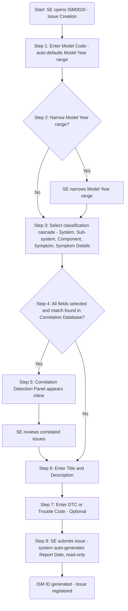
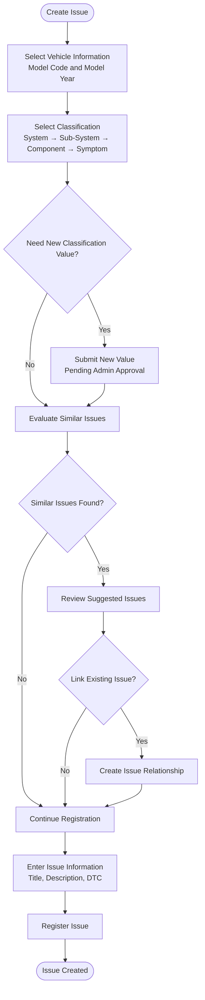
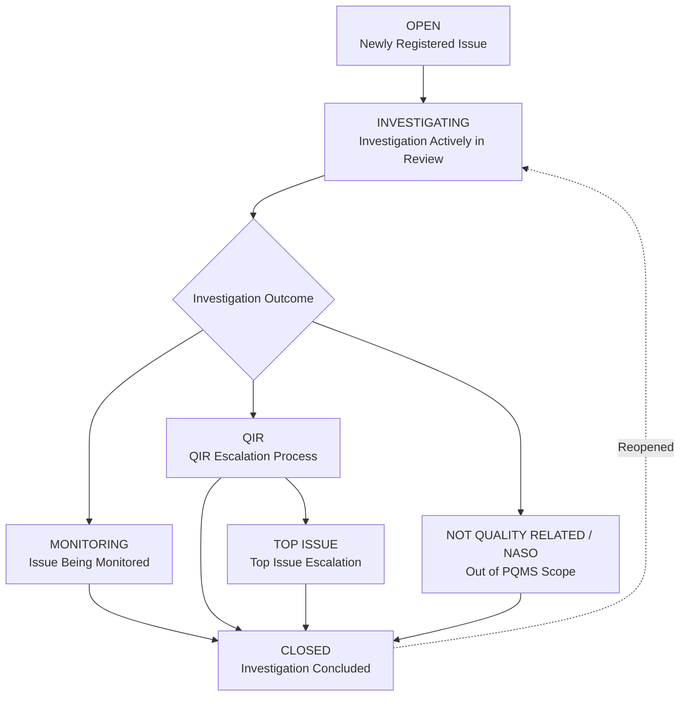

# N-PQMS ISM Module — Business Requirements Document

| Field | Value |
|---|---|
| **Document ID** | KPQMS-ISM-BRD-v1.6 |
| **Title** | N-PQMS Issue Management Module 
| **Module** | ISM — Issue Management |
| **Status** | Draft Version|
| **Version** | 1.6 |
| **Date** | 2026-08-24 |
| **Author** | Renuka Chowdhury |
| **Reviewers** | Joon Sung Yoo (HAEA PM), Robert Nguyen (KIA NA,Business Owner) |
| **Parent BRD** | KPQMS-BRD-P1-v1.1, KPQMS-BRD-P1-v1.3 ,KPQMS-BRD-P1-v1.4,KPQMS-BRD-P1-v1.5 |

---
## Revision History

| Version | Date | Author | Summary |
|---|---|---|---|
| 1.0 | 2026-06-17 | PQ Systems Team | Initial draft — ISM enhancements: multi-source adaptive entry, 6-level classification hierarchy, cross-model and cross-engineer correlation, issue linking and grouping |
| 1.2 | 2026-06-22 | PQ Systems Team | Added 5 User Flows (UF-01–UF-06, Mermaid flowcharts); added User Stories subsections throughout §6 (all FR groups); renumbered 5–11 → 6–12 |
| 1.3 | 2026-06-24 | PQ Systems Team | Prototype-driven updates: Issue ID format (`{SYS}-{YY}{NNNN}`); DTC/Trouble Code field on ISM0020 and ISM0040 entry; field label changes ("Affected VIN(s)", "Model Year"); manufacturing origin fields editable; Scope & Description optional; ISM0020 real-time correlation panel confirmed; ISM0040 tab renamed to "Chronology" (oldest-first with day-gap markers); Status Change requires mandatory comment logged to Chronology; ISM0010 attention banners (Action Required, SLA Overdue, Correlation Alert) replace stat cards; "Assigned to Me" filter and badge added to ISM0010. New sections: 6.9 (Issue ID Format), 6.10 (Issue Activity Chronology), 6.11 (Status Change with Required Comment). Updated 6.1, 6.2, 6.7. |
| 1.4 | 2026-07-07 | PQ Systems Team | Including changes to Overview navigation, Issue List default views and columns, simplification of Issue Registration to support minimum required fields, adoption of Model Code as the primary vehicle identifier, relocation of DTC capture to the Issue Description section, removal of non-essential registration fields, enhancement of issue linking capabilities, emphasis on chronology/activity logging for audit purposes, clarification of Phase 1 and Phase 2 scope boundaries|
| 1.5 |2026-07-10 | PQ Systems Team |Added Issue List usability enhancements; introduced search scope clarification and horizontal scrolling support; refined suggested issue review and issue preview process; enhanced linked issue management and visibility; redesigned Issue Workspace into Issue Detail, Investigation, Resolution, Communication, and History sections; added rationale capture for status and classification changes; added history management improvements including audit visibility and restricted manual activity entry; added supporting document upload capability; refined QIR creation terminology; reviewed Investigation vs Resolution responsibilities |
| 1.5.1 |  2026-08-04 | PQ Systems Team | Added review outcomes and incremental updates covering Parent-Child Issue Relationships, Linked Issue History, Manual Part Evaluation Entry, Status Management, Issue Reopen Capability, Summary Navigation, Classification Governance, and Multiple QIR support. |
| 1.5.2 | 2026-08-19 | PQ Systems Team | Future Legal & Compliance Considerations were identified during stakeholder discussions and legal review activities. These items are not currently considered Phase 1 scope and shall be evaluated as future enhancements during subsequent project phases.|
| 1.5.3 | 2026-08-20 | PQ Systems Team | Added Issue Priority Management requirements based on Business Owner review. Moved Priority Calculator scope from QIR Management to ISM. Introduced configurable Issue Priority scoring framework, admin-managed priority categories and point configuration, Phase 1 manual priority assessment, future Phase 2 automated scoring, Issue Priority inheritance to QIR records, priority override governance with mandatory rationale, Issue Workspace priority calculation action, and associated administration requirements. |

## Reference Document

 Document Name | DOC Manager Location|
|---------|----------|
| N PQMS-Requirements | N-PQMS_ISM_BRD_v1.1, N-PQMS_ISM_DRD_v1.1 ,N-PQMS_ISM_BRD_v1.3,N-PQMS_ISM_BRD_v1.4 |
| UI Prototype | N-PQMS UI Prototype |
| High Level Design | DES-001-NPQMS HLD Part 01 , DES-002-NPQMS HLD Part02 M1 ISM Functional v1.0  |
| Data Model Design | DM-001-NPQMS HLD Part03 Datamodel v1.0 |

---
  
   ## Table of Contents

1. [Executive Summary](#1-executive-summary)
2. [Roles & Access Control](#2-roles--access-control)
3. [Business Objectives](#3-business-objectives)
4. [Stakeholders](#4-stakeholders)
5. [Scope Boundary](#5-scope-boundary)
6. [User Flows](#6-user-flows)
   - 6.1 [UF-01 — Issue Registration Flow](#61-uf-01--issue-registration-flow)
   - 6.2 [UF-02 — Classification & Correlation Detection (During Entry)](#62-uf-02--classification--correlation-detection-during-entry)
   - 6.3 [- Issue Status Life Cycle](#63-issue-status-life-cycle)
7. [Functional Requirements](#7-functional-requirements)
   - 7.1 [Overview](#71-overview) 
   - 7.2 [ISM0010 — Issue List](#72-ism0010--issue-list)
   - 7.3 [ISM0020 — Issue Entry](#73-ism0020--issue-entry)
   - 7.4 [ISM0040 — Issue Workspace](#74-ism0040--issue-workspace)
   - 7.5 [ADM0200 — ADMIN](#75-ADM0200--admin)
8. [Non-Functional Requirements](#8-non-functional-requirements)
9. [Assumptions & Dependencies](#9-assumptions--dependencies)
10. [Risk and Mitigation](#10risks-and-mitigations)
11. [Out of Scope (Phase 1)](#10-out-of-scope-phase-1)
12. [Review Outcomes](#12-review-outcomes-and-incremental-updates)
13. [Approvals](#13-approvals)
---

## 1. Executive Summary

| Item | Detail |
|---|---|
|**Problem Statement** | The legacy KPQMS issue entry form is source-agnostic and single-vehicle-level, making it impossible to capture source-specific data efficiently, apply structured classification for correlation, or proactively surface duplicate/related issues filed by different engineers. Quality signals are siloed per engineer and per model. Additionally, the legacy system lacks: structured issue identification (no system-coded IDs), DTC capture at entry, a clear chronological activity trail, enforced documentation of status changes, and actionable at-a-glance priority information for the QE on login. |
| Proposed Solution | Enhance the ISM module with: (1) The N-PQMS Overview serves as the centralized entry point for users across Issue Management (ISM), QIR Management, and TSB Management modules. The Overview provides users with immediate visibility into pending actions, critical quality issues, recently accessed records, and overall issue lifecycle health;(2) an adaptive multi-source entry form with issue source channels and DTC/Trouble Code capture; (3) a 7-level vehicle classification hierarchy with cascading selection and user-editable manufacturing origin fields; (4) four searchable classification key fields (System · Sub-system·Component · Symptom) with master-data management; (5) real-time cross-model correlation detection during entry; (6) post-submission cross-engineer correlation suggestions surfaced in ISM0010 and ISM0040; (7) a system-coded issue ID format (`{SYS}-{YY}{NNNN}`); (8) a mandatory comment gate on all status changes, recorded in a chronological activity trail; and (9) an attention-banner dashboard in ISM0010 surfacing action-required items, SLA overruns, and correlation alerts with an "Assigned to Me" filter. |
| **Business Value** | Reduces duplicate investigation effort; accelerates root-cause convergence across vehicle models; enables data-driven grouping of related issues into consolidated multi-team quality problems; improves classification quality for analytics; ensures status changes are documented and auditable; improves QE focus by surfacing priority actions above the issue list. |
| **Phase** | Phase 1 — Core ISM (go-live December 18, 2026) |
| **Module Tier** | Tier 1 Critical (24.4% of total KPQMS usage) |
| **Document Scope** | ISM0020 (entry), ISM0010 (list/alerts/filters), ISM0040 (detail/links/chronology/status change); classification taxonomy; correlation engine; link/group data model; issue ID format |

---
## 2. Roles & Access Control

### 2.1 Role Definitions

| Role | KUS or External | Comments | N-PQMS Access Details |
|------|----------------|----------|----------------------|
| Service Engineer | KUS | Evaluation of collected parts, including structured test drives. | Power user access. Access to all functions except administration. All screens default to individual view. |
| Service Engineer Manager | KUS | Investigation of specific vehicles at dealerships. | Similar to Service Engineer role, except screens default to team/global views. |
| PQ Department Head | KUS | Participates in investigations involving PQ, Suppliers, Plants, NAQC, and HATCI. | Read-only access to all functional areas except administration. |
| Administrator | KUS | Manages system configuration and administration. Users may submit requests for new activity categories and classifications for review and approval. | Full system access. All screens default to global views. |
| Publication Coordinator | KUS | Responsible for publication process coordination. | Access to Publication Management functions only. |
| Publication Task Owners | KUS | May be divided into multiple roles (e.g., Warranty, Service Operations, Service Garage, Safety Office, Legal, Parts, MPA). | Access to Publication Management communications and task approvals only. Read-only access to most Publication Management functions. |
| Kia Georgia (KaGA) | External | Plant team member. | Access to submit publications, provide status updates, and communicate within Publication Management. View-only access to Publication Management. |
| Kia Mexico (KMX) | External | Plant team member. | Access to submit publications, provide status updates, and communicate within Publication Management. View-only access to Publication Management. |
| HQ (Kia HQ) | External | Plant team member. | Access to submit publications, provide status updates, and communicate within Publication Management. View-only access to Publication Management. |
| NAQC | External | Technical team supporting Top Issue escalations. | TBD. May require visibility into ISM, QIR, and Publication Management. Access is expected to be primarily read-only. |
| HATCI | External | Technical team currently supporting EDIR Publication Management tasks. | Access to Publication Management task approvals only |

## Authorization Matrix – Issue Management (ISM)

| Function | Service Engineer | Service Engineer Manager | PQ Department Head | Administrator | NAQC |
|-----------|---|---|---|---|---|
| View Issue List | Y | Y | Y | Y | Y (RO) |
| View Issue Details | Y | Y | Y | Y | Y (RO) |
| Create Issue | Y | Y | N | Y | N |
| Update Issue Before Submission | Y | Y | N | Y | N |
| Update Issue After Submission | N | Y* | N | Y | N |
| View Issue Workspace | Y | Y | Y | Y | Y (RO) |
| Record Investigation Activities | Y | Y | N | Y | N |
| Upload Supporting Documents | Y | Y | N | Y | N |
| Manage Linked Issues | Y | Y | N | Y | N |
| Change Issue Status | Y | Y | N | Y | N |
| View Audit History | Y | Y | Y | Y | Y (RO) |
| Export Issue Information | Y | Y | Y | Y | Y (RO) |
| Manage Classification Master Data | N | N | N | Y | N |
| Manage Configuration | N | N | N | Y | N |
| Maintain User Access & Roles | N | N | N | Y | N |

## 3. Business Objective

| # | Objective | Success Measure |
|---|-----------|----------------|
|BO-01 | Improve quality issue management efficiency. | Reduce issue registration, investigation, and resolution effort while improving overall process efficiency. |
|BO-02 | Improve traceability and auditability. | Ensure issue activities, status changes, decisions, and audit records are fully traceable throughout the issue lifecycle. |
|BO-03 | Reduce duplicate investigations. | Increase identification of related issues and promote reuse of existing investigation knowledge. |
| BO-04 | Enhance collaboration across teams. | Improve information sharing and coordination among Quality, Service, Engineering, Management, and related stakeholders. |
| BO-05 | Support informed business decision-making. | Provide accurate issue data, reporting, and visibility to support operational and management decisions. |
| BO-06 | Allow classification taxonomy to grow with emerging quality signals                             | Admin users can add/approve new System, Sub-system, or Symptom values without an engineering deployment |
| BO-07 | Ensure all issue status changes are documented and auditable                                    | 100% of status change events carry a user-authored reason; reason visible in Chronology timeline within the same session                                                   |
| BO-08 | Give each SE immediate visibility of priority actions on login to ISM0010                       | Average time-to-action on approval-pending and SLA-overdue items reduced by ≥ 40% vs. legacy (measured in UAT scenario testing) |
|BO-09 | Improve issue prioritization and escalation consistency | Issue Priority is consistently evaluated, documented, governed, and inherited by associated QIR records |

---                              

| BR-ID | Priority | Business Requirement |
|--------|----------|----------------------|
| BR-ISM-001 | P1 | The system shall enable users to efficiently register, investigate, track, and resolve quality issues throughout their lifecycle |
| BR-ISM-002 | P1 | The system shall provide role-based access and personalized views to support efficient issue management and monitoring |
| BR-ISM-003 | P1 | The system shall support vehicle identification and issue classification to enable effective issue tracking, investigation, and analysis |
| BR-ISM-004 | P1 | The system shall provide a centralized workspace for issue investigation, collaboration, resolution activities, and historical tracking |
| BR-ISM-005 | P1 | The system shall enable users to identify, correlate, and manage related or duplicate issues to improve traceability, reduce duplicate investigations, and promote knowledge reuse |
| BR-ISM-006 | P1 | The system shall provide complete traceability of issue activities, status changes, decisions, and administrative actions throughout the issue lifecycle |
| BR-ISM-007 | P1 | The system shall support integration and information sharing between Issue Management and QIR Management processes |
| BR-ISM-008 | P2 | The system shall provide a scalable and configurable framework that supports future business requirements and process enhancements |
| BR-ISM-009 | P2 | The system shall improve user efficiency through streamlined workflows and intuitive navigation |
| BR-ISM-010 | P1 | The system shall enable users to efficiently search, filter, and locate issues using business-relevant criteria |
| BR-ISM-011 | P1 | The system shall enable authorized users to create, view, update, and manage issue records |
| BR-ISM-012 | P1 | The system shall support issue lifecycle management through configurable statuses, workflow transitions, and business outcomes |
| BR-ISM-013 | P2 | The system shall provide reporting and data export capabilities to support business analysis and decision-making |
| BR-ISM-014 | P1 | The system shall support issue resolution decision management to enable users to determine, document, and track the business outcome of an issue investigation. |
| BR-ISM-015 | P1 | The system shall support hierarchical issue classification management and controlled taxonomy expansion to enable accurate issue classification and administration of new classification values. |
| BR-ISM-016 | P1 | The system shall support Model Code-specific Model Year selection and maintenance throughout the Issue lifecycle to ensure accurate vehicle identification and issue traceability. |
## Additional Business Requirements from Review Outcomes

| BR-ID | Priority | Business Requirement |
|--------|----------|----------------------|
| BR-ISM-017 | P1 | The system shall support configurable Issue Priority Management to enable consistent evaluation, prioritization, escalation, and governance of quality issues throughout the Issue lifecycle. The Issue Workspace shall provide a dedicated"Priority Assessment" action that allows authorized users to initiate, update, review, and manage Issue Priority Assessments.|
| BR-ISM-018 | P1 | The system shall support administrator-managed configuration of Issue Priority Categories, Point Values, scoring rules, and related priority calculation parameters. |
| BR-ISM-019 | P1 | The system shall support inheritance of Issue Priority information from Issues to associated QIR records to maintain prioritization consistency and reduce duplicate effort. |
| BR-ISM-020 | P1 | The system shall maintain complete auditability and traceability of Issue Priority calculations, overrides, administrative configuration changes, and priority history. |
| BR-ISM-021 | P1 | The system shall support management of related Issues as a unified Issue Family while preserving traceability, relationship visibility, consolidated investigation history, and lifecycle consistency across linked Issues. |
| BR-ISM-022 | P3 | The system shall support future legal discovery, compliance, regulatory review, and evidence management processes through controlled access to Issue-related information and associated records. |
| BR-ISM-023 | P3 | The system shall support monitoring and governance of inactive investigations through configurable inactivity tracking, notifications, and investigation continuation management. |

---

## 4. Stakeholders

| Role | Name / Team | Responsibility |
|---|---|---|
| PM (HAEA) | Joon Sung Yoo | Overall N-PQMS delivery, scope decisions, go-live sign-off |
| Business Owner (KIA) |Robert Nguyen | Authority of NPQMS project |
| PQM | PQ Management team | Final authority on issue disposition, group creation, cross-team escalation |
| SEM | Service Engineer Manager | Approves issues, escalates to PQM, manages regional quality concerns |
| SE | Service Engineer | Primary user of ISM0020 (issue entry) and ISM0040 (issue detail/links/chronology) |
| Admin | System Administrator | Manages classification taxonomy (System/Sub-system/Component/Symptom master data); manages issue source channel configurations |
| PQ Systems Team | N-PQMS development | Implementation, integration, and release |

---

## 5. Scope Boundary

### New In Scope 

The Phase 1 release of the Issue Management System (ISM) shall include the following capabilities:

- Provide an Overview page for users to access and monitor Issue Management activities.
- Create and register new issues using a simplified issue registration process.
- Capture minimum mandatory issue information, including Model Code, System Classification, Issue Title, and Description.
- Support vehicle identification using Model Code and associated vehicle information.
- Allow users to classify issues using System, Sub-system, and Component classifications.
- Support Diagnostic Trouble Code (DTC) capture as part of issue information.
- Generate and maintain unique ISM Issue IDs.
- Allow users to search, filter, sort, and view issue records from the Issue List.
- Provide role-based default views, including "My Issues" as the default engineer view.
- Support configurable issue list columns based on role and user preferences.
- Allow manual linking of issues using Issue Numbers.
- Provide system-generated suggested issue links for review.
- Allow users to review issue details before accepting suggested links.
- Provide Issue Detail and Workspace functionality for issue management.
- Maintain a complete chronology and activity log of issue-related actions.
- Support issue status management throughout the issue lifecycle.
- Maintain audit history and traceability of all significant issue activities.
- Support administration of classification master data and business-defined classifications.
- Provide role-based access and authorization controls.
- Support future expansion through configurable business rules and classification structures.
---
### Out of Scope (see Section 10)

- Customizable/user-configurable issue source channel types (Phase 2)
- AI-driven similarity scoring beyond keyword/classification key matching (Phase 2)
- Issue Group management screen (ISM0150 — tentative Phase 2)
- EWS and GQIS data ingestion pipelines (covered by INT-02, INT-03 integration BRDs)
---

## 6. User Flows

This section documents the primary user flows as flowcharts. Each flow covers a complete end-to-end journey for a specific scenario. Mermaid diagram syntax is used throughout.

### 6.1 UF-01 — Issue Registration Flow

**Actor:** Service Engineer (SE)
**Entry Point:** ISM0020 — Issue Creation
**Goal:** Register a new quality issue with correct vehicle and classification data.

---
### 6.2 UF-02 — Classification & Correlation Detection (During Entry)

**Actor:** Service Engineer (QE)  
**Entry Point:** ISM0020 – Create Issue  
**Goal:** Classify an issue, review potential matching issues, optionally create issue relationships, and register a new issue.

---

### 6.3 Issue Status Life Cycle

#### Issue Status Definitions

| Status Code | Label | Description |
|-------------|--------|-------------|
| OPEN | Open | Newly registered issue. |
| INVESTIGATING | Investigating | Investigation is actively in review. |
| MONITORING | Monitoring | The issue is being monitored. |
| QIR | QIR | Issue has entered the QIR escalation process |
| TOP_ISSUE | Top Issue | Issue has been escalated to the Top Issue process. |
| Not Quality Related or NASO  | Not Quality Related or NASO Escalation | Issue does not belong to PQMS (e.g., Safety, Regulatory, or another department) | 
| CLOSED | Closed | Investigation concluded or the reported condition is not an actual issue and no further action is required.  |

## Issue Lifecycle Flow

## 7-Functional-Requirements

### 7.1 Overview

The N-PQMS Overview serves as the centralized entry point for users across Issue Management (ISM), QIR Management, and TSB Management modules. The Overview provides users with immediate visibility into pending actions, critical quality issues, recently accessed records, and overall issue lifecycle health;Overview  is the primary landing screen for all NPQMS users.

### Functional Requirements

 FR-ID  | Priority | Requirement |
|--------|----------|-------------|
| FR-ISMOVE-001 | P1  | Display header with global navigation (Overview, Issue Management, QIR Management, TSB Management), breadcrumb, help icon, notifications with unread count, and user profile name, role, and last login timestamp |
| FR-ISMOVE-002 | P2  | Display summary cards for Issue Management, QIR Management, and Publication/TSB, each showing key status counts (e.g., Open/Critical/Escalated, Draft/In Review/Published) with a link to the module's detailed listing |
| FR-ISMOVE-003 | P1  | Display "My Action Items" list of tasks assigned to the user, filterable by All / Due Today / Overdue, showing title, record ID, status, due date, and priority, with an "Open" action to view full record |
| FR-ISMOVE-004 | P1  |  Display "Attention Required"  listing high-impact records (record ID, severity tag, description, impact metric) with drill-down to full record details |
| FR-ISMOVE-005 | P1  |The Overview tab shall display a "Recently Accessed" panel listing records the user has recently viewed, across Issue, QIR, and Publication types |
| FR-ISMOVE-006 | P1  | Each recently accessed item shall display its record type (Issue/QIR/Publication), record ID, title/description, current status, and a relative timestamp (e.g., "8 min ago", "Yesterday") |
| FR-ISMOVE-007 | P1 | Each recently accessed item shall be clickable, navigating the user to the corresponding record's detail page. |
| FR-ISMOVE-008 | P1 | The Overview shall provide a "View All" link to navigate to the complete recently accessed history. |
| FR-ISMOVE-009 | P1  |The Overview shall display a "Lifecycle Health" panel showing the count of issues at each lifecycle stage: Open, Investigation, Review, Escalated, and Closed |
| FR-ISMOVE-010 | P1  | Each lifecycle stage shall be visually distinguished using a distinct color indicator (e.g., blue for Open, red for Escalated, green for Closed) alongside its count |
| FR-ISMOVE-011 | P1  | The system shall dynamically update the Recently Accessed list and Lifecycle Health counts to reflect the latest user activity and issue data |
| FR-ISMOVE-012 | P1  |Refresh counts, action items, and alerts dynamically to reflect the latest data |
| FR-ISMOVE-013 | P1 | Personalize dashboard content based on the logged-in user's role |

#### User Stories

| US-ID | Role | Story | Acceptance Criteria | Related FRs |
|--------|------|--------|--------------------|------------|
| US-ISMOVE-001 | User | As a user, I want to view the Overview dashboard so that I can quickly understand my pending actions and system activities. | 1. Dashboard is displayed after login. 2. User can view My Action Items. 3. User can view Attention Required items. | FR-ISMOVE-001, FR-ISMOVE-003, FR-ISMOVE-004 |
| US-ISMOVE-002 | User | As a user, I want to view recently accessed records so that I can quickly navigate to records I worked on recently. | 1. Recently accessed records are displayed. 2. Records display status and timestamp. 3. Records are clickable. | FR-ISMOVE-005, FR-ISMOVE-006, FR-ISMOVE-007 |
| US-ISMOVE-003 | User | As a user, I want to monitor lifecycle health metrics so that I can understand issue distribution and workload. | 1. Lifecycle counts are displayed. 2. Counts refresh dynamically. 3. Statuses are visually distinguishable. | FR-ISMOVE-009, FR-ISMOVE-010, FR-ISMOVE-011 |

### 7.2 ISM0010 — Issue List: 

| FR-ID | Priority | Requirement | BR-ID |
|-------|----------|-------------|-------|
| FR-ISM010-001 | P1 |The Issue List shall display Issue ID, Issue Title, Model Code, Classification, Status and shall allow users to open the Issue Workspace by selecting an issue record.| BR-ISM-002|
| FR-ISM010-002 | P1 | The Issue list shall display "My Issues" as the default Issue List view for logged-in users. | BR-ISM-002 |
| FR-ISM010-003 | P1 | The Issue list shall provide an "All Issues" view to display all accessible issues. | BR-ISM-002 |
| FR-ISM010-004 | P1 | The Issue List shall support configurable columns based on user role and personal preferences, allowing the system to determine which columns are available for display to each user | BR-ISM-002, BR-ISM-008 |
| FR-ISM010-005 | P1 | The system shall retain user-selected Issue List column configurations across user sessions and automatically apply saved preferences when the user accesses the Issue List | BR-ISM-002, BR-ISM-009 |
| FR-ISM010-006 | P1 | The Issue list shall provide a filter panel that supports filtering by vehicle(MC), classification, and issue attributes. | BR-ISM-002 |
| FR-ISM010-007 | P1 | The Issue list shall support searchable filters with type-ahead functionality. | BR-ISM-009 |
| FR-ISM010-008 | P1 | The Issue list shall support horizontal scrolling when selected columns exceed the available screen width. | BR-ISM-008 |
| FR-ISM010-009 | P1 | The Issue list shall display complete Issue IDs and Titles or provide visibility through hover functionality. | BR-ISM-009 |
|FR-ISM010-010 | P1 | The ISM0010 issue list should support Issue ID format (`{SYS}-{YY}{NNNN}`system Code + Year + Sequence, ensuring identification by system (e.g., EE, Trans)| BR-ISM-001 |
| FR-ISM010-011 | P1 | Role-based default views configured by Admin and User-specific customizable views for individual preferences|BR-ISM-008 |
| FR-ISM010-012 | P1 | The system shall display a breadcrumb (Issue Management > Issue List) with a back navigation option to the previous screen | BR-ISM-001 |
| FR-ISM010-013 | P1 |The system shall provide an "Export" action to download the issue list, and a "New Issue" action to navigate to the issue creation form | BR-ISM-011 |
| FR-ISM010-014 | P1 | The system shall display summary stat cards for Total, Critical, High, Medium, Low, and Info issue counts, each with a trend indicator showing change since the last period | BR-ISM-001 ,BR-ISM-005 |
| FR-ISM010-015 | P1 | The system shall provide filter fields for all the columns to refine the issue list| BR-ISM-010 |
| FR-ISM010-016 | P1 | The system shall provide "Apply Filters" and "Clear All" actions to apply or reset all selected filter/source criteria | BR-ISM-010 |
| FR-ISM010-017 | P1 | The system shall update the issue list and summary stat cards dynamically based on the applied filters | BR-ISM-010, BR-ISM-009 |
| FR-ISM010-018 | P1 |  The system shall provide free-text search across issue attributes and provide keyword search across all searchable issue attributes displayed within the issue list | BR-ISM-010 |
| FR-ISM010-019 | P1 | The system shall allow row selection via checkboxes, enabling bulk actions to assign, change status, or export selected issues | BR-ISM-011|
| FR-ISM010-020 | P1 | The system shall display pagination controls with total issue count, adjustable rows-per-page, and page navigation| BR-ISM-001 |
| FR-ISM010-021 | P1 | The system shall provide a Column Configuration Panel that allows users to manage and customize the columns displayed within the Issue List | BR-ISM-009 |
| FR-ISM010-022 | P1 | The system shall display a predefined set of default columns when a user initially accesses the Issue List or resets personalized settings.Default columns shall include:- Issue ID, Issue Title, Model Code, Classification,Status | BR-ISM-009 |
| FR-ISM010-023 | P1 | The system shall allow users to show or hide optional columns available within the Issue List while preserving mandatory columns defined by system configuration | BR-ISM-009 |
| FR-ISM010-024 | P1 | The system shall display default columns including Issue ID, Issue Title, Model Code, Classification, Status, and Linked Indicators. | BR-ISM-014 |
| FR-ISM010-025 | P1 | The system shall require users to provide a reason or comment when performing a bulk status change from the Issue List and shall validate the entry before processing the update. | BR-ISM-006, BR-ISM-012 |

#### User Stories

| US-ID | Role | Story | Acceptance Criteria | Related FRs |
|--------|------|--------|--------------------|------------|
| US-ISM010-001 | User | As a user, I want to view issues assigned to me by default so that I can focus on my work items | 1. My Issues view is displayed by default. 2. User can switch to All Issues. | FR-ISM010-002, FR-ISM010-003, FR-ISM010-011 |
| US-ISM010-002 | User | As a user, I want to search and filter issues so that I can quickly locate relevant records. | 1. Search is available. 2. Filters can be applied. 3. Filtering updates the list | FR-ISM010-006, FR-ISM010-007, FR-ISM010-014, FR-ISM010-015, FR-ISM010-016, FR-ISM010-017, FR-ISM010-018 |
| US-ISM010-003 | User | As a user, I want to personalize the columns displayed in the Issue List so that I can view information relevant to my role and work preferences. | 1. The system displays predefined default columns when the Issue List is first accessed. 2. Users can open a Column Configuration Panel from the Issue List. 3. Users can show or hide optional columns. 4. Mandatory columns cannot be hidden.Users only see columns permitted by their role. 5. User-selected column preferences are retained across sessions. 6. The Issue List reflects the updated column configuration immediately after changes are applied.| FR-ISM010-004,FR-ISM010-021,FR-ISM010-022,FR-ISM010-023,FR-ISM010-005, FR-ISM010-006, FR-ISM010-007 |
| US-ISM010-004 | User | As a user, I want to export issue data so that I can perform offline analysis and reporting. | 1. Export action is available. 2. Export contains visible records,3. New Issue action is available from the Issue List. 4. Selecting New Issue navigates the user to the Issue Entry screen | FR-ISM010-013 | 
| US-ISM010-005 | User | As a user, I want to view issue information and access issue details so that I can efficiently review and manage issues. | 1. Issue List displays Issue ID, Issue Title, Model Code, Classification, Status,  2. Complete Issue IDs and Titles are visible or accessible through hover functionality. 3. Issue IDs use the format `{SYS}-{YY}{NNNN}`. 4. Selecting or double-clicking an issue opens the Issue Workspace or Issue Detail screen | FR-ISM010-001, FR-ISM010-009, FR-ISM010-010 |
| US-ISM010-006 | User | As a user, I want navigation and paging controls so that I can efficiently navigate large issue lists. | 1. Breadcrumb navigation is displayed. 2. Users can navigate back to the previous screen. 3. Pagination controls are available. 4. Total issue count is displayed. 5. Users can navigate between pages. 6. Users can select the number of rows displayed per page | FR-ISM010-012, FR-ISM010-020 |
| US-ISM010-007 | User | As a user, I want to perform actions on multiple issues at once so that I can manage issues more efficiently. | 1. Users can select multiple issues using row checkboxes. 2. Bulk Assign action is available for selected records. 3. Bulk Status Change action is available for selected records. 4. Selected issues can be exported. 5.Users must provide a reason or comment when changing status. | FR-ISM010-019 |

### 7.3 ISM0020 — Issue Entry

| FR-ID  | Priority | Requirement | BR-ID |
|--------|----------|-------------|-------|
| FR-ISM020-001 | P1 | The system shall provide a simplified Issue Entry screen containing only the minimum information required to register an issue | BR-ISM-001, BR-ISM-009, BR-ISM-011 |
| FR-ISM020-002 | P1 | For Issue Entry the system shall allow users to enter details in the following order: Model Code ->**Model Year** → System Classification → Title → Description → DTC. | BR-ISM-003, BR-ISM-014 |
| FR-ISM020-003 | P1 | The ISM0020 shall capture vehicle information using Model Code only; the system shall auto-default the Model Year range based on the entered Model Code, and allow the users to optionally refine the applicable Model Year selection | BR-ISM-003 |
| FR-ISM020-004 | P1 | The system shall allow users to classify issues using System, Sub-system, Component, and Symptom classifications. | BR-ISM-003, BR-ISM-014 |
| FR-ISM020-005 | P1 | The system shall provide searchable classification fields with type-ahead functionality. | BR-ISM-009, BR-ISM-010 |
| FR-ISM020-006 | P1 | The system shall allow users to enter an Issue Title and Description. | BR-ISM-001, BR-ISM-011 |
| FR-ISM020-007 | P2 | The system shall allow users to capture Diagnostic Trouble Codes (DTCs) associated with the issue. | BR-ISM-003, BR-ISM-014 |
| FR-ISM020-008 | P1 | The system shall display sufficient issue summary information for suggested Issues to enable users to evaluate potential Issue relationships prior to linking. Summary information shall include Issue ID, Issue Title, Status, Classification, Model Information, and configured match indicators. | BR-ISM-005, BR-ISM-009 |
| FR-ISM020-009 | P1 | The system shall generate a unique Issue ID upon successful issue registration. | BR-ISM-001, BR-ISM-011, BR-ISM-012 |
| FR-ISM020-010 | P1 | The system shall automatically capture the Issue Creation Date upon issue registration. | BR-ISM-006, BR-ISM-012 |
| FR-ISM020-011 | P1 | The system shall display suggested existing issues that match the selected classification criteria during issue registration. | BR-ISM-005, BR-ISM-010 |
| FR-ISM020-012 | P1 |  The system shall allow users to search for existing issues and manually create issue relationships during issue registration, including issues not presented in the suggested issue results. | BR-ISM-005, BR-ISM-010 |
| FR-ISM020-013 | P1 | The system shall validate mandatory fields before allowing issue registration. | BR-ISM-011 |
| FR-ISM020-014 | P1 | The system shall redirect users to the Issue Workspace upon successful issue registration. | BR-ISM-004, BR-ISM-011 |
| FR-ISM020-015 | P1 | The system shall provide the reason for each issue suggestion. | BR-ISM-005, BR-ISM-009 |
| FR-ISM020-016 | P1 | The system shall display matching indicators such as Exact Classification Match, Same Model Code Match, or other configured match types. | BR-ISM-005 |
| FR-ISM020-017 | P1 | The system shall display key details for suggested issues, including Issue ID, Issue Title, Classification, Symptom, Current Status, and other configured issue attributes required for link evaluation. | BR-ISM-014, BR-ISM-012 | 
| FR-ISM020-018 | P1 | The system shall allow users to select one or more suggested issues for linking. | BR-ISM-005, BR-ISM-011 |
| FR-ISM020-019 | P1 | The system shall maintain relationships between linked issues after issue registration. | BR-ISM-005, BR-ISM-011 |
| FR-ISM020-020 | P1 | The system shall record issue linking activities in the issue history and audit trail. | BR-ISM-006 |
| FR-ISM020-021 | P1 | The system shall allow users to continue issue registration regardless of whether a suggested issue is linked. | BR-ISM-001, BR-ISM-009  |
| FR-ISM020-022 | P1 | The system shall allow users to initiate Issue linking directly from the suggested Issue results displayed during Issue Registration. | BR-ISM-005 |
| FR-ISM020-023 | P1 | The system shall allow users to cancel the Issue linking process without creating an Issue relationship and without losing data entered during Issue Registration. | BR-ISM-009 , BR-ISM-001 |
| FR-ISM020-024 | P1 | The system shall preserve all Issue Entry information when users initiate, cancel, or complete Issue linking activities during Issue Registration. | BR-ISM-009 |
| FR-ISM020-025 | P1 | Suggested Issue information displayed during Issue Registration shall be presented in a read-only format. | BR-ISM-011 |
| FR-ISM020-026 | P1 | The system shall display a confirmation message upon successful issue registration. | BR-ISM-001, BR-ISM-011 |
| FR-ISM020-027 | P1 | The system shall display the generated Issue ID following successful issue registration. | BR-ISM-011, BR-ISM-012 |
| FR-ISM020-028 | P1 | The system shall display the Issue Title associated with the registered issue. | BR-ISM-014 |
| FR-ISM020-029 | P1 | The system shall display the initial issue status assigned during issue registration. | BR-ISM-012 |
| FR-ISM020-030 | P1 | The system shall indicate that the issue has been successfully created and is available for further processing. | BR-ISM-001 |
| FR-ISM020-031 | P1 | The system shall provide an option to navigate back to the Issue List after successful issue registration. | BR-ISM-009, BR-ISM-011 |
| FR-ISM020-032 | P1 | The system shall provide an option to navigate directly to the Issue Workspace for the newly created issue. | BR-ISM-004, BR-ISM-011 |
| FR-ISM020-033 | P1 | The system shall associate the generated Issue ID with the new issue record and maintain it throughout the issue lifecycle. | BR-ISM-011, BR-ISM-012 |
| FR-ISM020-034 | P1 | The system shall create an audit trail entry upon successful issue registration. | BR-ISM-006 |
| FR-ISM020-035 | P1 | The system shall automatically assign the initial workflow status to the issue upon registration.The system shall assign the initial issue status as Open. | BR-ISM-012 |
| FR-ISM020-036 | P2 | The system shall display a visual confirmation message indicating successful Issue creation and shall clearly distinguish success messages from validation or processing error messages. | BR-ISM-009 |
| FR-ISM020-037 | P1 | The system shall enforce role-based access controls for Issue Entry functions based on the authenticated user's assigned role. | BR-ISM-002, BR-ISM-009 |
| FR-ISM020-038 | P1 | The system shall dynamically filter available Model Year values based on the selected Model Code. | BR-ISM-016 |
| FR-ISM020-039 | P1 | Users shall be able to add, remove, and modify selected Model Year values during Issue creation and Issue editing activities. | BR-ISM-016 |
| FR-ISM020-040 | P1 | The system shall apply Model Code and Model Year selection behavior consistently across Issue Entry, Edit Issue, and Issue Detail screens. | BR-ISM-016 |
| FR-ISM020-041 | P1 | The system shall allow users to propose new classification values when a required System, Sub-system, Component and Symptom value is unavailable. | BR-ISM-015 |
| FR-ISM020-042 | P1 | The system shall assign a Pending Approval status to newly proposed classification values until reviewed by an authorized administrator. | BR-ISM-015 |
| FR-ISM020-043 | P1 | The system shall allow Issue creation and submission when one or more pending classification values are associated with the Issue. | BR-ISM-015 |
| FR-ISM020-044 | P1 | The system shall record the proposer, classification type, proposed value, originating Issue, and submission timestamp for each classification value request. | BR-ISM-015 |
| FR-ISM020-045 | P1 | The system shall provide authorized administrators with access to pending classification value requests for review. | BR-ISM-015 |
| FR-ISM020-046 | P1 | The system shall allow authorized administrators to approve or reject pending classification value requests. | BR-ISM-015 |
| FR-ISM020-047 | P1 | The system shall notify the proposer when a submitted classification value request is approved or rejected. | BR-ISM-015 |
| FR-ISM020-048 | P1 | Approved classification values shall become available for future classification and Issue registration activities. | BR-ISM-015 |
| FR-ISM020-049 | P1 | The system shall maintain audit history for classification value requests and their approval, rejection, and update activities. | BR-ISM-015 |
| FR-ISM020-050 | P1 | The system shall display a Link Issue Confirmation dialog when a user initiates the Link Issue action during Issue Registration. | BR-ISM-005 |
| FR-ISM020-051 | P1 | The Link Issue Confirmation dialog shall display the current relationship status of the selected Issue and the resulting relationship status if the link action is confirmed. | BR-ISM-005 |
| FR-ISM020-052 | P1 | The system shall require users to provide a justification before confirming an Issue relationship during Issue Registration. | BR-ISM-005 |
| FR-ISM020-053 | P1 | The system shall validate that a justification has been entered before enabling the Link Issue action. | BR-ISM-005 |
| FR-ISM020-054 | P1 | The system shall support configurable minimum and maximum character limits for Issue relationship justifications. | BR-ISM-005 |
| FR-ISM020-055 | P1 | The system shall allow users to cancel the Link Issue Confirmation dialog without creating an Issue relationship and without losing Issue Registration information. | BR-ISM-009 |
| FR-ISM020-056 | P1 | The system shall display relationship impact information to inform users whether the selected Issue will remain standalone, become part of an Issue Family, or establish a Parent-Child Issue relationship. | BR-ISM-021 |
| FR-ISM020-057 | P1 | The system shall record Issue relationship creation activities, including source Issue, target Issue, relationship type, justification, user information, and timestamp within Issue History and Audit History. | BR-ISM-006 |
| FR-ISM020-058 | P1 | The system shall apply and persist the captured Issue relationship justification only when the Issue Registration process is successfully completed. | BR-ISM-006 |

#### User Stories

| US-ID | Role | Story | Acceptance Criteria | Related FRs |
|--------|------|--------|--------------------|------------|
| US-ISM020-001 | Service Engineer | As a Service Engineer, I want to register a new issue using a simplified Issue Entry process so that I can quickly document and track quality concerns. | 1. User can access the New Issue screen from Issue Management. 2. Required Issue Entry fields are available for data entry. 3. Mandatory fields are validated before submission. 4. User can submit the issue using the Register Issue action. 5. The system successfully creates the issue when validation passes. | FR-ISM020-001, FR-ISM020-013 |
| US-ISM020-002 | Service Engineer | As a Service Engineer, I want to select a Model Code for an issue so that the issue can be associated with the affected vehicle model. | 1. User can search and select a Model Code. 2. Model Code selection is mandatory. 3. Selected Model Code is associated with the issue record. 4. System Classification section is enabled after Model Code selection. 5. The selected Model Code is displayed in the classification path. | FR-ISM020-002, FR-ISM020-003 |
| US-ISM020-003 | Service Engineer | As a Service Engineer, I want to classify an issue using System, Sub-System, Component, and Symptom classifications so that issues are categorized consistently for analysis and reporting. | 1. User can select System, Sub-System, Component, and Symptom values. 2. Classification values are available after Model Code selection. 3. Searchable classification fields are available. 4. Type-ahead functionality is supported. 5. Classification values are filtered based on preceding selections. 6. Only valid classification paths are available for selection. 7. Classification data is stored with the issue. | FR-ISM020-004, FR-ISM020-005 |
| US-ISM020-004 | Service Engineer | As a Service Engineer, I want to select and associate one or more Diagnostic Trouble Codes (DTCs) with an issue during issue registration, so that diagnostic information is available for investigation, troubleshooting, and quality analysis | 1. User can select one or more DTC codes from a dropdown list.  2.Multiple DTC codes can be associated with a single issue.  3.Selected DTC codes are stored with the issue record. | FR-ISM020-007 |
| US-ISM020-005 | Service Engineer | As a Service Engineer, I want the system to display suggested related issues during issue registration so that duplicate investigations can be avoided and existing knowledge can be reused. | 1. Suggested issues are displayed when matching criteria are found. 2. Match reasons are displayed. 3. Matching indicators are displayed. 4. Suggested issue details including Issue ID, Issue Title, Classification, Symptom, and Status are visible. 5. User can select one or more suggested issues for linking. 6. User may continue registration without linking. | FR-ISM020-011, FR-ISM020-015, FR-ISM020-016, FR-ISM020-017, FR-ISM020-018, FR-ISM020-023 |
| US-ISM020-006 | Service Engineer | As a Service Engineer, I want to review suggested Issue information before linking Issues so that I can determine whether a relationship should be created. | Suggested Issue information is displayed during Issue Registration. | 1.Issue ID, Title, Status, Classification, and Model information are visible. 2.Match indicators and match reasons are displayed. 3.Users can initiate Issue linking from the suggested Issue results.4.Users can cancel Issue linking without losing entered information. | FR-ISM020-008, FR-ISM020-021, FR-ISM020-022, FR-ISM020-024, FR-ISM020-025 |
| US-ISM020-007 | Service Engineer | As a Service Engineer, I want to manually search and link related issues so that relationships between issues can be established even when no suggestions are found. | 1. User can search existing issues. 2. User can search for issues not included in the suggested issue results. 3. User can link one or more issues. 4. Linked issue relationships are maintained. 5. Linking activities are recorded in audit history. | FR-ISM020-012, FR-ISM020-019, FR-ISM020-020 |
| US-ISM020-008 | Service Engineer | As a Service Engineer, I want to register an issue using the Register Issue action so that issue information is stored and tracked within the system. | 1. User can submit an issue using the Register Issue button. 2. System returns a generated Issue ID. 3. Registration failures are communicated to the user. 4. Issue creation date is captured automatically.5. Initial workflow status is assigned automatically as Open. 6. Issue ID remains associated with the issue throughout its lifecycle. 7. Audit trail entry is created. | FR-ISM020-009, FR-ISM020-010, FR-ISM020-032, FR-ISM020-033, FR-ISM020-034 |
| US-ISM020-009 | Service Engineer | As a Service Engineer, I want confirmation after successful issue registration so that I know the issue has been created and can continue working on it. | 1. Confirmation message is displayed. 2. Generated Issue ID is displayed. 3. Issue Title is displayed. 4. Initial issue status is displayed. 5. User can navigate to Issue Workspace. 6. User can return to Issue List. 7. The system indicates successful issue creation. 8. Success and error states are clearly distinguishable. 9. User is redirected to the Issue Workspace after successful registration when selected. | FR-ISM020-014, FR-ISM020-036, FR-ISM020-026, FR-ISM020-027, FR-ISM020-028, FR-ISM020-029, FR-ISM020-030, FR-ISM020-031, FR-ISM020-035 |
| US-ISM020-010 | System Administrator | As a System Administrator, I want Issue access and update permissions to be managed through role-based access controls so that users can perform only the actions authorized for their assigned role. | 1. Service Engineers can create and update issues before submission. 2. Service Engineering Managers can update submitted issues with mandatory justification. 3. System Administrators can configure and manage user permissions based on assigned roles. 4. Users can access only the functions permitted by their assigned role. 5. Unauthorized actions are restricted by the system. | FR-ISM020-037 |
| US-ISM020-011 | Service Engineer | As a Service Engineer, I want to classify issues using a hierarchical System, Sub-system, Component, and Symptom structure with searchable values and the ability to propose new values when required so that issues can be categorized accurately without delaying issue submission. | 1. Users can select values using a cascading classification hierarchy. 2. Each classification level supports type-ahead search. 3. Only child values of the selected parent classification are displayed. 4. Users can propose a new classification value when no suitable value exists. 5. Proposed values are marked as Pending Approval. 6. Issue submission is not blocked when a pending classification value is used. 7. Proposed values are routed to the administrator review queue with proposer and originating issue details. | FR-ISM020-004, FR-ISM020-005, FR-ISM020-043, FR-ISM020-044, FR-ISM020-045, FR-ISM020-046, FR-ISM020-047 |

---
### 7.4 ISM0040 — Issue Workspace

| FR-ID | Priority | Requirement | BR-ID |
|--------|----------|-------------|--------|
| FR-ISM040-001 | P1 | The system shall provide a centralized Issue Workspace for managing issue-related activities after registration. | BR-ISM-004, BR-ISM-011 |
| FR-ISM040-002 | P1 | The workspace shall include Issue Detail, Investigation, Resolution, Communication, and History sections. | BR-ISM-004, BR-ISM-009 |
| FR-ISM040-003 | P1 | The Issue Detail section shall display issue information, vehicle information, classification information, and associated records. | BR-ISM-003, BR-ISM-011 |
| FR-ISM040-004 | P1 | The Investigation section shall allow users to record and manage investigation activities, observations, evaluations, supporting evidence, and technical analysis information associated with an issue. | BR-ISM-004 |
| FR-ISM040-005 | P1 | The Resolution section shall provide visibility into linked QIR information, root cause information, countermeasures and closure information. | BR-ISM-004, BR-ISM-007, BR-ISM-012 |
| FR-ISM040-006 | P1 | The Communication section shall provide a centralized area for issue-related discussions and document sharing. | BR-ISM-004 |
| FR-ISM040-007 | P1 | The History section shall provide visibility into Lifecycle and Audit History. | BR-ISM-006, BR-ISM-012 |
| FR-ISM040-008 | P1 | The system shall automatically maintain lifecycle and Audit History records, including activity details, user actions, timestamps, comments, and other auditable changes associated with an issue. | BR-ISM-006 |
| FR-ISM040-009 | P1 | Audit History shall record administrative and system-controlled changes, including status changes, ownership changes, classification changes, configuration updates, and associated audit information. | BR-ISM-006 |
| FR-ISM040-010 | P2 | The system shall support controlled entry of historical activities by authorized users. | BR-ISM-006 |
| FR-ISM040-011 | P1 | The system shall support issue status updates from the Issue Workspace. | BR-ISM-011, BR-ISM-012 |
| FR-ISM040-012 | P1 | The system shall support creation of a QIR from an issue record and provide visibility into associated QIR records. | BR-ISM-007 |
| FR-ISM040-013 | P1 | The system shall provide search and date filtering capabilities within the History section. | BR-ISM-010, BR-ISM-006 |
| FR-ISM040-014 | P2 | The system shall support consolidated visibility of activities associated with linked issues. | BR-ISM-005 |
| FR-ISM040-015 | P1 | The system shall display key issue information including Issue ID, issue owner, issue age, vehicle information, issue description, and supporting information. | BR-ISM-003, BR-ISM-011, BR-ISM-012, BR-ISM-014 |
| FR-ISM040-016 | P1 | The system shall display linked issues, linked QIRs, linked publications, and other related records associated with the issue. | BR-ISM-005, BR-ISM-007 |
| FR-ISM040-017 | P1 | The system shall allow authorized users to edit issue information and manage linked issue relationships. | BR-ISM-011, BR-ISM-005 |
| FR-ISM040-018 | P1 | The system shall display issue information in read-only mode for users without update permissions. | BR-ISM-002, BR-ISM-011 |
| FR-ISM040-019 | P1 | The system shall allow authorized users to change issue status from the Issue Workspace. | BR-ISM-011, BR-ISM-012 |
| FR-ISM040-020 | P1 | The system shall display the current issue status and valid status values available during the status update process | BR-ISM-012 |
| FR-ISM040-021 | P1 | The system shall require users to provide a reason or comment when changing an issue status and validate required status change information before submission. | BR-ISM-006, BR-ISM-012 |
| FR-ISM040-022 | P1 | The system shall update the issue status upon successful submission of a valid status change request. | BR-ISM-012 |
| FR-ISM040-023 | P1 | The system shall allow users to cancel a status change without updating the issue record. | BR-ISM-009 |
| FR-ISM040-024 | P1 | The system shall create an audit history record for every status change, including previous status, new status, user, timestamp, and associated reason or comment. | BR-ISM-006, BR-ISM-012 |
| FR-ISM040-025 | P1 | The system shall display status change history within the History section of the Issue Workspace. | BR-ISM-006, BR-ISM-004 |
| FR-ISM040-026 | P1 | The system shall restrict status changes based on user authorization and role permissions. | BR-ISM-002, BR-ISM-011 |
| FR-ISM040-027 | P2 | The system shall enforce business-defined status transition rules between issue statuses when configured. | BR-ISM-012, BR-ISM-008 |
| FR-ISM040-028 | P1 | The system shall provide action labels that clearly describe the resulting business action associated with a status update. | BR-ISM-009 |
| FR-ISM040-029 | P1 | The system shall allow users to upload and manage supporting documents associated with an issue record. | BR-ISM-011 |
| FR-ISM040-030 | P1 | The system shall support approved attachment types including PDF, PowerPoint, Excel, image files, email files, and other configured file formats. | BR-ISM-011 |
| FR-ISM040-031 | P1 | The system shall retain uploaded documents within the issue record and make them available for future reference by authorized users. | BR-ISM-006, BR-ISM-011 |
| FR-ISM040-032 | P2 | The Issue Workspace shall display issue scoring information derived from configured business thresholds, associated source data, threshold evaluation results, and escalation recommendations when available. | BR-ISM-008 |
| FR-ISM040-033 | P1 | The system shall allow users to navigate from linked Issues and linked QIR records to the corresponding detail view, subject to access permissions. | BR-ISM-005 |
| FR-ISM040-034 | P1 | The system shall provide access to Issue History from Issue List and linked Issue views. | BR-ISM-006 |
| FR-ISM040-035 | P1 | The system shall display the collective history of linked Issues within the Issue Workspace to provide investigation context and improve traceability. | BR-ISM-006 |
| FR-ISM040-036 | P1 | The system shall display the Link Reason associated with each linked Issue relationship. | BR-ISM-005 |
| FR-ISM040-037 | P1 | The system shall display all associated Model Codes across linked Issues within linked Issue views and Issue Workspace. | BR-ISM-005 |
| FR-ISM040-038| P1 | The system shall support view-only access for linked Issues from Issue List and linked Issue views unless the user has edit permissions for the selected Issue. | BR-ISM-005 |
| FR-ISM040-039 | P1 | The system shall display all Part Evaluation records associated with an Issue regardless of the status of the related Part Request. | BR-ISM-012 |
---
#### User Stories

| US-ID | Role | Story | Acceptance Criteria | Related FRs |
|--------|------|--------|--------------------|-------------|
| US-ISM040-001 | User | As a user, I want to access a centralized Issue Workspace so that I can manage and review issue-related activities throughout the issue lifecycle. | - Users can access the Issue Workspace from an issue record. - The workspace displays all applicable sections and issue information. - Users can navigate between workspace sections. | FR-ISM040-001, FR-ISM040-002 |
| US-ISM040-002 | User | As a user, I want to view issue details and associated information so that I can understand the issue context and status. | - Key issue information is displayed. - Vehicle and classification information is displayed. - Associated records and supporting information are visible. - Information is displayed according to user permissions. | FR-ISM040-003, FR-ISM040-015, FR-ISM040-016, FR-ISM040-018 |
| US-ISM040-003 | Service Engineer | As a Service Engineer, I want to record and manage investigation activities so that issue causes can be evaluated and documented. | - Users can create and maintain investigation activities. - Investigation observations, findings, and analysis can be recorded. - Investigation records are associated with the issue. - Activity information is available for future reference. | FR-ISM040-004 |
| US-ISM040-004 | Service Engineer | As a Service Engineer, I want to review resolution information and linked QIR details so that I can track issue outcomes and corrective actions. | - Resolution information is displayed when available. - Linked QIR information is visible. - Root cause information is displayed. - Countermeasure and closure information is available. | FR-ISM040-005, FR-ISM040-012 |
| US-ISM040-005 | User | As a user, I want to communicate and share information within an issue record so that collaboration remains centralized and traceable. | Users can create communication entries. Communication history is retained. Shared information is accessible to authorized users - Communication activities are associated with the issue. | FR-ISM040-006 |
| US-ISM040-006 | User | As a user, I want to review issue history and audit information so that I can understand activities and changes made throughout the issue lifecycle. | - Activity History is available. - Audit History is available. - Users can search and filter history records. - Historical records include relevant audit details. | FR-ISM040-007, FR-ISM040-008, FR-ISM040-009, FR-ISM040-010, FR-ISM040-013 |
| US-ISM040-007 | User | As a user, I want to view and manage linked issues and related records so that I can understand relationships between similar or associated issues. | - Related records are displayed. - Linked issues can be viewed and managed. - Users can navigate to linked issue records. - Consolidated visibility of linked issue activities is available when applicable. | FR-ISM040-014, FR-ISM040-016, FR-ISM040-017 |
| US-ISM040-008 | Authorized User | As an authorized user, I want to update issue information so that issue records remain accurate and current. | - Authorized users can edit issue information. - Updates are stored successfully. - Changes are restricted by user permissions. - Read-only users cannot modify issue information. | FR-ISM040-017, FR-ISM040-018 |
| US-ISM040-009 | Authorized User | As an authorized user, I want to manage issue status changes so that issue lifecycle progression is controlled and auditable. | - Authorized users can change issue status. - Valid status values are displayed. - Reason/comments can be captured when required. - Status changes are validated before submission. - Status changes are recorded in audit history. - Status history is available for review. - Status transition rules are enforced when configured. | FR-ISM040-019, FR-ISM040-020, FR-ISM040-021, FR-ISM040-022, FR-ISM040-023, FR-ISM040-024, FR-ISM040-025, FR-ISM040-026, FR-ISM040-027, FR-ISM040-028 |
| US-ISM040-010 | User | As a user, I want to upload and manage supporting documents so that issue-related evidence and supporting information are retained for future reference. | - Users can upload supporting documents. - Supported file types are accepted. - Uploaded documents are associated with the issue record. - Authorized users can access uploaded documents in the future | FR-ISM040-029, FR-ISM040-030, FR-ISM040-031 |
| US-ISM040-011 | Authorized User | As an authorized user, I want issue classification and status changes to be controlled and audited so that issue history remains traceable | 1. Rationale/comment is required for classification changes.2. Rationale/comment is required for status changes.3. Classification and status changes are recorded in audit history 4. Manual history entry is restricted by role.5. Linked issue activities can be reviewed when available. | FR-ISM040-024, FR-ISM040-025 |
| US-ISM040-012 | Service Engineer | As a Service Engineer, I want to view issue scoring and escalation information so that I can evaluate issue priority and determine whether escalation actions are required. | - Issue scoring information is displayed when available. - Source data contributing to issue scores is visible. - Threshold evaluation results are displayed. - Escalation recommendations are presented when applicable. - Scoring information is derived from configured business rules and thresholds | 
FR-ISM040-032 |
| US-ISM040-013 | Service Engineer | As a Service Engineer, I want to create a QIR directly from an issue so that investigation findings can be escalated into the QIR process. | 1. User can initiate QIR creation from Issue Workspace. 2. Issue information is available for QIR creation. 3. Created QIR is linked to the originating issue. 4. Linked QIR is visible in Resolution section. 5. Audit history records QIR creation. | FR-ISM040-012 |
---
#### 7.4.1 ISM0040  — Issue Investigation and Resolution

| FR-ID | Priority | Requirement | BR-ID |
|--------|----------|-------------|--------|
| FR-ISM040-040 | P2 | The system shall support activity-specific data capture fields based on the selected Activity Type. | BR-ISM-008 |
| FR-ISM040-041 | P1 | The system shall allow authorized users to create, update, and maintain investigation activities associated with an issue, including Parts Requests, Parts Evaluation, Field Inspection, Supplier Investigation, Technical Analysis, and other configured activity types. | BR-ISM-004 |
| FR-ISM040-042 | P1 | Investigation activities shall support attachment of supporting documents, evidence, findings, status information, and other related investigation data. | BR-ISM-004, BR-ISM-006 |
| FR-ISM040-043 | P1 | The system shall maintain separate  History records within the Issue Workspace. | BR-ISM-006 |
| FR-ISM040-044 | P1 | Audit History shall record administrative and system-controlled changes, including status changes, ownership changes, classification changes, configuration updates, previous values, new values, user information, timestamps, and change rationale where applicable. | BR-ISM-006 |
| FR-ISM040-045 | P1 | The system shall support  Monitoring, No Issue, Escalate to QIR, and Closed outcomes. | BR-ISM-014 |
| FR-ISM040-046 | P1 | The system shall require users to provide a rationale when assigning or updating an issue resolution decision and shall record the rationale in Issue History and Audit History for traceability and audit purposes. | BR-ISM-014 |
| FR-ISM040-047 | P1 | The Resolution section shall display Root Cause Analysis and countermeasure information received from linked QIR records in read-only mode when available. | BR-ISM-007 |
| FR-ISM040-048 | P1 | The system shall require authorized users to provide a rationale when modifying issue classification values and shall record the previous value, new value, user, timestamp, and rationale within Audit History | BR-ISM-006, BR-ISM-003 |
|FR-ISM040-049 | P1 | The system shall require users to provide a rationale or comment when creating, modifying, or removing issue relationships and shall record the rationale within Issue History and Audit History | BR-ISM-005, BR-ISM-006 |

#### User Stories

| US-ID | Role | Story | Acceptance Criteria | Related FRs |
|--------|------|--------|--------------------|-------------|
| US-ISM040-014 | Service Engineer | As a Service Engineer, I want to manage investigation activities so that issue causes can be analyzed, validated, and documented throughout the investigation lifecycle. | - Authorized users can create, update, and maintain investigation activities. - Investigation activities can be categorized using configured Activity Types. - Activity-specific information is captured based on the selected Activity Type. - Investigation records are associated with the relevant issue. - Investigation activities support tracking of findings, status, and related information. | FR-ISM040-040, FR-ISM040-041, FR-ISM040-042 |
| US-ISM040-015 | Service Engineer | As a Service Engineer, I want to capture and maintain supporting evidence for investigation activities so that investigation findings are properly documented and traceable. | - Users can attach supporting documents and evidence to investigation activities. - Attachments are associated with the corresponding investigation activity. - Investigation information is retained for future reference. - Supporting information is available to authorized users. | FR-ISM040-035 |
| US-ISM040-016 | User | As a user, I want investigation and administrative activities to be auditable so that issue-related decisions and actions remain traceable throughout the issue lifecycle. | - The system maintains separate Activity History and Audit History records. - Activity History records investigation-related activities. - Audit History records administrative and system-controlled changes. - Audit records include relevant change details, user information, and timestamps. - Historical information is available for review by authorized users. | FR-ISM040-036, FR-ISM040-037 |
| US-ISM040-017 | Service Engineer | As a Service Engineer, I want to manage issue resolution decisions and review resolution information so that investigation outcomes can be documented and appropriate actions can be taken. | - Users can assign valid issue resolution decisions to an issue. - Users must provide a rationale when assigning or updating an issue resolution decision. - Issue resolution decision history is retained for audit purposes. - Root Cause Analysis information received from linked QIR records is displayed in read-only mode when available. - Countermeasure information received from linked QIR records is displayed in read-only mode when available. | FR-ISM040-038, FR-ISM040-039, FR-ISM040-040 |
| US-ISM040-018 | Service Engineer |As a user, I want to provide a reason when linking or unlinking issues so that the business rationale for issue relationships is traceable. | 1. Comment entry is mandatory when linking issues.2. Comment entry is mandatory when unlinking issues.3. Comments are recorded in History.4. Comments are recorded in Audit History. | FR-ISM040-042 |

---
### 7.5 ADM0200 — ADMIN (MDM)
 
| FR-ID | Priority | Requirement | BR-ID |
|--------|----------|-------------|--------|
| FR-ADM-001 | P1 | ADM0200 shall allow users with the Administrator role to create, view, modify, activate, and deactivate System, Sub-system, Component, and Symptom classification values and maintain their hierarchy relationships. | BR-ISM-015 |
| FR-ADM-002 | P1 | ADM0200 shall display a pending approval queue of System, Sub-system, Component and Symptom values proposed by SE users through the "Add New" process. Administrators shall be able to approve or reject each pending value. | BR-ISM-015 |
| FR-ADM-003 | P1 | Approved values shall become available for selection in applicable System, Sub-system,Component and Symptom dropdown lists across the application following approval. | BR-ISM-015 |
| FR-ADM-004 | P1 | The system shall prevent duplicate active System, Sub-system, Component and Symptom values from being created. | BR-ISM-015 |
| FR-ADM-005 | P1 | The system shall validate that a Sub-system is associated with a System, a Component is associated with a Sub-system, and a Symptom is associated with a Component. | BR-ISM-015 |
| FR-ADM-006 | P1 | The system shall maintain audit history for all create, update, activate, deactivate, approve, and reject actions performed within ADM0200, including user and timestamp information. | BR-ISM-006 |
| FR-ADM-007 | P2 | ADM0200 shall provide search, filter, and sorting capabilities for System, Sub-system,Component, Symptom and pending approval records. | BR-ISM-015 |

# Administration – Issue Priority Configuration (Phase 1)

| FR-ID | Priority | Requirement | BR-ID |
|--------|----------|-------------|--------|
| FR-ADM-008 | P1 | The system shall allow Administrators to create, modify, activate, deactivate, and maintain Issue Priority Categories used in Issue Priority calculations. | BR-ISM-018 |
| FR-ADM-009 | P1 | The system shall allow Administrators to create, modify, activate, deactivate, and maintain Point Values associated with Issue Priority Categories. | BR-ISM-018 |
| FR-ADM-010 | P1 | The system shall allow Administrators to configure, modify, activate, deactivate, and maintain Priority Scoring Thresholds, Priority Levels, and scoring rules used to determine Issue Priority. | BR-ISM-018 |
| FR-ADM-011 | P1 | The system shall utilize configured Categories, Point Values, Priority Thresholds, and scoring rules when calculating Issue Priority. | BR-ISM-018 |
| FR-ADM-012 | P1 | The system shall maintain audit history for all Issue Priority configuration changes, including Category changes, Point Value changes, Threshold changes, Scoring Rule changes, previous values, new values, modified user, and timestamp. | BR-ISM-020 |

# Administration – AI Recommendation Configuration (Phase 2)

| FR-ID | Priority | Requirement | BR-ID |
|--------|----------|-------------|--------|
| FR-ADM-013 | P2 | The system shall allow Administrators to configure and maintain threshold values used by AI-based issue scoring and recommendation processes. | BR-ISM-008 |
| FR-ADM-014 | P2 | The system shall allow AI scoring and recommendation thresholds to be configured by source, system, category, or other business-defined criteria. | BR-ISM-008 |
| FR-ADM-015 | P2 | The system shall utilize configured AI thresholds when generating issue scoring and escalation recommendations. | BR-ISM-008 |
| FR-ADM-016 | P2 | The system shall maintain audit history for AI threshold configuration changes, including previous value, new value, change reason, modified user, and timestamp. | BR-ISM-006 |
| FR-ADM-017 | P2 | The system shall notify administrators when new classification value requests are submitted for approval. | BR-ISM-015

---
#### User Stories

| US-ID | Role | Story | Acceptance Criteria |
|---|---|---|---|
| US-CBX-001 | Service Engineer | As a SE observing  no matching Symptom in the list, I want to type my own symptom description and submit my issue immediately, with the new term flagged for admin review, so that emerging quality signals are never lost waiting for taxonomy updates. | "Add new: [value]" option appears when typed text has no match Selecting it applies the value to the form session with a "Pending Admin Approval" badge. Issue submits successfully with the pending value attached. ADM0200 queue gains a new pending entry. |
| US-CBX-002 | System Administrator | As an Admin, I want a dedicated pending approval queue in ADM0200 that shows me every QE-proposed classification value along with the issue it was proposed on, so that I can evaluate context before approving or rejecting. | ADM0200 pending queue lists all pending CLASSIFICATION_VALUE records with proposer name, proposed value, level, and originating issue ID. Approve action activates the value. Reject action discards the value and notifies the proposer. |
---
## 8. Non-Functional Requirements

| NFR-ID | Category | Requirement |
|---|---|---|
| NFR-ISM-001 | Performance |The system shall respond to user interactions within acceptable business response times under normal operating conditions |
| NFR-ISM-002 | Availability |The Issue Management module shall maintain a minimum availability of 99.5% during defined business operating hours |
| NFR-ISM-003 | Security | The system shall enforce role-based access control for all Issue Management functions and data |
| NFR-ISM-004 | Security | The system shall require user authentication through the approved enterprise identity management solution |
| NFR-ISM-006 | Auditability | The system shall record all issue creation, modification, status changes, linking activities, and administrative actions in audit history. |
| NFR-ISM-007 | Auditability | Audit history records shall be read-only for standard users |
| NFR-ISM-008 | Reliability | The system shall preserve data integrity during system failures, interruptions, or transaction errors. |
| NFR-ISM-009 | Reliability | The system shall prevent unauthorized modification of audit records |
| NFR-ISM-010 | Data Integrity | The system shall validate mandatory fields before processing business transactions |
| NFR-ISM-011 | Data Integrity | The system shall prevent duplicate identifiers from being generated for issue records |
| NFR-ISM-012 | Accessibility | User interface components shall support keyboard navigation and comply with approved accessibility standards |
| NFR-ISM-014 | Compliance | Audit and issue history records shall be retained according to approved records retention policies |
| NFR-ISM-015 | Usability | The system shall provide clear success, warning, validation, and error messages to users |
| NFR-ISM-016 | Document Management | Uploaded files shall be validated and scanned according to enterprise security standards before storage |
| NFR-ISM-017 | Maintainability | The system shall support configuration of business rules, status values, and classifications without requiring application code changes where applicable |
---
## 9. Assumptions & Dependencies

| ID | Type | Assumption / Dependency |
|-----|------|-------------------------|
| AD-ISM-001 | Dependency | Vehicle information services are available to support VIN-based vehicle identification and retrieval of associated vehicle information. If unavailable, users shall be able to manually provide vehicle information. |
| AD-ISM-002 | Dependency | Vehicle master data, including Model Codes, Model Years, and related vehicle attributes, is maintained by an authorized source system and is available to support Issue Management processes. |
| AD-ISM-003 | Dependency | Issue classification master data, including System, Sub-System, Component, and Symptom values, is available and governed through approved administration processes. |
| AD-ISM-004 | Dependency | Workflow routing, approval processing, escalation management, and notification capabilities are provided through an approved enterprise workflow platform. |
| AD-ISM-005 | Dependency | User authentication and role information are provided through the enterprise identity and access management solution to support authorization and access control requirements. |
| AD-ISM-006 | Dependency | Related issue, QIR, publication, and other integrated records are available through approved system interfaces to support traceability and cross-process visibility. |
| AD-ISM-007 | Dependency | Supporting documents and attachments are stored and managed through approved enterprise document management or storage services. |
| AD-ISM-008 | Dependency | SLA monitoring, due-date tracking, and escalation indicators depend on milestone and status information maintained within the Issue Management process. |
| AD-ISM-009 | Assumption | Users responsible for issue registration, investigation, resolution, and issue administration have the required training and permissions to perform their assigned responsibilities. |
| AD-ISM-010 | Assumption | Issue history, audit records, communication records, attachments, and relationship records are retained throughout the issue lifecycle in accordance with organizational record retention policies. |

---
## 10.Risks and Mitigations

| Risk ID | Risk Description | Impact | Mitigation Strategy |
|----------|------------------|---------|---------------------|
| RISK-001 | Incomplete or inaccurate issue classification data may affect issue analysis and reporting. | High | Establish classification governance and validation rules. |
| RISK-002 | User adoption of new Issue Management processes may be slower than expected. | Medium | Provide user training, documentation, and stakeholder engagement. |
| RISK-003 | Delays in external system integrations may impact dependent functionality. | Medium | Implement phased integration and identify fallback processes. |
| RISK-004 | Poor data quality during issue registration may reduce reporting and investigation effectiveness. | High | Enforce mandatory fields, field validations, and business rules. |
| RISK-005 | Unauthorized access to issue information may result in compliance or security concerns. | High | Implement role-based access control and audit logging. |
| RISK-006 | Failure to maintain audit history may impact compliance, traceability, and legal investigations. | High | Ensure audit history is automatically maintained and retained. |
| RISK-007 | Critical issues may remain unresolved if escalation processes are not enforced. | High | Implement SLA monitoring and automated escalation notifications. |
| RISK-008 | Loss of supporting evidence or attachments may impact investigations and business decisions. | Medium | Implement document retention and backup procedures. |
| RISK-009 | Incomplete user requirements may result in rework during implementation. | Medium | Conduct regular requirement reviews and stakeholder validation. |
| RISK-010 | Increased issue volume may affect application performance and usability. | Medium | Validate performance requirements and conduct scalability testing. |

---

## 11. Out of Scope (Phase 1)

| Item | Rationale |
|---|---|
| **AI/ML-based similarity scoring** | Phase 1 correlation uses exact-key matching on System, Sub-system, and Symptom. Probabilistic or semantic similarity scoring (NLP-based) is a Phase 2 capability. |
| **Issue Group Management Screen (ISM0150)** | Group creation is supported in Phase 1 from ISM0020 and ISM0040. A dedicated group detail and management screen is planned for Phase 2. |
| **Cross-Module Correlation (ISM ↔ QIR ↔ TSB)** | Phase 1 correlation is limited to issues within the ISM module. Cross-module correlation capabilities are planned for Phase 2. |
| **Automated Correlation Notifications** | Phase 1 presents correlation suggestions within the ISM user interface only. External notification channel integration is planned for Phase 2. |
| **EWS and GQIS Ingestion Pipeline Implementation** | Integration implementation is addressed within separate integration requirements and design documents. ISM consumes the resulting structured data |
| **Status Transition State-Machine Enforcement** | Phase 1 supports flexible status updates. Restrictive transition enforcement and exception handling are planned for Phase 2. |
| **Configurable Attention Banner Rules** | Attention banner types and thresholds are predefined in Phase 1. User-configurable notification and threshold management is planned for Phase 2 |
---

## 12. Review Outcomes and Summary of Review Changes (04-Aug-2026)

| Area | Description | Priority | Impact |
|--------|-------------|----------|----------|
| Part Evaluation | Added support for manual Part Evaluation entries when no Part Request exists. | High | Improves investigation traceability and ensures all investigative activities can be documented. |
| Linked Issue History | Added requirement to provide consolidated visibility of activities and history across linked Issues. | High | Improves visibility of related investigations and supports root cause analysis. |
| Issue Relationships | Updated Issue relationship model from Peer-to-Peer to Parent-Child relationship structure. | Medium | Improves issue traceability and relationship visibility. |
| Parent Issue Logic | Defined earliest reported Issue as the Parent Issue. A Child Issue may only have one Parent Issue. | Medium | Establishes a consistent relationship hierarchy. |
| Issue Reopen Capability | Added support for reopening Closed Issues while preserving historical investigation data and no need of approvals | Medium | Supports recurring concerns and ongoing investigations. |
| Issue Lifecycle | Confirmed that reopened Issues shall follow the standard Issue lifecycle process. | Medium | Maintains lifecycle consistency and traceability. |
| Status Terminology | Replaced "Resolved" with "Closed" and clarified business definitions for Closed, NASO, and Not Quality statuses. | Medium | Aligns terminology with business expectations and legal considerations. |
| Status Configuration | Added support for administrator-managed Issue Status configuration. | Medium | Allows business terminology changes without development effort. |
| Multiple QIR Support | Confirmed that one Issue may be associated with multiple QIR records throughout its lifecycle. | High | Supports repeated escalations and multiple investigation paths. |
| Issue List Sorting | Updated Issue List default behavior to sort by most recent Issue creation date while supporting alternate sorting options. | Low | Improves usability and consistency with current business practice. |
| Multiple Models Display | Updated display requirements for Issues associated with multiple Model Codes. | Low | Reduces user confusion and improves readability. |
| Summary Card Navigation | Added support for navigating directly from Summary Cards to filtered Issue Lists. | Low | Improves user efficiency and reduces filtering effort. |
| Classification Governance | Confirmed that classification changes shall be reviewed and approved through administrative processes. | Medium | Maintains consistency and integrity of classification structures. |
| SEM Access Controls | Confirmed SEM role shall retain read-only access with no create or modification capabilities. | Medium | Aligns access control with business responsibilities. |
| Export Functionality | Confirmed Excel export for list views. PDF export requirements to be reviewed separately for report-based outputs. | Medium | Maintains compatibility with business reporting needs. |
---

| FR-ID | Priority | Requirement |BR-ID |
|--------|----------|-------------|-----|
| FR-ISM040-050 | P1 | The system shall support Parent-Child Issue relationships for managing related Issues. | BR-ISM-021 |
| FR-ISM040-051 | P1 | The system shall provide visibility of Parent Issue and Child Issue relationships within the Issue Workspace. | BR-ISM-021 |
| FR-ISM040-052 | P1 | The system shall provide consolidated visibility of investigation activities and history across linked Issues. | BR-ISM-021 |
| FR-ISM040-053 | P1 | The system shall allow Service Engineers to create and maintain Part Evaluation activities without requiring an associated Part Request record. | BR-ISM-004 |
| FR-ISM040-054 | P1 | The system shall support reopening Closed Issues while preserving all previous investigation records, status history, and audit information. | BR-ISM-012 |
| FR-ISM040-055 | P1 | The system shall maintain complete traceability of all status transitions, closure events, and Issue reopen events. | BR-ISM-006 |
| FR-ISM040-056 | P2 | The system shall support administrator-managed configuration of Issue Status values and status labels. |BR-ISM-012 |
| FR-ISM040-057 | P1 | The system shall support association of multiple QIR records with a single Issue. |BR-ISM-007|
| FR-ISM040-058 | P2 | The Issue List shall display Issues in descending order of Issue Creation Date by default. |BR-ISM-009 |
| FR-ISM040-059 | P3 | The system shall provide a clear visual indicator for Issues associated with multiple Model Codes. |BR-ISM-009 |
| FR-ISM040-060 | P3 | The system shall support direct navigation from Issue Summary Cards to the corresponding filtered Issue List. |BR-ISM-010 |
| FR-ISM040-061 | P2 | Classification additions and modifications shall require administrative review and approval before becoming available for general use. |BR-ISM-015 |
| FR-ISM040-062 | P2 | The system shall enforce role-based permissions preventing SEM users from creating or modifying Issue records. |BR-ISM-002 |
| FR-ISM040-063 | P2 | The system shall support export of Issue List data to Microsoft Excel format. |BR-ISM-013 |
---

## Review changes (14-Aug-2026)

| FR-ID | Priority | Requirement | BR-ID |
|--------|----------|-------------|--------|
| FR-ISM010-026 | P1 | The system shall support clickable  Summary Cards. When a user selects a  Summary Card, the system shall automatically navigate to the Issue List and apply the corresponding Summary card based filter to display only the issues represented by the selected summary card. | BR-ISM-010 |
| FR-ISM010-027 | P1 | The system shall provide direct navigation from  Summary Cards to the filtered Issue List and shall maintain synchronization between the selected Summary Card and the Issue List filter state. The selected summary card shall remain visually active while the corresponding filter is applied. | BR-ISM-010 |
| FR-ISM010-028 | P1 | The system shall synchronize Summary Card selections with the Filter Drawer. When a  Summary Card is selected, the corresponding filter shall automatically be applied and displayed as selected within the Filter Drawer. | BR-ISM-010 |
| FR-ISM010-029 | P1 | The system shall maintain bi-directional synchronization between  Summary Cards and the Filter Drawer. Applying or removing a summary card-related filter from the Filter Drawer shall update the corresponding  Summary Card state. | BR-ISM-010 |
| FR-ISM010-030 | P1 | The Issue List search functionality shall continue to operate as a global search and shall retain existing search behavior regardless of  Summary Card selection. KPI filters and search criteria shall operate together without changing the search scope. | BR-ISM-010 |
| FR-ISM010-031 | P1 | When a user selects the My Issues KPI Summary Card, the system shall automatically navigate to the My Issues view and apply the corresponding KPI filter. | BR-ISM-002, BR-ISM-010 |
| FR-ISM010-032 | P2 | Users shall be able to apply additional filters after selecting a Summary Card. Additional filters shall be combined with the summary card-derived filter and the Summary card selection shall remain active until changed or cleared. | BR-ISM-010 |
| FR-ISM010-033| P2 | When a user selects a different  Summary Card, the system shall remove the previously active Summary card-derived filter and apply the newly selected summary card filter. The Issue List and Filter Drawer shall be updated accordingly. | BR-ISM-010 |
| FR-ISM010-034 | P2 | When a user performs a reset Filters action, the system shall remove all manually applied filters and summary card-derived filters, clear the Summary Card selection, and restore the default dataset for the selected Issue List view. | BR-ISM-010 |
| FR-ISM010-035 | P2 | When a summary card-derived filter is active and the user navigates between All Issues and My Issues views, the system shall load the default dataset associated with the selected tab and clear any summary cardfilters that are not applicable to that view. | BR-ISM-002, BR-ISM-010 |
| FR-ISM010-036 | P2 | The system shall maintain summary card filter state during the active user session when users navigate between the Overview page and the Issue List. Summary card filters shall remain active until changed, cleared, or replaced by another summary card selection. | BR-ISM-010 |
| FR-ISM010-037 | P1 | The system shall support an expandable and collapsible issue hierarchy view. Users shall be able to view the First Reported Issue, expand and collapse Related Issues, and navigate directly to any related issue. The hierarchy shall utilize business-friendly terminology and shall not expose technical labels such as Parent, Child, or Standalone. The hierarchy view shall visually prioritize the First Reported Issue and minimize the need for additional relationship-specific columns.|	BR-ISM-005, BR-ISM-009 |
| FR-ISM010-038 | P1 | The Issue List shall visually display Issue Family relationships using an expandable and collapsible hierarchy structure. Users shall be able to expand or collapse related Issues directly within the Issue List without navigating away from the current screen. | BR-ISM-005, BR-ISM-021 |
|FR-ISM010-039 | p1 |Users shall be able to navigate directly to any Issue within an expanded Issue Family hierarchy by selecting the Issue record. | BR-ISM-005, BR-ISM-021 |

---

## Review Changes (19 Aug 2026)
| FR-ID | Priority | Requirement | 
|--------|----------|-------------|
| FR-ISM010-067 | P1 | Once issues are linked as Parent-Child, they should behave as a single issue family, sharing the same lifecycle status and providing a consolidated history view, while still preserving traceability to the original issue records. |
| FR-LC-001  | Low (Future Phase) | The system shall provide a Legal Discovery Export capability that enables authorized users to export all information associated with an Issue for legal discovery, litigation support, regulatory review, and compliance purposes. |
| FR-LC-002     | Low (Future Phase)    | The Legal Discovery Export shall include Issue details, QIRs, QIS reports, engineer investigation reports, attachments, supporting evidence, countermeasure information, Issue history, and audit records associated with the selected Issue. |
| FR-LC-003     | Low (Future Phase)    | The system shall maintain traceability between Issues and all related supporting documents to facilitate legal review and evidence retrieval.                                                                                                 |
| FR-LC-004     | Medium (Future Phase) | The system shall monitor investigation activity and identify Issues that remain in Investigating status without user activity for a configurable period.                                                                                      |
| FR-LC-005     | Medium (Future Phase) | The system shall generate reminder notifications to the assigned engineer when an Issue remains inactive beyond the configured inactivity threshold (e.g., 30 days).                                                                          |
| FR-LC-006     | Medium (Future Phase) | The system shall require the assigned engineer to confirm whether the investigation remains active when an inactivity notification is triggered.                                                                                              |
| FR-LC-007     | Medium (Future Phase) | The system shall record investigation continuation confirmations, user comments, date, and time within the Issue history for audit and traceability purposes.                                                                                 |
| FR-LC-008     | Medium (Future Phase) | The inactivity monitoring period shall be configurable through administrative settings.                                                                                                                                                       |
| FR-LC-009     | Low (Future Phase)    | The system shall support role-based access controls for Legal personnel requiring access to Issue-related information for legal discovery, compliance audits, and regulatory reviews.                                                         |
| FR-LC-010     | Low (Future Phase)    | The system shall support Legal-specific access permissions to restrict access to authorized Legal users only.                                                                                                                                 |
| FR-LC-011     | Low (Future Phase)    | The system shall support read-only access permissions for Legal users where modification of business records is not permitted.                                                                                                                |
| FR-LC-012     | Low (Future Phase)    | The system shall maintain audit logs of Legal user access activities, including user identity, access date/time, and accessed records.                                                                                                        |
| FR-LC-013     | Low (Future Phase)    | The system shall support compliance with corporate data governance, document retention, and record management policies.                                                                                                                       |
| FR-LC-014     | Low (Future Phase)    | The system shall support future regulatory and compliance reporting requirements identified by Legal, Product Liability, or Regulatory Affairs teams.                                                                                         |

---

## Review Changes(20 Aug 2026)

### 12.2 Priority Scoring Matrix

Priority Score determines whether a QIR is Priority A (>25), B (11–24), or C (<10).

** Users can input manually :Priority  greater than 24 for A and less than 11 for C. 11-24 is B. 

| Category | Item | Condition | Points |
|---|---|---|---|
| **Leading Indicator** | Tech Line Cases | > 5/week or > 10 total | 3 |
| | Tech Line Cases | 1–5/week or 1–10 total | 2 |
| | FPQR/DPQR | > 2/week or > 5 total | 3 |
| | FPQR/DPQR | 1–2/week or 1–5 total | 2 |
| | Sudden Increase | Parts demand (warranty/demand) | 3 |
| | Field QIR| Field or Key Dealer QIR| 1 |
| | Vendor QIR| Discovered by vendor/supplier | 1 |
| | Warranty Occurrence % (Claims/UIO) | > 1.0% | 3 |
| | Warranty Occurrence % (Claims/UIO) | 0.5%–1.0% | 2 |
| | Warranty Occurrence % (Claims/UIO) | 0.05%–0.49% | 1 |
| **Customer Voice** | Social Media (FB, Reddit, TikTok, etc.) | > 2/week or > 5 total | 3 |
| | Social Media | 1–2/week or 1–5 total | 2 |
| | JDP IQS / VDS | > 2 PP/100 | 3 |
| | JDP IQS / VDS | 1–2 PP/100 | 2 |
| | Customer Care Cases | > 5/week or > 10 total | 3 |
| | Customer Care Cases | 1–5/week or 1–10 total | 2 |
| **Modifier** | Importance | Safety / Regulatory / Emissions | 3 |
| | Importance | Functional / NVH | 2 |
| | Importance | Appearance | 1 |
| | Importance | New Model | 3 |
| | Durability / Occurrence Rate | Weibull analysis: Shape K > 1 (wearout) | 3 |
| | Durability / Occurrence Rate | O.R. ≥ 0.2% (3 months / 1,000 vehicles) | 3 |
| | Durability / Occurrence Rate | 0 < O.R. < 0.2% | 2 |
| | Recurrence | Recurrence of Priority A QIR| 3 |
| | Recurrence | Post-countermeasure recurrence | 3 |
| | Recurrence | Recurrence of B/C QIR| 2 |
| | Repairability | No repair available / Buy-backs | 3 |
| | Repairability | Difficult to repair | 2 |
| | Repairability | Can be repaired (non-standard) | 1 |
| | Multi-Model | Affects more than one model | 3 |
| | QIRDuplication | Confirmed on a vehicle | 2 |
| | QIRDuplication | Confirmed by recovered parts/software | 2 |
| | Wild Card | Escalation by Region or Key Dealer | 2 |
| | Wild Card | Kia Executive Escalation | 3 |
| | Repair Cost | High: > $1,000 | 3 |
| | Repair Cost | Medium: $500–$1,000 | 2 |
| | Repair Cost | Low: < $50

## ISM Priority Calculator Flow

Issue (ISM)
    ↓
Select Categories + Points
    ↓
Total Score Calculated
    ↓
Priority (A/B/C)
    ↓
QIR Created
    ↓
Priority automatically inherited

| FR-ID | Priority | Requirement | BR-ID |
|--------|----------|-------------|--------|
| FR-ISM040-064 | P1 | The system shall provide an Issue Priority Management function within the Issue Workspace to support evaluation, calculation, and management of Issue Priority. | BR-ISM-017 |
| FR-ISM040-065 | P1 | The system shall allow users to assess Issue Priority using business-defined Priority Categories and associated Point Values. | BR-ISM-017 |
| FR-ISM040-066 | P1 | The system shall calculate a Total Priority Score based on the selected Priority Categories and Point Values and determine the corresponding Priority Level using configured scoring thresholds. | BR-ISM-017 |
| FR-ISM040-067 | P1 | The system shall display the calculated Total Score and resulting Priority Level within the Issue Workspace and Issue summary views. | BR-ISM-017 |
| FR-ISM040-068 | P1 | Phase 1 shall support manual Issue Priority assessment by allowing users to select applicable Priority Categories and assign category scores. | BR-ISM-017 |
| FR-ISM040-069 | P2 | Phase 2 shall support automated Issue Priority assessment and scoring using business rules, integrated source data, and configurable calculation logic. | BR-ISM-017 |
| FR-ISM040-070 | P1 | The system shall allow authorized users to override a calculated Issue Priority value when business justification exists. | BR-ISM-020 |
| FR-ISM040-071 | P1 | The system shall require users to provide a mandatory rationale when overriding a calculated or assigned Issue Priority value. | BR-ISM-020 |
| FR-ISM040-072 | P1 | The system shall maintain audit history for all Issue Priority calculations, overrides, and updates, including previous values, new values, user information, timestamps, and associated rationale. | BR-ISM-020 |
| FR-ISM040-073 | P1 | Issue Priority information, including Priority Level and Total Score, shall be inherited by QIR records created from the originating Issue. | BR-ISM-019 |
| FR-ISM040-074 | P2 | The system shall support future business rules governing Issue Priority calculations across Parent-Child Issue relationships and Issue Families. | BR-ISM-017 |

---

## 12. Approvals

| Role | Name | Status | Date |
|--------|--------|--------|--------|
| Business Owner | Robert Nguyen( KIA NA )| Pending |  |
| Project Manager | Joon Sung Yoo (HAEA PM)| Pending | |

*End of Document — KPQMS-ISM-BRD-v1.6*.